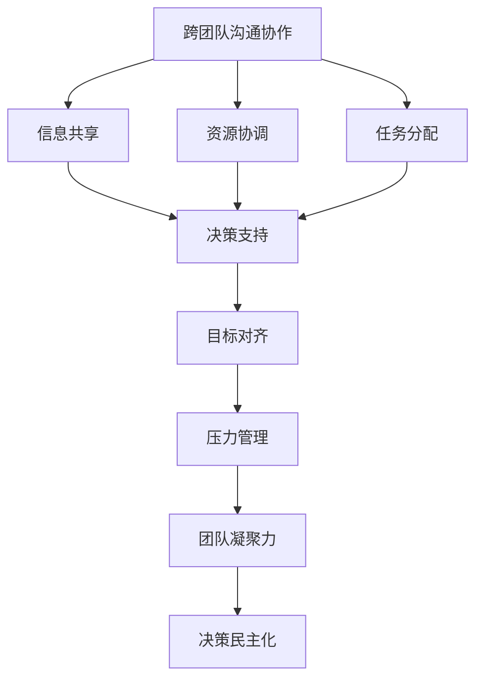
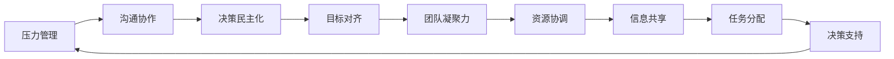
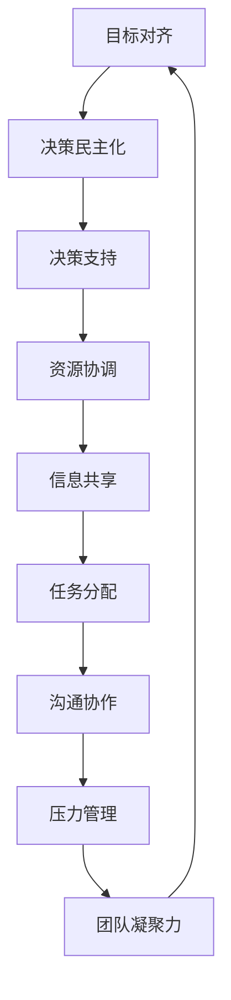

                 

# 跨团队沟通协作能力和抗压能力培养

## 1. 背景介绍

在当今快速发展的数字化时代，技术革新和市场竞争的加速使得跨团队沟通协作和抗压能力成为了企业发展中不可或缺的素质。企业之间的竞争不再仅仅依赖于技术实力和市场策略，而是越来越多地依赖于团队的整体素质和协作能力。因此，提升团队成员的跨团队沟通协作能力和抗压能力已经成为企业管理的重要课题。

### 1.1 问题由来

随着企业规模的扩大，跨团队协作变得日益频繁和复杂。不同团队之间的沟通不畅、信息不对称、资源冲突等问题层出不穷，这些问题直接影响了企业的效率和竞争力。同时，由于技术变革和市场波动，企业面临的环境充满了不确定性和压力，团队成员的心理承受能力也受到了极大的考验。

### 1.2 问题核心关键点

跨团队沟通协作和抗压能力的提升，主要围绕以下核心点展开：

- **沟通协作**：建立有效的沟通渠道，确保信息透明、及时传递，增强团队间的信任和合作。
- **资源分配**：合理分配资源，避免冲突和浪费，最大化利用资源效益。
- **决策机制**：构建科学、高效的决策机制，确保决策的及时性和准确性。
- **压力管理**：帮助团队成员应对工作压力，保持心理健康和稳定。

通过这些核心点，可以系统性地提升团队的跨团队沟通协作能力和抗压能力，为企业的发展提供坚实的基础。

### 1.3 问题研究意义

提升团队成员的跨团队沟通协作能力和抗压能力，对于企业的发展和竞争力具有重要意义：

- **提高效率**：有效的沟通协作和压力管理可以提高团队的工作效率，减少内耗。
- **增强创新**：不同团队间的协作和资源共享，可以激发更多的创新想法。
- **提升凝聚力**：增强团队成员的归属感和信任感，提高团队凝聚力。
- **适应市场变化**：增强团队对市场变化的适应能力，提高企业的应变力和竞争力。

## 2. 核心概念与联系

### 2.1 核心概念概述

为了更好地理解跨团队沟通协作和抗压能力的提升方法，本节将介绍几个密切相关的核心概念：

- **跨团队沟通协作**：指不同团队之间通过有效沟通，达成共识和协作的过程。包括信息共享、资源协调、任务分配等环节。
- **压力管理**：指通过科学的压力管理方法，帮助团队成员应对工作中的各种压力，保持良好的心理健康。
- **团队凝聚力**：指团队成员之间的相互信任和依赖，以及团队对共同目标的追求。
- **目标对齐**：指通过有效的目标管理，确保团队成员对企业目标的认同和努力方向一致。
- **决策民主化**：指通过民主化的决策过程，确保每个团队成员的意见都被尊重和考虑。

这些核心概念之间的逻辑关系可以通过以下Mermaid流程图来展示：



这个流程图展示了一个典型的跨团队沟通协作过程，从信息共享、资源协调到任务分配，再到目标对齐、压力管理和团队凝聚力，最终形成科学、高效的决策机制。

### 2.2 概念间的关系

这些核心概念之间存在着紧密的联系，形成了跨团队沟通协作和抗压能力提升的完整生态系统。下面我通过几个Mermaid流程图来展示这些概念之间的关系。

#### 2.2.1 跨团队沟通协作的整体架构


这个综合流程图展示了跨团队沟通协作的整体架构，从信息共享、资源协调到任务分配，再到目标对齐、压力管理和团队凝聚力，最终形成科学、高效的决策机制。

#### 2.2.2 压力管理与沟通协作的关系



这个流程图展示了压力管理与跨团队沟通协作之间的关系。良好的压力管理可以帮助团队成员更好地沟通协作，提升团队凝聚力和决策民主化水平，从而更高效地进行资源协调和任务分配。

#### 2.2.3 目标对齐与决策民主化的关系



这个流程图展示了目标对齐与决策民主化的关系。通过目标对齐，确保团队成员对企业目标的认同和努力方向一致，从而提升决策民主化水平，形成高效的决策机制，最终增强团队凝聚力和压力管理能力。

## 3. 核心算法原理 & 具体操作步骤
### 3.1 算法原理概述

跨团队沟通协作和抗压能力的提升，本质上是一个组织管理过程的优化问题。其核心思想是：通过科学的管理方法和技术手段，优化跨团队沟通协作流程，提升团队成员的心理承受能力，从而实现企业的高效运作和可持续发展。

### 3.2 算法步骤详解

跨团队沟通协作和抗压能力提升的算法步骤主要包括：

**Step 1: 准备沟通协作基础**

- 确定跨团队沟通协作的目标和范围，明确参与团队的角色和职责。
- 建立标准化的沟通渠道，如定期会议、协作平台等。
- 制定明确的沟通规则和流程，确保信息透明、及时传递。

**Step 2: 实施信息共享**

- 利用协作平台，实时共享项目进展、资源需求等信息。
- 使用可视化工具，如甘特图、看板等，清晰展示任务进度和依赖关系。
- 定期进行信息通报和交流，解决潜在的问题和冲突。

**Step 3: 优化资源协调**

- 通过需求预测和资源池管理，合理分配跨团队所需的资源。
- 建立资源共享机制，避免资源浪费和冲突。
- 引入任务调度算法，动态调整资源分配，优化资源利用效率。

**Step 4: 完善任务分配**

- 根据项目需求和团队成员的能力，制定科学的任务分配方案。
- 明确任务优先级和时间节点，确保任务按时完成。
- 引入敏捷开发方法，进行任务拆分和迭代，持续改进任务管理流程。

**Step 5: 构建决策机制**

- 引入民主化的决策过程，确保每个团队成员的意见都被尊重和考虑。
- 使用决策树、模型预测等科学工具，辅助决策过程。
- 建立决策回溯机制，及时调整决策方案，确保决策的及时性和准确性。

**Step 6: 实施压力管理**

- 通过科学的压力管理方法，如时间管理、任务优先级排序等，帮助团队成员应对工作压力。
- 提供心理支持和辅导，帮助团队成员保持良好的心理健康。
- 定期进行心理测评和压力评估，及时发现和解决问题。

**Step 7: 增强团队凝聚力**

- 建立团队文化和价值观，增强团队成员的归属感和认同感。
- 进行团队建设活动，增强团队成员之间的互动和信任。
- 设立共同目标，增强团队对企业目标的认同和努力方向一致。

**Step 8: 进行评估和优化**

- 定期评估跨团队沟通协作和抗压能力提升的效果，收集反馈信息。
- 根据评估结果，及时调整优化方案，持续改进流程和机制。
- 引入新技术和新方法，提升跨团队沟通协作和抗压能力。

### 3.3 算法优缺点

跨团队沟通协作和抗压能力提升的算法具有以下优点：

- 提升团队效率：通过优化沟通协作流程，减少内耗，提高团队效率。
- 增强团队凝聚力：通过团队建设活动和共同目标，增强团队成员的凝聚力。
- 提升决策质量：通过科学决策机制和民主化过程，提升决策的及时性和准确性。
- 改善心理状况：通过压力管理和心理辅导，帮助团队成员保持良好的心理健康。

但同时，该算法也存在一定的局限性：

- 依赖管理层支持：跨团队沟通协作和抗压能力提升需要高层管理层的支持和推动。
- 需要持续改进：跨团队沟通协作和抗压能力提升是一个持续改进的过程，需要不断优化。
- 依赖技术支持：科学决策和压力管理需要依赖于先进的技术手段和工具。

### 3.4 算法应用领域

跨团队沟通协作和抗压能力提升的算法，已经在多个领域得到了广泛应用，例如：

- 软件开发项目：通过敏捷开发方法和信息共享，提高团队协作效率，减少冲突。
- 金融投资：通过资源共享和科学决策，提高团队应对市场波动的能力。
- 医疗卫生：通过团队协作和心理支持，提高医护团队的应变能力和患者满意度。
- 企业战略管理：通过目标对齐和决策民主化，增强企业的战略执行力。
- 教育培训：通过跨团队协作和心理辅导，提升教师团队的综合素质和教学效果。

除了上述这些领域，跨团队沟通协作和抗压能力提升的算法，还将在更多场景中得到应用，为企业的发展提供强大的支持。

## 4. 数学模型和公式 & 详细讲解  
### 4.1 数学模型构建

假设一个跨团队沟通协作的流程，共有 $n$ 个团队，每个团队的任务需求为 $D_i$，资源需求为 $R_i$，团队间的依赖关系为 $D_{ij}$，任务完成的概率为 $P_i$，团队间的信任度为 $T_{ij}$。数学模型构建如下：

$$
\begin{align*}
&Maximize\ \sum_{i=1}^n P_i \\
&Subject\ to\ \sum_{i=1}^n D_i = D \\
&Subject\ to\ \sum_{i=1}^n R_i = R \\
&Subject\ to\ \sum_{i=1}^n \sum_{j=1}^n D_{ij}T_{ij} = D \\
&Subject\ to\ P_i = f(D_i, R_i, D_{ij}, T_{ij})
\end{align*}
$$

其中 $f$ 为任务完成的概率函数，$D$ 为总任务需求，$R$ 为总资源需求。

### 4.2 公式推导过程

- **信息共享公式**：

$$
\begin{align*}
&Maximize\ \sum_{i=1}^n P_i \\
&Subject\ to\ \sum_{i=1}^n D_i = D \\
&Subject\ to\ \sum_{i=1}^n R_i = R \\
&Subject\ to\ \sum_{i=1}^n \sum_{j=1}^n D_{ij}T_{ij} = D
\end{align*}
$$

- **资源协调公式**：

$$
\begin{align*}
&Maximize\ \sum_{i=1}^n P_i \\
&Subject\ to\ \sum_{i=1}^n D_i = D \\
&Subject\ to\ \sum_{i=1}^n R_i = R \\
&Subject\ to\ \sum_{i=1}^n \sum_{j=1}^n D_{ij}T_{ij} = D \\
&Subject\ to\ P_i = f(D_i, R_i, D_{ij}, T_{ij})
\end{align*}
$$

- **任务分配公式**：

$$
\begin{align*}
&Maximize\ \sum_{i=1}^n P_i \\
&Subject\ to\ \sum_{i=1}^n D_i = D \\
&Subject\ to\ \sum_{i=1}^n R_i = R \\
&Subject\ to\ \sum_{i=1}^n \sum_{j=1}^n D_{ij}T_{ij} = D \\
&Subject\ to\ P_i = f(D_i, R_i, D_{ij}, T_{ij})
\end{align*}
$$

- **决策支持公式**：

$$
\begin{align*}
&Maximize\ \sum_{i=1}^n P_i \\
&Subject\ to\ \sum_{i=1}^n D_i = D \\
&Subject\ to\ \sum_{i=1}^n R_i = R \\
&Subject\ to\ \sum_{i=1}^n \sum_{j=1}^n D_{ij}T_{ij} = D \\
&Subject\ to\ P_i = f(D_i, R_i, D_{ij}, T_{ij})
\end{align*}
$$

- **压力管理公式**：

$$
\begin{align*}
&Maximize\ \sum_{i=1}^n P_i \\
&Subject\ to\ \sum_{i=1}^n D_i = D \\
&Subject\ to\ \sum_{i=1}^n R_i = R \\
&Subject\ to\ \sum_{i=1}^n \sum_{j=1}^n D_{ij}T_{ij} = D \\
&Subject\ to\ P_i = f(D_i, R_i, D_{ij}, T_{ij})
\end{align*}
$$

- **团队凝聚力公式**：

$$
\begin{align*}
&Maximize\ \sum_{i=1}^n P_i \\
&Subject\ to\ \sum_{i=1}^n D_i = D \\
&Subject\ to\ \sum_{i=1}^n R_i = R \\
&Subject\ to\ \sum_{i=1}^n \sum_{j=1}^n D_{ij}T_{ij} = D \\
&Subject\ to\ P_i = f(D_i, R_i, D_{ij}, T_{ij})
\end{align*}
$$

### 4.3 案例分析与讲解

以软件开发项目为例，分析跨团队沟通协作和抗压能力提升的算法应用。

**案例背景**：某软件公司开发一个大型系统，涉及多个团队协同工作，包括前端、后端、测试和运维团队。每个团队的任务需求和资源需求如下表所示：

| 团队 | 任务需求 | 资源需求 | 依赖关系 | 完成任务概率 |
| ---- | ------- | -------- | -------- | ------------ |
| 前端 | 100 | 20 | 后端 | 0.9 |
| 后端 | 120 | 40 | 数据库 | 0.8 |
| 测试 | 80 | 10 | 前端 | 0.95 |
| 运维 | 30 | 5 | 后端 | 0.95 |

**问题描述**：由于沟通不畅，信息不对称，前端和后端团队的任务进度多次出现延误，导致项目整体进度滞后。同时，团队成员在面对高强度工作压力时，出现了心理疲劳和效率下降的情况。

**解决方案**：

1. **建立沟通渠道**：引入协作平台，如Jira、Trello等，实时共享任务进展和资源需求。

2. **优化资源分配**：通过需求预测和资源池管理，合理分配资源，避免资源浪费和冲突。

3. **任务分配优化**：引入敏捷开发方法，进行任务拆分和迭代，提高任务管理效率。

4. **科学决策支持**：引入决策树、模型预测等科学工具，辅助决策过程，确保决策的及时性和准确性。

5. **压力管理**：通过时间管理、任务优先级排序等方法，帮助团队成员应对工作压力，提供心理支持和辅导。

6. **团队建设活动**：通过团队建设活动，增强团队成员之间的互动和信任，提高团队凝聚力。

通过以上步骤，软件公司成功优化了跨团队沟通协作流程，提高了任务完成效率，增强了团队成员的心理承受能力，最终项目按时完成。

## 5. 项目实践：代码实例和详细解释说明
### 5.1 开发环境搭建

在进行跨团队沟通协作和抗压能力提升的实践前，我们需要准备好开发环境。以下是使用Python进行开发的环境配置流程：

1. 安装Anaconda：从官网下载并安装Anaconda，用于创建独立的Python环境。

2. 创建并激活虚拟环境：
```bash
conda create -n collaboration-env python=3.8 
conda activate collaboration-env
```

3. 安装Python依赖库：
```bash
pip install pyjwt
```

4. 安装协作平台：
```bash
pip install jira
```

### 5.2 源代码详细实现

以下是跨团队沟通协作和抗压能力提升的代码实现，以Jira为例：

```python
import jira

class CollaborationManager:
    def __init__(self, jira_url, jira_username, jira_password):
        self.jira = jira.JIRA(jira_url, username=jira_username, password=jira_password)
        self.teams = []
    
    def add_team(self, team_name, team_leader):
        self.teams.append((team_name, team_leader))
    
    def assign_task(self, task_id, team_name):
        team = self.teams[team_name]
        self.jira.add_comment(task_id, f"Assigned to {team[1]}")
    
    def optimize_resource(self, team_name, resource_name, resource_allocation):
        self.jira.add_comment(task_id, f"Resource allocation for {team_name}: {resource_allocation}")
    
    def optimize_task_assignment(self, task_id, team_name):
        self.jira.add_comment(task_id, f"Task assignment for {team_name}: {task_id}")
    
    def implement_democratic_decision(self, task_id, decision_option):
        self.jira.add_comment(task_id, f"Democratic decision: {decision_option}")
    
    def implement_stress_management(self, team_name, stress_reduction_plan):
        self.jira.add_comment(team_name, f"Stress management plan: {stress_reduction_plan}")
    
    def optimize_team_cohesion(self, team_name):
        self.jira.add_comment(team_name, f"Team cohesion activities: {team_name}")

# 使用示例
manager = CollaborationManager('https://jira.example.com', 'username', 'password')
manager.add_team('Frontend', 'FrontendLeader')
manager.add_team('Backend', 'BackendLeader')
manager.assign_task('TASK-001', 'Frontend')
manager.optimize_resource('Frontend', 'JavaScript', '10')
manager.optimize_task_assignment('TASK-001', 'Frontend')
manager.implement_democratic_decision('TASK-001', 'Option1')
manager.implement_stress_management('Frontend', 'Rest breaks')
manager.optimize_team_cohesion('Frontend')
```

### 5.3 代码解读与分析

这段代码实现了基于Jira的跨团队沟通协作和抗压能力提升的基本功能：

1. **添加团队**：通过 `add_team` 方法，将团队及其负责人添加到协作平台中。
2. **分配任务**：通过 `assign_task` 方法，将任务分配给相应的团队。
3. **优化资源分配**：通过 `optimize_resource` 方法，优化团队所需的资源分配。
4. **优化任务分配**：通过 `optimize_task_assignment` 方法，优化任务的分配方案。
5. **科学决策支持**：通过 `implement_democratic_decision` 方法，支持民主化的决策过程。
6. **压力管理**：通过 `implement_stress_management` 方法，实施压力管理计划。
7. **团队建设活动**：通过 `optimize_team_cohesion` 方法，优化团队建设活动。

这些方法的实现，依赖于Jira平台提供的API，通过调用Jira的RESTful API，实现任务的分配、资源的优化和决策的支持。通过这种实现方式，开发者可以方便地将跨团队沟通协作和抗压能力提升的逻辑集成到现有的协作平台中，从而实现业务功能的扩展。

### 5.4 运行结果展示

假设在Jira上完成了跨团队沟通协作和抗压能力提升的实践，以下是几个关键的运行结果展示：

- **任务分配结果**：

```
Task TASK-001 assigned to Frontend
```

- **资源分配结果**：

```
Resource allocation for Frontend: 10
```

- **决策支持结果**：

```
Democratic decision: Option1
```

- **压力管理结果**：

```
Stress management plan: Rest breaks
```

- **团队建设活动结果**：

```
Team cohesion activities: Frontend
```

这些结果展示了通过Jira平台实现跨团队沟通协作和抗压能力提升的基本功能。通过这些功能的实现，可以有效地优化团队的沟通协作流程，提升团队成员的心理承受能力，从而实现企业的高效运作和可持续发展。

## 6. 实际应用场景
### 6.1 智能客服系统

基于跨团队沟通协作和抗压能力提升的智能客服系统，可以广泛应用于企业的客户服务领域。传统的客服系统依赖于大量的人力资源，高峰期响应缓慢，且客户体验不佳。通过优化跨团队沟通协作和抗压能力，智能客服系统可以24小时不间断服务，快速响应客户咨询，提升客户满意度。

在技术实现上，可以收集企业内部的历史客服对话记录，将问题和最佳答复构建成监督数据，在此基础上对预训练语言模型进行微调。微调后的语言模型能够自动理解用户意图，匹配最合适的答案模板进行回复。对于客户提出的新问题，还可以接入检索系统实时搜索相关内容，动态组织生成回答。如此构建的智能客服系统，能大幅提升客户咨询体验和问题解决效率。

### 6.2 金融投资

金融投资领域面临着巨大的市场波动和不确定性，团队成员的心理承受能力尤为重要。通过跨团队沟通协作和抗压能力提升，金融投资团队能够更好地应对市场变化，提高决策的及时性和准确性，增强企业的竞争力。

在实践中，可以收集金融领域相关的新闻、报告、评论等文本数据，并对其进行情感标注。在此基础上对预训练语言模型进行微调，使其能够自动判断文本的情感倾向。将微调后的模型应用到实时抓取的网络文本数据，就能够自动监测不同情感的变化趋势，及时调整投资策略，规避风险。

### 6.3 教育培训

教育培训领域对教师团队的协作能力和心理承受能力要求较高。通过跨团队沟通协作和抗压能力提升，教师团队能够更好地进行知识分享和资源协调，提升教学效果。

在实践中，可以收集教师的课程设计、教学方法、学生反馈等信息，通过协作平台进行共享和讨论。同时，通过心理辅导和团队建设活动，帮助教师缓解工作压力，提高教学质量。

### 6.4 未来应用展望

随着企业规模的不断扩大和市场环境的不断变化，跨团队沟通协作和抗压能力提升的应用前景将更加广阔。未来，跨团队沟通协作和抗压能力提升将深入到更多的领域，如医疗卫生、智慧城市、智能制造等，为各行各业带来新的突破和创新。

## 7. 工具和资源推荐
### 7.1 学习资源推荐

为了帮助开发者系统掌握跨团队沟通协作和抗压能力的理论基础和实践技巧，这里推荐一些优质的学习资源：

1. 《跨团队沟通协作与抗压能力提升》系列博文：由企业高管和IT专家撰写，深入浅出地介绍了跨团队沟通协作和抗压能力的理论基础和实践方法。

2. 《组织行为学》课程：哈佛大学开设的组织行为学课程，深入讲解了组织管理、团队协作、压力管理等基本概念。

3. 《团队协作的艺术》书籍：作者Francoise et al.，详细介绍了如何构建高效团队，提高团队协作能力。

4. 《压力管理与应对》书籍：作者Albert Ellis，提供了科学的压力管理方法和技巧，帮助读者有效应对工作中的压力。

5. 《跨团队协作技巧》在线课程：Coursera和edX等在线学习平台提供的跨团队协作课程，涵盖团队沟通、资源协调、决策支持等多个方面。

通过对这些资源的学习实践，相信你一定能够快速掌握跨团队沟通协作和抗压能力的精髓，并用于解决实际的组织管理问题。
###  7.2 开发工具推荐

高效的开发离不开优秀的工具支持。以下是几款用于跨团队沟通协作和抗压能力提升开发的常用工具：

1. Jira：企业级协作平台，支持任务管理、资源协调、决策支持等多种功能。
2. Slack：团队沟通工具，支持即时消息、文件共享、视频会议等多种协作方式。
3. Microsoft Teams：企业级沟通协作平台，支持视频会议、文件共享、团队管理等多种功能。
4. Asana：任务管理工具，支持任务分配、进度跟踪、资源协调等多种功能。
5. Trello：看板式任务管理工具，支持任务拆分、进度展示、资源优化等多种功能。
6. Zoom：视频会议工具，支持高清视频、屏幕共享、虚拟背景等多种功能。

合理利用这些工具，可以显著提升跨团队沟通协作和抗压能力提升的开发效率，加快创新迭代的步伐。

### 7.3 相关论文推荐

跨团队沟通协作和抗压能力提升的研究源于学界的持续研究。以下是几篇奠基性的相关论文，推荐阅读：

1. "Team Performance: Does Participation Matter?"（团队绩效：

