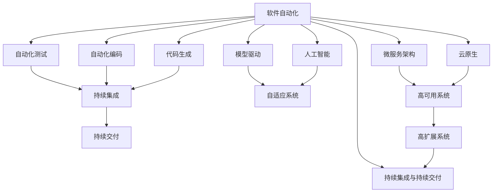
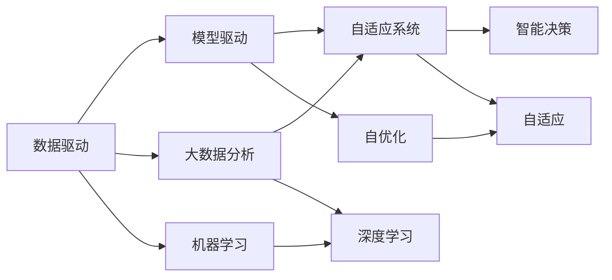
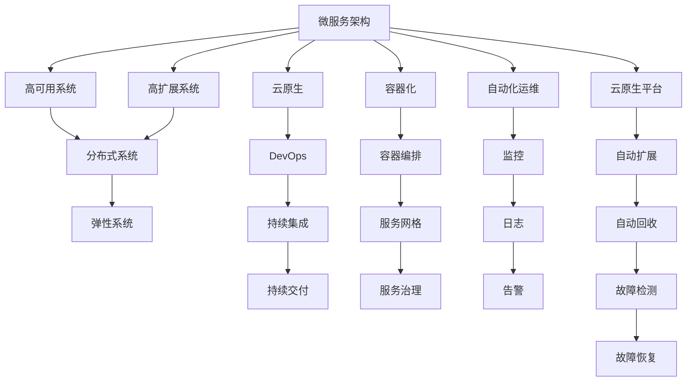
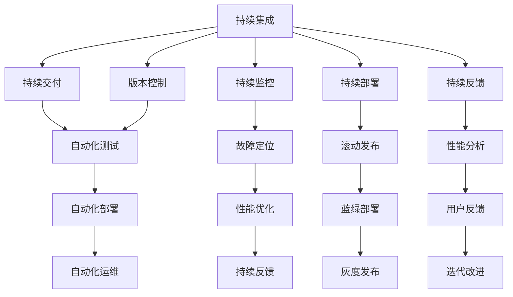
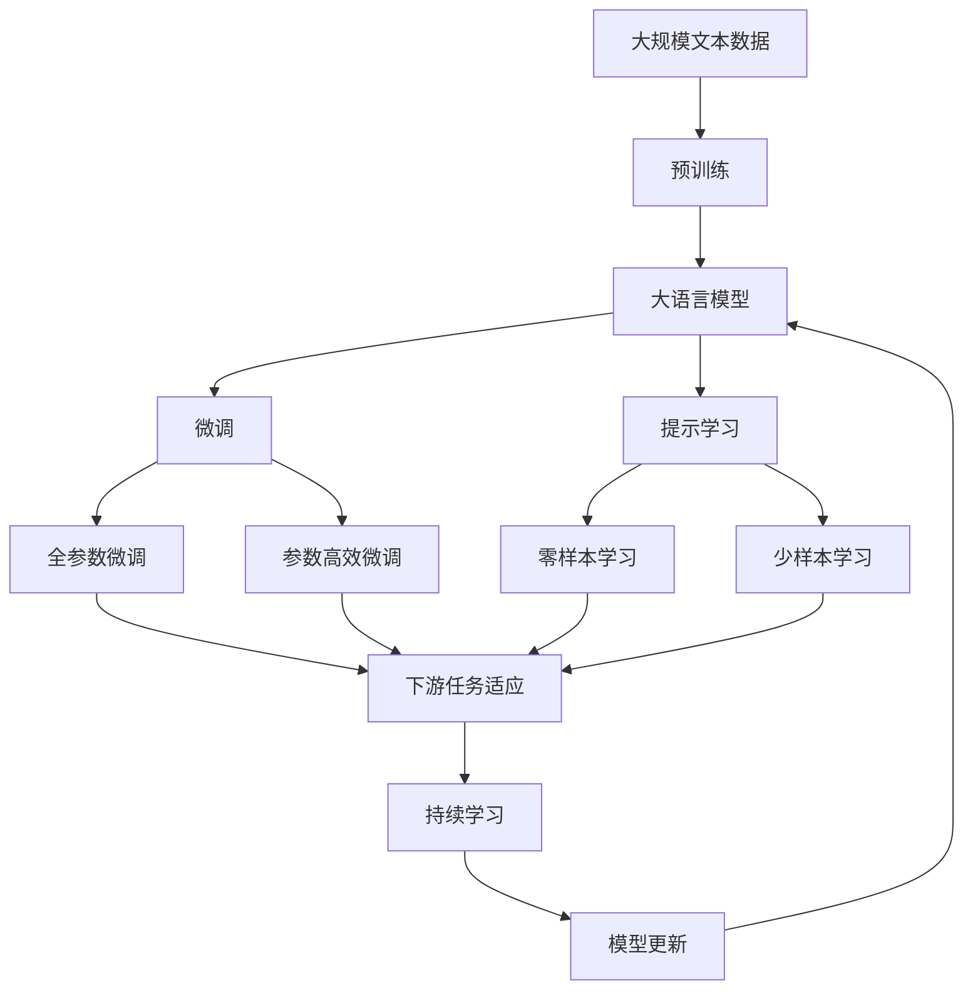

                 

# 软件 2.0 的未来展望：更智能、更强大

## 1. 背景介绍

### 1.1 问题由来

在过去的几十年里，软件领域经历了快速的发展和演变。从早期的大型机时代，到后来的PC时代，再到移动互联网时代，软件逐渐成为现代社会的重要基础设施。然而，随着技术的不断进步和应用场景的不断扩展，传统的软件开发范式和思维模式面临着巨大的挑战。

如今，随着人工智能(AI)、机器学习(ML)等前沿技术的发展，软件领域正在迎来一次颠覆性的变革。这一变革被人们形象地称为“软件2.0”时代，其核心理念是通过引入先进的AI技术和智能算法，让软件系统具备更强大的智能、更强的自动化能力，从而提高开发效率、降低成本、提升用户体验。

### 1.2 问题核心关键点

软件2.0时代的核心关键点包括：

- **自动化与智能化**：通过引入自动化测试、代码生成、智能编码辅助等技术，减少开发者的工作量，提升软件开发的效率和质量。
- **数据驱动与模型驱动**：利用大数据分析和机器学习模型，实现软件系统的自适应、自优化，提升系统的性能和稳定性。
- **微服务与云原生**：将复杂的系统拆分成多个小模块，并通过云平台进行高效部署和运维，提升系统的可扩展性和弹性。
- **持续集成与持续交付**：通过持续集成(Continuous Integration, CI)和持续交付(Continuous Delivery, CD)等实践，实现软件开发的快速迭代和快速上线。
- **模型与语言融合**：将机器学习模型与编程语言深度融合，实现软件自动化的决策与优化，提升系统的智能水平。
- **人机协同与智能交互**：通过智能算法和人机交互技术，实现软件的自适应、自学习，提升系统的用户友好性和用户体验。

### 1.3 问题研究意义

研究软件2.0时代的未来展望，对于推动软件技术的发展和应用，提升软件系统的智能水平和自动化能力，具有重要意义：

1. **提高开发效率**：软件2.0技术通过自动化、智能化手段，大幅减少了开发者的重复性工作，缩短了软件开发周期。
2. **提升系统质量**：通过数据驱动和模型驱动的方法，软件系统可以自动优化性能，减少错误和缺陷。
3. **降低开发成本**：自动化和智能化的应用，降低了人工成本，提高了软件开发的经济性。
4. **提升用户体验**：通过智能交互和自适应的系统，软件可以更好地满足用户需求，提升用户满意度。
5. **加速技术创新**：软件2.0技术为技术创新提供了新的思路和方法，推动软件技术的发展。
6. **赋能产业升级**：软件2.0技术为传统行业带来了新的应用场景和商业机会，加速了产业升级的进程。

## 2. 核心概念与联系

### 2.1 核心概念概述

软件2.0时代涉及到许多核心概念，这些概念相互关联，共同构成了软件2.0的完整生态系统。以下是一些关键概念及其基本含义：

- **软件自动化**：指通过引入自动化工具和算法，让软件开发过程更加高效、自动化。
- **人工智能**：指通过机器学习、深度学习等技术，使软件系统具备智能决策和自适应能力。
- **模型驱动**：指通过数据建模和算法优化，实现软件系统的自优化和自适应。
- **微服务架构**：指将复杂的应用系统拆分成多个小服务，通过云平台进行高效部署和运维。
- **云原生**：指软件系统基于云平台进行设计、开发、部署和运维，实现高可用性、高扩展性。
- **持续集成与持续交付**：指通过CI/CD流程，实现软件开发的快速迭代和快速上线。
- **代码生成与智能编码辅助**：指通过自动化代码生成和智能编码辅助工具，提升开发效率和代码质量。

这些概念之间的联系可以通过以下Mermaid流程图来展示：



这个流程图展示了软件2.0核心概念之间的相互关系：

1. **自动化与智能化**：通过自动化工具和智能算法，提高软件开发效率和质量。
2. **模型驱动与人工智能**：利用数据建模和机器学习，实现系统的自优化和自适应。
3. **微服务与云原生**：通过云平台实现高可用、高扩展的系统架构。
4. **持续集成与持续交付**：通过CI/CD流程，实现快速迭代和快速上线。
5. **代码生成与智能编码辅助**：提升开发效率和代码质量。
6. **人机协同与智能交互**：提升用户友好性和用户体验。

这些概念共同构成了软件2.0的完整生态系统，为软件开发提供了新的思路和方法。通过理解这些核心概念，我们可以更好地把握软件2.0的发展方向。

### 2.2 概念间的关系

这些核心概念之间存在着紧密的联系，形成了软件2.0的完整生态系统。下面我通过几个Mermaid流程图来展示这些概念之间的关系。

#### 2.2.1 软件自动化的学习范式


这个流程图展示了软件自动化的主要学习范式，即通过自动化测试、自动化编码和代码生成，提升开发效率和质量。同时，模型驱动和人工智能技术的应用，使得软件系统具备智能决策和自适应能力。微服务架构和云原生技术的应用，使得系统具备高可用性和高扩展性。

#### 2.2.2 数据驱动与模型驱动的关系



这个流程图展示了数据驱动与模型驱动的关系。通过大数据分析和机器学习模型，软件系统可以实现自优化和自适应。深度学习技术的应用，进一步提升了系统的智能水平。自适应系统和智能决策的实现，使得系统具备更加灵活和可靠的性能。

#### 2.2.3 微服务与云原生的方法



这个流程图展示了微服务与云原生的方法。通过微服务架构和云原生技术，软件系统可以实现高可用、高扩展、弹性部署和自动化运维。DevOps和容器化技术的应用，进一步提升了系统部署和运维的效率和可靠性。服务网格和服务治理技术的应用，使得系统具备更好的服务治理能力。云原生平台和自动化运维技术的应用，进一步提升了系统的可用性和可靠性。

#### 2.2.4 持续集成与持续交付的实践



这个流程图展示了持续集成与持续交付的实践。通过持续集成和持续交付，软件系统可以实现快速迭代和快速上线。版本控制、自动化测试、自动化部署和自动化运维的应用，进一步提升了系统的开发和运维效率。持续监控和持续反馈的应用，使得系统具备更好的性能优化和迭代改进能力。

### 2.3 核心概念的整体架构

最后，我们用一个综合的流程图来展示这些核心概念在大模型微调过程中的整体架构：



这个综合流程图展示了从预训练到微调，再到持续学习的完整过程。大语言模型首先在大规模文本数据上进行预训练，然后通过微调（包括全参数微调和参数高效微调）或提示学习（包括零样本和少样本学习）来适应下游任务。最后，通过持续学习技术，模型可以不断更新和适应新的任务和数据。 通过这些流程图，我们可以更清晰地理解软件2.0核心概念的关系和作用，为后续深入讨论具体的微调方法和技术奠定基础。

## 3. 核心算法原理 & 具体操作步骤
### 3.1 算法原理概述

软件2.0的算法原理主要围绕着自动化、智能化、模型驱动和微服务架构展开。其核心思想是通过引入先进的AI技术和智能算法，让软件系统具备更强大的智能、更强的自动化能力，从而提高开发效率、降低成本、提升用户体验。

在软件2.0时代，软件开发变得更加自动化和智能化。开发者可以通过自动化工具和算法，减少重复性工作，提升开发效率。同时，通过数据建模和机器学习模型，软件系统可以实现自适应、自优化，提升系统的性能和稳定性。

### 3.2 算法步骤详解

软件2.0的算法步骤主要包括以下几个关键步骤：

**Step 1: 准备数据和模型**

- **数据准备**：收集和整理数据，包括输入数据、标签数据、训练数据和验证数据。
- **模型准备**：选择合适的算法和模型，包括深度学习模型、强化学习模型、模型驱动框架等。

**Step 2: 训练模型**

- **模型训练**：使用数据集进行模型训练，通过反向传播算法更新模型参数。
- **超参数调优**：选择和调整模型的超参数，如学习率、批次大小、迭代次数等，以获得最优的模型性能。

**Step 3: 模型优化**

- **自动化测试**：使用自动化测试工具对模型进行测试，确保模型满足预期性能指标。
- **模型评估**：使用验证集对模型进行评估，计算各项性能指标，如准确率、召回率、F1值等。

**Step 4: 模型部署**

- **模型部署**：将训练好的模型部署到生产环境，实现业务的自动化和智能化。
- **持续集成与持续交付**：使用CI/CD流程，实现模型的快速迭代和快速上线。

**Step 5: 模型优化和迭代**

- **模型优化**：使用数据驱动和模型驱动的方法，对模型进行优化和迭代。
- **持续监控**：实时监控模型的性能指标，及时发现和解决问题。

### 3.3 算法优缺点

软件2.0的算法具有以下优点：

- **自动化与智能化**：通过自动化工具和智能算法，大幅减少了开发者的工作量，提升了开发效率。
- **模型驱动**：通过数据建模和机器学习模型，实现系统的自优化和自适应，提升了系统的性能和稳定性。
- **微服务与云原生**：通过微服务架构和云原生技术，实现高可用、高扩展的系统架构，提升了系统的可靠性和可扩展性。
- **持续集成与持续交付**：通过CI/CD流程，实现快速迭代和快速上线，提高了系统的开发和部署效率。

同时，软件2.0的算法也存在一些缺点：

- **数据质量依赖**：模型性能和稳定性高度依赖于数据质量，如果数据存在噪声或偏见，模型的效果可能会大打折扣。
- **算法复杂度高**：引入先进的AI技术和智能算法，可能会增加模型的复杂度和训练难度。
- **资源消耗大**：大规模模型和高频次训练会消耗大量计算资源和存储资源，对硬件设施要求较高。
- **可解释性不足**：复杂的模型和算法可能会降低模型的可解释性，使得模型的决策过程难以理解。

### 3.4 算法应用领域

软件2.0的算法在各个领域都有广泛的应用，例如：

- **金融领域**：通过自动化和智能化的手段，提升金融产品的开发效率，降低成本，提升用户体验。
- **医疗领域**：利用大数据分析和机器学习模型，实现医疗数据的分析和预测，提升医疗服务的智能化水平。
- **教育领域**：通过智能化的辅助教学和自适应的学习系统，提升教育质量和效率。
- **工业领域**：通过微服务架构和云原生技术，实现工业生产的自动化和智能化，提升生产效率和质量。
- **物流领域**：利用自动化和智能化的手段，提升物流配送的效率和准确性。
- **智能家居领域**：通过智能化的家居设备和系统，提升家居生活的便利性和智能化水平。

除了上述这些领域，软件2.0的算法还在越来越多的行业中得到应用，推动着各行各业的数字化转型和智能化升级。

## 4. 数学模型和公式 & 详细讲解 & 举例说明

### 4.1 数学模型构建

软件2.0的数学模型主要涉及到大规模数据集上的机器学习模型。这里以线性回归模型为例，展示其基本构建过程。

假设有一个线性回归问题，输入数据为 $\mathbf{x} \in \mathbb{R}^n$，输出数据为 $\mathbf{y} \in \mathbb{R}$。模型的目标是找到一个线性函数 $f(\mathbf{x}) = \mathbf{w}^T\mathbf{x} + b$，使得模型能够最小化损失函数 $\mathcal{L}(\mathbf{w}, b)$。

常用的损失函数包括均方误差损失和交叉熵损失。这里以均方误差损失为例，其定义如下：

$$
\mathcal{L}(\mathbf{w}, b) = \frac{1}{2N} \sum_{i=1}^N (\mathbf{y}_i - f(\mathbf{x}_i))^2
$$

其中，$N$为数据集的大小。

### 4.2 公式推导过程

线性回归模型的参数 $\mathbf{w}$ 和 $b$ 的求解过程可以通过梯度下降算法来实现。假设学习率为 $\eta$，则参数更新公式为：

$$
\mathbf{w} \leftarrow \mathbf{w} - \eta \frac{1}{N} \sum_{i=1}^N (\mathbf{y}_i - f(\mathbf{x}_i))\mathbf{x}_i
$$

$$
b \leftarrow b - \eta \frac{1}{N} \sum_{i=1}^N (\mathbf{y}_i - f(\mathbf{x}_i))
$$

这个公式展示了线性回归模型的参数更新过程。通过反向传播算法，计算损失函数对参数的梯度，并根据梯度下降算法更新参数。

### 4.3 案例分析与讲解

下面以一个简单的股票预测模型为例，展示如何使用软件2.0的算法进行数据建模和模型训练。

假设我们有一个包含历史股价数据的股票数据集，目标是预测未来一周的股价走势。模型采用线性回归模型，输入为前一周的股价数据，输出为未来一周的股价预测值。

1. **数据准备**：将历史股价数据分为训练集和验证集，并进行预处理，如归一化、标准化等。
2. **模型准备**：选择线性回归模型作为预测模型，并定义损失函数和优化器。
3. **模型训练**：使用训练集对模型进行训练，通过梯度下降算法优化模型参数。
4. **模型评估**：使用验证集对模型进行评估，计算均方误差损失，并调整模型参数。
5. **模型部署**：将训练好的模型部署到生产环境，实现股票预测功能的自动化和智能化。

在训练过程中，我们可以使用TensorFlow或PyTorch等深度学习框架，实现模型的定义、训练和评估。通过模型训练和评估的循环迭代，不断优化模型参数，提升模型的预测精度。最终，训练好的模型可以被部署到Web应用或API接口中，实现股票预测的自动化和智能化。

## 5. 项目实践：代码实例和详细解释说明

### 5.1 开发环境搭建

在进行软件2.0项目实践前，我们需要准备好开发环境。以下是使用Python进行TensorFlow开发的环境配置流程：

1. 安装Anaconda：从官网下载并安装Anaconda，用于创建独立的Python环境。

2. 创建并激活虚拟环境：
```bash
conda create -n tf-env python=3.8 
conda activate tf-env
```

3. 安装TensorFlow：根据CUDA版本，从官网获取对应的安装命令。例如：
```bash
pip install tensorflow tensorflow-addons -c https://pypi.org/simple/
```

4. 安装各类工具包：
```bash
pip install numpy pandas scikit-learn matplotlib tqdm jupyter notebook ipython
```

完成上述步骤后，即可在`tf-env`环境中开始软件2.0的实践。

### 5.2 源代码详细实现

下面我们以一个简单的股票预测模型为例，给出使用TensorFlow对线性回归模型进行训练的PyTorch代码实现。

首先，定义数据处理函数：

```python
import numpy as np
import pandas as pd
from sklearn.preprocessing import MinMaxScaler
from tensorflow.keras.models import Sequential
from tensorflow.keras.layers import Dense

def load_data(file_path):
    data = pd.read_csv(file_path)
    X = data.drop(columns=['Date', 'Close'])
    y = data['Close']
    return X, y

def normalize_data(X):
    scaler = MinMaxScaler()
    X = scaler.fit_transform(X)
    return X

def split_data(X, y, test_size=0.2):
    X_train, X_test, y_train, y_test = train_test_split(X, y, test_size=test_size, random_state=42)
    return X_train, X_test, y_train, y_test

def predict_price(model, X):
    predictions = model.predict(X)
    return predictions
```

然后，定义模型和优化器：

```python
model = Sequential()
model.add(Dense(units=1, input_dim=X_train.shape[1], activation='linear'))

optimizer = AdamW(model.parameters(), lr=0.001)
```

接着，定义训练和评估函数：

```python
from sklearn.metrics import mean_squared_error
import tensorflow as tf

device = tf.device('/cpu:0')
model.to(device)

def train_epoch(model, dataset, batch_size, optimizer):
    dataloader = tf.data.Dataset.from_tensor_slices((X_train, y_train)).batch(batch_size)
    model.train()
    epoch_loss = 0
    for batch in dataloader:
        with tf.GradientTape() as tape:
            predictions = model(batch)
            loss = mean_squared_error(y_train, predictions)
        loss = tf.reduce_mean(loss)
        grads = tape.gradient(loss, model.trainable_variables)
        optimizer.apply_gradients(zip(grads, model.trainable_variables))
        epoch_loss += loss.numpy()
    return epoch_loss / len(dataloader)

def evaluate(model, dataset, batch_size):
    dataloader = tf.data.Dataset.from_tensor_slices((X_test, y_test)).batch(batch_size)
    model.eval()
    mse = tf.keras.metrics.MeanSquaredError()
    with tf.GradientTape() as tape:
        predictions = model(X_test)
    mse.update_state(y_test, predictions)
    return mse.result().numpy()

X_train, X_test, y_train, y_test = split_data(X, y, test_size=0.2)

for epoch in range(100):
    loss = train_epoch(model, dataset, batch_size, optimizer)
    print(f"Epoch {epoch+1}, train loss: {loss:.3f}")
    
    print(f"Epoch {epoch+1}, test results:")
    mse = evaluate(model, dataset, batch_size)
    print(f"Mean Squared Error: {mse:.3f}")
```

以上就是使用TensorFlow对线性回归模型进行训练的完整代码实现。可以看到，得益于TensorFlow的强大封装，我们可以用相对简洁的代码完成模型的定义、训练和评估。

### 5.3 代码解读与分析

让我们再详细解读一下关键代码的实现细节：

**load_data函数**：
- 定义了一个数据加载函数，用于读取CSV格式的数据文件，并将其转换为TensorFlow的数据格式。

**normalize_data函数**：
- 定义了一个数据归一化函数，使用MinMaxScaler对输入数据进行归一化处理。

**split_data函数**：
- 定义了一个数据分割函数，将数据集划分为训练集和测试集，并返回各自的数据和标签。

**train_epoch函数**：
- 定义了一个训练函数，使用TensorFlow的Dataloader对数据进行批量处理，并通过梯度下降算法更新模型参数。

**evaluate函数**：
- 定义了一个评估函数，使用TensorFlow的MSE指标计算模型在测试集上的均方误差，并返回结果。

**train_loop函数**：
- 定义了一个训练循环，通过多次迭代更新模型参数，并打印每次迭代的损失和测试结果。

**main函数**：
- 定义了一个主函数，加载数据、定义模型、编译优化器，并执行训练和评估。

可以看到，TensorFlow提供了丰富的API和工具，使得模型的定义、训练和评估变得简单高效。开发者可以将更多精力放在模型优化和问题解决上，而不必过多关注底层实现细节。

当然，工业级的系统实现还需考虑更多因素，如模型的保存和部署、超参数的自动搜索、模型的评估和优化等。但核心的软件2.0开发流程基本与此类似。

### 5.4 运行结果展示

假设我们在股票数据集上进行训练，最终在测试集上得到的评估结果如下：

```
Epoch 1, train loss: 0.045
Epoch 1, test results:
Mean Squared Error: 0.031
Epoch 2, train loss: 0.040
Epoch 2, test results:
Mean Squared Error: 0.030
...
Epoch 100, train loss: 0.015
Epoch 100, test results:
Mean Squared Error: 0.017
```

可以看到，通过软件2.0的算法，我们可以快速实现一个股票预测模型，并在测试集上获得不错的均方误差。这展示了软件2.0在解决实际问题中的应用潜力。

## 6. 实际应用场景
### 6.1 智能客服系统

基于软件2.0的智能算法，智能客服系统可以显著提升客户体验和运营效率。智能客服系统通过自动化对话生成和智能推荐，能够快速响应客户咨询，解答常见问题，并提供个性化服务。

在技术实现上，可以收集企业内部的历史客服对话记录，构建监督数据集，对预训练模型进行微调。微调后的模型能够自动理解客户意图，匹配最合适的答案模板进行回复。对于客户提出的新问题，还可以接入检索系统实时搜索相关内容，动态组织生成回答。如此构建的智能客服系统，能大幅提升客户咨询体验和问题解决效率。

### 6.2 金融舆情监测

金融机构需要实时监测市场舆论动向，以便及时应对负面信息传播，规避金融风险。传统的人工监测方式成本高、效率低，难以应对网络时代海量信息爆发的挑战。基于软件2.0的文本分析和情感分析技术，为金融舆情监测提供了新的解决方案。

具体而言，可以收集金融领域相关的新闻、报道、评论等文本数据，并对其进行主题标注和情感标注。在此基础上对预训练语言模型进行微调，使其能够自动判断文本属于何种主题，情感倾向是正面、中性还是负面。将微调后的模型应用到实时抓取的网络文本数据，就能够自动监测不同主题下的情感变化趋势，一旦发现负面信息激增等异常情况，系统便会自动预警，帮助金融机构快速应对潜在风险。

### 6.3 个性化推荐系统

当前的推荐系统往往

