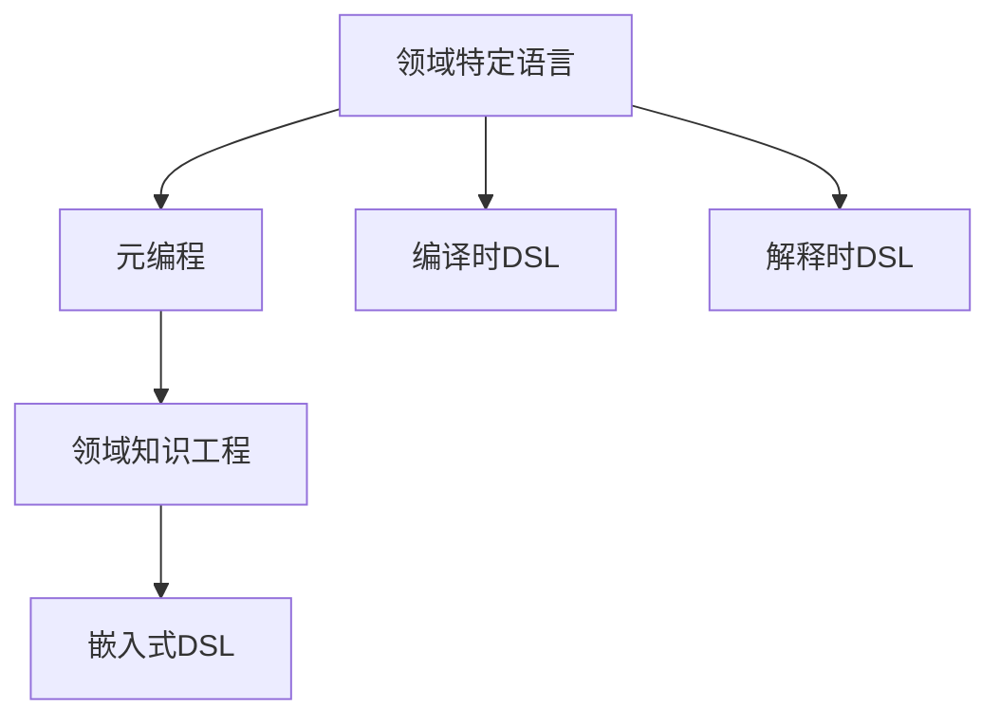
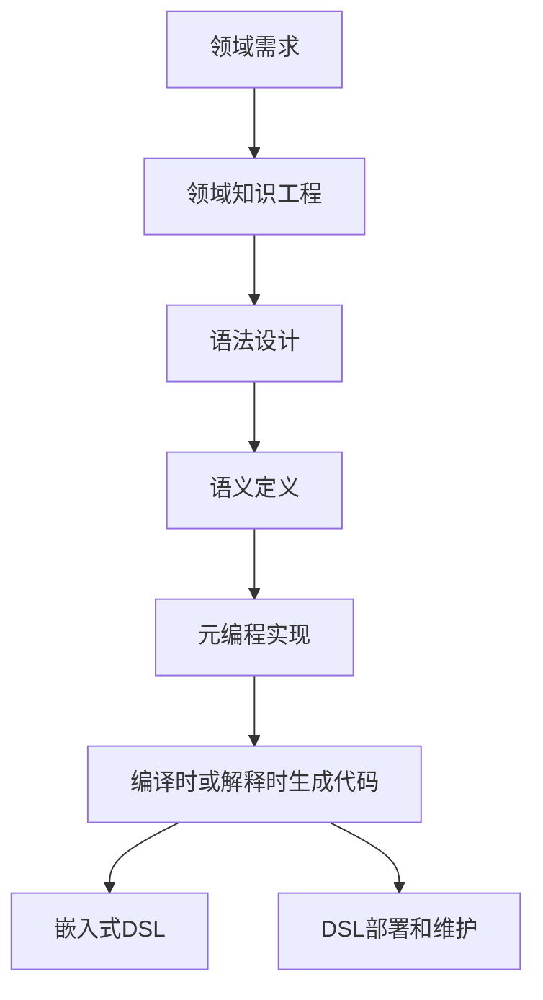

                 

# 软件2.0的领域特定语言设计

## 1. 背景介绍

在软件2.0时代，编程语言和软件框架的重要性愈发凸显。领域特定语言(DSL)，作为一种针对特定领域进行优化的语言，旨在通过减少领域内专家和开发者的沟通鸿沟，提升开发效率和系统性能。然而，传统的DSL设计理念和技术手段，如Lisp的宏系统、Grammarinator的元编程框架、Gollum的DSL compiler，已无法满足现代软件开发的需求。本文将探讨软件2.0时代DSL设计的新趋势和新技术，帮助开发者更高效地构建和应用领域特定语言。

## 2. 核心概念与联系

### 2.1 核心概念概述

为更好地理解软件2.0时代DSL设计的方法，本节将介绍几个密切相关的核心概念：

- **领域特定语言(DSL)**：针对特定领域，结合领域知识，设计定制化的编程语言或工具。DSL可以极大提升领域内专家和开发者的工作效率，减少沟通成本。

- **元编程(Metaprogramming)**：编写程序，生成其他程序的过程。元编程是DSL设计的重要技术手段，它允许开发者自定义语法、语义和运行时规则，从而实现对特定领域的高度定制化。

- **领域知识工程(Knowledge Engineering)**：将领域知识和专家经验转化为可计算模型的过程。领域知识工程是DSL设计的基础，通过抽取领域内的核心概念、规则和数据，设计出适合该领域的语言和工具。

- **嵌入式领域语言(Embedded DSL)**：将DSL嵌入到现有编程语言或框架中，方便开发和维护。嵌入式DSL可以充分利用现有生态系统的优势，提高DSL的可访问性和可用性。

- **编译时DSL(Compiled DSL)**：在编译时生成DSL代码，避免运行时解析的开销。编译时DSL可以提供更快的执行速度和更小的运行时开销，适合对性能有严格要求的场景。

- **解释时DSL(Interpreted DSL)**：在运行时解析DSL代码，灵活性更高。解释时DSL适合需要动态生成和修改代码的场景，但执行速度较慢。

这些核心概念之间的逻辑关系可以通过以下Mermaid流程图来展示：



这个流程图展示了大语言模型微调过程中各个核心概念的关系和作用：

1. 领域特定语言是DSL设计的目标，通过元编程和领域知识工程等手段实现。
2. 元编程允许开发者自定义DSL的语法和语义。
3. 领域知识工程将领域知识和专家经验转化为DSL的组成部分。
4. 嵌入式DSL将DSL嵌入到现有编程语言中，提高DSL的可访问性和可用性。
5. 编译时DSL和解释时DSL是DSL实现的具体技术手段，各有优缺点。

### 2.2 概念间的关系

这些核心概念之间存在着紧密的联系，形成了DSL设计的完整生态系统。下面我通过几个Mermaid流程图来展示这些概念之间的关系。

#### 2.2.1 DSL的设计流程


这个流程图展示了DSL设计的一般流程：

1. 需求分析：收集领域专家的意见，了解该领域的主要需求和特征。
2. 语法设计：根据领域需求，设计DSL的语法结构。
3. 语义定义：定义DSL的语义规则，解释语法如何转化为具体操作。
4. 元编程实现：使用元编程技术，实现DSL的语法和语义转换逻辑。
5. 生成代码：通过元编程生成DSL的代码，或直接在运行时解析执行。
6. 部署和维护：将DSL嵌入到实际应用中，进行部署和持续维护。

#### 2.2.2 DSL与现有框架的关系


这个流程图展示了DSL嵌入现有框架的方式：

1. 现有框架：选择适合该领域的现有编程语言或框架。
2. 嵌入式DSL：将DSL嵌入到现有框架中，形成新的领域特定API。
3. 集成API：将DSL的功能通过API集成到现有框架中，方便调用。
4. 自定义功能：通过DSL实现特定领域的功能模块。
5. 业务逻辑：将DSL功能与业务逻辑结合，形成完整的业务流程。

#### 2.2.3 元编程与DSL的关系


这个流程图展示了元编程在DSL设计中的应用：

1. 领域知识：收集领域内专家和用户的经验知识。
2. 元编程语言：定义元编程语言，用于描述DSL的语法和语义转换逻辑。
3. DSL语法生成：使用元编程语言生成DSL的语法结构。
4. DSL语义实现：定义DSL的语义规则，解释语法如何转化为具体操作。
5. DSL编译或解释执行：通过编译或解释执行DSL代码，实现DSL功能。

### 2.3 核心概念的整体架构

最后，我们用一个综合的流程图来展示这些核心概念在大语言模型微调过程中的整体架构：



这个综合流程图展示了从需求分析到DSL部署的完整过程。领域需求通过领域知识工程，转化为DSL的语法和语义。然后使用元编程技术实现语法和语义转换，生成DSL代码。最后，将DSL嵌入到现有编程语言中，部署到实际应用中，并进行持续维护。通过这些流程图，我们可以更清晰地理解DSL在大语言模型微调过程中各个概念的关系和作用。

## 3. 核心算法原理 & 具体操作步骤

### 3.1 算法原理概述

领域特定语言的设计，本质上是一个多层次、多维度的复杂过程。它涉及到领域知识的抽取、语法和语义的定义、元编程的实现等多个环节。这些环节通过合理的设计和优化，可以实现高效、灵活的DSL。

### 3.2 算法步骤详解

**Step 1: 需求分析**

1. 收集领域专家的意见和建议，了解该领域的核心问题和需求。
2. 进行需求访谈和调研，确定领域内常用的术语、概念和操作。

**Step 2: 领域知识抽取**

1. 抽取领域内的核心概念和规则，如业务流程、数据模型、操作规范等。
2. 将领域知识转化为具体的编程语言元素，如类型、函数、类等。

**Step 3: 语法设计**

1. 根据需求和领域知识，设计DSL的语法结构。
2. 设计语法元素之间的关系，如语法糖、关键字等。

**Step 4: 语义定义**

1. 定义DSL的语义规则，解释语法元素如何转化为具体操作。
2. 设计语义模型，如抽象语法树、语义图等。

**Step 5: 元编程实现**

1. 使用元编程语言或工具，实现DSL的语法和语义转换逻辑。
2. 设计元编程API，方便用户自定义和扩展DSL。

**Step 6: 代码生成**

1. 通过元编程生成DSL的代码，或直接在运行时解析执行。
2. 设计代码生成器，将语法和语义规则转化为具体的代码片段。

**Step 7: 部署和维护**

1. 将DSL嵌入到现有编程语言或框架中，形成新的领域特定API。
2. 提供DSL的集成API，方便用户调用和使用。
3. 持续维护和更新DSL，跟进领域知识的变化和需求的变化。

### 3.3 算法优缺点

领域特定语言设计的优点：

1. 高效性：通过抽象和简化领域内复杂的操作，提高开发效率。
2. 可维护性：DSL的设计基于领域知识，易于理解和维护。
3. 灵活性：DSL可以灵活地适应领域内不同应用场景。

领域特定语言设计的缺点：

1. 学习成本高：DSL需要领域专家的参与和指导，学习门槛较高。
2. 通用性差：DSL的设计依赖于特定领域，难以应用于其他领域。
3. 可扩展性有限：DSL的设计一旦确定，难以进行扩展和更新。

### 3.4 算法应用领域

领域特定语言设计在软件开发中有着广泛的应用。以下是几个常见的应用场景：

1. 数据库查询语言：如SQL，设计用于查询和操作数据库的DSL。
2. 图形编程语言：如Processing，设计用于图形界面开发的DSL。
3. 数据科学工具：如Jupyter Notebook，设计用于数据分析和可视化的DSL。
4. 嵌入式系统编程：如C/C++，设计用于嵌入式设备的DSL。
5. 编程框架：如Spring，设计用于Java应用程序的DSL。

这些应用场景展示了DSL在软件开发中的广泛适用性，通过DSL设计可以极大提升领域内专家和开发者的工作效率。

## 4. 数学模型和公式 & 详细讲解  
### 4.1 数学模型构建

领域特定语言设计的数学模型可以表示为：

$$
\text{DSL} = f(\text{领域知识}, \text{语法设计}, \text{语义定义}, \text{元编程实现})
$$

其中，$f$表示DSL设计的过程，将领域知识、语法设计、语义定义和元编程实现转化为具体的DSL。

### 4.2 公式推导过程

以下我们将通过一个简单的示例，展示领域特定语言设计的数学模型推导过程。

假设我们设计一个用于图形编程的DSL，其中包含一个形状类Shape，以及一个绘制函数draw。

1. 领域知识：图形编程中的形状包括矩形、圆形、三角形等，每个形状都有一个位置、大小、颜色等属性。

2. 语法设计：图形编程DSL的语法包括定义类、定义属性、定义方法等。

3. 语义定义：Shape类的方法draw用于绘制形状，draw方法的具体实现取决于具体的图形类型。

4. 元编程实现：使用元编程语言描述Shape类和draw方法的语法和语义转换逻辑。

5. 代码生成：通过元编程生成DSL的代码，或直接在运行时解析执行。

6. 部署和维护：将DSL嵌入到图形编程框架中，形成新的图形编程API。

### 4.3 案例分析与讲解

下面我们以Processing语言为例，展示领域特定语言设计的实际应用。

Processing是一种用于图形编程的DSL，设计用于简化图形编程的复杂性和抽象层次。Processing包含以下核心组件：

1. Processing语言：基于Java，提供简洁的语法和丰富的图形编程API。
2. Processing框架：提供绘图引擎、多媒体支持等基础功能。
3. Processing库：提供丰富的图形和多媒体组件，方便开发者快速构建应用。

Processing语言的设计体现了领域特定语言设计的精髓，通过简洁的语法和丰富的API，大大降低了图形编程的门槛。开发者只需要掌握简单的编程基础，就能上手使用Processing进行图形编程。Processing框架和库的丰富功能，也极大提升了图形编程的效率和灵活性。

## 5. 项目实践：代码实例和详细解释说明

### 5.1 开发环境搭建

在进行DSL实践前，我们需要准备好开发环境。以下是使用Java进行Processing开发的环境配置流程：

1. 安装Java JDK：从官网下载并安装最新版本的Java JDK，用于构建和运行Processing项目。
2. 安装Eclipse IDE：从官网下载并安装Eclipse IDE，用于开发和调试Processing程序。
3. 安装Processing IDE插件：在Eclipse中安装Processing IDE插件，支持Processing语言的开发。

完成上述步骤后，即可在Eclipse中进行Processing的开发和调试。

### 5.2 源代码详细实现

下面我们以Processing语言为例，展示一个简单的图形编程示例：绘制一个圆形。

```java
void setup() {
  size(640, 360);
  background(0);
}

void draw() {
  fill(255, 0, 0);
  ellipse(100, 100, 50, 50);
}
```

在这个示例中，我们定义了一个setup方法，用于初始化窗口大小和背景颜色。然后定义了一个draw方法，用于绘制圆形。

### 5.3 代码解读与分析

让我们再详细解读一下关键代码的实现细节：

**setup方法**：
- 使用Processing的size方法设置窗口大小。
- 使用Processing的background方法设置背景颜色。

**draw方法**：
- 使用Processing的fill方法设置圆形的填充颜色。
- 使用Processing的ellipse方法绘制圆形。

这个示例展示了Processing语言的简洁语法和丰富的API，通过简单的代码实现了一个基本的功能。开发者只需要掌握基本的语法和API，就能轻松使用Processing进行图形编程。

### 5.4 运行结果展示

运行上述代码，即可在Processing窗口中看到绘制的圆形。这展示了Processing语言的强大功能和易用性。

## 6. 实际应用场景

### 6.1 智能合约开发

领域特定语言设计在智能合约开发中有着广泛的应用。智能合约是基于区块链技术的自动化合约，具有高效、可靠、可执行等特点。通过DSL设计，智能合约可以实现复杂的操作逻辑和业务流程。

在实际应用中，可以使用Solidity语言进行智能合约的开发。Solidity是一种基于区块链的编程语言，设计用于智能合约的开发。Solidity语言通过元编程技术，实现了对区块链底层操作的支持，允许开发者设计复杂的智能合约逻辑。

### 6.2 数据科学工具

领域特定语言设计在数据科学工具中也有着重要的应用。数据科学工具用于数据分析、可视化和机器学习等，帮助开发者进行数据挖掘和模型训练。

在实际应用中，可以使用Python的pandas库进行数据科学开发。pandas是一种基于NumPy的数据分析库，提供了丰富的数据结构和数据处理工具。pandas库通过DSL设计，允许开发者使用简洁的语法和丰富的API，进行高效的数据处理和分析。

### 6.3 嵌入式系统编程

领域特定语言设计在嵌入式系统编程中也有着重要的应用。嵌入式系统编程需要高效的代码生成和优化，通过DSL设计，可以实现高性能的嵌入式程序。

在实际应用中，可以使用C/C++进行嵌入式系统编程。C/C++是一种高性能的编程语言，提供了丰富的硬件操作和系统编程API。C/C++语言通过DSL设计，允许开发者使用简洁的语法和丰富的API，进行高效的系统编程和硬件操作。

## 7. 工具和资源推荐

### 7.1 学习资源推荐

为了帮助开发者系统掌握领域特定语言设计的理论基础和实践技巧，这里推荐一些优质的学习资源：

1. 《Domain-Specific Languages》书籍：详细介绍了领域特定语言的设计原理和应用案例，是理解DSL设计的基础读物。
2. CS350《软件设计与分析》课程：斯坦福大学开设的软件设计课程，涵盖了领域特定语言设计的理论基础和实践技巧。
3. Dangeroo Design Patterns网站：介绍了多种DSL设计模式和最佳实践，提供丰富的学习资源和代码示例。
4. EDSL=eXtensible Domain-Specific Languages网站：提供了丰富的DSL设计工具和资源，帮助开发者设计和实现DSL。
5. Twelf系列工具：包括Twelf语言和工具，用于实现DSL的元编程和语法转换，是理解DSL设计的高级工具。

通过对这些资源的学习实践，相信你一定能够快速掌握领域特定语言设计的精髓，并用于解决实际的领域问题。

### 7.2 开发工具推荐

高效的开发离不开优秀的工具支持。以下是几款用于领域特定语言设计的常用工具：

1. Eclipse IDE：支持多种编程语言的开发，集成了丰富的DSL开发插件，方便调试和测试。
2. IntelliJ IDEA：支持多种编程语言的开发，集成了丰富的DSL开发插件，支持代码生成和元编程。
3. Visual Studio：支持多种编程语言的开发，集成了丰富的DSL开发插件，支持代码生成和元编程。
4. Visual Studio Code：轻量级的开发工具，支持多种编程语言的开发，集成了丰富的DSL开发插件。
5. NetBeans IDE：支持多种编程语言的开发，集成了丰富的DSL开发插件，支持代码生成和元编程。

合理利用这些工具，可以显著提升领域特定语言设计的开发效率，加快创新迭代的步伐。

### 7.3 相关论文推荐

领域特定语言设计的研究源于学界的持续研究。以下是几篇奠基性的相关论文，推荐阅读：

1. "On the Syntax and Semantics of Domain-Specific Languages"（1978年）：美国计算机科学家Brendanier发表的关于DSL的奠基性论文，详细介绍了DSL的设计原理和应用场景。
2. "Type Systems for Domain-Specific Languages"（1995年）：国际著名计算机科学家Ferret发表的关于DSL类型系统的论文，讨论了DSL类型系统的设计原理和实现方法。
3. "Domain-Specific Languages for Programmers"（2013年）：美国计算机科学家Schaefer发表的关于DSL的综述性论文，详细介绍了DSL的设计原理和应用案例。
4. "Domain-Specific Languages: Foundations, Languages, and Tools"（2010年）：国际顶级期刊《IEEE Transactions on Software Engineering》上发表的DSL综述性论文，详细介绍了DSL的设计原理和实现方法。
5. "Software Specification in Domain-Specific Languages"（2015年）：美国计算机科学家D关心发表的关于DSL的论文，讨论了DSL在软件规格说明中的应用。

这些论文代表了大语言模型微调技术的发展脉络。通过学习这些前沿成果，可以帮助研究者把握学科前进方向，激发更多的创新灵感。

除上述资源外，还有一些值得关注的前沿资源，帮助开发者紧跟领域特定语言设计的最新进展，例如：

1. arXiv论文预印本：人工智能领域最新研究成果的发布平台，包括大量尚未发表的前沿工作，学习前沿技术的必读资源。
2. 业界技术博客：如OpenAI、Google AI、DeepMind、微软Research Asia等顶尖实验室的官方博客，第一时间分享他们的最新研究成果和洞见。
3. 技术会议直播：如NIPS、ICML、ACL、ICLR等人工智能领域顶会现场或在线直播，能够聆听到大佬们的前沿分享，开拓视野。
4. GitHub热门项目：在GitHub上Star、Fork数最多的DSL相关项目，往往代表了该技术领域的发展趋势和最佳实践，值得去学习和贡献。
5. 行业分析报告：各大咨询公司如McKinsey、PwC等针对DSL领域的分析报告，有助于从商业视角审视技术趋势，把握应用价值。

总之，对于领域特定语言设计的学习，需要开发者保持开放的心态和持续学习的意愿。多关注前沿资讯，多动手实践，多思考总结，必将收获满满的成长收益。

## 8. 总结：未来发展趋势与挑战

### 8.1 总结

本文对领域特定语言设计的理论基础和实践技巧进行了全面系统的介绍。首先阐述了领域特定语言设计的背景和意义，明确了DSL在提升领域内专家和开发者工作效率方面的独特价值。其次，从原理到实践，详细讲解了领域特定语言设计的数学模型和关键步骤，给出了DSL开发实践的完整代码实例。同时，本文还广泛探讨了DSL设计在智能合约、数据科学、嵌入式系统等领域的广泛应用，展示了DSL设计的巨大潜力。最后，本文精选了DSL设计的各类学习资源，力求为开发者提供全方位的技术指引。

通过本文的系统梳理，可以看到，领域特定语言设计正在成为软件开发的重要范式，极大地提升了领域内专家和开发者的工作效率。领域特定语言设计的广泛应用，使得开发、测试和维护等各个环节的效率都得到了显著提升。未来，伴随领域知识工程、元编程技术等领域的不断进步，相信DSL设计将会有更多的创新和突破。

### 8.2 未来发展趋势

展望未来，领域特定语言设计将呈现以下几个发展趋势：

1. 自动化设计：使用机器学习和人工智能技术，自动设计和优化DSL，降低人工设计的复杂度和成本。
2. 语义增强：通过引入语义工程和语义增强技术，提升DSL的语义表达能力和应用范围。
3. 跨领域整合：将DSL设计与其他领域的最佳实践和技术手段进行整合，提升DSL的通用性和可扩展性。
4. 元编程演进：使用更先进的元编程技术和工具，提升DSL的元编程能力和性能。
5. 编程语言融合：将DSL与现有的编程语言进行深度融合，提升DSL的可访问性和可用性。

以上趋势凸显了领域特定语言设计的广阔前景。这些方向的探索发展，必将进一步提升领域内专家和开发者的工作效率，带来更多的创新和突破。

### 8.3 面临的挑战

尽管领域特定语言设计已经取得了瞩目成就，但在迈向更加智能化、普适化应用的过程中，它仍面临着诸多挑战：

1. 学习曲线陡峭：DSL的设计和实现需要领域专家的指导，学习成本较高。
2. 维护成本高昂：DSL的设计依赖于特定领域，难以进行跨领域迁移和更新。
3. 标准和规范缺失：DSL设计缺乏统一的标准和规范，导致不同DSL之间互操作性差。
4. 系统安全性问题：DSL设计需要考虑系统的安全性问题，避免恶意代码注入等风险。
5. 应用场景限制：DSL设计依赖于特定领域，难以在通用领域内广泛应用。

正视领域特定语言设计面临的这些挑战，积极应对并寻求突破，将使DSL设计更加成熟和实用。相信随着学界和产业界的共同努力，这些挑战终将一一被克服，领域特定语言设计必将在构建高效、灵活、可维护的领域应用中发挥更大的作用。

### 8.4 未来突破

面对领域特定语言设计所面临的种种挑战，未来的研究需要在以下几个方面寻求新的突破：

1. 提升DSL的自动化设计能力：使用机器学习和人工智能技术，自动设计和优化DSL，降低人工设计的复杂度和成本。
2. 设计通用的DSL标准和规范：制定DSL设计的统一标准和规范，提升DSL的互操作性和可扩展性。
3. 引入语义增强技术：通过引入语义工程和语义增强技术，提升DSL的语义表达能力和应用范围。
4. 使用元编程演进：使用更先进的元编程技术和工具，提升DSL的元编程能力和性能。
5. 实现DSL的跨领域整合：将DSL设计与其他领域的最佳实践和技术手段进行整合，提升DSL的通用性和可扩展性。

这些研究方向的探索，必将引领领域特定语言设计迈向更高的台阶，为构建高效、灵活、可维护的领域应用提供新的动力。面向未来，领域特定语言设计还需要与其他人工智能技术进行更深入的融合，如知识表示、因果推理、强化学习等，多路径协同发力，共同推动领域应用的发展。只有勇于创新、敢于突破，才能不断拓展领域特定语言设计的边界，让智能技术更好地造福人类社会。

## 9. 附录：常见问题与解答

**Q1：领域特定语言设计是否适用于所有领域？**

A: 领域特定语言设计通常适用于具有显著领域特征的应用场景，如图形编程、智能合约、数据科学等。对于通用领域，传统编程语言如Java、Python等已经非常成熟，领域特定语言设计可能不会带来明显的性能提升。

**Q2：如何降低领域特定语言设计的学习曲线？**

A: 降低领域特定语言设计的学习曲线可以从以下几个方面入手：

1. 提供丰富的学习资源：包括教程、文档、代码示例等，帮助开发者快速上手。
2. 设计友好的API：提供简洁、易用的API，降低开发门槛。
3. 引入交互式编程环境：使用Jupyter Notebook等交互式编程环境，帮助开发者进行快速迭代和调试。
4. 提供在线学习平台：提供在线学习平台，提供实时反馈和指导，帮助开发者快速学习。

**Q3：领域特定语言设计的维护成本如何控制？**

A: 控制领域特定语言设计的维护成本可以从以下几个方面入手：

1. 引入版本控制：使用版本控制系统，如Git，帮助开发者进行版本管理和协作。
2. 设计模块化的DSL：将DSL设计为模块化的结构，便于维护和扩展。
3. 提供完善的文档和API：提供详细的文档和API，方便开发者进行维护和调试。
4. 定期更新和优化：定期对DSL进行更新和优化，提升其性能和可用性。

**Q4：如何实现领域特定语言设计的跨领域整合？**

A: 实现领域特定语言设计的跨领域整合可以从以下几个方面入手：

1. 设计通用的DSL规范：制定通用的DSL设计规范，方便不同DSL之间的互操作性。
2. 引入语义增强技术：通过引入语义工程和语义增强技术，提升DSL的语义表达能力和应用范围。
3. 设计通用的API接口：设计通用的API接口，方便不同DSL之间的数据和功能共享。
4. 引入元编程技术：使用元编程技术，提升DSL的可扩展性和灵活性。

**Q5：如何确保领域特定语言设计的系统安全性？**

A: 确保领域特定语言设计的系统安全性可以从以下几个方面

