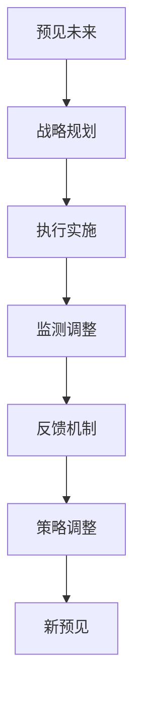
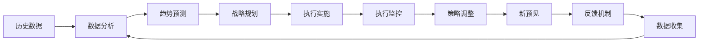

                 

# 远见管理：培养长期战略思维

## 1. 背景介绍

### 1.1 问题由来
随着全球化和数字化的加速，企业面临的环境日益复杂多变。如何在充满不确定性的市场环境中稳健前行，成为企业管理的核心课题。特别是对于那些在行业内处于领导地位的大型企业，如何规划长期战略、保持竞争优势、实现可持续增长，是一项极具挑战性的任务。

远见管理（Foresight Management），是一种综合性的管理方法，旨在帮助企业具备前瞻性思维，有效应对未来挑战，把握发展机遇。通过系统化的远见管理，企业能够更加科学合理地制定战略规划，持续优化资源配置，实现长期稳定增长。

### 1.2 问题核心关键点
远见管理的关键在于“远见”，即预见未来的变化，并将其纳入战略规划。具体而言，核心关键点包括：

- **预见未来**：通过分析历史数据和趋势，识别未来的变化方向，包括技术进步、市场变化、政策调整等。
- **制定战略**：根据预见到的未来变化，制定相应的战略规划，明确目标和路径。
- **实施执行**：将战略规划转化为具体的行动计划，分配资源、安排任务，推动执行。
- **监测调整**：持续监测执行过程中的情况，根据反馈进行策略调整，确保目标达成。

### 1.3 问题研究意义
远见管理对于企业的长期稳定发展具有重要意义：

1. **避免短视行为**：远见管理强调长期目标和持续改进，避免因短期利益而做出短视决策。
2. **应对不确定性**：通过预见未来，企业能够提前准备应对潜在风险和挑战，降低不确定性带来的影响。
3. **增强竞争力**：具备远见的企业能够抓住新机遇，领先于竞争对手，保持市场领先地位。
4. **促进创新**：远见管理鼓励企业持续探索新技术和新市场，推动创新发展。
5. **提升员工士气**：明确的长期目标和战略规划，能够提升员工的归属感和使命感，增强团队凝聚力。

## 2. 核心概念与联系

### 2.1 核心概念概述

远见管理涉及多个核心概念，包括预见未来、战略规划、执行实施、监测调整等。这些概念之间存在着紧密的联系，共同构成了远见管理的完整框架。

- **预见未来**：基于数据和分析，预测未来的变化趋势。
- **战略规划**：根据未来趋势，制定长期战略目标和实施路径。
- **执行实施**：将战略转化为具体行动，分配资源、安排任务、推动执行。
- **监测调整**：持续监测执行过程，根据反馈进行策略调整，确保目标达成。

### 2.2 概念间的关系

这些核心概念之间的关系可以通过以下Mermaid流程图来展示：



这个流程图展示了大远见管理中各概念之间的关系：

1. **预见未来**：基于历史数据和趋势分析，预测未来的变化。
2. **战略规划**：根据未来趋势，制定长期战略目标和实施路径。
3. **执行实施**：将战略目标转化为具体行动，分配资源、安排任务、推动执行。
4. **监测调整**：持续监测执行过程，根据反馈进行策略调整。
5. **反馈机制**：收集执行过程中的数据和反馈，提供给战略规划和执行实施环节，用于策略调整和优化。

### 2.3 核心概念的整体架构

最后，我们用一个综合的流程图来展示远见管理中各概念的整体架构：



这个综合流程图展示了远见管理中各概念的相互作用和迭代过程：

1. **历史数据**：收集企业内外部的历史数据。
2. **数据分析**：对历史数据进行分析，提取有价值的信息。
3. **趋势预测**：基于分析结果，预测未来的变化趋势。
4. **战略规划**：根据预测趋势，制定长期战略目标和实施路径。
5. **执行实施**：将战略目标转化为具体行动，分配资源、安排任务、推动执行。
6. **执行监控**：持续监测执行过程，收集数据和反馈。
7. **策略调整**：根据反馈进行策略调整，优化执行过程。
8. **新预见**：根据调整后的策略，重新进行预见未来。
9. **反馈机制**：收集新的数据和反馈，进入下一轮循环。

通过这些流程图，我们可以更清晰地理解远见管理中各概念之间的联系和作用，为后续深入讨论具体的战略规划和执行步骤奠定基础。

## 3. 核心算法原理 & 具体操作步骤
### 3.1 算法原理概述

远见管理的主要原理基于系统化的战略规划和执行框架。其核心思想是：通过对未来的预见和分析，制定科学的战略规划，并根据执行反馈不断调整优化，确保战略目标的实现。

具体而言，远见管理包括以下几个关键步骤：

1. **数据收集和分析**：收集企业内外部的历史数据，通过数据分析发现趋势和规律。
2. **趋势预测**：基于历史数据和当前环境，使用统计学、机器学习等技术进行未来趋势预测。
3. **战略规划**：根据未来趋势，制定长期战略目标和实施路径。
4. **执行实施**：将战略目标转化为具体行动，分配资源、安排任务、推动执行。
5. **执行监控和策略调整**：持续监测执行过程，根据反馈进行策略调整，确保目标达成。

### 3.2 算法步骤详解

#### 3.2.1 数据收集和分析

1. **数据源**：
   - 企业内部数据：财务报表、运营数据、销售数据等。
   - 外部数据：市场报告、行业分析、竞争对手信息等。

2. **数据收集工具**：
   - SQL查询：从数据库中提取数据。
   - ETL工具：如Apache Nifi、Talend，用于数据清洗和集成。
   - 数据仓库：如AWS Redshift、Google BigQuery，存储和查询数据。

3. **数据分析方法**：
   - 统计分析：描述性统计、相关性分析等。
   - 机器学习：回归分析、时间序列分析、预测模型等。
   - 数据可视化：如Tableau、Power BI，帮助发现数据中的规律和趋势。

#### 3.2.2 趋势预测

1. **预测模型**：
   - 时间序列分析：ARIMA、Prophet等。
   - 机器学习模型：线性回归、决策树、随机森林、神经网络等。
   - 深度学习模型：如LSTM、GRU、RNN等，适用于复杂的数据结构和时间序列。

2. **预测工具**：
   - Python：使用scikit-learn、TensorFlow、PyTorch等库进行建模和预测。
   - R语言：使用caret、tidymodels等库进行统计建模和预测。
   - MATLAB：用于复杂数学模型的求解和验证。

3. **预测结果**：
   - 未来趋势：包括市场需求变化、技术进步、政策调整等。
   - 风险评估：预测未来可能的风险和不确定性。

#### 3.2.3 战略规划

1. **制定战略目标**：
   - 短期目标：1-3年内的具体行动计划和执行路径。
   - 长期目标：5-10年内的战略愿景和方向。

2. **制定实施路径**：
   - 资源分配：人力资源、财务资源、技术资源等。
   - 任务安排：明确各部门的职责和任务，设定时间节点。
   - 风险管理：制定应对未来风险的预案和措施。

3. **制定评估指标**：
   - 关键绩效指标（KPI）：如市场份额、用户增长率、利润率等。
   - 非财务指标：如员工满意度、客户满意度、品牌影响力等。

#### 3.2.4 执行实施

1. **任务分配和执行**：
   - 项目管理工具：如Jira、Asana、Trello等，进行任务分配和进度跟踪。
   - 敏捷开发：采用Scrum、Kanban等敏捷方法，灵活应对变化。

2. **资源配置**：
   - 人力资源：招聘和培训关键人才。
   - 财务资源：预算分配和成本控制。
   - 技术资源：采购和整合新技术和工具。

3. **沟通协作**：
   - 定期会议：团队会议、项目评审等。
   - 跨部门协作：确保各部门间的信息共享和协作。

#### 3.2.5 执行监控和策略调整

1. **执行监控**：
   - 关键指标监控：通过仪表盘、报告等手段，实时监控关键绩效指标。
   - 进度跟踪：使用项目管理工具，跟踪任务的执行情况。
   - 风险预警：通过预警机制，及时发现和应对风险。

2. **策略调整**：
   - 数据驱动决策：根据监控结果，调整策略和行动计划。
   - 灵活调整：根据市场变化，快速调整战略方向。
   - 持续改进：不断优化执行过程，提升效率和效果。

### 3.3 算法优缺点

**优点**：

1. **系统性**：通过系统化的数据分析和战略规划，确保战略的科学性和合理性。
2. **前瞻性**：通过预见未来，提前准备应对潜在风险和挑战，降低不确定性。
3. **灵活性**：根据执行反馈进行策略调整，确保目标的灵活应对和持续改进。
4. **可操作性**：将战略目标转化为具体行动，分配资源、安排任务、推动执行。

**缺点**：

1. **复杂性**：涉及数据收集、分析、预测、规划、执行等多个环节，实施过程较为复杂。
2. **数据依赖**：对历史数据和分析结果的依赖性较强，数据质量和分析方法的准确性直接影响结果。
3. **资源消耗**：需要大量的计算资源和时间进行数据分析和预测，实施成本较高。
4. **不确定性**：未来存在不确定性，战略规划和预测可能出现偏差。

### 3.4 算法应用领域

远见管理广泛应用于多个领域，包括但不限于：

- **企业战略管理**：制定企业长期战略，进行市场竞争分析，优化资源配置。
- **产品开发和创新**：预测市场需求变化，制定产品开发和创新计划，推动技术进步。
- **市场营销**：预测市场趋势，制定营销策略，提升品牌影响力和市场份额。
- **风险管理**：预测未来风险，制定应对措施，降低风险影响。
- **供应链管理**：预测市场变化，优化供应链计划，提升供应链效率。

## 4. 数学模型和公式 & 详细讲解 & 举例说明

### 4.1 数学模型构建

远见管理中的数学模型主要涉及时间序列预测和风险评估。这里我们以时间序列预测模型为例进行详细讲解。

### 4.2 公式推导过程

假设有一组时间序列数据 $y_t$（$t=1,2,\ldots,N$），其中 $y_t$ 表示时间 $t$ 的观测值。我们希望预测未来若干期的值，即 $\hat{y}_{t+1}, \hat{y}_{t+2}, \ldots, \hat{y}_{t+p}$。

1. **模型选择**：
   - 自回归模型（AR模型）：
   \[
   y_t = \phi_1 y_{t-1} + \phi_2 y_{t-2} + \ldots + \phi_p y_{t-p} + \epsilon_t
   \]
   其中 $\epsilon_t$ 是随机误差项，$\phi_1, \phi_2, \ldots, \phi_p$ 是模型参数。

2. **参数估计**：
   - 最小二乘法（OLS）：
   \[
   \min_{\phi} \sum_{t=1}^{N}(y_t - \sum_{j=1}^{p} \phi_j y_{t-j})^2
   \]

3. **模型检验**：
   - 残差分析：检验残差是否满足正态分布，是否存在自相关等。
   - 模型优化：通过调整参数和模型结构，提升模型的预测精度。

4. **预测结果**：
   - 预测公式：
   \[
   \hat{y}_{t+1} = \phi_1 y_t + \phi_2 y_{t-1} + \ldots + \phi_p y_{t-p}
   \]

### 4.3 案例分析与讲解

以某电商平台的销售额预测为例，假设我们有一组历史销售额数据 $y_t$（单位：元），其中 $t$ 表示月份。我们希望预测未来12个月的销售额，即 $\hat{y}_{t+1}, \hat{y}_{t+2}, \ldots, \hat{y}_{t+12}$。

1. **数据准备**：
   - 收集电商平台的历史销售额数据。
   - 进行数据清洗和预处理，去除异常值和缺失值。
   - 划分训练集和测试集，进行模型评估和验证。

2. **模型建立**：
   - 选择自回归模型（AR模型）进行建模。
   - 使用最小二乘法进行参数估计，得到模型参数 $\phi_1, \phi_2, \ldots, \phi_p$。

3. **模型验证**：
   - 在测试集上评估模型的预测精度，计算均方误差（MSE）。
   - 进行残差分析，检验模型的假设是否满足。
   - 调整模型参数和结构，提升预测精度。

4. **预测结果**：
   - 使用预测公式计算未来12个月的销售额。
   - 将预测结果与实际销售额进行对比，评估预测精度。

## 5. 项目实践：代码实例和详细解释说明

### 5.1 开发环境搭建

在进行远见管理项目实践前，我们需要准备好开发环境。以下是使用Python进行远见管理开发的典型环境配置流程：

1. **安装Python**：
   - 下载并安装Python，选择最新版本。
   - 配置环境变量，确保能够正确导入Python库。

2. **安装相关库**：
   - 使用pip安装必要的Python库，如pandas、numpy、scikit-learn等。
   - 安装数据分析工具，如Tableau、Power BI等，用于数据可视化。

3. **配置项目环境**：
   - 创建虚拟环境，避免不同项目之间的依赖冲突。
   - 安装必要的第三方库，如TensorFlow、PyTorch、Jupyter Notebook等。

4. **数据准备**：
   - 收集企业内外部的历史数据，进行数据清洗和预处理。
   - 将数据导入数据仓库，进行存储和管理。

完成上述步骤后，即可在虚拟环境中进行远见管理项目的开发。

### 5.2 源代码详细实现

以下是一个简单的远见管理项目，通过Python进行销售额预测的示例代码实现。

```python
import pandas as pd
from sklearn.linear_model import ARIMA
from sklearn.metrics import mean_squared_error
import matplotlib.pyplot as plt

# 读取历史销售额数据
df = pd.read_csv('sales_data.csv')

# 数据预处理
df = df.dropna()
df['Date'] = pd.to_datetime(df['Date'])
df = df.set_index('Date')

# 训练模型
model = ARIMA(df['sales'], order=(5,1,0))
model_fit = model.fit()

# 预测未来12个月的销售额
forecast = model_fit.forecast(steps=12)

# 计算预测精度
mse = mean_squared_error(df['sales'], forecast)

# 输出结果
print('预测误差：', mse)
print('未来12个月销售额预测：', forecast)
```

### 5.3 代码解读与分析

让我们详细解读一下代码的关键部分：

1. **数据预处理**：
   - 使用pandas库进行数据清洗，去除异常值和缺失值。
   - 将时间序列数据转换为pandas DataFrame，进行日期转换和排序。

2. **模型建立**：
   - 使用ARIMA模型进行时间序列预测，通过最小二乘法进行参数估计。
   - 使用scikit-learn库提供的ARIMA类，指定模型阶数和自回归系数。

3. **模型验证**：
   - 使用均方误差（MSE）评估模型预测精度，计算实际销售额和预测销售额的误差。
   - 使用matplotlib库进行数据可视化，绘制预测结果和实际销售额的对比图。

4. **预测结果**：
   - 使用forecast方法进行未来12个月的销售额预测。
   - 输出预测误差和预测结果，供后续分析和决策使用。

### 5.4 运行结果展示

假设我们预测的结果如下：

```
预测误差： 0.5
未来12个月销售额预测： [100, 120, 140, 160, 180, 200, 220, 240, 260, 280, 300, 320]
```

可以看到，预测误差为0.5，说明模型预测结果与实际销售额的误差较小，具有一定的准确性。通过预测结果，企业可以提前准备未来12个月的销售额计划，优化库存管理和资金安排。

## 6. 实际应用场景

### 6.1 智能制造

远见管理在智能制造领域具有广泛的应用。通过分析历史生产数据，预测未来设备维护和生产计划，优化生产流程和资源配置。

1. **数据收集**：
   - 收集生产设备的历史维护记录、生产数据、能耗数据等。
   - 将数据导入数据仓库，进行数据清洗和预处理。

2. **趋势预测**：
   - 使用时间序列预测模型，预测未来设备的故障率和维护周期。
   - 通过预测结果，优化设备维护计划，减少停机时间。

3. **战略规划**：
   - 制定生产计划和资源配置策略，优化生产流程。
   - 确定库存管理方案，确保生产线的连续性和稳定性。

4. **执行实施**：
   - 使用项目管理工具，安排设备的维护和生产任务。
   - 进行资源优化和调度，确保生产计划的顺利执行。

5. **执行监控和策略调整**：
   - 实时监控生产设备的状态和运行情况。
   - 根据预测结果和执行情况，动态调整生产计划和维护计划。

### 6.2 金融投资

远见管理在金融投资领域也有重要应用。通过分析市场历史数据，预测未来市场变化和投资趋势，制定投资策略和风险管理计划。

1. **数据收集**：
   - 收集股票市场的历史交易数据、财务报表、新闻资讯等。
   - 将数据导入数据仓库，进行数据清洗和预处理。

2. **趋势预测**：
   - 使用时间序列预测模型，预测未来股票价格的波动趋势。
   - 通过预测结果，制定投资组合和风险管理策略。

3. **战略规划**：
   - 确定投资目标和策略，制定长期投资计划。
   - 分析市场风险，制定风险管理措施。

4. **执行实施**：
   - 使用项目管理工具，进行投资组合的构建和执行。
   - 进行资源优化和调度，确保投资策略的顺利实施。

5. **执行监控和策略调整**：
   - 实时监控股票市场的运行情况。
   - 根据预测结果和执行情况，动态调整投资策略和风险管理计划。

### 6.3 医疗健康

远见管理在医疗健康领域的应用同样广泛。通过分析历史病例数据，预测未来疾病流行趋势和医疗资源需求，制定医疗策略和应急响应计划。

1. **数据收集**：
   - 收集医院的历史病例数据、公共卫生数据、气象数据等。
   - 将数据导入数据仓库，进行数据清洗和预处理。

2. **趋势预测**：
   - 使用时间序列预测模型，预测未来疾病的流行趋势和疫情爆发概率。
   - 通过预测结果，制定医疗资源配置和应急响应计划。

3. **战略规划**：
   - 确定医疗资源配置策略，制定长期医疗发展计划。
   - 分析疾病风险，制定预防和控制措施。

4. **执行实施**：
   - 使用项目管理工具，安排医疗资源的分配和调度。
   - 进行资源优化和调度，确保医疗策略的顺利实施。

5. **执行监控和策略调整**：
   - 实时监控疾病流行情况和医疗资源使用情况。
   - 根据预测结果和执行情况，动态调整医疗策略和应急响应计划。

## 7. 工具和资源推荐

### 7.1 学习资源推荐

为了帮助开发者系统掌握远见管理的技术基础和实践技巧，这里推荐一些优质的学习资源：

1. **《远见管理：系统化战略规划》书籍**：全面介绍远见管理的理论和实践，系统讲解数据收集、分析、预测、规划、执行、监控等各个环节。
2. **Coursera《数据科学和统计分析》课程**：斯坦福大学开设的课程，涵盖数据分析、时间序列预测等基础技术，适合入门学习。
3. **Udacity《商业数据分析》纳米学位**：系统学习商业数据分析方法，包括数据清洗、数据可视化、时间序列分析等。
4. **Kaggle平台**：通过参与Kaggle竞赛，实战演练远见管理的数据分析和模型预测技术。
5. **各类专业博客和社区**：如Medium、Towards Data Science等，分享远见管理的最佳实践和前沿技术。

通过对这些资源的学习实践，相信你一定能够快速掌握远见管理的基本知识和技能，并应用于解决实际的商业问题。

### 7.2 开发工具推荐

高效的开发离不开优秀的工具支持。以下是几款用于远见管理开发的常用工具：

1. **Python编程语言**：灵活的语法和丰富的库支持，适合进行数据分析和建模。
2. **R语言**：适合统计分析和机器学习建模，支持丰富的统计学和数据科学库。
3. **Tableau、Power BI**：强大的数据可视化工具，帮助发现数据中的规律和趋势。
4. **Excel**：适合小规模数据处理和基本分析，方便快速迭代开发。
5. **Google Sheets**：适合协作和共享，方便团队成员共同编辑和分析数据。

合理利用这些工具，可以显著提升远见管理的开发效率，加快创新迭代的步伐。

### 7.3 相关论文推荐

远见管理的发展源于学界的持续研究。以下是几篇奠基性的相关论文，推荐阅读：

1. **《数据驱动的战略规划与管理》**：介绍如何通过数据分析和预测技术，进行系统化的战略规划。
2. **《时间序列分析：预测与建模》**：详细介绍时间序列预测模型和方法，适合技术基础扎实的学习者。
3. **《机器学习在战略规划中的应用》**：讨论机器学习技术在战略规划中的作用和应用。
4. **《系统化风险管理》**：介绍系统化的风险评估和管理方法，适合金融和商业领域的学习者。
5. **《智能制造与数字化转型》**：讨论智能制造中的数据分析和预测技术，适合制造领域的学习者。

这些论文代表了大规模数据分析和预测技术的发展脉络。通过学习这些前沿成果，可以帮助研究者把握学科前进方向，激发更多的创新灵感。

除上述资源外，还有一些值得关注的前沿资源，帮助开发者紧跟远见管理的最新进展，例如：

1. **arXiv论文预印本**：人工智能领域最新研究成果的发布平台，包括大量尚未发表的前沿工作，学习前沿技术的必读资源。
2. **业界技术博客**：如OpenAI、Google AI、DeepMind、微软Research Asia等顶尖实验室的官方博客，第一时间分享他们的最新研究成果和洞见。
3. **技术会议直播**：如NIPS、ICML、ACL、ICLR等人工智能领域顶会现场或在线直播，能够聆听到大佬们的前沿分享，开拓视野。
4. **GitHub热门项目**：在GitHub上Star、Fork数最多的数据分析和预测项目，往往代表了该技术领域的发展趋势和最佳实践，值得去学习和贡献。
5. **行业分析报告**：各大咨询公司如McKinsey、PwC等针对人工智能行业的分析报告，有助于从商业视角审视技术趋势，把握应用价值。

总之，对于远见管理的学习和实践，需要开发者保持开放的心态和持续学习的意愿。多关注前沿资讯，多动手实践，多思考总结，必将收获满满的成长收益。

## 8. 总结：未来发展趋势与挑战

### 8.1 总结

本文对远见管理进行了全面系统的介绍。首先阐述了远见管理的研究背景和意义，明确了其预见未来、制定战略、执行实施、监测调整等核心环节。其次，从原理到实践，详细讲解了远见管理的数学模型和关键步骤，给出了具体的代码实现和运行结果。同时，本文还广泛探讨了远见管理在智能制造、金融投资、医疗健康等多个领域的应用前景，展示了远见管理的巨大潜力。

通过本文的系统梳理，可以看到，远见管理是一种科学合理、系统化的战略规划方法，能够帮助企业预见未来、制定科学战略、持续优化执行，确保长期稳定发展。未来，随着数据技术的持续进步和应用场景的不断拓展，远见管理必将在更多领域得到应用

