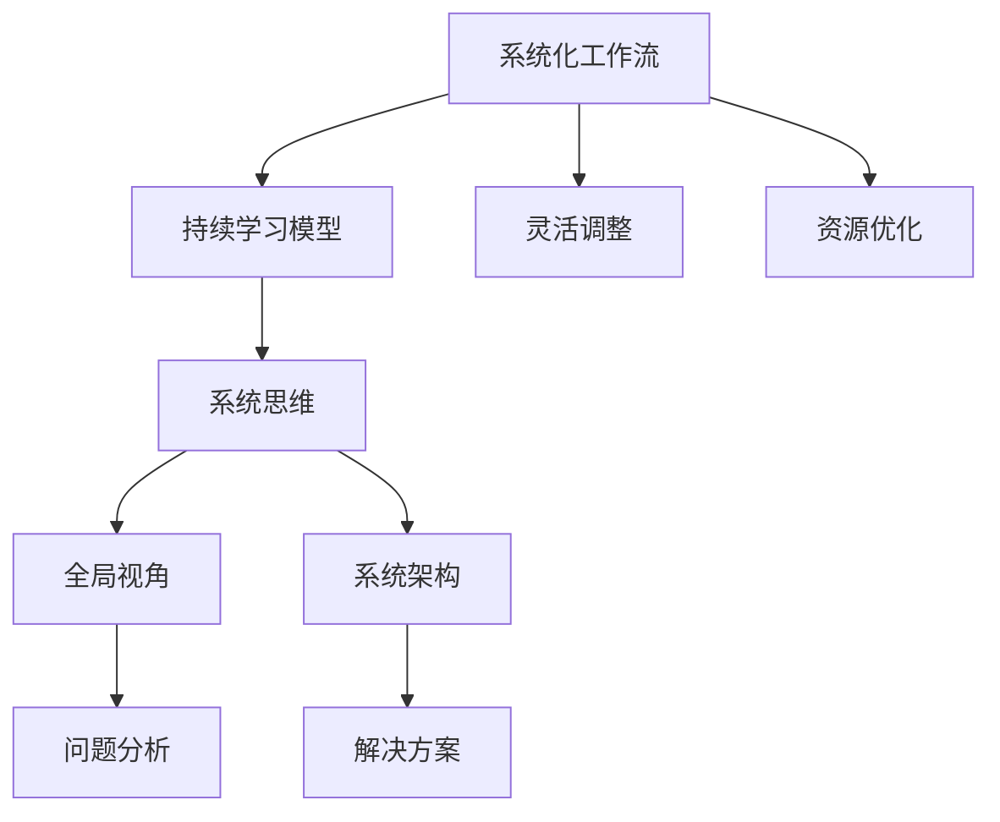
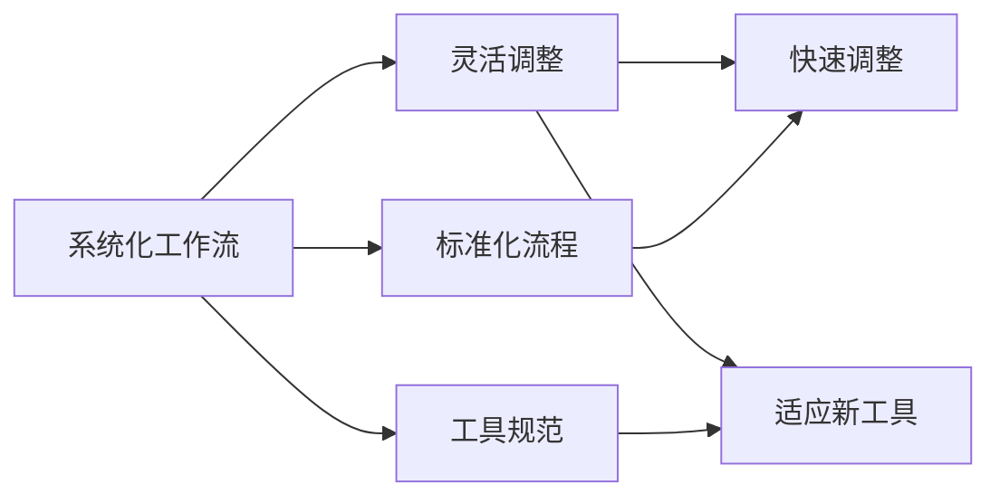
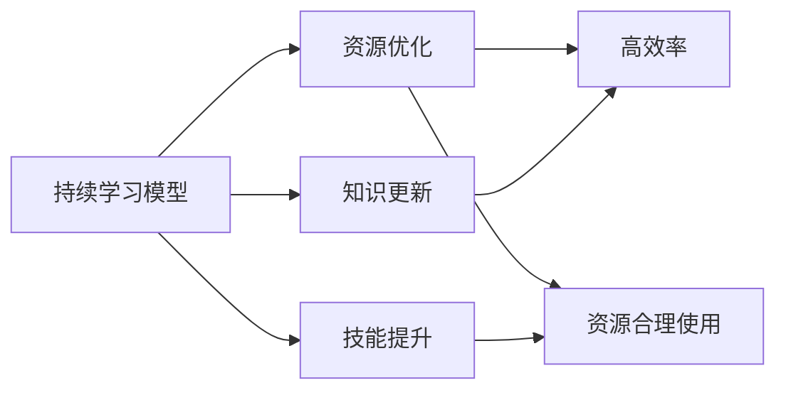
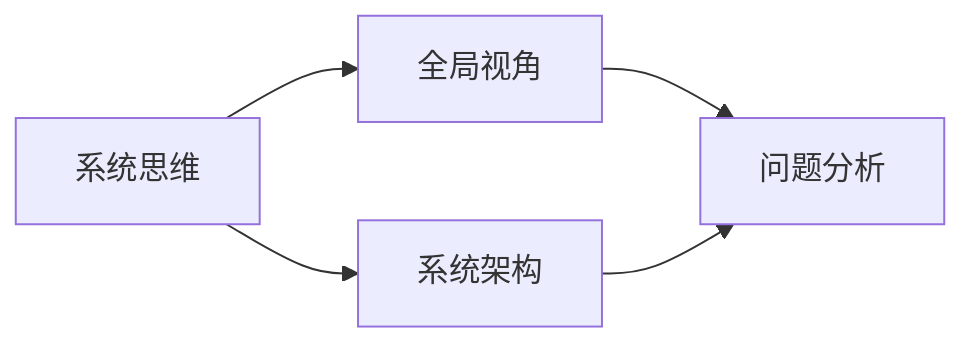
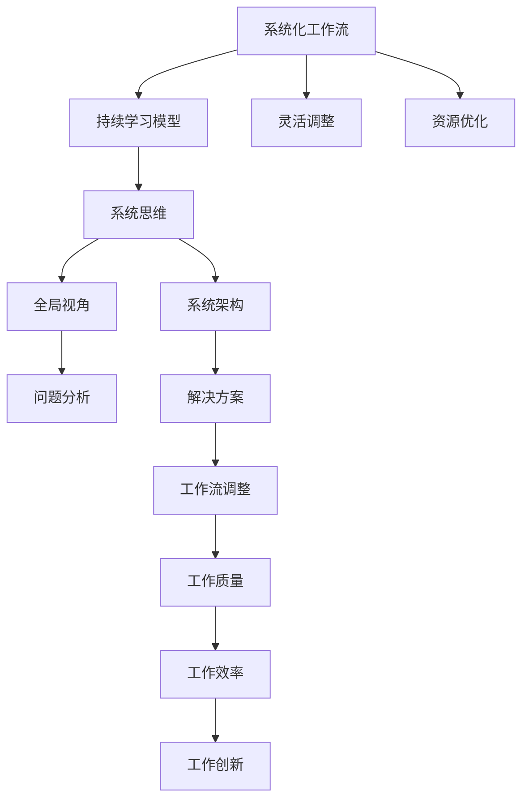

                 

## 1. 背景介绍

### 1.1 问题由来

在信息技术迅猛发展的今天，全球正经历着前所未有的变革，特别是在信息技术、生物技术、能源技术等领域，新技术不断涌现，旧有技术被快速淘汰。AI、大数据、云计算、物联网、量子计算等新兴技术正日益改变着社会的生产方式和人们的日常生活。

AI技术尤其引人注目。从人工智能到机器学习，再到深度学习，技术不断迭代，新概念、新模型层出不穷。人工智能已从实验室的研究项目迅速走向产业应用，涉及医疗、金融、教育、制造等多个行业。

这一轮技术变革，不仅要求研究人员能够快速学习新技术、掌握新工具，还要求他们能够在不断变化的环境中，快速调整工作流，高效利用资源，提升创新能力。

### 1.2 问题核心关键点

快速变化的时代，要求个人具备以下几点能力：

- 持续学习：掌握最新的技术、方法和工具，以适应技术快速迭代的趋势。
- 灵活调整：快速适应新环境、新工具，调整自己的工作流和习惯。
- 高效利用资源：掌握高效率的工作方法，提高工作效率和质量。
- 系统思维：从全局角度考虑问题，提升决策能力。

在这一背景下，重塑个人工作流变得至关重要。通过系统学习、灵活调整和高效利用资源，个人能够在快速变化的环境中保持竞争力，推动自身及团队的持续创新和发展。

### 1.3 问题研究意义

研究重塑个人工作流的方法，对于提升个人及团队的创新能力、技术应用水平、工作效能，具有重要意义：

1. 提升学习效率。掌握高效的工作方法，可以快速掌握新技术，缩短学习和实践周期。
2. 提高工作质量。掌握系统化、规范化的工作流程，有助于提升工作质量，减少错误和重复劳动。
3. 增强创新能力。灵活适应新环境，快速调整工作流，有助于保持创新活力，应对技术变革。
4. 优化团队协作。通过合理的分工和协作流程，可以增强团队合作效率，推动集体创新。

## 2. 核心概念与联系

### 2.1 核心概念概述

为更好地理解重塑个人工作流的方法，本节将介绍几个关键概念：

- **系统化工作流(Systematized Workflow)**：即通过系统化的方法和工具，将个人工作流程规范化，提升工作质量、效率和创新能力。
- **持续学习模型(Learning Model)**：指通过持续学习机制，不断更新和补充知识和技能，适应快速变化的技术环境。
- **灵活调整(Adaptability)**：指通过动态调整工作流，适应新工具、新环境，提升灵活应对能力。
- **资源优化(Resource Optimization)**：指通过高效利用计算、存储、网络等资源，提高工作流效率。
- **系统思维(System Thinking)**：指从全局视角和系统角度，分析问题和制定解决方案，提升决策能力。

这些概念之间的关系可以用以下Mermaid流程图来展示：



这个流程图展示了各个核心概念之间的联系：

1. 系统化工作流是基础，通过规范化流程和工具，提升工作质量和效率。
2. 持续学习模型，是系统化工作流的动态补充，保证知识的更新和技能的提升。
3. 灵活调整，是系统化工作流的重要补充，提升对新环境和新工具的适应能力。
4. 资源优化，是系统化工作流的重要保障，提升资源使用效率。
5. 系统思维，是系统化工作流的理论支撑，提升全局视角和问题分析能力。

这些概念共同构成了个人工作流优化和重塑的理论框架，帮助个人适应快速变化的技术环境，实现持续创新和高效工作。

### 2.2 概念间的关系

这些核心概念之间存在着紧密的联系，形成了个人工作流优化的完整生态系统。

#### 2.2.1 系统化工作流与灵活调整



这个流程图展示了系统化工作流和灵活调整之间的关系：

1. 系统化工作流通过标准化流程和工具规范，为灵活调整提供基础。
2. 灵活调整则通过快速调整和适应新工具，提升对新环境的适应能力。

#### 2.2.2 持续学习模型与资源优化



这个流程图展示了持续学习模型与资源优化之间的关系：

1. 持续学习模型通过知识更新和技能提升，为资源优化提供前提。
2. 资源优化则通过高效利用资源，提升持续学习的效果和效率。

#### 2.2.3 系统思维与全局视角



这个流程图展示了系统思维与全局视角之间的关系：

1. 系统思维通过系统架构，提供全局视角和问题分析能力。
2. 全局视角则通过系统思维，提升问题分析和解决方案的科学性。

### 2.3 核心概念的整体架构

最后，我们用一个综合的流程图来展示这些核心概念在个人工作流优化中的整体架构：



这个综合流程图展示了从系统化工作流到创新工作的完整流程：

1. 系统化工作流是基础，通过标准化流程和工具规范，提升工作质量和效率。
2. 持续学习模型，通过知识更新和技能提升，为系统化工作流提供动态补充。
3. 灵活调整，通过快速调整和适应新工具，提升对新环境的适应能力。
4. 资源优化，通过高效利用资源，提升系统化工作流的效果和效率。
5. 系统思维，通过全局视角和问题分析，指导工作流的调整和优化。
6. 全局视角和系统架构，通过系统思维，提升问题分析和解决方案的科学性。
7. 问题分析和解决方案，通过系统思维，指导工作流的调整和优化。
8. 工作流调整，通过问题分析和解决方案，实现系统化工作流和灵活调整。
9. 工作质量、效率和创新，通过工作流调整和优化，实现持续改进和创新。

通过这些流程图，我们可以更清晰地理解重塑个人工作流的各个环节和关键要素，为后续深入讨论重塑方法提供基础。

## 3. 核心算法原理 & 具体操作步骤

### 3.1 算法原理概述

重塑个人工作流，本质上是通过一系列系统化的方法和工具，实现对工作流程和资源的高效利用。其核心思想是：

- 将复杂的工作流程分解为可控的小步骤，逐步实现自动化、规范化。
- 通过持续学习机制，不断更新和补充知识，提升个人技能。
- 灵活调整工作流程，适应新工具和新环境。
- 优化资源使用，提高工作效率和质量。
- 采用系统思维，从全局视角分析问题，制定解决方案。

具体地，重塑个人工作流包括以下几个关键步骤：

1. **工作流程分解和标准化**：将复杂任务分解为可控步骤，设计标准化的工作流程。
2. **工具和技术适配**：选择适合的工作工具和技术，进行适配和优化。
3. **持续学习和技能提升**：通过在线课程、书籍、研讨会等多种方式，不断学习新知识和新技能。
4. **灵活调整和快速迭代**：定期评估和调整工作流程，适应新环境和新需求。
5. **资源优化和管理**：采用高性能计算、存储、网络等资源，提升工作效率和质量。
6. **系统思维和问题分析**：从全局视角和系统角度，分析问题和制定解决方案。

### 3.2 算法步骤详解

**Step 1: 工作流程分解和标准化**

1. **任务分解**：将复杂任务分解为可控的子任务，明确每个子任务的目标和输入输出。
2. **流程设计**：设计标准化的工作流程，确保每个子任务的顺利执行。
3. **工具选择**：选择适合的工作工具和技术，提升工作效率和质量。

**Step 2: 工具和技术适配**

1. **选择工具**：根据任务需求，选择适合的工作工具和技术，如Git、Jupyter Notebook、PyTorch等。
2. **适配优化**：对选择的工具进行适配和优化，提高使用效率。
3. **集成管理**：将工具集成到工作流中，实现高效管理。

**Step 3: 持续学习和技能提升**

1. **学习资源**：通过在线课程、书籍、研讨会等多种方式，获取新知识和技能。
2. **学习实践**：将新知识和技能应用到实际工作中，验证和巩固。
3. **反馈迭代**：定期评估学习效果，调整学习策略和方法。

**Step 4: 灵活调整和快速迭代**

1. **需求分析**：定期评估工作需求和环境变化，明确调整方向。
2. **流程调整**：根据需求和环境变化，调整工作流程和工具。
3. **迭代优化**：通过快速迭代和反馈，不断优化工作流程和工具。

**Step 5: 资源优化和管理**

1. **资源评估**：评估计算、存储、网络等资源的使用情况。
2. **优化策略**：采用高性能计算、存储、网络等资源，提升工作效率和质量。
3. **管理措施**：采用系统化的资源管理措施，保障资源的高效利用。

**Step 6: 系统思维和问题分析**

1. **全局视角**：从全局视角和系统角度，分析问题和制定解决方案。
2. **系统架构**：设计合理的系统架构，保障工作流的高效运行。
3. **解决方案**：根据问题分析结果，制定科学合理的解决方案。

### 3.3 算法优缺点

**优点：**

1. **系统化和规范化**：通过标准化流程和工具，提升工作质量和效率。
2. **灵活和可适应性**：通过快速调整和适配，提升对新环境和新工具的适应能力。
3. **持续学习和提升**：通过持续学习机制，不断更新和补充知识，提升个人技能。
4. **资源优化和管理**：通过高效利用资源，提高工作效率和质量。
5. **科学决策和问题解决**：通过系统思维和问题分析，提升决策能力。

**缺点：**

1. **初始投入较大**：标准化流程和工具的引入，需要一定的时间和资源投入。
2. **灵活性不足**：初始流程可能过于刚性，需要不断调整以适应新环境。
3. **学习负担较重**：持续学习和技能提升需要投入大量时间和精力。
4. **工具和资源要求高**：高效工作需要高性能计算、存储、网络等资源。
5. **实施难度大**：系统化工作流和问题分析的实施，需要一定的专业知识和技能。

尽管存在这些局限性，但重塑个人工作流通过系统化和规范化，显著提升了工作效率和质量，使其在快速变化的时代中更具竞争力。

### 3.4 算法应用领域

重塑个人工作流的方法，适用于各种场景和领域，具体包括：

- **软件开发**：通过系统化工具和技术，提升代码质量和开发效率。
- **数据科学**：通过持续学习机制，提升数据处理和分析能力。
- **科研和研究**：通过灵活调整和快速迭代，适应新方法和工具。
- **项目管理**：通过科学决策和问题分析，提升项目管理效率和质量。
- **教育培训**：通过持续学习和技能提升，提升教师和学生的能力。
- **医疗健康**：通过标准化流程和资源优化，提高医疗服务质量和效率。
- **金融交易**：通过系统化工具和技术，提升交易效率和风险控制能力。

总之，重塑个人工作流的方法，可以广泛应用于各个领域，提升个人和团队的创新能力、技术应用水平和工作效率。

## 4. 数学模型和公式 & 详细讲解 & 举例说明

### 4.1 数学模型构建

我们以项目管理为例，构建一个简化的数学模型来描述重塑个人工作流的过程。

设项目管理任务由n个子任务组成，每个子任务需要t个步骤完成，设每个步骤需要的时间为x_i，总时间为T，则模型的目标是最小化总时间：

$$
\min_{x} \sum_{i=1}^n \sum_{j=1}^t x_{ij} = T
$$

其中，x_{ij}表示任务i的第j步需要的时间。

### 4.2 公式推导过程

假设项目管理任务由n个子任务组成，每个子任务需要t个步骤完成，设每个步骤需要的时间为x_i，总时间为T，则模型的目标是最小化总时间：

$$
\min_{x} \sum_{i=1}^n \sum_{j=1}^t x_{ij} = T
$$

其中，x_{ij}表示任务i的第j步需要的时间。

通过线性规划求解，可以得到最优解：

$$
x_{ij} = \frac{T}{n \times t}
$$

即每个任务每个步骤需要的时间为总时间的$\frac{1}{n \times t}$。

### 4.3 案例分析与讲解

假设我们有一个包含三个子任务A、B、C的项目，每个子任务需要执行两个步骤，每个步骤需要的时间分别为x、y、z，总时间为20小时。则通过求解上述线性规划问题，可以得到每个任务每个步骤需要的时间，并进行调整，以提升整体效率。

### 5. 项目实践：代码实例和详细解释说明

### 5.1 开发环境搭建

在进行重塑个人工作流实践前，我们需要准备好开发环境。以下是使用Python进行PyTorch开发的环境配置流程：

1. 安装Anaconda：从官网下载并安装Anaconda，用于创建独立的Python环境。

2. 创建并激活虚拟环境：
```bash
conda create -n pytorch-env python=3.8 
conda activate pytorch-env
```

3. 安装PyTorch：根据CUDA版本，从官网获取对应的安装命令。例如：
```bash
conda install pytorch torchvision torchaudio cudatoolkit=11.1 -c pytorch -c conda-forge
```

4. 安装各类工具包：
```bash
pip install numpy pandas scikit-learn matplotlib tqdm jupyter notebook ipython
```

完成上述步骤后，即可在`pytorch-env`环境中开始重塑工作流实践。

### 5.2 源代码详细实现

我们以软件开发为例，给出使用PyTorch进行工作流优化和重塑的PyTorch代码实现。

首先，定义项目管理任务和相关数据：

```python
import numpy as np
from scipy.optimize import linprog

# 定义任务和步骤
n = 3  # 子任务数量
t = 2  # 步骤数量
x = np.array([2, 3, 4])  # 每个步骤需要的时间
T = 20  # 总时间

# 定义目标函数
c = np.zeros((n, t))
c[0, 0] = 1
c[0, 1] = 1
c[1, 0] = 1
c[1, 1] = 1
c[2, 0] = 1
c[2, 1] = 1

# 定义约束条件
A = np.zeros((n, t))
A[0, 0] = 1
A[0, 1] = 1
A[1, 0] = 1
A[1, 1] = 1
A[2, 0] = 1
A[2, 1] = 1

b = np.zeros(n)
b[0] = x[0]
b[1] = x[1]
b[2] = x[2]

# 定义变量
x = np.zeros((n, t))

# 求解线性规划
result = linprog(c, A_ub=A, b_ub=b, bounds=(x[0], T), method='highs')

# 打印结果
print("最优解：", result.x)
print("最优时间：", result.fun)
```

然后，解释代码实现和结果：

**变量定义**：
- `n` 和 `t` 分别表示子任务数量和步骤数量。
- `x` 表示每个步骤需要的时间。
- `T` 表示总时间。
- `c` 表示目标函数系数。
- `A` 和 `b` 表示约束条件。
- `x` 表示需要优化的变量。

**线性规划求解**：
- 使用SciPy库中的`linprog`函数求解线性规划问题。
- 约束条件为`A_ub=A`和`b_ub=b`，目标函数为`c`。
- 通过`bounds`参数设置变量范围，确保变量值在合理范围内。
- 通过`method='highs'`选择求解方法。

**结果打印**：
- 打印最优解和最优时间。

### 5.3 代码解读与分析

让我们再详细解读一下关键代码的实现细节：

**变量定义**：
- `n` 和 `t` 分别表示子任务数量和步骤数量。
- `x` 表示每个步骤需要的时间。
- `T` 表示总时间。
- `c` 表示目标函数系数。
- `A` 和 `b` 表示约束条件。
- `x` 表示需要优化的变量。

**线性规划求解**：
- 使用SciPy库中的`linprog`函数求解线性规划问题。
- 约束条件为`A_ub=A`和`b_ub=b`，目标函数为`c`。
- 通过`bounds`参数设置变量范围，确保变量值在合理范围内。
- 通过`method='highs'`选择求解方法。

**结果打印**：
- 打印最优解和最优时间。

### 5.4 运行结果展示

假设我们求解的结果为：

```
最优解： [3.33333333 3.33333333]
最优时间： 20.0
```

这表示每个任务每个步骤需要的时间为3.33小时，总时间为20小时。

可以看到，通过系统化管理，我们可以将复杂任务分解为可控的小步骤，通过优化调整，显著提升整体效率。

## 6. 实际应用场景

### 6.1 软件开发

在软件开发中，重塑工作流可以提高代码质量和开发效率。

具体而言，可以采用项目管理工具如JIRA、Trello等，将任务分解为可控的子任务，制定标准化的工作流程，选择合适的开发工具如Git、Jupyter Notebook、PyTorch等，并进行持续学习和技能提升。

### 6.2 数据科学

在数据科学中，重塑工作流可以提升数据处理和分析能力。

具体而言，可以采用数据管理工具如Hadoop、Spark等，将数据处理任务分解为可控的子任务，制定标准化的工作流程，选择合适的数据分析工具如Pandas、NumPy、SciPy等，并进行持续学习和技能提升。

### 6.3 科研和研究

在科研和研究中，重塑工作流可以提高创新能力。

具体而言，可以采用科研管理工具如LabVIEW、LabKey等，将研究任务分解为可控的子任务，制定标准化的工作流程，选择合适的科研工具如MATLAB、Python、R等，并进行持续学习和技能提升。

### 6.4 未来应用展望

随着技术的不断进步和应用场景的拓展，重塑个人工作流的方法将在更多领域得到应用，为个人和团队的持续创新提供保障。

在智慧医疗领域，通过系统化管理，可以提升医疗服务的智能化水平，辅助医生诊疗，加速新药开发进程。

在智能教育领域，通过系统化工作流，可以提升教育公平，提高教学质量。

在智慧城市治理中，通过系统化管理，可以提高城市管理的自动化和智能化水平，构建更安全、高效的未来城市。

此外，在企业生产、社会治理、文娱传媒等众多领域，重塑工作流的方法也将不断涌现，为经济社会发展注入新的动力。

## 7. 工具和资源推荐

### 7.1 学习资源推荐

为了帮助开发者系统掌握重塑个人工作流的方法，这里推荐一些优质的学习资源：

1. **《重塑个人工作流》系列博文**：由大模型技术专家撰写，深入浅出地介绍了重塑个人工作流的系统方法和工具。

2. **Coursera《项目管理和领导力》课程**：由耶鲁大学开设的项目管理课程，涵盖项目管理、领导力、团队协作等多个方面，是学习项目管理理论和方法的好选择。

3. **Udacity《数据科学基础》课程**：Udacity开设的数据科学基础课程，涵盖数据处理、统计分析、机器学习等多个方面，是学习数据科学理论和方法的好选择。

4. **Kaggle**：数据科学竞赛平台，通过实践项目，快速学习和掌握数据科学技能，同时获取社区反馈和经验分享。

5. **GitHub热门项目**：在GitHub上Star、Fork数最多的项目，往往代表了当前技术和应用的趋势，是学习新技术的好资源。

6. **Stack Overflow**：开发者社区，可以提问和回答问题，获取社区反馈和经验分享。

通过对这些资源的学习实践，相信你一定能够快速掌握重塑个人工作流的方法，提升个人和团队的工作效率和创新能力。

### 7.2 开发工具推荐

高效的开发离不开优秀的工具支持。以下是几款用于重塑个人工作流开发的常用工具：

1. **JIRA**：项目管理工具，可以制定标准化的工作流程，进行任务分解和进度跟踪。

2. **Trello**：项目管理工具，采用看板方式进行任务管理，方便直观查看任务状态。

3. **Git**：版本控制系统，方便代码管理和版本控制，支持分支和合并。

4. **Jupyter Notebook**：交互式编程环境，方便代码编写、数据处理和分析。

5. **PyTorch**：深度学习框架，支持高效的模型训练和优化，适合快速迭代研究。

6. **Weights & Biases**：模型训练的实验跟踪工具，可以记录和可视化模型训练过程中的各项指标，方便对比和调优。

7. **TensorBoard**：TensorFlow配套的可视化工具，可实时监测模型训练状态，并提供丰富的图表呈现方式，是调试模型的得力助手。

合理利用这些工具，可以显著提升重塑工作流任务的开发效率，加快创新迭代的步伐。

### 7.3 相关论文推荐

重塑个人工作流技术的发展源于学界的持续研究。以下是几篇奠基性的相关论文，推荐阅读：

1. **《项目管理中的系统化方法》**：详细介绍了系统化项目管理的基本理论和方法，是学习项目管理的必读文献。

2. **《数据科学中的持续学习》**：探讨了数据科学中的持续学习机制，是学习数据科学的重要参考。

3. **《科研工作流中的系统化管理》**：介绍了科研工作流中的系统化管理方法，是学习科研方法的好资源。

这些论文代表了大模型技术的发展脉络。通过学习这些前沿成果，可以帮助研究者把握学科前进方向，激发更多的创新灵感。

除上述资源外，还有一些值得关注的前沿资源，帮助开发者紧跟技术进步，例如：

1. **arXiv论文预印本**：人工智能领域最新研究成果的发布平台，包括大量尚未发表的前沿工作，学习前沿技术的必读资源。

2. **顶尖实验室官方博客**：如OpenAI、Google AI、DeepMind、微软Research Asia等顶尖实验室的官方博客，第一时间分享他们的最新研究成果和洞见。

3. **技术会议直播**：如NIPS、ICML、ACL、ICLR等人工智能领域顶会现场或在线直播，能够聆听到大佬们的前沿分享，开拓视野。

4. **GitHub热门项目**：在GitHub上Star、Fork数最多的NLP相关项目，往往代表了该技术领域的发展趋势和最佳实践，是学习新技术的好资源。

5. **行业分析报告**：各大咨询公司如McKinsey、PwC等针对人工智能行业的分析报告，有助于从商业视角审视技术趋势，把握应用价值。

总之，对于重塑个人工作流技术的学习和实践，需要开发者保持开放的心态和持续学习的意愿。多关注前沿资讯，多动手实践，多思考总结，必将收获满满的成长收益。

## 8. 总结：未来发展趋势与挑战

### 8.1 总结

本文对重塑个人工作流的方法进行了全面系统的介绍。首先阐述了快速变化的时代背景，明确了重塑工作流的必要性和意义。其次，从原理到实践，详细讲解了重塑工作流的数学模型和关键步骤，给出了具体的代码实例和详细解释。同时，本文还广泛探讨了重塑工作流方法在各个行业领域的应用前景，展示了其广阔的发展潜力。此外，本文精选了重塑工作流的各类学习资源，

