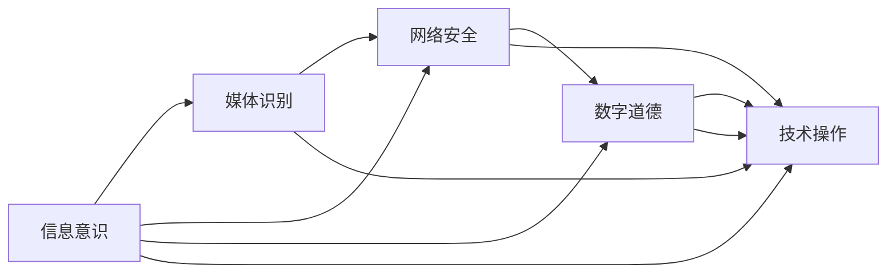

                 

## 1. 背景介绍

在现代社会中，数字素养（Digital Literacy）已经成为一种基本的技能，它关乎个人在数字世界中的生存和发展。随着科技的飞速进步，尤其是互联网、人工智能、大数据等技术的普及，数字素养的重要性日益凸显。从政府到企业，从教育到家庭，从学术到文化，各个领域都在积极推进数字素养的普及和提升。

### 1.1 数字素养的定义与重要性

数字素养通常被定义为个体能够有效使用和理解数字技术，特别是在获取、处理和创建数字信息的能力。数字素养不仅仅涉及技术操作层面，更关乎信息意识、媒体识别、网络安全、数字道德等多方面的综合素养。

在全球化、信息化时代，数字素养对于公民的日常生活、职业发展、社会参与具有至关重要的意义。掌握数字素养，可以更好地获取信息、提升工作效率、维护个人隐私、参与公共讨论、促进社会和谐。数字素养水平的高低，直接关系到个体在数字世界的适应力和竞争力，进而影响社会的整体进步和稳定。

### 1.2 数字素养的现状与挑战

尽管数字素养的重要性日益显现，但在全球范围内，数字素养的普及程度仍然存在显著差异。特别是在发展中国家和偏远地区，由于基础设施不足、教育资源匮乏、技术普及滞后等原因，数字素养的普及面临着巨大挑战。同时，数字素养水平的不均衡，也加剧了社会的不平等问题，进一步拉大了数字鸿沟。

此外，数字素养还面临着技术更新快、安全风险高、隐私保护难等挑战。如何有效应对这些挑战，提升全民数字素养水平，已经成为各国政府、社会组织、企业、学校等多元主体共同关注的重大课题。

## 2. 核心概念与联系

### 2.1 核心概念概述

数字素养的核心概念包括：
- **信息意识**：识别、评估、利用信息的能力。
- **媒体识别**：区分、分析、评价各类媒体信息的能力。
- **网络安全**：保护个人信息、防范网络攻击的能力。
- **数字道德**：遵守网络行为规范、维护网络秩序的能力。
- **技术操作**：掌握各类数字工具、软件应用的能力。

这些概念之间相互关联，共同构成数字素养的完整框架。信息意识和媒体识别提供了基础的信息获取和分析能力，网络安全确保了信息获取和传播的安全性，数字道德则规范了信息处理和传播的行为，技术操作则是实现上述能力的手段和工具。

### 2.2 核心概念的逻辑联系

为了更好地理解数字素养的构成和作用，我们通过以下Mermaid流程图展示了核心概念之间的联系：



这个流程图展示了信息意识、媒体识别、网络安全、数字道德和技术操作之间的逻辑联系：

- 信息意识是基础，帮助识别和获取有价值的信息。
- 媒体识别进一步分析媒体信息的内容和质量，增强信息的可信度。
- 网络安全确保信息获取和传播的安全性，防止信息泄露和攻击。
- 数字道德规范信息处理和传播的行为，维护网络秩序。
- 技术操作是实现上述能力的具体手段和工具。

通过这一逻辑链条，数字素养的多维度能力得以有机结合，共同提升个体在数字世界中的适应力和竞争力。

## 3. 核心算法原理 & 具体操作步骤

### 3.1 算法原理概述

提升数字素养的算法原理主要围绕信息获取、信息处理、信息传播三个方面展开。通过有针对性地设计算法和步骤，帮助用户提升数字素养，实现其在数字世界中的高效和有效行动。

- **信息获取算法**：基于搜索引擎优化（SEO）、推荐系统、社交网络等技术，帮助用户高效获取所需信息。
- **信息处理算法**：基于数据清洗、数据挖掘、数据分析等技术，帮助用户分析和理解信息的价值。
- **信息传播算法**：基于社交媒体、内容创作、用户交互等技术，帮助用户有效地传播和分享信息。

### 3.2 算法步骤详解

以信息获取为例，详细讲解信息获取算法的步骤：

1. **目标设定**：明确用户需要获取的信息类型、目标来源、需求深度。
2. **信息搜索**：使用搜索引擎、推荐系统等技术，找到相关度高的信息源。
3. **信息筛选**：通过关键词匹配、评分排序等方式，筛选出最相关的信息。
4. **信息整合**：将分散的信息整合在一起，形成系统全面的知识体系。
5. **信息评估**：通过可靠性、权威性、时效性等指标，评估信息的质量和价值。

### 3.3 算法优缺点

信息获取算法具有高效、精准、个性化的优点，能够快速获取用户所需信息，提高工作效率。但同时也面临信息过载、误导信息、隐私泄露等风险，需要结合信息筛选和评估算法，提升信息质量。

### 3.4 算法应用领域

信息获取算法广泛应用于搜索引擎、新闻聚合、在线教育、电子商务等领域，帮助用户快速获取所需信息，提升其数字素养水平。同时，信息获取算法还涉及到隐私保护、信息筛选等伦理道德问题，需要在算法设计中加以考虑。

## 4. 数学模型和公式 & 详细讲解 & 举例说明

### 4.1 数学模型构建

信息获取算法的数学模型可以表示为：

$$
I = f(S, Q, R)
$$

其中，$I$ 为获取的信息，$S$ 为搜索源，$Q$ 为查询关键词，$R$ 为搜索结果。模型表示通过搜索源 $S$ 和查询关键词 $Q$，经过算法 $f$ 的处理，得到最终的信息 $I$。

### 4.2 公式推导过程

为了优化信息获取算法，我们可以引入PageRank算法、协同过滤算法等数学模型，进行推导和改进。以PageRank算法为例，其基本思想是通过计算网页的链接结构，评估网页的重要性，从而提高搜索结果的相关性和可信度。

PageRank算法的核心公式为：

$$
P_{i}^{(k+1)} = (1 - d) + d \sum_{j=1}^{N} \frac{P_{j}^{(k)}}{L(j)} \cdot P_{t(j)}^{(k)}
$$

其中，$P_i$ 表示网页 $i$ 在迭代 $k+1$ 次后的重要性得分，$d$ 为阻尼因子，$L(j)$ 为网页 $j$ 的链接数量，$P_{t(j)}^{(k)}$ 表示网页 $j$ 的出度权重。

通过迭代计算，最终得到每个网页的PageRank得分，从而排序并返回与查询相关的网页。

### 4.3 案例分析与讲解

假设我们要在Google Scholar上查找关于深度学习的最新研究论文，可以按照以下步骤进行信息获取：

1. 设定目标：查找2019年以后的深度学习研究论文。
2. 搜索源：使用Google Scholar作为搜索源。
3. 查询关键词：输入“深度学习 2019年 研究论文”。
4. 信息筛选：根据搜索结果的标题、摘要、引用数量等指标，筛选出最相关的论文。
5. 信息整合：将筛选出的论文整理成列表，供后续阅读和分析。

通过上述步骤，用户能够高效获取所需信息，提升其数字素养水平。同时，需要注意的是，Google Scholar的搜索算法综合了PageRank、Google关键词、作者影响等因子，确保了搜索结果的相关性和可信度。

## 5. 项目实践：代码实例和详细解释说明

### 5.1 开发环境搭建

信息获取算法的开发环境搭建需要以下步骤：

1. 安装Python：确保Python环境已经搭建完成，可以使用Anaconda、Miniconda等工具进行安装和管理。
2. 安装Pandas、Numpy、Scikit-learn等库：这些库是数据分析和算法实现的基础，可以通过pip安装。
3. 搭建搜索引擎：可以使用开源搜索引擎如Elasticsearch、Solr等，或使用Python的Scrapy框架自行搭建爬虫。
4. 设置数据源：定义好搜索源、关键词、搜索结果等数据源，以便算法进行信息获取。

### 5.2 源代码详细实现

以下是一个简单的信息获取算法代码示例：

```python
import pandas as pd
from sklearn.feature_extraction.text import CountVectorizer
from sklearn.metrics.pairwise import cosine_similarity

def get_information(query, sources, k=5):
    # 构建搜索词向量
    vectorizer = CountVectorizer()
    query_vector = vectorizer.fit_transform([query])

    # 初始化搜索结果
    results = []
    for source in sources:
        # 爬取源数据
        data = fetch_data(source)

        # 构建文本向量
        data_vector = vectorizer.transform(data)

        # 计算相似度
        similarity = cosine_similarity(query_vector, data_vector)
        relevance = similarity.mean()

        # 筛选相关性高的结果
        if relevance >= 0.5:
            results.append(source)

        # 确保结果数量不超过k
        if len(results) >= k:
            break

    return results
```

### 5.3 代码解读与分析

上述代码示例实现了基本的文本相似度计算，用于筛选与查询相关的结果。具体分析如下：

- 首先使用CountVectorizer将查询词和源数据转换为词向量，方便计算相似度。
- 通过cosine_similarity计算查询词向量与源数据向量之间的余弦相似度，得到相关性得分。
- 筛选相关性得分高于0.5的结果，确保搜索结果的相关性和准确性。
- 控制结果数量不超过k，防止信息过载。

### 5.4 运行结果展示

假设我们要获取关于“区块链技术”的信息，可以调用上述代码示例：

```python
sources = ["Bitcoin", "Ethereum", "Blockchain"]
query = "区块链技术"
results = get_information(query, sources)
print(results)
```

运行结果可能包含“Bitcoin”、“Ethereum”、“Blockchain”等搜索结果，帮助我们快速获取所需信息。

## 6. 实际应用场景

### 6.1 智慧城市

在智慧城市建设中，数字素养可以通过以下方式提升：

- **信息获取**：利用智慧城市的各类传感器、监控设备等，实时获取交通、环境、公共安全等数据，提升城市管理水平。
- **信息处理**：通过数据分析和预测模型，优化城市资源配置，提高公共服务的效率和质量。
- **信息传播**：利用智慧城市平台，及时发布公共服务信息、应急预警信息等，保障市民的知情权和参与权。

### 6.2 远程教育

远程教育中，数字素养可以通过以下方式提升：

- **信息获取**：利用在线学习平台、教育资源库等，获取丰富的学习资源和信息，提升学习效果。
- **信息处理**：通过在线测评、作业提交等手段，分析学生的学习进度和难点，个性化定制学习计划。
- **信息传播**：利用社交媒体、在线讨论等平台，促进学生之间的互动和合作，增强学习体验。

### 6.3 数字健康

数字健康领域，数字素养可以通过以下方式提升：

- **信息获取**：利用电子病历、健康APP等，获取个人健康数据和医疗信息，提升健康管理水平。
- **信息处理**：通过数据分析和健康评估模型，识别健康风险，制定个性化的健康管理方案。
- **信息传播**：利用在线咨询、健康科普等平台，促进健康知识的传播和普及，提高公众健康素养。

## 7. 工具和资源推荐

### 7.1 学习资源推荐

- **《数字素养：未来公民必备技能》**：系统介绍数字素养的理论基础和实践方法，适合各界人士阅读。
- **Coursera《数字素养与全球公民》课程**：由知名大学和专家开设的在线课程，全面讲解数字素养的重要性和提升方法。
- **edX《数字素养与网络安全》课程**：讲解数字素养与网络安全的基础知识和实践技巧，适合各个年龄段的学员。

### 7.2 开发工具推荐

- **Python**：作为数字素养算法开发的主流语言，Python具有丰富的第三方库和工具，如Pandas、Scikit-learn、TensorFlow等，适合开发复杂的算法模型。
- **Scrapy**：Python的爬虫框架，适合抓取各类网站数据，构建搜索引擎和信息获取算法。
- **Elasticsearch**：开源搜索引擎，支持复杂的全文搜索、数据分析等功能，适合构建高效的搜索系统。

### 7.3 相关论文推荐

- **《数字素养在智慧城市中的应用研究》**：探讨数字素养在智慧城市中的重要作用和提升路径，适合城市规划和信息技术从业人员阅读。
- **《远程教育中数字素养提升的策略研究》**：总结远程教育中提升数字素养的有效方法和实践经验，适合教育技术专家和远程教育工作者阅读。
- **《数字健康中的数字素养建设》**：研究数字健康领域中提升数字素养的策略和实践，适合医疗健康从业者和IT专业人士阅读。

## 8. 总结：未来发展趋势与挑战

### 8.1 研究成果总结

数字素养作为公民参与数字社会的基础，其重要性和紧迫性日益凸显。当前，数字素养的普及和提升已经引起了全球范围内的高度重视，各国政府、企业、教育机构等多方力量共同推进数字素养的普及和提升。通过算法和技术的支持，数字素养的提升已经进入了一个快速发展的阶段，为公民在数字社会的全面参与和贡献奠定了坚实的基础。

### 8.2 未来发展趋势

未来，数字素养的提升将呈现以下几个发展趋势：

1. **个性化定制**：随着AI和大数据技术的发展，数字素养将更加注重个性化和定制化，以满足不同人群的需求。
2. **多模态融合**：数字素养将融合视觉、听觉、触觉等多模态信息，提升用户的综合素养和体验。
3. **终身学习**：数字素养将伴随用户的一生，通过持续学习和自我提升，实现终身教育的目标。
4. **跨文化交流**：数字素养将促进不同文化背景下的交流和理解，提升全球公民的数字素养水平。
5. **伦理道德**：数字素养将更加注重伦理道德教育，引导用户在使用数字技术时遵守规范，维护网络秩序。

### 8.3 面临的挑战

尽管数字素养的普及和提升已经取得了显著进展，但仍面临诸多挑战：

1. **数据隐私**：数字素养的提升离不开数据的获取和分析，如何保护用户隐私和数据安全是一个重要的难题。
2. **数字鸿沟**：数字素养的普及仍存在地域和收入不均等问题，需要多方共同努力缩小数字鸿沟。
3. **技术更新**：数字技术发展迅速，如何及时更新和普及新技术，也是一个挑战。
4. **教育资源**：数字素养的提升需要优质的教育资源和教师培训，如何提升教育资源的普及和质量，需要社会各界的共同努力。
5. **数字道德**：数字素养涉及数字道德教育，如何培养用户正确使用数字技术，避免网络诈骗、虚假信息等不良行为，也是数字素养提升的重要方面。

### 8.4 研究展望

未来，数字素养的研究需要在以下几个方面进行深入探索：

1. **数据隐私保护**：研究如何在使用数据的同时，保护用户隐私和数据安全，保障数字素养提升的公平性和透明性。
2. **多模态融合技术**：研究多模态融合技术，提升用户的综合素养和体验，构建更加丰富、全面的数字素养模型。
3. **终身学习系统**：研究终身学习系统，构建智能化、个性化的学习平台，帮助用户持续提升数字素养。
4. **跨文化交流平台**：研究跨文化交流平台，促进不同文化背景下的数字素养教育，提升全球公民的数字素养水平。
5. **数字道德教育**：研究数字道德教育，培养用户正确使用数字技术，建立健康、文明的网络环境。

总之，数字素养作为公民参与数字社会的重要基石，其提升和发展离不开技术、教育、社会等多方的共同努力。通过不断的探索和实践，数字素养的普及和提升将为社会的全面进步和和谐发展提供强大的动力。

## 9. 附录：常见问题与解答

**Q1：数字素养与网络安全有何关系？**

A: 数字素养与网络安全密切相关。掌握数字素养，可以增强用户对网络威胁的识别和防范能力，提升网络安全意识。例如，通过数字素养教育，用户可以学会识别钓鱼邮件、防范恶意软件等常见网络攻击，保护自身信息安全。

**Q2：如何提升学生的数字素养？**

A: 提升学生的数字素养，可以从以下几个方面入手：
- **课程设计**：开设专门的网络素养课程，结合实际案例进行教学。
- **实践操作**：通过实验、实习等方式，让学生亲身体验数字技术的实际应用。
- **家校合作**：家长和教师共同参与，提升学生在家和校的数字素养水平。
- **资源提供**：提供丰富的数字素养学习资源，如在线课程、科普读物、实践工具等，帮助学生自主学习。

**Q3：数字素养与信息意识有何区别？**

A: 数字素养和信息意识虽然密切相关，但并不完全相同。信息意识主要指获取、处理和创造信息的能力，而数字素养还包括媒体识别、网络安全、数字道德等多方面的综合素养。数字素养在信息获取的基础上，进一步强调信息处理和传播的能力，以及在使用数字技术时的伦理道德规范。

**Q4：数字素养如何与终身学习结合？**

A: 数字素养与终身学习可以相互促进。通过数字素养教育，提升用户的信息获取、处理和传播能力，使其能够持续学习和自我提升。终身学习系统可以通过智能化、个性化的学习平台，帮助用户制定学习计划、获取学习资源、评估学习效果，实现终身学习的目标。

**Q5：数字素养在智慧城市中的应用有哪些？**

A: 数字素养在智慧城市中的应用主要体现在以下几个方面：
- **信息获取**：通过各类传感器、监控设备等，实时获取交通、环境、公共安全等数据，提升城市管理水平。
- **信息处理**：通过数据分析和预测模型，优化城市资源配置，提高公共服务的效率和质量。
- **信息传播**：利用智慧城市平台，及时发布公共服务信息、应急预警信息等，保障市民的知情权和参与权。

总之，数字素养作为公民参与数字社会的基础，其提升和发展离不开技术、教育、社会等多方的共同努力。通过不断的探索和实践，数字素养的普及和提升将为社会的全面进步和和谐发展提供强大的动力。

