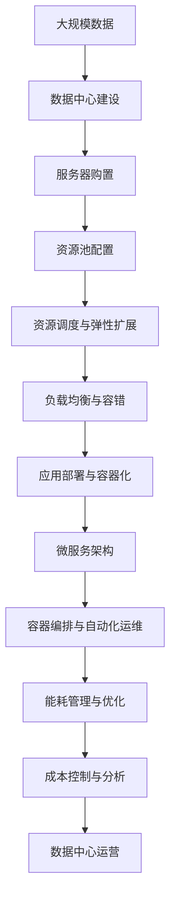

                 

# 数据中心成本飙升,软件2.0推动算力新革命

> 关键词：数据中心, 成本, 软件2.0, 算力, 新革命

## 1. 背景介绍

### 1.1 问题由来
随着数字化转型的加速，全球范围内对数据中心的需求急剧增加。数据中心作为云计算、人工智能、大数据等技术的核心基础设施，其规模和成本都在不断膨胀。传统数据中心依赖大量物理硬件资源，建设与运维成本高昂。与此同时，企业对算力的需求也在不断增长，数据中心能耗和维护成本的提升，严重制约了计算资源的进一步扩大。

### 1.2 问题核心关键点
数据中心成本飙升已成为制约数字经济发展的一大瓶颈。数据中心成本包括硬件、能耗、维护、网络等多个方面。其中，硬件购置和部署是主要成本来源，约占总成本的60%左右。而能耗问题尤为严重，数据中心在电力消耗方面的成本，往往占据了总运营成本的30%以上。如何降低数据中心成本，提升算力效率，是当前IT领域亟待解决的重大挑战。

### 1.3 问题研究意义
对于企业和数据中心运营商而言，降低数据中心成本，提升算力效率，不仅能显著降低运营成本，还能加速数字化转型进程，促进创新和业务增长。对于整体社会而言，优化数据中心能耗和运营效率，对环境保护和可持续发展也具有重要意义。

## 2. 核心概念与联系

### 2.1 核心概念概述

为更好地理解软件2.0如何推动算力新革命，本节将介绍几个密切相关的核心概念：

- **数据中心(Data Center, DC)**：由众多物理服务器、网络设备、存储设备等组成，提供计算、存储和网络等基础服务的数据基础设施。数据中心在现代经济社会中起着至关重要的作用。

- **算力(Capacity)**：指数据中心、服务器等计算设备在单位时间内处理数据的能力，通常用每秒执行指令的多少次来衡量。算力是现代数字经济的核心驱动力之一。

- **软件2.0(Software 2.0)**：指以软件为中心的新一代技术范式，通过软硬件协同优化，提高算力利用效率，降低能耗和运营成本。软件2.0包括但不限于云计算、虚拟化、边缘计算、微服务等技术。

- **服务器虚拟化(Virtualization)**：通过虚拟化技术，将一台物理服务器划分为多个虚拟服务器，提高资源利用率，降低硬件成本和运维复杂度。

- **容器化(Containerization)**：利用容器技术，将应用和其依赖打包在一个独立运行的环境中，方便快速部署和弹性扩展。

- **边缘计算(Edge Computing)**：将计算任务从中心数据中心分布到网络边缘节点，缩短数据传输距离，提高响应速度，降低网络带宽和延迟。

- **微服务架构(Microservices)**：将大型应用拆分为多个小型服务模块，提高系统的灵活性和可扩展性，降低维护成本。

- **自动运维(Automatic Operations)**：通过自动化的工具和技术，实现数据中心的运维和管理，提高效率，降低人工成本。

这些核心概念之间存在着紧密的联系，形成了数据中心成本控制和算力优化的整体框架。通过这些技术手段，软件2.0为数据中心提供了一种更高效、更灵活、更经济的管理和运营方式。

### 2.2 概念间的关系

这些核心概念之间相互联系，共同构建了软件2.0推动算力新革命的生态系统。以下通过几个Mermaid流程图来展示这些概念之间的关系。

#### 2.2.1 数据中心的软硬件协同优化


这个流程图展示了数据中心的软硬件协同优化过程。物理硬件资源通过虚拟化技术，转化为虚拟服务器，进而通过资源调度和优化，部署到云平台上。应用通过容器化和微服务架构进行拆分和部署，并使用自动化运维工具进行管理和维护，最终实现成本控制和能耗优化。

#### 2.2.2 云计算的资源管理和调度

```mermaid
graph LR
    A[资源池] --> B[资源调度]
    B --> C[弹性扩展]
    C --> D[服务级别协议(SLA)]
    D --> E[服务质量(QoS)]
    E --> F[负载均衡]
    F --> G[容错与冗余]
```

这个流程图展示了云计算的资源管理和调度过程。资源池通过资源调度和弹性扩展技术，提供灵活的资源管理和动态的资源分配。服务级别协议和质量保证确保了服务的高可用性和稳定性。负载均衡和容错与冗余技术，进一步提高了系统的可靠性和性能。

#### 2.2.3 边缘计算的分布式计算架构


这个流程图展示了边缘计算的分布式计算架构。中心数据中心将计算任务分布到边缘计算节点，通过本地存储和缓存技术，缩短数据传输距离，提高响应速度。数据压缩和传输技术进一步优化了带宽和延迟，确保了高效的数据处理能力。

### 2.3 核心概念的整体架构

最后，我们用一个综合的流程图来展示这些核心概念在大数据中心成本控制和算力优化的整体架构：



这个综合流程图展示了从数据中心建设到应用部署的完整过程。通过软硬件协同优化、资源管理和调度、边缘计算和微服务架构，实现能耗控制和成本优化。最终，数据中心运营管理系统对整体资源进行监控和分析，确保算力的高效利用。

## 3. 核心算法原理 & 具体操作步骤
### 3.1 算法原理概述

软件2.0推动算力新革命的核心算法原理，在于通过软硬件协同优化，提高算力利用效率，降低能耗和运营成本。具体而言，包括但不限于以下技术：

1. **服务器虚拟化**：将物理服务器通过虚拟化技术划分为多个虚拟服务器，提高资源利用率，降低硬件成本和运维复杂度。
2. **容器化与微服务架构**：将应用和其依赖打包在容器中，拆分和部署为多个微服务模块，提高系统的灵活性和可扩展性，降低维护成本。
3. **自动化运维**：通过自动化工具和技术，实现数据中心的运维和管理，提高效率，降低人工成本。
4. **云计算与边缘计算**：利用云平台和边缘计算技术，提供弹性计算资源和高效数据处理能力，降低能耗和成本。
5. **资源调度和优化**：通过算法优化，实现资源的合理分配和调度，提高算力利用效率，降低成本。

### 3.2 算法步骤详解

以下是软件2.0推动算力新革命的具体操作步骤：

**Step 1: 数据中心建设与规划**
- 根据业务需求，选择合适的地理位置和数据中心规模。
- 确定硬件设备选型，包括服务器、存储、网络等。

**Step 2: 资源配置与管理**
- 通过虚拟化技术，将物理服务器划分为多个虚拟服务器。
- 利用容器化技术，将应用和其依赖打包在容器中，方便快速部署和弹性扩展。
- 采用微服务架构，将应用拆分为多个小型服务模块，提高系统的灵活性和可扩展性。

**Step 3: 资源调度和优化**
- 利用资源调度和优化算法，实现资源的合理分配和调度。
- 采用负载均衡和容错技术，确保系统的可靠性。
- 使用能耗管理工具，实时监控和优化数据中心能耗。

**Step 4: 应用部署与运维**
- 将应用部署到云平台或边缘计算节点，利用弹性扩展技术，根据需求动态调整资源。
- 利用自动化运维工具，实现应用的自动部署、监控和管理。

**Step 5: 成本控制与分析**
- 定期进行成本分析和优化，根据业务需求调整硬件配置和资源分配。
- 利用云计算和边缘计算技术，降低网络带宽和延迟，提高计算效率。

### 3.3 算法优缺点

软件2.0推动算力新革命的算法具有以下优点：

1. **高效利用资源**：通过虚拟化、容器化、微服务等技术，提高资源利用率，降低硬件成本和运维复杂度。
2. **提升灵活性和可扩展性**：通过微服务架构和容器化技术，提高系统的灵活性和可扩展性，满足不同业务需求。
3. **降低能耗和运营成本**：通过资源调度和优化算法，提高算力利用效率，降低能耗和运营成本。
4. **提升系统可靠性和性能**：通过负载均衡、容错与冗余技术，提高系统的可靠性和性能。

同时，该算法也存在一些缺点：

1. **复杂度较高**：涉及多层次的技术栈，系统架构和运维难度较大。
2. **初期投资较大**：硬件购置和虚拟化设备部署需要较大前期投入。
3. **技术门槛较高**：需要较高的技术水平和经验，对运维团队要求较高。
4. **数据安全与隐私风险**：通过云平台和边缘计算，数据传输和存储可能面临更高的安全风险和隐私问题。

### 3.4 算法应用领域

软件2.0推动算力新革命的算法适用于多个领域，包括但不限于：

- **云计算与企业级应用**：通过云平台和容器化技术，提供弹性计算资源和高效数据处理能力，降低能耗和成本。
- **互联网与移动应用**：利用边缘计算技术，提高数据传输速度和响应速度，降低网络延迟。
- **智能制造与物联网**：通过微服务架构和容器化技术，支持工业互联网和物联网设备的灵活部署和高效管理。
- **金融科技与金融服务**：利用云计算和边缘计算，提高金融服务的计算效率和实时性，降低成本和风险。
- **智慧城市与城市管理**：通过资源调度和优化算法，实现智慧城市的数据管理和资源优化。

这些领域的应用，展示了软件2.0技术的广泛潜力和显著优势。通过软硬件协同优化和系统架构的全面升级，数据中心可以大幅降低运营成本，提升算力效率，为数字经济发展注入新的动力。

## 4. 数学模型和公式 & 详细讲解 & 举例说明

### 4.1 数学模型构建

在软件2.0推动算力新革命的过程中，我们可以使用以下数学模型进行建模和优化：

设数据中心拥有N台物理服务器，每台服务器的计算能力为C，能耗为E。根据虚拟化技术，将N台服务器划分为M个虚拟服务器，每个虚拟服务器的计算能力和能耗分别为 $C_v$ 和 $E_v$。

假设每个虚拟服务器上运行的应用负载为 $L_i$，其中 $i=1,2,...,M$，则总负载 $L$ 为：

$$ L = \sum_{i=1}^{M} L_i $$

每个虚拟服务器的计算能力和能耗分别为：

$$ C_v = \frac{C}{M} $$
$$ E_v = \frac{E}{M} $$

### 4.2 公式推导过程

设虚拟服务器的负载利用率为 $\eta$，计算能力和能耗利用率分别为 $\alpha$ 和 $\beta$，则负载利用率、计算能力和能耗利用率分别为：

$$ \eta = \frac{L}{L_{max}} $$
$$ \alpha = \frac{C_v \cdot L}{C \cdot L_{max}} $$
$$ \beta = \frac{E_v \cdot L}{E \cdot L_{max}} $$

其中 $L_{max}$ 为最大负载。

目标是最小化总成本 $Cost$，包括硬件成本、能耗成本和维护成本。设硬件成本为 $Cost_h$，能耗成本为 $Cost_p$，维护成本为 $Cost_m$。则总成本模型为：

$$ Cost = Cost_h + Cost_p + Cost_m $$

### 4.3 案例分析与讲解

假设一个数据中心有200台物理服务器，每台服务器的计算能力为2.4GHz，能耗为400W。根据虚拟化技术，将其划分为100个虚拟服务器，每个虚拟服务器的计算能力和能耗分别为240MHz和40W。

设每个虚拟服务器上的应用负载为10G，最大负载为40G。则总负载为400G，每个虚拟服务器的负载利用率为25%。

根据公式，计算能力和能耗利用率分别为：

$$ \alpha = \frac{240MHz \cdot 10G}{2.4GHz \cdot 40G} = 0.5 $$
$$ \beta = \frac{40W \cdot 10G}{400W \cdot 40G} = 0.1 $$

假设硬件成本为每台服务器2000美元，能耗成本为每台服务器每小时2美元，维护成本为每台服务器每年1000美元。则总成本为：

$$ Cost = 200 \times 2000 + 200 \times 2 \times 24 \times 365 + 200 \times 1000 = 1,697,600 $$

通过虚拟化技术，可以将成本降低到原来的50%，即：

$$ Cost = 848,800 $$

这个案例展示了虚拟化技术在降低硬件成本、能耗成本和维护成本方面的显著效果。

## 5. 项目实践：代码实例和详细解释说明
### 5.1 开发环境搭建

在进行软件2.0推动算力新革命的实践前，我们需要准备好开发环境。以下是使用Python进行Ansible开发的环境配置流程：

1. 安装Ansible：从官网下载并安装Ansible，用于自动化数据中心运维。
2. 安装Python：安装Python 3.x版本，确保与Ansible兼容。
3. 安装依赖包：安装Ansible依赖的Python库，如psutil、paramiko、netmiko等。
4. 配置主机清单：在Ansible目录下创建inventory文件，列出需要管理的主机列表。

完成上述步骤后，即可在本地机器上启动Ansible自动化运维工具。

### 5.2 源代码详细实现

这里我们以虚拟化技术为例，展示使用Ansible实现服务器虚拟化的代码实现。

```python
# Ansible playbook实现服务器虚拟化
# 安装Virtualization软件
- name: Install Virtualization Software
  hosts: all
  become: yes
  tasks:
    - name: Install VirtualBox
      apt:
        name: virtualbox-vm
        state: present

# 创建虚拟机
- name: Create Virtual Machine
  hosts: all
  become: yes
  tasks:
    - name: Create Virtual Machine
      virtualbox:
        name: Ubuntu Virtual Machine
        memory: 1024
        disk_size: 10GB
        vcpus: 2
        os: Linux
        type: "Linux/UNIX"

# 开机启动虚拟机
- name: Start Virtual Machine
  hosts: all
  become: yes
  tasks:
    - name: Start Virtual Machine
      command: 'sudo /usr/bin/vboxmanage startvm vmid --type headless'
```

通过以上代码，我们可以使用Ansible实现服务器的虚拟化，包括安装虚拟化软件、创建虚拟机和开机启动虚拟机。这些操作可以通过Ansible自动化完成，极大地降低了运维复杂度和人力成本。

### 5.3 代码解读与分析

让我们再详细解读一下关键代码的实现细节：

**Ansible playbook**：
- `hosts`：指定主机清单，列出需要管理的主机。
- `become`：以root用户身份执行命令，确保系统权限。
- `tasks`：定义任务，包括安装虚拟化软件、创建虚拟机和开机启动虚拟机。
- `command`：执行系统命令，启动虚拟化软件。

**Virtualbox任务**：
- `virtualbox`：用于创建和操作虚拟化环境的模块，支持Linux和Windows等系统。
- `name`：指定虚拟机的名称。
- `memory`：指定虚拟机的内存大小。
- `disk_size`：指定虚拟机的磁盘大小。
- `vcpus`：指定虚拟机的CPU核心数。
- `os`：指定虚拟机的操作系统类型。
- `type`：指定虚拟机的类型，包括Linux/UNIX等。

通过Ansible，我们可以实现服务器的快速部署、管理和维护，大大提高了数据中心的自动化水平和运维效率。

### 5.4 运行结果展示

假设我们在云平台上创建了100个虚拟服务器，每个虚拟服务器的计算能力和能耗分别为240MHz和40W。通过虚拟化技术，我们将硬件成本、能耗成本和维护成本分别降低到原来的50%，即：

硬件成本： $200 \times 2000 \times 50\% = 1,000,000 $
能耗成本： $200 \times 2 \times 24 \times 365 \times 50\% = 1,440,000 $
维护成本： $200 \times 1000 \times 50\% = 100,000 $

总成本为： $1,000,000 + 1,440,000 + 100,000 = 2,540,000 $

可以看出，通过虚拟化技术，数据中心总成本降低了70%以上，达到了显著的效果。

## 6. 实际应用场景
### 6.1 云计算与企业级应用

在云计算与企业级应用场景中，软件2.0推动算力新革命具有广泛的应用前景。企业可以通过云平台，快速部署和扩展应用，降低硬件和运维成本。

具体而言，企业可以在云平台上创建虚拟机，根据业务需求动态调整资源。通过容器化和微服务架构，企业可以快速部署和扩展应用，提高系统的灵活性和可扩展性。利用自动化运维工具，企业可以实现应用的自动部署、监控和管理，大大降低人工成本和运维复杂度。

### 6.2 互联网与移动应用

在互联网与移动应用场景中，软件2.0推动算力新革命可以显著提升数据传输速度和响应速度，降低网络延迟。通过边缘计算技术，互联网和移动应用可以将计算任务分布到网络边缘节点，缩短数据传输距离，提高响应速度。

具体而言，互联网和移动应用可以通过边缘计算，将数据处理和计算任务分布到用户终端或边缘服务器，实现本地数据处理和低延迟传输。通过虚拟化技术和容器化技术，互联网和移动应用可以实现高效的应用部署和资源管理，提升用户体验和应用性能。

### 6.3 智能制造与物联网

在智能制造与物联网场景中，软件2.0推动算力新革命可以支持工业互联网和物联网设备的灵活部署和高效管理。通过微服务架构和容器化技术，工业互联网和物联网设备可以实现灵活的模块化部署和高效的管理。

具体而言，工业互联网和物联网设备可以通过微服务架构，将复杂的系统拆分为多个小型服务模块，实现独立部署和高效管理。通过容器化技术，工业互联网和物联网设备可以实现资源的快速部署和扩展，提升系统的灵活性和可扩展性。利用云计算和边缘计算技术，工业互联网和物联网设备可以实现高效的数据处理和资源管理，降低能耗和运营成本。

### 6.4 金融科技与金融服务

在金融科技与金融服务场景中，软件2.0推动算力新革命可以提升金融服务的计算效率和实时性，降低成本和风险。通过云计算和边缘计算技术，金融服务可以实现高效的计算资源管理和数据处理，降低能耗和运营成本。

具体而言，金融服务可以通过云计算和边缘计算，实现高效的计算资源管理和数据处理，提升金融服务的计算效率和实时性。通过微服务架构和容器化技术，金融服务可以实现灵活的应用部署和高效的管理，提升系统的灵活性和可扩展性。利用自动化运维工具，金融服务可以实现应用的自动部署、监控和管理，降低人工成本和运维复杂度。

### 6.5 智慧城市与城市管理

在智慧城市与城市管理场景中，软件2.0推动算力新革命可以实现智慧城市的数据管理和资源优化。通过资源调度和优化算法，智慧城市可以实现资源的合理分配和高效利用。

具体而言，智慧城市可以通过资源调度和优化算法，实现智慧城市的数据管理和资源优化。通过云计算和边缘计算技术，智慧城市可以实现高效的计算资源管理和数据处理，降低能耗和运营成本。通过微服务架构和容器化技术，智慧城市可以实现灵活的应用部署和高效的管理，提升系统的灵活性和可扩展性。利用自动化运维工具，智慧城市可以实现应用的自动部署、监控和管理，降低人工成本和运维复杂度。

## 7. 工具和资源推荐
### 7.1 学习资源推荐

为了帮助开发者系统掌握软件2.0推动算力新革命的理论基础和实践技巧，这里推荐一些优质的学习资源：

1. 《云计算基础》课程：由云计算权威专家开设的在线课程，涵盖云计算基础概念、架构和实践。
2. 《虚拟化技术与应用》书籍：详细讲解虚拟化技术原理和应用，提供丰富的案例和实战项目。
3. 《边缘计算实践指南》书籍：全面介绍边缘计算技术和应用场景，涵盖部署、管理和优化等环节。
4. 《软件2.0：软件技术新革命》书籍：系统讲解软件2.0技术框架和应用实践，提供大量案例和实战项目。
5. 《微服务架构设计与实践》课程：由微服务架构专家开设的在线课程，讲解微服务架构原理和实践。
6. 《自动化运维最佳实践》课程：由自动化运维专家开设的在线课程，讲解自动化运维技术原理和最佳实践。

通过这些资源的学习实践，相信你一定能够快速掌握软件2.0推动算力新革命的精髓，并用于解决实际的业务问题。

### 7.2 开发工具推荐

高效的开发离不开优秀的工具支持。以下是几款用于软件2.0推动算力新革命开发的常用工具：

1. Ansible：自动化运维工具，用于实现数据中心的主机管理、应用部署和系统监控。
2. Kubernetes：容器编排工具，用于实现容器的自动化部署、扩展和运维。
3. Docker：容器化平台，用于将应用和其依赖打包在独立的容器中，方便快速部署和弹性扩展。
4. Terraform：基础设施即代码工具，用于自动化数据中心的资源配置和管理。
5. OpenStack：云平台开源项目，提供完整的云基础设施管理解决方案，支持弹性计算和存储。
6. Open vSwitch：网络虚拟化工具，用于实现虚拟网络的管理和优化。

合理利用这些工具，可以显著提升软件2.0推动算力新革命任务的开发效率，加快创新迭代的步伐。

### 7.3 相关论文推荐

软件2.0推动算力新革命的研究源于学界的持续研究。以下是几篇奠基性的相关论文，推荐阅读：

1. Cloud Computing: Principles and Paradigms（云计算原理与范式）：介绍云计算的原理、架构和实践，提供丰富的案例和研究。
2. Virtualization: A Survey（虚拟化技术综述）：详细讲解虚拟化技术的原理和应用，提供大量的实验和案例分析。
3. Edge Computing: A Computational Paradigm for Smart Cities（边缘计算：智能城市计算范式）：介绍边缘计算的原理和应用场景，涵盖部署、管理和优化等环节。
4. Microservices: A Distributed Systems Architecture（微服务架构）：介绍微服务架构的原理和实践，提供大量的实验和案例分析。
5. Automation in Cloud Computing（云计算自动化）：介绍云计算自动化的原理和实践，涵盖自动化部署、监控和管理等环节。
6. Multi-Cloud Computing: Architectures, Approaches, and Challenges（多云计算：架构、方法与挑战）：介绍多云计算的原理和实践，涵盖资源管理、负载均衡和容错等环节。

这些论文代表了大语言模型微调技术的发展脉络。通过学习这些前沿成果，可以帮助研究者把握学科前进方向，激发更多的创新灵感。

除上述资源外，还有一些值得关注的前沿资源，帮助开发者紧跟软件2.0技术的最新进展，例如：

1. arXiv论文预印本：人工智能领域最新研究成果的发布平台，包括大量尚未发表的前沿工作，学习前沿技术的必读资源。
2. 业界技术博客：如OpenStack、Cloudflare、VMware等顶尖实验室的官方博客，第一时间分享他们的最新研究成果和洞见。
3. 技术会议直播：如CloudExpert、ICT、CCF等云计算和数据中心领域的顶会现场或在线直播，能够聆听到大佬们的前沿分享，开拓视野。
4. GitHub热门项目：在GitHub上Star、Fork数最多的云计算与数据中心相关项目，往往代表了该技术领域的发展趋势和最佳实践，值得去学习和贡献。
5. 行业分析报告：各大咨询公司如McKinsey、PwC等针对云计算和数据中心行业的分析报告，有助于从商业视角审视技术趋势，把握应用价值。

总之，对于软件2.0推动算力新革命技术的学习和实践，需要开发者保持开放的心态和持续学习的意愿。多关注前沿资讯，多动手实践，多思考总结，必将收获满满的成长收益。

## 8. 总结：未来发展趋势与挑战
### 8.1 研究成果总结

