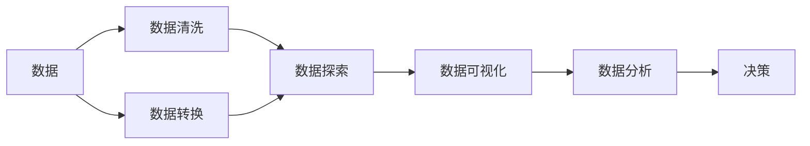

                 

# 数据可视化与数据探索原理与代码实战案例讲解

> 关键词：数据可视化, 数据探索, 数据分析, 数据科学, 数据可视化工具, 数据探索技术, 数据分析方法

## 1. 背景介绍

在信息化时代，数据无处不在。无论是企业决策、科学研究，还是日常工作、生活决策，都离不开数据的支撑。数据可视化与数据探索是大数据分析中不可或缺的环节，其重要性不言而喻。本章节将详细阐述数据可视化与数据探索的重要背景、关键概念及其应用场景。

### 1.1 数据的重要性

在信息化时代，数据量呈指数级增长，数据已成为推动经济、科研和社会进步的重要资源。无论是政府决策、企业运营，还是个人生活，都离不开数据的支撑。数据的重要性体现在以下方面：

- **决策支持**：通过数据可视化与数据探索，决策者可以直观、准确地了解数据特征和趋势，从而做出更为科学的决策。
- **业务优化**：企业通过对内部数据的深入分析，可以优化产品设计、营销策略等，提升竞争力。
- **社会管理**：政府可以通过数据可视化与数据探索，及时掌握社会动态，提升治理能力。
- **个人生活**：普通用户通过数据分析和可视化，可以更好地管理个人财务、健康等。

### 1.2 数据可视化的应用场景

数据可视化与数据探索广泛应用于各种领域，包括但不限于：

- **商业智能(BI)**：通过对业务数据的可视化，帮助企业洞察市场趋势、客户需求等。
- **科学研究**：在科学研究中，数据可视化有助于发现新的科学规律、预测模型结果。
- **社会治理**：政府可以利用数据可视化技术，实时监控社会动态，提升治理效率。
- **健康管理**：通过健康数据的可视化，个人可以更好地了解自身健康状况，医生可以提供更为精准的诊疗方案。
- **教育培训**：教育机构利用数据可视化，可以直观展示学生学习情况，提升教学质量。

## 2. 核心概念与联系

### 2.1 核心概念概述

为了更好地理解数据可视化与数据探索的原理和应用，本章节将介绍几个核心概念，并通过Mermaid流程图来展示它们之间的关系。

- **数据可视化**：将数据通过图形、图表等形式直观展示，帮助人们更好地理解和分析数据。
- **数据探索**：通过数据清洗、数据转换、数据分析等技术手段，深入挖掘数据背后的信息和模式。
- **数据科学**：运用统计学、机器学习等技术，从数据中提取有价值的信息，推动决策和应用。

以下是一个Mermaid流程图，展示了数据可视化与数据探索的核心概念及其联系：



### 2.2 概念间的关系

通过上述流程图，我们可以清晰地看到数据可视化与数据探索之间的关系：

- 数据首先经过清洗和转换，成为结构化数据。
- 结构化数据通过数据探索挖掘出有价值的信息。
- 数据探索的结果通过数据可视化直观展示，便于理解和分析。
- 通过数据分析，从可视化结果中提取深层次的信息，辅助决策。

## 3. 核心算法原理 & 具体操作步骤

### 3.1 算法原理概述

数据可视化与数据探索的核心算法包括数据清洗、数据转换、数据探索和数据可视化。本章节将详细介绍这些算法的原理。

#### 3.1.1 数据清洗

数据清洗是数据可视化的重要前提，主要目的是去除数据中的噪音和异常值，确保数据的准确性和一致性。

**算法原理**：
- **缺失值处理**：通过插值、均值填补等方法处理缺失值。
- **异常值检测**：使用箱线图、z-score等方法检测并处理异常值。
- **重复值处理**：通过去重或合并处理重复数据。

**操作步骤**：
1. 数据导入与预览。
2. 缺失值处理，选择适当的填补方法。
3. 异常值检测，根据情况删除或替换异常值。
4. 重复值处理，保留不重复的数据。

#### 3.1.2 数据转换

数据转换是将原始数据转换为适合分析和可视化的形式。常用的数据转换方法包括数据标准化、归一化等。

**算法原理**：
- **数据标准化**：将数据按比例缩放，使得数据范围在[0,1]或[-1,1]之间。
- **归一化**：将数据缩放到均值为0、方差为1的分布。

**操作步骤**：
1. 选择适当的标准化或归一化方法。
2. 应用所选方法对数据进行转换。
3. 验证转换效果，确保数据分布合理。

#### 3.1.3 数据探索

数据探索是通过统计分析、机器学习等技术手段，深入挖掘数据背后的信息和模式。常用的数据探索方法包括描述性统计、聚类分析、关联规则等。

**算法原理**：
- **描述性统计**：计算数据的基本统计量，如均值、中位数、标准差等。
- **聚类分析**：使用K-Means、层次聚类等方法，将数据分为不同的群组。
- **关联规则**：使用Apriori算法、FP-Growth等方法，发现数据中的关联关系。

**操作步骤**：
1. 应用描述性统计方法，计算数据的基本统计量。
2. 应用聚类分析方法，对数据进行分组。
3. 应用关联规则方法，发现数据中的关联关系。

#### 3.1.4 数据可视化

数据可视化是将数据通过图形、图表等形式直观展示，便于人们理解和分析数据。常用的数据可视化工具包括Tableau、Power BI、Matplotlib、Seaborn等。

**算法原理**：
- **散点图**：展示两个变量之间的关系。
- **柱状图**：比较不同类别之间的数据分布。
- **折线图**：展示数据随时间变化的趋势。
- **箱线图**：展示数据分布的离散程度。
- **热力图**：展示二维数据的密度分布。

**操作步骤**：
1. 选择适当的可视化工具和类型。
2. 应用所选工具和类型对数据进行可视化。
3. 调整可视化效果，确保展示效果最佳。

## 4. 数学模型和公式 & 详细讲解  
### 4.1 数学模型构建

为了更系统地理解数据可视化与数据探索的数学模型，本章节将介绍几个常用的数学模型，并通过公式推导和案例分析，帮助读者更好地掌握。

#### 4.1.1 描述性统计模型

描述性统计是数据探索的基础，常用的描述性统计量包括均值、中位数、标准差、方差等。

**数学模型**：
- **均值**：$\mu = \frac{1}{n}\sum_{i=1}^n x_i$
- **中位数**：$M = \frac{1}{2}[\sum_{i=1}^{n}(x_i + x_{i+1})]$
- **标准差**：$\sigma = \sqrt{\frac{1}{n-1}\sum_{i=1}^n (x_i - \mu)^2}$
- **方差**：$Var(x) = \frac{1}{n}\sum_{i=1}^n (x_i - \mu)^2$

**案例分析**：
假设有一组数据 $x = [1, 2, 3, 4, 5]$，通过计算得到：
- 均值为 $\mu = 3$
- 中位数为 $M = 3$
- 标准差为 $\sigma = 1.5811$
- 方差为 $Var(x) = 2.5$

#### 4.1.2 聚类分析模型

聚类分析是将数据分为不同组的方法，常用的聚类算法包括K-Means、层次聚类等。

**数学模型**：
- **K-Means算法**：将数据分为K个簇，每个簇的中心为 $\mu_k = \frac{1}{n_k}\sum_{i=1}^{n_k} x_i$
- **层次聚类算法**：构建聚类树，从下到上逐步合并数据点。

**案例分析**：
假设有一组数据 $x = [1, 2, 3, 4, 5]$，通过K-Means算法将其分为两组，结果如下：
- 组1：$x_1 = [1, 2]$
- 组2：$x_2 = [3, 4, 5]$

#### 4.1.3 关联规则模型

关联规则是发现数据中变量之间关联关系的方法，常用的关联规则算法包括Apriori算法、FP-Growth算法等。

**数学模型**：
- **Apriori算法**：构建频繁项集，通过连接生成候选项集。
- **FP-Growth算法**：基于频繁模式树，高效生成关联规则。

**案例分析**：
假设有一组数据 $x = [A, B, C, D, E]$，通过Apriori算法，可以发现以下关联规则：
- $A \rightarrow B$
- $B \rightarrow C$
- $C \rightarrow D$
- $D \rightarrow E$

### 4.2 公式推导过程

#### 4.2.1 均值公式推导

均值公式推导如下：

$$
\mu = \frac{1}{n}\sum_{i=1}^n x_i
$$

其中 $n$ 为数据总数，$x_i$ 为第 $i$ 个数据值。

#### 4.2.2 K-Means算法公式推导

K-Means算法公式推导如下：

1. 初始化K个中心点 $\mu_k = \frac{1}{n_k}\sum_{i=1}^{n_k} x_i$，其中 $n_k$ 为第 $k$ 个簇的数据个数。
2. 对每个数据点 $x_i$，计算其到每个中心点的距离，并分配到距离最近的簇。
3. 对每个簇，重新计算中心点 $\mu_k = \frac{1}{n_k}\sum_{i=1}^{n_k} x_i$。
4. 重复步骤2和3，直到中心点不再变化或达到预设轮数。

#### 4.2.3 Apriori算法公式推导

Apriori算法公式推导如下：

1. 构建频繁1项集 $L_1$。
2. 对 $L_1$ 中的每个项，计算其频率 $f(x_i)$。
3. 从 $L_1$ 中生成候选2项集 $C_2$。
4. 对 $C_2$ 中的每个项集，计算其支持度 $s(x_{i_1}, x_{i_2})$。
5. 重复步骤3和4，直到无法生成新的频繁项集。

## 5. 项目实践：代码实例和详细解释说明

### 5.1 开发环境搭建

在进行数据可视化与数据探索的实践之前，我们需要准备好开发环境。以下是使用Python进行Pandas、Matplotlib和Seaborn等工具开发的简单环境配置流程：

1. 安装Anaconda：从官网下载并安装Anaconda，用于创建独立的Python环境。

2. 创建并激活虚拟环境：
```bash
conda create -n data-visualization-env python=3.8 
conda activate data-visualization-env
```

3. 安装Pandas、Matplotlib、Seaborn等工具包：
```bash
conda install pandas matplotlib seaborn scikit-learn numpy jupyter notebook ipython
```

完成上述步骤后，即可在`data-visualization-env`环境中开始数据可视化与数据探索的实践。

### 5.2 源代码详细实现

下面以一个简单的案例为例，介绍如何使用Pandas、Matplotlib和Seaborn进行数据可视化与数据探索。

首先，导入所需的库和数据集：

```python
import pandas as pd
import matplotlib.pyplot as plt
import seaborn as sns

data = pd.read_csv('data.csv')
```

然后，进行数据清洗和转换：

```python
# 处理缺失值
data.fillna(method='ffill', inplace=True)

# 标准化数据
data['feature1'] = (data['feature1'] - data['feature1'].mean()) / data['feature1'].std()
```

接着，进行数据探索：

```python
# 计算描述性统计量
describe = data.describe()

# 绘制箱线图
sns.boxplot(data=data, x='category', y='feature1')
plt.show()
```

最后，进行数据可视化：

```python
# 绘制散点图
sns.scatterplot(data=data, x='feature1', y='feature2', hue='category')
plt.show()
```

### 5.3 代码解读与分析

让我们再详细解读一下关键代码的实现细节：

**数据导入与预览**：
```python
data = pd.read_csv('data.csv')
data.head()
```
通过`pd.read_csv`函数读取CSV格式的数据文件，并使用`head`函数预览前几行数据。

**缺失值处理**：
```python
data.fillna(method='ffill', inplace=True)
```
使用`fillna`函数对缺失值进行填充，这里使用前向填充方法。

**标准化数据**：
```python
data['feature1'] = (data['feature1'] - data['feature1'].mean()) / data['feature1'].std()
```
使用标准化方法对特征进行转换，使数据范围在[0,1]之间。

**描述性统计**：
```python
describe = data.describe()
```
使用`describe`函数计算数据的基本统计量。

**箱线图**：
```python
sns.boxplot(data=data, x='category', y='feature1')
```
使用`boxplot`函数绘制箱线图，展示数据分布的离散程度。

**散点图**：
```python
sns.scatterplot(data=data, x='feature1', y='feature2', hue='category')
```
使用`scatterplot`函数绘制散点图，展示两个特征之间的关系。

## 6. 实际应用场景

### 6.1 智能医疗

在智能医疗领域，数据可视化与数据探索技术被广泛应用于患者诊断和治疗决策中。通过可视化和探索患者的数据，医生可以更快速、准确地进行诊断，制定个性化的治疗方案。

具体应用场景包括：

- **患者健康监测**：通过可视化和探索患者的健康数据，及时发现异常情况，进行预警和干预。
- **治疗方案优化**：通过可视化和探索患者的治疗数据，优化治疗方案，提升治疗效果。
- **疾病预测**：通过可视化和探索患者的历史数据，预测病情发展趋势，提前采取预防措施。

### 6.2 金融分析

在金融分析领域，数据可视化与数据探索技术被广泛应用于风险评估和投资决策中。通过可视化和探索金融数据，投资者可以更全面、准确地评估风险，制定投资策略。

具体应用场景包括：

- **市场趋势分析**：通过可视化和探索金融市场数据，识别市场趋势，制定投资策略。
- **风险评估**：通过可视化和探索金融风险数据，评估投资风险，规避潜在风险。
- **组合优化**：通过可视化和探索投资组合数据，优化投资组合，提升收益。

### 6.3 营销分析

在营销分析领域，数据可视化与数据探索技术被广泛应用于客户分析和市场推广中。通过可视化和探索客户和市场数据，企业可以更精准地进行客户细分和市场推广，提升营销效果。

具体应用场景包括：

- **客户细分**：通过可视化和探索客户数据，进行客户细分，制定针对性的营销策略。
- **市场推广**：通过可视化和探索市场数据，识别目标客户群体，制定推广策略。
- **销售预测**：通过可视化和探索销售数据，预测销售趋势，制定销售计划。

## 7. 工具和资源推荐

### 7.1 学习资源推荐

为了帮助开发者系统掌握数据可视化与数据探索的理论基础和实践技巧，这里推荐一些优质的学习资源：

1. 《数据可视化实战》系列博文：由数据可视化领域专家撰写，深入浅出地介绍了数据可视化工具和方法，包括Pandas、Matplotlib、Seaborn等。

2. 《Python数据分析与可视化》书籍：介绍Python在数据处理和可视化方面的应用，涵盖数据清洗、探索、可视化等环节。

3. Coursera《数据科学基础》课程：斯坦福大学开设的线上课程，涵盖数据清洗、探索、可视化等基本概念和经典模型。

4. Kaggle数据科学竞赛：Kaggle是一个数据科学社区，提供大量数据集和比赛，帮助用户通过实际项目提升数据探索和可视化技能。

5. 数据可视化与数据探索相关论文：如《数据可视化与信息探索》、《大数据可视化的现状、挑战与展望》等，深入研究数据可视化和探索的最新趋势和技术。

通过对这些资源的学习实践，相信你一定能够快速掌握数据可视化与数据探索的精髓，并用于解决实际的业务问题。

### 7.2 开发工具推荐

高效的数据可视化与数据探索开发离不开优秀的工具支持。以下是几款常用的工具：

1. Python：Python是目前最流行的数据科学和机器学习工具，具有丰富的库和框架，适合数据处理和可视化。

2. Pandas：Pandas是一个强大的数据处理库，支持数据清洗、转换、合并等操作，是数据探索和可视化常用的工具。

3. Matplotlib：Matplotlib是一个流行的绘图库，支持多种绘图类型，包括散点图、柱状图、折线图等。

4. Seaborn：Seaborn是基于Matplotlib的高级绘图库，支持更高级的数据可视化，如热力图、箱线图等。

5. Jupyter Notebook：Jupyter Notebook是一个交互式笔记本，支持Python代码的编写和执行，是数据探索和可视化的常用工具。

合理利用这些工具，可以显著提升数据可视化与数据探索的开发效率，加快创新迭代的步伐。

### 7.3 相关论文推荐

数据可视化与数据探索的发展源于学界的持续研究。以下是几篇奠基性的相关论文，推荐阅读：

1. "The Visual Display of Quantitative Information"（爱德华·塔夫特）：介绍了数据可视化的基本原理和最佳实践，是数据可视化领域的经典之作。

2. "A Theory of Visualization"（Edward R. Dexler）：系统介绍了数据可视化的理论和应用，包括数据表示、交互、设计等环节。

3. "Information Visualization: Perception for Design"（Aaron Keating）：介绍了信息可视化的基本原理和设计原则，适合数据可视化的入门学习。

4. "Towards the Visualization of Massive Data Sets"（Susan Rowe）：探讨了大规模数据可视化的挑战和解决方案，是数据可视化的前沿研究。

5. "Big Data Visualization: From Concept to Implementation"（Erich Schubert）：介绍了大数据可视化的技术和管理方法，适合数据可视化领域的研究者和实践者。

这些论文代表了大数据可视化与数据探索的发展脉络。通过学习这些前沿成果，可以帮助研究者把握学科前进方向，激发更多的创新灵感。

除上述资源外，还有一些值得关注的前沿资源，帮助开发者紧跟数据可视化与数据探索技术的最新进展，例如：

1. 数据科学社区：如Kaggle、Data Science Central等，提供最新数据集和研究论文，帮助开发者学习前沿技术。

2. 开源项目：如D3.js、Highcharts、Plotly等，提供丰富的可视化库和工具，支持数据探索和可视化实践。

3. 数据科学会议：如IEEE VizConf、CHI Conference等，举办数据可视化领域的学术会议，分享最新研究成果和技术进展。

## 8. 总结：未来发展趋势与挑战

### 8.1 研究成果总结

本文对数据可视化与数据探索的原理和实践进行了详细阐述。首先介绍了数据可视化与数据探索的重要背景、关键概念及其应用场景。其次，通过系统讲解数据清洗、数据转换、数据探索和数据可视化等核心算法，帮助读者更好地掌握数据可视化与数据探索的技术和方法。最后，通过丰富的案例分析和实际应用场景，展示了数据可视化与数据探索的广泛应用。

通过本文的系统梳理，可以看到，数据可视化与数据探索技术在信息化时代的重要性日益凸显。其应用广泛、功能强大，已成为大数据分析的重要工具。通过深入学习这些技术，可以帮助用户更好地理解和分析数据，推动数据驱动的决策和应用。

### 8.2 未来发展趋势

展望未来，数据可视化与数据探索技术将呈现以下几个发展趋势：

1. **多模态数据可视化**：未来的可视化将不仅仅局限于数值数据，还将支持图像、文本等多模态数据的展示和分析。通过多模态数据的融合，可以更全面、准确地呈现数据信息。

2. **实时数据可视化**：未来的可视化将更加注重实时性，能够实时监控和展示数据变化，帮助用户快速应对数据变化。实时数据可视化技术将广泛应用于金融、交通、健康等领域。

3. **交互式可视化**：未来的可视化将更加注重交互性，支持用户通过交互操作探索数据，发现数据背后的规律和趋势。交互式可视化技术将广泛应用于商业智能、科学研究、教育培训等领域。

4. **个性化可视化**：未来的可视化将更加注重个性化，根据用户需求和偏好定制展示方式。个性化可视化技术将广泛应用于个性化推荐、智能客服等领域。

5. **机器学习辅助可视化**：未来的可视化将更加注重机器学习技术的辅助，通过机器学习模型自动生成可视化结果，提升数据可视化的自动化和智能化水平。

以上趋势凸显了数据可视化与数据探索技术的广阔前景。这些方向的探索发展，必将进一步提升数据可视化和探索的性能和应用范围，为数据分析和决策提供更强大的支撑。

### 8.3 面临的挑战

尽管数据可视化与数据探索技术已经取得了显著进展，但在迈向更加智能化、普适化应用的过程中，仍面临诸多挑战：

1. **数据复杂性**：大规模、高维度的数据给可视化带来挑战，如何有效展示和分析复杂数据是一个重要问题。

2. **数据交互**：数据交互体验不够丰富，用户体验有待提升，需要开发更多交互式工具和界面。

3. **数据安全**：数据可视化涉及敏感信息展示，如何保障数据安全是一个重要问题。

4. **可视化标准**：数据可视化标准不统一，不同工具和平台之间难以互操作。

5. **技术门槛**：数据可视化技术复杂度高，学习成本较高，需要专业的知识和技能。

6. **数据融合**：多源数据的融合和展示存在挑战，需要开发高效的数据融合技术。

正视这些挑战，积极应对并寻求突破，将是大数据可视化与数据探索技术迈向成熟的重要步骤。相信随着学界和产业界的共同努力，这些挑战终将一一被克服，数据可视化与数据探索技术必将在构建人机协同的智能时代中扮演越来越重要的角色。

### 8.4 研究展望

面对数据可视化与数据探索所面临的种种挑战，未来的研究需要在以下几个方面寻求新的突破：

1. **自动化数据可视化**：开发自动化数据可视化工具，减少人工干预，提升可视化效率和效果。

2. **交互式数据探索**：开发交互式数据探索工具，提供丰富的交互方式，增强用户体验。

3. **多模态数据融合**：开发高效的多模态数据融合技术，支持多源数据的展示和分析。

4. **实时数据处理**：开发实时数据处理技术，支持实时数据可视化和探索。

5. **个性化展示**：开发个性化展示技术，根据用户需求和偏好定制展示方式。

6. **数据安全保护**：开发数据安全保护技术，保障数据展示过程中的信息安全。

这些研究方向的探索，必将引领数据可视化与数据探索技术迈向更高的台阶，为数据分析和决策提供更强大的技术支撑。面向未来，数据可视化与数据探索技术还需要与其他人工智能技术进行更深入的融合，如自然语言处理、知识图谱等，多路径协同发力，共同推动智能决策和智能交互系统的进步。只有勇于创新、敢于突破，才能不断拓展数据可视化与数据探索的边界，让智能技术更好地造福人类社会。

## 9. 附录：常见问题与解答

**Q1：数据可视化与数据探索的核心目的是什么？**

A: 数据可视化与数据探索的核心目的是通过图形、图表等形式直观展示和分析数据，帮助人们更好地理解数据特征和趋势，从而做出更为科学的决策。数据可视化有助于发现数据中的规律和异常，数据探索则通过深入挖掘数据背后的信息和模式，提供更深入的洞察。

**Q2：数据可视化与数据探索和机器学习有什么区别？**

A: 数据可视化与数据探索和机器学习是紧密关联的，但各有侧重。数据可视化与数据探索主要关注数据的展示和分析，而机器学习则关注通过数据训练模型，提取数据中的规律和预测能力。数据可视化与数据探索是机器学习的基础，有助于理解数据和模型，而机器学习则进一步提升数据的利用价值。

**Q3：在进行数据可视化与数据探索时，数据清洗的重要性是什么？**

A: 数据清洗是数据可视化的前提，主要目的是去除数据中的噪音和异常值，确保数据的准确性和一致性。通过数据清洗，可以提升数据的可视化效果，帮助用户更好地理解数据特征和趋势，从而做出更为科学的决策。

**Q4：如何选择适合的数据可视化工具和类型？**

A: 选择适合的数据可视化工具和类型，需要根据数据的特点和应用场景进行综合考虑。常用的数据可视化工具包括Matplotlib、Seaborn、Tableau等，常用的数据可视化类型包括散点图、柱状图、折线图、箱线图等。需要根据数据类型、数据规模、展示目的等因素进行选择。

**Q5：如何进行数据探索和分析？**

A: 数据探索和分析主要包括以下步骤：
1. 数据预处理，

