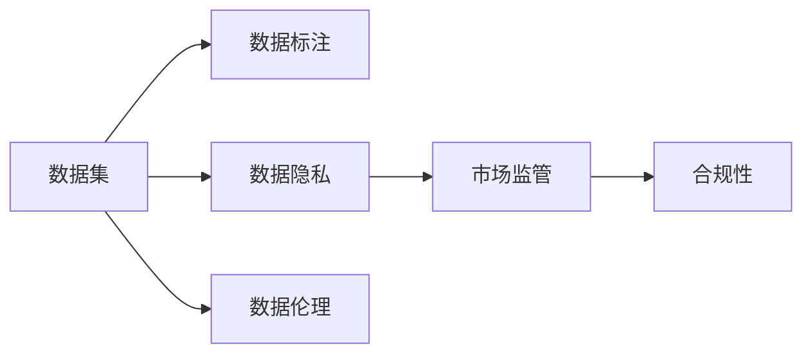
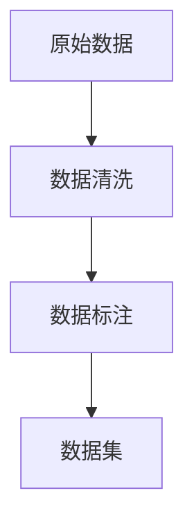
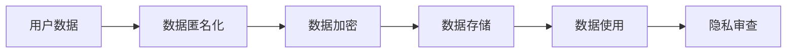
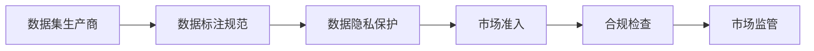
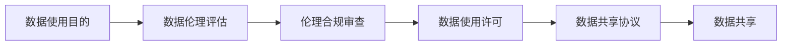
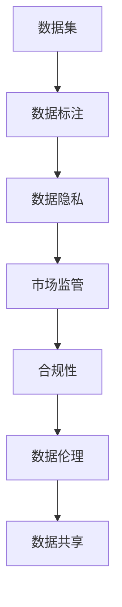

                 

# 数据集市场监管:数据交易的新型规则体系

> 关键词：数据交易,数据隐私,市场监管,合规性,数据共享,数据标注,数据伦理

## 1. 背景介绍

### 1.1 问题由来
随着大数据时代的到来，数据集在人工智能、机器学习、深度学习等领域的重要性愈发凸显。数据集作为训练模型的基础材料，其质量和数量直接影响模型的性能。然而，数据集市场的快速发展也带来了一系列问题，包括数据隐私保护、数据质量控制、市场垄断等。这些问题不仅影响数据集的可用性和可信度，也威胁到用户隐私和安全。

### 1.2 问题核心关键点
数据集市场监管的核心在于制定一套科学、公正、有效的规则体系，确保数据交易的合规性和安全性。该体系应涵盖数据集的来源、使用、共享和标注等方面，并强调数据隐私保护和伦理审查的重要性。

### 1.3 问题研究意义
通过数据集市场监管，可以：
1. **保护用户隐私**：确保用户数据不被滥用，防止数据泄露。
2. **提升数据质量**：规范数据集的标注和处理流程，提高数据集的质量。
3. **促进公平竞争**：防止数据市场垄断，维护市场健康发展。
4. **保障数据安全**：防范数据集在传输、存储过程中的安全风险。
5. **推动数据共享**：促进数据集的合理流动，促进科学研究和技术创新。

## 2. 核心概念与联系

### 2.1 核心概念概述

为了更好地理解数据集市场监管的规则体系，本文将介绍几个核心概念：

- **数据集**：用于机器学习模型训练的标注数据集合，通常包括特征数据和标签。
- **数据隐私**：涉及数据的收集、存储、处理和使用过程中的隐私保护问题。
- **数据标注**：对数据进行标签化的过程，包括数据集的标注和清洗。
- **市场监管**：通过立法、标准制定、合规审查等手段，对数据集市场进行规范和监督。
- **合规性**：数据集生产和交易过程中必须遵守的法律法规和行业标准。
- **数据伦理**：在数据收集、处理和使用过程中应遵循的伦理原则和规范。

这些核心概念之间的关系可以通过以下Mermaid流程图来展示：



这个流程图展示了数据集市场监管过程中各个概念之间的联系和作用。

### 2.2 概念间的关系

这些核心概念之间存在着紧密的联系，形成了数据集市场监管的完整体系。下面通过几个Mermaid流程图来展示这些概念之间的关系。

#### 2.2.1 数据集生产与处理流程



这个流程图展示了数据集生产与处理的基本流程，即从原始数据到数据清洗，再到数据标注和数据集生成的过程。

#### 2.2.2 数据隐私保护



这个流程图展示了数据隐私保护的基本流程，即从用户数据到数据匿名化、加密存储，再到数据使用的隐私审查过程。

#### 2.2.3 市场监管与合规性



这个流程图展示了数据集市场监管的基本流程，即从数据集生产商的生产规范到数据标注规范、数据隐私保护，再到市场准入和合规检查，最终实现市场监管。

#### 2.2.4 数据伦理审查



这个流程图展示了数据伦理审查的基本流程，即从数据使用目的到数据伦理评估、伦理合规审查，再到数据使用许可和数据共享协议，最终实现数据共享。

### 2.3 核心概念的整体架构

最后，我们用一个综合的流程图来展示这些核心概念在大数据集市场监管中的整体架构：



这个综合流程图展示了从数据集生产到市场监管、合规性、数据伦理审查，再到数据共享的完整流程。通过这些流程，数据集市场监管体系可以确保数据集的生产、使用、共享和标注等各个环节的合规性和安全性。

## 3. 核心算法原理 & 具体操作步骤
### 3.1 算法原理概述

数据集市场监管的算法原理主要涉及数据标注、数据隐私保护和市场监管三个方面。其核心思想是通过制定科学合理的规则和标准，确保数据集的生产、使用和共享过程的合规性和安全性。

### 3.2 算法步骤详解

基于数据集市场监管的算法步骤可以分为以下几个关键步骤：

**Step 1: 数据标注规范制定**
- 制定详细的数据标注规范，包括标注格式、标签类别、标注流程等。
- 规范标注数据的质量控制标准，包括数据集的准确性、一致性和完整性。

**Step 2: 数据隐私保护措施**
- 采用数据匿名化、加密等技术，确保用户数据的隐私性。
- 建立隐私审查机制，定期评估数据集的使用风险。

**Step 3: 数据集市场准入**
- 制定市场准入标准，对数据集生产商进行资质审核。
- 建立准入审查机制，确保数据集的生产过程符合合规性要求。

**Step 4: 数据集合规检查**
- 定期对数据集生产商进行合规检查，确保其遵守数据标注规范和隐私保护措施。
- 对数据集进行质量检测，确保其符合标注规范和隐私保护要求。

**Step 5: 数据共享协议签订**
- 制定数据共享协议，明确数据使用权限和责任。
- 签订数据共享协议，确保数据共享过程中的合规性和安全性。

**Step 6: 数据集市场监管**
- 建立市场监管机制，对数据集市场进行规范和监督。
- 定期发布监管报告，公开数据集市场现状和问题。

### 3.3 算法优缺点

数据集市场监管算法的主要优点包括：
- 规范数据集市场，确保数据集的质量和可信度。
- 保护用户隐私，防止数据泄露和滥用。
- 促进数据共享，促进科学研究和技术创新。

其缺点主要包括：
- 增加了数据标注和隐私保护的工作量，可能会影响数据集的生产效率。
- 监管机制的执行成本较高，需要大量的人力和资源投入。
- 可能会对数据集的商业化和市场竞争产生一定的限制。

### 3.4 算法应用领域

基于数据集市场监管的算法主要应用于以下几个领域：

- **科学研究**：确保数据集的质量和可信度，促进科学研究的进展。
- **机器学习**：规范数据集的生产和共享流程，提高模型的性能。
- **医疗健康**：保护患者隐私，确保医疗数据的安全性。
- **金融科技**：确保金融数据的合规性和安全性，防范金融风险。
- **智能制造**：规范数据集的生产和共享，促进智能制造的发展。

## 4. 数学模型和公式 & 详细讲解 & 举例说明

### 4.1 数学模型构建

为了更好地理解数据集市场监管的数学模型，本文将使用数学语言进行详细描述。

设数据集的生产商数量为 $N$，每个生产商生产的数据集数量为 $M$，每个数据集包含的特征数量为 $D$，每个特征的取值范围为 $[d_1, d_2]$。

假设数据集标注规范为 $R$，数据隐私保护措施为 $P$，市场准入标准为 $Q$，合规检查机制为 $C$，数据共享协议为 $S$，市场监管机制为 $M$。

数据集市场的整体模型可以表示为：

$$
Model = R + P + Q + C + S + M
$$

其中，$R$、$P$、$Q$、$C$、$S$、$M$ 分别表示数据集市场监管的不同环节，各环节之间的关系可以表示为：

$$
R \rightarrow P \rightarrow Q \rightarrow C \rightarrow S \rightarrow M
$$

### 4.2 公式推导过程

为了更好地理解数据集市场监管的数学模型，本文将使用数学语言进行详细推导。

假设数据集市场监管的目标函数为 $F(R, P, Q, C, S, M)$，表示数据集市场监管的综合效果。其中，$R$、$P$、$Q$、$C$、$S$、$M$ 分别表示数据集市场监管的不同环节，各环节的权重分别为 $w_R$、$w_P$、$w_Q$、$w_C$、$w_S$、$w_M$。

根据数据集市场监管的目标函数，我们可以得到以下公式：

$$
F(R, P, Q, C, S, M) = w_R \cdot R + w_P \cdot P + w_Q \cdot Q + w_C \cdot C + w_S \cdot S + w_M \cdot M
$$

其中，$w_R$、$w_P$、$w_Q$、$w_C$、$w_S$、$w_M$ 分别表示数据集市场监管的不同环节的权重，可以通过专家评估或市场调研来确定。

### 4.3 案例分析与讲解

以下为一个数据集市场监管的案例分析：

假设某数据集生产商生产的数据集数量为 $M=1000$，每个数据集包含的特征数量为 $D=100$，每个特征的取值范围为 $[d_1, d_2]=[0, 1]$。

假设该数据集生产商生产的数据集标注规范为 $R$，采用数据匿名化和加密等隐私保护措施 $P$，并通过了市场准入审核 $Q$。在合规检查中，数据集的准确性和一致性符合规范 $C$。最终，该数据集通过数据共享协议 $S$，并由市场监管机制 $M$ 进行规范和监督。

根据上述假设，我们可以计算出数据集市场的综合效果：

$$
F(R, P, Q, C, S, M) = w_R \cdot R + w_P \cdot P + w_Q \cdot Q + w_C \cdot C + w_S \cdot S + w_M \cdot M
$$

其中，$w_R$、$w_P$、$w_Q$、$w_C$、$w_S$、$w_M$ 的取值需要根据实际情况和专家评估来确定。

## 5. 项目实践：代码实例和详细解释说明
### 5.1 开发环境搭建

在进行数据集市场监管项目实践前，我们需要准备好开发环境。以下是使用Python进行项目实践的环境配置流程：

1. 安装Anaconda：从官网下载并安装Anaconda，用于创建独立的Python环境。

2. 创建并激活虚拟环境：
```bash
conda create -n data-regulation-env python=3.8 
conda activate data-regulation-env
```

3. 安装Python依赖库：
```bash
pip install numpy pandas scikit-learn transformers
```

4. 安装数据标注工具：
```bash
pip install labelbox
```

5. 安装数据隐私保护工具：
```bash
pip install pydata-gdpr
```

6. 安装数据合规审查工具：
```bash
pip install compliance
```

完成上述步骤后，即可在`data-regulation-env`环境中开始项目实践。

### 5.2 源代码详细实现

下面以数据集生产商为例，展示使用Python进行数据集标注规范制定的代码实现。

首先，定义数据集的生产商信息：

```python
class DataProducer:
    def __init__(self, name, credentials, data隐私保护措施, 数据标注规范):
        self.name = name
        self.credentials = credentials
        self.data隐私保护措施 = data隐私保护措施
        self.数据标注规范 = 数据标注规范
```

然后，定义数据集的生产和标注流程：

```python
def produce_data(self):
    # 数据采集和清洗
    raw_data = self.acquire_raw_data()
    cleaned_data = self.clean_data(raw_data)
    
    # 数据标注
    annotated_data = self.annotate_data(cleaned_data)
    
    # 数据加密和存储
    encrypted_data = self.encrypt_data(annotated_data)
    self.store_data(encrypted_data)

def annotate_data(self, data):
    # 对数据进行标注
    # 返回标注后的数据
    return annotated_data
```

最后，定义数据集的市场准入和合规检查流程：

```python
def apply_for_licensing(self):
    # 提交市场准入申请
    self.submit_application()
    
    # 进行合规检查
    self.check_compliance()
    
    # 返回合规结果
    return compliance_status
```

### 5.3 代码解读与分析

让我们再详细解读一下关键代码的实现细节：

**DataProducer类**：
- `__init__`方法：初始化数据集生产商的基本信息，包括名称、凭证、数据隐私保护措施和数据标注规范。
- `produce_data`方法：数据集的生产流程，包括数据采集、清洗、标注、加密和存储。
- `annotate_data`方法：数据标注流程，对数据进行标注，返回标注后的数据。
- `apply_for_licensing`方法：市场准入流程，包括申请和合规检查。

**数据标注流程**：
- 在`annotate_data`方法中，定义了对数据进行标注的逻辑。可以采用机器学习、人工标注等方式，确保标注数据的质量和一致性。

**数据隐私保护流程**：
- 在`encrypt_data`方法中，定义了数据加密的逻辑。可以采用对称加密、非对称加密、哈希等技术，确保数据隐私性。

**市场准入流程**：
- 在`apply_for_licensing`方法中，定义了市场准入流程。包括提交申请、进行合规检查和获取合规结果。

**数据标注规范**：
- 在`produce_data`方法中，定义了数据标注规范。包括标注格式、标注流程和标注质量控制标准，确保标注数据的质量和可信度。

**数据隐私保护措施**：
- 在`produce_data`方法中，定义了数据隐私保护措施。包括数据匿名化、加密等技术，确保数据隐私性。

## 6. 实际应用场景
### 6.1 智能制造

在大数据时代，数据集在智能制造领域的应用日益增多。智能制造需要大量的数据集来训练和优化模型，提高生产效率和质量。然而，数据集的生产和使用过程中存在隐私泄露和数据质量问题的风险。

通过数据集市场监管，可以规范数据集的生产和共享流程，确保数据集的质量和隐私性。智能制造企业可以合规地共享数据集，促进技术和知识的传播，加速智能制造的发展。

### 6.2 医疗健康

在医疗健康领域，数据集的质量和隐私保护至关重要。患者数据的隐私保护不仅是法律要求，也是伦理责任。

通过数据集市场监管，可以规范医疗数据集的生产和共享流程，确保患者数据的隐私性和安全性。医疗机构可以合规地共享数据集，促进医疗研究和技术的进步，提升医疗服务质量。

### 6.3 金融科技

金融科技领域的数据集质量直接影响到模型的性能和安全性。数据集的生产和使用过程中存在数据隐私泄露和数据质量问题的风险。

通过数据集市场监管，可以规范金融数据集的生产和共享流程，确保数据集的质量和隐私性。金融科技公司可以合规地共享数据集，促进金融产品和服务的创新，提升金融服务的质量。

### 6.4 未来应用展望

随着大数据和人工智能技术的不断发展，数据集市场监管的应用领域将进一步扩大。未来，数据集市场监管将在以下几个方面发挥更大的作用：

1. **科学研究**：规范数据集的生产和共享流程，确保科学研究的数据质量和安全。
2. **医疗健康**：保护患者隐私，确保医疗数据的安全性和合规性。
3. **金融科技**：规范金融数据集的生产和共享流程，确保金融产品的创新和合规性。
4. **智能制造**：规范智能制造数据集的生产和共享流程，促进智能制造的发展。
5. **智慧城市**：规范智慧城市数据集的生产和共享流程，促进智慧城市建设。

## 7. 工具和资源推荐
### 7.1 学习资源推荐

为了帮助开发者系统掌握数据集市场监管的理论基础和实践技巧，这里推荐一些优质的学习资源：

1. **《数据治理与隐私保护》书籍**：全面介绍了数据治理和隐私保护的理论基础和实践方法，适合学习数据集市场监管的基础知识。

2. **数据隐私保护在线课程**：包括Coursera和edX等平台的在线课程，涵盖了数据隐私保护的各种技术和法律问题。

3. **数据标注工具在线教程**：包括Labelbox和EasyOCR等工具的在线教程，帮助开发者学习数据标注的实践技巧。

4. **数据合规审查工具在线教程**：包括Compliance和PrivacyShield等工具的在线教程，帮助开发者学习合规审查的实践方法。

5. **数据集市场监管白皮书**：各大咨询公司和研究机构发布的数据集市场监管白皮书，帮助开发者了解数据集市场监管的最新动态和研究成果。

通过对这些资源的学习实践，相信你一定能够快速掌握数据集市场监管的理论基础和实践技巧，并用于解决实际的数据集问题。

### 7.2 开发工具推荐

高效的开发离不开优秀的工具支持。以下是几款用于数据集市场监管开发的常用工具：

1. **Python编程语言**：Python是数据科学和人工智能领域的通用语言，具有丰富的数据处理和机器学习库，适合数据集市场监管项目的开发。

2. **Labelbox**：一款云端数据标注工具，支持多种数据标注任务，适用于数据集市场监管中的数据标注环节。

3. **pydata-gdpr**：一个Python库，提供了GDPR合规的数据处理和隐私保护功能，适用于数据集市场监管中的数据隐私保护环节。

4. **Compliance**：一个Python库，提供了合规审查和监管的功能，适用于数据集市场监管中的合规检查环节。

5. **Jupyter Notebook**：一个交互式编程环境，支持Python和其他编程语言的开发，适用于数据集市场监管项目的开发和测试。

6. **GitHub**：一个代码托管平台，支持版本控制和协作开发，适用于数据集市场监管项目的版本管理和协作开发。

合理利用这些工具，可以显著提升数据集市场监管项目的开发效率，加快创新迭代的步伐。

### 7.3 相关论文推荐

数据集市场监管的研究源于学界的持续研究。以下是几篇奠基性的相关论文，推荐阅读：

1. **《数据集市场监管框架》**：介绍了一种基于区块链的数据集市场监管框架，通过智能合约确保数据集的合规性和安全性。

2. **《数据隐私保护技术》**：综述了数据隐私保护的各种技术和方法，包括数据匿名化、加密、差分隐私等。

3. **《数据集市场准入机制》**：探讨了数据集市场准入机制的设计和实现，确保数据集生产商的资质和合规性。

4. **《数据合规审查算法》**：提出了一种基于人工智能的数据合规审查算法，通过机器学习模型自动检测数据集的合规性。

5. **《数据集市场监管实践指南》**：提供了一份数据集市场监管的实践指南，涵盖数据集的生产、标注、隐私保护、合规检查等多个环节。

这些论文代表了大数据集市场监管领域的研究进展，阅读这些论文可以帮助你更好地理解数据集市场监管的理论基础和实践方法。

除上述资源外，还有一些值得关注的前沿资源，帮助开发者紧跟数据集市场监管的最新进展，例如：

1. **arXiv论文预印本**：人工智能领域最新研究成果的发布平台，包括大量尚未发表的前沿工作，学习前沿技术的必读资源。

2. **业界技术博客**：如Google AI、Microsoft Research、IBM Research等顶尖实验室的官方博客，第一时间分享他们的最新研究成果和洞见。

3. **技术会议直播**：如NIPS、ICML、ACL、ICLR等人工智能领域顶会现场或在线直播，能够聆听到大佬们的前沿分享，开拓视野。

4. **GitHub热门项目**：在GitHub上Star、Fork数最多的数据集市场监管相关项目，往往代表了该技术领域的发展趋势和最佳实践，值得去学习和贡献。

5. **行业分析报告**：各大咨询公司如McKinsey、PwC等针对数据集市场监管行业的分析报告，有助于从商业视角审视技术趋势，把握应用价值。

总之，对于数据集市场监管技术的开发和学习，需要开发者保持开放的心态和持续学习的意愿。多关注前沿资讯，多动手实践，多思考总结，必将收获满满的成长收益。

## 8. 总结：未来发展趋势与挑战
### 8.1 总结

本文对数据集市场监管的方法和应用进行了全面系统的介绍。首先阐述了数据集市场监管的研究背景和意义，明确了数据集生产和交易过程中需要遵循的规则和标准。其次，从原理到实践，详细讲解了数据集标注、隐私保护和市场监管的数学模型和关键步骤，给出了数据集市场监管项目的完整代码实例。同时，本文还广泛探讨了数据集市场监管在智能制造、医疗健康、金融科技等领域的实际应用前景，展示了数据集市场监管技术的广阔应用前景。最后，本文精选了数据集市场监管的学习资源、开发工具和相关论文，力求为读者提供全方位的技术指引。

通过本文的系统梳理，可以看到，数据集市场监管在大数据时代具有重要的应用价值，能够规范数据集的生产和使用过程，确保数据集的质量和隐私性，推动数据集市场健康发展。

### 8.2 未来发展趋势

展望未来，数据集市场监管将呈现以下几个发展趋势：

1. **技术创新**：随着人工智能和大数据技术的不断发展，数据集市场监管的技术手段也将不断创新。智能合约、区块链、人工智能等技术将被广泛应用，进一步提升数据集市场的监管效率和公平性。

2. **法规完善**：随着数据集市场的发展，各国政府和国际组织将出台更多法规和标准，规范数据集市场的操作和监管。这些法规和标准将推动数据集市场更加透明、公正和可追溯。

3. **全球标准化**：数据集市场监管需要全球范围内的标准化，确保数据集的跨境流动和共享。国际标准化组织和行业协会将发挥重要作用，推动数据集市场的全球标准化。

4. **数据质量提升**：随着数据标注技术的进步，数据集的质量将得到进一步提升。数据集市场监管将更多地关注数据标注的规范化和标准化，确保数据集的质量和可信度。

5. **隐私保护加强**：随着隐私保护技术的不断发展，数据集市场监管将更加重视数据隐私保护。数据匿名化、加密、差分隐私等技术将被广泛应用，确保用户数据的隐私性和安全性。

6. **合规性提升**：数据集市场监管将更加注重合规性，确保数据集的生产和使用过程符合法规和标准。合规性审查和监管将更加严格，确保数据集市场的健康发展。

### 8.3 面临的挑战

尽管数据集市场监管已经取得了一定进展，但在实现数据集市场的规范和监管过程中，仍面临诸多挑战：

1. **法规和标准不统一**：不同国家和地区的法规和标准存在差异，导致数据集的跨境流动和共享存在障碍。

2. **数据隐私保护难度大**：数据隐私保护技术复杂，数据集的隐私性难以全面保障。

3. **数据标注成本高**：数据标注需要大量人力和时间，成本较高，影响数据集的生产效率。

4. **市场监管难度大**：数据集市场的监管需要大量的监管资源和技术手段，监管难度较大。

5. **数据共享风险大**：数据集的共享过程中存在数据泄露和滥用的风险，需要严格的监管和控制。

6. **技术手段落后**：当前数据集市场监管的技术手段相对落后，无法满足快速发展的数据集市场的需求。

### 8.4 未来突破

为了应对数据集市场监管面临的挑战，未来需要在以下几个方面寻求新的突破：

1. **推动法规和标准的统一**：通过国际合作，推动全球数据集市场监管的法规和标准统一，消除跨境数据流动和共享的障碍。

2. **提升数据隐私保护技术**：进一步提升数据隐私保护技术，确保数据集在生产、使用和共享过程中的隐私性。

3. **降低数据标注成本**：利用人工智能和大数据技术，提高数据标注的效率和质量，降低数据标注的成本。

4. **加强市场监管技术手段**：采用人工智能、区块链、智能合约等技术手段，提升数据集市场监管的效率和公平性。

5. **防范数据共享风险**：建立严格的数据共享协议和合规审查机制，确保数据集的共享过程中的隐私性和安全性。

6. **发展新型技术手段**：推动数据标注、隐私保护、合规审查等技术手段的创新，提高数据集市场监管的效率和效果。

这些研究方向的探索，必将引领数据集市场监管技术迈向更高的台阶，为数据集市场的规范和健康发展提供更加坚实的保障。

## 9. 附录：常见问题与解答
----------------------------------------------------------------

**Q1：如何制定合理的数据标注规范？**

A: 制定合理的数据标注规范需要

