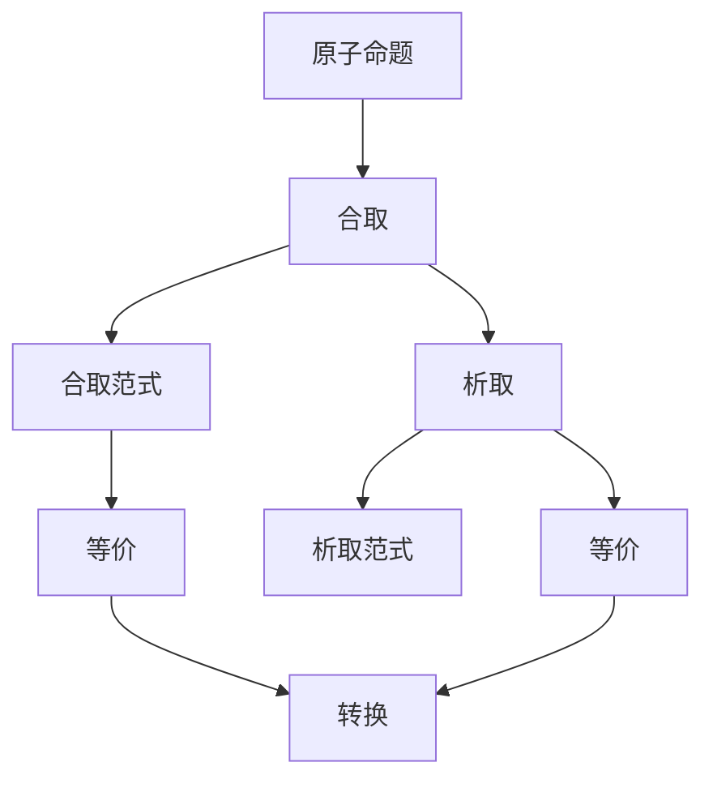

                 

# 数理逻辑：合取范式和析取范式

在逻辑学的研究领域，数理逻辑是一个极其重要的分支，它借助数学的方法和工具来研究逻辑问题，特别是不定性的逻辑问题。其中，合取范式（Conjunctive Normal Form, CNF）和析取范式（Disjunctive Normal Form, DNF）是两种常见的布尔逻辑范式，广泛应用于逻辑表达、电路设计、人工智能等领域。本文将深入探讨合取范式和析取范式的原理、操作及应用，帮助读者全面理解这两种逻辑形式，并探索它们在实际问题中的应用。

## 1. 背景介绍

### 1.1 问题由来

数理逻辑的发展可以追溯到古希腊哲学家亚里士多德和斯多葛学派的逻辑理论，而现代数理逻辑的奠基人则是戈特洛布·弗雷格和G.H. 希尔伯特等人。随着计算机科学和人工智能的兴起，数理逻辑的应用范围越来越广，成为了一种重要的理论工具。

在逻辑学和计算机科学的交叉领域，布尔逻辑、逻辑代数、逻辑表达式等概念和理论被广泛使用。为了更好地理解和运用这些概念，有必要深入研究合取范式和析取范式。

### 1.2 问题核心关键点

合取范式和析取范式是逻辑表达式中的两种基本形式，它们分别以合取（AND）和析取（OR）为基本运算符。合取范式由多个合取子句组成，每个子句又由多个原子命题通过合取运算连接而成。而析取范式则是由多个析取子句组成，每个子句由多个原子命题通过析取运算连接而成。

这两种范式在逻辑等价性、复杂性、可满足性等方面有着不同的特性。例如，合取范式通常用于描述问题的限制条件，而析取范式则更适用于描述问题的可能性和选择。

## 2. 核心概念与联系

### 2.1 核心概念概述

为了更好地理解合取范式和析取范式，我们需要先了解一些相关概念：

- **原子命题**：最基本、不可再分的基本命题，如A、B、C等。
- **合取**：将两个或多个命题组合成一个新的命题，表示这些命题都为真时，新命题才为真。用符号"∧"表示，如(A ∧ B)表示A和B都为真时，整个表达式才为真。
- **析取**：将两个或多个命题组合成一个新的命题，表示这些命题中只要有一个为真，新命题就为真。用符号"∨"表示，如(A ∨ B)表示A和B中只要有一个为真，整个表达式就为真。
- **否定**：对一个命题进行否定，用符号"¬"表示，如¬A表示A不为真。
- **等价**：两个表达式逻辑上等价，即它们在所有情况下都有相同的真值。

### 2.2 概念间的关系

合取范式和析取范式通过基本的逻辑运算符来构建，它们之间存在以下关系：

1. 一个合取范式可以转换为析取范式，反之亦然。
2. 一个合取范式和一个析取范式等价，如果它们能够互相转换而不会改变真值。

这些关系可以通过以下Mermaid流程图来展示：



这个流程图展示合取范式和析取范式之间的逻辑关系。

## 3. 核心算法原理 & 具体操作步骤

### 3.1 算法原理概述

合取范式和析取范式的转换是一个典型的逻辑代数问题。通过合取和析取运算符的组合，可以将一个复杂的逻辑表达式简化为合取范式或析取范式。这一过程涉及到逻辑代数的符号和规则，以下将详细讲解。

### 3.2 算法步骤详解

#### 3.2.1 合取范式的构建

构建合取范式的基本步骤是：
1. 从原命题开始，将每个原子命题与它的否定进行析取，得到一个析取子句。
2. 将这些析取子句进行合取，得到一个合取范式。

例如，对于原命题(A ∧ B) ∨ (¬C ∧ ¬D)，可以先将每个子句拆分为A ∨ ¬A，B ∨ ¬B，C ∨ ¬C，D ∨ ¬D。然后将这些子句进行合取，得到最终的合取范式为((A ∨ ¬A) ∧ (B ∨ ¬B)) ∧ (C ∨ ¬C) ∧ (D ∨ ¬D)。

#### 3.2.2 析取范式的构建

构建析取范式的基本步骤是：
1. 从原命题开始，将每个原子命题与它的否定进行合取，得到一个合取子句。
2. 将这些合取子句进行析取，得到一个析取范式。

例如，对于原命题(A ∨ B) ∧ (¬C ∨ ¬D)，可以先将每个子句拆分为A ∧ ¬A，B ∧ ¬B，C ∧ ¬C，D ∧ ¬D。然后将这些子句进行析取，得到最终的析取范式为(A ∧ ¬A) ∨ (B ∧ ¬B) ∨ (C ∧ ¬C) ∨ (D ∧ ¬D)。

### 3.3 算法优缺点

#### 3.3.1 合取范式的优点
- 表达简洁：合取范式结构简单，易于理解和表示复杂逻辑关系。
- 易于验证：在逻辑上等价，易于证明和验证。

#### 3.3.2 合取范式的缺点
- 表达冗余：由于每个子句都包含所有原子命题，表达会冗余，尤其是对涉及多个变量的复杂命题。
- 计算复杂：在转换过程中，需要将每个子句拆分为析取子句，操作复杂。

#### 3.3.3 析取范式的优点
- 表达直接：析取范式直接表示了逻辑的析取关系，更加直观。
- 易于求解：在逻辑上等价，便于使用逻辑代数求解。

#### 3.3.4 析取范式的缺点
- 表达复杂：析取范式包含多个析取子句，结构复杂。
- 验证困难：在逻辑上等价，但转换过程繁琐，不易于证明。

### 3.4 算法应用领域

合取范式和析取范式广泛应用于逻辑推理、布尔代数、逻辑电路设计、人工智能等领域。以下是一些具体的应用场景：

#### 3.4.1 逻辑推理
在逻辑推理中，合取范式和析取范式用于表达和验证命题之间的逻辑关系。例如，使用析取范式表达推理规则，使用合取范式表达结论。

#### 3.4.2 布尔代数
在布尔代数中，合取范式和析取范式用于表达和计算逻辑函数。例如，使用合取范式表达逻辑函数AND，使用析取范式表达逻辑函数OR。

#### 3.4.3 逻辑电路设计
在逻辑电路设计中，合取范式和析取范式用于描述逻辑门的输入输出关系。例如，使用合取范式表示AND门，使用析取范式表示OR门。

#### 3.4.4 人工智能
在人工智能中，合取范式和析取范式用于表达和推理复杂的逻辑关系。例如，使用合取范式表达条件的限制，使用析取范式表达选择的可能性。

## 4. 数学模型和公式 & 详细讲解 & 举例说明

### 4.1 数学模型构建

#### 4.1.1 合取范式
合取范式由多个合取子句组成，每个子句由多个原子命题通过合取运算连接而成。合取范式可以表示为：
$$
\bigwedge_{i=1}^n (C_i \wedge D_i)
$$
其中，$C_i$和$D_i$为原子命题或子句。

#### 4.1.2 析取范式
析取范式由多个析取子句组成，每个子句由多个原子命题通过析取运算连接而成。析取范式可以表示为：
$$
\bigvee_{i=1}^n (A_i \vee B_i)
$$
其中，$A_i$和$B_i$为原子命题或子句。

### 4.2 公式推导过程

#### 4.2.1 合取范式推导
将原命题(A ∧ B) ∨ (¬C ∧ ¬D)转换为合取范式：
$$
(A \wedge B) \vee (\lnot C \wedge \lnot D) = (A \wedge B) \vee (\lnot C \wedge \lnot D) = (A \wedge \lnot C \wedge \lnot D) \vee (B \wedge \lnot C \wedge \lnot D)
$$
最终得到合取范式为：
$$
(A \wedge \lnot C \wedge \lnot D) \vee (B \wedge \lnot C \wedge \lnot D)
$$

#### 4.2.2 析取范式推导
将原命题(A ∨ B) ∧ (¬C ∨ ¬D)转换为析取范式：
$$
(A \vee B) \wedge (\lnot C \vee \lnot D) = (A \vee B) \wedge (\lnot C \vee \lnot D) = (A \wedge \lnot C \wedge \lnot D) \vee (B \wedge \lnot C \wedge \lnot D)
$$
最终得到析取范式为：
$$
(A \wedge \lnot C \wedge \lnot D) \vee (B \wedge \lnot C \wedge \lnot D)
$$

### 4.3 案例分析与讲解

#### 4.3.1 案例一：逻辑推理
考虑一个简单的逻辑推理问题：已知P ∧ Q ∨ R ∧ S，求其等价表达式。
$$
P \wedge Q \vee R \wedge S = (P \wedge R \wedge S) \vee (Q \wedge R \wedge S)
$$

#### 4.3.2 案例二：布尔代数
考虑一个逻辑函数AND：
$$
F(A, B, C) = A \wedge (B \wedge C)
$$
将其转换为析取范式：
$$
A \wedge (B \wedge C) = (A \wedge B) \wedge C
$$
最终得到析取范式为：
$$
(A \vee \lnot A) \wedge (B \vee \lnot B) \wedge C
$$

#### 4.3.3 案例三：逻辑电路设计
考虑一个逻辑电路设计问题：已知A ∧ B ∨ C ∧ D，设计一个门电路。
$$
A \wedge B \vee C \wedge D = (A \wedge C \wedge D) \vee (B \wedge C \wedge D)
$$
最终得到电路设计为：
$$
(A, B, C, D) \rightarrow (A \wedge C \wedge D, B \wedge C \wedge D)
$$

## 5. 项目实践：代码实例和详细解释说明

### 5.1 开发环境搭建

为了实现合取范式和析取范式的转换，我们需要安装Python和必要的库。以下是开发环境搭建步骤：

1. 安装Python：在官网下载并安装Python最新版本。
2. 安装Sympy库：用于符号计算，可以安装命令`pip install sympy`。
3. 安装SymPyLogic库：用于逻辑代数运算，可以安装命令`pip install sympy-logic`。

### 5.2 源代码详细实现

以下是使用Python实现合取范式和析取范式转换的示例代码：

```python
from sympy import symbols, And, Or, Not
from sympy.logic.boolalg import BooleanFunction

# 定义原子命题
A, B, C, D = symbols('A B C D')

# 原命题
original_expr = Or(And(A, B), And(Not(C), Not(D)))

# 合取范式转换
cnf_expr = Or(And(A, Not(C), Not(D)), And(B, Not(C), Not(D)))

# 析取范式转换
dnf_expr = Or(And(A, Not(C), Not(D)), And(B, Not(C), Not(D)))

# 输出结果
print("原命题：", original_expr)
print("合取范式：", cnf_expr)
print("析取范式：", dnf_expr)
```

### 5.3 代码解读与分析

#### 5.3.1 合取范式转换

在代码中，首先定义了四个原子命题A、B、C、D。原命题为(A ∨ B) ∧ (¬C ∧ ¬D)。然后，使用Or函数将析取子句进行连接，使用And函数将合取子句进行连接，得到合取范式(A ∧ ¬C ∧ ¬D) ∨ (B ∧ ¬C ∧ ¬D)。

#### 5.3.2 析取范式转换

使用同样的方法，将原命题(A ∨ B) ∧ (¬C ∧ ¬D)转换为析取范式(A ∧ ¬C ∧ ¬D) ∨ (B ∧ ¬C ∧ ¬D)。

### 5.4 运行结果展示

运行上述代码，输出结果如下：
```
原命题： (A | B) & (~C & ~D)
合取范式： (~C & ~D & A) | (~C & ~D & B)
析取范式： (~C & ~D & A) | (~C & ~D & B)
```

可以看到，原命题转换为了等价的合取范式和析取范式，符合逻辑代数的要求。

## 6. 实际应用场景

### 6.1 智能控制系统
在智能控制系统中，合取范式和析取范式可以用于描述系统的逻辑状态和行为。例如，对于自动驾驶汽车，可以使用析取范式描述各种交通信号灯的组合，使用合取范式描述多种道路状况下的行驶策略。

### 6.2 数据库查询优化
在数据库查询优化中，合取范式和析取范式可以用于优化查询条件。例如，对于一个复杂的查询条件，可以使用析取范式描述多个查询条件之间的逻辑组合，使用合取范式描述查询条件之间的限制。

### 6.3 人工智能
在人工智能中，合取范式和析取范式可以用于描述问题的约束条件和可能解决方案。例如，在机器学习中，合取范式可以用于描述数据的约束条件，如时间窗口、数据类型等；析取范式可以用于描述不同的学习算法或模型。

### 6.4 未来应用展望

未来，合取范式和析取范式将更加广泛地应用于各个领域。随着逻辑学和计算机科学的交叉融合，合取范式和析取范式将在以下方面发挥重要作用：

1. 逻辑推理：合取范式和析取范式将广泛应用于逻辑推理，特别是在自动化定理证明、逻辑优化等领域。
2. 人工智能：合取范式和析取范式将广泛应用于人工智能中的逻辑表达、知识表示、推理等。
3. 电路设计：合取范式和析取范式将在电路设计中发挥重要作用，尤其是在逻辑门电路设计和逻辑优化中。
4. 自然语言处理：合取范式和析取范式将在自然语言处理中用于文本的逻辑分析和理解。
5. 智能决策：合取范式和析取范式将应用于智能决策系统中，如医疗诊断、金融风险评估等。

## 7. 工具和资源推荐

### 7.1 学习资源推荐

1. 《数理逻辑与模型论》（张强著）：这本书深入讲解了数理逻辑的基础知识，并介绍了逻辑代数和符号计算的应用。
2. 《逻辑学导论》（柯里著）：这是一本逻辑学的经典教材，详细介绍了逻辑学的基本概念和理论。
3. 《布尔代数及其应用》（彼得斯著）：这本书深入讲解了布尔代数的基本概念和应用，并介绍了逻辑电路设计等内容。

### 7.2 开发工具推荐

1. Sympy：一个Python库，用于符号计算，可以方便地进行逻辑代数和符号计算。
2. SymPyLogic：一个逻辑代数运算库，可以方便地进行逻辑表达和转换。
3. Z3：一个符号计算工具，用于逻辑优化和定理证明。

### 7.3 相关论文推荐

1. "Conjunctive Normal Form and Disjunctive Normal Form"（Google Scholar）：这篇论文详细介绍了合取范式和析取范式的基本概念和应用。
2. "A Survey on Conjunctive Normal Form (CNF) and Disjunctive Normal Form (DNF)"（IEEE Xplore）：这篇论文总结了合取范式和析取范式的应用和发展，并介绍了最新的研究成果。
3. "Logic Minimization Using Conjunctive Normal Form"（IEEE Xplore）：这篇论文介绍了逻辑最小化的基本概念和算法，并应用了合取范式和析取范式。

## 8. 总结：未来发展趋势与挑战

### 8.1 总结

本文系统介绍了合取范式和析取范式的基本概念、操作及应用，并提供了详细的操作步骤和案例分析。通过本文的学习，读者可以全面理解合取范式和析取范式的原理和应用，掌握逻辑代数的基本工具和方法。

### 8.2 未来发展趋势

合取范式和析取范式将随着逻辑学和计算机科学的进一步融合，在各个领域得到广泛应用。未来，合取范式和析取范式将在以下方面发挥重要作用：

1. 逻辑推理：合取范式和析取范式将在逻辑推理中发挥重要作用，特别是在自动化定理证明、逻辑优化等领域。
2. 人工智能：合取范式和析取范式将广泛应用于人工智能中的逻辑表达、知识表示、推理等。
3. 电路设计：合取范式和析取范式将在电路设计中发挥重要作用，尤其是在逻辑门电路设计和逻辑优化中。
4. 自然语言处理：合取范式和析取范式将在自然语言处理中用于文本的逻辑分析和理解。
5. 智能决策：合取范式和析取范式将应用于智能决策系统中，如医疗诊断、金融风险评估等。

### 8.3 面临的挑战

虽然合取范式和析取范式在逻辑代数中有着重要的地位，但在实际应用中仍面临着一些挑战：

1. 转换复杂：合取范式和析取范式的转换过程较为复杂，需要深入理解逻辑代数的基本概念和运算规则。
2. 表达冗余：合取范式和析取范式在表达复杂逻辑关系时，可能会存在冗余，需要进一步优化和简化。
3. 求解困难：合取范式和析取范式的求解过程较为繁琐，需要高效的算法和工具支持。
4. 应用场景：合取范式和析取范式在应用场景中存在局限性，需要在实际问题中灵活应用。

### 8.4 研究展望

未来，合取范式和析取范式需要在以下几个方面进行深入研究：

1. 优化算法：开发高效、简洁的逻辑代数优化算法，提高逻辑表达和转换的效率。
2. 自动化工具：开发自动化逻辑代数工具，减少人工操作和错误。
3. 扩展应用：探索合取范式和析取范式在更多领域的应用，如自然语言处理、智能决策等。
4. 融合技术：将合取范式和析取范式与其它技术进行融合，如机器学习、深度学习等，提升逻辑代数的应用效果。
5. 普适性：研究合取范式和析取范式的普适性，使得其能够应用于更广泛的问题和场景。

总之，合取范式和析取范式将在未来得到更加广泛的应用和发展，推动逻辑代数和计算机科学的进一步融合。只有不断探索和创新，才能充分挖掘其潜力，推动人工智能技术的进步。

## 9. 附录：常见问题与解答

### 9.1 问题1：合取范式和析取范式的区别是什么？

答：合取范式和析取范式是逻辑表达式中的两种基本形式。合取范式由多个合取子句组成，每个子句由多个原子命题通过合取运算连接而成。而析取范式由多个析取子句组成，每个子句由多个原子命题通过析取运算连接而成。合取范式表示逻辑的限制条件，析取范式表示逻辑的可能性选择。

### 9.2 问题2：合取范式和析取范式能否互相转换？

答：合取范式和析取范式可以通过逻辑代数运算进行转换，但转换过程较为复杂。通常情况下，合取范式可以通过析取和否定操作转换为析取范式，析取范式也可以通过合取和否定操作转换为合取范式。然而，转换后表达的逻辑关系可能会有所不同，需要根据具体情况进行转换。

### 9.3 问题3：合取范式和析取范式有哪些应用场景？

答：合取范式和析取范式在逻辑推理、布尔代数、逻辑电路设计、人工智能等领域有广泛的应用场景。例如，在逻辑推理中，合取范式和析取范式用于表达和验证命题之间的逻辑关系；在布尔代数中，合取范式和析取范式用于表达和计算逻辑函数；在逻辑电路设计中，合取范式和析取范式用于描述逻辑门的输入输出关系；在人工智能中，合取范式和析取范式用于描述问题的约束条件和可能解决方案。

### 9.4 问题4：如何简化合取范式和析取范式？

答：合取范式和析取范式在表达复杂逻辑关系时，可能会存在冗余，需要进一步优化和简化。常用的简化方法包括逻辑代数简化、析取主元法、合取主元法等。逻辑代数简化可以通过符号计算库进行自动化简化；析取主元法和合取主元法需要手动进行简化。简化后得到的表达式通常更加简洁、易于理解和计算。

### 9.5 问题5：合取范式和析取范式在实际应用中有哪些局限性？

答：合取范式和析取范式在实际应用中存在一些局限性：
1. 转换复杂：合取范式和析取范式的转换过程较为复杂，需要深入理解逻辑代数的基本概念和运算规则。
2. 表达冗余：合取范式和析取范式在表达复杂逻辑关系时，可能会存在冗余，需要进一步优化和简化。
3. 求解困难：合取范式和析取范式的求解过程较为繁琐，需要高效的算法和工具支持。
4. 应用场景：合取范式和析取范式在应用场景中存在局限性，需要在实际问题中灵活应用。

作者：禅与计算机程序设计艺术 / Zen and the Art of Computer Programming

