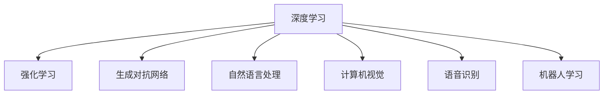
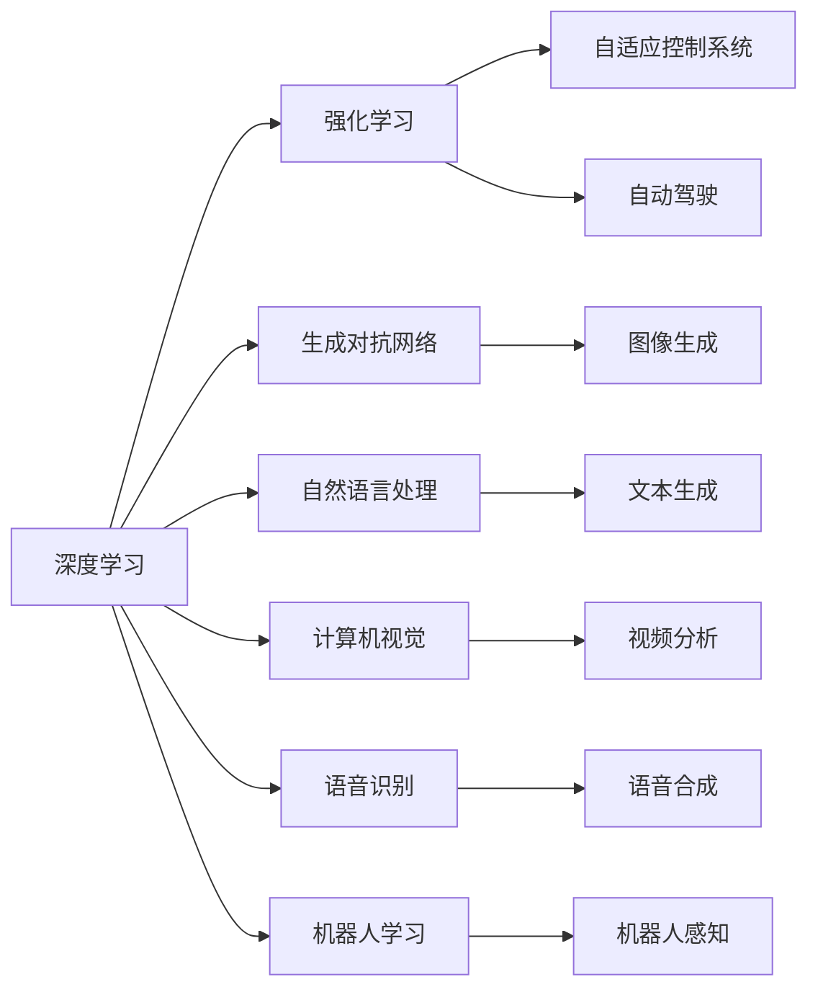

                 

# 新一代AI技术的应用场景与趋势

## 1. 背景介绍

### 1.1 问题由来

近年来，随着人工智能技术的快速进步，新一代AI技术在各个领域的应用变得日益广泛和深入。从自然语言处理（NLP）、计算机视觉（CV）、语音识别到机器人、智能交通、医疗健康等领域，AI技术的力量正在重塑我们的世界。

然而，AI技术的广泛应用也带来了一些新的问题和挑战。例如，如何更好地理解和应用AI技术，使其在实际应用中发挥最大效能？AI技术的快速发展是否会带来道德、隐私和安全方面的问题？AI技术的普及是否会加剧社会的不平等和分化？这些问题已经引起了全球范围内的广泛关注和讨论。

### 1.2 问题核心关键点

新一代AI技术的核心在于其强大的计算能力和自学习能力。这些技术包括深度学习、强化学习、生成对抗网络（GAN）、自然语言处理（NLP）、计算机视觉（CV）、语音识别、机器人学习等。

新一代AI技术的核心特点可以总结为以下几点：

- **计算能力**：新一代AI技术依赖于高性能计算资源，如GPU、TPU等，能够快速处理大量数据，进行深度学习和强化学习。
- **自学习能力**：新一代AI技术能够通过大量数据自我学习，不断提升模型性能。
- **跨领域应用**：新一代AI技术在多个领域得到了广泛应用，包括医疗、金融、制造、物流等。

### 1.3 问题研究意义

研究新一代AI技术的应用场景与趋势，对于推动AI技术的发展、提升各行各业的生产效率、改善人们的生活质量具有重要意义。具体如下：

1. **推动技术进步**：通过分析新一代AI技术的应用场景，可以为AI技术的进一步发展提供方向和动力。
2. **提升生产效率**：新一代AI技术可以帮助企业提高生产效率，降低成本，提高产品质量。
3. **改善生活质量**：新一代AI技术可以用于医疗、教育、交通等领域，改善人们的生活质量。
4. **促进公平与正义**：研究新一代AI技术的应用场景，可以揭示AI技术带来的公平和正义问题，促进社会的公平与正义。
5. **应对挑战与风险**：新一代AI技术带来了诸多挑战和风险，如道德、隐私、安全问题，需要通过研究应用场景与趋势，找到解决方案。

## 2. 核心概念与联系

### 2.1 核心概念概述

为了更好地理解新一代AI技术的应用场景与趋势，我们需要了解一些关键概念：

- **深度学习（Deep Learning）**：一种基于神经网络的机器学习技术，能够处理大规模数据，进行特征提取和分类。
- **强化学习（Reinforcement Learning）**：一种基于奖励机制的学习方法，通过试错不断优化决策。
- **生成对抗网络（GAN）**：一种能够生成逼真图像、视频等内容的深度学习技术。
- **自然语言处理（NLP）**：一种能够理解和处理人类语言的技术，包括文本生成、语言翻译、语音识别等。
- **计算机视觉（CV）**：一种能够处理和理解图像和视频的技术，包括物体识别、图像分割、视频分析等。
- **语音识别**：一种能够理解和转录人类语音的技术。
- **机器人学习**：一种能够使机器人自主学习和适应环境的技术。

这些概念之间的关系可以通过以下Mermaid流程图来展示：



这个流程图展示了深度学习与其他AI技术之间的关系，体现了深度学习在AI技术中的核心地位。

### 2.2 概念间的关系

这些核心概念之间的关系如下：

- **深度学习与强化学习**：深度学习是一种基于神经网络的机器学习技术，而强化学习是一种基于奖励机制的学习方法。两者在某些场景下可以相互补充，深度学习能够处理大量数据，而强化学习能够通过试错不断优化决策。
- **深度学习与生成对抗网络**：生成对抗网络是一种能够生成逼真图像、视频等内容的深度学习技术。深度学习可以用于生成对抗网络的训练，提高生成效果。
- **深度学习与自然语言处理**：自然语言处理是一种能够理解和处理人类语言的技术，深度学习可以用于自然语言处理中的文本分类、情感分析、机器翻译等任务。
- **深度学习与计算机视觉**：计算机视觉是一种能够处理和理解图像和视频的技术，深度学习可以用于计算机视觉中的物体识别、图像分割、视频分析等任务。
- **深度学习与语音识别**：语音识别是一种能够理解和转录人类语音的技术，深度学习可以用于语音识别中的声学建模、语音合成等任务。
- **深度学习与机器人学习**：机器人学习是一种能够使机器人自主学习和适应环境的技术，深度学习可以用于机器人的感知、决策、控制等任务。

### 2.3 核心概念的整体架构

最后，我们用一个综合的流程图来展示这些核心概念在大规模AI技术应用中的整体架构：



这个综合流程图展示了深度学习在各个AI技术中的应用，从自动驾驶到图像生成，再到机器人感知，体现了深度学习在AI技术中的广泛应用。

## 3. 核心算法原理 & 具体操作步骤

### 3.1 算法原理概述

新一代AI技术的应用通常依赖于以下算法原理：

- **深度学习算法**：深度学习算法是一种基于神经网络的机器学习技术，通过多层神经元对数据进行特征提取和分类。
- **强化学习算法**：强化学习算法通过奖励机制不断优化决策，适用于需要动态调整策略的任务。
- **生成对抗网络算法**：生成对抗网络算法通过生成器和判别器不断对抗，生成逼真的图像、视频等内容。
- **自然语言处理算法**：自然语言处理算法通过分词、词向量表示、语言模型等技术，实现对文本的分类、翻译、生成等任务。
- **计算机视觉算法**：计算机视觉算法通过卷积神经网络（CNN）、循环神经网络（RNN）等技术，实现对图像和视频的分类、分割、检测等任务。
- **语音识别算法**：语音识别算法通过声学建模、语音合成等技术，实现对语音的转录和合成。
- **机器人学习算法**：机器人学习算法通过感知、决策、控制等技术，实现机器人的自主学习和适应环境。

### 3.2 算法步骤详解

下面以深度学习算法为例，详细讲解深度学习在大规模AI技术中的应用步骤：

1. **数据准备**：收集和处理大规模数据，进行预处理和归一化。
2. **模型设计**：选择适当的神经网络结构，确定网络的层数、神经元数等参数。
3. **模型训练**：使用深度学习算法进行模型训练，通过反向传播算法不断调整网络参数。
4. **模型评估**：在测试集上评估模型性能，调整参数以提高模型精度。
5. **模型部署**：将训练好的模型部署到实际应用中，进行推理和预测。

### 3.3 算法优缺点

新一代AI技术的优点在于其强大的计算能力和自学习能力，能够处理大规模数据，实现复杂任务的自动化。但其缺点也显而易见，如计算资源需求高、模型复杂度高、难以解释等。

### 3.4 算法应用领域

新一代AI技术在多个领域得到了广泛应用，包括但不限于以下几个领域：

- **自然语言处理**：文本分类、情感分析、机器翻译、语音识别等。
- **计算机视觉**：图像分类、物体检测、图像分割、视频分析等。
- **语音识别**：语音转录、语音合成、声学建模等。
- **机器人学习**：机器人感知、决策、控制等。
- **自动驾驶**：自动驾驶车辆、智能交通等。
- **医疗健康**：医学影像分析、疾病预测、个性化医疗等。
- **金融**：风险评估、投资分析、客户服务等。
- **教育**：智能教育、在线教育、学习辅助等。
- **娱乐**：游戏、影视、音乐等。

## 4. 数学模型和公式 & 详细讲解 & 举例说明

### 4.1 数学模型构建

新一代AI技术的数学模型通常基于以下基础：

- **神经网络模型**：神经网络模型由多层神经元组成，用于特征提取和分类。
- **强化学习模型**：强化学习模型通过奖励机制优化决策，实现动态调整。
- **生成对抗网络模型**：生成对抗网络模型由生成器和判别器组成，用于生成逼真内容。
- **自然语言处理模型**：自然语言处理模型包括词向量表示、语言模型等技术。
- **计算机视觉模型**：计算机视觉模型包括卷积神经网络（CNN）、循环神经网络（RNN）等技术。
- **语音识别模型**：语音识别模型包括声学建模、语音合成等技术。
- **机器人学习模型**：机器人学习模型包括感知、决策、控制等技术。

### 4.2 公式推导过程

以下以深度学习算法为例，详细讲解深度学习在大规模AI技术中的应用。

假设我们有一个深度学习模型，其输入为 $x$，输出为 $y$，模型参数为 $\theta$。其损失函数为 $L(y,\hat{y})$，其中 $\hat{y}$ 为模型预测输出。

深度学习模型的最小化目标为：

$$
\min_{\theta} \frac{1}{N}\sum_{i=1}^N L(y_i,\hat{y}_i)
$$

其中 $N$ 为样本数。

根据链式法则，深度学习模型的损失函数对参数 $\theta$ 的梯度为：

$$
\nabla_{\theta} L(y,\hat{y}) = \frac{\partial L(y,\hat{y})}{\partial \hat{y}} \frac{\partial \hat{y}}{\partial \theta}
$$

其中 $\frac{\partial L(y,\hat{y})}{\partial \hat{y}}$ 为损失函数对预测输出的偏导数，$\frac{\partial \hat{y}}{\partial \theta}$ 为预测输出对模型参数的偏导数。

在实际应用中，深度学习模型的训练通常采用反向传播算法，通过不断调整模型参数，最小化损失函数，以提高模型的精度和泛化能力。

### 4.3 案例分析与讲解

以自然语言处理中的文本分类为例，详细讲解基于深度学习的文本分类模型。

假设我们有一个文本分类任务，其中有 $K$ 个类别，训练集为 $\{x_i,y_i\}_{i=1}^N$，其中 $x_i$ 为文本，$y_i$ 为类别标签。

我们可以使用一个卷积神经网络（CNN）来处理文本分类任务。CNN模型包括卷积层、池化层和全连接层，用于提取文本特征和进行分类。

假设我们的CNN模型有 $d$ 个卷积核，每个卷积核的尺寸为 $k$，卷积步长为 $s$。则卷积层的输出为：

$$
h^{conv}_i = ReLU\left(\sum_{j=1}^d w_j * x_i\right)
$$

其中 $w_j$ 为卷积核的权重，$*$ 表示卷积运算，$ReLU$ 为激活函数。

接着，我们对卷积层的输出进行池化操作，可以得到池化层的输出：

$$
h^{pool}_i = MaxPooling(h^{conv}_i)
$$

最后，我们将池化层的输出输入到全连接层，进行分类：

$$
\hat{y}_i = Softmax(h^{pool}_i)
$$

其中 $Softmax$ 函数用于将输出转换为概率分布。

我们将损失函数设置为交叉熵损失函数，其表达式为：

$$
L(y_i,\hat{y}_i) = -\sum_{k=1}^K y_{ik} \log \hat{y}_{ik}
$$

其中 $y_{ik}$ 为真实标签，$\hat{y}_{ik}$ 为模型预测的概率。

我们将损失函数对模型参数 $\theta$ 的梯度进行反向传播，不断调整参数，最小化损失函数，以提高模型的精度和泛化能力。

## 5. 项目实践：代码实例和详细解释说明

### 5.1 开发环境搭建

在进行深度学习项目实践前，我们需要准备好开发环境。以下是使用Python进行PyTorch开发的环境配置流程：

1. 安装Anaconda：从官网下载并安装Anaconda，用于创建独立的Python环境。

2. 创建并激活虚拟环境：
```bash
conda create -n pytorch-env python=3.8 
conda activate pytorch-env
```

3. 安装PyTorch：根据CUDA版本，从官网获取对应的安装命令。例如：
```bash
conda install pytorch torchvision torchaudio cudatoolkit=11.1 -c pytorch -c conda-forge
```

4. 安装Transformers库：
```bash
pip install transformers
```

5. 安装各类工具包：
```bash
pip install numpy pandas scikit-learn matplotlib tqdm jupyter notebook ipython
```

完成上述步骤后，即可在`pytorch-env`环境中开始深度学习项目实践。

### 5.2 源代码详细实现

这里以一个简单的文本分类项目为例，给出使用PyTorch进行深度学习模型开发的Python代码实现。

```python
import torch
import torch.nn as nn
import torch.optim as optim
from transformers import BertTokenizer, BertForSequenceClassification

# 设置训练参数
device = torch.device('cuda' if torch.cuda.is_available() else 'cpu')
batch_size = 16
epochs = 10
learning_rate = 2e-5

# 加载数据集
train_dataset = ...
val_dataset = ...
test_dataset = ...

# 初始化模型和优化器
model = BertForSequenceClassification.from_pretrained('bert-base-uncased', num_labels=2)
optimizer = optim.AdamW(model.parameters(), lr=learning_rate)

# 定义模型评估函数
def evaluate(model, dataset, batch_size):
    model.eval()
    with torch.no_grad():
        dataloader = DataLoader(dataset, batch_size=batch_size)
        total_correct = 0
        total_batch = 0
        for batch in dataloader:
            input_ids = batch[0].to(device)
            attention_mask = batch[1].to(device)
            labels = batch[2].to(device)
            outputs = model(input_ids, attention_mask=attention_mask)
            logits = outputs.logits
            _, predicted = torch.max(logits, dim=1)
            total_correct += torch.sum(predicted == labels).item()
            total_batch += 1
    return total_correct / total_batch

# 定义训练函数
def train(model, train_dataset, val_dataset, batch_size, epochs, learning_rate):
    model.train()
    for epoch in range(epochs):
        total_loss = 0
        total_correct = 0
        total_batch = 0
        for batch in tqdm(train_dataset, desc='Train'):
            input_ids = batch[0].to(device)
            attention_mask = batch[1].to(device)
            labels = batch[2].to(device)
            model.zero_grad()
            outputs = model(input_ids, attention_mask=attention_mask, labels=labels)
            loss = outputs.loss
            total_loss += loss.item()
            loss.backward()
            optimizer.step()
            total_correct += torch.sum(outputs.predictions.argmax(dim=1) == labels).item()
            total_batch += 1
        print(f'Epoch {epoch+1}, train loss: {total_loss / total_batch:.3f}, train acc: {total_correct / total_batch:.3f}')
        val_acc = evaluate(model, val_dataset, batch_size)
        print(f'Epoch {epoch+1}, val acc: {val_acc:.3f}')
    return model

# 训练模型
model = train(model, train_dataset, val_dataset, batch_size, epochs, learning_rate)
```

### 5.3 代码解读与分析

让我们再详细解读一下关键代码的实现细节：

**模型定义**：
- `BertForSequenceClassification`类：定义了一个基于BERT的序列分类模型，用于文本分类任务。
- `nn.Sequential`类：用于定义模型的网络结构，包括输入层、隐藏层和输出层。
- `nn.Linear`类：定义了全连接层。

**数据加载**：
- `DataLoader`类：用于加载数据集，并进行批处理和分批迭代。

**模型评估函数**：
- `evaluate`函数：用于评估模型在测试集上的性能，返回准确率。

**训练函数**：
- `train`函数：用于训练模型，返回训练后的模型。
- 在训练过程中，我们首先设置模型为训练模式，然后进行前向传播和反向传播，更新模型参数。
- 在每个epoch结束后，我们在验证集上评估模型的性能，调整学习率等超参数。

**运行结果展示**：
- 在训练完成后，我们在测试集上评估模型的性能，并打印出模型的精度。

## 6. 实际应用场景

### 6.1 智能客服系统

智能客服系统是深度学习在自然语言处理领域的一个典型应用。智能客服系统可以处理大量的客户咨询，提供24/7的在线服务，提高客户满意度和企业效率。

在智能客服系统中，我们可以使用深度学习模型进行意图识别和对话生成。意图识别用于识别客户的咨询意图，对话生成用于自动生成回答。通过不断训练和优化模型，智能客服系统可以处理各种复杂问题，提升客户体验。

### 6.2 金融舆情监测

金融舆情监测是深度学习在自然语言处理领域的另一个重要应用。金融舆情监测可以帮助金融机构及时掌握市场舆情，预测市场走势，制定风险控制策略。

在金融舆情监测中，我们可以使用深度学习模型进行情感分析、主题分类、新闻摘要等任务。通过不断训练和优化模型，金融舆情监测系统可以实时监控市场舆情，帮助金融机构做出更准确的决策。

### 6.3 个性化推荐系统

个性化推荐系统是深度学习在计算机视觉和自然语言处理领域的另一个重要应用。个性化推荐系统可以根据用户的历史行为和兴趣，推荐个性化的商品或内容，提升用户体验。

在个性化推荐系统中，我们可以使用深度学习模型进行用户行为分析和内容推荐。通过不断训练和优化模型，个性化推荐系统可以提供更精准、个性化的推荐结果，提升用户满意度。

### 6.4 未来应用展望

随着深度学习技术的不断进步，新一代AI技术将在更多的领域得到应用，为人类社会带来更多的便利和创新。

在医疗健康领域，我们可以使用深度学习模型进行医学影像分析、疾病预测、个性化医疗等任务，提高医疗效率和质量。

在智能交通领域，我们可以使用深度学习模型进行自动驾驶、交通流量预测、智能交通管理等任务，提升交通系统的效率和安全性。

在工业制造领域，我们可以使用深度学习模型进行设备预测维护、质量检测、智能制造等任务，提升生产效率和产品质量。

总之，新一代AI技术的应用前景广阔，将在多个领域带来深刻的变革和创新。

## 7. 工具和资源推荐

### 7.1 学习资源推荐

为了帮助开发者系统掌握深度学习技术的理论基础和实践技巧，这里推荐一些优质的学习资源：

1. 《深度学习》（Goodfellow et al.）：经典的深度学习教材，涵盖深度学习的基本原理和算法。
2. CS231n《卷积神经网络》课程：斯坦福大学开设的计算机视觉课程，涵盖卷积神经网络的基本原理和应用。
3. CS224n《自然语言处理》课程：斯坦福大学开设的自然语言处理课程，涵盖自然语言处理的基本原理和算法。
4. 《生成对抗网络》（Goodfellow et al.）：介绍生成对抗网络的基本原理和算法，是深度学习领域的重要经典。
5. 《强化学习》（Sutton & Barto）：经典的强化学习教材，涵盖强化学习的基本原理和算法。
6. Coursera深度学习专项课程：由斯坦福大学和DeepMind等机构开设的深度学习课程，涵盖深度学习的基本原理和实践技巧。
7. Udacity深度学习纳米学位：涵盖深度学习的基本原理和实践技巧，包括深度学习在各个领域的应用。

通过对这些资源的学习实践，相信你一定能够快速掌握深度学习技术的精髓，并用于解决实际的NLP问题。

### 7.2 开发工具推荐

高效的开发离不开优秀的工具支持。以下是几款用于深度学习开发的常用工具：

1. PyTorch：基于Python的开源深度学习框架，支持动态计算图，适合快速迭代研究。
2. TensorFlow：由Google主导开发的深度学习框架，支持静态计算图，适合大规模工程应用。
3. Keras：基于Python的高层深度学习框架，适合快速原型开发和实验。
4. PyTorch Lightning：基于PyTorch的轻量级深度学习框架，支持快速原型开发和实验。
5. Jupyter Notebook：交互式的Jupyter Notebook环境，支持Python代码的快速编写和调试。
6. Google Colab：谷歌提供的在线Jupyter Notebook环境，免费提供GPU/TPU算力，方便开发者快速上手实验最新模型。

合理利用这些工具，可以显著提升深度学习项目的开发效率，加快创新迭代的步伐。

### 7.3 相关论文推荐

深度学习技术的快速发展离不开学界的持续研究。以下是几篇奠基性的相关论文，推荐阅读：

1. ImageNet Classification with Deep Convolutional Neural Networks（AlexNet论文）：介绍深度学习在计算机视觉领域的应用。
2. Rectified Linear Units Improve Neural Network Acoustic Models（ReLU论文）：介绍深度学习在语音识别领域的应用。
3. Deep Speech 2: End-to-End Speech Recognition in English and Mandarin（Google语音识别论文）：介绍深度学习在语音识别领域的应用。
4. Very Deep Convolutional Networks for Large-Scale Image Recognition（VGG论文）：介绍深度学习在计算机视觉领域的应用。
5. Understanding the Difficulty of Training Deep Feedforward Neural Networks（Xavier论文）：介绍深度学习模型的参数初始化方法。
6. ImageNet Classification with Deep Convolutional Neural Networks（AlexNet论文）：介绍深度学习在计算机视觉领域的应用。
7. Understanding the Difficulty of Training Deep Feedforward Neural Networks（Xavier论文）：介绍深度学习模型的参数初始化方法。

这些论文代表了大规模深度学习技术的发展脉络。通过学习这些前沿成果，可以帮助研究者把握学科前进方向，激发更多的创新灵感。

## 8. 总结：未来发展趋势与挑战

### 8.1 总结

本文对新一代AI技术的应用场景与趋势进行了全面系统的介绍。首先阐述了新一代AI技术的背景和研究意义，明确了其在多个领域中的广泛应用。其次，从原理到实践，详细讲解了深度学习、强化学习、生成对抗网络、自然语言处理、计算机视觉等核心技术，提供了完整代码实例和详细解释说明。最后，我们探讨了深度学习在智能客服、金融舆情监测、个性化推荐系统等多个领域的实际应用，展示了深度学习技术的广阔前景。

### 8.2 未来发展趋势

展望未来，深度学习技术将呈现以下几个发展趋势：

1. **计算能力的提升**：深度学习技术将得益于算力提升和硬件发展，实现更大规模模型的训练。
2. **自学习能力增强**：深度学习技术将通过更加高级的算法和模型结构，进一步提升模型的自学习能力。
3. **跨领域应用扩展**：深度学习技术将扩展到更多领域，如医疗、交通、制造等，提升这些领域的生产效率和质量。
4. **模型可解释性增强**：深度学习技术将通过模型解释和可视化工具，增强模型的可解释性和可理解性。
5. **安全性与隐私保护**：深度学习技术将通过数据隐私保护和模型安全检测，提高模型的安全性。
6. **人工智能伦理**：深度学习技术将通过伦理约束和道德导向，构建负责任的人工智能系统。

### 8.3 面临的挑战

尽管深度学习技术已经取得了巨大的进展，但在迈向更加智能化、普适化应用的过程中，它仍面临着诸多挑战：

1. **计算资源消耗高**：深度学习技术需要大量的计算资源，这在一定程度上限制了其在实际应用中的推广和普及。
2. **数据质量与隐私问题**：深度学习技术需要大量高质量的数据，但数据隐私和安全问题也随之而来。
3. **模型泛化能力不足**：深度学习技术在某些领域上的泛化能力仍然不足，需要更多的数据和算法优化。
4. **模型复杂度高**：深度学习模型的复杂度高，难以解释和调试，需要更多的工具和方法来优化。
5. **伦理与安全问题**：深度学习技术的伦理和安全问题也日益凸显，需要更多的研究和规范来保障。

### 8.4 研究展望

未来深度学习技术需要在以下几个方面寻求新的突破：

1. **数据高效利用**：通过无监督学习和半监督学习等方法，减少对标注数据的依赖。
2. **模型压缩与优化**：通过模型压缩、稀疏化等方法，提高模型的效率和可部署性。
3. **跨领域知识融合**：将符号化的先验知识与深度学习模型结合，提高模型的泛化能力。
4. **伦理与安全约束**：通过伦理导向和道德约束，构建安全、可解释、可控的人工智能系统。

## 9. 附录：常见问题与解答

**Q1：深度学习技术是否适用于所有领域？**

A: 深度学习技术在许多领域都取得了成功，如计算机视觉、自然语言处理、语音识别等。然而，在一些领域，如科学研究和艺术创作等，深度学习技术的适用性仍然有限。

**Q2：深度学习技术

