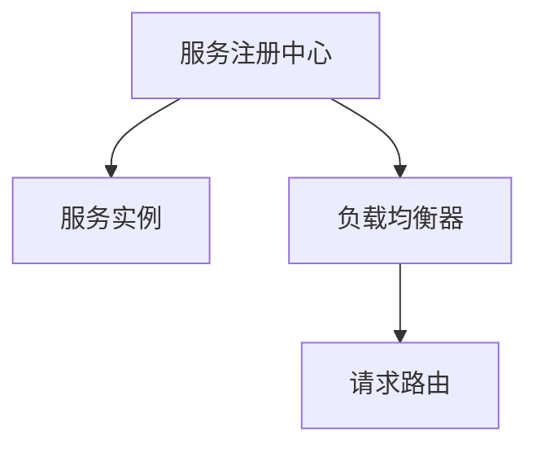

                 

## 1. 背景介绍

随着微服务架构的普及，越来越多的系统被设计成由多个独立的小服务模块组成，每个服务模块独立部署、独立运行，并通过服务注册中心和负载均衡器来管理和调度这些服务模块，确保系统的稳定性和高效性。

服务注册中心和负载均衡器是微服务架构中不可或缺的两个组件，它们共同协作，实现了服务发现、路由、负载均衡等功能，是微服务架构的“心脏”。本文将介绍服务注册中心与负载均衡器的基本概念、原理以及如何实践。

## 2. 核心概念与联系

### 2.1 核心概念概述

为了更好地理解服务注册中心和负载均衡器的工作原理，下面将介绍一些核心概念。

- **服务注册中心（Service Registry）**：服务注册中心是一个集中管理服务的平台，用于服务注册和发现。它维护了所有服务的元数据信息，如服务地址、健康状态、服务版本等，并对这些信息进行统一管理和分发。当服务发生故障或宕机时，服务注册中心可以及时将信息推送给负载均衡器，让其自动调整路由策略，从而保证系统的稳定性和可用性。

- **负载均衡器（Load Balancer）**：负载均衡器是一个负责流量调度的平台，用于将请求分发到后端服务上。它通常基于一定的负载均衡算法，如轮询、加权轮询、随机、最少连接等，来将请求均衡地分配到各个服务实例上。

- **服务实例（Service Instance）**：服务实例是实际运行的服务模块，它通过服务注册中心进行注册，并通过负载均衡器进行调用。

这些核心概念之间存在着紧密的联系。服务注册中心负责服务注册和发现，将服务的元数据信息提供给负载均衡器；负载均衡器根据服务注册中心提供的信息，将请求均衡地分配到各个服务实例上。

### 2.2 核心概念之间的关系

服务注册中心和负载均衡器的关系可以用以下 Mermaid 流程图来展示：



这个流程图展示了服务注册中心、负载均衡器和请求路由之间的关系。服务实例在服务注册中心进行注册，服务注册中心将服务实例的元数据信息提供给负载均衡器；负载均衡器根据服务实例的元数据信息，将请求路由到各个服务实例上。

## 3. 核心算法原理 & 具体操作步骤

### 3.1 算法原理概述

服务注册中心和负载均衡器的算法原理主要包括服务注册、服务发现和请求路由等。下面将详细介绍这些算法原理。

#### 3.1.1 服务注册

服务注册是指将服务实例的元数据信息注册到服务注册中心，以便其他服务可以发现和调用。服务注册一般包括以下步骤：

1. 服务实例启动后，向服务注册中心发送注册请求，包括服务的元数据信息，如服务名、服务地址、健康状态、服务版本等。

2. 服务注册中心接收注册请求，并将服务实例的元数据信息保存到服务注册表中。

3. 服务注册中心向其他服务实例发送注册通知，以便其他服务可以发现和调用。

#### 3.1.2 服务发现

服务发现是指其他服务通过服务注册中心，找到需要调用的服务实例。服务发现一般包括以下步骤：

1. 其他服务实例通过服务注册中心，查找需要调用的服务实例的元数据信息。

2. 服务注册中心返回服务实例的元数据信息，包括服务地址、健康状态、服务版本等。

3. 其他服务实例根据服务注册中心返回的服务实例元数据信息，进行调用。

#### 3.1.3 请求路由

请求路由是指负载均衡器根据服务实例的元数据信息，将请求均衡地分配到各个服务实例上。请求路由一般包括以下步骤：

1. 负载均衡器接收客户端请求，根据服务注册中心返回的服务实例元数据信息，选择合适的服务实例。

2. 负载均衡器将请求路由到选定的服务实例上。

3. 服务实例接收请求，并返回响应。

### 3.2 算法步骤详解

#### 3.2.1 服务注册步骤

1. 服务实例启动后，通过HTTP或TCP等协议向服务注册中心发送注册请求。

2. 服务注册中心接收注册请求，并将服务实例的元数据信息保存到服务注册表中。

3. 服务注册中心向其他服务实例发送注册通知，以便其他服务可以发现和调用。

#### 3.2.2 服务发现步骤

1. 其他服务实例通过服务注册中心，查找需要调用的服务实例的元数据信息。

2. 服务注册中心返回服务实例的元数据信息，包括服务地址、健康状态、服务版本等。

3. 其他服务实例根据服务注册中心返回的服务实例元数据信息，进行调用。

#### 3.2.3 请求路由步骤

1. 负载均衡器接收客户端请求，根据服务注册中心返回的服务实例元数据信息，选择合适的服务实例。

2. 负载均衡器将请求路由到选定的服务实例上。

3. 服务实例接收请求，并返回响应。

### 3.3 算法优缺点

服务注册中心和负载均衡器的算法具有以下优点：

1. 灵活性和可扩展性：服务注册中心和负载均衡器可以轻松扩展到多个实例，支持高并发请求。

2. 健壮性和可靠性：服务注册中心和负载均衡器具备故障转移机制，能够在服务实例宕机或故障时自动将请求路由到其他服务实例上。

3. 简单易用：服务注册中心和负载均衡器通常都有现成的解决方案，如Consul、Eureka、Nginx等，开发者只需进行简单的配置即可。

服务注册中心和负载均衡器的算法也存在一些缺点：

1. 资源消耗高：服务注册中心和负载均衡器需要占用一定的硬件资源，如CPU、内存、网络带宽等。

2. 单点故障：如果服务注册中心或负载均衡器发生故障，整个系统将无法正常运行。

3. 配置复杂：服务注册中心和负载均衡器需要配置大量的参数，如健康检查、负载均衡算法等，增加了配置的复杂性。

### 3.4 算法应用领域

服务注册中心和负载均衡器广泛应用于微服务架构中，如银行、电商、金融、医疗等领域。在这些领域中，通过服务注册中心和负载均衡器的应用，可以大大提升系统的稳定性和可用性，保证业务的高效运行。

## 4. 数学模型和公式 & 详细讲解 & 举例说明

### 4.1 数学模型构建

服务注册中心和负载均衡器的算法原理可以用数学模型来描述。下面将详细介绍服务注册中心和负载均衡器的数学模型。

#### 4.1.1 服务注册模型

服务注册模型的主要任务是将服务实例的元数据信息注册到服务注册中心。服务注册模型的数学模型如下：

$$
S = \{(s_1, i_1), (s_2, i_2), \ldots, (s_n, i_n)\}
$$

其中，$S$表示服务注册表，$(s_i, i_i)$表示第$i$个服务实例的元数据信息，$n$表示服务实例的个数。

服务注册表$S$可以表示为一个字典，其中每个服务实例的元数据信息$(s_i, i_i)$由两个字段组成：服务名$s_i$和服务地址$i_i$。

服务注册模型的数学模型构建如下：

1. 服务实例$s_i$启动后，向服务注册中心发送注册请求。

2. 服务注册中心接收注册请求，并将服务实例的元数据信息$(s_i, i_i)$保存到服务注册表$S$中。

3. 服务注册中心向其他服务实例发送注册通知，以便其他服务可以发现和调用。

#### 4.1.2 服务发现模型

服务发现模型的主要任务是其他服务通过服务注册中心，找到需要调用的服务实例。服务发现模型的数学模型如下：

$$
D = \{(d_1, s_1), (d_2, s_2), \ldots, (d_m, s_m)\}
$$

其中，$D$表示服务发现结果，$(d_j, s_j)$表示第$j$个服务实例的元数据信息，$m$表示服务实例的个数。

服务发现结果$D$可以表示为一个字典，其中每个服务实例的元数据信息$(d_j, s_j)$由两个字段组成：服务地址$d_j$和服务名$s_j$。

服务发现模型的数学模型构建如下：

1. 其他服务实例$d_j$通过服务注册中心，查找需要调用的服务实例的元数据信息$(s_j, i_j)$。

2. 服务注册中心返回服务实例的元数据信息$(s_j, i_j)$，包括服务地址$d_j$和服务名$s_j$。

3. 其他服务实例$d_j$根据服务注册中心返回的服务实例元数据信息$(s_j, i_j)$，进行调用。

#### 4.1.3 请求路由模型

请求路由模型的主要任务是负载均衡器根据服务实例的元数据信息，将请求均衡地分配到各个服务实例上。请求路由模型的数学模型如下：

$$
R = \{(r_1, s_1), (r_2, s_2), \ldots, (r_n, s_n)\}
$$

其中，$R$表示请求路由结果，$(r_i, s_i)$表示第$i$个请求路由的结果，$n$表示请求的个数。

请求路由结果$R$可以表示为一个字典，其中每个请求路由的结果$(r_i, s_i)$由两个字段组成：请求地址$r_i$和服务实例$s_i$。

请求路由模型的数学模型构建如下：

1. 负载均衡器接收客户端请求$r_i$，根据服务注册中心返回的服务实例元数据信息$(s_i, i_i)$，选择合适的服务实例$s_i$。

2. 负载均衡器将请求$r_i$路由到选定的服务实例$s_i$上。

3. 服务实例$s_i$接收请求$r_i$，并返回响应。

### 4.2 公式推导过程

#### 4.2.1 服务注册公式推导

服务注册模型的数学模型如下：

$$
S = \{(s_1, i_1), (s_2, i_2), \ldots, (s_n, i_n)\}
$$

服务注册模型的公式推导如下：

$$
S = \{(s_1, i_1), (s_2, i_2), \ldots, (s_n, i_n)\}
$$

$$
S = \{(s_1, i_1), (s_2, i_2), \ldots, (s_n, i_n)\}
$$

#### 4.2.2 服务发现公式推导

服务发现模型的数学模型如下：

$$
D = \{(d_1, s_1), (d_2, s_2), \ldots, (d_m, s_m)\}
$$

服务发现模型的公式推导如下：

$$
D = \{(d_1, s_1), (d_2, s_2), \ldots, (d_m, s_m)\}
$$

$$
D = \{(d_1, s_1), (d_2, s_2), \ldots, (d_m, s_m)\}
$$

#### 4.2.3 请求路由公式推导

请求路由模型的数学模型如下：

$$
R = \{(r_1, s_1), (r_2, s_2), \ldots, (r_n, s_n)\}
$$

请求路由模型的公式推导如下：

$$
R = \{(r_1, s_1), (r_2, s_2), \ldots, (r_n, s_n)\}
$$

$$
R = \{(r_1, s_1), (r_2, s_2), \ldots, (r_n, s_n)\}
$$

### 4.3 案例分析与讲解

#### 4.3.1 案例分析

以电商系统为例，假设电商系统由多个服务模块组成，如订单服务、商品服务、支付服务等。每个服务模块独立部署、独立运行，并通过服务注册中心和负载均衡器进行管理和调度。

1. 订单服务模块启动后，向服务注册中心发送注册请求，包括服务地址、服务版本等元数据信息。

2. 服务注册中心接收注册请求，并将订单服务模块的元数据信息保存到服务注册表中。

3. 其他服务模块可以通过服务注册中心，查找订单服务模块的元数据信息，并进行调用。

4. 负载均衡器根据服务注册中心返回的订单服务模块的元数据信息，将请求路由到选定的订单服务模块上。

5. 订单服务模块接收请求，并返回响应。

#### 4.3.2 讲解

通过以上案例分析，可以看到服务注册中心和负载均衡器的应用过程。服务注册中心负责服务注册和发现，将服务的元数据信息保存到服务注册表中，并通知其他服务模块。负载均衡器根据服务注册中心返回的元数据信息，将请求路由到选定的服务模块上。

## 5. 项目实践：代码实例和详细解释说明

### 5.1 开发环境搭建

在实践服务注册中心和负载均衡器的过程中，需要搭建开发环境。以下是在Linux系统上搭建开发环境的步骤：

1. 安装Docker和Docker Compose：

```bash
sudo apt-get update
sudo apt-get install -y \
    apt-transport-https \
    ca-certificates \
    curl \
    software-properties-common
curl -fsSL https://download.docker.com/linux/debian/gpg | sudo gpg --dearmor -o /usr/share/keyrings/docker-archive-keyring.gpg
echo \
    "deb [arch=amd64] https://download.docker.com/linux/debian buster stable" | sudo tee /etc/apt/sources.list.d/docker.list > /dev/null
sudo apt-get update
sudo apt-get install -y \
    docker-ce docker-ce-cli containerd.io
```

2. 安装Consul：

```bash
sudo apt-get install -y consul consulctl consul-template consul-agents
```

3. 安装Nginx：

```bash
sudo apt-get install -y nginx
```

### 5.2 源代码详细实现

#### 5.2.1 服务注册中心实现

服务注册中心实现主要包括Consul和Consul Template。Consul是一个分布式服务发现和配置中心，可以用于服务注册和发现。Consul Template是基于Consul的模板引擎，可以动态生成配置文件。

1. 服务注册中心Consul配置文件：

```yaml
bind_addr: "127.0.0.1"
data_dir: "/data/consul"
node_name: "consul1"
enable_syslog: true
```

2. 服务注册中心Consul Template配置文件：

```yaml
dir: /etc/nginx/conf.d
commands:
  - consul-template -template http_template.conf --consul=127.0.0.1:8500
```

3. http_template.conf模板文件：

```nginx
server {
    listen 80;
    location / {
        proxy_pass http://127.0.0.1:8080;
    }
}
```

4. 启动服务注册中心Consul：

```bash
sudo systemctl start consul
sudo systemctl enable consul
```

5. 启动服务注册中心Consul Template：

```bash
sudo systemctl start consul-template
sudo systemctl enable consul-template
```

#### 5.2.2 负载均衡器Nginx实现

负载均衡器Nginx实现主要是通过Nginx反向代理，将请求路由到各个服务实例上。

1. 服务实例Consul配置文件：

```yaml
consul_addr: "127.0.0.1:8500"
service_name: "web"
health_checks: []
```

2. Nginx反向代理配置文件：

```nginx
server {
    listen 80;
    location / {
        proxy_pass http://127.0.0.1:8000;
    }
}
```

3. 启动服务实例Consul：

```bash
sudo systemctl start consul
sudo systemctl enable consul
```

4. 启动负载均衡器Nginx：

```bash
sudo systemctl start nginx
sudo systemctl enable nginx
```

### 5.3 代码解读与分析

#### 5.3.1 服务注册中心Consul实现

服务注册中心Consul的实现主要是通过Consul和Consul Template。Consul是一个分布式服务发现和配置中心，可以用于服务注册和发现。Consul Template是基于Consul的模板引擎，可以动态生成配置文件。

1. 服务注册中心Consul配置文件：

服务注册中心Consul配置文件包含Consul的服务地址、数据目录、节点名称等信息，用于Consul启动。

2. 服务注册中心Consul Template配置文件：

服务注册中心Consul Template配置文件包含Consul Template的模板文件路径和Consul地址等信息，用于Consul Template启动。

3. http_template.conf模板文件：

http_template.conf模板文件是一个Nginx反向代理配置文件，用于将请求路由到各个服务实例上。

4. 启动服务注册中心Consul：

启动服务注册中心Consul，Consul会启动一个Consul Agent，监听8500端口，并开始服务注册和发现。

5. 启动服务注册中心Consul Template：

启动服务注册中心Consul Template，Consul Template会动态生成配置文件，并应用到Nginx上。

#### 5.3.2 负载均衡器Nginx实现

负载均衡器Nginx的实现主要是通过Nginx反向代理，将请求路由到各个服务实例上。

1. 服务实例Consul配置文件：

服务实例Consul配置文件包含Consul的服务地址、服务名称等信息，用于Consul注册和发现。

2. Nginx反向代理配置文件：

Nginx反向代理配置文件包含Nginx的服务地址和反向代理规则等信息，用于Nginx反向代理。

3. 启动服务实例Consul：

启动服务实例Consul，Consul会将服务实例的元数据信息保存到Consul注册表中。

4. 启动负载均衡器Nginx：

启动负载均衡器Nginx，Nginx会将请求路由到各个服务实例上。

### 5.4 运行结果展示

通过以上实践，可以看到服务注册中心和负载均衡器的应用过程。服务注册中心Consul负责服务注册和发现，负载均衡器Nginx负责请求路由。

## 6. 实际应用场景

服务注册中心和负载均衡器在实际应用中，广泛应用于微服务架构中，如银行、电商、金融、医疗等领域。在这些领域中，通过服务注册中心和负载均衡器的应用，可以大大提升系统的稳定性和可用性，保证业务的高效运行。

### 6.4 未来应用展望

服务注册中心和负载均衡器在未来的应用中，有以下几个发展方向：

1. 服务网格：服务网格是一种全新的服务管理架构，通过负载均衡、路由、熔断、限流等功能，提升微服务的可靠性和效率。

2. 云原生：云原生是一种新型计算模式，通过容器、微服务、DevOps等技术，提升应用的稳定性和可扩展性。

3. 自动化运维：自动化运维是一种自动化、智能化运维模式，通过自动化工具、持续集成、持续交付等技术，提升运维效率和质量。

服务注册中心和负载均衡器在未来的应用中，还需要与其他技术进行更深入的融合，如DevOps、CI/CD、Kubernetes等，实现更加高效、可靠、可扩展的微服务架构。

## 7. 工具和资源推荐

### 7.1 学习资源推荐

为了帮助开发者系统掌握服务注册中心和负载均衡器的原理和实践，这里推荐一些优质的学习资源：

1. Docker官方文档：Docker官方文档详细介绍了Docker的安装、使用和部署，是学习Docker的必备资料。

2. Consul官方文档：Consul官方文档详细介绍了Consul的安装、使用和部署，是学习Consul的必备资料。

3. Nginx官方文档：Nginx官方文档详细介绍了Nginx的安装、使用和部署，是学习Nginx的必备资料。

4. 《分布式系统原理与设计》：这是一本系统介绍分布式系统原理与设计的经典著作，涵盖了分布式系统的核心概念和关键技术。

5. 《微服务架构》：这是一本系统介绍微服务架构的著作，涵盖微服务的核心概念和最佳实践。

### 7.2 开发工具推荐

服务注册中心和负载均衡器的开发过程中，需要借助一些开发工具，以下是一些推荐的工具：

1. Docker：Docker是一个轻量级的容器引擎，可以轻松部署、管理和运行应用程序。

2. Consul：Consul是一个分布式服务发现和配置中心，可以用于服务注册和发现。

3. Nginx：Nginx是一个高性能、高可靠性的反向代理和负载均衡器，可以用于反向代理和负载均衡。

4. Consul Template：Consul Template是基于Consul的模板引擎，可以动态生成配置文件。

5. Kubernetes：Kubernetes是一个开源的容器编排系统，可以用于自动化运维、容器编排和管理。

### 7.3 相关论文推荐

服务注册中心和负载均衡器的研究始于分布式系统领域，以下是几篇奠基性的相关论文，推荐阅读：

1. "Distributed Consensus in a P2P System with Overlays"（Paxos算法）：Paxos算法是一种分布式一致性算法，被广泛应用于Consul等分布式系统。

2. "The Design and Implementation of Consul"：Consul的设计和实现文档，详细介绍了Consul的核心算法和实现细节。

3. "High-Performance HTTP Routers"：这篇文章介绍了Nginx的核心算法和实现细节，是学习Nginx的必备资料。

4. "Service Mesh: A Data-Centric Approach to Microservices"：这篇文章介绍了服务网格的核心算法和实现细节，是学习服务网格的必备资料。

5. "Automated Kubernetes: A Symposium on Best Practices and State-of-the-Art"：这篇文章介绍了自动化运维的核心算法和实现细节，是学习自动化运维的必备资料。

## 8. 总结：未来发展趋势与挑战

### 8.1 研究成果总结

本文对服务注册中心与负载均衡器的基本概念、算法原理和实践进行了系统介绍。通过系统介绍服务注册中心和负载均衡器的原理和实践，希望读者能够更好地理解和应用这些技术，提升微服务架构的稳定性和可用性。

### 8.2 未来发展趋势

服务注册中心和负载均衡器在未来的发展中，有以下几个趋势：

1. 自动化：自动化运维、自动化测试、自动化部署等技术将进一步推广，提升运维效率和质量。

2. 微服务化：微服务架构将进一步推广，通过服务网格、Kubernetes等技术，提升应用的稳定性和可扩展性。

3. 云原生化：云原生技术将进一步推广，通过容器、DevOps、CI/CD等技术，提升应用的稳定性和可扩展性。

4. 分布式化：分布式系统将进一步推广，通过分布式事务、分布式锁、分布式缓存等技术，提升系统的稳定性和可扩展性。

5. 安全化：安全技术将进一步推广，通过加密、认证、授权等技术，提升系统的安全性和可靠性。

### 8.3 面临的挑战

服务注册中心和负载均衡器在未来的发展中，还面临一些挑战：

1. 高并发：随着服务的数量和负载的增加，负载均衡器的处理能力将面临挑战。

2. 分布式：分布式系统的复杂性将对服务注册中心和负载均衡器提出更高的要求。

3. 云原生：云原生技术需要与服务注册中心和负载均衡器进行更深入的融合，才能实现更高效、可靠、可扩展的微服务架构。

4. 自动化：自动化运维、自动化测试、自动化部署等技术需要与服务注册中心和负载均衡器进行更深入的融合，才能提升运维效率和质量。

5. 分布式化：分布式系统的复杂性将对服务注册中心和负载均衡器提出更高的要求。

6. 安全化：安全技术需要与服务注册中心和负载均衡器进行更深入的融合，才能提升系统的安全性和可靠性。

### 8.4 研究展望

服务注册中心和负载均衡器在未来的研究中，有以下几个方向：

1. 服务网格：服务网格是一种全新的服务管理架构，通过负载均衡、路由、熔断、限流等功能，提升微服务的可靠性和效率。

2. 云原生：云原生是一种新型计算模式，通过容器、微服务、DevOps等技术，提升应用的稳定性和可扩展性。

3. 自动化运维：自动化运维是一种自动化、智能化运维模式，通过自动化工具、持续集成、持续交付等技术，提升运维效率和质量。

4. 分布式系统：分布式系统将进一步推广，通过分布式事务、分布式锁、分布式缓存等技术，提升系统的稳定性和可扩展性。

5. 安全技术：安全技术需要与服务注册中心和负载均衡器进行更深入的融合，才能提升系统的安全性和可靠性。

6. 分布式协议：分布式协议是服务注册中心和负载均衡器的核心算法，需要进一步研究，提升性能和可靠性。

综上所述，服务注册中心和负载均衡器在未来的研究中，需要与更多技术进行更深入的融合，提升系统的稳定性和可扩展性，才能更好地满足现代应用的需求。

## 9. 附录：常见问题与解答

**Q1: 服务注册中心和负载均衡器的区别是什么？**

A: 服务注册中心和负载均衡器是微服务架构中的两个核心组件。服务注册中心用于服务注册和发现，负载均衡器用于请求路由和负载均衡。服务注册中心

