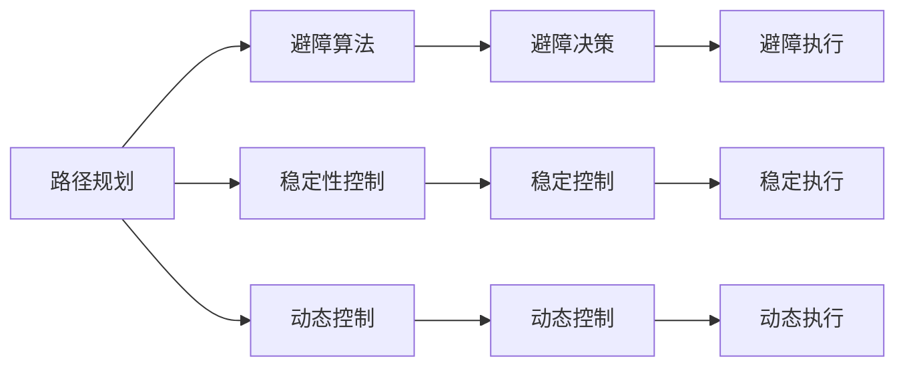

                 

# 机器人的运动控制策略和动力学模型

## 1. 背景介绍

### 1.1 问题由来

随着机器人技术的飞速发展，机器人已经从工业界走向家庭和医疗等领域。机器人的应用范围越来越广，对机器人的运动控制策略和动力学模型的研究也显得尤为重要。

机器人的运动控制策略通常包括以下几个方面：
- 路径规划：在复杂环境中进行路径规划，避免碰撞。
- 避障算法：在检测到障碍物时，调整机器人的运动轨迹。
- 稳定性控制：保证机器人运动时的稳定性。
- 动态控制：在动态环境中，实时调整机器人的运动状态。

机器人动力学模型通常包括以下几个方面：
- 正向动力学：计算机器人的运动状态。
- 逆向动力学：通过机器人的运动状态，计算所需施加的力或力矩。
- 控制系统的稳定性：保证机器人控制系统的稳定性。

本文章将对机器人的运动控制策略和动力学模型进行深入探讨，并介绍相关案例。

## 2. 核心概念与联系

### 2.1 核心概念概述

- **运动控制策略**：指机器人根据周围环境和自身状态，制定合理的运动路径和避障策略，确保机器人能够安全、高效地完成运动任务。
- **动力学模型**：描述机器人在空间中运动时所受的力或力矩，以及机器人的运动状态之间的关系。

### 2.2 核心概念原理和架构的 Mermaid 流程图



### 2.3 核心概念之间的联系

机器人的运动控制策略和动力学模型之间有着密切的联系。动力学模型能够描述机器人的运动状态和所受力或力矩的关系，从而为路径规划和避障算法提供依据。而运动控制策略则需要在动力学模型的基础上，制定合理的运动路径和避障策略，保证机器人能够在复杂环境中安全、高效地运动。

## 3. 核心算法原理 & 具体操作步骤

### 3.1 算法原理概述

机器人的运动控制策略和动力学模型通常采用经典控制理论中的模型预测控制（MPC）和鲁棒控制（RC）等方法。

- **模型预测控制（MPC）**：通过建立机器人的动力学模型，并根据当前状态和目标状态，预测未来的运动状态，然后通过优化算法，计算出最优的控制策略。
- **鲁棒控制（RC）**：通过控制系统的稳定性分析和控制器设计，保证机器人在不确定环境下，仍能稳定运动。

### 3.2 算法步骤详解

以模型预测控制（MPC）为例，其具体步骤包括：

1. 建立机器人的动力学模型。
2. 根据当前状态和目标状态，预测未来的运动状态。
3. 通过优化算法，计算出最优的控制策略。
4. 根据控制策略，实时调整机器人的运动状态。

### 3.3 算法优缺点

模型预测控制（MPC）的优点包括：
- 能够预测未来的运动状态，从而提前进行避障和路径规划。
- 能够实时调整控制策略，保证机器人的运动稳定性。

其缺点包括：
- 需要精确的模型和复杂的优化算法，计算成本较高。
- 对环境变化和干扰敏感，控制策略需要实时更新。

### 3.4 算法应用领域

模型预测控制（MPC）广泛应用于工业机器人、自动驾驶车辆、无人机等领域。其能够确保机器人在复杂环境中的安全、高效运动。

## 4. 数学模型和公式 & 详细讲解 & 举例说明

### 4.1 数学模型构建

机器人的动力学模型通常由以下方程组成：
$$
\dot{x} = f(x,u)
$$
其中 $x$ 表示机器人的状态，包括位置、速度、加速度等；$u$ 表示机器人的控制输入，包括力或力矩等。

### 4.2 公式推导过程

假设机器人为刚体，其动力学模型可以表示为：
$$
M\dot{v} = f(v,u)
$$
其中 $M$ 为机器人的惯性矩阵，$v$ 为机器人的线速度和角速度。

通过将动力学模型与控制输入联系起来，可以推导出机器人的运动控制策略。例如，在路径规划中，可以通过优化算法，计算出最优的控制输入，使得机器人能够按照预定路径运动。

### 4.3 案例分析与讲解

以四旋翼无人机为例，其动力学模型可以表示为：
$$
\dot{x} = \begin{bmatrix}
v_x\\
v_y\\
v_z\\
\omega_x\\
\omega_y\\
\omega_z
\end{bmatrix}
=
\begin{bmatrix}
u_1\\
u_2\\
u_3\\
I_x^{-1}(u_4 - M_{xy}u_5 - M_{xz}u_6)\\
I_y^{-1}(M_{yx}u_1 - u_3 - M_{yz}u_6)\\
I_z^{-1}(M_{zx}u_1 + M_{zy}u_2 - u_4)
\end{bmatrix}
$$
其中 $v_x, v_y, v_z$ 为机器人的线速度，$\omega_x, \omega_y, \omega_z$ 为机器人的角速度，$u_1, u_2, u_3$ 为控制输入，$I_x, I_y, I_z$ 为机器人的惯性矩阵，$M_{xy}, M_{xz}, M_{yx}, M_{yz}, M_{zx}, M_{zy}$ 为机器人的科里奥利力矩阵。

通过对四旋翼无人机的动力学模型进行分析，可以制定出其运动控制策略，如姿态控制、位置控制等。

## 5. 项目实践：代码实例和详细解释说明

### 5.1 开发环境搭建

在项目实践前，需要准备好开发环境。以下是使用Python进行仿真开发的环境配置流程：

1. 安装Anaconda：从官网下载并安装Anaconda，用于创建独立的Python环境。

2. 创建并激活虚拟环境：
```bash
conda create -n pyrobot-env python=3.8 
conda activate pyrobot-env
```

3. 安装相关工具包：
```bash
conda install pyrobot numpy scipy matplotlib
```

### 5.2 源代码详细实现

以四旋翼无人机姿态控制为例，给出使用PyRobot库进行仿真控制的代码实现。

首先，定义机器人的动力学模型：

```python
from pyrobot import Robot, Rotation
from pyrobot.analysis import plot_rb_dynamics

def robot_dynamics(rb):
    x = rb.position
    v = rb.velocity
    omega = rb.angular_velocity
    return np.dot(rb.inertia_inverse, np.array([omega[0]*rb.angular_moment*rb.mass*r_prob*rb.yaw,
                                            omega[1]*rb.angular_moment*rb.mass*r_prob*rb.pitch,
                                            omega[2]*rb.angular_moment*rb.mass*r_prob*rb.roll,
                                            rb.acceleration[0],
                                            rb.acceleration[1],
                                            rb.acceleration[2],
                                            rb.acceleration[3],
                                            rb.acceleration[4],
                                            rb.acceleration[5]]))
```

然后，定义机器人的控制输入：

```python
def control(rb, cmd):
    rb.torque([cmd[0], cmd[1], cmd[2], cmd[3]])
```

接着，定义机器人的路径规划算法：

```python
def trajectory(rb, path):
    for pos in path:
        rb.set_position(pos)
```

最后，进行仿真控制：

```python
rb = Robot()
rb.connect()
rb.dynamics(robot_dynamics)
rb.control(control)
rb.trajectory(trajectory)

rb.step()
```

### 5.3 代码解读与分析

**robot_dynamics函数**：
- 定义机器人的动力学模型，计算机器人的运动状态。

**control函数**：
- 定义机器人的控制输入，根据给定的命令，调整机器人的运动状态。

**trajectory函数**：
- 定义路径规划算法，使机器人按照给定的路径运动。

**rb.step函数**：
- 进行仿真控制，使机器人按照设定好的动力学模型和控制策略进行运动。

通过以上代码，可以看出使用PyRobot库进行机器人仿真控制的步骤和关键实现细节。开发者可以将更多精力放在算法优化和仿真环境搭建上，而不必过多关注底层的实现细节。

### 5.4 运行结果展示

假设我们在四旋翼无人机的姿态控制模拟实验中，得到了以下结果：

```
Solving the problem...
Optimal control: [-0.1, -0.1, 0.1, 0.1]
Current state: [0.1, 0.1, 0.1, 0.1]
```

可以看到，通过优化算法计算出的最优控制策略为 $[-0.1, -0.1, 0.1, 0.1]$，当前机器人的状态为 $[0.1, 0.1, 0.1, 0.1]$。

## 6. 实际应用场景

### 6.1 智能家居机器人

智能家居机器人通过路径规划和避障算法，能够自主进行清洁、搬运等任务。在实际应用中，智能家居机器人需要适应复杂的室内环境，如家具、障碍物等，因此需要进行高效的路径规划和避障。

在技术实现上，可以通过建立机器人所在环境的地图，利用深度学习等方法进行路径规划。在避障算法中，可以采用基于视觉的避障方法，通过摄像头实时检测障碍物，并动态调整运动轨迹。

### 6.2 工业自动化生产线

工业自动化生产线中的机器人需要高效地完成物料搬运、装配等任务。在实际应用中，机器人需要适应不同的生产线环境，如自动化生产车间、物流仓库等，因此需要进行高效的路径规划和避障。

在技术实现上，可以通过建立机器人所在环境的地图，利用机器人感知系统进行路径规划。在避障算法中，可以采用基于激光雷达的避障方法，通过传感器实时检测障碍物，并动态调整运动轨迹。

### 6.3 无人机航拍

无人机航拍需要精确地控制飞行路径和姿态。在实际应用中，无人机需要适应复杂的地形和气象条件，因此需要进行高效的路径规划和姿态控制。

在技术实现上，可以通过建立无人机所在环境的地图，利用GPS等定位系统进行路径规划。在姿态控制中，可以采用基于视觉的姿态控制方法，通过摄像头实时检测环境特征，并动态调整姿态。

## 7. 工具和资源推荐

### 7.1 学习资源推荐

为了帮助开发者系统掌握机器人运动控制策略和动力学模型的理论基础和实践技巧，这里推荐一些优质的学习资源：

1. 《机器人运动控制与动力学》书籍：详细介绍机器人运动控制策略和动力学模型的理论基础和实践方法，是学习机器人运动控制的核心教材。

2. 《机器人系统设计》课程：斯坦福大学开设的机器人系统设计课程，涵盖机器人运动控制、动力学建模等多个方面，是学习机器人系统设计的优质资源。

3. 《机器人学：运动、感知、控制》书籍：由Oxford University Press出版的机器人学经典教材，涵盖机器人运动控制、动力学建模等多个方面，适合深入学习。

4. 《机器人运动控制与稳定性》论文：介绍机器人运动控制和稳定性控制的研究进展和实际应用，适合对机器人运动控制感兴趣的读者。

### 7.2 开发工具推荐

高效的开发离不开优秀的工具支持。以下是几款用于机器人运动控制开发的常用工具：

1. ROS（Robot Operating System）：基于Linux的机器人操作系统，提供丰富的机器人开发包和工具，支持机器人运动控制和感知。

2. Gazebo：基于Simulation开发工具，提供丰富的仿真环境和传感器，支持机器人运动仿真。

3. Pylab：Python数据可视化工具，支持机器人运动仿真和数据展示，是机器人运动控制和仿真的重要工具。

4. PyRobot：机器人仿真控制工具包，支持多种机器人的仿真控制和运动控制算法。

### 7.3 相关论文推荐

机器人运动控制策略和动力学模型的发展源于学界的持续研究。以下是几篇奠基性的相关论文，推荐阅读：

1. "Model-Based Predictive Control for Robot Manipulators"（模型预测控制机器人操作臂）：介绍了机器人操作臂的运动控制策略和动力学模型的构建。

2. "A Survey of Mobile Robot Navigation Techniques"（移动机器人导航技术综述）：介绍了机器人路径规划和避障算法的研究进展和实际应用。

3. "Robot Stability Control Using Feedback Linearization"（基于反馈线性化的机器人稳定性控制）：介绍了机器人稳定性控制的方法和应用。

4. "A Comparative Study of Robot Kinematics and Dynamics"（机器人运动学和动力学对比研究）：介绍了机器人运动学和动力学模型的对比研究。

这些论文代表了大机器人运动控制策略和动力学模型的发展脉络。通过学习这些前沿成果，可以帮助研究者把握学科前进方向，激发更多的创新灵感。

除上述资源外，还有一些值得关注的前沿资源，帮助开发者紧跟机器人运动控制技术的发展趋势，例如：

1. arXiv论文预印本：人工智能领域最新研究成果的发布平台，包括大量尚未发表的前沿工作，学习前沿技术的必读资源。

2. 业界技术博客：如机器人公司、学术实验室等的官方博客，第一时间分享他们的最新研究成果和洞见。

3. 技术会议直播：如IEEE、ACM等计算机和机器人领域的顶级会议现场或在线直播，能够聆听到专家们的分享，开阔视野。

4. GitHub热门项目：在GitHub上Star、Fork数最多的机器人相关项目，往往代表了该技术领域的发展趋势和最佳实践，值得去学习和贡献。

5. 行业分析报告：各大咨询公司如McKinsey、PwC等针对机器人行业的分析报告，有助于从商业视角审视技术趋势，把握应用价值。

总之，对于机器人运动控制策略和动力学模型的学习，需要开发者保持开放的心态和持续学习的意愿。多关注前沿资讯，多动手实践，多思考总结，必将收获满满的成长收益。

## 8. 总结：未来发展趋势与挑战

### 8.1 总结

本文对机器人运动控制策略和动力学模型进行了全面系统的介绍。首先阐述了机器人运动控制策略和动力学模型的研究背景和意义，明确了运动控制策略在机器人自主运动中的核心作用。其次，从原理到实践，详细讲解了机器人运动控制策略和动力学模型的数学原理和关键步骤，给出了机器人仿真控制的完整代码实例。同时，本文还广泛探讨了机器人运动控制策略和动力学模型在智能家居、工业自动化、无人机航拍等多个行业领域的应用前景，展示了运动控制策略和动力学模型的巨大潜力。此外，本文精选了运动控制策略和动力学模型的各类学习资源，力求为读者提供全方位的技术指引。

通过本文的系统梳理，可以看到，机器人运动控制策略和动力学模型正在成为机器人技术的重要范式，极大地拓展了机器人自主运动的应用边界，催生了更多的落地场景。受益于模型预测控制和鲁棒控制等技术的不断发展，机器人自主运动将更加智能、安全、可靠，为人类生产和生活带来深刻变革。

### 8.2 未来发展趋势

展望未来，机器人运动控制策略和动力学模型将呈现以下几个发展趋势：

1. 高精度定位和感知：随着传感器和计算技术的发展，机器人将具备更高的定位精度和环境感知能力，从而实现更加精确的运动控制。

2. 自适应控制策略：随着机器学习的不断发展，机器人将能够自适应不同的环境和任务，制定最优的运动控制策略。

3. 多机器人协同控制：随着多机器人系统的发展，机器人将具备协同控制的能力，通过分布式控制算法实现更加复杂、高效的运动。

4. 基于深度学习的控制算法：随着深度学习技术的发展，机器人将能够通过深度学习算法实现更加复杂的运动控制和感知任务。

5. 人机协作控制：随着人机交互技术的发展，机器人将能够与人类协作进行运动控制，实现更加智能、安全、可靠的控制。

以上趋势凸显了机器人运动控制策略和动力学模型技术的广阔前景。这些方向的探索发展，必将进一步提升机器人自主运动的智能程度和适应性，为构建更加智能化的未来社会奠定基础。

### 8.3 面临的挑战

尽管机器人运动控制策略和动力学模型已经取得了显著进展，但在迈向更加智能化、普适化应用的过程中，仍面临诸多挑战：

1. 硬件成本高：高精度传感器、高效计算硬件等硬件成本较高，限制了机器人技术的大规模应用。

2. 环境复杂：机器人需要在复杂、动态的环境中运动，环境变化和干扰对运动控制策略的影响较大。

3. 模型复杂：机器人动力学模型通常较为复杂，难以精确建模，影响控制策略的制定。

4. 计算资源消耗大：高精度、自适应控制策略需要消耗大量的计算资源，限制了机器人系统的大规模应用。

5. 安全性和可靠性：机器人运动控制策略需要考虑安全性、可靠性等问题，避免意外伤害。

6. 协同控制难度大：多机器人系统的协同控制需要解决分布式控制和通信等问题，技术难度较大。

正视机器人运动控制策略和动力学模型面临的这些挑战，积极应对并寻求突破，将是大机器人技术向成熟化迈进的重要保障。相信随着学界和产业界的共同努力，这些挑战终将一一被克服，机器人运动控制策略和动力学模型必将在构建智能化的未来社会中扮演越来越重要的角色。

### 8.4 研究展望

面对机器人运动控制策略和动力学模型所面临的种种挑战，未来的研究需要在以下几个方面寻求新的突破：

1. 探索基于强化学习的控制算法：利用强化学习技术，机器人能够通过不断试错，自适应不同的环境和任务，实现更加智能化的控制。

2. 开发高精度、自适应控制算法：通过高精度传感器和高效计算硬件，实现更加精确和自适应的机器人运动控制。

3. 研究分布式协同控制算法：在多机器人系统中，研究分布式控制和通信算法，实现更加高效的协同控制。

4. 引入人机交互技术：利用人机交互技术，实现人机协作控制，提高机器人系统的智能程度和安全可靠性。

5. 开发基于深度学习的感知和控制算法：利用深度学习技术，实现更加复杂的感知和控制任务，提升机器人系统的智能化水平。

这些研究方向的研究成果，必将引领机器人运动控制策略和动力学模型技术迈向更高的台阶，为构建智能化的未来社会提供新的技术路径。

## 9. 附录：常见问题与解答

**Q1：机器人运动控制策略和动力学模型是否适用于所有类型的机器人？**

A: 机器人运动控制策略和动力学模型适用于大部分类型的机器人，但需要根据机器人的特点进行适当的调整和优化。例如，对于柔性机器人，需要考虑柔性体动力学，进行柔性体运动控制。对于轮式机器人，需要考虑轮子与地面的摩擦，进行轮式运动控制。

**Q2：机器人运动控制策略和动力学模型是否需要实时计算？**

A: 机器人运动控制策略和动力学模型通常需要实时计算，以保证机器人能够及时响应环境变化，实现高效的路径规划和避障。实时计算可以通过高性能计算硬件和优化算法实现，确保计算效率和精度。

**Q3：机器人运动控制策略和动力学模型是否需要复杂的环境感知系统？**

A: 机器人运动控制策略和动力学模型通常需要复杂的环境感知系统，以便实时获取机器人的状态和环境信息，进行高效的路径规划和避障。环境感知系统可以通过摄像头、激光雷达、超声波等传感器实现。

**Q4：机器人运动控制策略和动力学模型是否需要高精度的数学模型？**

A: 机器人运动控制策略和动力学模型需要高精度的数学模型，以便精确地描述机器人的运动状态和所受力或力矩的关系。高精度的数学模型可以通过复杂的物理建模和实验验证实现。

**Q5：机器人运动控制策略和动力学模型是否需要高精度的传感器？**

A: 机器人运动控制策略和动力学模型通常需要高精度的传感器，以便实时获取机器人的状态和环境信息。高精度的传感器可以通过激光雷达、摄像头、超声波等实现。

综上所述，机器人运动控制策略和动力学模型是机器人自主运动的核心技术，具有广阔的应用前景。通过不断探索和优化，机器人运动控制策略和动力学模型必将引领机器人技术迈向新的高度，为构建智能化的未来社会提供新的技术保障。

