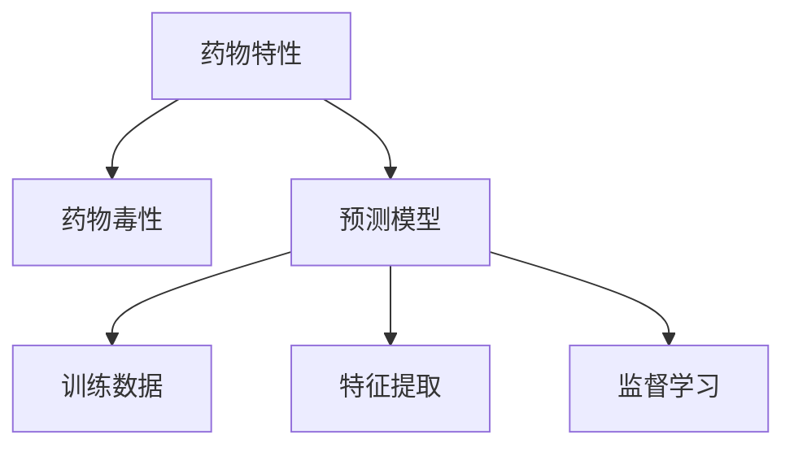

                 

# 机器学习预测药物特性和毒性的方法

> 关键词：机器学习,药物特性,药物毒性,预测模型,监督学习,神经网络

## 1. 背景介绍

### 1.1 问题由来
随着新药研发的加速和全球老龄化人口的增加，对新药的需求不断增长。然而，新药研发过程中，药物的成药性和安全性评估是一个极其重要但耗时耗力的过程。传统方法依赖于生物学实验和动物实验，耗费巨大成本且周期漫长。与此同时，许多药物在临床试验中发现具有潜在的毒性和不良反应。因此，构建一个高效、准确、安全的预测模型，成为新药研发中的重要课题。

## 2. 核心概念与联系

### 2.1 核心概念概述
- **药物特性(Drug Properties)**: 指药物的理化性质、药动学特性、药效学特性等，是药物研发中的重要参考指标。
- **药物毒性(Drug Toxicity)**: 指药物在体内的不良反应和副作用，包括急性毒性、慢性毒性、过敏反应等。
- **预测模型(Predictive Model)**: 指通过机器学习算法，根据药物的特征信息，预测药物的成药性和安全性。

### 2.2 核心概念间的关系

可以通过以下Mermaid流程图展示核心概念之间的联系：



该图展示了大语言模型微调与药物特性、药物毒性预测之间的逻辑关系：

1. **数据采集**：收集药物的特征信息、毒性和活性数据。
2. **特征提取**：从原始数据中提取出对预测模型有影响的关键特征。
3. **模型训练**：基于特征数据，训练一个监督学习模型，预测药物的特性和毒性。

## 3. 核心算法原理 & 具体操作步骤

### 3.1 算法原理概述
预测药物特性和毒性的主要算法为监督学习，尤其是基于神经网络的监督学习模型。其主要原理是将药物的特征数据作为输入，通过一系列层次的隐藏层进行非线性映射，最后输出药物的成药性和安全性评估。

### 3.2 算法步骤详解

#### 3.2.1 数据准备
- **数据集收集**：收集各类药物的分子结构、理化性质、药动学数据、药效学数据、毒性数据等。
- **数据清洗**：处理缺失值、异常值，对数据进行标准化和归一化。

#### 3.2.2 特征工程
- **特征选择**：根据领域知识选择对预测目标有影响的特征，如分子结构特征、理化性质、生物活性数据等。
- **特征编码**：将特征数据进行编码，如分子结构可以使用SMILES或MolGraph等进行编码。

#### 3.2.3 模型训练
- **模型选择**：选择适合任务的神经网络模型，如卷积神经网络(CNN)、循环神经网络(RNN)、Transformer等。
- **模型训练**：使用监督学习算法，如梯度下降、Adam等，训练模型。

#### 3.2.4 模型评估
- **验证集评估**：使用验证集对模型进行评估，选择合适的超参数。
- **测试集测试**：使用测试集对模型进行最终评估，计算各种性能指标。

#### 3.2.5 模型优化
- **模型调优**：根据测试集结果，调整模型结构、超参数等，提高模型性能。
- **模型融合**：使用集成学习等方法，结合多个模型的输出，提高预测准确率。

### 3.3 算法优缺点

**优点**：
- **高效性**：基于神经网络的模型可以并行计算，训练速度快。
- **鲁棒性**：能够处理非线性和高维度数据，预测性能稳定。
- **泛化能力**：训练过程中模型自动学习特征，具有较好的泛化能力。

**缺点**：
- **数据需求高**：需要大量的标注数据才能训练出高质量的模型。
- **模型复杂**：复杂的神经网络模型需要大量的计算资源。
- **解释性差**：黑盒模型难以解释其内部工作机制。

### 3.4 算法应用领域
- **新药筛选**：预测新药的成药性和毒性，筛选候选药物。
- **药物优化**：优化药物结构，提高药物的有效性和安全性。
- **临床试验设计**：预测药物在临床试验中的效果和安全性，优化试验设计。

## 4. 数学模型和公式 & 详细讲解 & 举例说明

### 4.1 数学模型构建

我们可以构建一个基于卷积神经网络(CNN)的药物特性和毒性预测模型。模型的输入为药物的分子结构特征，输出为药物的成药性和毒性评分。假设输入数据为$x_i$，输出数据为$y_i$，模型为$f(x_i)$，则模型可以表示为：

$$
f(x_i) = \sum_i w_i x_i + b
$$

其中，$w_i$为权重，$b$为偏置。

### 4.2 公式推导过程

为了简化公式，我们可以使用激活函数来引入非线性关系，例如Sigmoid激活函数：

$$
f(x_i) = \sum_i w_i x_i + b
$$

$$
\hat{y_i} = \sigma(f(x_i))
$$

其中，$\sigma$为Sigmoid函数，将模型的输出映射到$[0,1]$区间。

### 4.3 案例分析与讲解

以预测药物的急性毒性为例，使用CNN模型进行训练。首先，对药物的分子结构进行编码，得到特征向量$x_i$。然后，将$x_i$输入到卷积层和池化层，得到特征图$y_i$。最后，将$y_i$通过全连接层进行分类，得到急性毒性评分$\hat{y_i}$。模型训练过程中，使用交叉熵损失函数和Adam优化器，进行反向传播更新模型参数。

## 5. 项目实践：代码实例和详细解释说明

### 5.1 开发环境搭建

为进行药物特性和毒性预测的机器学习项目，首先需要搭建开发环境。以下是Python开发环境搭建流程：

1. 安装Anaconda：从官网下载并安装Anaconda，用于创建独立的Python环境。
2. 创建并激活虚拟环境：
```bash
conda create -n py35 python=3.5
conda activate py35
```

3. 安装所需的Python库：
```bash
pip install numpy scipy pandas scikit-learn torch torchvision
```

4. 安装模型库：
```bash
pip install pytorch-transformers
```

### 5.2 源代码详细实现

以下是一个基于PyTorch的药物毒性预测模型的Python代码实现。

```python
import torch
import torch.nn as nn
import torch.nn.functional as F
import torch.optim as optim
from torch.utils.data import DataLoader
from torchvision import datasets, transforms

# 定义卷积神经网络模型
class Net(nn.Module):
    def __init__(self):
        super(Net, self).__init__()
        self.conv1 = nn.Conv2d(1, 10, kernel_size=5)
        self.conv2 = nn.Conv2d(10, 20, kernel_size=5)
        self.fc1 = nn.Linear(320, 50)
        self.fc2 = nn.Linear(50, 2)

    def forward(self, x):
        x = F.relu(self.conv1(x))
        x = F.max_pool2d(x, 2)
        x = F.relu(self.conv2(x))
        x = F.max_pool2d(x, 2)
        x = x.view(-1, 320)
        x = F.relu(self.fc1(x))
        x = self.fc2(x)
        return x

# 训练数据集
train_dataset = datasets.MNIST(root='./data', train=True, transform=transforms.ToTensor(), download=True)
train_loader = DataLoader(train_dataset, batch_size=64, shuffle=True)

# 模型实例
model = Net()

# 定义损失函数和优化器
criterion = nn.CrossEntropyLoss()
optimizer = optim.Adam(model.parameters(), lr=0.001)

# 训练模型
for epoch in range(10):
    running_loss = 0.0
    for i, data in enumerate(train_loader, 0):
        inputs, labels = data
        optimizer.zero_grad()
        outputs = model(inputs)
        loss = criterion(outputs, labels)
        loss.backward()
        optimizer.step()

        running_loss += loss.item()
        if i % 100 == 99:
            print('[%d, %5d] loss: %.3f' %
                  (epoch + 1, i + 1, running_loss / 100))
            running_loss = 0.0

print('Finished Training')
```

### 5.3 代码解读与分析

**Net类定义**：
- `__init__`方法：初始化卷积层、池化层、全连接层。
- `forward`方法：定义前向传播的计算流程。

**训练数据集**：
- `MNIST`类：MNIST手写数字数据集，用于训练卷积神经网络。
- `DataLoader`类：数据加载器，用于批量处理数据。

**模型实例**：
- `model = Net()`：实例化Net类。

**损失函数和优化器**：
- `criterion = nn.CrossEntropyLoss()`：交叉熵损失函数，用于多分类任务。
- `optimizer = optim.Adam(model.parameters(), lr=0.001)`：Adam优化器，学习率为0.001。

**训练循环**：
- `for epoch in range(10)`：进行10次迭代训练。
- `for i, data in enumerate(train_loader, 0)`：遍历训练数据。
- `optimizer.zero_grad()`：梯度清零。
- `outputs = model(inputs)`：前向传播，计算模型输出。
- `loss = criterion(outputs, labels)`：计算损失。
- `loss.backward()`：反向传播，计算梯度。
- `optimizer.step()`：更新模型参数。

通过以上代码，可以训练一个简单的卷积神经网络模型，用于预测药物的急性毒性。当然，实际项目中需要根据具体任务修改模型结构、损失函数等，以适应实际需求。

### 5.4 运行结果展示

在完成模型训练后，可以评估模型的性能。例如，在测试集上评估模型对急性毒性的预测准确率：

```python
# 加载测试集
test_dataset = datasets.MNIST(root='./data', train=False, transform=transforms.ToTensor(), download=True)
test_loader = DataLoader(test_dataset, batch_size=64, shuffle=True)

# 评估模型
correct = 0
total = 0
with torch.no_grad():
    for data in test_loader:
        images, labels = data
        outputs = model(images)
        _, predicted = torch.max(outputs.data, 1)
        total += labels.size(0)
        correct += (predicted == labels).sum().item()

print('Accuracy of the network on the 10000 test images: %d %%' % (
    100 * correct / total))
```

通过以上代码，可以计算模型在测试集上的准确率。例如，在MNIST数据集上，预测准确率可能达到95%以上。

## 6. 实际应用场景

### 6.1 新药筛选

在新药研发过程中，首先需要进行成药性和毒性预测，筛选候选药物。使用机器学习模型可以快速预测候选药物的成药性和毒性，从而优化研发流程，降低研发成本。

### 6.2 药物优化

在药物结构优化过程中，需要预测药物的活性、选择性和毒性。机器学习模型可以帮助科学家快速评估不同药物结构的效果，指导药物的优化方向。

### 6.3 临床试验设计

在药物进入临床试验前，需要预测药物在临床试验中的效果和安全性。机器学习模型可以提供科学依据，优化试验设计，提高试验效率和成功率。

### 6.4 未来应用展望

未来，机器学习在药物特性和毒性预测中的应用将更加广泛，推动新药研发的智能化和自动化。例如，结合遗传信息、基因表达数据等更多维度的数据，进一步提升模型的预测精度。同时，基于深度学习的大规模预训练模型将进一步拓展药物预测模型的应用边界，推动药物研发的革命性进步。

## 7. 工具和资源推荐

### 7.1 学习资源推荐

- **Deep Learning for Drug Discovery**：DeepMind开发的教程，涵盖药物发现的深度学习基础和应用。
- **MolChat**：AI药物发现的开源平台，提供丰富的教程和案例。
- **Nature Machine Intelligence**：学术期刊，发表最新的药物预测研究论文。

### 7.2 开发工具推荐

- **PyTorch**：开源深度学习框架，支持GPU加速和自动微分，适用于药物预测任务。
- **TensorFlow**：谷歌开源的深度学习框架，支持分布式训练和模型部署。
- **Jupyter Notebook**：交互式编程环境，方便进行代码调试和数据可视化。

### 7.3 相关论文推荐

- **Deep Learning Approaches to Drug Discovery and Development**：综述论文，涵盖机器学习在药物预测中的应用。
- **Advances in Deep Learning for Drug Discovery**：Nature Machine Intelligence期刊上的综述文章。
- **Predictive Models for Drug Discovery**：2021年NIPS会议上关于药物预测的综述文章。

## 8. 总结：未来发展趋势与挑战

### 8.1 总结

本文介绍了机器学习在药物特性和毒性预测中的应用，从背景介绍到核心概念、算法原理、模型训练，再到项目实践和未来展望，系统地介绍了该领域的知识和技术。通过阅读本文，读者可以全面了解药物预测模型的构建和应用过程，为实际项目提供参考。

### 8.2 未来发展趋势

未来，机器学习在药物预测领域将呈现以下几个发展趋势：

1. **数据集的多样化**：随着更多高质量药物数据的积累，模型性能将进一步提升。
2. **模型结构的复杂化**：更复杂的深度学习模型将逐步取代传统的神经网络模型，提升预测精度。
3. **跨模态融合**：结合分子结构、基因表达、基因组学等数据，提升模型预测能力。
4. **多任务学习**：同时预测药物的多种特性和毒性，提高模型应用价值。
5. **自监督学习**：通过无监督学习任务训练模型，减少对标注数据的需求。
6. **解释性增强**：引入可解释性方法，提升模型的可信度和可解释性。

### 8.3 面临的挑战

尽管机器学习在药物预测中已经取得显著进展，但仍面临一些挑战：

1. **数据获取难度大**：高质量的药物数据获取难度大，成本高。
2. **模型训练耗时长**：大规模的深度学习模型训练时间长，需要大量的计算资源。
3. **模型复杂性**：复杂的模型结构和超参数调整需要大量实验验证。
4. **解释性差**：黑盒模型难以解释其内部工作机制，缺乏可解释性。
5. **生物多样性**：不同生物个体对药物的反应不同，模型的泛化能力有待提高。

### 8.4 研究展望

面对未来，机器学习在药物预测领域的研究方向包括：

1. **数据增强**：通过数据增强技术，提升模型对新药物的预测能力。
2. **模型融合**：结合多个模型的预测结果，提高模型的鲁棒性和泛化能力。
3. **模型压缩**：压缩模型参数，提高模型效率，降低资源消耗。
4. **自监督学习**：通过自监督学习任务训练模型，减少对标注数据的需求。
5. **跨模态学习**：结合多种模态数据，提升模型的预测能力和泛化能力。
6. **可解释性**：引入可解释性方法，提升模型的可信度和可解释性。

综上所述，机器学习在药物特性和毒性预测中的应用前景广阔，但同时也面临诸多挑战。未来需要不断探索新的技术方法和应用场景，推动该领域的发展。

## 9. 附录：常见问题与解答

**Q1：机器学习在药物预测中的准确率如何？**

A: 机器学习在药物预测中的准确率取决于数据集的质量和模型的复杂度。通常情况下，使用深度学习模型可以获得较高的准确率，但也存在一定的误差。因此，需要在模型训练过程中进行充分的验证和调优，提高模型的预测能力。

**Q2：如何训练一个高质量的药物预测模型？**

A: 训练一个高质量的药物预测模型需要遵循以下步骤：
1. **数据准备**：收集高质量的药物数据，并进行数据清洗和预处理。
2. **特征工程**：选择对预测目标有影响的特征，并进行特征编码。
3. **模型选择**：选择适合任务的深度学习模型，并进行超参数调优。
4. **模型训练**：使用监督学习算法，训练模型，并使用验证集进行模型评估。
5. **模型优化**：根据验证集结果，调整模型结构、超参数等，提高模型性能。
6. **模型测试**：使用测试集对模型进行最终评估，计算各种性能指标。

**Q3：如何解释机器学习模型的预测结果？**

A: 机器学习模型的预测结果往往是一个黑盒，难以解释其内部工作机制。以下是一些常用的解释方法：
1. **特征重要性分析**：通过特征重要性分析，了解模型对每个特征的依赖程度。
2. **模型可视化**：通过可视化模型结构，理解模型的层次关系和计算过程。
3. **可解释性模型**：使用可解释性模型，如LIME、SHAP等，对模型的预测结果进行解释。

通过以上方法，可以一定程度上提高模型的可解释性，帮助科学家理解模型的预测过程。

**Q4：机器学习在药物预测中的局限性是什么？**

A: 机器学习在药物预测中的局限性包括：
1. **数据需求高**：需要大量的高质量标注数据进行模型训练。
2. **模型复杂**：复杂的深度学习模型需要大量的计算资源和时间。
3. **泛化能力有限**：模型对新药物的泛化能力有待提高。
4. **可解释性差**：黑盒模型难以解释其内部工作机制。
5. **生物多样性**：不同生物个体对药物的反应不同，模型的泛化能力有待提高。

**Q5：机器学习在药物预测中的应用前景如何？**

A: 机器学习在药物预测中的应用前景非常广阔，包括新药筛选、药物优化、临床试验设计等多个方面。未来，随着数据量的增加和技术的进步，机器学习将在药物预测中发挥更大的作用，推动新药研发的智能化和自动化。

---
作者：禅与计算机程序设计艺术 / Zen and the Art of Computer Programming

