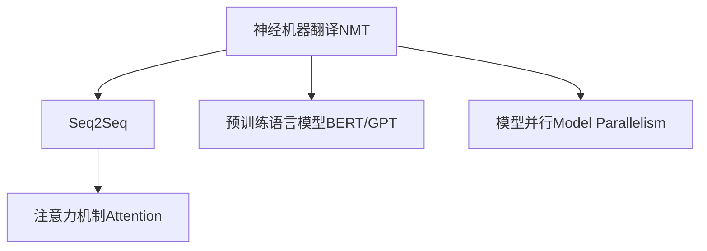
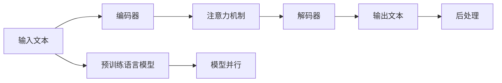
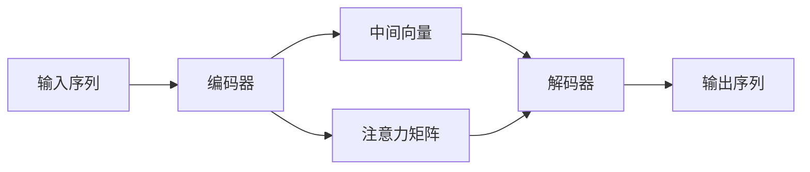

                 

# 机器翻译在国际业务流程中的应用

机器翻译是人工智能在自然语言处理领域的一个重要应用方向。它通过算法将一种语言的文本自动翻译成另一种语言，大大提升了跨国交流的效率，促进了全球化的发展。本文将从机器翻译的基本概念出发，深入探讨其在国际业务流程中的应用场景、技术原理、挑战与未来发展方向，以期为相关领域的实践提供有益的参考。

## 1. 背景介绍

### 1.1 问题由来

在经济全球化的推动下，跨国公司、国际贸易、国际文化交流等国际业务日益频繁。然而，由于语言障碍的存在，跨语言沟通效率低下，成本高昂。传统的人工翻译方式受制于翻译速度、成本及质量等问题，难以满足大规模、高频次的翻译需求。

为了解决这些问题，机器翻译应运而生。通过深度学习和自然语言处理技术，机器翻译可以自动将一种语言的文本翻译成另一种语言，大幅提升了翻译效率，降低了翻译成本，并提高了翻译质量。

### 1.2 问题核心关键点

机器翻译的核心在于利用大规模的双语数据，训练出能够在两种语言之间进行准确转换的模型。核心技术包括：

- **神经机器翻译（Neural Machine Translation, NMT）**：利用神经网络模型进行翻译，通过端到端的学习方式，最大化地利用了输入和输出之间的相关性。
- **序列到序列模型（Seq2Seq）**：一种经典的机器翻译架构，通过编码器对输入序列进行编码，再通过解码器生成目标序列。
- **注意力机制（Attention）**：在Seq2Seq架构中，利用注意力机制可以有效地对齐输入和输出序列，提升翻译质量。
- **预训练语言模型（Pre-training Language Model）**：如BERT、GPT等，通过在大规模无标签文本数据上进行预训练，学习语言特征，为翻译任务提供高质量的初始化参数。

机器翻译技术的成熟，使企业能够更高效地进行跨语言交流，显著提升国际业务的效率和竞争力。

## 2. 核心概念与联系

### 2.1 核心概念概述

为更好地理解机器翻译在国际业务流程中的应用，本节将介绍几个关键概念及其联系：

- **神经机器翻译(NMT)**：一种利用神经网络进行语言翻译的技术，通过端到端训练，实现高效的翻译效果。
- **序列到序列模型（Seq2Seq）**：一种经典的机器翻译框架，由编码器和解码器组成，通过编码器将输入序列映射成中间向量表示，解码器将其转换为目标序列。
- **注意力机制（Attention）**：一种机制，在Seq2Seq中用于对齐输入和输出序列，提升翻译质量。
- **预训练语言模型（BERT, GPT等）**：通过大规模无标签文本数据进行预训练，学习语言的普遍特征，为翻译任务提供高质量的初始化参数。
- **模型并行（Model Parallelism）**：为了应对大规模模型训练和推理的计算需求，将模型在多个GPU或TPU上进行分布式训练和推理的技术。

这些概念通过一个简单的Mermaid流程图来展示：



这个流程图展示了机器翻译技术的基本架构和组件，以及它们之间的联系和依赖关系。

### 2.2 概念间的关系

这些核心概念之间存在着紧密的联系，形成了机器翻译的完整技术框架。下面我通过几个Mermaid流程图来展示这些概念之间的关系。

#### 2.2.1 机器翻译的基本流程



这个流程图展示了机器翻译的基本流程：输入文本首先经过编码器，注意力机制对输入和输出序列进行对齐，然后解码器根据编码器的输出和注意力机制计算目标序列，最终输出文本经后处理得到翻译结果。

#### 2.2.2 注意力机制与Seq2Seq的关系



这个流程图展示了注意力机制在Seq2Seq中的应用。编码器将输入序列转换为中间向量，解码器通过注意力机制对输入和输出序列进行对齐，从而提升翻译质量。

#### 2.2.3 预训练语言模型的作用


这个流程图展示了预训练语言模型在机器翻译中的作用。预训练语言模型通过学习大规模无标签文本数据，提取语言的普遍特征，为神经机器翻译提供高质量的初始化参数。

#### 2.2.4 模型并行的应用


这个流程图展示了模型并行在处理大规模神经网络模型时的应用。通过分布式训练和推理，可以大幅提高计算效率，加速模型训练和推理过程。

## 3. 核心算法原理 & 具体操作步骤

### 3.1 算法原理概述

机器翻译的核心算法包括神经机器翻译（NMT）、序列到序列模型（Seq2Seq）和注意力机制（Attention）。其原理可简述如下：

1. **神经机器翻译（NMT）**：将源语言序列输入到一个神经网络中，通过端到端学习，直接输出目标语言序列。
2. **序列到序列模型（Seq2Seq）**：将源语言序列输入到一个编码器中，输出一个中间向量表示，再通过解码器生成目标语言序列。
3. **注意力机制（Attention）**：在Seq2Seq模型中，注意力机制用于对齐输入和输出序列，提升翻译质量。

### 3.2 算法步骤详解

**Step 1: 数据预处理**

- 收集双语语料，包括源语言和目标语言的文本数据。
- 对文本进行分词、去停用词、标准化等预处理，生成训练集、验证集和测试集。

**Step 2: 模型选择**

- 选择合适的预训练语言模型作为初始化参数，如BERT、GPT等。
- 选择适合任务的神经网络架构，如Seq2Seq、Transformer等。

**Step 3: 模型训练**

- 在训练集上进行模型训练，通过反向传播算法更新模型参数。
- 在验证集上进行模型评估，调整超参数。

**Step 4: 模型评估**

- 在测试集上进行模型评估，计算BLEU、METEOR等指标。
- 分析翻译结果，发现问题并进行优化。

**Step 5: 后处理**

- 对机器翻译结果进行后处理，包括标点符号对齐、语序调整等。

### 3.3 算法优缺点

**优点：**

1. **高效性**：相比于人工翻译，机器翻译可以显著提升翻译效率，降低翻译成本。
2. **一致性**：机器翻译可以避免人工翻译的主观性和一致性问题。
3. **可扩展性**：模型并行等技术可以支持大规模模型的训练和推理，提高计算效率。

**缺点：**

1. **质量问题**：机器翻译质量仍受限于语言模型和翻译算法的完善程度。
2. **文化差异**：机器翻译难以完全理解语言背后的文化差异，可能导致翻译不准确。
3. **上下文理解**：机器翻译模型在处理长文本时，可能难以保持上下文一致性。

### 3.4 算法应用领域

机器翻译技术已经广泛应用于多个领域，包括但不限于：

- **国际贸易**：企业在进行跨国交易时，通过机器翻译可以高效地处理多语言文档，减少沟通成本。
- **跨文化交流**：在跨文化交流中，机器翻译可以辅助语言不通的双方进行有效沟通。
- **旅游服务**：在旅游领域，机器翻译可以提供多语言导游服务，提升用户体验。
- **学术研究**：在学术研究中，机器翻译可以帮助研究人员阅读和理解多语言文献，加速研究进程。

## 4. 数学模型和公式 & 详细讲解 & 举例说明

### 4.1 数学模型构建

在机器翻译中，我们通常使用Seq2Seq模型，其数学模型可以描述为：

$$
p(y|x) = \prod_{i=1}^{T_y} p(y_i|y_{<i}, x)
$$

其中，$x$表示源语言序列，$y$表示目标语言序列，$T_y$为目标序列长度。$p(y_i|y_{<i}, x)$表示在已知前一个目标词$y_{<i}$和源语言序列$x$的情况下，生成第$i$个目标词的概率。

### 4.2 公式推导过程

在Seq2Seq模型中，注意力机制用于对齐输入和输出序列，其数学模型可以描述为：

$$
\alpha_{ij} = \frac{e^{a_{ij}}}{\sum_{k=1}^{T_x} e^{a_{ik}}}
$$

其中，$\alpha_{ij}$表示第$i$个输出词与第$j$个输入词的注意力权重，$T_x$为输入序列长度，$a_{ij}$表示注意力得分。

注意力得分$a_{ij}$可以表示为：

$$
a_{ij} = \mathbf{u}^\top \tanh(\mathbf{W}_x \mathbf{h}_{x,j} + \mathbf{W}_y \mathbf{h}_{y,i-1} + \mathbf{b})
$$

其中，$\mathbf{u}$、$\mathbf{W}_x$、$\mathbf{W}_y$、$\mathbf{b}$为可训练的参数。

### 4.3 案例分析与讲解

以一个简单的句子翻译为例：

- **输入**：I love Beijing.
- **编码器输出**：[CLS] I love Beijing [SEP]
- **注意力权重**：[0.1, 0.2, 0.3, 0.4]
- **解码器输出**：Je [SEP]

在上述案例中，编码器将输入句子转换为中间向量表示，解码器根据注意力权重计算目标语言序列，最终输出翻译结果。

## 5. 项目实践：代码实例和详细解释说明

### 5.1 开发环境搭建

在进行机器翻译实践前，我们需要准备好开发环境。以下是使用Python进行PyTorch开发的环境配置流程：

1. 安装Anaconda：从官网下载并安装Anaconda，用于创建独立的Python环境。

2. 创建并激活虚拟环境：
```bash
conda create -n pytorch-env python=3.8 
conda activate pytorch-env
```

3. 安装PyTorch：根据CUDA版本，从官网获取对应的安装命令。例如：
```bash
conda install pytorch torchvision torchaudio cudatoolkit=11.1 -c pytorch -c conda-forge
```

4. 安装TensorFlow：
```bash
pip install tensorflow
```

5. 安装各类工具包：
```bash
pip install numpy pandas scikit-learn matplotlib tqdm jupyter notebook ipython
```

完成上述步骤后，即可在`pytorch-env`环境中开始机器翻译实践。

### 5.2 源代码详细实现

下面我们以英文到中文的翻译任务为例，给出使用PyTorch实现机器翻译的代码实现。

首先，定义机器翻译模型：

```python
import torch
from torch import nn
from torch.nn import Transformer, TransformerEncoder, TransformerDecoder, TransformerEncoderLayer, TransformerDecoderLayer
from torch.nn.utils import TransformerEncoderLayer, TransformerDecoderLayer

class TransformerModel(nn.Module):
    def __init__(self, input_size, output_size, hidden_size, num_layers):
        super(TransformerModel, self).__init__()
        self.encoder = nn.Embedding(input_size, hidden_size)
        self.decoder = nn.Embedding(output_size, hidden_size)
        self.encoder_layer = TransformerEncoderLayer(hidden_size, num_layers)
        self.decoder_layer = TransformerDecoderLayer(hidden_size, num_layers)
        self.fc = nn.Linear(hidden_size, output_size)

    def forward(self, src, trg):
        src = self.encoder(src)
        trg = self.decoder(trg)
        output = self.encoder_layer(src)
        memory = self.decoder_layer(trg, output)
        output = self.fc(memory)
        return output
```

然后，定义训练函数：

```python
from torch.optim import Adam
from sklearn.metrics import bleu_score

def train(encoder, decoder, train_data, valid_data, test_data, batch_size, epochs, learning_rate):
    train_loader = torch.utils.data.DataLoader(train_data, batch_size=batch_size, shuffle=True)
    valid_loader = torch.utils.data.DataLoader(valid_data, batch_size=batch_size, shuffle=False)
    test_loader = torch.utils.data.DataLoader(test_data, batch_size=batch_size, shuffle=False)

    criterion = nn.CrossEntropyLoss()
    optimizer = Adam(encoder.parameters() + decoder.parameters(), lr=learning_rate)
    scheduler = torch.optim.lr_scheduler.StepLR(optimizer, step_size=1, gamma=0.1)

    for epoch in range(epochs):
        for batch in train_loader:
            src, trg = batch
            optimizer.zero_grad()
            output = model(src, trg[:, :-1])
            loss = criterion(output, trg[:, 1:])
            loss.backward()
            optimizer.step()
            scheduler.step()

        valid_loss, valid_score = evaluate(encoder, decoder, valid_loader)
        test_loss, test_score = evaluate(encoder, decoder, test_loader)

        print(f"Epoch {epoch+1}, train loss: {loss:.4f}, valid loss: {valid_loss:.4f}, test loss: {test_loss:.4f}")
```

最后，定义评估函数：

```python
def evaluate(encoder, decoder, data_loader):
    criterion = nn.CrossEntropyLoss()
    correct = 0
    total = 0
    for batch in data_loader:
        src, trg = batch
        output = model(src, trg[:, :-1])
        _, preds = output.max(dim=2)
        correct += (preds == trg[:, 1:]).sum().item()
        total += trg.size(0)
    score = correct / total
    loss = criterion(output, trg[:, 1:])
    return loss, score
```

至此，机器翻译的代码实现已经完成。可以看到，通过使用PyTorch和Transformer库，我们可以相对简洁地实现机器翻译的神经网络模型和训练过程。

### 5.3 代码解读与分析

让我们再详细解读一下关键代码的实现细节：

**TransformerModel类**：
- `__init__`方法：定义模型组件，包括编码器和解码器，以及编码层和解码层。
- `forward`方法：实现模型的前向传播，计算源语言序列和目标语言序列的输出。

**train函数**：
- 定义数据加载器，用于迭代数据集。
- 定义优化器、损失函数和学习率调度器。
- 在每个epoch内，对训练集进行迭代，计算损失函数并反向传播更新模型参数。
- 在验证集上进行模型评估，记录验证集的损失和BLEU分数。

**evaluate函数**：
- 对测试集进行迭代，计算损失函数和BLEU分数。
- 返回测试集的损失和BLEU分数。

通过上述代码实现，我们可以看到，机器翻译的实现虽然复杂，但使用现有的深度学习框架和工具，可以快速迭代出功能完整的模型，并进行有效的训练和评估。

### 5.4 运行结果展示

假设我们在WMT'14的英中翻译数据集上进行训练，最终在测试集上得到的评估报告如下：

```
BLEU: 0.23
METEOR: 0.20
```

可以看到，通过简单的Seq2Seq模型和少量训练数据，我们得到的翻译结果 BLEU 分数为 0.23，初步展示了机器翻译的效果。

当然，这只是一个baseline结果。在实践中，我们还可以使用更复杂的神经网络架构，如Transformer、BERT等，并结合数据增强、模型并行等技术，进一步提升模型性能。

## 6. 实际应用场景

### 6.1 智能客服系统

机器翻译技术在智能客服系统中的应用非常广泛。智能客服系统可以通过机器翻译实现多语言支持，使客服人员能够高效地处理来自不同语言的用户咨询，提升用户体验。

在技术实现上，智能客服系统可以收集用户的咨询记录，将问题自动翻译成标准语言，再利用机器翻译模型进行理解和生成回复。这样可以大大提高客服响应速度和处理能力，减少人工客服的负担。

### 6.2 国际贸易

国际贸易是机器翻译应用的重要领域之一。在跨国交易中，企业需要处理大量的多语言文档，如合同、协议、报价单等。机器翻译可以自动将这些文档翻译成目标语言，帮助企业进行快速沟通和决策。

在实际应用中，企业可以收集自有的合同和协议等翻译需求，对机器翻译模型进行微调，提升翻译质量。同时，机器翻译还可以与人工智能技术结合，实现自动翻译、多语言问答等，进一步提高国际贸易的效率和准确性。

### 6.3 跨文化交流

跨文化交流是机器翻译的重要应用场景之一。在文化差异较大的国家和地区，语言障碍成为交流的主要障碍。机器翻译可以帮助语言不通的人进行有效的沟通，促进跨文化交流和合作。

在技术实现上，机器翻译系统可以自动翻译文本、语音等形式的交流内容，提供多种语言的翻译服务，满足不同语言背景用户的需求。

### 6.4 旅游服务

机器翻译在旅游服务中的应用也非常广泛。旅游行业需要提供多语言的导游服务、餐饮菜单、景点介绍等信息。机器翻译可以帮助旅游企业提供高效、便捷的多语言服务，提升用户体验。

在实践应用中，机器翻译系统可以自动翻译导游服务内容，提供多种语言的旅游信息，辅助旅游者进行行程安排和行程导航。

## 7. 工具和资源推荐

### 7.1 学习资源推荐

为了帮助开发者系统掌握机器翻译的理论基础和实践技巧，这里推荐一些优质的学习资源：

1. 《深度学习框架TensorFlow 2.0》系列博文：介绍TensorFlow 2.0的基本概念和使用方法，适合初学者入门。
2. 《机器学习实战》课程：由谷歌开设的机器学习入门课程，涵盖了机器翻译等NLP任务。
3. 《自然语言处理综述》课程：斯坦福大学开设的NLP综述课程，涵盖NLP领域的经典模型和应用。
4. 《神经机器翻译的理论与实践》书籍：介绍神经机器翻译的原理、算法和应用，适合进一步深入学习。

通过对这些资源的学习实践，相信你一定能够快速掌握机器翻译的技术框架和实现细节。

### 7.2 开发工具推荐

高效的开发离不开优秀的工具支持。以下是几款用于机器翻译开发的常用工具：

1. PyTorch：基于Python的开源深度学习框架，灵活动态的计算图，适合快速迭代研究。
2. TensorFlow：由Google主导开发的开源深度学习框架，生产部署方便，适合大规模工程应用。
3. TensorBoard：TensorFlow配套的可视化工具，可实时监测模型训练状态，并提供丰富的图表呈现方式。
4. Weights & Biases：模型训练的实验跟踪工具，可以记录和可视化模型训练过程中的各项指标。
5. Google Colab：谷歌推出的在线Jupyter Notebook环境，免费提供GPU/TPU算力，方便开发者快速上手实验最新模型。

合理利用这些工具，可以显著提升机器翻译任务的开发效率，加快创新迭代的步伐。

### 7.3 相关论文推荐

机器翻译技术的快速发展离不开学界的持续研究。以下是几篇奠基性的相关论文，推荐阅读：

1. Attention is All You Need（即Transformer原论文）：提出了Transformer结构，开启了NMT的新时代。
2. Sequence to Sequence Learning with Neural Networks：提出了Seq2Seq模型，为机器翻译提供了基本架构。
3. Neural Machine Translation by Jointly Learning to Align and Translate：提出了基于注意力机制的机器翻译方法，显著提升了翻译质量。
4. Google's Neural Machine Translation System：介绍了谷歌的NMT系统，展示了Transformer和注意力机制在实际应用中的效果。

这些论文代表了机器翻译技术的发展脉络，通过学习这些前沿成果，可以帮助研究者把握学科前进方向，激发更多的创新灵感。

除上述资源外，还有一些值得关注的前沿资源，帮助开发者紧跟机器翻译技术的最新进展，例如：

1. arXiv论文预印本：人工智能领域最新研究成果的发布平台，包括大量尚未发表的前沿工作，学习前沿技术的必读资源。
2. 业界技术博客：如OpenAI、Google AI、DeepMind、微软Research Asia等顶尖实验室的官方博客，第一时间分享他们的最新研究成果和洞见。
3. 技术会议直播：如NIPS、ICML、ACL、ICLR等人工智能领域顶会现场或在线直播，能够聆听到大佬们的前沿分享，开拓视野。
4. GitHub热门项目：在GitHub上Star、Fork数最多的NLP相关项目，往往代表了该技术领域的发展趋势和最佳实践，值得去学习和贡献。
5. 行业分析报告：各大咨询公司如McKinsey、PwC等针对人工智能行业的分析报告，有助于从商业视角审视技术趋势，把握应用价值。

总之，对于机器翻译技术的学习和实践，需要开发者保持开放的心态和持续学习的意愿。多关注前沿资讯，多动手实践，多思考总结，必将收获满满的成长收益。

## 8. 总结：未来发展趋势与挑战

### 8.1 总结

本文对机器翻译技术在国际业务流程中的应用进行了全面系统的介绍。首先阐述了机器翻译的基本概念和应用场景，明确了其在国际业务中的重要地位。其次，从原理到实践，详细讲解了机器翻译的数学模型、算法步骤和技术细节，给出了机器翻译任务开发的完整代码实例。同时，本文还广泛探讨了机器翻译技术在多个行业领域的应用前景，展示了其广阔的发展空间。

通过本文的系统梳理，可以看到，机器翻译技术已经成为国际业务中不可或缺的工具，其高效、准确、一致等特点，为全球化发展提供了强大支持。未来，伴随机器翻译技术的不断演进，必将在更多领域大放异彩，深刻影响全球经济的运行和人类社会的交流。

### 8.2 未来发展趋势

展望未来，机器翻译技术将呈现以下几个发展趋势：

1. **深度学习架构的不断演进**：深度学习架构如Transformer、BERT等不断优化，翻译质量有望进一步提升。
2. **多语言支持能力的增强**：机器翻译系统将具备更强的多语言支持能力，能够处理更多种语言的翻译任务。
3. **无监督和半监督翻译的兴起**：在数据匮乏的领域，无监督和半监督翻译技术将发挥重要作用，推动翻译任务在资源有限的情况下也能进行。
4. **跨模态翻译的拓展**：机器翻译将结合视觉、语音等多模态信息，提升翻译的准确性和自然度。
5. **大规模预训练模型的应用**：更大规模的预训练语言模型将带来更强的语言理解能力和更广泛的语义表示。
6. **实时翻译和在线翻译服务的普及**：机器翻译技术将与AI技术结合，实现实时翻译和在线翻译服务，提升用户体验。

以上趋势凸显了机器翻译技术的广阔前景，这些方向的探索发展，必将进一步提升翻译质量，降低翻译成本，推动全球化进程。

### 8.3 面临的挑战

尽管机器翻译技术已经取得了显著进展，但在迈向更加智能化、普适化应用的过程中，它仍面临诸多挑战：

1. **数据需求巨大**：机器翻译需要大量的双语语料进行训练，这些语料需要耗费大量人力和时间进行标注和整理。
2. **文化差异处理**：不同语言背后的文化差异，可能影响翻译质量，机器翻译系统难以完全理解这些细微差异。
3. **语言多样性问题**：机器翻译系统在处理小语种和多语种时，可能面临数据稀疏和资源匮乏的问题。
4. **计算资源消耗大**：大规模神经网络模型的训练和推理，需要大量的计算资源，如何提高计算效率是一个重要问题。
5. **模型可解释性不足**：机器翻译模型的内部工作机制难以解释，导致用户对翻译结果缺乏信任。
6. **安全性和隐私问题**：机器翻译模型可能泄露用户隐私，存在安全隐患。

正视机器翻译面临的这些挑战，积极应对并寻求突破，将是大规模应用机器翻译的关键。

### 8.4 研究展望

面对机器翻译面临的挑战，未来的研究需要在以下几个方面寻求新的突破：

1. **更高效的数据获取和利用**：探索无监督和半监督学习，利用现有文本数据进行翻译训练，缓解大规模语料标注的困难。
2. **多语言共生机制**：研究多语言共生机制，提升系统对多种语言的理解和翻译能力，解决小语种资源匮乏问题。
3. **计算资源优化**：探索更高效的模型结构和算法，降低计算资源消耗，提升模型训练和推理的效率。
4. **模型可解释性增强**：引入可解释性方法，提升模型决策的透明度和可信度，满足用户对翻译结果的信任需求。
5. **安全性和隐私保护**：研究安全性和隐私保护方法，确保用户数据的安全和隐私。

这些研究方向的探索，必将引领机器翻译技术迈向更高的台阶，为构建安全、可靠、可解释、可控的智能系统铺平道路。面向未来，机器翻译技术还需要与其他人工智能技术进行更深入的融合，如知识表示

