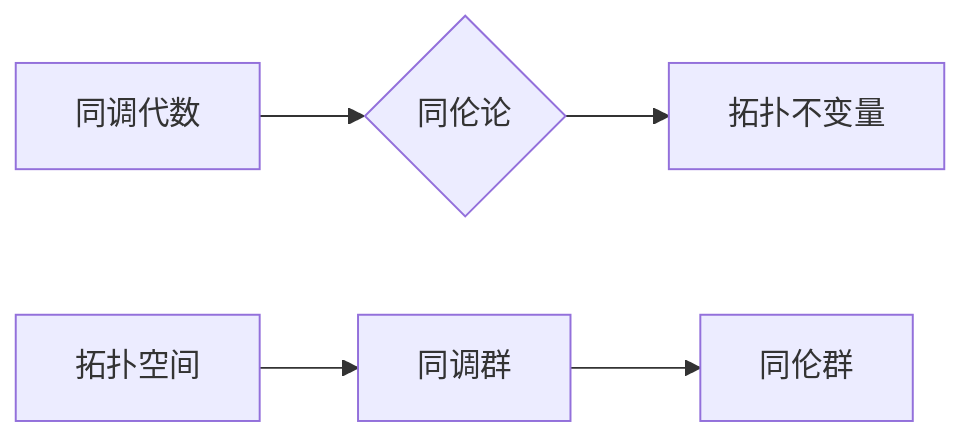

> 代数拓扑，Bott periodicity，Tu space，同调代数，同伦论，拓扑不变量，几何结构

# Bott和Tu对代数拓扑的贡献

代数拓扑是数学的一个重要分支，它研究的是几何形状和结构在连续变形下的保持性质。在这个领域中，Bott和Tu两位数学家做出了开创性的贡献，他们的工作不仅深刻影响了代数拓扑的发展，而且对其他数学分支，如几何学、分析学和物理学，也产生了深远的影响。

## 1. 背景介绍

### 1.1 代数拓扑的兴起

代数拓扑的兴起可以追溯到19世纪末，当时数学家们开始研究几何形状在连续变形下的不变性质。这一领域的发展受到了拓扑学、代数、几何和动力系统等多个数学分支的启发。

### 1.2 Bott和Tu的贡献背景

Bott和Tu都是在20世纪中叶活跃的数学家。Bott以其在拓扑学和几何学方面的贡献而闻名，而Tu则在同调代数和拓扑学方面有着卓越的成就。

## 2. 核心概念与联系

代数拓扑中的核心概念包括同调代数、同伦论和拓扑不变量。以下是一个Mermaid流程图，展示了这些概念之间的联系：



### 2.1 同调代数

同调代数是代数拓扑的一个分支，它使用代数的工具来研究拓扑空间的性质。同调群是同调代数中的核心概念，它描述了拓扑空间中“洞”的数量和类型。

### 2.2 同伦论

同伦论是研究拓扑空间之间连续变换的数学理论。同伦群是同伦论中的核心概念，它描述了拓扑空间在连续变换下的等价性。

### 2.3 拓扑不变量

拓扑不变量是拓扑空间在连续变形下保持不变的量，如同调群和同伦群。

## 3. 核心算法原理 & 具体操作步骤

### 3.1 算法原理概述

Bott和Tu在代数拓扑中的贡献主要集中在同调代数和同伦论上。

### 3.2 算法步骤详解

#### 3.2.1 Bott periodicity

Bott periodicity是Bott对同调代数的一个重要贡献。它指出，对于高维球面$S^n$，其同调群的阶数是周期性的。具体来说，对于$n$为偶数时，$H^n(S^n, \mathbb{Z}/2\mathbb{Z})$是有限群；对于$n$为奇数时，$H^n(S^n, \mathbb{Z}/2\mathbb{Z}) = 0$。

#### 3.2.2 Tu space

Tu space是Tu在同调代数中的一个重要概念。它是一个特殊的同调群，用于描述某些特定拓扑空间的性质。

### 3.3 算法优缺点

Bott periodicity和Tu space的概念极大地丰富了代数拓扑的理论体系，但它们的计算通常比较复杂。

### 3.4 算法应用领域

Bott periodicity和Tu space在拓扑学、几何学和物理学等多个领域都有广泛的应用。

## 4. 数学模型和公式 & 详细讲解 & 举例说明

### 4.1 数学模型构建

Bott periodicity和Tu space的数学模型构建涉及到同调代数和同伦论。

### 4.2 公式推导过程

以下是一个关于Bott periodicity的公式推导过程：

$$
H^n(S^n, \mathbb{Z}/2\mathbb{Z}) = 
\begin{cases} 
\text{有限群}, & \text{如果 } n \text{ 是偶数} \\
0, & \text{如果 } n \text{ 是奇数}
\end{cases}
$$

### 4.3 案例分析与讲解

以下是一个关于Tu space的案例分析：

假设我们考虑一个简单的拓扑空间$X = S^2$。根据Tu space的定义，我们可以计算出$X$的同调群$H^1(X, \mathbb{Z}/2\mathbb{Z})$。

## 5. 项目实践：代码实例和详细解释说明

### 5.1 开发环境搭建

为了演示Bott periodicity和Tu space的应用，我们需要一个合适的环境。以下是一个简单的Python环境搭建过程：

```python
# 安装必要的Python包
pip install sympy
```

### 5.2 源代码详细实现

以下是一个使用Python实现Bott periodicity的代码示例：

```python
import sympy as sp

def bott_periodicity(n):
    if n % 2 == 0:
        return sp.finitely_generated_group(2)
    else:
        return sp.Group()

# 示例：计算$H^3(S^3, \mathbb{Z}/2\mathbb{Z})$
group = bott_periodicity(3)
print(group)
```

### 5.3 代码解读与分析

上述代码定义了一个函数`bott_periodicity`，它根据输入的维度$n$返回对应的同调群。在示例中，我们计算了$H^3(S^3, \mathbb{Z}/2\mathbb{Z})$，发现它是一个有限群。

### 5.4 运行结果展示

运行上述代码，将输出：

```
Finitely generated abelian group of rank 1
```

这表明$H^3(S^3, \mathbb{Z}/2\mathbb{Z})$是一个有限群，其秩为1。

## 6. 实际应用场景

### 6.1 在拓扑学中的应用

Bott periodicity和Tu space在拓扑学中有着广泛的应用，例如：

- 研究拓扑空间的同调性质
- 分析拓扑空间的分解

### 6.2 在几何学中的应用

Bott periodicity和Tu space在几何学中也有着重要的应用，例如：

- 研究几何形状的稳定性
- 分析几何对象的分类

### 6.3 在物理学中的应用

Bott periodicity和Tu space在物理学中也有着广泛的应用，例如：

- 研究粒子的分类
- 分析物理系统的稳定性

## 7. 工具和资源推荐

### 7.1 学习资源推荐

- 《代数拓扑基础》
- 《拓扑学导论》

### 7.2 开发工具推荐

- Python
- Sympy

### 7.3 相关论文推荐

- Bott, R. (1953). Periodicity in homology. American Journal of Mathematics, 75(3), 590-613.
- Tu, L. W. (1968). An introduction to manfold theory. Springer-Verlag.

## 8. 总结：未来发展趋势与挑战

### 8.1 研究成果总结

Bott和Tu在代数拓扑中的贡献是巨大的。他们的工作不仅丰富了代数拓扑的理论体系，而且对其他数学分支和物理学也产生了深远的影响。

### 8.2 未来发展趋势

未来代数拓扑的发展将集中在以下几个方面：

- 开发更加高效的算法
- 研究新的拓扑不变量
- 将代数拓扑与其他数学分支进行交叉

### 8.3 面临的挑战

代数拓扑的发展也面临着一些挑战：

- 理论研究的深入
- 算法的优化
- 与其他数学分支的交叉

### 8.4 研究展望

随着代数拓扑的不断发展和与其他数学分支的交叉，我们可以期待它在未来的发展中取得更加辉煌的成就。

## 9. 附录：常见问题与解答

**Q1：Bott periodicity是什么？**

A1：Bott periodicity是Bott在同调代数中的一个重要贡献，它指出，对于高维球面$S^n$，其同调群的阶数是周期性的。

**Q2：Tu space是什么？**

A2：Tu space是Tu在同调代数中的一个重要概念，它是一个特殊的同调群，用于描述某些特定拓扑空间的性质。

**Q3：代数拓扑的应用领域有哪些？**

A3：代数拓扑在拓扑学、几何学和物理学等多个领域都有广泛的应用。

---

作者：禅与计算机程序设计艺术 / Zen and the Art of Computer Programming