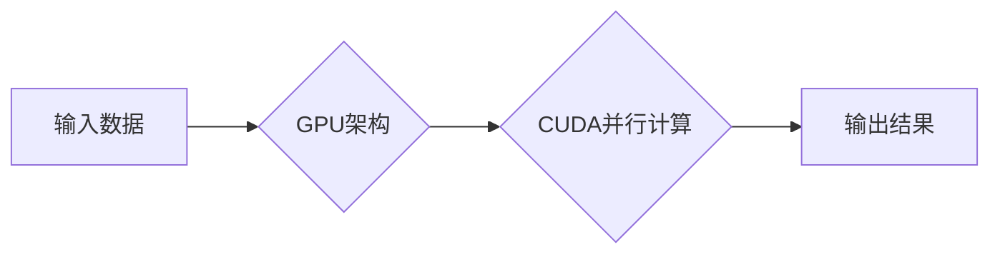

# NVIDIA的GPU革命与AI算力提升

> 关键词：NVIDIA GPU, AI算力, 深度学习, 图形处理单元, CUDA, Tensor Core, AI加速器, GPU架构, 算力竞赛

## 1. 背景介绍

随着人工智能技术的快速发展，深度学习成为推动AI进步的核心动力。而深度学习算法对计算资源的需求也日益增长，尤其是对并行计算能力的需求。传统的CPU在处理大量并行计算任务时效率低下，难以满足深度学习模型的计算需求。在这种情况下，NVIDIA的GPU（图形处理单元）凭借其强大的并行处理能力，成为了AI计算的主流平台。

### 1.1 问题的由来

深度学习模型，尤其是卷积神经网络（CNN）、循环神经网络（RNN）和Transformer等模型，需要大量矩阵运算和向量运算。这些运算在传统的CPU上执行效率较低，导致训练和推理速度缓慢。此外，深度学习模型的训练数据量巨大，需要长时间的计算资源。

### 1.2 研究现状

为了满足深度学习对计算资源的需求，NVIDIA推出了多代GPU产品，如GTX、Tesla、Quadro和Tegra系列。这些GPU产品采用先进的架构和工艺，提供了强大的并行计算能力，极大地推动了深度学习技术的发展。

### 1.3 研究意义

NVIDIA的GPU革命对AI算力的提升具有重要意义：

1. 提高深度学习模型的训练和推理速度，缩短研发周期。
2. 降低AI应用的开发成本，加速AI技术的产业化进程。
3. 推动AI技术在各个领域的应用，如医疗、金融、教育等。
4. 促进AI技术的创新和发展，为人类创造更多价值。

### 1.4 本文结构

本文将从以下几个方面介绍NVIDIA的GPU革命与AI算力提升：

- 介绍NVIDIA GPU的核心概念和架构。
- 分析NVIDIA GPU在深度学习中的应用。
- 讨论NVIDIA GPU的未来发展趋势和挑战。
- 推荐相关学习资源和开发工具。

## 2. 核心概念与联系

### 2.1 核心概念

#### 2.1.1 深度学习

深度学习是一种模拟人脑神经网络结构和学习机制的计算模型，通过多层神经网络对数据进行分析和学习，实现图像识别、语音识别、自然语言处理等任务。

#### 2.1.2 图形处理单元（GPU）

GPU是一种高度并行的计算设备，最初用于图形渲染，后来逐渐应用于科学计算和深度学习等领域。

#### 2.1.3 CUDA

CUDA是NVIDIA推出的并行计算平台和编程模型，允许开发者利用GPU的并行计算能力进行科学计算和深度学习等应用。

#### 2.1.4 Tensor Core

Tensor Core是NVIDIA新一代GPU架构，具有更高的计算能力和能效比，适用于深度学习和其他高性能计算任务。

### 2.2 架构流程图



### 2.3 联系

NVIDIA的GPU革命通过CUDA平台和Tensor Core架构，实现了深度学习任务的并行计算，从而提升了AI算力。

## 3. 核心算法原理 & 具体操作步骤

### 3.1 算法原理概述

NVIDIA的GPU革命主要基于以下原理：

1. **并行计算**：GPU具有成千上万的并行处理核心，可以同时执行大量计算任务。
2. **CUDA编程模型**：CUDA提供了编程接口，允许开发者利用GPU的并行计算能力进行深度学习等应用。
3. **Tensor Core架构**：Tensor Core架构具有更高的计算能力和能效比，适用于深度学习和其他高性能计算任务。

### 3.2 算法步骤详解

1. **数据加载**：将深度学习模型的输入数据加载到GPU内存中。
2. **模型加载**：将深度学习模型加载到GPU上。
3. **前向传播**：在GPU上执行前向传播计算，计算模型的输出结果。
4. **反向传播**：在GPU上执行反向传播计算，更新模型参数。
5. **模型优化**：根据训练数据对模型进行优化，提高模型性能。

### 3.3 算法优缺点

#### 3.3.1 优点

1. **计算速度**：GPU具有更高的并行计算能力，可以显著提高深度学习模型的训练和推理速度。
2. **能效比**：GPU的能效比较高，可以在较低功耗下提供更高的计算性能。
3. **开发方便**：CUDA提供了丰富的编程接口，方便开发者利用GPU进行深度学习等应用开发。

#### 3.3.2 缺点

1. **编程复杂**：CUDA编程相对复杂，需要开发者具备一定的编程技巧。
2. **成本较高**：高性能GPU的价格相对较高，可能会增加开发成本。
3. **软件兼容性**：部分深度学习框架可能对GPU支持有限，需要开发者进行适配。

### 3.4 算法应用领域

NVIDIA的GPU革命在以下领域得到了广泛应用：

1. **深度学习**：图像识别、语音识别、自然语言处理、推荐系统等。
2. **科学计算**：天气预报、药物发现、材料科学等。
3. **图形渲染**：游戏开发、虚拟现实等。

## 4. 数学模型和公式 & 详细讲解 & 举例说明

### 4.1 数学模型构建

深度学习模型通常包含多个数学模型，如卷积神经网络、循环神经网络和Transformer等。

### 4.2 公式推导过程

以卷积神经网络为例，其公式推导过程如下：

$$
h^{(l)} = \sigma(W^{(l)}h^{(l-1)} + b^{(l)}) 
$$

其中，$h^{(l)}$ 表示第 $l$ 层的输出，$W^{(l)}$ 表示第 $l$ 层的权重，$b^{(l)}$ 表示第 $l$ 层的偏置，$\sigma$ 表示激活函数。

### 4.3 案例分析与讲解

以CIFAR-10图像识别任务为例，使用PyTorch框架进行卷积神经网络的训练。

```python
import torch
import torch.nn as nn
import torch.optim as optim

# 创建卷积神经网络模型
class ConvNet(nn.Module):
    def __init__(self):
        super(ConvNet, self).__init__()
        self.conv1 = nn.Conv2d(3, 32, 3, padding=1)
        self.conv2 = nn.Conv2d(32, 64, 3, padding=1)
        self.fc1 = nn.Linear(64 * 6 * 6, 128)
        self.fc2 = nn.Linear(128, 10)
        self.relu = nn.ReLU()

    def forward(self, x):
        x = self.relu(self.conv1(x))
        x = self.relu(self.conv2(x))
        x = x.view(-1, 64 * 6 * 6)
        x = self.relu(self.fc1(x))
        x = self.fc2(x)
        return x

# 加载数据集
train_dataset = ...
train_loader = ...
test_dataset = ...
test_loader = ...

# 创建模型和优化器
model = ConvNet()
optimizer = optim.Adam(model.parameters(), lr=0.001)

# 训练模型
for epoch in range(10):
    for data, target in train_loader:
        optimizer.zero_grad()
        output = model(data)
        loss = nn.CrossEntropyLoss()(output, target)
        loss.backward()
        optimizer.step()

# 测试模型
correct = 0
total = 0
with torch.no_grad():
    for data, target in test_loader:
        output = model(data)
        _, predicted = torch.max(output.data, 1)
        total += target.size(0)
        correct += (predicted == target).sum().item()

print('Test Accuracy of the model on the 10000 test images: {} %'.format(100 * correct / total))
```

## 5. 项目实践：代码实例和详细解释说明

### 5.1 开发环境搭建

1. 安装Python环境
2. 安装PyTorch框架
3. 安装CUDA Toolkit
4. 下载CIFAR-10数据集

### 5.2 源代码详细实现

上述代码实例展示了使用PyTorch框架在GPU上训练卷积神经网络模型的过程。

### 5.3 代码解读与分析

1. `ConvNet`类定义了卷积神经网络模型，包含两个卷积层、两个全连接层和一个ReLU激活函数。
2. `forward`方法定义了模型的正向传播过程，将输入数据通过卷积层、全连接层和激活函数处理后输出结果。
3. 使用`nn.CrossEntropyLoss`损失函数计算模型输出与真实标签之间的交叉熵损失。
4. 使用`optimizer.zero_grad()`将梯度清零，使用`loss.backward()`计算梯度，使用`optimizer.step()`更新模型参数。

### 5.4 运行结果展示

运行上述代码，输出测试集上的准确率。

## 6. 实际应用场景

NVIDIA的GPU革命在以下领域得到了广泛应用：

1. **深度学习**：图像识别、语音识别、自然语言处理、推荐系统等。
2. **科学计算**：天气预报、药物发现、材料科学等。
3. **图形渲染**：游戏开发、虚拟现实等。

## 7. 工具和资源推荐

### 7.1 学习资源推荐

1. 《深度学习》
2. 《PyTorch深度学习实战》
3. NVIDIA官方文档

### 7.2 开发工具推荐

1. NVIDIA CUDA Toolkit
2. PyTorch
3. TensorFlow

### 7.3 相关论文推荐

1. Krizhevsky, A., Sutskever, I., & Hinton, G. E. (2012). ImageNet classification with deep convolutional neural networks. In Advances in neural information processing systems (pp. 1097-1105).
2. Hochreiter, S., & Schmidhuber, J. (1997). Long short-term memory. Neural computation, 9(8), 1735-1780.

## 8. 总结：未来发展趋势与挑战

### 8.1 研究成果总结

NVIDIA的GPU革命为AI算力提升做出了巨大贡献，推动了深度学习技术的发展和应用。

### 8.2 未来发展趋势

1. **异构计算**：结合CPU、GPU、FPGA等多种计算设备，实现更高效的计算。
2. **量子计算**：探索量子计算在AI领域的应用，实现更强大的计算能力。
3. **边缘计算**：将计算能力部署在边缘设备，实现实时、低延迟的计算。

### 8.3 面临的挑战

1. **能耗**：提高计算能力的同时，降低能耗。
2. **编程模型**：简化编程模型，降低开发门槛。
3. **安全性**：确保计算过程的安全性。

### 8.4 研究展望

NVIDIA的GPU革命将继续推动AI算力的提升，为人类创造更多价值。

## 9. 附录：常见问题与解答

**Q1：GPU比CPU更适合深度学习的原因是什么？**

A：GPU具有成千上万的并行处理核心，可以同时执行大量计算任务，而CPU的并行处理能力相对较弱。这使得GPU在深度学习等需要大量并行计算的领域中具有显著优势。

**Q2：如何选择合适的GPU？**

A：选择合适的GPU需要考虑以下因素：

1. **计算能力**：根据任务需求选择计算能力更强的GPU。
2. **内存容量**：根据模型大小选择内存容量更大的GPU。
3. **功耗**：根据实际部署环境选择功耗更低的GPU。

**Q3：如何使用CUDA进行编程？**

A：使用CUDA进行编程需要学习CUDA编程模型和相关编程技巧。NVIDIA官方文档提供了丰富的学习资源，可以帮助开发者快速掌握CUDA编程。

**Q4：如何将模型部署到GPU上？**

A：将模型部署到GPU上需要使用支持GPU的深度学习框架，如PyTorch和TensorFlow。这些框架提供了简单的API，可以帮助开发者轻松地将模型迁移到GPU上。

作者：禅与计算机程序设计艺术 / Zen and the Art of Computer Programming