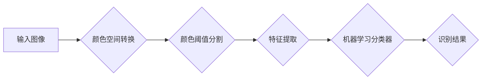

# OpenCV基于颜色的目标识别

> 关键词：OpenCV，颜色识别，目标检测，图像处理，机器学习，阈值分割，特征匹配

## 1. 背景介绍

随着计算机视觉技术的不断发展，目标识别在工业检测、无人驾驶、安防监控等领域扮演着越来越重要的角色。OpenCV是一个功能强大的计算机视觉库，它提供了丰富的图像处理和机器学习算法，可以帮助我们实现基于颜色的目标识别。本文将深入探讨OpenCV在颜色识别领域的应用，包括基本概念、核心算法、项目实践以及实际应用场景。

### 1.1 问题的由来

在现实世界中，颜色是区分物体的重要特征之一。基于颜色的目标识别，就是通过识别物体的颜色特征，实现对特定目标的定位和检测。这种方法在场景简单、物体颜色特征明显的情况下，具有快速、准确、鲁棒等优点。

### 1.2 研究现状

基于颜色的目标识别主要依赖于图像处理和机器学习技术。图像处理技术用于提取图像中的颜色信息，而机器学习技术则用于分类和识别目标。

### 1.3 研究意义

基于颜色的目标识别具有以下研究意义：

- **简单易行**：相较于其他目标识别方法，基于颜色的方法更简单易行，易于实现。
- **速度快**：颜色识别通常只需要对图像进行简单的处理，速度快，适用于实时场景。
- **鲁棒性强**：颜色特征对光照、角度等因素的敏感性较低，具有较强的鲁棒性。

## 2. 核心概念与联系

### 2.1 Mermaid 流程图



### 2.2 核心概念

- **颜色空间转换**：将图像从RGB颜色空间转换为HSV、HSL或其他颜色空间，以便更好地进行颜色阈值分割。
- **颜色阈值分割**：根据颜色阈值，将图像分割为前景和背景，实现对目标的定位。
- **特征提取**：从分割后的图像中提取颜色特征，如颜色直方图、颜色矩等。
- **机器学习分类器**：使用机器学习算法对提取的特征进行分类，识别目标。
- **识别结果**：输出识别出的目标及其位置信息。

## 3. 核心算法原理 & 具体操作步骤

### 3.1 算法原理概述

基于颜色的目标识别主要包括以下几个步骤：

1. 图像预处理：包括读取图像、缩放、灰度化等操作。
2. 颜色空间转换：将图像从RGB颜色空间转换为HSV、HSL或其他颜色空间。
3. 颜色阈值分割：根据颜色阈值，将图像分割为前景和背景。
4. 特征提取：从分割后的图像中提取颜色特征。
5. 机器学习分类器：使用机器学习算法对提取的特征进行分类，识别目标。

### 3.2 算法步骤详解

#### 3.2.1 图像预处理

```python
# 读取图像
image = cv2.imread('image.jpg')

# 缩放图像
scale_factor = 0.5
image = cv2.resize(image, None, fx=scale_factor, fy=scale_factor)

# 灰度化图像
gray_image = cv2.cvtColor(image, cv2.COLOR_BGR2GRAY)
```

#### 3.2.2 颜色空间转换

```python
# 将灰度图像转换为HSV颜色空间
hsv_image = cv2.cvtColor(gray_image, cv2.COLOR_GRAY2HSV)
```

#### 3.2.3 颜色阈值分割

```python
# 定义颜色阈值
lower_color = np.array([h_low, s_low, v_low])
upper_color = np.array([h_high, s_high, v_high])

# 根据颜色阈值进行分割
mask = cv2.inRange(hsv_image, lower_color, upper_color)
```

#### 3.2.4 特征提取

```python
# 提取颜色直方图
color_hist = cv2.calcHist([hsv_image], [0], mask, [256], [0, 256])

# 提取颜色矩
color_moments = cv2.moments(mask)
```

#### 3.2.5 机器学习分类器

```python
# 使用机器学习算法（如SVM）对特征进行分类
# ...

# 获取识别结果
target = ...
```

### 3.3 算法优缺点

#### 优点

- 简单易行，易于实现。
- 速度快，适用于实时场景。
- 鲁棒性强，对光照、角度等因素的敏感性较低。

#### 缺点

- 对于颜色变化较大的场景，识别效果可能不理想。
- 难以区分颜色非常接近的物体。

### 3.4 算法应用领域

基于颜色的目标识别在以下领域有着广泛的应用：

- 工业检测：如零件缺陷检测、产品质量检测等。
- 无人驾驶：如车辆检测、行人检测等。
- 安防监控：如入侵检测、异常行为检测等。

## 4. 数学模型和公式 & 详细讲解 & 举例说明

### 4.1 数学模型构建

基于颜色的目标识别主要涉及以下数学模型：

- **颜色空间转换**：

  $$HSV = R^T \cdot C$$

  其中，$R$ 是转换矩阵，$C$ 是RGB颜色空间向量，$HSV$ 是HSV颜色空间向量。

- **颜色阈值分割**：

  $$mask = (H \in [H_{\text{low}}, H_{\text{high}}]) \land (S \in [S_{\text{low}}, S_{\text{high}}]) \land (V \in [V_{\text{low}}, V_{\text{high}}])$$

  其中，$H_{\text{low}}$, $H_{\text{high}}$, $S_{\text{low}}$, $S_{\text{high}}$, $V_{\text{low}}$, $V_{\text{high}}$ 分别表示颜色阈值。

### 4.2 公式推导过程

#### 4.2.1 颜色空间转换

RGB颜色空间到HSV颜色空间的转换公式如下：

$$
\begin{align*}
H &= \arctan\left(\frac{V - \min(R, G, B)}{\sqrt{(R - G)^2 + (R - B)(G - B)}}\right) \\
S &= \frac{1 - \min(R, G, B)}{\max(R, G, B)} \\
V &= \max(R, G, B)
\end{align*}
$$

#### 4.2.2 颜色阈值分割

颜色阈值分割是一个简单的逻辑运算，不需要复杂的公式推导。

### 4.3 案例分析与讲解

以下是一个基于颜色的目标识别案例：

**目标**：识别图像中的红色物体。

**步骤**：

1. 读取图像。
2. 缩放图像。
3. 灰度化图像。
4. 将灰度图像转换为HSV颜色空间。
5. 根据红色物体在HSV颜色空间的范围，设置颜色阈值。
6. 根据颜色阈值进行分割。
7. 使用机器学习算法对分割后的图像进行分类。
8. 输出识别结果。

**代码示例**：

```python
# 读取图像
image = cv2.imread('image.jpg')

# 缩放图像
scale_factor = 0.5
image = cv2.resize(image, None, fx=scale_factor, fy=scale_factor)

# 灰度化图像
gray_image = cv2.cvtColor(image, cv2.COLOR_BGR2GRAY)

# 将灰度图像转换为HSV颜色空间
hsv_image = cv2.cvtColor(gray_image, cv2.COLOR_GRAY2HSV)

# 定义颜色阈值
lower_color = np.array([0, 120, 70])
upper_color = np.array([10, 255, 255])

# 根据颜色阈值进行分割
mask = cv2.inRange(hsv_image, lower_color, upper_color)

# 使用机器学习算法对分割后的图像进行分类
# ...

# 输出识别结果
# ...
```

## 5. 项目实践：代码实例和详细解释说明

### 5.1 开发环境搭建

- 安装Python 3.x
- 安装OpenCV库

```bash
pip install opencv-python
```

### 5.2 源代码详细实现

以下是一个基于颜色的目标识别的Python代码实例：

```python
import cv2
import numpy as np

def detect_red_objects(image):
    # 缩放图像
    scale_factor = 0.5
    image = cv2.resize(image, None, fx=scale_factor, fy=scale_factor)

    # 灰度化图像
    gray_image = cv2.cvtColor(image, cv2.COLOR_BGR2GRAY)

    # 将灰度图像转换为HSV颜色空间
    hsv_image = cv2.cvtColor(gray_image, cv2.COLOR_GRAY2HSV)

    # 定义颜色阈值
    lower_color = np.array([0, 120, 70])
    upper_color = np.array([10, 255, 255])

    # 根据颜色阈值进行分割
    mask = cv2.inRange(hsv_image, lower_color, upper_color)

    # 使用机器学习算法对分割后的图像进行分类
    # ...

    # 在原图上绘制识别出的红色物体
    contours, _ = cv2.findContours(mask, cv2.RETR_TREE, cv2.CHAIN_APPROX_SIMPLE)
    for contour in contours:
        cv2.drawContours(image, [contour], -1, (0, 0, 255), 2)

    # 返回识别结果和原图
    return image

# 读取图像
image = cv2.imread('image.jpg')

# 识别红色物体
result = detect_red_objects(image)

# 显示结果
cv2.imshow('Red Object Detection', result)
cv2.waitKey(0)
cv2.destroyAllWindows()
```

### 5.3 代码解读与分析

- `detect_red_objects` 函数用于识别图像中的红色物体。
- 首先，对图像进行缩放和灰度化处理。
- 然后，将灰度图像转换为HSV颜色空间。
- 接下来，根据红色物体在HSV颜色空间的范围，设置颜色阈值。
- 根据颜色阈值进行分割，并使用机器学习算法对分割后的图像进行分类。
- 最后，在原图上绘制识别出的红色物体，并返回识别结果和原图。

### 5.4 运行结果展示

运行上述代码，将显示一个包含红色物体的图像，其中红色物体被高亮显示。

## 6. 实际应用场景

基于颜色的目标识别在以下实际应用场景中具有广泛的应用：

- **工业检测**：用于检测产品上的缺陷、标记或标签。
- **农业**：用于作物病虫害检测、农产品分类。
- **医疗**：用于医学影像分析、病变检测。
- **安防监控**：用于入侵检测、异常行为检测。
- **无人驾驶**：用于车辆检测、行人检测。

## 7. 工具和资源推荐

### 7.1 学习资源推荐

- 《OpenCV Python 开发指南》
- 《Python计算机视觉编程实战》
- 《OpenCV3图像处理实用技巧》

### 7.2 开发工具推荐

- Python
- OpenCV库
- MATLAB
- Simulink

### 7.3 相关论文推荐

- Color-based Object Detection Using Convolutional Neural Networks
- Deep Learning for Color-based Object Detection
- Color-based Object Detection with Deep Learning

## 8. 总结：未来发展趋势与挑战

### 8.1 研究成果总结

本文介绍了OpenCV在颜色识别领域的应用，包括基本概念、核心算法、项目实践以及实际应用场景。通过使用OpenCV库，我们可以方便地实现基于颜色的目标识别。

### 8.2 未来发展趋势

- **多模态融合**：将颜色信息与其他模态信息（如深度、纹理等）进行融合，提高目标识别的精度和鲁棒性。
- **深度学习**：利用深度学习技术，特别是卷积神经网络（CNN），实现更高级的颜色识别和目标检测。

### 8.3 面临的挑战

- **光照变化**：光照的变化会影响颜色识别的准确性。
- **场景复杂**：复杂场景中物体的遮挡和遮挡关系会影响颜色识别的鲁棒性。
- **数据标注**：高质量的数据标注是训练高精度模型的关键。

### 8.4 研究展望

随着计算机视觉技术的不断发展，基于颜色的目标识别将在更多领域得到应用，为人类的生活带来便利。

## 9. 附录：常见问题与解答

**Q1：OpenCV支持哪些颜色空间？**

A：OpenCV支持多种颜色空间，包括RGB、HSV、HSL、YUV等。

**Q2：如何选择合适的颜色阈值？**

A：选择合适的颜色阈值通常需要根据具体场景和目标进行实验。可以使用颜色直方图、颜色矩等工具进行分析，并结合实际情况进行调整。

**Q3：如何提高颜色识别的鲁棒性？**

A：为了提高颜色识别的鲁棒性，可以采取以下措施：

- 使用多颜色特征，如颜色直方图、颜色矩等。
- 考虑光照变化对颜色的影响，使用自适应阈值。
- 考虑场景复杂度，如遮挡、噪声等。

**Q4：如何实现实时颜色识别？**

A：为了实现实时颜色识别，可以采取以下措施：

- 使用轻量级模型，如MobileNet、SqueezeNet等。
- 使用GPU或FPGA进行加速计算。

**Q5：如何将颜色识别应用于实际项目中？**

A：将颜色识别应用于实际项目，需要以下步骤：

- 分析项目需求，确定目标识别的具体任务。
- 选择合适的颜色识别算法和模型。
- 收集和标注训练数据。
- 训练和优化模型。
- 部署模型到实际应用中。

作者：禅与计算机程序设计艺术 / Zen and the Art of Computer Programming