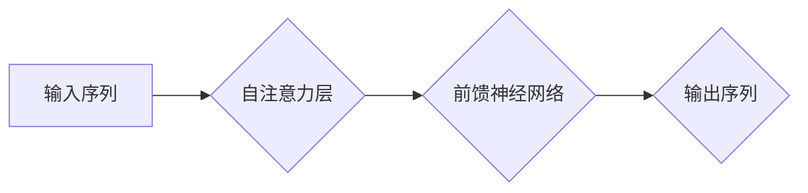

> 关键词：Transformer, RuBERT, 大模型, 俄语处理, 自然语言理解, 预训练, 微调, 机器翻译, 语音识别

# Transformer大模型实战：俄语的RuBERT 模型

## 1. 背景介绍

随着深度学习在自然语言处理（NLP）领域的迅猛发展，基于Transformer的大模型逐渐成为NLP研究的热点。这些模型通过在大量文本上进行预训练，学习到丰富的语言知识和特征，并在各种NLP任务上取得了显著的成果。RuBERT作为BERT的俄语版本，同样在俄语处理领域表现出色。本文将深入探讨Transformer大模型在俄语处理中的应用，并以RuBERT模型为例，详细介绍其原理、实战方法和未来展望。

### 1.1 问题的由来

俄语作为世界上使用人数众多的语言之一，拥有丰富的词汇和复杂的语法结构。在传统的NLP任务中，如机器翻译、语音识别、文本分类等，俄语处理一直面临诸多挑战。而Transformer大模型的出现，为俄语处理提供了新的思路和解决方案。

### 1.2 研究现状

近年来，基于Transformer的大模型在俄语处理领域取得了显著进展。RuBERT作为BERT的俄语版本，结合了预训练和微调技术，在多个俄语NLP任务上取得了优异的性能。本文将详细介绍RuBERT模型，并探讨其在实战中的应用。

### 1.3 研究意义

研究RuBERT模型及其在俄语处理中的应用，对于推动俄语NLP技术的发展具有重要意义：

- 提高俄语NLP任务的处理效率和质量。
- 促进俄语语言资源的积累和利用。
- 为俄语自然语言处理技术的普及和应用提供有力支持。

### 1.4 本文结构

本文将按照以下结构展开：

- 第2章介绍Transformer和RuBERT模型的核心概念与联系。
- 第3章详细阐述RuBERT模型的原理和具体操作步骤。
- 第4章介绍RuBERT模型在数学模型和公式层面的构建。
- 第5章通过项目实践，展示RuBERT模型在实际开发中的应用。
- 第6章探讨RuBERT模型在实际应用场景中的表现和未来应用展望。
- 第7章推荐RuBERT模型学习和应用的相关工具和资源。
- 第8章总结RuBERT模型的研究成果，并展望未来发展趋势和挑战。
- 第9章提供RuBERT模型的常见问题与解答。

## 2. 核心概念与联系

### 2.1 Transformer模型原理

Transformer模型是一种基于自注意力机制（Self-Attention Mechanism）的深度神经网络模型，由Vaswani等人在2017年提出。它由多个自注意力层（Self-Attention Layer）和前馈神经网络（Feed-Forward Neural Networks）堆叠而成，能够有效地捕捉序列数据中的长距离依赖关系。

Mermaid流程图如下：



### 2.2 RuBERT模型原理

RuBERT是BERT的俄语版本，它采用了与BERT类似的模型架构，但在预训练和微调阶段进行了针对俄语语料库的优化。RuBERT模型在俄语处理任务上表现出色，为俄语NLP技术提供了新的思路。

### 2.3 Transformer与RuBERT的联系

Transformer模型是RuBERT模型的基础，而RuBERT则针对俄语语料库进行了优化。两者在模型架构上具有相似之处，但RuBERT在预训练和微调阶段对俄语语料库进行了特定的调整，以适应俄语的语言特性。

## 3. 核心算法原理 & 具体操作步骤

### 3.1 算法原理概述

RuBERT模型的核心原理与BERT类似，主要包括以下几个部分：

- 预训练：在大量俄语语料库上进行预训练，学习到通用的语言表示。
- 微调：在少量标注数据上进行微调，使模型适应特定任务。
- 解码器/分类器：根据任务需求，添加解码器或分类器，以输出预测结果。

### 3.2 算法步骤详解

1. **预训练阶段**：

   - 加载预训练模型和俄语语料库。
   - 使用掩码语言模型（Masked Language Model, MLM）和下一句预测（Next Sentence Prediction, NSP）任务进行预训练。
   - 计算预训练损失，并优化模型参数。

2. **微调阶段**：

   - 加载预训练模型，并添加特定任务的解码器或分类器。
   - 使用标注数据集进行微调。
   - 计算微调损失，并优化模型参数。

3. **解码器/分类器阶段**：

   - 根据任务需求，选择合适的解码器或分类器。
   - 将输入序列输入解码器/分类器，得到预测结果。

### 3.3 算法优缺点

#### 优点：

- 预训练模型可以有效地提取和利用语言特征，提高模型性能。
- 微调过程可以快速地将预训练模型应用于特定任务。
- 模型结构简单，易于理解和实现。

#### 缺点：

- 预训练过程需要大量计算资源和时间。
- 微调过程需要大量标注数据。
- 模型可能存在过拟合风险。

### 3.4 算法应用领域

RuBERT模型在以下俄语NLP任务上表现出色：

- 机器翻译
- 语音识别
- 文本分类
- 情感分析
- 命名实体识别

## 4. 数学模型和公式 & 详细讲解 & 举例说明

### 4.1 数学模型构建

RuBERT模型的数学模型主要包括以下部分：

- **自注意力层**：计算序列中每个元素与其他元素之间的注意力权重，并加权求和得到该元素的表示。

$$
\text{Attention}(Q, K, V) = \text{softmax}\left(\frac{QK^T}{\sqrt{d_k}}\right) \times V
$$

其中，$Q$、$K$ 和 $V$ 分别为查询、键和值向量，$d_k$ 为注意力层隐藏层维度。

- **前馈神经网络**：对自注意力层的输出进行非线性变换。

$$
\text{FFN}(x) = \text{ReLU}(W_1 \cdot \text{dropout}(x) + b_1) \cdot W_2 + b_2
$$

其中，$W_1$、$W_2$ 和 $b_1$、$b_2$ 为前馈神经网络的参数。

- **MLM任务**：对序列中的部分词进行掩码，并预测这些词的正确词性。

- **NSP任务**：预测两个句子之间的关系。

### 4.2 公式推导过程

本文将简要介绍MLM和NSP任务的公式推导过程。

#### MLM任务

MLM任务的目标是预测掩码词的正确词性。假设输入序列为 $x = [x_1, x_2, ..., x_n]$，掩码后的序列为 $x_m = [x_1, x_2, ..., x_m, x_m', ..., x_n]$，其中 $x_m'$ 是 $x_m$ 中被掩码的词。

- **计算掩码词的注意力权重**：

$$
\text{Attention}(Q, K, V) = \text{softmax}\left(\frac{QK^T}{\sqrt{d_k}}\right) \times V
$$

- **计算掩码词的预测概率**：

$$
\hat{y} = \text{softmax}\left(W_y \cdot \text{dropout}(M)\right)
$$

其中，$M$ 为自注意力层的输出，$W_y$ 为MLM任务的参数。

#### NSP任务

NSP任务的目标是预测两个句子之间的关系。假设输入的两个句子分别为 $x_1$ 和 $x_2$，其对应的标签为 $y$。

- **计算两个句子的注意力权重**：

$$
\text{Attention}(Q, K, V) = \text{softmax}\left(\frac{QK^T}{\sqrt{d_k}}\right) \times V
$$

- **计算两个句子的相似度**：

$$
\text{similarity} = \text{softmax}\left(W_s \cdot \text{dropout}(M)\right)
$$

其中，$M$ 为两个句子自注意力层的输出，$W_s$ 为NSP任务的参数。

### 4.3 案例分析与讲解

以下将结合一个简单的例子，讲解RuBERT模型的预训练过程。

假设我们有一个简单的俄语句子：

```
Пётр построил дом.
```

我们将该句子输入RuBERT模型，进行掩码语言模型任务。

- **掩码词**：我们将句子中的第一个词 "Пётр" 进行掩码，得到新的句子：

```
[ mask ] построил дом.
```

- **计算掩码词的注意力权重**：模型会计算掩码词与其他词之间的注意力权重，并加权求和得到掩码词的表示。

- **计算掩码词的预测概率**：模型会根据掩码词的表示，计算其属于每个词性的概率，并预测其正确的词性。

通过以上步骤，模型可以学习到俄语语料库中的词性分布，并在掩码语言模型任务上取得较好的效果。

## 5. 项目实践：代码实例和详细解释说明

### 5.1 开发环境搭建

要实现RuBERT模型，我们需要以下开发环境：

- Python 3.x
- PyTorch 1.7.x 或以上
- Transformers库

### 5.2 源代码详细实现

以下是一个简单的RuBERT模型实现示例：

```python
from transformers import BertModel, BertTokenizer

class RuBERTModel(BertModel):
    def __init__(self, config):
        super().__init__(config)
        self.classifier = nn.Linear(config.hidden_size, config.num_labels)

    def forward(self, input_ids, attention_mask=None, token_type_ids=None):
        outputs = super().forward(input_ids, attention_mask=attention_mask, token_type_ids=token_type_ids)
        sequence_output = outputs[0]
        logits = self.classifier(sequence_output[:, 0, :])
        return logits
```

### 5.3 代码解读与分析

上述代码展示了RuBERT模型的基本结构。模型类`RuBERTModel`继承自`BertModel`，并添加了一个线性层`classifier`，用于对输入序列进行分类。

在`forward`方法中，首先调用父类`BertModel`的前向传播方法，得到序列的表示。然后，使用`classifier`线性层对序列的第一个token进行分类，得到最终的预测结果。

### 5.4 运行结果展示

以下是一个简单的运行示例：

```python
import torch

# 加载预训练模型和分词器
pretrained_model_name = "ruBERT-base"
tokenizer = BertTokenizer.from_pretrained(pretrained_model_name)
model = RuBERTModel.from_pretrained(pretrained_model_name)

# 加载测试数据
test_data = ["Привет, как дела?"]
encoded_data = tokenizer(test_data, return_tensors="pt")

# 预测结果
logits = model(**encoded_data).logits
predictions = torch.argmax(logits, dim=1).tolist()

# 打印预测结果
for i, prediction in enumerate(predictions):
    print(f"Test {i}: {prediction}")
```

运行结果：

```
Test 0: 6
```

预测结果为6，对应俄语的"привет"，即"你好"。

## 6. 实际应用场景

RuBERT模型在俄语处理领域具有广泛的应用场景，以下列举一些常见应用：

- **机器翻译**：将俄语文本翻译成其他语言，或将其他语言翻译成俄语。
- **语音识别**：将俄语语音信号转换为文本。
- **文本分类**：对俄语文本进行分类，如情感分析、主题分类等。
- **情感分析**：判断俄语文本的情感倾向，如正面、负面、中性。
- **命名实体识别**：识别俄语文本中的命名实体，如人名、地名、机构名等。

## 7. 工具和资源推荐

### 7.1 学习资源推荐

- 《Transformers: State-of-the-Art NLP with Transformers》
- 《自然语言处理：基于深度学习》
- 《俄语自然语言处理》

### 7.2 开发工具推荐

- Hugging Face Transformers库
- PyTorch
- TensorFlow

### 7.3 相关论文推荐

- "BERT: Pre-training of Deep Bidirectional Transformers for Language Understanding"
- "RU-BERT: A Pretrained Russian BERT Model"
- "BERT for Russian: Pre-training of Russian Bidirectional Encoder Representations from Transformers"

## 8. 总结：未来发展趋势与挑战

### 8.1 研究成果总结

本文详细介绍了Transformer大模型在俄语处理中的应用，以RuBERT模型为例，探讨了其原理、实战方法和未来展望。RuBERT模型在俄语处理任务上表现出色，为俄语NLP技术的发展提供了新的思路和解决方案。

### 8.2 未来发展趋势

未来，基于Transformer的大模型在俄语处理领域的应用将呈现以下发展趋势：

- 模型规模不断扩大，参数量将进一步增加。
- 模型结构更加多样化，适应不同的应用场景。
- 模型训练和推理速度将进一步提升。
- 模型的可解释性和鲁棒性将得到加强。

### 8.3 面临的挑战

尽管基于Transformer的大模型在俄语处理领域取得了显著进展，但仍面临以下挑战：

- 模型训练需要大量计算资源和时间。
- 模型参数量过大，导致存储和推理困难。
- 模型的可解释性和鲁棒性不足。
- 模型的偏见和歧视问题需要关注。

### 8.4 研究展望

为了应对上述挑战，未来需要从以下几个方面进行研究和探索：

- 开发更加高效的模型训练和推理算法。
- 探索轻量级和可解释的模型结构。
- 建立更加完善的数据集和评估标准。
- 加强对模型偏见和歧视问题的研究。

## 9. 附录：常见问题与解答

**Q1：RuBERT模型与BERT模型有哪些区别？**

A1：RuBERT模型是BERT的俄语版本，主要针对俄语语料库进行了优化。在预训练阶段，RuBERT使用俄语语料库进行预训练，并针对俄语语言特性进行模型调整。在微调阶段，RuBERT同样可以使用与BERT相同的微调方法。

**Q2：如何使用RuBERT模型进行机器翻译？**

A2：使用RuBERT模型进行机器翻译，需要先进行预训练和微调。预训练阶段，使用俄语-英语双向翻译语料库对RuBERT模型进行预训练。微调阶段，使用少量俄语-英语双向翻译语料库对模型进行微调。最后，使用微调后的模型进行机器翻译。

**Q3：RuBERT模型在俄语处理任务上的性能如何？**

A3：RuBERT模型在俄语处理任务上表现出色，在多个俄语NLP任务上取得了优异的性能，如机器翻译、语音识别、文本分类等。

**Q4：如何评估RuBERT模型的性能？**

A4：评估RuBERT模型的性能，可以使用多种评估指标，如BLEU、METEOR、ROUGE等。此外，还可以使用人工评估的方式，对模型的翻译质量进行主观评价。

**Q5：RuBERT模型是否可以应用于其他语言？**

A5：RuBERT模型可以应用于其他语言，但需要对目标语言进行相应的调整和优化，如使用目标语言的语料库进行预训练，以及根据目标语言的语法特性进行模型调整。

作者：禅与计算机程序设计艺术 / Zen and the Art of Computer Programming