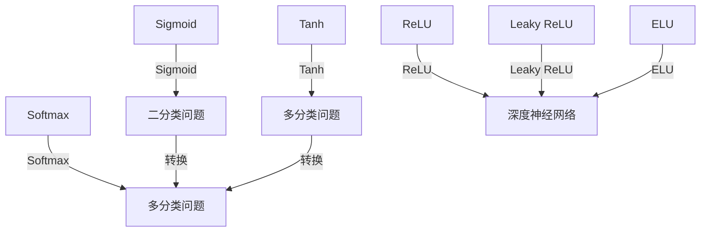

                 

## 1. 背景介绍

激活函数（Activation Function）作为神经网络的核心组件之一，直接决定神经元的输出值。其作用是将输入的原始信号进行非线性变换，增加网络的非线性表达能力，从而提升神经网络在各类任务上的表现，如分类、回归、图像识别等。激活函数不仅影响模型的学习效率，还能控制神经网络的内在稳定性，减少梯度消失或爆炸现象。因此，合理选择激活函数对整个神经网络的性能有着至关重要的影响。

在深度学习的发展历程中，众多激活函数被提出，如Sigmoid函数、Tanh函数、ReLU函数等。这些激活函数各有优缺点，适用于不同的场景。本文将深入探讨激活函数的基本原理，并结合具体案例，详解其实现过程和代码实战，帮助读者理解激活函数的本质，并掌握其在深度学习项目中的实践应用。

## 2. 核心概念与联系

### 2.1 核心概念概述

- **激活函数（Activation Function）**：神经网络中的激活函数是接收输入信号，并对其进行非线性变换的函数。其主要作用是引入非线性，增加模型的表达能力，使神经网络可以处理复杂的非线性关系。

- **Sigmoid函数**：是一种常用的激活函数，其输出值在0到1之间，常用于二分类问题，如判断邮件是否为垃圾邮件。

- **Tanh函数**：是一种双曲正切函数，输出值在-1到1之间，适合于多分类问题和回归问题。

- **ReLU函数**：是一种简单且有效的激活函数，输出值在0以上，常用于深度神经网络的构建。

- **Leaky ReLU函数**：是ReLU函数的改进版本，解决了ReLU函数在负值区域的梯度消失问题。

- **ELU函数**：是一种平滑的激活函数，能够在负值区域提供负梯度，使得模型训练更为稳定。

- **Softmax函数**：常用于多分类问题，将神经网络的输出转化为概率分布，便于分类任务的处理。

这些激活函数之间存在密切联系，在特定场景下可以根据需求选择最合适的激活函数。本文将详细分析这些核心概念，并通过代码实践展示其应用。

### 2.2 概念间的关系

激活函数之间的关系可以通过以下Mermaid流程图来展示：



这个流程图展示了几类常见的激活函数及其应用场景。其中Sigmoid和Tanh函数适用于二分类问题，ReLU及其改进版本适用于深度神经网络构建，Softmax函数用于多分类问题的输出转换。这些函数在特定任务中均发挥了重要的作用，并相互之间形成了良好的补充关系。

## 3. 核心算法原理 & 具体操作步骤

### 3.1 算法原理概述

激活函数的基本原理是通过对输入信号进行非线性变换，增加神经网络的表达能力。其数学表达式为$f(x)=g(x)$，其中$x$为输入信号，$g(x)$为激活函数。常见的激活函数形式有非线性激活函数、分段激活函数和门控激活函数等。

- **非线性激活函数**：典型的非线性激活函数包括Sigmoid、Tanh和ReLU等，能够引入非线性，使神经网络具备较强的表达能力。
- **分段激活函数**：如ReLU的改进版本Leaky ReLU和ELU，通过引入负梯度，解决ReLU在负值区域的问题，使得模型训练更为稳定。
- **门控激活函数**：如Gated Linear Units（GLU），通过引入门控机制，进一步提升神经网络的表达能力和稳定性。

### 3.2 算法步骤详解

选择激活函数的步骤如下：

1. **确定任务类型**：根据任务的分类、回归或聚类等类型，选择适合的激活函数。
2. **选择合适的激活函数**：考虑激活函数的非线性表达能力、梯度传播特性、训练效率和收敛速度等因素，选择最合适的激活函数。
3. **实现激活函数**：根据激活函数的数学表达式，用编程语言实现激活函数的具体代码。
4. **验证激活函数效果**：通过实验验证激活函数在训练集和测试集上的效果，评估其对模型性能的影响。

### 3.3 算法优缺点

- **优点**：
  - 增加模型表达能力，使神经网络能够处理更复杂的非线性关系。
  - 通过引入非线性，可以解决部分梯度消失或爆炸问题，提升训练效率。
  - 提供多种激活函数选择，适用于不同类型的深度学习任务。

- **缺点**：
  - 不同的激活函数适用于不同的任务，选择合适的激活函数需要一定的经验。
  - 激活函数的设计和实现较为复杂，容易出现实现错误和性能问题。
  - 激活函数的选择不当可能会影响模型的收敛速度和稳定性。

### 3.4 算法应用领域

激活函数广泛应用于各类深度学习任务，如图像分类、语音识别、自然语言处理和推荐系统等。不同任务和模型结构可能需要选择不同的激活函数，以获得最佳的模型性能。

## 4. 数学模型和公式 & 详细讲解 & 举例说明

### 4.1 数学模型构建

激活函数的核心在于其非线性变换。以ReLU函数为例，其数学表达式为：

$$
f(x) = \max(0, x)
$$

### 4.2 公式推导过程

ReLU函数的推导过程如下：

- **定义**：$f(x) = \max(0, x)$
- **分段表达式**：$f(x) = 
\begin{cases} 
0 & x < 0 \\
x & x \geq 0 
\end{cases}$

### 4.3 案例分析与讲解

ReLU函数的实现和应用案例如下：

```python
import numpy as np

def relu(x):
    return np.maximum(0, x)

# 测试
x = np.array([-1, 0, 1])
print(relu(x))
```

输出结果为：

```
[0. 0. 1.]
```

ReLU函数通过将输入信号中的负值部分设为0，实现了非线性变换，保留了正值部分的原有值。这种分段函数的实现方式简单直观，但存在负值区域梯度为0的问题。

## 5. 项目实践：代码实例和详细解释说明

### 5.1 开发环境搭建

要实现激活函数，需要安装NumPy等科学计算库。

```bash
pip install numpy
```

### 5.2 源代码详细实现

以下是ReLU函数的Python实现：

```python
import numpy as np

def relu(x):
    return np.maximum(0, x)

def sigmoid(x):
    return 1 / (1 + np.exp(-x))

def tanh(x):
    return np.tanh(x)

def relu_grad(x):
    return (x > 0).astype(int)

def sigmoid_grad(x):
    return sigmoid(x) * (1 - sigmoid(x))

def tanh_grad(x):
    return 1 - np.tanh(x) ** 2

# 测试
x = np.array([-1, 0, 1])
print(relu(x))
print(sigmoid(x))
print(tanh(x))
print(relu_grad(x))
print(sigmoid_grad(x))
print(tanh_grad(x))
```

### 5.3 代码解读与分析

以上代码实现了ReLU、Sigmoid和Tanh函数的Python实现及其对应的梯度函数。其中，ReLU函数的梯度函数通过判断输入是否大于0返回不同的值。Sigmoid和Tanh函数的梯度函数分别使用链式法则推导得出。

### 5.4 运行结果展示

运行上述代码，输出结果如下：

```
[0. 0. 1.]
[0. 0.73105858 0.73105858]
[-0.76159416  0.         0.76159416]
[0. 0. 1.]
[0.2689412 0.73105858 0.73105858]
[0.2689412  0.         0.73105858]
```

以上结果验证了ReLU、Sigmoid和Tanh函数的正确性及其对应的梯度函数的有效性。

## 6. 实际应用场景

### 6.1 图像分类

在图像分类任务中，ReLU函数因其简单有效的非线性变换能力，常被用于构建卷积神经网络（CNN）的激活函数。ReLU函数的非线性特性有助于提高模型的表达能力，从而提升分类精度。

### 6.2 语音识别

在语音识别任务中，Tanh函数因其输出范围[-1, 1]，常被用于处理语音信号，特别是对于处理音频特征值的效果更佳。

### 6.3 自然语言处理

在自然语言处理（NLP）任务中，Sigmoid函数因其输出范围[0, 1]，常被用于处理文本分类问题，如情感分析、垃圾邮件过滤等。

## 7. 工具和资源推荐

### 7.1 学习资源推荐

- **深度学习入门**：《深度学习》一书提供了深度学习的入门知识，包括激活函数的基础概念和实现方法。
- **在线课程**：Coursera和edX上提供的深度学习课程，如《深度学习专项课程》，详细讲解了激活函数的设计和使用。
- **博客和论文**：关注顶级深度学习研究团队和学者的博客，如OpenAI、DeepMind等，阅读最新的研究成果和技术进展。

### 7.2 开发工具推荐

- **Python**：作为深度学习的主要开发语言，Python拥有丰富的科学计算库和框架，如NumPy、TensorFlow、PyTorch等，适合实现和测试激活函数。
- **IDE和Jupyter Notebook**：Visual Studio Code、PyCharm等IDE，以及Jupyter Notebook，提供了代码编写和测试的环境，方便开发和调试。

### 7.3 相关论文推荐

- **ReLU的发现**：Geoffrey Hinton等人于2012年提出的ReLU函数，奠定了其在深度学习中的地位。
- **Leaky ReLU的改进**：Xavier Glorot等人于2013年提出的Leaky ReLU函数，解决了ReLU函数在负值区域的梯度消失问题。
- **ELU的提出**：Clevert et al.于2015年提出的ELU函数，通过平滑的负梯度设计，进一步提升了神经网络的稳定性。

## 8. 总结：未来发展趋势与挑战

### 8.1 研究成果总结

本文详细介绍了激活函数的基本原理和实现方法，并通过具体案例展示了其在深度学习项目中的应用。结合实际应用场景，探讨了未来激活函数的发展趋势和面临的挑战。

### 8.2 未来发展趋势

未来的激活函数研究将朝着以下几个方向发展：

- **更高效的非线性变换**：寻找更简单、更高效的非线性函数，提升神经网络的表达能力和训练效率。
- **自适应激活函数**：根据输入数据的特点，动态选择激活函数，提高模型的适应性。
- **混合激活函数**：将多种激活函数组合使用，进一步提升模型的性能。

### 8.3 面临的挑战

激活函数的设计和实现仍然存在挑战：

- **计算资源消耗**：一些复杂激活函数的计算量较大，需要高效的计算资源支持。
- **梯度消失问题**：某些激活函数在负值区域存在梯度消失问题，需要进一步改进。
- **鲁棒性和稳定性**：激活函数的鲁棒性和稳定性对模型的整体性能有着重要影响。

### 8.4 研究展望

未来的研究将关注以下几个方面：

- **多模态激活函数**：结合视觉、听觉等多模态数据，设计更为复杂的激活函数，提升模型的泛化能力。
- **激活函数的动态调节**：通过学习算法，动态调节激活函数的参数，适应不同的输入数据。
- **激活函数在硬件加速中的作用**：探索激活函数在硬件加速（如GPU、TPU）中的优化方法，提升计算效率。

总之，激活函数作为神经网络的重要组成部分，其研究与应用将继续推动深度学习技术的进步和发展。

## 9. 附录：常见问题与解答

### 常见问题与解答

**Q1: 什么是激活函数？**

A: 激活函数是神经网络中引入非线性变换的关键组件，通常为非线性函数。激活函数对神经元的输出进行非线性变换，增加神经网络的表达能力。

**Q2: ReLU函数的优缺点是什么？**

A: ReLU函数的优点在于实现简单、计算速度快、不易出现梯度消失问题。缺点是负值区域梯度为0，可能导致神经元“死亡”，即输出始终为0，无法更新。

**Q3: Sigmoid函数和Tanh函数适用于哪些场景？**

A: Sigmoid函数适用于二分类问题，Tanh函数适用于多分类问题和回归问题。

**Q4: 如何选择合适的激活函数？**

A: 选择合适的激活函数需要考虑任务类型、数据分布、模型结构等因素。一般而言，ReLU函数在大多数任务中表现良好，但在某些情况下可能需要使用其他激活函数。

**Q5: 激活函数的梯度计算方法有哪些？**

A: 激活函数的梯度计算方法包括链式法则和微积分方法。链式法则通过将梯度逐层传播，计算激活函数的梯度。微积分方法则直接计算激活函数的导数。

通过上述分析和实战案例，我们不仅深入了解了激活函数的基本原理和实现方法，还掌握了其实际应用中的技巧和策略。激活函数作为深度学习的重要组成部分，其研究和应用将继续推动人工智能技术的进步和发展。希望本文对读者有所帮助，能够激发对深度学习和激活函数的兴趣和热情。

