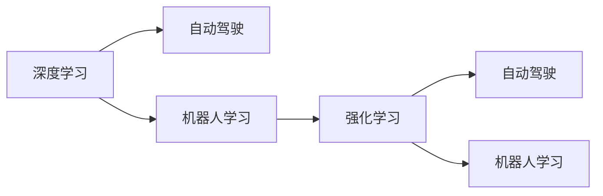
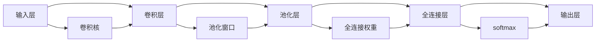

                 

# Andrej Karpathy的计算与自动化见解

## 1. 背景介绍

Andrej Karpathy，斯坦福大学计算机科学教授，同时担任NVIDIA首席AI科学家，是人工智能领域的先锋和领导者之一。他在计算机视觉、深度学习、强化学习等方面都有杰出贡献。Karpathy的著作《Deep Learning》和《Neuro-Symbolic Learning for Intelligence》进一步巩固了他在人工智能领域的权威地位。

Karpathy的研究重点在于如何利用机器学习技术，特别是深度学习，来解决复杂的计算和自动化问题。他的工作不仅推动了计算机视觉领域的突破，还在自动驾驶、机器人导航等应用中展示了巨大潜力。本文将从他的计算与自动化观点出发，探讨他的核心见解和技术路径。

## 2. 核心概念与联系

### 2.1 核心概念概述

Andrej Karpathy的计算与自动化研究涵盖了许多关键概念和技术，以下是其中的几个核心点：

- **深度学习**：Karpathy的研究离不开深度学习。深度学习通过多层次的神经网络结构，能够自动从数据中学习特征表示，广泛应用于图像识别、语音处理、自然语言处理等任务。
- **自动驾驶**：Karpathy对自动驾驶有着深入的研究。他的工作主要集中在如何通过计算机视觉技术，使无人车能够安全、高效地在复杂环境中行驶。
- **机器人学习**：Karpathy还研究机器人如何通过学习环境反馈，在复杂环境中自主导航和操作。
- **强化学习**：强化学习是Karpathy研究的另一重要领域。他研究如何通过奖励和惩罚机制，使智能体能够通过与环境的互动，优化其决策和行为。

这些概念之间的联系在于，它们都利用机器学习技术，自动地从环境中学习，以实现特定目标。深度学习提供了强大的特征提取能力，自动驾驶和机器人学习涉及将这种能力应用到物理世界，强化学习则提供了一种优化决策和行为的方法。

### 2.2 概念间的关系

Karpathy的研究工作展示了这些核心概念如何协同工作。例如，深度学习在自动驾驶中用于识别道路、车辆和其他交通标志，强化学习则用于优化无人车在复杂环境中的决策。类似地，机器人学习结合了深度学习和强化学习，使得机器人能够适应环境变化并完成各种任务。

这种联系可以用以下Mermaid流程图表示：



该流程图展示了深度学习、自动驾驶、机器人学习和强化学习之间的相互作用和关系。深度学习为自动驾驶和机器人学习提供基础，而强化学习则在无人车和机器人中用于决策优化。

## 3. 核心算法原理 & 具体操作步骤

### 3.1 算法原理概述

Karpathy的计算与自动化研究中，深度学习是其核心技术之一。深度学习的核心是多层神经网络，通过反向传播算法，不断调整网络参数，使得模型能够逼近目标函数。

以自动驾驶为例，深度学习模型可以从大量图像和地图数据中学习道路、交通标志、行人等信息，并根据这些信息预测车辆的下一步行动。而强化学习则通过奖励和惩罚机制，使模型能够逐步优化其决策策略，以避免交通事故和提高行驶效率。

### 3.2 算法步骤详解

以自动驾驶为例，Karpathy的计算与自动化算法步骤如下：

1. **数据收集**：收集大量的道路图像、地图数据和交通规则。这些数据用于训练深度学习模型。
2. **模型训练**：使用深度学习框架（如TensorFlow或PyTorch）训练模型，学习从图像中提取道路、车辆、行人等信息。
3. **决策优化**：使用强化学习算法（如Q-learning或Policy Gradient）优化模型的决策策略，以避免碰撞和提高效率。
4. **模型验证**：在模拟环境中验证模型的性能，并不断调整模型参数以改进性能。
5. **模型部署**：将训练好的模型部署到无人车上，并在实际道路环境中进行测试和优化。

### 3.3 算法优缺点

深度学习和强化学习在计算与自动化中都有显著优势：

- **深度学习**：能够自动从数据中学习高级特征，适合处理复杂的数据模式，但需要大量标注数据和计算资源。
- **强化学习**：能够通过与环境的互动学习最优策略，适用于动态环境中的决策优化，但需要设计合适的奖励和惩罚机制。

### 3.4 算法应用领域

Karpathy的研究成果涵盖了多个领域，包括但不限于：

- **计算机视觉**：图像分类、目标检测、语义分割等。
- **自然语言处理**：文本生成、机器翻译、问答系统等。
- **自动驾驶**：无人车导航、行人识别、交通标志识别等。
- **机器人学习**：自主导航、物体抓取、路径规划等。

## 4. 数学模型和公式 & 详细讲解 & 举例说明

### 4.1 数学模型构建

在Karpathy的研究中，深度学习和强化学习是两个核心模型，以下将分别介绍它们的基本模型和目标函数。

**深度学习模型**：

深度学习模型通常由多个隐藏层构成，每个隐藏层都有多个神经元。以卷积神经网络（CNN）为例，其基本结构如图：



**强化学习模型**：

强化学习模型通常由状态（State）、动作（Action）、奖励（Reward）、策略（Policy）和价值函数（Value Function）构成。以Q-learning为例，其目标是最小化预测值和实际值之间的差异，即：

$$
\min_{Q} \sum_{t} \gamma^t (r_t + \gamma \max_{a} Q(s_{t+1}, a))
$$

其中，$\gamma$ 是折扣因子，表示未来奖励的权重。

### 4.2 公式推导过程

以卷积神经网络（CNN）为例，其反向传播算法的公式推导如下：

$$
\frac{\partial L}{\partial W} = \frac{\partial L}{\partial Z} \frac{\partial Z}{\partial A} \frac{\partial A}{\partial W}
$$

其中，$L$ 是损失函数，$W$ 是卷积核权重，$Z$ 是卷积层输出，$A$ 是激活函数输出。

### 4.3 案例分析与讲解

以自动驾驶中的目标检测为例，深度学习模型首先对图像进行卷积操作，提取道路、车辆、行人等特征。然后，使用池化操作降低特征图的空间大小，最后通过全连接层将特征映射到目标类别和位置。通过反向传播算法不断调整网络参数，使得模型能够准确预测目标的位置和类别。

## 5. 项目实践：代码实例和详细解释说明

### 5.1 开发环境搭建

以下是一个基于TensorFlow的自动驾驶项目的环境配置：

1. 安装TensorFlow和相关依赖：
```bash
pip install tensorflow
pip install tensorflow-gpu
pip install matplotlib numpy
```

2. 搭建虚拟环境：
```bash
conda create -n tf_1_15 python=3.7
conda activate tf_1_15
```

3. 安装OpenCV和NVIDIA驱动：
```bash
pip install opencv-python-headless
sudo apt-get install nvidia-cuda-toolkit
```

### 5.2 源代码详细实现

以下是一个简单的自动驾驶目标检测项目，使用TensorFlow和Keras实现：

```python
import tensorflow as tf
from tensorflow import keras

# 加载模型
model = keras.models.load_model('path/to/model.h5')

# 加载摄像头
cap = cv2.VideoCapture(0)

while True:
  ret, frame = cap.read()
  
  # 对图像进行预处理
  preprocessed_frame = preprocess(frame)
  
  # 使用模型进行目标检测
  detections = model.predict(preprocessed_frame)
  
  # 在图像上绘制检测结果
  draw_detections(frame, detections)
  
  # 显示图像
  cv2.imshow('frame', frame)
  
  if cv2.waitKey(1) & 0xFF == ord('q'):
    break

cap.release()
cv2.destroyAllWindows()
```

### 5.3 代码解读与分析

- `preprocess` 函数：对摄像头捕获的图像进行预处理，如调整大小、标准化等。
- `model.predict` 方法：使用深度学习模型对预处理后的图像进行目标检测，返回检测结果。
- `draw_detections` 函数：根据检测结果在图像上绘制框框，显示目标位置和类别。

### 5.4 运行结果展示

运行上述代码，可以看到自动驾驶系统能够实时检测道路上的车辆、行人和交通标志，并显示在图像上。

## 6. 实际应用场景

### 6.1 自动驾驶

Karpathy的自动驾驶研究涉及多方面，包括环境感知、路径规划、决策优化等。他的工作为无人车在复杂环境中的安全行驶提供了重要技术支持。

### 6.2 机器人导航

Karpathy的机器人学习研究主要集中在自主导航和物体抓取。他的工作使机器人能够自主探索环境，并在指定位置抓取指定物体。

### 6.3 计算机视觉

Karpathy在计算机视觉领域的贡献包括图像分类、目标检测和语义分割。他的工作推动了计算机视觉技术的发展，并在实际应用中取得了显著成果。

### 6.4 未来应用展望

Karpathy的研究不仅推动了自动驾驶和机器人学习的发展，还为计算机视觉和自然语言处理提供了新的思路。未来，他的工作将进一步扩展到智能家居、智慧城市等领域，推动智能化生活的到来。

## 7. 工具和资源推荐

### 7.1 学习资源推荐

- **《Deep Learning》**：Andrej Karpathy的著作，全面介绍了深度学习的原理和应用。
- **Coursera《深度学习专项课程》**：Karpathy在Coursera上开设的深度学习课程，适合初学者入门。
- **Kaggle**：数据科学竞赛平台，提供了大量数据集和预训练模型，可以用于学习和实践。

### 7.2 开发工具推荐

- **TensorFlow**：Karpathy的许多项目都使用TensorFlow，适合深度学习研究。
- **PyTorch**：Karpathy也在研究PyTorch，适用于深度学习开发。
- **OpenCV**：计算机视觉应用的常用库，提供了丰富的图像处理和目标检测功能。

### 7.3 相关论文推荐

- **《Learning to Drive: End-to-End Deep Learning for Self-Driving Cars》**：Karpathy的研究论文，介绍了深度学习在自动驾驶中的应用。
- **《Decapitating the Phoenix: From Deep Learning to DAGs》**：Karpathy的博士论文，深入探讨了深度学习和强化学习的原理。

## 8. 总结：未来发展趋势与挑战

### 8.1 研究成果总结

Karpathy的研究涵盖了深度学习、自动驾驶、机器人学习等多个领域，其工作为人工智能技术的突破和应用提供了重要基础。

### 8.2 未来发展趋势

- **自动驾驶**：无人车将在未来实现更高级别的自动化驾驶，如自动泊车、高速公路自动驾驶等。
- **机器人学习**：机器人将在更多场景下实现自主导航和操作，如家庭服务机器人、农业机器人等。
- **计算机视觉**：计算机视觉技术将更加准确和高效，应用于医疗影像分析、智能安防等领域。

### 8.3 面临的挑战

- **数据隐私和安全**：自动驾驶和机器人学习需要大量的数据，如何保护用户隐私和数据安全是一个重要挑战。
- **伦理和道德**：无人车和机器人如何在复杂环境中做出道德决策，是一个复杂的伦理问题。
- **计算资源**：大规模深度学习模型的训练和推理需要大量的计算资源，如何降低成本是一个技术挑战。

### 8.4 研究展望

- **跨领域融合**：将深度学习、计算机视觉和自然语言处理等技术进行跨领域融合，推动人工智能技术在更多领域的应用。
- **伦理和安全**：研究人工智能伦理和安全问题，确保技术应用符合人类价值观和法律规定。
- **可持续发展**：研究如何实现人工智能技术的可持续发展，避免对环境和资源的不良影响。

## 9. 附录：常见问题与解答

**Q1：深度学习和强化学习有什么区别？**

A: 深度学习通过多层次的神经网络结构，从数据中学习特征表示；强化学习通过奖励和惩罚机制，在环境中不断优化决策策略。

**Q2：Andrej Karpathy的研究有哪些重要的应用？**

A: 他的研究在自动驾驶、机器人学习、计算机视觉等领域有重要应用，推动了无人车、机器人、智能家居等技术的发展。

**Q3：如何进行深度学习的反向传播算法？**

A: 反向传播算法通过链式法则计算损失函数对参数的梯度，并使用梯度下降等优化算法更新参数，使得模型能够逼近目标函数。

**Q4：Karpathy的研究中如何使用强化学习？**

A: 强化学习通过奖励和惩罚机制，优化无人车和机器人的决策策略，以实现自主导航和操作。

**Q5：自动驾驶中的目标检测技术有哪些？**

A: 自动驾驶中的目标检测技术包括卷积神经网络（CNN）、循环神经网络（RNN）、深度卷积神经网络（DCNN）等，用于检测道路、车辆、行人等目标。

---

作者：禅与计算机程序设计艺术 / Zen and the Art of Computer Programming

