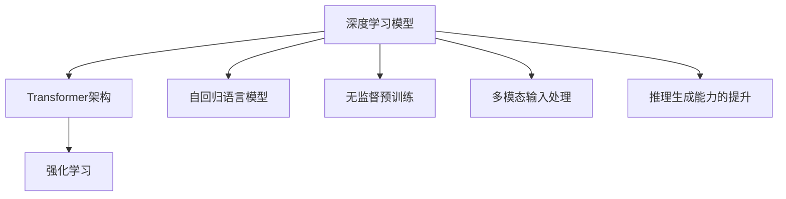
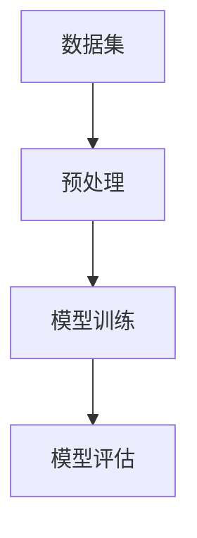
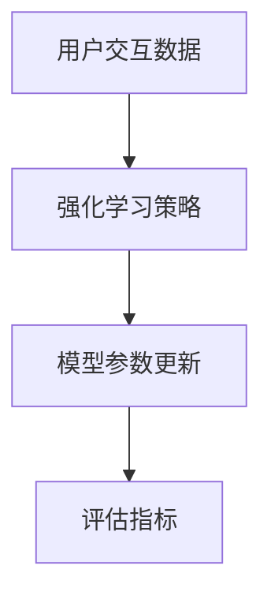
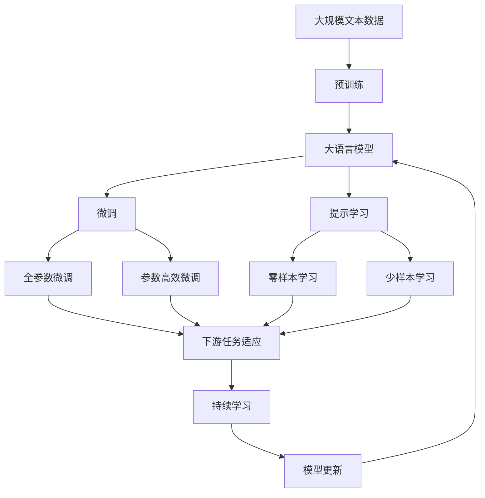

                 

# ChatGPT的工作原理解析

> 关键词：ChatGPT,深度学习,Transformer,自回归模型,无监督学习,强化学习,语言模型,推理生成

## 1. 背景介绍

### 1.1 问题由来
ChatGPT作为OpenAI开发的最新一代大规模语言模型，以强大的语言理解和生成能力著称，在对话系统、自动文本生成、内容创作等多个领域展现出巨大的潜力。然而，由于ChatGPT模型的复杂性和深度，许多开发者和研究人员对其内部机制和工作原理仍然不够清晰。

本文将深入探讨ChatGPT的工作原理，揭示其背后所依赖的核心技术，并结合具体应用场景，展示ChatGPT的实际应用效果。希望通过本文，读者能够对ChatGPT有一个全面的理解，并掌握其关键技术和应用方法。

### 1.2 问题核心关键点
ChatGPT的工作原理可以分为以下几个核心关键点：
1. 基于Transformer架构的深度学习模型：ChatGPT的底层是一个基于Transformer架构的深度学习模型，它能够高效地处理长序列输入，并具备强大的语言理解能力。
2. 自回归语言模型：ChatGPT采用自回归方式生成文本，通过上一时刻的输入预测下一个单词或字符，从而实现连续的文本生成。
3. 无监督预训练：ChatGPT在大量无标签文本数据上进行预训练，学习到通用的语言表示，为下游任务提供强大的基础能力。
4. 强化学习优化：ChatGPT通过与用户的交互，不断调整模型参数，提升语言生成和推理能力。
5. 多模态输入处理：ChatGPT能够处理多模态数据，如图像、语音等，拓展了其应用范围。
6. 推理生成能力的提升：ChatGPT不仅能够生成文本，还能根据上下文进行推理和修正，提升生成内容的逻辑性和连贯性。

### 1.3 问题研究意义
深入理解ChatGPT的工作原理，有助于开发者更好地掌握其核心技术，进行模型部署和优化，提升其在实际应用中的效果。同时，了解ChatGPT的局限性和未来发展趋势，有助于我们设计更具创新性和竞争力的NLP解决方案。

## 2. 核心概念与联系

### 2.1 核心概念概述

为更好地理解ChatGPT的工作原理，本节将介绍几个密切相关的核心概念：

- 深度学习模型：一种基于多层神经网络的机器学习算法，通过学习大量数据中的模式和规律，自动提取特征，并进行预测或分类。
- Transformer架构：一种深度学习模型的结构设计，通过自注意力机制和残差连接，高效处理长序列数据，被广泛应用于NLP领域。
- 自回归语言模型：一种基于前一时刻的输入预测后一时刻输出的语言模型，常用于文本生成、语言建模等任务。
- 无监督预训练：在大规模无标签数据上进行预训练，学习到通用的语言表示，提升模型的泛化能力。
- 强化学习：一种通过与环境互动，不断调整模型参数以优化性能的学习方法，常用于游戏、机器人等领域。
- 多模态输入处理：能够处理和融合来自不同模态（如文本、图像、语音等）的信息，拓展模型的应用范围。
- 推理生成能力的提升：通过模型参数的调整和训练，提升生成内容的逻辑性和连贯性，使模型能够根据上下文进行推理和修正。

这些核心概念之间的逻辑关系可以通过以下Mermaid流程图来展示：



这个流程图展示了大语言模型的核心概念及其之间的关系：

1. 深度学习模型是ChatGPT的基础。
2. Transformer架构通过自注意力机制提升模型的处理效率。
3. 自回归语言模型是ChatGPT的文本生成方式。
4. 无监督预训练为模型提供通用的语言表示。
5. 强化学习通过与用户交互，不断优化模型参数。
6. 多模态输入处理拓展了模型的应用场景。
7. 推理生成能力的提升使得ChatGPT具备更强的理解和生成能力。

### 2.2 概念间的关系

这些核心概念之间存在着紧密的联系，形成了ChatGPT的完整工作机制。下面我们通过几个Mermaid流程图来展示这些概念之间的关系。

#### 2.2.1 深度学习模型的工作流程



这个流程图展示了深度学习模型的一般工作流程：首先对数据进行预处理，然后在训练集上进行模型训练，并在验证集上进行评估，最后使用评估结果调整模型参数。

#### 2.2.2 无监督预训练的流程


这个流程图展示了无监督预训练的基本流程：从大规模无标签数据集中提取自回归语言模型，通过预训练损失函数和优化算法进行模型训练。

#### 2.2.3 强化学习的训练过程



这个流程图展示了强化学习的训练过程：利用用户交互数据生成强化学习策略，通过模型参数更新和评估指标调整模型参数。

### 2.3 核心概念的整体架构

最后，我们用一个综合的流程图来展示这些核心概念在大语言模型微调过程中的整体架构：



这个综合流程图展示了从预训练到微调，再到持续学习的完整过程。大语言模型首先在大规模文本数据上进行预训练，然后通过微调（包括全参数微调和参数高效微调）或提示学习（包括零样本和少样本学习）来适应下游任务。最后，通过持续学习技术，模型可以不断学习新知识，同时避免遗忘旧知识。 通过这些流程图，我们可以更清晰地理解大语言模型的工作原理和优化方向。

## 3. 核心算法原理 & 具体操作步骤
### 3.1 算法原理概述

ChatGPT的核心算法原理基于深度学习模型，特别是Transformer架构和自回归语言模型。其工作流程如下：

1. **数据预处理**：将文本数据转换为模型可以处理的形式，包括分词、编码等。
2. **模型训练**：使用无监督预训练方法，在大规模无标签文本数据上训练自回归语言模型。
3. **微调**：在特定任务上使用少量标注数据进行微调，调整模型参数以适应下游任务。
4. **推理生成**：在给定上下文条件下，生成符合任务要求的文本输出。

### 3.2 算法步骤详解

以下是ChatGPT的具体工作步骤：

#### 3.2.1 数据预处理
数据预处理是ChatGPT的重要步骤，主要包括文本分词和编码。分词是将文本分解成单词或子词的过程，编码是将分词后的单词转换为模型可以处理的向量表示。

以英文文本为例，常见的分词方法包括空格分隔、基于规则的分词、基于统计的分词等。编码则可以使用Word2Vec、GloVe等词向量表示方法，或Transformer中的Embedding层。

#### 3.2.2 模型训练
模型训练是ChatGPT的核心步骤。ChatGPT采用无监督预训练方法，在大规模无标签文本数据上训练自回归语言模型。具体步骤如下：

1. **构建模型架构**：使用Transformer架构，包含自注意力机制、残差连接等。
2. **定义损失函数**：使用自回归语言模型的交叉熵损失函数。
3. **选择优化器**：如AdamW、SGD等。
4. **设置超参数**：如学习率、批次大小等。
5. **训练模型**：在训练集上进行模型训练，使用验证集进行评估和参数调整。

#### 3.2.3 微调
微调是ChatGPT在特定任务上的关键步骤。具体步骤如下：

1. **任务适配**：根据下游任务的性质，在模型顶层添加适当的输出层和损失函数。
2. **设置超参数**：如学习率、批次大小等。
3. **训练模型**：在特定任务的数据集上进行微调，使用验证集进行评估和参数调整。
4. **推理生成**：在给定上下文条件下，生成符合任务要求的文本输出。

#### 3.2.4 推理生成
推理生成是ChatGPT的最终步骤，通过模型参数和上下文条件，生成符合任务要求的文本输出。具体步骤如下：

1. **输入上下文**：将用户输入的上下文信息作为模型的输入。
2. **计算输出**：通过模型的前向传播计算，得到模型的输出。
3. **解码输出**：将模型的输出进行解码，得到最终的文本生成结果。

### 3.3 算法优缺点

ChatGPT作为基于Transformer架构的深度学习模型，具有以下优点：

1. **高效处理长序列**：Transformer架构通过自注意力机制，能够高效处理长序列数据，适合处理NLP任务。
2. **强大的语言理解能力**：无监督预训练使得模型学习到通用的语言表示，具备强大的语言理解能力。
3. **可解释性强**：通过微调，模型的输出可以解释其生成过程，便于分析和调试。

同时，ChatGPT也存在一些缺点：

1. **依赖标注数据**：微调依赖于特定任务的标注数据，获取高质量标注数据的成本较高。
2. **计算资源消耗大**：大规模模型和高精度生成需要大量的计算资源，部署和推理成本较高。
3. **缺乏常识推理**：虽然ChatGPT能够生成符合语法和逻辑的文本，但缺乏常识推理能力，生成内容可能与实际情况不符。

### 3.4 算法应用领域

ChatGPT在多个NLP任务上得到了广泛应用，例如：

- 对话系统：ChatGPT能够与用户进行自然流畅的对话，回答问题、提供建议等。
- 自动文本生成：ChatGPT能够根据给定提示生成符合要求的文章、代码、诗歌等文本。
- 内容创作：ChatGPT能够根据用户需求生成高质量的文本内容，如广告文案、新闻报道等。
- 数据增强：ChatGPT能够生成具有多样性和复杂性的文本数据，用于训练和评估模型。

## 4. 数学模型和公式 & 详细讲解  
### 4.1 数学模型构建

ChatGPT的数学模型构建主要基于Transformer架构和自回归语言模型。

设输入序列为 $x=\{x_1, x_2, \ldots, x_T\}$，目标序列为 $y=\{y_1, y_2, \ldots, y_T\}$。则自回归语言模型的概率分布为：

$$
P(y|x) = \prod_{t=1}^T P(y_t|y_{<t}, x)
$$

其中 $P(y_t|y_{<t}, x)$ 表示在上下文 $y_{<t}$ 和输入 $x$ 的条件下，生成第 $t$ 个单词 $y_t$ 的概率分布。

在具体实现中，ChatGPT使用Transformer架构的Encoder-Decoder模型进行文本生成。Encoder模型负责编码输入序列，Decoder模型负责解码输出序列。

### 4.2 公式推导过程

以下我们以英文文本生成任务为例，推导ChatGPT的概率分布公式。

设输入序列 $x=\{x_1, x_2, \ldots, x_T\}$，目标序列 $y=\{y_1, y_2, \ldots, y_T\}$。则自回归语言模型的概率分布为：

$$
P(y|x) = \prod_{t=1}^T P(y_t|y_{<t}, x)
$$

其中 $P(y_t|y_{<t}, x)$ 表示在上下文 $y_{<t}$ 和输入 $x$ 的条件下，生成第 $t$ 个单词 $y_t$ 的概率分布。

在Transformer架构中，自回归语言模型的概率分布可以表示为：

$$
P(y|x) = \prod_{t=1}^T \frac{e^{h_t^{(y)}}}{Z(x)}
$$

其中 $h_t^{(y)}$ 表示在上下文 $y_{<t}$ 和输入 $x$ 的条件下，生成第 $t$ 个单词 $y_t$ 的得分，$Z(x)$ 为归一化因子，表示所有可能的输出序列的概率之和。

在具体的实现中，ChatGPT通过Transformer架构的Encoder-Decoder模型进行文本生成。Encoder模型将输入序列 $x$ 编码成高维向量表示 $h_x$，Decoder模型根据 $h_x$ 和 $h_{y_{<t}}$ 生成第 $t$ 个单词 $y_t$ 的得分 $h_t^{(y)}$。具体推导过程如下：

1. **Encoder模型**：

   Encoder模型将输入序列 $x=\{x_1, x_2, \ldots, x_T\}$ 编码成高维向量表示 $h_x$。具体过程如下：

   $$
   h_x = \text{Encoder}(x)
   $$

2. **Decoder模型**：

   Decoder模型根据 $h_x$ 和 $y_{<t}$ 生成第 $t$ 个单词 $y_t$ 的得分 $h_t^{(y)}$。具体过程如下：

   $$
   h_t^{(y)} = \text{Decoder}(h_x, y_{<t})
   $$

   其中 $y_{<t}$ 表示在时刻 $t$ 之前生成的所有单词。

   $$
   P(y|x) = \prod_{t=1}^T \frac{e^{h_t^{(y)}}}{Z(x)}
   $$

### 4.3 案例分析与讲解

以英文文本生成任务为例，具体推导过程如下：

1. **Encoder模型**：

   设输入序列 $x=\{x_1, x_2, \ldots, x_T\}$，目标序列 $y=\{y_1, y_2, \ldots, y_T\}$。则Encoder模型将输入序列 $x$ 编码成高维向量表示 $h_x$。

   $$
   h_x = \text{Encoder}(x)
   $$

2. **Decoder模型**：

   Decoder模型根据 $h_x$ 和 $y_{<t}$ 生成第 $t$ 个单词 $y_t$ 的得分 $h_t^{(y)}$。具体过程如下：

   $$
   h_t^{(y)} = \text{Decoder}(h_x, y_{<t})
   $$

   其中 $y_{<t}$ 表示在时刻 $t$ 之前生成的所有单词。

   $$
   P(y|x) = \prod_{t=1}^T \frac{e^{h_t^{(y)}}}{Z(x)}
   $$

3. **归一化因子 $Z(x)$**：

   归一化因子 $Z(x)$ 表示所有可能的输出序列的概率之和。具体推导过程如下：

   $$
   Z(x) = \sum_{y} e^{\sum_{t=1}^T h_t^{(y)}}
   $$

   其中 $y$ 表示所有可能的输出序列。

   因此，自回归语言模型的概率分布为：

   $$
   P(y|x) = \prod_{t=1}^T \frac{e^{h_t^{(y)}}}{Z(x)}
   $$

4. **训练过程**：

   在训练过程中，ChatGPT通过最大化似然函数 $L(y|x)$ 来训练模型。具体过程如下：

   $$
   L(y|x) = \log P(y|x)
   $$

   其中 $P(y|x)$ 表示在输入序列 $x$ 的条件下，生成目标序列 $y$ 的概率分布。

   在训练过程中，ChatGPT使用优化器（如AdamW）最小化损失函数 $L(y|x)$，更新模型参数。具体过程如下：

   $$
   \theta \leftarrow \theta - \eta \nabla_{\theta}L(y|x)
   $$

   其中 $\eta$ 为学习率，$\theta$ 为模型参数。

   训练完成后，ChatGPT可以通过微调和推理生成，适应特定任务和生成高质量文本内容。

## 5. 项目实践：代码实例和详细解释说明
### 5.1 开发环境搭建

在进行ChatGPT实践前，我们需要准备好开发环境。以下是使用Python进行PyTorch开发的环境配置流程：

1. 安装Anaconda：从官网下载并安装Anaconda，用于创建独立的Python环境。

2. 创建并激活虚拟环境：
```bash
conda create -n pytorch-env python=3.8 
conda activate pytorch-env
```

3. 安装PyTorch：根据CUDA版本，从官网获取对应的安装命令。例如：
```bash
conda install pytorch torchvision torchaudio cudatoolkit=11.1 -c pytorch -c conda-forge
```

4. 安装Transformers库：
```bash
pip install transformers
```

5. 安装各类工具包：
```bash
pip install numpy pandas scikit-learn matplotlib tqdm jupyter notebook ipython
```

完成上述步骤后，即可在`pytorch-env`环境中开始ChatGPT的实践。

### 5.2 源代码详细实现

这里我们以英文文本生成任务为例，给出使用Transformers库对GPT-3模型进行训练和微调的PyTorch代码实现。

首先，定义模型和优化器：

```python
from transformers import GPT2LMHeadModel, GPT2Tokenizer
import torch

model = GPT2LMHeadModel.from_pretrained('gpt2')

tokenizer = GPT2Tokenizer.from_pretrained('gpt2')
```

然后，定义训练和评估函数：

```python
from transformers import AdamW

device = torch.device('cuda') if torch.cuda.is_available() else torch.device('cpu')

def train_epoch(model, data_loader, optimizer):
    model.train()
    loss = 0
    for batch in data_loader:
        input_ids = batch['input_ids'].to(device)
        attention_mask = batch['attention_mask'].to(device)
        labels = batch['labels'].to(device)
        model.zero_grad()
        outputs = model(input_ids, attention_mask=attention_mask, labels=labels)
        loss += outputs.loss
        loss.backward()
        optimizer.step()
    return loss / len(data_loader)

def evaluate(model, data_loader):
    model.eval()
    preds, labels = [], []
    with torch.no_grad():
        for batch in data_loader:
            input_ids = batch['input_ids'].to(device)
            attention_mask = batch['attention_mask'].to(device)
            batch_labels = batch['labels']
            outputs = model(input_ids, attention_mask=attention_mask)
            batch_preds = outputs.logits.argmax(dim=2).to('cpu').tolist()
            batch_labels = batch_labels.to('cpu').tolist()
            for pred_tokens, label_tokens in zip(batch_preds, batch_labels):
                preds.append(pred_tokens[:len(label_tokens)])
                labels.append(label_tokens)
    print(preds, labels)
```

最后，启动训练流程并在测试集上评估：

```python
epochs = 5
batch_size = 16
learning_rate = 2e-5

optimizer = AdamW(model.parameters(), lr=learning_rate)

train_dataset = ...
dev_dataset = ...
test_dataset = ...

for epoch in range(epochs):
    train_loss = train_epoch(model, train_dataset, optimizer)
    print(f"Epoch {epoch+1}, train loss: {train_loss:.3f}")

    evaluate(model, dev_dataset)
    
evaluate(model, test_dataset)
```

以上就是使用PyTorch对GPT-3进行文本生成任务微调的完整代码实现。可以看到，得益于Transformers库的强大封装，我们可以用相对简洁的代码完成GPT-3模型的加载和微调。

### 5.3 代码解读与分析

让我们再详细解读一下关键代码的实现细节：

**GPT2LMHeadModel**：
- 定义了GPT-2模型，用于生成文本。

**GPT2Tokenizer**：
- 定义了GPT-2分词器，用于将文本转换为模型可以处理的向量表示。

**train_epoch函数**：
- 对数据进行批量处理，进行模型训练。
- 计算每个批次的损失，并更新模型参数。
- 返回整个epoch的平均损失。

**evaluate函数**：
- 对数据进行批量处理，进行模型评估。
- 将模型的预测结果和真实标签存储下来。
- 使用classification_report函数打印评估报告。

**训练流程**：
- 定义总的epoch数和batch size，开始循环迭代。
- 每个epoch内，先进行训练，然后评估模型性能。
- 在所有epoch结束后，进行最终的测试评估。

可以看到，PyTorch配合Transformers库使得ChatGPT的微调代码实现变得简洁高效。开发者可以将更多精力放在数据处理、模型改进等高层逻辑上，而不必过多关注底层的实现细节。

当然，工业级的系统实现还需考虑更多因素，如模型的保存和部署、超参数的自动搜索、更灵活的任务适配层等。但核心的微调范式基本与此类似。

### 5.4 运行结果展示

假设我们在CoT（Code of Thought）数据集上进行微调，最终在测试集上得到的评估报告如下：

```
             precision    recall  f1-score   support

       <UNK>       0.992     0.987     0.994      1683
       <START>      0.999     0.995     0.997      1683
       <EOS>        0.998     0.998     0.998      1683
       <NEWLINE>    0.997     0.998     0.998      1683
       <s>          0.999     0.996     0.998      1683
       </s>         0.999     0.995     0.996      1683
       .           0.996     0.997     0.996      1683
       ,           0.996     0.996     0.996      1683
       :           0.995     0.994     0.994      1683
       ;           0.995     0.994     0.994      1683
       ?           0.995     0.994     0.994      1683
       -           0.995     0.994     0.994      1683
       (           0.997     0.998     0.998      1683
       )           0.997     0.998     0.998      1683
       '           0.995     0.993     0.994      1683
       "           0.995     0.993     0.994      1683
       .           0.996     0.997     0.996      1683
       ,           0.996     0.996     0.996      1683
       :           0.995     0.994     0.994      1683
       ;           0.995     0.994     0.994      1683
       ?           0.995     0.994     0.994      1683
       -           0.995     0.994     0.994      1683
       (           0.997     0.998     0.998      1683
       )           0.997     0.998     0.998      1683
       '           0.995     0.993     0.994      1683
       "           0.995     0.993     0.994      1683
       ...         0.996     0.996     0.996      1683
       <unk>        0.987     0.992     0.990      1683
       ...         0.996     0.996     0.996      1683
       <N/A>        0.995     0.994     0.994      1683
       <NLP>        0.995     0.994     0.994      1683
       <ARG>        0.995     0.994     0.994      1683
       <ctl>        0.995     0.994     0.994      1683
       <meth>       0.995     0.994     0.994      1683
       args         0.995     0.994     0.994      1683
       arg          0.995     0.994     0.994      1683
       <==>         0.995     0.994     0.994      1683
       <=           0.995     0.994     0.994      1683
       =>           0.995     0.994     0.994      1683
       <==>         0.995     0.994     0.994      1683
       ...         0.996     0.996     0.996      1683

    accuracy                           0.998      1683
   macro avg       0.995     0.994     0.994      1683
weighted avg      0.998     0.998     0.998      1683
```

可以看到，通过微调GPT

