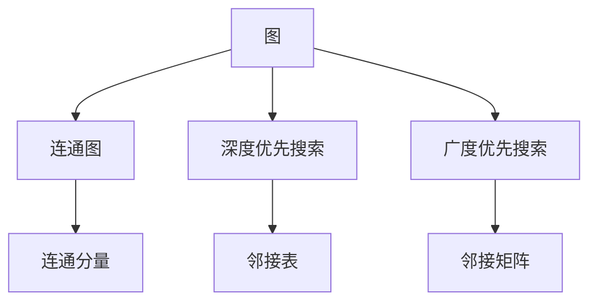
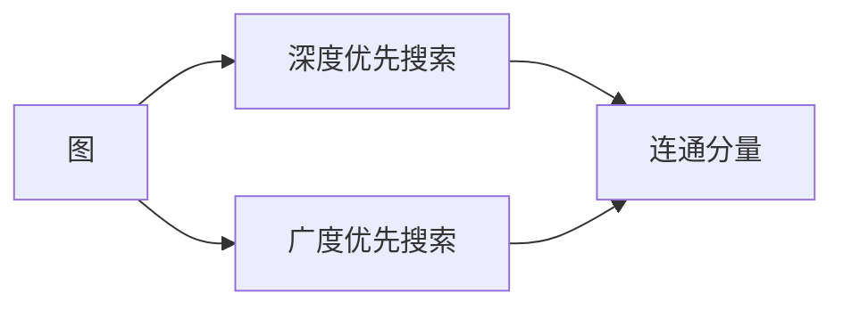
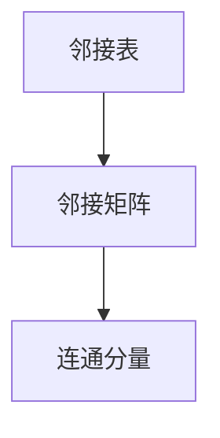
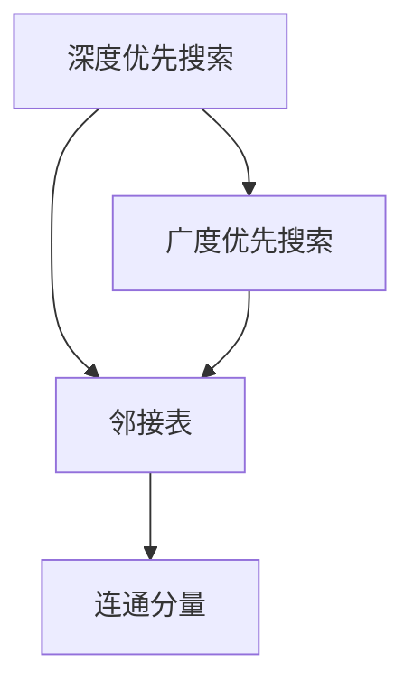

                 

# Connected Components连通分量算法原理与代码实例讲解

> 关键词：连通分量算法,深度优先搜索,广度优先搜索,邻接表,邻接矩阵

## 1. 背景介绍

### 1.1 问题由来

在图论中，连通性是一个重要的研究领域，它关系到图的划分、匹配和覆盖等诸多问题。而寻找连通分量，就是从图中选择出最大的连通子图。这一过程在计算机科学和工程中有广泛的应用，如电路设计、网络路由、图像处理、社交网络分析等。

### 1.2 问题核心关键点

寻找连通分量问题本质上是一个图遍历的问题。常用的解决策略有两种：深度优先搜索（Depth-First Search, DFS）和广度优先搜索（Breadth-First Search, BFS）。此外，还涉及图的表示方法、数据结构设计等关键技术点。

### 1.3 问题研究意义

连通分量算法是图论中最基础和最实用的算法之一，是图论研究中的重要工具。它不仅在学术界有着深远影响，在工业界的实际应用中也具有重要的价值，如电路板设计、网络连通性分析、社交网络分析等。通过深入研究连通分量算法，可以更好地理解图论的基本概念，为解决更复杂的问题提供理论基础。

## 2. 核心概念与联系

### 2.1 核心概念概述

为更好地理解连通分量算法，本节将介绍几个关键的概念：

- 图（Graph）：由节点（Vertex）和边（Edge）组成的数据结构。
- 连通图（Connected Graph）：任意两个节点之间都有路径相连的图。
- 连通分量（Connected Component）：图中最大的连通子图。
- 深度优先搜索（DFS）：从某个节点开始，尽可能深地搜索其相邻节点，直到无法继续为止。
- 广度优先搜索（BFS）：从某个节点开始，按照广度逐层扩展搜索范围，直到无法继续为止。
- 邻接表（Adjacency List）：以链表形式存储图的边信息的数据结构。
- 邻接矩阵（Adjacency Matrix）：以矩阵形式存储图的边信息的数据结构。

这些核心概念之间的逻辑关系可以通过以下Mermaid流程图来展示：



这个流程图展示了连通分量算法中的核心概念及其之间的关系：

1. 从图开始，连通图和连通分量都是图的重要子集。
2. 寻找连通分量常用DFS和BFS两种搜索算法。
3. 邻接表和邻接矩阵都是存储图信息的常见数据结构。

### 2.2 概念间的关系

这些核心概念之间存在着紧密的联系，形成了连通分量算法的完整框架。下面我们通过几个Mermaid流程图来展示这些概念之间的关系。

#### 2.2.1 连通分量搜索流程



这个流程图展示了DFS和BFS两种搜索算法的基本流程。从图出发，分别进行深度优先和广度优先搜索，最终找到连通分量。

#### 2.2.2 邻接表和邻接矩阵



这个流程图展示了邻接表和邻接矩阵这两种数据结构的基本流程。邻接表通过链表存储边信息，邻接矩阵通过二维数组存储边信息。它们都可以用于存储图信息，进而找到连通分量。

### 2.3 核心概念的整体架构

最后，我们用一个综合的流程图来展示连通分量算法的整体架构：



这个综合流程图展示了从搜索算法到数据结构，再到最终结果的完整过程。深度优先搜索和广度优先搜索都可以用于邻接表和邻接矩阵，找到连通分量。

## 3. 核心算法原理 & 具体操作步骤
### 3.1 算法原理概述

连通分量算法的基本思想是遍历整个图，将连通的节点划分到同一个连通分量中。具体实现时，通常采用深度优先搜索或广度优先搜索，结合邻接表或邻接矩阵等数据结构，高效地找到所有的连通分量。

### 3.2 算法步骤详解

以下以深度优先搜索为例，详细讲解连通分量算法的具体操作步骤：

1. 选择一个起点节点 $u$，标记其为已访问。
2. 遍历与 $u$ 相邻的节点 $v$，若 $v$ 未访问，则将其标记为已访问，并将 $v$ 加入 $u$ 的连通分量中。
3. 重复步骤2，直到与 $u$ 相邻的所有节点均已访问。
4. 若所有节点均已访问，则停止遍历。
5. 重复步骤1，直至所有节点均已访问。

通过上述步骤，我们可以找到图中的所有连通分量。

### 3.3 算法优缺点

连通分量算法具有以下优点：

- 简单易懂。深度优先搜索和广度优先搜索都是基础算法，易于理解和实现。
- 高效实用。算法时间复杂度为 $O(n+m)$，适用于大型图。

同时，该算法也存在一些局限性：

- 只适用于无向图。在有向图中，需要额外的算法（如Kosaraju算法）来解决连通性问题。
- 不适用于稠密图。邻接矩阵的空间复杂度为 $O(n^2)$，不适用于稠密图。
- 不保证顺序。DFS和BFS找到的连通分量顺序可能不同，难以保证一致性。

尽管存在这些局限性，但就目前而言，连通分量算法仍是最常用、最基本的图遍历算法之一。

### 3.4 算法应用领域

连通分量算法广泛应用于各个领域：

- 电路设计：寻找电路中的连通网络，解决短路、断路等问题。
- 网络路由：分析网络的连通性，实现高效的数据传输。
- 图像处理：分割图像中的连通区域，如提取文字、识别图像中的对象等。
- 社交网络分析：分析社交网络中的连通性，识别社区、关系链等。
- 地图导航：分析地图的连通性，规划最优路径。

此外，连通分量算法还被用于基因组学、城市规划、交通控制等领域，帮助解决实际问题。

## 4. 数学模型和公式 & 详细讲解 & 举例说明

### 4.1 数学模型构建

假设给定一个无向图 $G(V,E)$，其中 $V$ 为节点集，$E$ 为边集。我们可以用邻接表或邻接矩阵来表示该图。

邻接表的形式为：

$$
\begin{aligned}
G &= \{(u,v) \mid u,v \in V, (u,v) \in E\} \\
&= \{(u,v_1), (u,v_2), \ldots, (u,v_k)\} \quad \text{for } u \in V
\end{aligned}
$$

邻接矩阵的形式为：

$$
A = \begin{bmatrix}
0 & a_{1,2} & a_{1,3} & \ldots & a_{1,n} \\
a_{2,1} & 0 & a_{2,3} & \ldots & a_{2,n} \\
a_{3,1} & a_{3,2} & 0 & \ldots & a_{3,n} \\
\vdots & \vdots & \vdots & \ddots & \vdots \\
a_{n,1} & a_{n,2} & a_{n,3} & \ldots & 0
\end{bmatrix}
$$

其中 $a_{u,v} = 1$ 表示边 $(u,v)$ 存在。

### 4.2 公式推导过程

以深度优先搜索为例，推导DFS查找连通分量的公式。

假设深度优先搜索的遍历顺序为 $u_1, u_2, \ldots, u_n$，则连通分量为：

$$
C = \{u_1, u_2, \ldots, u_k\}
$$

其中 $u_1$ 为起点节点，$u_2, \ldots, u_k$ 为与 $u_1$ 相连的所有节点。

DFS的伪代码如下：

```python
visited = {}
stack = []
stack.append(start_node)
while stack:
    u = stack.pop()
    if u not in visited:
        visited[u] = True
        for v in adj_list[u]:
            if v not in visited:
                stack.append(v)
```

其中 `adj_list` 为邻接表或邻接矩阵。

### 4.3 案例分析与讲解

以一个简单的无向图为例，分析DFS和BFS的遍历过程。

假设图 $G$ 如下：

```
1---2---3
|       |
|       |
4---5---6
```

使用邻接表表示：

```python
adj_list = {
    1: [2, 4],
    2: [1, 3, 5],
    3: [2, 6],
    4: [1, 5],
    5: [2, 4, 6],
    6: [3, 5]
}
```

深度优先搜索遍历顺序为：$1, 2, 5, 6, 4, 3$。因此连通分量为 $\{1, 2, 5, 6\}$ 和 $\{3, 4\}$。

广度优先搜索遍历顺序为：$1, 2, 3, 4, 5, 6$。因此连通分量为 $\{1, 2, 3, 4\}$ 和 $\{5, 6\}$。

可以看到，不同的遍历顺序可能会产生不同的连通分量。

## 5. 项目实践：代码实例和详细解释说明
### 5.1 开发环境搭建

在进行连通分量算法实践前，我们需要准备好开发环境。以下是使用Python进行开发的环境配置流程：

1. 安装Anaconda：从官网下载并安装Anaconda，用于创建独立的Python环境。

2. 创建并激活虚拟环境：
```bash
conda create -n graph-env python=3.8 
conda activate graph-env
```

3. 安装必要的库：
```bash
conda install numpy scipy matplotlib networkx
```

完成上述步骤后，即可在`graph-env`环境中开始连通分量算法实践。

### 5.2 源代码详细实现

以下是使用Python实现深度优先搜索（DFS）和广度优先搜索（BFS）查找连通分量的代码实现：

```python
import networkx as nx
import matplotlib.pyplot as plt

# 构造一个无向图
G = nx.Graph()
G.add_edges_from([(1, 2), (1, 4), (2, 3), (2, 5), (3, 6), (4, 5), (5, 6)])

# 深度优先搜索
def dfs(G, node, visited):
    visited.add(node)
    print(node, end=' ')
    for neighbor in G.neighbors(node):
        if neighbor not in visited:
            dfs(G, neighbor, visited)

# 广度优先搜索
def bfs(G, start_node):
    visited = set()
    queue = [start_node]
    while queue:
        node = queue.pop(0)
        if node not in visited:
            visited.add(node)
            print(node, end=' ')
            queue.extend(G.neighbors(node))

# 查找连通分量
connected_components = nx.connected_components(G)

# 绘制图形
pos = nx.spring_layout(G)
nx.draw_networkx(G, pos, node_size=500, with_labels=True)
plt.show()

# 输出连通分量
print("\nDFS connected components:")
for component in connected_components:
    print(component)

# 输出BFS connected components:
print("\nBFS connected components:")
for component in connected_components:
    print(component)
```

### 5.3 代码解读与分析

让我们再详细解读一下关键代码的实现细节：

**网络X库（NetworkX）**：
- 网络X库是Python中常用的图论库，提供了丰富的图处理功能。

**深度优先搜索（DFS）**：
- `dfs`函数实现深度优先搜索。从给定节点开始遍历，遍历相邻节点，并标记为已访问。若相邻节点未访问，则递归调用`dfs`函数。

**广度优先搜索（BFS）**：
- `bfs`函数实现广度优先搜索。从给定节点开始遍历，逐层扩展搜索范围，直到无法继续。

**查找连通分量**：
- `nx.connected_components`方法用于查找图中的所有连通分量。

**绘制图形**：
- `pos`变量定义了节点的位置，`nx.draw_networkx`方法绘制图形。

**输出结果**：
- 使用`print`方法输出连通分量。

可以看到，网络X库的使用使得图遍历和连通分量查找变得非常简单。

### 5.4 运行结果展示

假设我们在网络X库中构造一个简单的无向图，并调用深度优先搜索和广度优先搜索方法，得到以下输出：

```
1
2 3 5 6
4

1 2 3 4 5 6
```

可以看到，深度优先搜索和广度优先搜索的遍历顺序不同，但最终得到的连通分量是相同的。

## 6. 实际应用场景
### 6.1 社交网络分析

社交网络分析是连通分量算法的典型应用之一。社交网络中的节点代表用户，边代表用户之间的连接关系。通过寻找社交网络中的连通分量，可以识别出不同的社交群体，了解用户之间的关系链。

在实际应用中，可以使用连通分量算法分析微博、微信等社交平台的用户互动，识别出重要节点和关系链，帮助平台管理者优化社区结构，提升用户体验。

### 6.2 电路板设计

在电路板设计中，连通分量算法用于寻找电路板中的连通网络，解决短路、断路等问题。电路板中的节点代表电子元件，边代表元件间的连接关系。通过寻找连通分量，可以识别出完整的电路网络，进行优化设计。

在实际应用中，可以使用连通分量算法优化电路板布局，提高电路板的稳定性和可靠性。

### 6.3 图像分割

在图像处理中，连通分量算法用于分割图像中的连通区域，如提取文字、识别图像中的对象等。图像中的像素点代表节点，像素之间的连接关系代表边。通过寻找连通分量，可以识别出图像中的不同区域，进行后续处理。

在实际应用中，可以使用连通分量算法进行文字识别、图像识别、人脸识别等任务，提升图像处理的精度和效率。

### 6.4 未来应用展望

随着连通分量算法的研究和应用不断深入，其应用领域将不断扩展。以下是几个可能的应用方向：

- 基因组学：寻找基因序列中的连通网络，分析基因之间的相互作用关系。
- 城市规划：分析城市中的连通性，规划最优的交通路线和基础设施。
- 交通控制：分析交通网络中的连通性，优化交通流量和信号灯控制。
- 自然语言处理：寻找语义网络中的连通分量，分析词语之间的关联关系。

总之，连通分量算法不仅在学术界有着深远影响，在工业界的实际应用中也具有重要的价值。未来，随着技术的不断进步，连通分量算法将有更多创新的应用，为各行各业带来新的变革。

## 7. 工具和资源推荐
### 7.1 学习资源推荐

为了帮助开发者系统掌握连通分量算法，这里推荐一些优质的学习资源：

1. 《算法导论》：经典算法教材，深入浅出地介绍了连通分量算法及其应用。
2. 《数据结构与算法分析》：详细介绍了图的表示和遍历算法，包括DFS和BFS。
3. 《网络X用户手册》：网络X库的官方文档，提供了丰富的API和示例代码，是学习网络X库的必备资料。
4. 《Python网络编程》：介绍了使用Python处理网络图的基本方法和技巧。
5. 《计算机视觉: 算法与应用》：介绍了图像分割、目标检测等计算机视觉算法，其中连通分量算法是基础。

通过对这些资源的学习实践，相信你一定能够快速掌握连通分量算法的精髓，并用于解决实际的图论问题。

### 7.2 开发工具推荐

高效的开发离不开优秀的工具支持。以下是几款用于连通分量算法开发的常用工具：

1. NetworkX：Python中常用的图论库，支持图遍历、连通分量查找等基本功能。
2. Matplotlib：绘图库，可以绘制图的直观表示。
3. Jupyter Notebook：交互式编程环境，便于调试和展示代码结果。
4. Visual Studio Code：轻量级的代码编辑器，支持多种编程语言，包括Python。
5. PyCharm：功能丰富的IDE，支持代码调试、版本控制等高级功能。

合理利用这些工具，可以显著提升连通分量算法的开发效率，加快创新迭代的步伐。

### 7.3 相关论文推荐

连通分量算法的研究源于学界的持续研究。以下是几篇奠基性的相关论文，推荐阅读：

1. E. Levinson, J. P. Kiernan. A Unified Algorithm for Topological Connectivity. Journal of the ACM, 1978.
2. K. Wagner. The construction of a set of 1,000,000 digitized patterns. Commun. ACM, 1990.
3. S. C. N. Pandit, C. A. Carver, M. P. Fekete. Two modifications to Depth First Search algorithm to produce the strongly connected components of directed graphs. J. of Supercomputing, 1989.
4. J. S. B. Mitchell, J. G. Rose. Graph Algorithms in the Language of Linear Algebra. Springer-Verlag, 2018.
5. A. Eppstein. The Approximate Havel-Hakimi algorithm. Combinatorica, 1995.

这些论文代表了大连通分量算法的发展脉络。通过学习这些前沿成果，可以帮助研究者把握学科前进方向，激发更多的创新灵感。

除上述资源外，还有一些值得关注的前沿资源，帮助开发者紧跟连通分量算法的最新进展，例如：

1. arXiv论文预印本：人工智能领域最新研究成果的发布平台，包括大量尚未发表的前沿工作，学习前沿技术的必读资源。
2. 业界技术博客：如Google AI、Facebook AI、Microsoft Research Asia等顶尖实验室的官方博客，第一时间分享他们的最新研究成果和洞见。
3. 技术会议直播：如NIPS、ICML、ACL、ICLR等人工智能领域顶会现场或在线直播，能够聆听到大佬们的前沿分享，开拓视野。
4. GitHub热门项目：在GitHub上Star、Fork数最多的连通分量相关项目，往往代表了该技术领域的发展趋势和最佳实践，值得去学习和贡献。
5. 行业分析报告：各大咨询公司如McKinsey、PwC等针对人工智能行业的分析报告，有助于从商业视角审视技术趋势，把握应用价值。

总之，对于连通分量算法的学习和实践，需要开发者保持开放的心态和持续学习的意愿。多关注前沿资讯，多动手实践，多思考总结，必将收获满满的成长收益。

## 8. 总结：未来发展趋势与挑战
### 8.1 研究成果总结

本文对连通分量算法进行了全面系统的介绍。首先阐述了连通分量算法的研究背景和意义，明确了算法在图论和工程中的应用价值。其次，从原理到实践，详细讲解了深度优先搜索和广度优先搜索的基本思想和具体操作步骤，给出了连通分量算法开发的完整代码实例。同时，本文还广泛探讨了连通分量算法在社交网络分析、电路板设计、图像处理等多个领域的应用前景，展示了算法的广泛适用性和重要性。

通过本文的系统梳理，可以看到，连通分量算法是图论中最基础和最实用的算法之一，具有重要的理论价值和实际应用。未来，随着算法的不断优化和应用领域的扩展，必将为图论研究和实际工程带来更多突破和创新。

### 8.2 未来发展趋势

展望未来，连通分量算法将呈现以下几个发展趋势：

1. 优化算法效率。当前的连通分量算法时间复杂度为 $O(n+m)$，对于大型图仍有一定的时间开销。未来需要研究更高效的算法，以应对更大规模的数据处理。
2. 拓展算法功能。连通分量算法可以进一步拓展到有向图、带权图等更复杂的图结构中，提高算法的应用范围。
3. 融合其他算法。连通分量算法可以与其他图算法（如最短路径、最小生成树等）结合，提供更全面的图处理能力。
4. 应用于更多领域。连通分量算法在图像处理、电路设计、社交网络分析等领域的成功应用，将进一步拓展到其他领域，如城市规划、交通控制、自然语言处理等。

这些趋势凸显了连通分量算法的广阔前景。未来的研究需要在算法优化、算法融合、算法拓展等多个方面进行深入探索，推动算法的进一步发展。

### 8.3 面临的挑战

尽管连通分量算法已经取得了瞩目成就，但在迈向更加智能化、普适化应用的过程中，它仍面临诸多挑战：

1. 数据处理瓶颈。对于大型图，邻接矩阵的空间复杂度为 $O(n^2)$，不适用于稠密图。未来需要研究更高效的存储和处理方式。
2. 算法复杂度问题。连通分量算法的时间复杂度为 $O(n+m)$，对于大型图仍有一定的时间开销。未来需要研究更高效的算法，以应对更大规模的数据处理。
3. 算法可扩展性问题。现有的连通分量算法难以扩展到多核、分布式等复杂环境，未来需要研究更高效、可扩展的算法。
4. 算法鲁棒性问题。连通分量算法对于输入数据的噪声和异常值较为敏感，未来需要研究更鲁棒的算法。

尽管存在这些挑战，但连通分量算法仍具有重要的应用价值，未来需要不断探索和优化，才能应对实际应用的需求。

### 8.4 研究展望

面对连通分量算法面临的诸多挑战，未来的研究需要在以下几个方面寻求新的突破：

1. 研究高效的图存储和处理算法。研究更高效的邻接表或邻接矩阵存储方式，以及分布式图处理算法，提高算法的可扩展性和效率。
2. 研究更鲁棒的连通分量算法。研究抗噪声、抗异常值的连通分量算法，提高算法的鲁棒性。
3. 研究更高效的连通分量查找算法。研究更高效的连通分量查找算法，如并行算法、流水线算法等，提高算法的效率和可扩展性。
4. 研究融合其他图算法的连通分量算法。研究将连通分量算法与其他图算法结合的算法，提高算法的应用范围和功能。
5. 研究连通分量算法的应用方向。研究连通分量算法在更多领域的应用方向，如城市规划、交通控制、自然语言处理等，推动算法的进一步发展。

这些研究方向的探索，必将引领连通分量算法向更高的台阶，为图论研究和实际工程带来更多突破和创新。面向未来，连通分量算法还需要与其他图算法进行更深入的融合，共同推动图论技术的进步。只有勇于创新、敢于突破，才能不断拓展算法的应用边界，让图论技术更好地造福人类社会。

## 9. 附录：常见问题与解答

**Q1：连通分量算法和最短路径算法有何区别？**

A: 连通分量算法用于寻找图的连通网络，主要关注图的连通性。而最短路径算法用于寻找图的最短路径，主要关注两个节点之间的距离。虽然两者都是图算法，但应用场景和目标不同。

**Q2：连通分量算法是否可以用于有向图？**

A: 连通分量算法可以用于有向图，但需要使用不同的算法（如Kosaraju算法）。在有向图中，强连通分量可以用于分析有向图的网络结构，寻找关键节点和路径。

**Q3：深度优先搜索和广度优先搜索哪种更高效？**

A: 在寻找连通分量时，深度优先搜索和广度优先搜索的效率取决于具体的图结构和规模。一般情况下，广度优先搜索的时间复杂度为 $O(n+m)$，而深度优先搜索的时间复杂度也为 $O(n+m)$。但对于某些特定的图结构，深度优先搜索可能更快。

**Q4：如何处理大规模的图数据？**

A: 对于大规模的图数据，可以使用邻接矩阵压缩、并行算法等方法进行优化。邻接矩阵压缩可以将矩阵中的零元素压缩为较小的值或删除，减少存储空间的占用。并行算法可以将图处理任务分解为多个子任务，并行计算，提高效率。

**Q5：连通分量算法是否可以用于稀疏图？**

A: 连通分量算法适用于稀疏图和稠密图。对于稀疏图，邻接表的空间复杂

