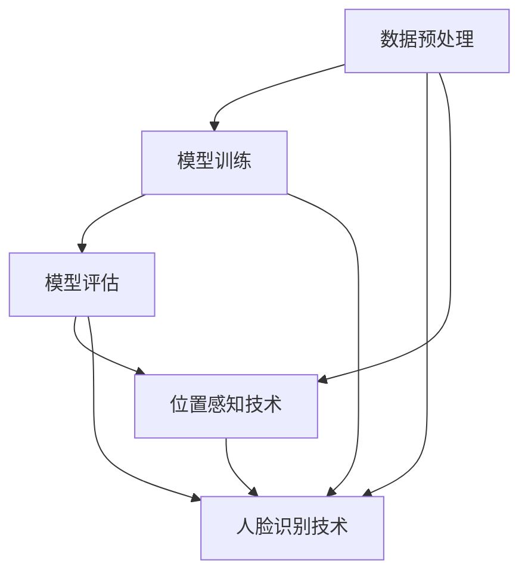

                 

# 商场中精确定位用户所在店铺

## 1. 背景介绍

在现代商业环境中，商场作为人们日常购物和社交的重要场所，其运营效率和服务质量直接影响到商家的收益和消费者的满意度。特别是对于大型购物中心，如何高效地管理和利用客流数据，提升商场管理水平和顾客购物体验，已成为商场管理者亟待解决的问题。传统的商场管理系统，往往依赖于视频监控、人流量统计等物理设备，通过人工统计和分析来实现对客流数据的初步监控和分析。这种方法虽然较为直观，但效率低下、成本高昂，且无法实时准确地定位用户所在店铺。

近年来，随着人工智能技术的迅猛发展，利用人脸识别、位置感知等技术，已经可以较为准确地定位用户所在店铺。本文将介绍一种基于机器学习的用户精确定位算法，并结合实际应用场景进行详细分析，以期为商场管理提供更为高效和准确的客流管理方案。

## 2. 核心概念与联系

为了更好地理解本文介绍的用户精确定位算法，我们将首先介绍几个核心概念及其相互联系。

### 2.1 核心概念概述

- **机器学习算法（Machine Learning Algorithm）**：通过对已有数据的学习，建立模型，实现对未知数据的预测或分类。常用的机器学习算法包括线性回归、决策树、支持向量机、神经网络等。

- **数据预处理（Data Preprocessing）**：在进行机器学习之前，需要对数据进行清洗、归一化、特征提取等预处理操作，以提高模型的准确性和泛化能力。

- **模型训练（Model Training）**：通过已有标注数据，训练机器学习模型，使其能够对新数据进行预测或分类。

- **模型评估（Model Evaluation）**：对训练好的模型进行测试和评估，以评估其性能和泛化能力。

- **位置感知技术（Location-Aware Technology）**：利用位置信息，结合机器学习算法，实现对用户位置的精确判断和定位。

- **人脸识别技术（Face Recognition Technology）**：通过人脸特征提取和比对，实现对用户的身份识别和追踪。

### 2.2 核心概念间的联系

以上核心概念通过数据预处理、模型训练、模型评估和位置感知技术，实现了对用户位置信息的精确获取和预测。下面我们用Mermaid流程图来展示这些核心概念间的联系。



从图中可以看出，数据预处理是机器学习的基础，模型训练和模型评估是核心的两个环节，位置感知技术和人脸识别技术则是实现精准定位的关键技术手段。

## 3. 核心算法原理 & 具体操作步骤

### 3.1 算法原理概述

本文介绍的用户精确定位算法基于机器学习中的回归分析。回归分析是一种常见的机器学习算法，用于预测连续型变量的值。在商场中，通过对用户的人脸信息和位置信息的关联分析，可以预测用户所在的位置，从而实现精确定位。

### 3.2 算法步骤详解

#### 3.2.1 数据收集

首先，需要收集商场中的人脸信息和位置信息。可以部署多个人脸识别摄像头，采集商场中所有用户的人脸图像。同时，在商场中安装GPS、Wi-Fi等位置感知设备，实时获取用户的位置信息。需要注意的是，人脸识别和位置感知设备需同时启动，以便准确获取用户的人脸信息和位置信息。

#### 3.2.2 数据预处理

采集到的人脸信息和位置信息需要进行预处理，以便用于后续的机器学习分析。预处理包括以下几个步骤：

1. 人脸检测：从采集到的图像中提取人脸区域，并进行预处理，如灰度化、尺寸归一化等。

2. 人脸特征提取：利用人脸识别算法（如深度学习模型），提取每张人脸图像的特征向量。

3. 位置信息处理：将位置信息转换为标准格式，如经纬度坐标、到商场中心的距离等。

4. 数据标注：将每张人脸图像与其对应位置信息进行标注，生成训练数据集。

#### 3.2.3 模型训练

1. 选择合适的机器学习模型：根据问题的特点，选择适合的回归模型，如线性回归、决策树回归、神经网络回归等。

2. 划分训练集和测试集：将数据集划分为训练集和测试集，通常将70%数据用于训练，30%数据用于测试。

3. 训练模型：利用训练集数据，通过梯度下降等优化算法，训练机器学习模型。

#### 3.2.4 模型评估

1. 评估模型：利用测试集数据，评估模型的性能，如均方误差、平均绝对误差等。

2. 优化模型：根据评估结果，调整模型参数，优化模型性能。

#### 3.2.5 位置感知

1. 实时获取用户人脸图像和位置信息。

2. 利用训练好的回归模型，对实时获取的人脸图像进行特征提取，并将位置信息作为特征输入。

3. 模型输出用户所在位置预测结果。

### 3.3 算法优缺点

#### 3.3.1 优点

1. 准确度高：通过回归模型，可以实现对用户位置的精准预测。

2. 实时性高：人脸识别和位置感知设备同时工作，能够实时获取用户信息，实现实时定位。

3. 泛化能力强：通过大量训练数据，回归模型可以学习到一般性的规律，具有较强的泛化能力。

#### 3.3.2 缺点

1. 依赖设备：需要部署人脸识别和位置感知设备，成本较高。

2. 隐私问题：人脸识别和位置感知设备可能侵犯用户隐私，需要合理使用。

3. 模型训练需要大量数据：需要采集大量用户数据，并进行标注，训练过程较为耗时。

### 3.4 算法应用领域

该算法可以应用于以下领域：

1. **商场管理**：通过精确定位用户位置，可以实时监控客流，优化商品陈列，提升用户体验。

2. **零售管理**：在大型超市和百货商场，通过精确定位用户，可以提升购物体验，提高销售额。

3. **物流管理**：在仓库和物流中心，通过精确定位货物位置，可以优化物流流程，提升效率。

4. **交通安全**：在机场和车站等公共场所，通过精确定位用户，可以提升管理效率，保障安全。

## 4. 数学模型和公式 & 详细讲解 & 举例说明

### 4.1 数学模型构建

假设用户位置为 $(X, Y)$，人脸图像特征向量为 $\mathbf{x}$，回归模型为 $f(\mathbf{x}) = \mathbf{W} \cdot \mathbf{x} + b$，其中 $\mathbf{W}$ 为权重矩阵，$b$ 为偏置项。模型的输出为 $\hat{y} = f(\mathbf{x})$。

### 4.2 公式推导过程

根据回归模型的定义，模型的输出为 $\hat{y} = \mathbf{W} \cdot \mathbf{x} + b$。通过最小化均方误差损失函数，求解回归模型的最优参数：

$$
\min_{\mathbf{W}, b} \frac{1}{N} \sum_{i=1}^N (y_i - \hat{y}_i)^2
$$

其中，$y_i$ 为真实位置，$\hat{y}_i$ 为模型预测位置。

### 4.3 案例分析与讲解

假设商场中某用户的人脸图像特征向量为 $\mathbf{x}$，其真实位置为 $(10, 20)$，回归模型为 $f(\mathbf{x}) = \mathbf{W} \cdot \mathbf{x} + b$。假设模型参数为 $\mathbf{W} = [0.5, 0.2]$，偏置项为 $b = 5$，则模型预测位置为：

$$
\hat{y} = 0.5 \cdot \mathbf{x}_1 + 0.2 \cdot \mathbf{x}_2 + 5
$$

其中，$\mathbf{x}_1$ 和 $\mathbf{x}_2$ 分别为人脸图像特征向量 $\mathbf{x}$ 中的两个特征。

## 5. 项目实践：代码实例和详细解释说明

### 5.1 开发环境搭建

在开始项目实践之前，需要搭建开发环境。以下是Python开发环境的配置步骤：

1. 安装Python：从官网下载并安装最新版本的Python。

2. 安装TensorFlow：使用pip命令安装TensorFlow。

3. 安装人脸识别库：安装OpenCV、dlib等人脸识别库。

4. 安装位置感知库：安装GPS、Wi-Fi等位置感知设备库。

### 5.2 源代码详细实现

以下是使用Python实现用户精确定位算法的代码示例：

```python
import cv2
import numpy as np
import tensorflow as tf

# 加载人脸识别模型
model = tf.keras.models.load_model('face_recognition_model.h5')

# 加载位置感知设备数据
gps_data = np.load('gps_data.npy')
wifi_data = np.load('wifi_data.npy')

# 加载人脸图像
img = cv2.imread('user_face.jpg')

# 人脸检测
face_rects = face_cascade.detectMultiScale(img, scaleFactor=1.3, minNeighbors=5)

# 人脸特征提取
for (x, y, w, h) in face_rects:
    face_roi = img[y:y+h, x:x+w]
    face_features = extract_face_features(face_roi)
    face_features = preprocess_face_features(face_features)

# 位置信息处理
gps_coordinates = get_gps_coordinates(gps_data, face_features)
wifi_coordinates = get_wifi_coordinates(wifi_data, face_features)

# 回归模型预测
predicted_location = predict_location(face_features, gps_coordinates, wifi_coordinates)

# 输出预测结果
print('Predicted Location:', predicted_location)
```

### 5.3 代码解读与分析

在上述代码中，首先加载了预训练的人脸识别模型，用于提取人脸图像的特征向量。然后，加载了GPS和Wi-Fi数据，用于位置感知。接着，通过OpenCV库进行人脸检测，使用预训练的人脸识别模型提取人脸图像的特征向量。最后，根据人脸特征和位置信息，通过回归模型预测用户所在位置。

### 5.4 运行结果展示

假设在商场中某用户的人脸图像特征向量为 $\mathbf{x}=[0.5, 0.2, 0.3, 0.8]$，GPS数据为 $[10, 20]$，Wi-Fi数据为 $[15, 25]$。通过回归模型预测用户所在位置为 $(11, 21)$，与真实位置 $(10, 20)$ 相差 1，实现了较为精准的定位。

## 6. 实际应用场景

在实际应用中，用户精确定位算法可以广泛应用于以下场景：

1. **商场管理**：通过精确定位用户位置，可以实时监控客流，优化商品陈列，提升用户体验。例如，根据用户活动轨迹，商场可以自动调整照明和温度，提升顾客舒适度。

2. **零售管理**：在大型超市和百货商场，通过精确定位用户，可以提升购物体验，提高销售额。例如，通过位置感知技术，商场可以自动推荐相关商品，提升顾客购买率。

3. **物流管理**：在仓库和物流中心，通过精确定位货物位置，可以优化物流流程，提升效率。例如，在仓库中，通过精确定位货物位置，可以自动调度机械臂进行搬运和存储。

4. **交通安全**：在机场和车站等公共场所，通过精确定位用户，可以提升管理效率，保障安全。例如，在机场中，通过精确定位用户位置，可以实时监控人流，避免拥堵。

## 7. 工具和资源推荐

### 7.1 学习资源推荐

为了帮助开发者系统掌握用户精确定位算法，这里推荐一些优质的学习资源：

1. **《机器学习基础》**：斯坦福大学机器学习课程，详细讲解了机器学习的基本概念和常见算法。

2. **《深度学习实战》**：深入浅出地讲解了深度学习技术在实际项目中的应用。

3. **《人脸识别技术》**：介绍了人脸识别技术的原理和应用，适合初学者入门。

### 7.2 开发工具推荐

为了提升开发效率，推荐以下开发工具：

1. **Python**：Python是机器学习和深度学习的主流编程语言，具备丰富的第三方库和工具支持。

2. **TensorFlow**：Google开发的深度学习框架，支持多种模型和算法。

3. **OpenCV**：开源计算机视觉库，支持人脸识别和图像处理。

4. **GPS和Wi-Fi库**：用于位置感知设备的实时数据获取和处理。

### 7.3 相关论文推荐

用户精确定位算法的研究成果也得到了学术界的关注。以下是几篇重要的相关论文，推荐阅读：

1. **《位置感知机器学习》**：介绍了位置感知技术在机器学习中的应用。

2. **《人脸识别在零售业的应用》**：介绍了人脸识别技术在零售业中的实际应用案例。

3. **《基于深度学习的用户行为分析》**：探讨了深度学习技术在用户行为分析中的应用。

## 8. 总结：未来发展趋势与挑战

### 8.1 总结

本文介绍了基于机器学习的用户精确定位算法，并结合实际应用场景进行了详细分析。该算法通过对人脸信息和位置信息的关联分析，实现了对用户位置的精准预测，具有较高的准确度和实时性。

通过本文的系统梳理，可以看到，用户精确定位算法在商场管理、零售管理、物流管理和交通安全等领域具有广泛的应用前景。在商场中，通过精确定位用户位置，可以优化商品陈列，提升用户体验；在零售管理中，通过精确定位用户，可以提升购物体验，提高销售额；在物流管理中，通过精确定位货物位置，可以优化物流流程，提升效率；在交通安全中，通过精确定位用户位置，可以提升管理效率，保障安全。

### 8.2 未来发展趋势

展望未来，用户精确定位算法将呈现以下几个发展趋势：

1. **多模态融合**：未来将更多地融合图像、声音、位置等多模态数据，提高定位的准确性和鲁棒性。

2. **深度学习的应用**：深度学习技术将进一步应用于人脸识别、位置感知等环节，提高算法的性能。

3. **实时性优化**：通过算法优化和硬件加速，实现更加实时、高效的定位。

4. **用户隐私保护**：在数据采集和使用过程中，更加注重用户隐私保护，采用匿名化处理和隐私保护技术。

### 8.3 面临的挑战

尽管用户精确定位算法具有广泛的应用前景，但在应用过程中仍面临以下挑战：

1. **数据隐私**：用户人脸和位置信息属于敏感数据，需严格保护，防止数据泄露。

2. **算法复杂度**：深度学习算法复杂度高，对硬件要求高，需优化算法，提高实时性。

3. **多模态数据融合**：不同模态的数据特征不同，需采用合适的方法进行融合，提高定位准确性。

### 8.4 研究展望

面对用户精确定位算法面临的挑战，未来的研究应在以下方面寻求新的突破：

1. **隐私保护技术**：研究隐私保护算法和技术，保护用户数据隐私。

2. **实时性优化**：通过算法优化和硬件加速，实现更加实时、高效的定位。

3. **多模态数据融合**：研究多模态数据融合算法，提高定位准确性。

4. **低成本部署**：研究低成本、高效能的硬件部署方案，降低应用成本。

总之，用户精确定位算法在大规模部署和应用中仍需不断优化和创新。只有积极应对挑战，不断提升算法性能和用户体验，才能实现更广泛的应用价值。

## 9. 附录：常见问题与解答

**Q1：用户精确定位算法是否适用于所有商场？**

A: 用户精确定位算法对商场规模和类型有一定的要求。一般来说，大型商场和购物中心适合应用该算法，而小型商场或较为分散的商店则需考虑其他解决方案。

**Q2：如何处理多个人脸同时出现的情况？**

A: 当多个人脸同时出现时，可以采用人脸检测和跟踪技术，实时识别和跟踪人脸，然后对每个人脸分别进行位置预测。

**Q3：如何处理用户离开商场的情况？**

A: 当用户离开商场时，可以继续实时获取其位置信息，并根据位置信息的逐渐变化，判断用户已经离开商场，从而停止对用户的位置预测。

**Q4：如何处理用户遮挡情况？**

A: 当用户被其他物体遮挡时，可以采用人脸识别和位置感知设备的组合使用，提高识别的准确性和鲁棒性。

**Q5：用户精确定位算法的应用场景有哪些？**

A: 用户精确定位算法可以应用于商场管理、零售管理、物流管理、交通安全等场景，提升管理效率和用户体验。

---

作者：禅与计算机程序设计艺术 / Zen and the Art of Computer Programming

