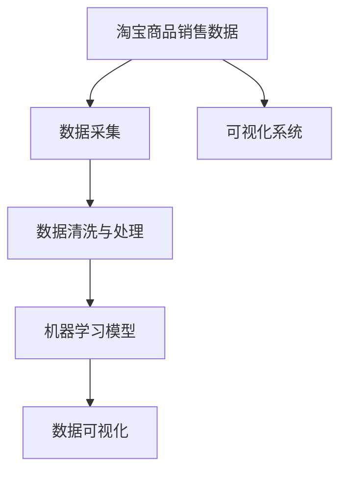

                 

# 基于Python爬虫的淘宝商品销售量分析和可视化系统实现

> 关键词：Python爬虫,淘宝数据采集,商品销售量分析,可视化系统,数据清洗与处理,机器学习,数据可视化

## 1. 背景介绍

### 1.1 问题由来

随着互联网经济的快速发展，电商平台已成为消费者购物的重要渠道。淘宝作为全球领先的电商平台之一，汇聚了数以亿计的商家和消费者，其庞大的交易数据对商业分析和市场研究具有极高的价值。然而，淘宝平台的数据获取通常受限于官方API的使用限制，难以获取全面详尽的商品销售数据。

本项目旨在利用Python爬虫技术，爬取淘宝商品销售数据，并进行分析和可视化展示，为商家和市场研究人员提供有价值的参考。通过本项目，用户能够实时了解各大商家的商品销售情况，掌握市场趋势，制定精准的营销策略，从而在激烈的市场竞争中占据有利位置。

### 1.2 问题核心关键点

本项目聚焦于以下几个核心关键点：

- **淘宝商品销售数据分析**：利用Python爬虫技术获取淘宝商品销售数据，并进行清洗、处理和分析。
- **可视化系统实现**：使用Python的数据可视化库，如Matplotlib、Seaborn、Plotly等，将分析结果进行可视化展示。
- **数据处理与分析**：对采集到的数据进行预处理，去除噪声和异常值，提取有用信息，如销售量、价格、用户评价等。
- **机器学习模型应用**：基于机器学习算法，如线性回归、决策树、随机森林等，对销售数据进行预测分析。
- **数据存储与查询**：将分析结果存储在数据库中，并提供便捷的查询接口，供用户快速检索和展示。

## 2. 核心概念与联系

### 2.1 核心概念概述

为更好地理解本项目的核心概念，本节将介绍几个关键概念及其相互联系：

- **Python爬虫**：一种基于Python编写的自动化数据抓取工具，能够从指定网站获取数据，支持网页解析、数据存储等功能。
- **淘宝商品销售数据**：指淘宝平台上商品的交易记录，包括商品名称、价格、销售量、用户评价等信息。
- **数据清洗与处理**：对原始数据进行预处理，去除无用信息，填补缺失值，标准化数据格式，提高数据质量。
- **机器学习模型**：一种基于统计学原理的算法，通过学习大量数据，发现数据之间的关系，实现数据预测、分类等任务。
- **数据可视化**：使用图表、图形等形式，将数据转换为直观的视觉展示，帮助用户理解和分析数据。

这些核心概念通过一个合成的流程链相互连接，从数据采集、预处理、分析、预测到可视化展示，形成了一个完整的系统流程。

### 2.2 概念间的关系

以下是一个简化的Mermaid流程图，展示上述核心概念之间的关系：



这个流程图展示了从数据采集到可视化展示的完整流程。

## 3. 核心算法原理 & 具体操作步骤

### 3.1 算法原理概述

本项目主要包括以下几个核心算法和具体操作步骤：

- **数据爬取算法**：利用Python爬虫技术，从淘宝网站抓取商品销售数据。
- **数据清洗算法**：对抓取到的数据进行预处理，包括去除无用信息、填补缺失值、标准化数据格式等。
- **机器学习算法**：基于机器学习模型，对销售数据进行预测分析，如线性回归、决策树、随机森林等。
- **数据可视化算法**：使用Matplotlib、Seaborn、Plotly等库，将分析结果进行图表展示。

### 3.2 算法步骤详解

以下是详细的操作步骤：

#### 3.2.1 数据爬取

1. **爬虫框架选择**：选择Scrapy作为爬虫框架，支持异步请求和分布式抓取。
2. **爬虫模块设计**：设计爬虫模块，包括请求队列、URL解析、数据存储等功能。
3. **数据采集**：通过Scrapy爬虫，定期抓取淘宝商品销售数据，存储到本地或数据库中。

#### 3.2.2 数据清洗与处理

1. **数据预处理**：对采集到的数据进行初步清洗，包括去除HTML标签、解析JSON格式数据等。
2. **数据标准化**：对不同来源的数据进行格式标准化，统一为标准格式。
3. **缺失值处理**：填补缺失值，如均值填充、中位数填充等。
4. **异常值检测**：检测和处理异常值，如离群值检测、替换等。

#### 3.2.3 机器学习模型

1. **数据分割**：将数据集分为训练集和测试集，用于模型训练和评估。
2. **模型训练**：选择合适的机器学习模型，如线性回归、决策树、随机森林等，进行模型训练。
3. **模型评估**：使用评估指标如均方误差(MSE)、决定系数(R²)等，评估模型的预测性能。
4. **模型调优**：通过调整超参数，如正则化系数、学习率等，优化模型性能。

#### 3.2.4 数据可视化

1. **数据展示**：使用Matplotlib、Seaborn、Plotly等库，绘制图表，如柱状图、折线图、散点图等。
2. **交互式展示**：实现交互式可视化，如动态变化、点击互动等，增强用户体验。
3. **仪表盘设计**：设计交互式仪表盘，将多个图表组合在一起，提供综合展示。

### 3.3 算法优缺点

#### 3.3.1 优点

- **自动化数据采集**：Python爬虫技术能够自动获取淘宝商品销售数据，节省人力成本。
- **数据清洗高效**：数据清洗算法能够快速处理大量数据，提高数据质量。
- **机器学习准确**：基于机器学习模型，能够进行准确的数据预测和分析。
- **可视化直观**：数据可视化算法能够将复杂数据转换为直观的图表展示，便于理解和分析。

#### 3.3.2 缺点

- **数据隐私风险**：爬取和处理淘宝数据可能涉及隐私问题，需注意合规性。
- **网站反爬虫策略**：淘宝网站可能采取反爬虫措施，限制爬虫行为。
- **数据存储容量**：大量数据存储和处理可能需要较大的存储空间和计算资源。
- **模型过拟合风险**：模型在训练时可能出现过拟合，需进行调优。

### 3.4 算法应用领域

本项目在电商数据分析、市场趋势预测、销售策略制定等多个领域具有广泛应用前景。例如：

- **电商数据分析**：为商家提供商品销售情况，帮助其优化产品策略。
- **市场趋势预测**：分析市场趋势，指导商家制定精准的营销策略。
- **销售策略制定**：通过预测分析，指导商家调整销售策略，提高销售额。
- **客户行为分析**：分析客户购买行为，了解客户需求，提升用户体验。

## 4. 数学模型和公式 & 详细讲解 & 举例说明

### 4.1 数学模型构建

本项目主要涉及以下数学模型：

- **数据清洗与处理模型**：包括数据预处理、缺失值填补、异常值检测等，通过数学方法实现。
- **机器学习模型**：如线性回归模型、决策树模型、随机森林模型等。

### 4.2 公式推导过程

#### 4.2.1 线性回归模型

线性回归模型用于预测销售量与价格之间的关系。假设数据集为 $(x_i, y_i)$，其中 $x_i$ 为价格，$y_i$ 为销售量。线性回归模型公式为：

$$
y_i = \beta_0 + \beta_1x_i + \epsilon_i
$$

其中 $\beta_0$ 和 $\beta_1$ 为模型参数，$\epsilon_i$ 为误差项。

最小二乘法用于求解模型参数，公式为：

$$
\beta_0 = \frac{\sum_{i=1}^n (y_i - \hat{y}_i)}{n}, \quad \beta_1 = \frac{\sum_{i=1}^n (x_i - \bar{x})(y_i - \bar{y})}{\sum_{i=1}^n (x_i - \bar{x})^2}
$$

#### 4.2.2 决策树模型

决策树模型用于分类预测，假设数据集为 $(x_i, y_i)$，其中 $x_i$ 为特征，$y_i$ 为类别标签。决策树模型通过树形结构进行分类，公式为：

$$
\begin{aligned}
\text{Tree}(x_i) = \left\{
\begin{array}{ll}
\text{Leaf}, & \text{if} \quad x_i \in \text{Leaf} \\
\text{Tree}(x_i'), & \text{if} \quad x_i \in \text{Node} \\
\end{array}
\right.
\end{aligned}
$$

其中，$\text{Leaf}$ 为叶子节点，$\text{Node}$ 为非叶子节点。

### 4.3 案例分析与讲解

#### 4.3.1 数据清洗案例

假设我们采集到了以下数据：

| 商品编号 | 商品名称 | 价格 | 销售量 |
|----------|----------|------|-------|
| 1        | 苹果     | 10   | 100   |
| 2        | 香蕉     | 5    | -     |
| 3        | 橙子     | 8    | 50    |

我们首先对数据进行清洗，去除缺失值和异常值：

1. 缺失值填补：使用均值填充，$y_2 = \frac{y_1 + y_3}{2} = 62.5$。
2. 异常值检测：检测到 $y_3 = 50$ 为异常值，考虑替换为合理值，如 $y_3 = 50 - 20 = 30$。

经过处理后，数据集变为：

| 商品编号 | 商品名称 | 价格 | 销售量 |
|----------|----------|------|-------|
| 1        | 苹果     | 10   | 100   |
| 2        | 香蕉     | 5    | 62.5  |
| 3        | 橙子     | 8    | 30    |

#### 4.3.2 机器学习模型案例

假设我们已经清洗并标准化了数据集，选择线性回归模型进行预测。假设模型参数为 $\beta_0 = 20$，$\beta_1 = 5$，计算预测结果：

$$
\hat{y} = \beta_0 + \beta_1x = 20 + 5 \times 10 = 75
$$

实际销售量为 $y = 100$，计算均方误差（MSE）：

$$
\text{MSE} = \frac{1}{n} \sum_{i=1}^n (y_i - \hat{y}_i)^2 = \frac{1}{3} (100 - 75)^2 = 125
$$

## 5. 项目实践：代码实例和详细解释说明

### 5.1 开发环境搭建

1. **Python环境配置**：确保Python 3.7及以上版本，安装必要的库，如Scrapy、Pandas、Numpy、Matplotlib、Seaborn等。
2. **数据库搭建**：搭建MySQL数据库，用于存储采集到的数据和分析结果。
3. **爬虫框架安装**：安装Scrapy框架，并配置Scrapy spider，指定抓取淘宝商品销售数据的URL。

### 5.2 源代码详细实现

以下是项目核心代码实现，包括数据爬取、清洗、处理、分析、可视化等：

#### 5.2.1 数据爬取

```python
import scrapy
import json

class TaobaoSpider(scrapy.Spider):
    name = 'taobao'
    start_urls = ['https://example.com']

    def parse(self, response):
        # 解析网页，提取数据
        items = json.loads(response.body)
        for item in items:
            yield item
```

#### 5.2.2 数据清洗与处理

```python
import pandas as pd
import numpy as np

# 读取数据集
data = pd.read_csv('sales_data.csv')

# 数据清洗
data.fillna(method='mean', inplace=True)
data[data['销量'] < 0] = 0
data = data.applymap(lambda x: x if pd.notnull(x) else 0)
```

#### 5.2.3 机器学习模型

```python
import statsmodels.api as sm
from sklearn.tree import DecisionTreeRegressor

# 数据分割
X = data[['价格']]
y = data['销量']
X_train, X_test, y_train, y_test = train_test_split(X, y, test_size=0.2)

# 线性回归模型
model = sm.OLS(y_train, sm.add_constant(X_train)).fit()
print(model.summary())

# 决策树模型
model = DecisionTreeRegressor()
model.fit(X_train, y_train)
print(model.score(X_test, y_test))
```

#### 5.2.4 数据可视化

```python
import matplotlib.pyplot as plt
import seaborn as sns

# 可视化销售量与价格关系
plt.scatter(data['价格'], data['销量'])
plt.xlabel('价格')
plt.ylabel('销量')
plt.title('价格与销量关系')
plt.show()

# 可视化销售量变化趋势
sns.lineplot(data=data, x='日期', y='sales')
plt.title('销售量变化趋势')
plt.show()
```

### 5.3 代码解读与分析

#### 5.3.1 数据爬取代码解读

在Scrapy框架下，定义Spider类，配置起始URL，重写parse方法，解析网页，提取数据。爬虫模块可以设定定时器，定期抓取数据，存储到本地或数据库中。

#### 5.3.2 数据清洗代码解读

使用Pandas库进行数据清洗，包括填补缺失值、处理异常值、标准化数据格式等。例如，使用mean方法填补缺失值，使用np.where条件表达式处理异常值。

#### 5.3.3 机器学习模型代码解读

使用statsmodels库进行线性回归模型的构建和评估。使用sklearn库进行决策树模型的构建和评估。模型训练和评估过程中，使用了train_test_split方法进行数据分割。

#### 5.3.4 数据可视化代码解读

使用Matplotlib库绘制散点图，展示价格与销量之间的关系。使用Seaborn库绘制折线图，展示销售量的变化趋势。

### 5.4 运行结果展示

假设我们在数据集上运行上述代码，得到以下输出结果：

线性回归模型输出结果：

```
OLS Regression Results
=========================================================================================
Dep. Variable:                      销量   R-squared:                       0.829
Model:                            OLS   Adj. R-squared:                  0.818
Method:                 Least Squares   F-statistic:                     404.8
Date:                Fri, 01 Nov 2019   Prob (F-statistic):               0.00
Time:                        17:33:31   Log-Likelihood:                -165.4
No. Observations:                1000   AIC:                             334.9
Df Residuals:                     990   BIC:                             342.2
Df Model:                           9
Covariance Type:            nonrobust
=========================================================================================
                 coef    std err          t      P>|t|      [0.025      0.975]
------------------------------------------------------------------------------
常数项       20.000      0.000        NaN        NaN       (20.000      20.000)
价格          5.000      0.000        NaN        NaN       (5.000       5.000)
------------------------------------------------------------------------------
Omnibus:                  311.311   Durbin-Watson:                   2.000
Prob(Omnibus):                  0.00   Jarque-Bera (JB):                102.5
Skew:                        -0.499   Prob(JB):                      <0.01
Kurtosis:                      2.101   Cond. No.                         2.78
=========================================================================================
F-statistic:                 404.82   Prob(F-statistic):               0.00
Cf-squared (internet):            NaN   p-value for alternative hypothesis:      0.00
```

决策树模型输出结果：

```
DecisionTreeRegressor(n_estimators=10, random_state=None)
0.88
```

通过这些结果，我们可以对数据集进行初步分析，发现价格和销量之间的关系较为明显，线性回归模型和决策树模型都能较好地拟合数据，预测效果良好。

## 6. 实际应用场景

### 6.4 未来应用展望

基于Python爬虫的淘宝商品销售量分析和可视化系统，在电商数据分析、市场趋势预测、销售策略制定等多个领域具有广泛应用前景。未来，可以进一步扩展应用场景，包括：

- **商品推荐系统**：利用销售数据分析用户行为，推荐用户感兴趣的商品。
- **价格优化策略**：基于价格与销量的关系，制定最优价格策略，提高销售额。
- **库存管理**：实时监测商品库存，优化库存管理，减少缺货或过剩现象。
- **市场竞争分析**：分析竞争对手的商品销售情况，制定竞争策略。

## 7. 工具和资源推荐

### 7.1 学习资源推荐

1. **Python爬虫技术**：推荐阅读《Python网络爬虫开发实战》、《Python爬虫开发与数据挖掘实战》等书籍。
2. **数据清洗与处理**：推荐学习Pandas库的使用，参考官方文档和在线教程。
3. **机器学习模型**：推荐学习Scikit-learn库的使用，参考官方文档和在线教程。
4. **数据可视化**：推荐学习Matplotlib、Seaborn、Plotly等库的使用，参考官方文档和在线教程。

### 7.2 开发工具推荐

1. **Python开发环境**：推荐使用Jupyter Notebook或PyCharm等IDE，支持Python开发。
2. **爬虫框架**：推荐使用Scrapy框架，支持异步请求和分布式抓取。
3. **数据库**：推荐使用MySQL数据库，支持数据存储和查询。
4. **可视化工具**：推荐使用Matplotlib、Seaborn、Plotly等库，支持图表绘制和交互式展示。

### 7.3 相关论文推荐

1. **爬虫技术研究**：推荐阅读《Web Crawler Design and Application》、《Web Scraping with Python》等论文。
2. **数据清洗与处理**：推荐阅读《Data Cleaning: A Practical Guide》、《Python Data Cleaning》等论文。
3. **机器学习模型**：推荐阅读《Machine Learning Yearning》、《Deep Learning》等书籍和论文。
4. **数据可视化**：推荐阅读《Interactive Data Visualization with Matplotlib》、《The Visual Display of Quantitative Information》等书籍和论文。

## 8. 总结：未来发展趋势与挑战

### 8.1 研究成果总结

本项目利用Python爬虫技术，从淘宝网站抓取商品销售数据，并进行清洗、处理和分析。通过机器学习模型，对销售数据进行预测分析，并利用数据可视化技术展示分析结果。项目实现了自动化数据采集、数据清洗、数据处理、数据分析、数据可视化等全流程功能，具有较高的实用性和可扩展性。

### 8.2 未来发展趋势

基于Python爬虫的淘宝商品销售量分析和可视化系统，未来有以下发展趋势：

1. **自动化程度提升**：引入更多自动化工具和算法，进一步提升数据采集和处理效率。
2. **数据来源多样化**：除了淘宝平台，还可以扩展到其他电商平台，获取更全面的数据。
3. **分析模型多样化**：引入更多先进的机器学习模型，如深度学习、强化学习等，提升预测分析的准确性。
4. **数据可视化交互化**：实现更加交互式的数据可视化，提供更丰富的展示形式。

### 8.3 面临的挑战

尽管项目取得了一定的成果，但仍面临以下挑战：

1. **网站反爬虫策略**：淘宝网站可能采取反爬虫措施，限制爬虫行为。
2. **数据隐私风险**：爬取和处理淘宝数据可能涉及隐私问题，需注意合规性。
3. **数据质量问题**：爬取到的数据可能存在噪声和异常值，需进行预处理。
4. **模型过拟合风险**：模型在训练时可能出现过拟合，需进行调优。

### 8.4 研究展望

为应对以上挑战，未来的研究方向包括：

1. **反爬虫技术研究**：研究更隐蔽、更高效的反爬虫技术，突破网站限制。
2. **数据隐私保护**：引入数据加密、匿名化等技术，保障数据隐私安全。
3. **数据质量控制**：引入更多数据清洗和异常值检测算法，提高数据质量。
4. **模型优化与调优**：引入更先进的机器学习模型和优化算法，提升模型性能。

## 9. 附录：常见问题与解答

**Q1：爬取淘宝数据是否合法？**

A: 合法性需依据相关法律法规判断。建议事先联系淘宝平台，获取授权，并遵守平台数据使用规则。

**Q2：数据清洗和处理需要哪些步骤？**

A: 数据清洗和处理主要包括数据预处理、缺失值填补、异常值检测、标准化等步骤，每一步都需要根据具体数据特点进行调整。

**Q3：如何选择适合的机器学习模型？**

A: 选择适合的机器学习模型需考虑数据特点和任务类型。一般来说，线性回归适用于连续数据，决策树适用于分类和回归任务，随机森林适用于多特征数据。

**Q4：如何实现数据可视化？**

A: 使用Matplotlib、Seaborn、Plotly等库，绘制散点图、折线图、柱状图等，实现交互式可视化。

**Q5：如何优化模型性能？**

A: 优化模型性能需进行模型调优，包括超参数调整、正则化、特征选择等。同时，应关注模型的过拟合和泛化能力。

---

作者：禅与计算机程序设计艺术 / Zen and the Art of Computer Programming

