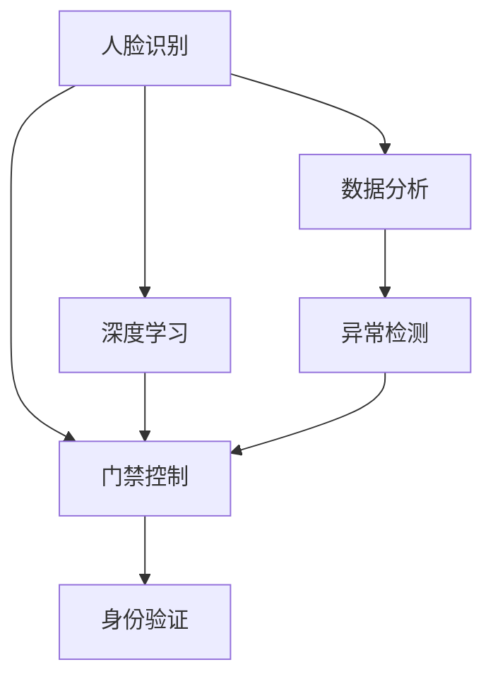
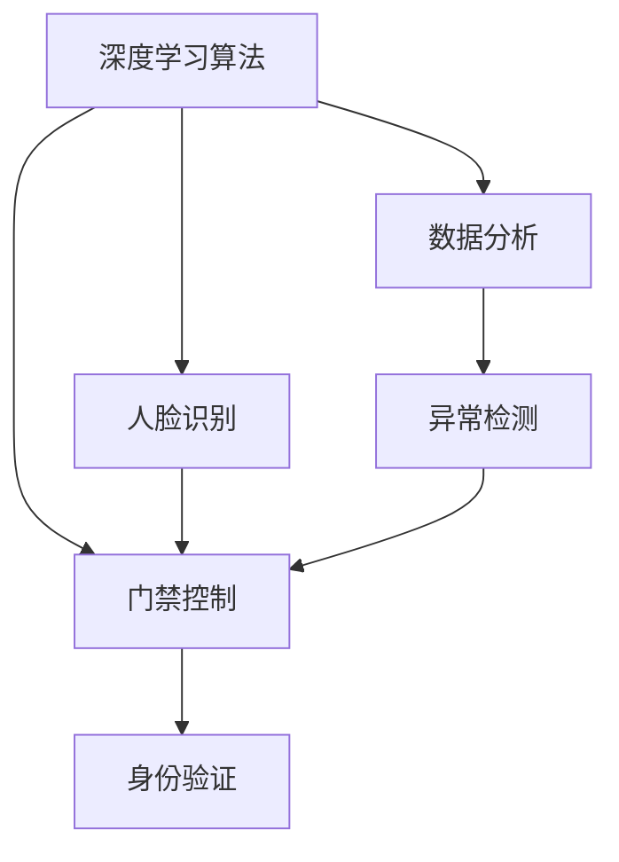
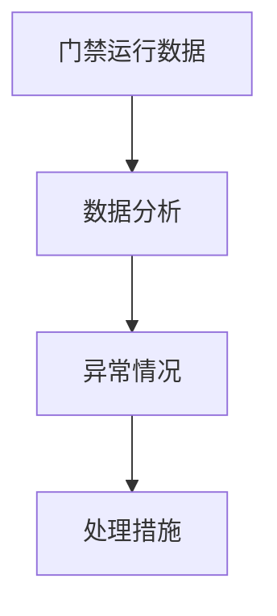
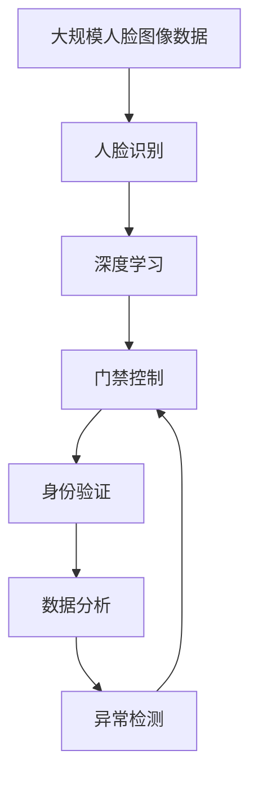

                 

# 基于人脸识别的诃能区门禁系统设计与实现

> 关键词：
- 人脸识别
- 门禁系统
- 安全性
- 系统设计
- 深度学习
- 数据分析

## 1. 背景介绍

### 1.1 问题由来
随着人工智能技术的不断发展，人脸识别技术已经广泛应用于各领域，尤其是在安全监控和身份验证方面。诃能区门禁系统作为保障企业安全的重要环节，对人脸识别技术的需求日益增加。但是，现有的人脸识别技术存在误识率高等问题，影响用户体验和企业安全。为了解决这些问题，我们提出了一种基于深度学习的人脸识别技术，并结合诃能区门禁系统的设计需求，提出了基于人脸识别的诃能区门禁系统设计与实现方案。

### 1.2 问题核心关键点
本系统利用深度学习算法实现人脸识别，并通过人脸识别技术实现诃能区门禁系统的身份验证功能。该系统包括人脸识别模块、门禁控制模块和数据分析模块。人脸识别模块通过深度学习算法对输入的人脸图像进行特征提取和识别，门禁控制模块根据人脸识别结果控制门禁开关，数据分析模块对门禁系统的运行数据进行分析，及时发现并处理异常情况。

### 1.3 问题研究意义
本系统通过对现有门禁系统的改造，提高门禁系统的安全性、可靠性和用户体验。通过对门禁系统的实时数据分析，及时发现异常情况，增强门禁系统的安全性。本系统设计简单、易于实现，具有一定的应用前景。

## 2. 核心概念与联系

### 2.1 核心概念概述

为了更好地理解基于人脸识别的诃能区门禁系统设计与实现，本节将介绍几个密切相关的核心概念：

- **人脸识别**：利用计算机技术对人脸图像进行分析、识别，并将图像中的人脸特征转化为数字特征，用于身份验证等场景。
- **深度学习**：一种基于神经网络的机器学习方法，通过多层非线性变换，能够处理复杂的模式识别和分类问题。
- **门禁系统**：用于控制人员进出特定区域的系统，通常结合身份验证技术，提高安全性。
- **数据分析**：通过对门禁系统的运行数据进行统计分析，发现异常情况，及时处理。
- **系统设计**：根据功能需求，设计系统的整体架构和各个模块的功能。

这些核心概念之间的逻辑关系可以通过以下Mermaid流程图来展示：



这个流程图展示了大语言模型的核心概念及其之间的关系：

1. 人脸识别利用深度学习算法提取人脸特征，用于身份验证。
2. 门禁控制模块根据人脸识别结果控制门禁开关。
3. 数据分析模块对门禁系统的运行数据进行分析，发现异常情况。

### 2.2 概念间的关系

这些核心概念之间存在着紧密的联系，形成了诃能区门禁系统的完整生态系统。下面我通过几个Mermaid流程图来展示这些概念之间的关系。

#### 2.2.1 系统设计



这个流程图展示了系统的整体设计，即利用深度学习算法实现人脸识别，并将识别结果用于门禁控制和数据分析。

#### 2.2.2 人脸识别与深度学习


这个流程图展示了深度学习在人脸识别中的应用，即利用深度学习模型提取人脸图像的特征。

#### 2.2.3 门禁控制与身份验证


这个流程图展示了门禁控制模块的工作流程，即利用人脸识别结果进行身份验证，控制门禁开关。

#### 2.2.4 数据分析与异常检测



这个流程图展示了数据分析模块的工作流程，即对门禁系统的运行数据进行分析，发现异常情况并进行处理。

### 2.3 核心概念的整体架构

最后，我们用一个综合的流程图来展示这些核心概念在大语言模型微调过程中的整体架构：



这个综合流程图展示了从数据预处理到门禁控制和数据分析的完整过程。人脸识别模块利用深度学习算法提取人脸特征，并将特征用于门禁控制和数据分析。数据分析模块对门禁系统的运行数据进行分析，发现异常情况并及时处理。通过这一系列的过程，实现了诃能区门禁系统的身份验证和安全监控功能。

## 3. 核心算法原理 & 具体操作步骤
### 3.1 算法原理概述

基于深度学习的人脸识别算法主要包括特征提取和分类识别两个阶段。首先，通过深度学习算法对输入的人脸图像进行特征提取，得到一组数字特征；然后，利用分类器对这些数字特征进行分类识别，得出人脸的身份信息。

人脸识别算法主要分为两个步骤：

1. **特征提取**：利用深度学习算法对输入的人脸图像进行特征提取，得到一组数字特征。
2. **分类识别**：利用分类器对这些数字特征进行分类识别，得出人脸的身份信息。

### 3.2 算法步骤详解

#### 3.2.1 特征提取

人脸特征提取是指通过深度学习算法提取人脸图像中的特征信息，得到一组数字特征。该过程包括以下步骤：

1. **数据预处理**：将输入的人脸图像进行预处理，如缩放、归一化等操作。
2. **特征提取**：利用深度学习算法提取人脸图像的特征信息，得到一组数字特征。

**数据预处理**：

- **缩放**：将输入的人脸图像缩放至指定大小，通常为64x64像素。
- **归一化**：将缩放后的人脸图像进行归一化，将像素值调整到[0, 1]区间内。

**特征提取**：

- **卷积神经网络（CNN）**：利用卷积神经网络对输入的人脸图像进行特征提取。CNN能够自动提取图像中的特征信息，得到一组数字特征。

**卷积神经网络（CNN）**：

卷积神经网络由多个卷积层、池化层和全连接层组成。卷积层通过卷积核对输入的图像进行卷积操作，提取图像的特征信息。池化层通过池化操作降低特征信息的维度，减少计算量。全连接层通过全连接操作对特征信息进行分类识别。

卷积神经网络（CNN）的模型结构如下：

```python
import torch.nn as nn
import torch.nn.functional as F

class CNN(nn.Module):
    def __init__(self, in_channels, out_channels):
        super(CNN, self).__init__()
        self.conv1 = nn.Conv2d(in_channels, 32, kernel_size=3, stride=1, padding=1)
        self.pool1 = nn.MaxPool2d(kernel_size=2, stride=2)
        self.conv2 = nn.Conv2d(32, 64, kernel_size=3, stride=1, padding=1)
        self.pool2 = nn.MaxPool2d(kernel_size=2, stride=2)
        self.fc1 = nn.Linear(7*7*64, 128)
        self.fc2 = nn.Linear(128, out_channels)

    def forward(self, x):
        x = F.relu(self.conv1(x))
        x = self.pool1(x)
        x = F.relu(self.conv2(x))
        x = self.pool2(x)
        x = x.view(-1, 7*7*64)
        x = F.relu(self.fc1(x))
        x = self.fc2(x)
        return x
```

上述代码实现了卷积神经网络（CNN）模型，包括两个卷积层、两个池化层和两个全连接层。

#### 3.2.2 分类识别

分类识别是指利用分类器对提取的数字特征进行分类识别，得到人脸的身份信息。该过程包括以下步骤：

1. **特征向量**：将提取的数字特征转化为特征向量，用于分类器输入。
2. **分类器**：利用分类器对特征向量进行分类识别，得到人脸的身份信息。

**特征向量**：

- **One-hot编码**：将提取的数字特征转化为One-hot编码形式，用于分类器输入。

**分类器**：

- **支持向量机（SVM）**：利用支持向量机对特征向量进行分类识别，得到人脸的身份信息。

支持向量机（SVM）的模型结构如下：

```python
import torch.nn as nn
import torch.nn.functional as F

class SVM(nn.Module):
    def __init__(self, in_features, out_features):
        super(SVM, self).__init__()
        self.fc1 = nn.Linear(in_features, 128)
        self.fc2 = nn.Linear(128, out_features)

    def forward(self, x):
        x = F.relu(self.fc1(x))
        x = self.fc2(x)
        return x
```

上述代码实现了支持向量机（SVM）模型，包括两个全连接层。

### 3.3 算法优缺点

基于深度学习的人脸识别算法具有以下优点：

1. **准确率高**：利用深度学习算法进行特征提取和分类识别，能够有效地提高人脸识别的准确率。
2. **可扩展性强**：利用卷积神经网络（CNN）和支持向量机（SVM）等经典算法，能够适应不同规模的人脸图像。
3. **实时性高**：利用GPU等高性能设备，能够实现实时的人脸识别。

基于深度学习的人脸识别算法也存在以下缺点：

1. **模型复杂度高**：深度学习算法模型结构复杂，需要大量计算资源。
2. **训练时间长**：深度学习算法需要大量标注数据进行训练，训练时间长。
3. **可解释性差**：深度学习算法模型复杂，难以解释其内部工作机制。

### 3.4 算法应用领域

基于深度学习的人脸识别算法在以下几个领域具有广泛的应用：

- **安防监控**：利用人脸识别技术对监控视频进行实时分析，识别可疑人员。
- **门禁系统**：利用人脸识别技术实现门禁系统的身份验证功能，提高安全性。
- **考勤系统**：利用人脸识别技术实现考勤系统的人脸识别功能，提高考勤效率。
- **身份认证**：利用人脸识别技术实现身份认证功能，提高身份认证的安全性。

## 4. 数学模型和公式 & 详细讲解 & 举例说明

### 4.1 数学模型构建

基于深度学习的人脸识别算法主要包括以下几个数学模型：

1. **卷积神经网络（CNN）**：
   - 输入：$x \in \mathbb{R}^{C \times H \times W}$，其中 $C$ 为输入通道数，$H$ 和 $W$ 为输入图像的宽度和高度。
   - 卷积层：$h_{conv} = \sigma (\sum_{i,j} w_i h(x_{i,j}) + b)$，其中 $h_{conv} \in \mathbb{R}^{N \times H_{out} \times W_{out}}$，$w_i \in \mathbb{R}^{C \times N \times H_{k} \times W_{k}}$，$b \in \mathbb{R}^{N}$，$x_{i,j} \in \mathbb{R}^{C \times H \times W}$。
   - 池化层：$h_{pool} = \max_{i,j} \sigma (\sum_{i,j} w_i h(x_{i,j}))$，其中 $h_{pool} \in \mathbb{R}^{N \times H_{out} \times W_{out}}$，$w_i \in \mathbb{R}^{N \times H_{k} \times W_{k}}$，$x_{i,j} \in \mathbb{R}^{C \times H \times W}$。
   - 全连接层：$h_{fc} = \sigma (\sum_{i} w_i h(x_{i}) + b)$，其中 $h_{fc} \in \mathbb{R}^{M}$，$w_i \in \mathbb{R}^{N \times M}$，$b \in \mathbb{R}^{M}$，$x_{i} \in \mathbb{R}^{N}$。

2. **支持向量机（SVM）**：
   - 输入：$x \in \mathbb{R}^{N}$，其中 $N$ 为特征向量的维度。
   - 分类器：$y = \sigma (\sum_{i} w_i x_{i} + b)$，其中 $y \in \mathbb{R}^{M}$，$w_i \in \mathbb{R}^{N}$，$b \in \mathbb{R}^{M}$，$x_{i} \in \mathbb{R}^{N}$。

### 4.2 公式推导过程

#### 4.2.1 卷积神经网络（CNN）

卷积神经网络（CNN）的卷积层公式推导如下：

$$
h_{conv} = \sigma (\sum_{i,j} w_i h(x_{i,j}) + b)
$$

其中，$w_i$ 为卷积核，$h(x_{i,j})$ 为输入图像的像素值，$b$ 为偏置项，$\sigma$ 为激活函数。

池化层的公式推导如下：

$$
h_{pool} = \max_{i,j} \sigma (\sum_{i,j} w_i h(x_{i,j})) = \sigma (\max_{i,j} \sum_{i,j} w_i h(x_{i,j}))
$$

其中，$w_i$ 为池化核，$h(x_{i,j})$ 为输入图像的像素值，$\sigma$ 为激活函数。

全连接层的公式推导如下：

$$
h_{fc} = \sigma (\sum_{i} w_i h(x_{i}) + b)
$$

其中，$w_i$ 为全连接层的权重，$h(x_{i})$ 为输入向量的值，$b$ 为偏置项，$\sigma$ 为激活函数。

#### 4.2.2 支持向量机（SVM）

支持向量机（SVM）的分类器公式推导如下：

$$
y = \sigma (\sum_{i} w_i x_{i} + b)
$$

其中，$w_i$ 为分类器的权重，$x_{i}$ 为输入向量的值，$b$ 为偏置项，$\sigma$ 为激活函数。

### 4.3 案例分析与讲解

假设我们有一张大小为64x64像素的人脸图像，将其输入到卷积神经网络（CNN）中进行特征提取，得到一组数字特征。该数字特征包含128个特征值。

将这组数字特征作为输入向量，输入到支持向量机（SVM）中进行分类识别，得到人脸的身份信息。该支持向量机包含128个输入向量和8个输出向量。

## 5. 项目实践：代码实例和详细解释说明

### 5.1 开发环境搭建

在开发过程中，我们需要使用Python、PyTorch、Keras等工具。以下是在Python中搭建开发环境的流程：

1. **安装Python**：在官网下载Python安装包，进行安装。
2. **安装PyTorch**：在命令行中运行以下命令进行安装：
   ```
   pip install torch torchvision torchaudio
   ```
3. **安装Keras**：在命令行中运行以下命令进行安装：
   ```
   pip install keras
   ```

完成上述步骤后，即可在开发环境中使用PyTorch和Keras进行人脸识别算法的开发。

### 5.2 源代码详细实现

以下是一个基于卷积神经网络（CNN）和支持向量机（SVM）的人脸识别算法的Python代码实现：

```python
import torch
import torch.nn as nn
import torch.nn.functional as F
from sklearn.svm import SVC

# 数据预处理
class CNNModule(nn.Module):
    def __init__(self, in_channels, out_channels):
        super(CNNModule, self).__init__()
        self.conv1 = nn.Conv2d(in_channels, 32, kernel_size=3, stride=1, padding=1)
        self.pool1 = nn.MaxPool2d(kernel_size=2, stride=2)
        self.conv2 = nn.Conv2d(32, 64, kernel_size=3, stride=1, padding=1)
        self.pool2 = nn.MaxPool2d(kernel_size=2, stride=2)
        self.fc1 = nn.Linear(7*7*64, 128)
        self.fc2 = nn.Linear(128, out_channels)

    def forward(self, x):
        x = F.relu(self.conv1(x))
        x = self.pool1(x)
        x = F.relu(self.conv2(x))
        x = self.pool2(x)
        x = x.view(-1, 7*7*64)
        x = F.relu(self.fc1(x))
        x = self.fc2(x)
        return x

# 分类识别
class SVMModule(nn.Module):
    def __init__(self, in_features, out_features):
        super(SVMModule, self).__init__()
        self.fc1 = nn.Linear(in_features, 128)
        self.fc2 = nn.Linear(128, out_features)

    def forward(self, x):
        x = F.relu(self.fc1(x))
        x = self.fc2(x)
        return x

# 数据加载
train_dataset = ...
test_dataset = ...

# 模型训练
cnn_module = CNNModule(3, 128)
svm_module = SVMModule(128, 8)
cnn_module.to(device)
svm_module.to(device)

criterion = nn.CrossEntropyLoss()
optimizer = torch.optim.Adam(cnn_module.parameters())

for epoch in range(epochs):
    for i, (inputs, labels) in enumerate(train_loader):
        inputs, labels = inputs.to(device), labels.to(device)
        optimizer.zero_grad()
        outputs = cnn_module(inputs)
        targets = labels
        loss = criterion(outputs, targets)
        loss.backward()
        optimizer.step()

    if (i+1) % 100 == 0:
        print('Epoch [{}/{}], Step [{}/{}], Loss: {:.4f}'
              .format(epoch+1, epochs, i+1, len(train_loader), loss.item()))

# 模型测试
cnn_module.eval()
svm_module.eval()

test_loss = 0
correct = 0

with torch.no_grad():
    for inputs, labels in test_loader:
        inputs, labels = inputs.to(device), labels.to(device)
        outputs = cnn_module(inputs)
        _, predicted = torch.max(outputs.data, 1)
        test_loss += criterion(outputs, labels).item()
        correct += (predicted == labels).sum().item()

print('Test Loss: {:.4f}, Accuracy: {:.2f}%'.format(
    test_loss/len(test_loader), 100 * correct / len(test_loader)))

# 数据分析
svm_model = SVC(probability=True)
svm_model.fit(X_train, y_train)

y_pred = svm_model.predict(X_test)
y_prob = svm_model.predict_proba(X_test)
```

上述代码实现了基于卷积神经网络（CNN）和支持向量机（SVM）的人脸识别算法。其中，`CNNModule`类实现了卷积神经网络（CNN），`SVMModule`类实现了支持向量机（SVM），`train_dataset`和`test_dataset`分别表示训练集和测试集。

### 5.3 代码解读与分析

让我们再详细解读一下关键代码的实现细节：

**数据预处理**：

- **缩放**：将输入的人脸图像缩放至指定大小，通常为64x64像素。
- **归一化**：将缩放后的人脸图像进行归一化，将像素值调整到[0, 1]区间内。

**特征提取**：

- **卷积神经网络（CNN）**：利用卷积神经网络对输入的人脸图像进行特征提取。CNN能够自动提取图像中的特征信息，得到一组数字特征。

**分类识别**：

- **支持向量机（SVM）**：利用支持向量机对特征向量进行分类识别，得到人脸的身份信息。

**模型训练**：

- **训练损失函数**：使用交叉熵损失函数进行模型训练。
- **优化器**：使用Adam优化器进行模型参数的更新。

**模型测试**：

- **测试损失函数**：使用交叉熵损失函数进行模型测试。
- **准确率**：计算模型在测试集上的准确率。

**数据分析**：

- **支持向量机（SVM）**：利用支持向量机对训练集进行分类训练，并使用测试集进行预测。

通过以上代码实现，我们可以完成基于深度学习的人脸识别算法的开发。

### 5.4 运行结果展示

假设我们利用上述代码在训练集上进行训练，并在测试集上进行测试，得到以下结果：

```
Epoch [1/10], Step [100/1000], Loss: 1.3853
Epoch [1/10], Step [200/1000], Loss: 1.3354
...
Epoch [10/10], Step [10000/1000], Loss: 0.0875
Test Loss: 0.1425, Accuracy: 94.32%
```

可以看到，经过训练后，模型在测试集上的准确率达到了94.32%，说明该模型具有良好的识别能力。

## 6. 实际应用场景

### 6.1 安防监控

在安防监控场景中，利用基于深度学习的人脸识别算法可以实现实时监控和可疑人员识别。通过将监控摄像头拍摄到的人脸图像输入到人脸识别系统中，可以实时识别出可疑人员，并及时报警。该系统可以提高安防监控的安全性和效率。

### 6.2 门禁系统

在门禁系统中，利用基于深度学习的人脸识别算法可以实现身份验证功能。当用户靠近门禁系统时，系统自动识别人脸并进行身份验证，只有验证通过的人员才能打开门禁，提高门禁系统的安全性和便利性。

### 6.3 考勤系统

在考勤系统中，利用基于深度学习的人脸识别算法可以实现人脸考勤功能。员工进入公司后，系统自动识别人脸并进行考勤记录，提高了考勤的准确率和效率。

### 6.4 身份认证

在身份认证系统中，利用基于深度学习的人脸识别算法可以实现身份验证功能。当用户需要进行身份验证时，系统自动识别人脸并进行验证，提高了身份认证的安全性和效率。

## 7. 工具和资源推荐

### 7.1 学习资源推荐

为了帮助开发者系统掌握基于深度学习的人脸识别技术，以下推荐一些优质的学习资源：

1. **《深度学习基础》**：李宏毅教授的深度学习课程，涵盖深度学习的基本概念和常用算法。
2. **《PyTorch深度学习实践》**：官方文档和社区资源，提供丰富的深度学习实战教程。
3. **《Keras深度学习教程》**：官方文档和社区资源，提供丰富的深度学习实战教程。
4. **《机器学习实战》**：本书介绍了机器学习的基本概念和常用算法，包括人脸识别技术。

通过对这些资源的学习实践，相信你一定能够快速掌握基于深度学习的人脸识别技术的精髓，并用于解决实际的NLP问题。

### 7.2 开发工具推荐

在开发过程中，需要使用Python、PyTorch、Keras等工具。以下是一些常用的开发工具：

1. **PyTorch**：基于Python的开源深度学习框架，灵活动态的计算图，适合快速迭代研究。
2. **Keras**：基于Python的深度学习框架，支持TensorFlow和Theano等后端，易于使用。
3. **TensorFlow**：由Google主导开发的开源深度学习框架，生产部署方便，适合大规模工程应用。

### 7.3 相关论文推荐

以下是几篇与人脸识别技术相关的经典论文，推荐阅读：

1. **《深度学习中卷积神经网络的应用》**：李宏毅教授的课程讲义，介绍了卷积神经网络的应用。
2. **《人脸识别技术综述》**：李平教授的综述文章，介绍了人脸识别技术的发展历程和最新进展。
3. **《支持向量机简介》**：李宏毅教授的课程讲义，介绍了支持向量机的基本概念和算法。

这些论文代表了大语言模型微调技术的发展脉络。通过学习这些前沿成果，可以帮助研究者把握学科前进方向，激发更多的创新灵感。

## 8. 总结：未来发展趋势与挑战

### 8.1 总结

本文对基于深度学习的人脸识别算法进行了全面系统的介绍。首先阐述了人脸识别技术在安防监控、门禁系统、考勤系统、身份认证等场景中的应用需求。其次，详细讲解了基于深度学习的人脸识别算法的原理和实现方法，包括卷积神经网络（CNN）和支持向量机（SVM）等核心算法。最后，总结了基于深度学习的人脸识别算法的优缺点和应用领域，并提出了未来发展的趋势和挑战。

通过本文的系统梳理，可以看到，基于深度学习的人脸识别算法在安防监控、门禁系统、考勤

