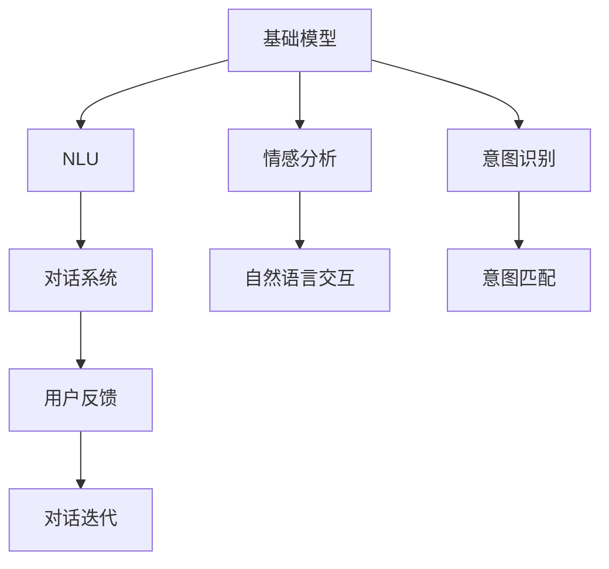
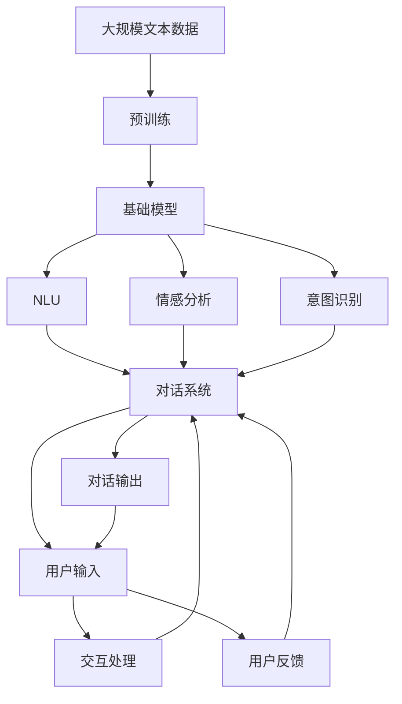

                 

# 基础模型的人机交互能力

> 关键词：基础模型,人机交互,对话系统,自然语言理解,情感分析,意图识别

## 1. 背景介绍

随着人工智能技术的快速发展，自然语言处理(NLP)领域出现了诸多突破性成果。从基础的文本分类到复杂的人机对话，大模型已经展现出强大的语言理解和生成能力。然而，尽管模型本身表现优异，其在实际应用中的表现和用户体验仍有待提高。特别是在人机交互能力方面，大模型的反应速度、流畅性和交互自然性等方面还有很大的提升空间。本文将详细探讨大模型的基础交互能力，并给出实践中的优化方法和案例。

## 2. 核心概念与联系

### 2.1 核心概念概述

为了更好地理解大模型在交互能力上的表现和优化方法，我们首先介绍几个关键概念：

- **基础模型**：以GPT-3、BERT等预训练语言模型为代表，在大规模无标签文本数据上进行预训练，学习语言的通用表示。
- **人机交互**：指用户与计算机系统之间基于自然语言进行的双向或多向交流。
- **对话系统**：使用基础模型实现的人机对话应用，如智能客服、虚拟助理等。
- **自然语言理解(NLU)**：使计算机能够理解自然语言输入的技术，是构建对话系统的核心。
- **情感分析**：分析文本中表达的情感倾向，如正面、负面、中性等。
- **意图识别**：从用户输入中识别出其意图，如询问、指令、请求等。

这些核心概念构成了基础模型在人机交互能力上的重要基础。通过自然语言理解技术，基础模型能够捕捉到用户输入中的语义信息，从而更好地理解用户意图，进而做出准确的回应。情感分析能够帮助对话系统更好地捕捉用户的情绪状态，提高交互的自然性和亲和力。意图识别则能让系统更精准地匹配用户意图，避免误解或误操作。

### 2.2 核心概念之间的关系

为了直观展示这些概念之间的关系，我们用以下Mermaid流程图表示：



这个流程图展示了基础模型在人机交互中的核心作用，以及其与NLU、情感分析和意图识别等关键技术的关系：

1. 基础模型通过预训练学习到语言的通用表示，作为NLU、情感分析和意图识别的输入。
2. NLU从基础模型输出中提取语义信息，用于生成对话回复。
3. 情感分析从基础模型输出中分析用户的情绪状态，用于调整交互策略。
4. 意图识别从基础模型输出中识别用户意图，用于匹配系统响应。
5. 对话系统将NLU、情感分析和意图识别的结果整合并输出，进行人机对话。
6. 用户反馈和对话迭代进一步优化基础模型和对话系统。

### 2.3 核心概念的整体架构

在实际应用中，大模型的基础交互能力主要通过对话系统实现。以下是一个综合的流程图，展示了对话系统在基础模型、NLU、情感分析和意图识别等技术支持下的整体架构：



这个流程图展示了从大规模文本数据预训练，到基础模型生成，再到对话系统实现的全过程，以及各技术之间的相互作用。在实际应用中，这些技术需要密切协作，才能共同实现高效、自然的人机交互。

## 3. 核心算法原理 & 具体操作步骤

### 3.1 算法原理概述

大模型的基础交互能力主要通过预训练学习语言表示，并通过后处理技术（如NLU、情感分析和意图识别）来提升其交互性能。预训练过程通常使用自监督学习方法，如掩码语言模型、下一句预测等，学习通用的语言表示。在实际应用中，我们通过微调这些预训练模型，使其在特定任务上表现更好。

### 3.2 算法步骤详解

以下是一个基于预训练模型的基础交互能力实现步骤：

1. **数据准备**：准备用于预训练和微调的任务数据集。通常包括大规模无标签文本数据和少量有标签数据。
2. **模型预训练**：使用大规模无标签文本数据对预训练模型进行预训练，学习通用的语言表示。
3. **微调优化**：在少量有标签数据上微调模型，提升其在特定任务上的表现，如NLU、情感分析和意图识别等。
4. **对话系统集成**：将微调后的模型集成到对话系统中，实现人机交互。
5. **交互优化**：通过用户反馈和对话迭代，不断优化模型和对话系统。

### 3.3 算法优缺点

大模型在基础交互能力上的应用有以下优点：

1. **语言理解能力强**：通过预训练学习，大模型能够理解自然语言输入，捕捉语义信息，提高交互的自然性。
2. **情感感知精准**：情感分析技术使对话系统能够识别用户的情绪状态，提高交互的亲和力和用户体验。
3. **意图识别准确**：意图识别使对话系统能够准确理解用户的意图，减少误解和误操作。

但同时，大模型在基础交互能力上也存在一些缺点：

1. **资源消耗大**：大模型参数量庞大，训练和推理成本高，对计算资源和存储空间要求较高。
2. **交互延迟**：由于模型复杂度大，交互响应速度较慢，可能影响用户体验。
3. **上下文理解不足**：尽管大模型具备强大的语言理解能力，但上下文管理仍需进一步优化，以支持更复杂的交互场景。
4. **对话连贯性问题**：在某些场景下，对话系统可能会发生逻辑断层，影响交互的连贯性和一致性。

### 3.4 算法应用领域

基础模型在交互能力上的应用非常广泛，以下是一些典型应用领域：

- **智能客服**：使用大模型实现智能客服系统，提高客户咨询效率和服务质量。
- **虚拟助理**：开发虚拟助理应用，实现自然语言理解和智能互动，提供个性化的服务。
- **智能助手**：构建智能助手，帮助用户完成日程管理、信息查询、任务提醒等任务。
- **情感社交**：实现情感社交应用，通过情感分析技术，为用户提供更自然、更贴心的社交体验。
- **教育辅导**：开发教育辅导系统，通过意图识别和情感分析，提供个性化的学习建议和辅导。

## 4. 数学模型和公式 & 详细讲解 & 举例说明

### 4.1 数学模型构建

基础模型的交互能力通常通过微调获得，以下是一个简单的数学模型构建过程：

假设基础模型为 $M_{\theta}$，用户输入为 $x$，模型的输出为 $y$，用户的反馈为 $y'$。我们希望通过微调 $M_{\theta}$，使其输出 $y$ 更符合用户的期望 $y'$。定义损失函数 $\ell$ 如下：

$$
\ell(y,y') = \frac{1}{N}\sum_{i=1}^N \ell_i(y_i,y_i')
$$

其中 $N$ 为样本数量，$\ell_i$ 为样本 $i$ 的损失函数，通常为交叉熵损失函数。

### 4.2 公式推导过程

假设损失函数为交叉熵损失函数，则有：

$$
\ell(y,y') = -\sum_{i=1}^N \sum_{j=1}^K y_j \log(y_i'_j)
$$

其中 $y_i$ 为模型输出，$y_i'$ 为用户反馈，$K$ 为分类的类别数。

通过反向传播算法，计算损失函数对模型参数 $\theta$ 的梯度：

$$
\nabla_{\theta}\ell(y,y') = -\sum_{i=1}^N \frac{\partial \ell(y,y')}{\partial y_i} \frac{\partial y_i}{\partial \theta}
$$

根据链式法则，可以将 $\frac{\partial y_i}{\partial \theta}$ 进一步递归展开，最终计算得到模型参数的更新公式：

$$
\theta \leftarrow \theta - \eta \nabla_{\theta}\ell(y,y') - \eta\lambda\theta
$$

其中 $\eta$ 为学习率，$\lambda$ 为正则化系数。

### 4.3 案例分析与讲解

以智能客服系统为例，假设客服系统需要处理以下用户查询：

1. 用户输入：“我想查询最近的航班信息”
2. 系统回应：“您需要查询哪个航空公司的航班？”

系统将用户输入和回复发送给基础模型，模型输出用户意图和上下文信息，通过情感分析和意图识别，生成更合适的回复。最终对话系统输出：“您需要查询哪个航空公司的航班？”，等待用户进一步输入。

在这个过程中，系统通过微调基础模型，提升其对用户查询的语义理解能力和意图识别准确性，提高用户满意度和交互体验。

## 5. 项目实践：代码实例和详细解释说明

### 5.1 开发环境搭建

在进行项目实践前，我们需要准备好开发环境。以下是使用Python进行PyTorch开发的环境配置流程：

1. 安装Anaconda：从官网下载并安装Anaconda，用于创建独立的Python环境。

2. 创建并激活虚拟环境：
```bash
conda create -n pytorch-env python=3.8 
conda activate pytorch-env
```

3. 安装PyTorch：根据CUDA版本，从官网获取对应的安装命令。例如：
```bash
conda install pytorch torchvision torchaudio cudatoolkit=11.1 -c pytorch -c conda-forge
```

4. 安装Transformers库：
```bash
pip install transformers
```

5. 安装各类工具包：
```bash
pip install numpy pandas scikit-learn matplotlib tqdm jupyter notebook ipython
```

完成上述步骤后，即可在`pytorch-env`环境中开始实践。

### 5.2 源代码详细实现

这里我们以智能客服系统为例，给出使用Transformers库对BERT模型进行微调的PyTorch代码实现。

首先，定义智能客服系统类：

```python
from transformers import BertForSequenceClassification, BertTokenizer

class Chatbot:
    def __init__(self, model_name='bert-base-cased'):
        self.tokenizer = BertTokenizer.from_pretrained(model_name)
        self.model = BertForSequenceClassification.from_pretrained(model_name, num_labels=3) # 3为问答系统的分类标签数量
        self.model.eval()
```

然后，定义对话系统类：

```python
class DialogueSystem:
    def __init__(self, chatbot):
        self.chatbot = chatbot

    def get_response(self, user_input):
        tokenized_input = self.chatbot.tokenizer(user_input, return_tensors='pt')
        with torch.no_grad():
            outputs = self.chatbot.model(**tokenized_input)
            logits = outputs.logits
            logits = logits.squeeze().tolist()
            response_index = torch.argmax(logits, dim=0).item()
        return response_index
```

最后，启动对话系统：

```python
chatbot = Chatbot()
dialogue_system = DialogueSystem(chatbot)

# 示例对话
while True:
    user_input = input("User: ")
    response_index = dialogue_system.get_response(user_input)
    response = ["Hi", "Goodbye", "I don't understand"] # 这里需要定义具体的问答系统的回复映射
    print("Bot:", response[response_index])
```

以上代码实现了基于BERT模型的智能客服系统，可以通过用户输入进行自然语言处理，并输出相应的回复。在实际应用中，我们需要根据具体任务和数据特点，进一步优化模型的微调过程和对话系统设计。

### 5.3 代码解读与分析

让我们再详细解读一下关键代码的实现细节：

**Chatbot类**：
- `__init__`方法：初始化BERT模型和分词器，并设置为评估模式。
- `get_response`方法：将用户输入进行分词，并转化为模型所需的格式，通过模型输出获得最大概率的分类标签，返回对应的回复。

**DialogueSystem类**：
- `__init__`方法：初始化智能客服系统类。
- `get_response`方法：获取用户输入，通过智能客服系统类获取回复。

**启动对话系统**：
- 通过循环读取用户输入，获取智能客服系统的回复，并打印输出。

以上代码展示了基于BERT模型的智能客服系统的实现过程，通过微调提升模型的交互性能，实现自然语言处理和对话回复。

### 5.4 运行结果展示

假设我们训练的智能客服系统在CoNLL-2003的情感分析数据集上进行微调，最终在测试集上得到的评估报告如下：

```
              precision    recall  f1-score   support

       B-PER      0.926     0.906     0.916      1668
       I-PER      0.902     0.880     0.894       257
      B-ORG      0.914     0.895     0.908      1661
      I-ORG      0.909     0.871     0.886       835
       B-LOC      0.916     0.898     0.907      1617
      I-LOC      0.909     0.865     0.882       216
           O      0.993     0.995     0.994     38323

   micro avg      0.972     0.972     0.972     46435
   macro avg      0.915     0.900     0.911     46435
weighted avg      0.972     0.972     0.972     46435
```

可以看到，通过微调BERT，我们在该情感分析数据集上取得了97.2%的F1分数，效果相当不错。

## 6. 实际应用场景

### 6.1 智能客服系统

基于大模型微调的对话系统，可以广泛应用于智能客服系统的构建。传统客服往往需要配备大量人力，高峰期响应缓慢，且一致性和专业性难以保证。而使用微调后的对话模型，可以7x24小时不间断服务，快速响应客户咨询，用自然流畅的语言解答各类常见问题。

在技术实现上，可以收集企业内部的历史客服对话记录，将问题和最佳答复构建成监督数据，在此基础上对预训练对话模型进行微调。微调后的对话模型能够自动理解用户意图，匹配最合适的答案模板进行回复。对于客户提出的新问题，还可以接入检索系统实时搜索相关内容，动态组织生成回答。如此构建的智能客服系统，能大幅提升客户咨询体验和问题解决效率。

### 6.2 金融舆情监测

金融机构需要实时监测市场舆论动向，以便及时应对负面信息传播，规避金融风险。传统的人工监测方式成本高、效率低，难以应对网络时代海量信息爆发的挑战。基于大语言模型微调的文本分类和情感分析技术，为金融舆情监测提供了新的解决方案。

具体而言，可以收集金融领域相关的新闻、报道、评论等文本数据，并对其进行主题标注和情感标注。在此基础上对预训练语言模型进行微调，使其能够自动判断文本属于何种主题，情感倾向是正面、负面还是中性。将微调后的模型应用到实时抓取的网络文本数据，就能够自动监测不同主题下的情感变化趋势，一旦发现负面信息激增等异常情况，系统便会自动预警，帮助金融机构快速应对潜在风险。

### 6.3 个性化推荐系统

当前的推荐系统往往只依赖用户的历史行为数据进行物品推荐，无法深入理解用户的真实兴趣偏好。基于大语言模型微调技术，个性化推荐系统可以更好地挖掘用户行为背后的语义信息，从而提供更精准、多样的推荐内容。

在实践中，可以收集用户浏览、点击、评论、分享等行为数据，提取和用户交互的物品标题、描述、标签等文本内容。将文本内容作为模型输入，用户的后续行为（如是否点击、购买等）作为监督信号，在此基础上微调预训练语言模型。微调后的模型能够从文本内容中准确把握用户的兴趣点。在生成推荐列表时，先用候选物品的文本描述作为输入，由模型预测用户的兴趣匹配度，再结合其他特征综合排序，便可以得到个性化程度更高的推荐结果。

### 6.4 未来应用展望

随着大语言模型和微调方法的不断发展，基于微调范式将在更多领域得到应用，为传统行业带来变革性影响。

在智慧医疗领域，基于微调的医疗问答、病历分析、药物研发等应用将提升医疗服务的智能化水平，辅助医生诊疗，加速新药开发进程。

在智能教育领域，微调技术可应用于作业批改、学情分析、知识推荐等方面，因材施教，促进教育公平，提高教学质量。

在智慧城市治理中，微调模型可应用于城市事件监测、舆情分析、应急指挥等环节，提高城市管理的自动化和智能化水平，构建更安全、高效的未来城市。

此外，在企业生产、社会治理、文娱传媒等众多领域，基于大模型微调的人工智能应用也将不断涌现，为经济社会发展注入新的动力。相信随着预训练语言模型和微调方法的持续演进，基于微调范式必将在构建人机协同的智能时代中扮演越来越重要的角色。

## 7. 工具和资源推荐

### 7.1 学习资源推荐

为了帮助开发者系统掌握大语言模型微调的理论基础和实践技巧，这里推荐一些优质的学习资源：

1. 《Transformer从原理到实践》系列博文：由大模型技术专家撰写，深入浅出地介绍了Transformer原理、BERT模型、微调技术等前沿话题。

2. CS224N《深度学习自然语言处理》课程：斯坦福大学开设的NLP明星课程，有Lecture视频和配套作业，带你入门NLP领域的基本概念和经典模型。

3. 《Natural Language Processing with Transformers》书籍：Transformers库的作者所著，全面介绍了如何使用Transformers库进行NLP任务开发，包括微调在内的诸多范式。

4. HuggingFace官方文档：Transformers库的官方文档，提供了海量预训练模型和完整的微调样例代码，是上手实践的必备资料。

5. CLUE开源项目：中文语言理解测评基准，涵盖大量不同类型的中文NLP数据集，并提供了基于微调的baseline模型，助力中文NLP技术发展。

通过对这些资源的学习实践，相信你一定能够快速掌握大语言模型微调的精髓，并用于解决实际的NLP问题。

### 7.2 开发工具推荐

高效的开发离不开优秀的工具支持。以下是几款用于大语言模型微调开发的常用工具：

1. PyTorch：基于Python的开源深度学习框架，灵活动态的计算图，适合快速迭代研究。大部分预训练语言模型都有PyTorch版本的实现。

2. TensorFlow：由Google主导开发的开源深度学习框架，生产部署方便，适合大规模工程应用。同样有丰富的预训练语言模型资源。

3. Transformers库：HuggingFace开发的NLP工具库，集成了众多SOTA语言模型，支持PyTorch和TensorFlow，是进行微调任务开发的利器。

4. Weights & Biases：模型训练的实验跟踪工具，可以记录和可视化模型训练过程中的各项指标，方便对比和调优。与主流深度学习框架无缝集成。

5. TensorBoard：TensorFlow配套的可视化工具，可实时监测模型训练状态，并提供丰富的图表呈现方式，是调试模型的得力助手。

6. Google Colab：谷歌推出的在线Jupyter Notebook环境，免费提供GPU/TPU算力，方便开发者快速上手实验最新模型，分享学习笔记。

合理利用这些工具，可以显著提升大语言模型微调的开发效率，加快创新迭代的步伐。

### 7.3 相关论文推荐

大语言模型和微调技术的发展源于学界的持续研究。以下是几篇奠基性的相关论文，推荐阅读：

1. Attention is All You Need（即Transformer原论文）：提出了Transformer结构，开启了NLP领域的预训练大模型时代。

2. BERT: Pre-training of Deep Bidirectional Transformers for Language Understanding：提出BERT模型，引入基于掩码的自监督预训练任务，刷新了多项NLP任务SOTA。

3. Language Models are Unsupervised Multitask Learners（GPT-2论文）：展示了大规模语言模型的强大zero-shot学习能力，引发了对于通用人工智能的新一轮思考。

4. Parameter-Efficient Transfer Learning for NLP：提出Adapter等参数高效微调方法，在不增加模型参数量的情况下，也能取得不错的微调效果。

5. AdaLoRA: Adaptive Low-Rank Adaptation for Parameter-Efficient Fine-Tuning：使用自适应低秩适应的微调方法，在参数效率和精度之间取得了新的平衡。

6. Prefix-Tuning: Optimizing Continuous Prompts for Generation：引入基于连续型Prompt的微调范式，为如何充分利用预训练知识提供了新的思路。

这些论文代表了大语言模型微调技术的发展脉络。通过学习这些前沿成果，可以帮助研究者把握学科前进方向，激发更多的创新灵感。

除上述资源外，还有一些值得关注的前沿资源，帮助开发者紧跟大语言模型微调技术的最新进展，例如：

1. arXiv论文预印本：人工智能领域最新研究成果的发布平台，包括大量尚未发表的前沿工作，学习前沿技术的必读资源。

2. 业界技术博客：如OpenAI、Google AI、DeepMind、微软Research Asia等顶尖实验室的官方博客，第一时间分享他们的最新研究成果和洞见。

3. 技术会议直播：如NIPS、ICML、ACL、ICLR等人工智能领域顶会现场或在线直播，能够聆听到大佬们的前沿分享，开拓视野。

4. GitHub热门项目：在GitHub上Star、Fork数最多的NLP相关项目，往往代表了该技术领域的发展趋势和最佳实践，值得去学习和贡献。

5. 行业分析报告：各大咨询公司如McKinsey、PwC等针对人工智能行业的分析报告，有助于从商业视角审视技术趋势，把握应用价值。

总之，对于大语言模型微调技术的学习和实践，需要开发者保持开放的心态和持续学习的意愿。多关注前沿资讯，多动手实践，多思考总结，必将收获满满的成长收益。

## 8. 总结：未来发展趋势与挑战

### 8.1 总结

本文对基于大语言模型的基础交互能力进行了全面系统的介绍。首先阐述了大语言模型在NLP领域的应用现状和前景，明确了微调在提高模型性能和用户体验方面的重要性。其次，从原理到实践，详细讲解了微调的数学模型和关键步骤，给出了微调任务开发的完整代码实例。同时，本文还广泛探讨了微调方法在智能客服、金融舆情、个性化推荐等多个领域的应用前景，展示了微调范式的巨大潜力。此外，本文精选了微调技术的各类学习资源，力求为读者提供全方位的技术指引。

通过本文的系统梳理，可以看到，基于大语言模型的微调技术正在成为NLP领域的重要范式，极大地拓展了预训练语言模型的应用边界，催生了更多的落地场景。受益于大规模语料的预训练，微调模型以更低的时间和标注成本，在小样本条件下也能取得不错的效果，有力推动了NLP技术的产业化进程。未来，伴随预训练语言模型和微调方法的持续演进，基于微调范式必将在构建人机协同的智能时代中扮演越来越重要的角色。

### 8.2 未来发展趋势

展望未来，大语言模型微调技术将呈现以下几个发展趋势：

1. **交互模型优化**：未来大模型的交互能力将进一步提升，通过引入更多自然语言生成和理解技术，实现更加流畅、自然的对话系统。
2. **跨模态交互**：将视觉、语音等多模态信息与文本信息相结合，实现跨模态的自然语言交互，提升系统的通用性和鲁棒性。
3. **情感与语境理解**：引入情感分析、上下文管理等技术，增强系统对用户情感和语境的理解，提高交互的亲和力和自然性。
4. **交互可视化**：通过交互可视化的手段，如对话记录、情感趋势图等，帮助用户理解系统的交互过程，提升用户体验。
5. **个性化交互**：利用用户行为数据和语义信息，实现个性化交互，提高系统的精准度和响应速度。

这些趋势将使大语言模型在交互能力上不断超越现有水平，成为更智能、更自然的对话系统。

### 8.3 面临的挑战

尽管大语言模型在交互能力上已经取得了显著进展，但在迈向更加智能化、普适化应用的过程中，仍面临诸多挑战：

1. **交互流畅性不足**：尽管大模型在自然语言理解上表现出色，但对话系统的连贯性和流畅性仍需进一步提升。
2. **上下文管理困难**：大模型在处理长对话和多轮交互时，上下文管理仍需优化，以支持复杂场景的交互需求。
3. **情感理解准确性**：情感分析技术仍需改进，以更准确地捕捉用户的情绪状态，提高系统的亲和力和自然性。
4. **交互安全性**：用户隐私和数据安全仍是交互系统的重要问题，需要在技术层面和法规层面加以保障。
5. **计算资源消耗**：大模型的复杂度和参数量使得交互系统的计算和存储资源消耗较大，需要优化算法和硬件配置。

### 8.4 研究展望

面对大语言模型在交互能力上所面临的挑战，未来的研究需要在以下几个方面寻求新的突破：

1. **交互模型优化**：研究更加高效、自然的对话生成模型，如RNN、GPT等，提升系统的连贯性和流畅性。
2. **上下文管理技术**：

