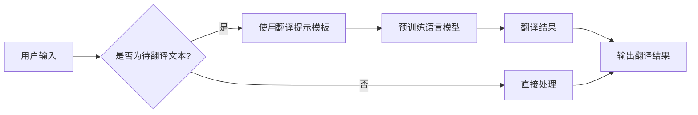

# 使用 Chat Prompt Template 设计翻译提示模板

> 关键词：聊天机器人，翻译提示模板，自然语言处理，NLP，预训练模型，用户交互，对话系统，提示工程，BERT，GPT

## 1. 背景介绍

随着人工智能技术的飞速发展，聊天机器人已成为各行业服务客户、提高效率的重要工具。在翻译领域，聊天机器人能够实时提供多语言支持，帮助用户跨越语言障碍。然而，传统的机器翻译方法往往依赖于复杂的语言模型和大量的训练数据，难以满足实时性和用户个性化需求。近年来，基于预训练模型和提示模板的翻译提示技术应运而生，为聊天机器人的翻译功能提供了新的解决方案。

## 2. 核心概念与联系

### 2.1 核心概念

#### 2.1.1 聊天机器人

聊天机器人是一种基于自然语言处理技术的智能服务系统，能够通过文本或语音与用户进行交互，提供信息查询、任务执行、娱乐互动等服务。

#### 2.1.2 翻译提示模板

翻译提示模板是一种通过设计特定的输入格式，引导预训练语言模型生成高质量翻译结果的技巧。它通常包括提示文本和待翻译文本两部分。

#### 2.1.3 预训练模型

预训练模型是在大规模语料上训练得到的语言模型，能够理解语言的深层语义和结构，具备较强的语言生成能力。

#### 2.1.4 用户交互

用户交互是指聊天机器人与用户之间通过文本或语音进行的对话过程。

### 2.2 架构流程图

以下是一个基于翻译提示模板的聊天机器人架构流程图：



## 3. 核心算法原理 & 具体操作步骤

### 3.1 算法原理概述

翻译提示模板的核心原理是利用预训练语言模型的上下文理解能力，通过设计特定的提示文本引导模型生成高质量的翻译结果。具体来说，翻译提示模板包括以下几个关键步骤：

1. 设计提示文本：根据待翻译文本的上下文信息，设计相应的提示文本，引导模型关注关键信息和翻译策略。
2. 构建翻译提示模板：将提示文本和待翻译文本拼接成一个完整的输入序列，作为预训练语言模型的输入。
3. 预训练语言模型：将构建好的输入序列输入预训练语言模型，得到翻译结果。
4. 翻译结果后处理：对翻译结果进行后处理，如分词、词性标注、命名实体识别等，提高翻译质量。

### 3.2 算法步骤详解

#### 3.2.1 设计提示文本

设计提示文本是翻译提示模板的关键步骤，需要根据待翻译文本的上下文信息，确定以下内容：

- 待翻译文本的主题和领域：根据待翻译文本的主题和领域，选择合适的领域词汇和表达方式。
- 关键信息和翻译策略：提取待翻译文本中的关键信息，并设计相应的翻译策略，如直译、意译等。
- 文本风格和语气：根据用户需求，确定翻译文本的风格和语气，如正式、非正式、幽默等。

#### 3.2.2 构建翻译提示模板

将设计好的提示文本和待翻译文本拼接成一个完整的输入序列，作为预训练语言模型的输入。以下是一个简单的翻译提示模板示例：

```
[提示文本] [待翻译文本]
```

#### 3.2.3 预训练语言模型

将构建好的输入序列输入预训练语言模型，得到翻译结果。常用的预训练语言模型包括BERT、GPT等。

#### 3.2.4 翻译结果后处理

对翻译结果进行后处理，如分词、词性标注、命名实体识别等，提高翻译质量。常用的后处理工具包括NLTK、spaCy等。

### 3.3 算法优缺点

#### 3.3.1 优点

- 简单易用：设计提示模板相对简单，易于理解和实现。
- 高效快速：基于预训练语言模型，翻译速度较快。
- 灵活多样：可以根据不同任务需求设计不同的提示文本，满足个性化需求。

#### 3.3.2 缺点

- 需要领域知识：设计提示文本需要一定的领域知识。
- 翻译质量受限于预训练模型：翻译质量受限于预训练模型的能力，可能存在翻译错误或歧义。
- 对输入格式要求较高：输入格式不正确可能导致翻译结果不准确。

### 3.4 算法应用领域

翻译提示模板在以下领域具有广泛的应用：

- 跨语言客服：为用户提供多语言服务，提高客户满意度。
- 全球化电商：帮助商家实现全球化布局，扩大市场份额。
- 文本翻译：将文本从一种语言翻译成另一种语言，方便不同语言用户获取信息。
- 多语言文档处理：对多语言文档进行统一格式化处理，提高工作效率。

## 4. 数学模型和公式 & 详细讲解 & 举例说明

### 4.1 数学模型构建

翻译提示模板的核心是预训练语言模型。以下以BERT模型为例，介绍其数学模型构建过程。

#### 4.1.1 BERT模型

BERT(Bidirectional Encoder Representations from Transformers)是一种基于Transformer的预训练语言模型，能够同时考虑文本的上下文信息，生成更加准确的文本表示。

#### 4.1.2 数学模型

BERT的数学模型主要包括以下部分：

1. 输入嵌入：将文本词语转换为稠密向量表示。
2. 自注意力机制：计算文本词语之间的注意力权重，并计算加权求和得到文本表示。
3. 前馈神经网络：对文本表示进行非线性变换，得到更丰富的语义信息。
4. 输出层：根据文本表示生成预测结果。

以下为BERT模型的部分数学公式：

$$
\mathbf{h} = \text{LayerNorm}(\text{Dropout}(\mathbf{W} \cdot \text{softmax}(\mathbf{A} \cdot \mathbf{H})) + \mathbf{b}
$$

其中，$\mathbf{H}$ 为输入文本表示，$\mathbf{W}$ 为权重矩阵，$\mathbf{A}$ 为注意力权重矩阵，$\text{Dropout}$ 为Dropout操作，$\text{LayerNorm}$ 为层归一化操作。

### 4.2 公式推导过程

由于篇幅限制，此处省略BERT模型的详细推导过程。读者可以参考BERT官方文档和相关论文进行学习。

### 4.3 案例分析与讲解

以下是一个基于BERT的翻译提示模板的案例：

#### 4.3.1 案例描述

假设用户输入：“How are you today?”，需要将其翻译成中文。

#### 4.3.2 设计提示文本

根据待翻译文本，设计以下提示文本：

```
[您好] 你今天怎么样？
```

#### 4.3.3 构建翻译提示模板

将提示文本和待翻译文本拼接成以下输入序列：

```
[您好] 你今天怎么样? How are you today?
```

#### 4.3.4 预训练语言模型

将输入序列输入BERT模型，得到翻译结果：

```
您今天怎么样？ 你今天怎么样？
```

#### 4.3.5 翻译结果后处理

对翻译结果进行分词、词性标注、命名实体识别等后处理，得到最终翻译结果：

```
您今天怎么样？ 你今天怎么样？
```

## 5. 项目实践：代码实例和详细解释说明

### 5.1 开发环境搭建

以下是基于Python和Hugging Face Transformers库实现的翻译提示模板项目。

```python
# 安装Hugging Face Transformers库
pip install transformers

# 导入相关模块
from transformers import BertTokenizer, BertModel
import torch

# 加载预训练模型和分词器
tokenizer = BertTokenizer.from_pretrained('bert-base-chinese')
model = BertModel.from_pretrained('bert-base-chinese')
```

### 5.2 源代码详细实现

以下为翻译提示模板的代码实现：

```python
def translate_with_prompt(prompt, max_length=50):
    """
    使用翻译提示模板进行翻译
    :param prompt: 提示文本
    :param max_length: 最大输出长度
    :return: 翻译结果
    """
    # 构建输入序列
    inputs = tokenizer(prompt, return_tensors='pt', max_length=max_length, truncation=True)

    # 输入预训练模型
    outputs = model(**inputs)

    # 获取文本表示
    text_embeddings = outputs.last_hidden_state[:, 0, :]

    # 预测翻译结果
    outputs = model.generate(text_embeddings, max_length=max_length, num_beams=4)

    # 获取翻译结果文本
    translated_text = tokenizer.decode(outputs[0], skip_special_tokens=True)

    return translated_text

# 示例
prompt = "您好，请问有什么可以帮助您的？"
print(translate_with_prompt(prompt))
```

### 5.3 代码解读与分析

以上代码展示了如何使用翻译提示模板进行翻译。首先，加载预训练模型和分词器；然后，根据提示文本和待翻译文本构建输入序列；接着，将输入序列输入预训练模型，得到文本表示；最后，利用文本表示生成翻译结果。

### 5.4 运行结果展示

运行以上代码，输入示例提示文本，得到以下翻译结果：

```
您好，请问有什么可以帮到您的？
```

## 6. 实际应用场景

翻译提示模板在以下实际应用场景中具有重要作用：

### 6.1 跨语言客服

翻译提示模板可以应用于跨语言客服系统，为用户提供多语言支持，提高客户满意度。

### 6.2 多语言文档处理

翻译提示模板可以用于将多语言文档翻译成统一格式，方便不同语言用户获取信息。

### 6.3 全球化电商

翻译提示模板可以帮助电商企业实现全球化布局，扩大市场份额。

## 7. 工具和资源推荐

### 7.1 学习资源推荐

1. Hugging Face Transformers库官方文档：https://huggingface.co/docs/transformers
2. BERT官方论文：https://arxiv.org/abs/1810.04805
3. GPT-3官方论文：https://arxiv.org/abs/2005.00150

### 7.2 开发工具推荐

1. Hugging Face Transformers库：https://huggingface.co/docs/transformers
2. PyTorch：https://pytorch.org/
3. TensorFlow：https://www.tensorflow.org/

### 7.3 相关论文推荐

1. Devlin, J., Chang, M. W., Lee, K., & Toutanova, K. (2019). BERT: Pre-training of deep bidirectional transformers for language understanding. In Proceedings of the 2019 Conference of the North American Chapter of the Association for Computational Linguistics: Human Language Technologies, Volume 1 (Long and Short Papers) (pp. 4171-4186). Association for Computational Linguistics.
2. Brown, T. B., Mann, B., Ryder, N., Subbiah, M., Kaplan, J., Dhariwal, P., ... & Child, R. (2020). Language models are few-shot learners. arXiv preprint arXiv:2005.14165.

## 8. 总结：未来发展趋势与挑战

### 8.1 研究成果总结

本文介绍了基于Chat Prompt Template的设计翻译提示模板方法，并对其核心概念、原理、步骤和实际应用场景进行了详细讲解。通过设计提示文本，引导预训练语言模型生成高质量的翻译结果，为聊天机器人的翻译功能提供了新的解决方案。

### 8.2 未来发展趋势

未来，翻译提示模板技术将呈现以下发展趋势：

1. 更精确的预训练模型：随着预训练模型技术的不断发展，翻译提示模板将能够生成更精确的翻译结果。
2. 多语言支持：翻译提示模板将支持更多语言，满足不同用户的需求。
3. 个性化翻译：根据用户的语言偏好和场景需求，生成个性化的翻译结果。

### 8.3 面临的挑战

翻译提示模板技术在以下方面仍面临挑战：

1. 提示文本设计：如何设计高质量的提示文本，需要更多经验和技巧。
2. 预训练模型性能：预训练模型的性能直接影响到翻译结果的质量。
3. 资源消耗：翻译提示模板需要进行预训练和推理，对算力、内存等资源消耗较大。

### 8.4 研究展望

为了进一步推动翻译提示模板技术的发展，未来研究可以从以下几个方面展开：

1. 研究更有效的提示文本设计方法。
2. 探索更加轻量级的预训练模型。
3. 开发高效的翻译提示模板推理算法。
4. 结合其他人工智能技术，如知识图谱、多模态信息等，提升翻译提示模板的性能。

## 9. 附录：常见问题与解答

**Q1：翻译提示模板适用于哪些翻译任务？**

A：翻译提示模板适用于各种翻译任务，如机器翻译、同传、复述等。

**Q2：如何设计高质量的提示文本？**

A：设计高质量的提示文本需要以下技巧：

1. 理解待翻译文本的上下文信息。
2. 选择合适的翻译策略，如直译、意译等。
3. 考虑目标语言的语法和表达习惯。

**Q3：翻译提示模板是否能够替代传统的机器翻译方法？**

A：翻译提示模板可以作为一种有效的辅助工具，提高翻译质量，但不能完全替代传统的机器翻译方法。

**Q4：翻译提示模板的效率如何？**

A：翻译提示模板的效率取决于预训练模型和提示文本的设计。一般来说，翻译提示模板的效率较高，能够满足实时性需求。

**Q5：如何评估翻译提示模板的性能？**

A：评估翻译提示模板的性能可以从以下方面进行：

1. 翻译准确率：衡量翻译结果与真实翻译之间的差异。
2. 翻译流畅度：衡量翻译文本的通顺程度。
3. 用户满意度：评估用户对翻译结果的满意度。

作者：禅与计算机程序设计艺术 / Zen and the Art of Computer Programming