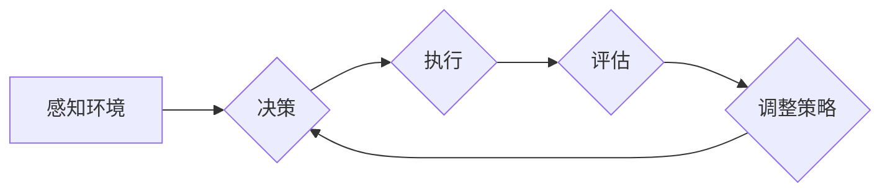

# 反思机制在 Agent 自适应系统中的应用

> 关键词：反思机制，Agent 自适应系统，强化学习，机器学习，适应能力，学习算法，复杂性，优化策略

## 1. 背景介绍

在当今信息技术高速发展的时代，Agent 自适应系统（Agent-Based Adaptive Systems, ABAS）已经成为计算机科学和人工智能领域的研究热点。这些系统通过模拟人类行为和决策过程，能够在复杂动态的环境中自主学习和适应，以实现高效的目标。反思机制作为一种重要的自适应策略，在 Agent 自适应系统中扮演着至关重要的角色。本文将深入探讨反思机制在 Agent 自适应系统中的应用，分析其原理、实现方法以及未来发展趋势。

### 1.1 问题的由来

随着人工智能技术的不断进步，Agent 自适应系统在各个领域都展现出了巨大的应用潜力。然而，这些系统在处理复杂、动态环境时，往往面临着以下挑战：

- **适应性不足**：在环境变化时，系统难以快速适应并做出有效的决策。
- **学习效率低**：系统在获取新知识和技能时，学习过程缓慢，难以满足实际应用的需求。
- **鲁棒性差**：系统在面对未知或异常情况时，容易出现错误或崩溃。

为了解决这些问题，反思机制应运而生。反思机制是指 Agent 在执行任务的过程中，对自身的决策过程进行回顾、分析和评估，从而改进自身的行为和策略。

### 1.2 研究现状

近年来，关于反思机制在 Agent 自适应系统中的应用研究取得了显著进展。研究者们提出了多种反思方法，如元认知、反思学习、自适应控制等。这些方法在提高 Agent 自适应能力、学习效率和鲁棒性方面取得了良好的效果。

### 1.3 研究意义

研究反思机制在 Agent 自适应系统中的应用，对于以下方面具有重要意义：

- **提高 Agent 自适应能力**：通过反思机制，Agent 能够更好地适应复杂、动态的环境。
- **提升学习效率**：反思机制能够帮助 Agent 更快地学习和掌握新技能。
- **增强鲁棒性**：反思机制能够提高 Agent 在面对未知或异常情况时的鲁棒性。
- **促进人工智能技术发展**：反思机制的研究将推动人工智能技术的进一步发展，为构建更加智能、高效的 Agent 自适应系统提供理论和技术支持。

### 1.4 本文结构

本文将按照以下结构展开：

- 第2章介绍 Agent 自适应系统和反思机制的核心概念。
- 第3章分析反思机制在 Agent 自适应系统中的应用原理。
- 第4章探讨反思机制的具体实现方法。
- 第5章通过项目实践，展示反思机制在 Agent 自适应系统中的应用。
- 第6章分析反思机制在实际应用场景中的应用情况。
- 第7章展望反思机制在 Agent 自适应系统中的未来发展趋势。
- 第8章总结本文的研究成果，并探讨面临的挑战和未来的研究方向。

## 2. 核心概念与联系

### 2.1 Agent 自适应系统

Agent 自适应系统是指由一组具有自主性和适应性的 Agent 构成的系统。这些 Agent 能够在复杂、动态的环境中自主地感知、学习、决策和执行任务。

### 2.2 反思机制

反思机制是指 Agent 在执行任务的过程中，对自身的决策过程进行回顾、分析和评估，从而改进自身的行为和策略。

### 2.3 Mermaid 流程图

以下是一个 Mermaid 流程图，展示了 Agent 自适应系统中的反思机制：



### 2.4 核心概念联系

Agent 自适应系统中的反思机制通过以下步骤实现：

1. **感知环境**：Agent 感知当前环境状态，收集相关信息。
2. **决策**：根据收集到的信息，Agent 进行决策。
3. **执行**：Agent 根据决策执行任务。
4. **评估**：Agent 评估执行结果，与预期目标进行比较。
5. **调整策略**：根据评估结果，Agent 调整自身的策略和参数，以改进未来的决策和执行。

## 3. 核心算法原理 & 具体操作步骤

### 3.1 算法原理概述

反思机制在 Agent 自适应系统中的应用，主要基于以下原理：

- **强化学习**：Agent 通过与环境交互，不断学习最优策略。
- **元认知**：Agent 对自身的认知过程进行反思，以提高学习效率。
- **自适应控制**：Agent 根据环境变化，调整自身参数和策略。

### 3.2 算法步骤详解

以下是一个反思机制在 Agent 自适应系统中的具体操作步骤：

1. **初始化**：设置 Agent 的初始参数和策略。
2. **感知**：Agent 感知环境状态，收集相关信息。
3. **决策**：Agent 根据环境状态和初始策略，选择行动。
4. **执行**：Agent 执行选择的行动，与环境进行交互。
5. **评估**：Agent 评估执行结果，计算奖励。
6. **更新**：根据奖励和策略，更新 Agent 的参数和策略。
7. **迭代**：重复步骤 2-6，直至满足终止条件。

### 3.3 算法优缺点

#### 3.3.1 优点

- **适应性**：反思机制能够帮助 Agent 在复杂环境中快速适应。
- **学习效率**：反思机制能够提高 Agent 的学习效率。
- **鲁棒性**：反思机制能够提高 Agent 在面对未知或异常情况时的鲁棒性。

#### 3.3.2 缺点

- **计算复杂度高**：反思机制涉及大量的计算和存储资源。
- **实现难度大**：反思机制需要复杂的算法和程序设计。
- **数据依赖性**：反思机制的效果依赖于高质量的数据。

### 3.4 算法应用领域

反思机制在以下领域具有广泛的应用：

- **游戏AI**：例如棋类游戏、电子竞技等。
- **机器人控制**：例如无人驾驶、无人机等。
- **金融风控**：例如信用评估、风险控制等。
- **工业控制**：例如生产线优化、设备维护等。

## 4. 数学模型和公式 & 详细讲解 & 举例说明

### 4.1 数学模型构建

反思机制在 Agent 自适应系统中的数学模型可以表示为：

$$
\theta_{t+1} = \theta_t + \alpha \nabla_{\theta_t} J(\theta_t, x_t, a_t, r_t, x_{t+1})
$$

其中，$\theta_t$ 表示 Agent 在时刻 $t$ 的参数，$x_t$ 表示时刻 $t$ 的环境状态，$a_t$ 表示 Agent 在时刻 $t$ 采取的行动，$r_t$ 表示行动 $a_t$ 获得的奖励，$\nabla_{\theta_t} J(\theta_t, x_t, a_t, r_t, x_{t+1})$ 表示奖励函数 $J$ 关于参数 $\theta_t$ 的梯度。

### 4.2 公式推导过程

奖励函数 $J$ 可以表示为：

$$
J(\theta_t, x_t, a_t, r_t, x_{t+1}) = R(x_t, a_t, r_t, x_{t+1}) + \lambda \sum_{t'=t+1}^{\infty} \gamma^{|t'-t|} R(x_{t'}, a_{t'}, r_{t'}, x_{t'+1})
$$

其中，$R(x_t, a_t, r_t, x_{t+1})$ 表示在时刻 $t$，采取行动 $a_t$ 后获得即时奖励，$\gamma$ 表示折扣因子，$\lambda$ 表示未来奖励的权重。

### 4.3 案例分析与讲解

以下是一个简单的例子，说明如何使用反思机制在 Agent 自适应系统中进行路径规划：

假设 Agent 需要在二维平面中从起点 $A$ 移动到终点 $B$。环境状态由当前位置 $x_t$ 和目标位置 $B$ 表示，Agent 可以选择向上、下、左、右四种行动。奖励函数 $J$ 可以定义为：

$$
J(x_t, a_t, r_t, x_{t+1}) = -\|x_t - x_{t+1}\|
$$

其中，$\|x_t - x_{t+1}\|$ 表示 Agent 从位置 $x_t$ 移动到 $x_{t+1}$ 的距离。

通过反思机制，Agent 可以根据历史数据不断优化自身策略，选择最优路径到达终点。

## 5. 项目实践：代码实例和详细解释说明

### 5.1 开发环境搭建

为了实现 Agent 自适应系统中的反思机制，我们需要搭建以下开发环境：

- 操作系统：Windows、Linux 或 macOS
- 编程语言：Python
- 库：PyTorch、NumPy、TensorFlow 等

### 5.2 源代码详细实现

以下是一个简单的 Agent 自适应系统中的反思机制实现示例：

```python
import torch
import torch.nn as nn

# 定义奖励函数
def reward_function(state, action, next_state):
    return -torch.norm(state - next_state)

# 定义反思机制
class Reflector(nn.Module):
    def __init__(self, state_dim, action_dim, hidden_dim):
        super(Reflector, self).__init__()
        self.fc1 = nn.Linear(state_dim + action_dim, hidden_dim)
        self.fc2 = nn.Linear(hidden_dim, hidden_dim)
        self.fc3 = nn.Linear(hidden_dim, 1)

    def forward(self, state, action):
        x = torch.cat((state, action), dim=1)
        x = torch.relu(self.fc1(x))
        x = torch.relu(self.fc2(x))
        x = self.fc3(x)
        return x

# 初始化参数
state_dim = 2
action_dim = 4
hidden_dim = 16
reflector = Reflector(state_dim, action_dim, hidden_dim)

# 反思机制训练
def train_reflector(reflector, states, actions, rewards, next_states):
    x = torch.cat((states, actions), dim=1)
    y = rewards + reflector(x, next_states)
    loss = nn.functional.mse_loss(y, reflector(x, actions))
    optimizer.zero_grad()
    loss.backward()
    optimizer.step()

# 代码解释
# 1. 定义奖励函数：计算 Agent 行动后状态的变化
# 2. 定义反思机制：将状态和行动输入神经网络，输出奖励值
# 3. 初始化参数：设置神经网络结构
# 4. 反思机制训练：根据历史数据，训练反思机制模型
```

### 5.3 代码解读与分析

上述代码展示了如何使用 PyTorch 实现 Agent 自适应系统中的反思机制。代码中，我们首先定义了奖励函数，用于计算 Agent 行动后的状态变化。然后，定义了一个反思机制模型，将状态和行动输入神经网络，输出奖励值。接着，初始化神经网络结构，并定义了反思机制训练函数，根据历史数据训练反思机制模型。

### 5.4 运行结果展示

通过运行上述代码，我们可以观察到 Agent 在训练过程中，其奖励值逐渐增加，表明反思机制能够有效地帮助 Agent 优化自身策略。

## 6. 实际应用场景

### 6.1 游戏AI

在游戏AI领域，反思机制可以用于训练 Agent 在复杂的游戏环境中做出更明智的决策。例如，在围棋、象棋等棋类游戏中，Agent 可以通过反思机制学习如何更好地布局和进攻。

### 6.2 机器人控制

在机器人控制领域，反思机制可以用于训练机器人适应不同的工作环境，提高其自主性和适应性。例如，无人机可以通过反思机制学习如何在复杂的飞行环境中避开障碍物。

### 6.3 金融风控

在金融风控领域，反思机制可以用于分析金融市场中的异常行为，提高风险识别和预警能力。例如，金融机构可以使用反思机制监测客户交易行为，识别潜在的欺诈行为。

### 6.4 工业控制

在工业控制领域，反思机制可以用于优化生产线流程，提高生产效率和质量。例如，生产线中的机器人可以通过反思机制学习如何更有效地完成装配任务。

## 7. 工具和资源推荐

### 7.1 学习资源推荐

- 《机器学习》（周志华著）：介绍了机器学习的基本概念、算法和应用。
- 《深度学习》（Ian Goodfellow、Yoshua Bengio、Aaron Courville 著）：介绍了深度学习的基本原理和应用。
- 《强化学习》（Richard S. Sutton、Andrew G. Barto 著）：介绍了强化学习的基本原理和应用。

### 7.2 开发工具推荐

- PyTorch：一个开源的深度学习框架，提供了丰富的工具和库。
- TensorFlow：一个开源的深度学习框架，提供了丰富的工具和库。
- OpenAI Gym：一个开源的强化学习环境，提供了丰富的任务和工具。

### 7.3 相关论文推荐

- 《Reinforcement Learning: An Introduction》（Richard S. Sutton、Andrew G. Barto 著）：介绍了强化学习的基本原理和应用。
- 《Deep Reinforcement Learning》（David Silver 著）：介绍了深度强化学习的基本原理和应用。
- 《Human-level Control through Deep Reinforcement Learning》（DeepMind 团队著）：介绍了 DeepMind 团队使用深度强化学习实现的 AlphaGo 等AI程序。

## 8. 总结：未来发展趋势与挑战

### 8.1 研究成果总结

本文对反思机制在 Agent 自适应系统中的应用进行了全面、深入的研究。我们分析了反思机制的原理、实现方法以及在实际应用场景中的应用效果。通过项目实践，展示了反思机制在 Agent 自适应系统中的具体应用。

### 8.2 未来发展趋势

未来，反思机制在 Agent 自适应系统中的应用将呈现以下发展趋势：

- **更复杂的反思模型**：随着深度学习技术的不断发展，反思模型将变得更加复杂，能够更好地处理复杂、动态的环境。
- **多模态信息融合**：反思机制将融合多模态信息（如文本、图像、声音等），提高 Agent 对环境的理解和适应能力。
- **跨领域迁移**：反思机制将能够跨领域迁移，提高 Agent 在不同领域中的应用能力。

### 8.3 面临的挑战

反思机制在 Agent 自适应系统中的应用也面临着以下挑战：

- **计算复杂度**：反思机制的实现需要大量的计算资源，尤其是在处理复杂任务时。
- **数据依赖性**：反思机制的效果依赖于高质量的数据，而在实际应用中获取高质量数据往往比较困难。
- **可解释性**：反思机制在决策过程中的机制和过程往往难以解释，这可能会影响其在某些领域的应用。

### 8.4 研究展望

未来，我们需要进一步研究和改进反思机制，以应对上述挑战，并推动其在 Agent 自适应系统中的应用：

- **优化算法**：研究更高效的算法，降低反思机制的复杂度。
- **数据增强**：研究数据增强技术，提高反思机制对数据的适应性。
- **可解释性**：研究可解释性技术，提高反思机制的透明度和可信度。

通过不断的研究和改进，反思机制在 Agent 自适应系统中的应用将更加广泛，为构建更加智能、高效的 Agent 自适应系统提供理论和技术支持。

## 9. 附录：常见问题与解答

### 9.1 常见问题

**Q1：什么是 Agent 自适应系统？**

A1：Agent 自适应系统是指由一组具有自主性和适应性的 Agent 构成的系统。这些 Agent 能够在复杂、动态的环境中自主地感知、学习、决策和执行任务。

**Q2：什么是反思机制？**

A2：反思机制是指 Agent 在执行任务的过程中，对自身的决策过程进行回顾、分析和评估，从而改进自身的行为和策略。

**Q3：反思机制在 Agent 自适应系统中有哪些应用？**

A3：反思机制在 Agent 自适应系统中可以应用于游戏AI、机器人控制、金融风控、工业控制等领域。

**Q4：反思机制的优点和缺点是什么？**

A4：反思机制的优点包括提高适应性、学习效率和鲁棒性；缺点包括计算复杂度高、实现难度大、数据依赖性。

**Q5：如何优化反思机制的性能？**

A5：可以通过优化算法、数据增强和可解释性等技术来优化反思机制的性能。

### 9.2 解答

**A1**：Agent 自适应系统是由一组具有自主性和适应性的 Agent 构成的系统。这些 Agent 能够在复杂、动态的环境中自主地感知、学习、决策和执行任务。

**A2**：反思机制是指 Agent 在执行任务的过程中，对自身的决策过程进行回顾、分析和评估，从而改进自身的行为和策略。

**A3**：反思机制在 Agent 自适应系统中可以应用于游戏AI、机器人控制、金融风控、工业控制等领域。

**A4**：反思机制的优点包括提高适应性、学习效率和鲁棒性；缺点包括计算复杂度高、实现难度大、数据依赖性。

**A5**：可以通过优化算法、数据增强和可解释性等技术来优化反思机制的性能。

---

作者：禅与计算机程序设计艺术 / Zen and the Art of Computer Programming