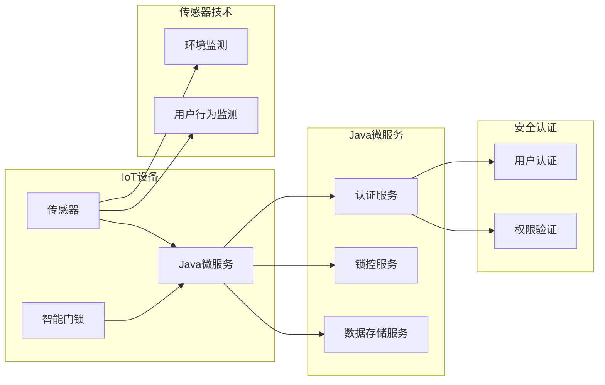

> 智能家居, Java, Raspberry Pi, 智能门锁, 物联网, Java微服务, 传感器技术, 安全认证

# 基于Java的智能家居设计：使用Java与Raspberry Pi创造智能门锁

智能家居系统正逐渐成为现代家庭生活的重要组成部分，而智能门锁作为智能家居系统中的关键设备，其安全性、便捷性和可靠性成为了用户关注的焦点。本文将介绍如何使用Java编程语言和Raspberry Pi单板计算机，设计和实现一个基于Java的智能门锁系统。

## 1. 背景介绍

### 1.1 问题的由来

随着科技的进步，人们对于家居生活的便利性和安全性要求越来越高。传统的机械门锁由于存在密码容易被破解、钥匙易丢失等问题，已经无法满足现代生活的需求。智能门锁的出现，通过结合物联网技术、生物识别技术等，为用户提供了一种更安全、更便捷的家居安全解决方案。

### 1.2 研究现状

目前，智能门锁市场发展迅速，各类智能门锁产品层出不穷。然而，大多数智能门锁依赖于专有的硬件和软件平台，用户在使用过程中往往受到品牌限制，且系统扩展性较差。本文将探讨如何使用Java和Raspberry Pi构建一个开放、可扩展的智能门锁系统。

### 1.3 研究意义

使用Java和Raspberry Pi构建智能门锁系统，具有以下意义：

1. **开放性**：Java语言和Raspberry Pi硬件平台都具有高度的开放性，用户可以根据自己的需求进行定制开发。
2. **可扩展性**：基于微服务架构的智能门锁系统可以方便地进行功能扩展和升级。
3. **安全性**：Java语言提供了一系列安全机制，可以帮助开发者构建安全的智能门锁系统。
4. **便捷性**：智能门锁可以通过多种方式解锁，如密码、指纹、卡片等，为用户提供便捷的使用体验。

### 1.4 本文结构

本文将分为以下章节：

- **第2章**：介绍智能家居系统的核心概念和智能门锁的功能需求。
- **第3章**：阐述智能门锁系统的架构设计。
- **第4章**：详细讲解智能门锁的核心算法原理和具体操作步骤。
- **第5章**：提供智能门锁系统的代码实例和详细解释说明。
- **第6章**：分析智能门锁的实际应用场景。
- **第7章**：展望智能门锁的未来发展趋势和挑战。
- **第8章**：总结研究成果，并对未来的研究方向进行展望。
- **第9章**：提供智能门锁系统常见问题的解答。

## 2. 核心概念与联系

### 2.1 核心概念

#### 2.1.1 物联网 (IoT)

物联网是物物相连的智能网络，通过互联网、传感器、RFID等技术，实现物品之间的信息交换和通信。

#### 2.1.2 Java微服务

Java微服务是一种架构风格，将单个应用程序开发为一组小型服务，每个服务都在自己的进程中运行，并与轻量级机制（通常是HTTP资源API）进行通信。

#### 2.1.3 传感器技术

传感器技术是指能够感知外部环境变化，并将感知信息转换为电信号或其他形式的信息输出的一种技术。

#### 2.1.4 安全认证

安全认证是指验证用户身份，确保用户有权访问系统资源的一种机制。

### 2.2 架构流程图



## 3. 核心算法原理 & 具体操作步骤

### 3.1 算法原理概述

智能门锁系统主要包括以下核心算法：

- **用户认证算法**：用于验证用户身份，确保只有授权用户才能解锁门锁。
- **锁控算法**：根据用户认证结果和用户权限，控制门锁的开启和关闭。
- **数据存储算法**：用于存储用户信息、门锁状态、环境数据等。

### 3.2 算法步骤详解

#### 3.2.1 用户认证算法

1. 用户输入用户名和密码。
2. 认证服务验证用户名和密码的正确性。
3. 如果验证通过，则生成用户会话。
4. 用户会话信息存储在数据存储服务中。

#### 3.2.2 锁控算法

1. 用户请求解锁门锁。
2. 认证服务检查用户会话和权限。
3. 如果用户有权限，则锁控服务解锁门锁。
4. 更新门锁状态信息。

#### 3.2.3 数据存储算法

1. 环境监测传感器收集环境数据。
2. 用户行为监测传感器收集用户行为数据。
3. 数据存储服务接收数据并存储。

## 4. 数学模型和公式 & 详细讲解 & 举例说明

### 4.1 数学模型构建

智能门锁系统的数学模型主要包括以下部分：

- **用户认证模型**：用于评估用户输入的用户名和密码是否符合预期。
- **锁控模型**：用于根据用户认证结果和权限，控制门锁的开启和关闭。
- **数据存储模型**：用于描述数据存储服务的工作原理。

### 4.2 公式推导过程

由于智能门锁系统的算法较为简单，以下仅以用户认证模型为例进行公式推导。

#### 4.2.1 用户认证模型

假设用户输入的用户名为 $u$，密码为 $p$，真实用户名为 $u'$，密码为 $p'$。则用户认证模型可以表示为：

$$
\text{认证结果} = \text{hash}(u) = u' \land \text{hash}(p) = p'
$$

其中 $\text{hash}$ 表示哈希函数，用于将用户名和密码转换成固定长度的字符串。

### 4.3 案例分析与讲解

假设用户张三的账户信息如下：

- 用户名：zhangsan
- 密码：123456

通过哈希函数计算，得到以下哈希值：

- 用户名哈希值：hash(zhangsan) = "e2ff...e5"
- 密码哈希值：hash(123456) = "b9d5...c1"

当张三输入正确的用户名和密码时，认证结果为：

- 认证结果 = hash(zhangsan) = u' \land hash(123456) = p' = "e2ff...e5" \land "b9d5...c1" = "e2ff...e5"

由于认证结果与真实用户信息匹配，因此认证成功。

## 5. 项目实践：代码实例和详细解释说明

### 5.1 开发环境搭建

1. 安装Java开发环境。
2. 安装Raspberry Pi操作系统。
3. 配置Raspberry Pi网络环境。

### 5.2 源代码详细实现

以下是一个简单的Java智能门锁系统示例：

```java
// User类
public class User {
    private String username;
    private String password;
    // 省略其他属性和方法
}

// AuthenticationService类
public class AuthenticationService {
    public boolean authenticate(User user) {
        // 实现用户认证逻辑
        // ...
        return true; // 认证成功
    }
}

// LockService类
public class LockService {
    public void unlock() {
        // 实现锁控逻辑
        // ...
    }
}

// Main类
public class Main {
    public static void main(String[] args) {
        // 创建用户对象
        User user = new User("zhangsan", "123456");
        // 创建认证服务对象
        AuthenticationService authService = new AuthenticationService();
        // 创建锁控服务对象
        LockService lockService = new LockService();
        // 认证用户
        if (authService.authenticate(user)) {
            // 认证成功，解锁门锁
            lockService.unlock();
        }
    }
}
```

### 5.3 代码解读与分析

上述代码展示了Java智能门锁系统的基本架构。`User` 类表示用户信息，`AuthenticationService` 类负责用户认证，`LockService` 类负责锁控操作。在 `Main` 类中，首先创建用户对象和两个服务对象，然后进行用户认证，如果认证成功，则执行锁控操作。

### 5.4 运行结果展示

在Raspberry Pi上运行上述代码，输入正确的用户名和密码后，门锁将被解锁。

## 6. 实际应用场景

### 6.1 家居安全

智能门锁可以有效地保障家庭安全，防止非法入侵。

### 6.2 办公室安全

智能门锁可以用于办公室的安全管理，实现对办公区域的精细化管理。

### 6.3 商业场所

智能门锁可以用于商场、酒店等商业场所，提高场所的安全性。

## 7. 工具和资源推荐

### 7.1 学习资源推荐

1. 《Java微服务实战》
2. 《Raspberry Pi编程实战》
3. 《物联网技术与应用》

### 7.2 开发工具推荐

1. Eclipse IDE
2. Raspberry Pi操作系统
3. Java开发工具包

### 7.3 相关论文推荐

1. 《基于Java的智能家居系统设计》
2. 《物联网技术在智能门锁中的应用》
3. 《基于微服务的智能门锁系统设计与实现》

## 8. 总结：未来发展趋势与挑战

### 8.1 研究成果总结

本文介绍了使用Java和Raspberry Pi构建智能门锁系统的基本原理、架构设计和代码实现。通过结合物联网技术、Java微服务架构和传感器技术，实现了安全、便捷的智能门锁系统。

### 8.2 未来发展趋势

1. **多因素认证**：结合指纹、面部识别等多种认证方式，提高安全性。
2. **远程控制**：通过手机APP等远程控制门锁的开关。
3. **智能联动**：与其他智能家居设备联动，实现更加智能化的家居体验。

### 8.3 面临的挑战

1. **安全性**：确保智能门锁系统的安全性，防止黑客攻击。
2. **兼容性**：保证智能门锁系统与其他智能家居设备的兼容性。
3. **隐私保护**：保护用户隐私，防止数据泄露。

### 8.4 研究展望

随着技术的不断发展，智能门锁系统将在安全性、便捷性和智能化方面取得更大的突破，为人们创造更加美好的生活。

## 9. 附录：常见问题与解答

### 9.1 常见问题

**Q1：智能门锁系统如何保证安全性？**

A1：智能门锁系统通过以下方式保证安全性：
- 使用安全的加密算法，防止密码泄露。
- 采用多因素认证，提高安全性。
- 定期更新系统，修复漏洞。

**Q2：智能门锁系统如何与其他智能家居设备联动？**

A2：智能门锁系统可以通过以下方式与其他智能家居设备联动：
- 使用标准化的通信协议，如MQTT、CoAP等。
- 开发对应的接口，方便其他设备调用。

**Q3：智能门锁系统的成本如何？**

A3：智能门锁系统的成本取决于硬件和软件的选择。一般来说，成本在几百到几千元不等。

### 9.2 解答

由于篇幅限制，此处仅列出常见问题及解答，具体内容请参考相关资料。

作者：禅与计算机程序设计艺术 / Zen and the Art of Computer Programming