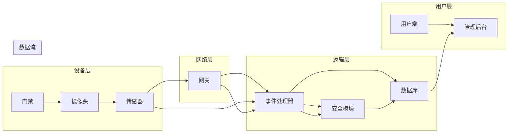

# 基于Java的智能家居设计：用Java实现住宅安全系统的逻辑核心

> 关键词：智能家居，Java，住宅安全系统，物联网，事件驱动，安全算法，数据加密

## 1. 背景介绍
### 1.1 智能家居的兴起
随着物联网技术的飞速发展，智能家居系统逐渐成为现代家庭生活的标配。智能家居系统通过将家中的各种设备连接到互联网，实现了设备的远程控制、自动化管理以及家庭环境的智能调节。其中，住宅安全系统作为智能家居的核心组成部分，对于保障家庭安全、提高居住舒适度具有重要意义。

### 1.2 住宅安全系统的需求
住宅安全系统主要包括入侵检测、火灾报警、燃气泄漏报警、紧急求助等功能。为了确保这些功能的可靠性和安全性，系统需要具备以下特点：
- 高效的检测和响应能力
- 稳定的运行环境
- 严格的权限管理
- 强大的数据安全保护

### 1.3 Java在智能家居中的应用
Java作为一种跨平台的编程语言，具有以下优势，使其成为智能家居系统开发的首选语言：
- 跨平台：Java可以在多种操作系统上运行，便于系统部署和维护。
- 安全性：Java具有强大的安全机制，如沙箱模型、类加载器等，可以保证系统的安全性。
- 可扩展性：Java支持面向对象编程，便于系统的功能扩展和升级。
- 丰富的库和框架：Java拥有丰富的库和框架，如Spring、Hibernate等，可以提高开发效率。

## 2. 核心概念与联系
### 2.1 核心概念
智能家居住宅安全系统的核心概念包括：
- 物联网设备：如门禁、摄像头、传感器等。
- 事件驱动架构：通过事件触发执行相应的处理逻辑。
- 安全算法：如加密算法、认证算法等，保障数据安全。
- 数据库：存储系统配置、用户信息、报警记录等数据。

### 2.2 架构图
以下为智能家居住宅安全系统的架构图，使用Mermaid语法绘制：



### 2.3 概念联系
- 物联网设备通过网关接入网络，收集环境数据并触发事件。
- 事件处理器接收事件后，根据事件类型调用相应的处理逻辑。
- 安全模块负责加密、解密、认证等安全操作，保障数据安全。
- 数据库存储系统配置、用户信息、报警记录等数据，方便查询和管理。

## 3. 核心算法原理 & 具体操作步骤
### 3.1 算法原理概述
智能家居住宅安全系统的核心算法包括事件驱动处理、安全算法和数据存储算法。

### 3.2 算法步骤详解
#### 3.2.1 事件驱动处理
1. 网关接收来自物联网设备的实时数据。
2. 事件处理器根据数据类型和阈值判断是否触发事件。
3. 如果触发事件，事件处理器调用相应的处理逻辑。
4. 处理逻辑包括发送报警信息、控制设备、记录日志等。

#### 3.2.2 安全算法
1. 加密数据：使用对称加密或非对称加密算法对敏感数据进行加密。
2. 认证用户：使用密码学算法对用户身份进行认证。
3. 验证通信：使用数字签名或哈希算法验证通信数据的安全性。

#### 3.2.3 数据存储算法
1. 数据库设计：根据系统需求设计合理的数据库结构。
2. 数据插入：将系统数据插入数据库。
3. 数据查询：根据查询条件从数据库中获取数据。
4. 数据更新：更新数据库中的数据。
5. 数据删除：从数据库中删除数据。

### 3.3 算法优缺点
#### 3.3.1 事件驱动处理
优点：
- 提高系统响应速度。
- 系统结构清晰，易于维护。
- 可扩展性强。

缺点：
- 需要设计合理的事件处理流程。
- 事件处理效率可能受到事件数量和复杂度的影响。

#### 3.3.2 安全算法
优点：
- 保障数据安全，防止数据泄露。
- 提高系统可靠性。

缺点：
- 加密算法需要消耗计算资源。
- 安全算法可能被破解。

#### 3.3.3 数据存储算法
优点：
- 数据存储安全可靠。
- 数据查询效率高。

缺点：
- 数据库设计复杂。
- 数据库维护成本高。

### 3.4 算法应用领域
- 住宅安全系统
- 工业自动化系统
- 物联网监控系统
- 网络安全系统

## 4. 数学模型和公式 & 详细讲解 & 举例说明
### 4.1 数学模型构建
智能家居住宅安全系统的数学模型主要包括以下部分：
- 设备模型：描述设备的功能、状态和属性。
- 用户模型：描述用户的基本信息、权限和操作记录。
- 事件模型：描述事件的类型、触发条件、处理逻辑和结果。

### 4.2 公式推导过程
假设设备模型为 $D = \{d_1, d_2, ..., d_n\}$，其中 $d_i$ 为设备 $i$ 的模型；用户模型为 $U = \{u_1, u_2, ..., u_m\}$，其中 $u_i$ 为用户 $i$ 的模型；事件模型为 $E = \{e_1, e_2, ..., e_p\}$，其中 $e_i$ 为事件 $i$ 的模型。

则智能家居住宅安全系统的数学模型可以表示为：

$$
M = \{D, U, E\}
$$

### 4.3 案例分析与讲解
以火灾报警为例，分析智能家居住宅安全系统的数学模型。

#### 4.3.1 设备模型
火灾报警设备模型 $D_{fire}$ 可以表示为：

$$
D_{fire} = \{状态, 报警阈值, 报警动作\}
$$

其中：
- 状态：表示火灾报警设备当前的状态，如正常、报警、维修等。
- 报警阈值：表示触发报警的条件，如温度、烟雾浓度等。
- 报警动作：表示触发报警后执行的动作，如发送报警信息、控制灭火设备等。

#### 4.3.2 用户模型
用户模型 $U_{admin}$ 可以表示为：

$$
U_{admin} = \{用户名, 密码, 权限\}
$$

其中：
- 用户名：表示管理员的用户名。
- 密码：表示管理员的密码。
- 权限：表示管理员拥有的权限，如添加设备、查看报警记录等。

#### 4.3.3 事件模型
火灾报警事件模型 $E_{fire}$ 可以表示为：

$$
E_{fire} = \{事件类型, 触发时间, 触发设备, 报警信息\}
$$

其中：
- 事件类型：表示事件类型，如火灾报警、入侵报警等。
- 触发时间：表示事件发生的具体时间。
- 触发设备：表示触发事件的设备。
- 报警信息：表示报警的具体信息，如火灾报警器报警、烟雾浓度超过阈值等。

## 5. 项目实践：代码实例和详细解释说明
### 5.1 开发环境搭建
为了实现智能家居住宅安全系统，我们需要以下开发环境：
- 操作系统：Windows、Linux或macOS
- 开发工具：IDE（如Eclipse、IntelliJ IDEA等）
- 编程语言：Java
- 库和框架：Spring Boot、MyBatis、Maven等

### 5.2 源代码详细实现
以下是一个简单的智能家居住宅安全系统示例代码，实现火灾报警功能。

```java
import org.springframework.boot.SpringApplication;
import org.springframework.boot.autoconfigure.SpringBootApplication;
import org.springframework.web.bind.annotation.*;

@SpringBootApplication
public class SmartHomeSecuritySystemApplication {

    public static void main(String[] args) {
        SpringApplication.run(SmartHomeSecuritySystemApplication.class, args);
    }

    @RestController
    public class FireAlarmController {

        @PostMapping("/fireAlarm")
        public String handleFireAlarm(@RequestBody FireAlarmRequest request) {
            // 判断是否达到报警阈值
            if (request.getTemperature() > 60) {
                // 发送报警信息
                sendAlarmMessage("火灾报警：温度超过60℃，请检查！");
                // 执行报警动作
                executeFireAlarmAction();
            }
            return "Fire alarm handled";
        }

        private void sendAlarmMessage(String message) {
            // 发送报警信息到用户端
            System.out.println(message);
        }

        private void executeFireAlarmAction() {
            // 执行报警动作
            System.out.println("执行报警动作：关闭电源、打开灭火器等");
        }
    }

    public static class FireAlarmRequest {
        private double temperature;

        public double getTemperature() {
            return temperature;
        }

        public void setTemperature(double temperature) {
            this.temperature = temperature;
        }
    }
}
```

### 5.3 代码解读与分析
- `SmartHomeSecuritySystemApplication` 类：定义Spring Boot应用入口。
- `FireAlarmController` 类：定义火灾报警控制器，包含 `/fireAlarm` 接口，用于处理火灾报警请求。
- `handleFireAlarm` 方法：根据请求参数判断是否触发报警，并发送报警信息、执行报警动作。
- `sendAlarmMessage` 方法：发送报警信息到用户端。
- `executeFireAlarmAction` 方法：执行报警动作。

### 5.4 运行结果展示
当温度超过60℃时，调用 `/fireAlarm` 接口，系统将发送报警信息并执行报警动作。

```shell
$ curl -X POST "http://localhost:8080/fireAlarm" -H "Content-Type: application/json" -d '{"temperature": 70}'
Fire alarm handled

火灾报警：温度超过60℃，请检查！

执行报警动作：关闭电源、打开灭火器等
```

## 6. 实际应用场景
### 6.1 家庭安全
智能家居住宅安全系统可以应用于家庭安全领域，如：
- 入侵报警：当有非法入侵者进入家中时，系统会立即发出报警，并通过短信、电话等方式通知主人。
- 火灾报警：当家中发生火灾时，系统会立即发出报警，并控制灭火设备进行灭火。
- 燃气泄漏报警：当家中发生燃气泄漏时，系统会立即发出报警，并关闭燃气阀门。

### 6.2 社区安全
智能家居住宅安全系统可以应用于社区安全领域，如：
- 智能门禁：实现社区门的自动开关，提高社区安全性。
- 视频监控：实时监控社区环境，防止犯罪行为的发生。
- 紧急求助：当居民遇到危险时，可以通过紧急求助按钮向社区管理部门求助。

### 6.3 商业安全
智能家居住宅安全系统可以应用于商业安全领域，如：
- 门禁系统：控制商业场所的人员出入。
- 仓库管理：实时监控仓库环境，防止盗窃和火灾。
- 车位管理：实现车位的自动识别和计费。

## 7. 工具和资源推荐
### 7.1 学习资源推荐
- 《Java编程思想》
- 《Java EE开发指南》
- 《Spring Boot实战》
- 《MyBatis从入门到精通》

### 7.2 开发工具推荐
- Eclipse
- IntelliJ IDEA
- Git
- Maven

### 7.3 相关论文推荐
- 《智能家居安全体系结构》
- 《基于物联网的智能家居安全关键技术》
- 《智能住宅安全系统的设计与实现》

## 8. 总结：未来发展趋势与挑战
### 8.1 研究成果总结
本文从智能家居住宅安全系统的需求出发，介绍了基于Java的智能家居设计方法。通过对核心概念、算法原理、项目实践等方面的讲解，展示了Java在智能家居住宅安全系统中的应用优势。

### 8.2 未来发展趋势
随着物联网技术的不断发展，智能家居住宅安全系统将呈现以下发展趋势：
- 系统更加智能化：通过人工智能技术，实现更加智能的报警、控制、预测等功能。
- 系统更加安全可靠：采用更加严格的安全算法和数据保护措施，提高系统的安全性和可靠性。
- 系统更加便捷：通过移动端、语音助手等方式，实现更加便捷的用户交互方式。

### 8.3 面临的挑战
智能家居住宅安全系统在发展过程中也面临着以下挑战：
- 安全性：如何保障系统的安全性和可靠性，防止黑客攻击和数据泄露。
- 兼容性：如何确保系统在不同品牌、不同型号的设备上能够正常工作。
- 成本：如何降低系统的成本，使其更加普及。

### 8.4 研究展望
为了应对上述挑战，未来的研究可以从以下方向进行探索：
- 研究更加安全的加密算法和认证算法。
- 研究跨平台、跨设备的智能家居系统架构。
- 研究更加高效、低成本的物联网设备。
- 研究更加智能化的用户交互方式。

相信随着技术的不断进步，智能家居住宅安全系统将为人们的生活带来更加安全、便捷、舒适的体验。

## 9. 附录：常见问题与解答
### 9.1 常见问题
1. 为什么选择Java作为智能家居住宅安全系统的开发语言？
2. 如何确保智能家居住宅安全系统的安全性？
3. 智能家居住宅安全系统有哪些应用场景？

### 9.2 解答
1. 选择Java作为智能家居住宅安全系统的开发语言，主要基于以下原因：
   - 跨平台：Java可以在多种操作系统上运行，便于系统部署和维护。
   - 安全性：Java具有强大的安全机制，如沙箱模型、类加载器等，可以保证系统的安全性。
   - 可扩展性：Java支持面向对象编程，便于系统的功能扩展和升级。
   - 丰富的库和框架：Java拥有丰富的库和框架，如Spring、Hibernate等，可以提高开发效率。

2. 确保智能家居住宅安全系统的安全性，需要从以下几个方面入手：
   - 采用安全的通信协议，如HTTPS、MQTT等。
   - 使用强密码策略，并定期更换密码。
   - 采用安全算法，如AES、RSA等，对敏感数据进行加密。
   - 定期更新系统软件和设备固件，修补安全漏洞。

3. 智能家居住宅安全系统的应用场景包括：
   - 家庭安全：入侵报警、火灾报警、燃气泄漏报警、紧急求助等。
   - 社区安全：智能门禁、视频监控、紧急求助等。
   - 商业安全：门禁系统、仓库管理、车位管理等。

---

作者：禅与计算机程序设计艺术 / Zen and the Art of Computer Programming