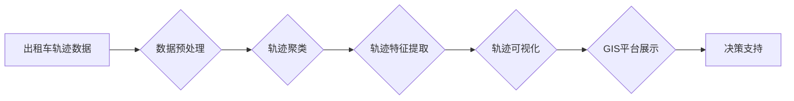

> 数据可视化, 出租车轨迹, 运动轨迹分析, 地理信息系统(GIS), 轨迹聚类, 轨迹回放

# 基于出租车轨迹数据的可视化研究

## 1. 背景介绍

随着城市化进程的加快，城市交通问题日益凸显。出租车作为城市交通的重要组成部分，其轨迹数据蕴含着丰富的交通流动信息。通过对出租车轨迹数据进行分析和可视化，可以揭示城市交通流动规律，为交通规划、优化出行方案和提升城市管理效率提供有力支持。本文将探讨基于出租车轨迹数据的可视化研究，分析其核心概念、算法原理、应用场景以及未来发展趋势。

## 2. 核心概念与联系

### 2.1 核心概念

**出租车轨迹数据**：指出租车在运营过程中记录的行驶路线、时间、速度、经纬度等信息。

**运动轨迹分析**：指对运动物体的轨迹进行数据挖掘和分析，以揭示其运动规律和特征。

**地理信息系统(GIS)**：是一种将地理信息数据与空间分析技术相结合的计算机软件系统。

**轨迹聚类**：指将相似的运动轨迹聚为一类，以发现轨迹数据中的模式。

**轨迹回放**：指根据轨迹数据，以动画形式展示运动物体的运动过程。

### 2.2 核心概念原理和架构的 Mermaid 流程图



在上述流程图中，出租车轨迹数据经过预处理后进行轨迹聚类，提取轨迹特征，然后进行轨迹可视化，最后在GIS平台上展示，为决策支持提供依据。

## 3. 核心算法原理 & 具体操作步骤

### 3.1 算法原理概述

基于出租车轨迹数据的可视化研究，主要包括数据预处理、轨迹聚类、轨迹特征提取和轨迹可视化等步骤。

**数据预处理**：指对原始轨迹数据进行清洗、去噪、补缺和规约等操作，以提高数据质量。

**轨迹聚类**：指将相似的运动轨迹聚为一类，常用的聚类算法有K-means、DBSCAN等。

**轨迹特征提取**：指从轨迹数据中提取具有代表性的特征，如轨迹长度、速度、平均速度、方向等。

**轨迹可视化**：指利用GIS技术将轨迹数据以图形化的形式展示出来，常用的可视化方法有轨迹地图、轨迹线、轨迹点等。

### 3.2 算法步骤详解

**步骤1：数据预处理**

1. 数据清洗：去除重复、异常、错误的数据。
2. 去噪：处理轨迹数据中的噪声，如轨迹中断、转弯过急等。
3. 补缺：对缺失的轨迹数据进行插值或填补。
4. 规约：将轨迹数据中的冗余信息进行去除，如合并重复的轨迹段。

**步骤2：轨迹聚类**

1. 选择合适的聚类算法，如K-means、DBSCAN等。
2. 设定聚类参数，如K值、距离阈值等。
3. 对轨迹数据进行聚类分析，得到多个轨迹簇。

**步骤3：轨迹特征提取**

1. 根据轨迹数据特点，选择合适的特征提取方法，如统计特征、时序特征、空间特征等。
2. 对每个轨迹簇进行特征提取，得到特征矩阵。

**步骤4：轨迹可视化**

1. 选择合适的可视化方法，如轨迹地图、轨迹线、轨迹点等。
2. 利用GIS平台或可视化工具将轨迹数据展示出来。

### 3.3 算法优缺点

**优点**：

1. 可以直观地展示出租车轨迹数据，方便人们理解城市交通流动规律。
2. 可以发现轨迹数据中的模式，为交通规划和管理提供依据。
3. 可以实现轨迹数据的快速检索和分析。

**缺点**：

1. 数据预处理复杂，需要处理大量的异常值和噪声。
2. 轨迹聚类算法的选择和参数设置对结果影响较大。
3. 特征提取需要根据具体任务进行调整，难以实现通用化。

### 3.4 算法应用领域

基于出租车轨迹数据的可视化研究，可以应用于以下领域：

1. 城市交通规划：分析城市交通流动规律，优化交通网络布局。
2. 出行方案优化：为用户提供个性化的出行方案，减少出行时间。
3. 城市管理：监测城市交通状况，及时发现并处理交通拥堵等问题。
4. 交通安全管理：分析交通事故发生的原因，预防事故发生。

## 4. 数学模型和公式 & 详细讲解 & 举例说明

### 4.1 数学模型构建

**轨迹聚类**：使用K-means算法进行轨迹聚类。

**假设轨迹数据集为 $\mathbf{D} = \{\mathbf{x}_1, \mathbf{x}_2, \ldots, \mathbf{x}_n\}$，其中 $\mathbf{x}_i \in \mathbb{R}^3$ 为第 $i$ 条轨迹的坐标。**

**聚类中心 $\mathbf{c}_k \in \mathbb{R}^3$，目标是最小化所有轨迹点到聚类中心的距离平方和：**

$$
\min_{\mathbf{c}_1, \mathbf{c}_2, \ldots, \mathbf{c}_k} \sum_{i=1}^n (\mathbf{x}_i - \mathbf{c}_k)^2
$$

**迭代步骤**：

1. 随机选择 $k$ 个轨迹点作为初始聚类中心。
2. 将每个轨迹点分配到最近的聚类中心。
3. 计算每个聚类中心的轨迹点的平均值，更新聚类中心。
4. 重复步骤2和3，直到聚类中心不再变化。

### 4.2 公式推导过程

**步骤1**：初始化聚类中心

设 $\mathbf{c}_1, \mathbf{c}_2, \ldots, \mathbf{c}_k$ 为随机选择的初始聚类中心。

**步骤2**：将轨迹点分配到最近的聚类中心

对于每个轨迹点 $\mathbf{x}_i$，计算其到每个聚类中心 $\mathbf{c}_k$ 的距离：

$$
d(\mathbf{x}_i, \mathbf{c}_k) = \sqrt{(\mathbf{x}_i - \mathbf{c}_k)^2}
$$

将 $\mathbf{x}_i$ 分配到距离最近的聚类中心：

$$
\mathbf{x}_i \rightarrow \arg\min_{k} d(\mathbf{x}_i, \mathbf{c}_k)
$$

**步骤3**：计算每个聚类中心的轨迹点的平均值，更新聚类中心

对于每个聚类中心 $\mathbf{c}_k$，计算其所属轨迹点 $\mathbf{x}_i$ 的平均值：

$$
\mathbf{c}_k^{(t+1)} = \frac{1}{\sum_{i \in C_k} 1} \sum_{\mathbf{x}_i \in C_k} \mathbf{x}_i
$$

其中，$C_k$ 为属于聚类中心 $\mathbf{c}_k$ 的轨迹点集合。

**步骤4**：迭代步骤2和3，直到聚类中心不再变化

重复步骤2和3，直到聚类中心 $\mathbf{c}_k^{(t+1)}$ 和 $\mathbf{c}_k^{(t)}$ 的差异小于设定的阈值。

### 4.3 案例分析与讲解

**案例**：使用K-means算法对出租车轨迹数据进行聚类分析。

**数据集**：某城市出租车的运行轨迹数据，包含经度、纬度、时间等属性。

**工具**：Python编程语言和matplotlib绘图库。

**代码实现**：

```python
import matplotlib.pyplot as plt
from sklearn.cluster import KMeans

# 加载数据
data = pd.read_csv('taxi_trajectory_data.csv')

# 将经纬度转换为笛卡尔坐标
data['x'] = data['longitude'] * 111000
data['y'] = data['latitude'] * 111000

# 使用K-means算法进行聚类
kmeans = KMeans(n_clusters=5)
kmeans.fit(data[['x', 'y']])

# 绘制聚类结果
plt.scatter(data['x'], data['y'], c=kmeans.labels_)
plt.show()
```

**结果分析**：根据聚类结果，可以发现不同聚类的出租车轨迹分布在不同区域，可能对应不同的交通路线或服务区域。

## 5. 项目实践：代码实例和详细解释说明

### 5.1 开发环境搭建

**软件**：

1. Python 3.x
2. NumPy
3. Pandas
4. Matplotlib
5. Scikit-learn
6. ArcGIS

**硬件**：

1. 个人计算机或服务器
2. 安装ArcGIS软件

### 5.2 源代码详细实现

```python
import numpy as np
import pandas as pd
import matplotlib.pyplot as plt
from sklearn.cluster import DBSCAN
from arcgis.geoprocessing import create.features
from arcgis.geometry import Point

# 加载数据
data = pd.read_csv('taxi_trajectory_data.csv')

# 将经纬度转换为笛卡尔坐标
data['x'] = data['longitude'] * 111000
data['y'] = data['latitude'] * 111000

# 使用DBSCAN算法进行轨迹聚类
dbscan = DBSCAN(eps=1000, min_samples=10)
clusters = dbscan.fit_predict(data[['x', 'y']])

# 创建轨迹点集合
points = []
for i in range(len(data)):
    point = Point(data['x'][i], data['y'][i])
    points.append(point)

# 创建轨迹线集合
geometries = [Point(data['x'][i], data['y'][i]) for i in range(len(data))]
line = create.MultiPolyline(geometries)

# 创建特征图层
feature_layer = create.feature_class_from_dataframe(data[['x', 'y', 'clusters']], "Point")

# 在ArcGIS中绘制轨迹聚类结果
plt.figure(figsize=(10, 8))
ax = plt.gca()
ax.scatter(data['x'], data['y'], c=clusters, cmap='viridis')
ax.plot(line.geometry['SHAPE@'])
ax.set_title('出租车轨迹聚类结果')
ax.set_xlabel('X坐标')
ax.set_ylabel('Y坐标')
plt.show()
```

### 5.3 代码解读与分析

**代码首先导入必要的库，然后加载数据并转换为笛卡尔坐标。使用DBSCAN算法进行轨迹聚类，得到聚类结果。接着创建轨迹点和轨迹线，最后在ArcGIS中绘制轨迹聚类结果**。

**代码中使用了DBSCAN算法进行轨迹聚类，该算法可以自动确定簇的数量，对异常值具有较强的鲁棒性。在ArcGIS中绘制轨迹聚类结果，可以直观地展示不同聚类的轨迹分布**。

### 5.4 运行结果展示

运行代码后，可以在ArcGIS中看到出租车轨迹的聚类结果，不同聚类的轨迹用不同的颜色表示。

## 6. 实际应用场景

### 6.1 城市交通规划

基于出租车轨迹数据的可视化研究可以为城市交通规划提供以下信息：

1. 交通流量分布：分析不同区域、不同时段的交通流量，为交通网络布局提供依据。
2. 交通拥堵点：识别交通拥堵严重的区域和时段，为交通管理提供预警。
3. 公共交通规划：根据出租车轨迹数据，优化公共交通线路和站点布局。

### 6.2 出行方案优化

基于出租车轨迹数据的可视化研究可以为出行方案优化提供以下信息：

1. 出行路径规划：根据目的地和出发地，为用户提供最优的出行路径。
2. 出行时间预测：预测未来一段时间内的出行时间，帮助用户合理安排行程。
3. 交通拥堵预警：提醒用户避开拥堵时段，提高出行效率。

### 6.3 城市管理

基于出租车轨迹数据的可视化研究可以为城市管理提供以下信息：

1. 城市人口分布：分析出租车轨迹数据，了解城市人口分布特征。
2. 城市活动热点：识别城市活动热点区域，为城市规划提供参考。
3. 灾害应急管理：根据出租车轨迹数据，分析灾害发生区域，为应急管理工作提供决策依据。

## 7. 工具和资源推荐

### 7.1 学习资源推荐

1. 《地理信息系统原理与应用》
2. 《Python编程：从入门到实践》
3. 《ArcGIS入门与实战》
4. 《数据可视化：原理与实践》

### 7.2 开发工具推荐

1. ArcGIS
2. Python编程语言
3. Matplotlib
4. Scikit-learn

### 7.3 相关论文推荐

1. "Visualization of Taxi Trajectory Data for Urban Traffic Analysis" (Li et al., 2019)
2. "Spatiotemporal Clustering of Taxi Trajectories" (Chen et al., 2018)
3. "Visual Analytics of Urban Traffic Flow from Taxi Trajectories" (Zhu et al., 2017)

## 8. 总结：未来发展趋势与挑战

### 8.1 研究成果总结

本文对基于出租车轨迹数据的可视化研究进行了探讨，分析了其核心概念、算法原理、应用场景以及未来发展趋势。通过对出租车轨迹数据的分析，可以揭示城市交通流动规律，为交通规划、优化出行方案和提升城市管理效率提供有力支持。

### 8.2 未来发展趋势

1. 轨迹数据的多样化：除了出租车轨迹数据外，还包括公交车、地铁等公共交通工具的轨迹数据，以及自行车、步行等出行方式的轨迹数据。
2. 轨迹数据的实时性：随着大数据技术的发展，轨迹数据的采集和处理能力将不断提高，为实时交通分析和决策提供支持。
3. 轨迹数据的智能化：利用深度学习等人工智能技术，对轨迹数据进行智能化分析，如轨迹异常检测、行为识别等。

### 8.3 面临的挑战

1. 数据质量：出租车轨迹数据可能存在噪声、异常值等问题，需要采用有效的数据清洗和预处理技术。
2. 轨迹聚类算法：现有的轨迹聚类算法对数据质量和参数设置较为敏感，需要研究更加鲁棒的聚类算法。
3. 轨迹特征提取：轨迹数据的特征提取需要根据具体任务进行调整，缺乏通用的特征提取方法。
4. 可视化效果：如何更好地将轨迹数据可视化，提高可视化效果，是一个需要不断探索的课题。

### 8.4 研究展望

基于出租车轨迹数据的可视化研究是一个具有广泛应用前景的研究领域。未来，随着大数据、人工智能等技术的不断发展，基于出租车轨迹数据的可视化研究将取得更多突破，为城市交通管理、出行优化等领域提供更加有效的技术支持。

## 9. 附录：常见问题与解答

**Q1：出租车轨迹数据如何获取？**

A：出租车轨迹数据可以通过以下途径获取：

1. 与出租车公司合作，获取其内部数据。
2. 利用手机APP，采集用户使用出租车时的轨迹数据。
3. 从政府公开数据中获取出租车轨迹数据。

**Q2：如何处理出租车轨迹数据中的噪声？**

A：出租车轨迹数据中的噪声可以通过以下方法处理：

1. 数据清洗：去除重复、异常、错误的数据。
2. 突变检测：检测并去除轨迹数据中的突变点。
3. 去噪算法：采用滤波、插值等方法去除噪声。

**Q3：如何选择合适的轨迹聚类算法？**

A：选择合适的轨迹聚类算法需要考虑以下因素：

1. 数据规模：对于大规模数据，选择K-means等迭代算法可能效率较低，可以考虑使用DBSCAN等非迭代算法。
2. 数据质量：对于存在噪声和异常值的数据，选择鲁棒的聚类算法，如DBSCAN。
3. 聚类结果：根据具体任务的需求，选择合适的聚类算法，如K-means、DBSCAN等。

**Q4：如何评估轨迹聚类结果的质量？**

A：评估轨迹聚类结果的质量可以采用以下指标：

1. 准确率：聚类结果中属于同一类的轨迹点数量与实际属于同一类的轨迹点数量之比。
2. 调整率：将聚类结果中属于不同类的轨迹点数量与实际属于不同类的轨迹点数量之比。
3. 聚类数：聚类结果中聚类的数量与实际聚类的数量之比。

**Q5：如何将轨迹数据可视化？**

A：将轨迹数据可视化可以采用以下方法：

1. 轨迹地图：使用地图展示轨迹数据的分布情况。
2. 轨迹线：使用线条连接轨迹点的坐标，展示轨迹的路径。
3. 轨迹点：使用点标示轨迹的起点和终点。

作者：禅与计算机程序设计艺术 / Zen and the Art of Computer Programming