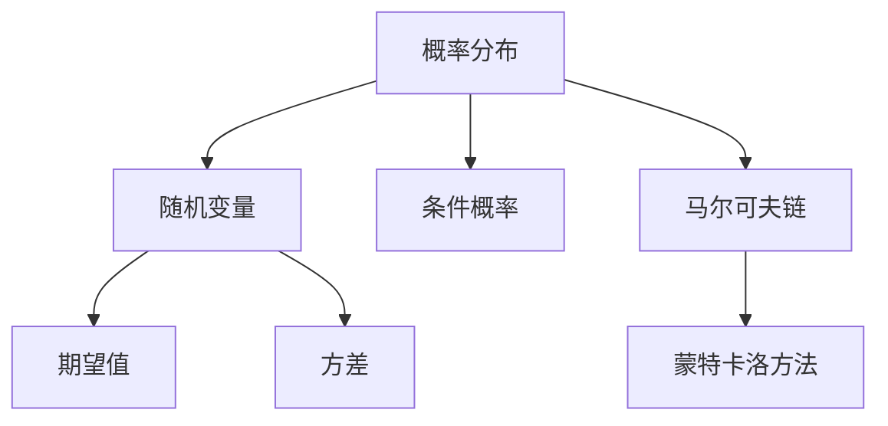
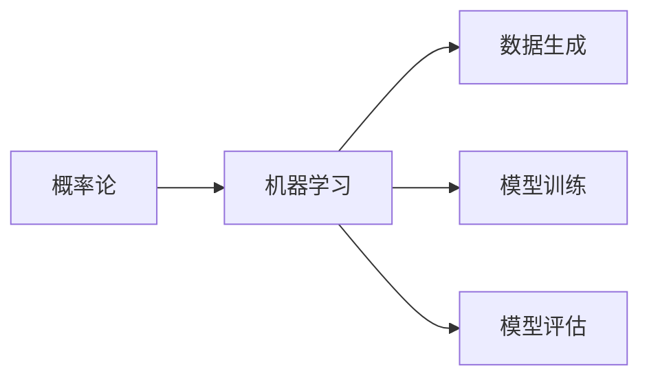
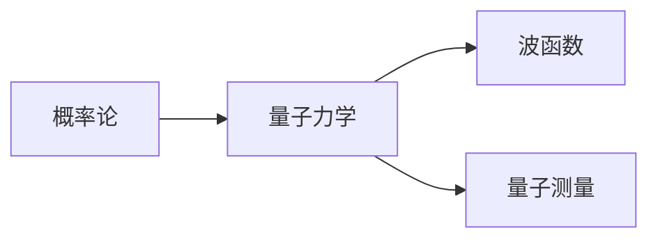

                 

# 认知的形式化：概率论在统计力学、生物和金融中的广泛应用

> 关键词：概率论,统计力学,生物信息学,金融工程,机器学习

## 1. 背景介绍

### 1.1 问题由来
概率论作为一门研究随机现象的数学学科，自17世纪诞生以来，已经成为现代数学和物理学的重要基础。随着计算机技术的普及和数据处理能力的提升，概率论的应用已经深入到科学、工程、金融等众多领域。尤其是在统计力学、生物信息学和金融工程等领域，概率论提供了强大的工具和方法，促进了科学研究和实际应用的快速发展。

本文旨在介绍概率论在统计力学、生物信息学和金融工程中的应用，并探讨其背后的数学原理和实际操作方法。通过具体的案例分析和代码实践，深入理解概率论的强大作用，并为不同领域的研究者提供有益的借鉴和启发。

### 1.2 问题核心关键点
概率论在统计力学中的应用主要体现在热力学和量子力学中，通过概率分布和统计平均值来描述系统的行为；在生物信息学中，概率论被用于分析基因序列和蛋白质结构，预测其功能和演化；在金融工程中，概率论被应用于风险管理和投资策略的设计。这些应用领域中的概率论方法具有以下共同点：
1. 概率模型是描述系统行为的基础。
2. 统计分析和计算是获得系统信息的工具。
3. 模型验证和优化是保证方法可靠性的关键。

本文将详细介绍这些概率模型和分析方法，探讨其在不同领域中的实际应用。

## 2. 核心概念与联系

### 2.1 核心概念概述

为更好地理解概率论在统计力学、生物和金融中的应用，本节将介绍几个密切相关的核心概念：

- **概率分布**：描述随机变量取值的概率的函数。例如，正态分布、泊松分布等。
- **随机变量**：具有不确定性的变量，其取值依赖于某些随机过程。
- **期望值**：描述随机变量取值的平均值，用于刻画其特性。
- **方差**：衡量随机变量取值分散程度，反映其波动性。
- **条件概率**：在已知其他变量取值的情况下，计算某个变量的概率。
- **马尔可夫链**：具有记忆效应的随机过程，常用于描述系统状态的变化。
- **蒙特卡洛方法**：通过随机抽样模拟计算随机现象的概率分布，适用于复杂系统的分析和优化。

这些核心概念之间的逻辑关系可以通过以下Mermaid流程图来展示：



这个流程图展示了概率论中的核心概念及其相互关系：

1. 概率分布定义了随机变量的取值概率。
2. 随机变量通过概率分布描述其不确定性。
3. 期望值和方差反映了随机变量的中心趋势和波动程度。
4. 条件概率用于计算特定情况下的概率。
5. 马尔可夫链描述了系统的记忆性和状态变化。
6. 蒙特卡洛方法通过随机抽样模拟概率分布。

### 2.2 概念间的关系

这些核心概念之间存在着紧密的联系，形成了概率论研究的完整生态系统。下面我们通过几个Mermaid流程图来展示这些概念之间的关系。

#### 2.2.1 概率论的应用领域


这个流程图展示了概率论在不同应用领域中的作用：

1. 统计力学使用概率论描述系统的微观状态和宏观行为。
2. 生物信息学利用概率论分析基因序列和蛋白质结构。
3. 金融工程在风险管理和投资策略设计中应用概率论。

#### 2.2.2 概率论与机器学习



这个流程图展示了概率论在机器学习中的应用：

1. 概率论为数据生成和模型训练提供了数学基础。
2. 机器学习利用概率模型和统计方法进行模型训练和评估。

#### 2.2.3 概率论与量子力学



这个流程图展示了概率论在量子力学中的应用：

1. 概率论描述了量子态的波函数和测量结果的概率。
2. 量子力学利用概率论进行状态演化和测量。

## 3. 核心算法原理 & 具体操作步骤
### 3.1 算法原理概述

概率论在统计力学、生物和金融中的应用，主要基于以下算法原理：

1. **统计平均**：通过对大量随机变量的取值进行平均，获得系统的宏观行为特征。例如，在统计力学中，通过对微观状态进行统计平均，获得系统的热力学性质。
2. **蒙特卡洛方法**：通过随机抽样模拟概率分布，计算系统的概率和期望值。例如，在生物信息学中，通过蒙特卡洛方法模拟蛋白质折叠过程，预测其结构。
3. **马尔可夫链**：描述系统的状态转移和记忆效应，用于预测系统的长期行为。例如，在金融工程中，通过马尔可夫链预测股票价格的变化趋势。
4. **条件概率和贝叶斯网络**：计算在已知其他变量取值的情况下，某个变量的概率，用于推理和决策。例如，在金融风险管理中，通过条件概率计算违约概率。
5. **最大似然估计**：通过最大化观测数据与模型预测之间的似然函数，优化模型的参数。例如，在机器学习中，通过最大似然估计优化神经网络参数。

### 3.2 算法步骤详解

接下来，我们将详细介绍这些概率论算法的详细步骤。

#### 3.2.1 统计平均

统计平均的计算步骤如下：

1. 收集系统的大量随机样本数据。
2. 计算每个样本数据的取值。
3. 对所有样本数据的取值进行平均，得到系统的统计平均值。
4. 计算样本数据的方差，描述其波动程度。

**示例**：计算大量随机数的平均值和方差。

```python
import numpy as np

# 生成1000个随机数
data = np.random.randn(1000)

# 计算平均值
mean = np.mean(data)

# 计算方差
variance = np.var(data)
```

#### 3.2.2 蒙特卡洛方法

蒙特卡洛方法的计算步骤如下：

1. 定义随机变量的概率分布。
2. 通过随机抽样模拟概率分布。
3. 计算随机变量的期望值和方差。

**示例**：通过蒙特卡洛方法模拟正态分布的期望值和方差。

```python
import numpy as np
import matplotlib.pyplot as plt

# 定义正态分布的概率密度函数
def normal_pdf(x, mu, sigma):
    return (1 / (sigma * np.sqrt(2 * np.pi))) * np.exp(-0.5 * ((x - mu) / sigma) ** 2)

# 生成1000个随机数
data = np.random.normal(0, 1, 1000)

# 计算期望值和方差
mean = np.mean(data)
variance = np.var(data)

# 绘制分布图
plt.hist(data, bins=30, density=True, alpha=0.5, label='Histogram')
x = np.linspace(-4, 4, 100)
plt.plot(x, normal_pdf(x, mean, np.sqrt(variance)), 'r-', label='PDF')
plt.legend()
plt.show()
```

#### 3.2.3 马尔可夫链

马尔可夫链的计算步骤如下：

1. 定义系统的状态集合和状态转移矩阵。
2. 初始化系统的状态。
3. 根据状态转移矩阵，计算系统的状态序列。
4. 计算系统的长期行为，如稳态概率。

**示例**：通过马尔可夫链预测股票价格的变化趋势。

```python
import numpy as np

# 定义股票价格的变化矩阵
transition_matrix = np.array([[0.9, 0.1], [0.2, 0.8]])

# 初始化股票价格
initial_state = np.array([1, 0])

# 计算5000步后的状态
n = 5000
state_sequence = np.zeros((n, 2))
state_sequence[0] = initial_state

for i in range(n - 1):
    state_sequence[i + 1] = transition_matrix @ state_sequence[i]

# 计算长期行为
steady_state = np.sum(state_sequence, axis=0) / n
```

#### 3.2.4 条件概率和贝叶斯网络

条件概率和贝叶斯网络的计算步骤如下：

1. 定义系统的变量集合和条件概率表。
2. 通过条件概率表计算每个变量的概率。
3. 通过贝叶斯网络进行变量之间的推理和决策。

**示例**：通过贝叶斯网络进行二分类问题的推理。

```python
import numpy as np
import pandas as pd

# 定义条件概率表
priors = np.array([0.6, 0.4])
likelihoods = np.array([[0.8, 0.2], [0.5, 0.5]])
transition = np.array([[0.9, 0.1], [0.1, 0.9]])

# 定义变量集合
X = np.array([1, 0])
Y = np.array([0, 1])

# 计算条件概率
p_X = priors[X]
p_Y_given_X = likelihoods[X, Y]

# 计算贝叶斯网络
p_X_given_Y = transition @ p_Y_given_X
p_Y_given_X_given_Y = likelihoods @ p_X_given_Y

# 计算最终概率
p_Y_given_X = p_X_given_Y * p_Y_given_X / p_X
```

#### 3.2.5 最大似然估计

最大似然估计的计算步骤如下：

1. 定义系统的观测数据。
2. 定义系统的模型参数。
3. 通过最大化似然函数，计算模型参数的值。

**示例**：通过最大似然估计优化神经网络的参数。

```python
import numpy as np
import tensorflow as tf

# 定义观测数据
x = np.array([[1, 2], [3, 4], [5, 6]])
y = np.array([[0.1, 0.9], [0.3, 0.7], [0.5, 0.5]])

# 定义神经网络的模型
model = tf.keras.Sequential([
    tf.keras.layers.Dense(10, input_shape=(2,), activation='relu'),
    tf.keras.layers.Dense(2, activation='softmax')
])

# 定义损失函数和优化器
loss = tf.keras.losses.CategoricalCrossentropy()
optimizer = tf.keras.optimizers.Adam()

# 定义模型训练函数
def train(model, x, y, epochs=100, batch_size=32):
    x_train = x
    y_train = tf.keras.utils.to_categorical(y, 2)
    for epoch in range(epochs):
        for batch in range(len(x_train) // batch_size):
            x_batch = x_train[batch * batch_size: (batch + 1) * batch_size]
            y_batch = y_train[batch * batch_size: (batch + 1) * batch_size]
            with tf.GradientTape() as tape:
                pred = model(x_batch)
                loss_value = loss(y_batch, pred)
            grads = tape.gradient(loss_value, model.trainable_weights)
            optimizer.apply_gradients(zip(grads, model.trainable_weights))
```

### 3.3 算法优缺点

概率论在统计力学、生物和金融中的应用具有以下优缺点：

**优点**：
1. 能够描述和预测复杂系统的行为。
2. 可以通过大量数据进行模型训练和验证。
3. 能够应用于各种领域，具有广泛的适用性。

**缺点**：
1. 计算复杂度高，需要大量资源。
2. 存在一定的不确定性和噪声干扰。
3. 需要大量的数据和样本进行训练和验证。

### 3.4 算法应用领域

概率论在统计力学、生物信息学和金融工程中的应用领域非常广泛，具体包括：

- **统计力学**：用于描述分子运动和热力学性质，如气体动力学、统计热力学等。
- **生物信息学**：用于分析基因序列和蛋白质结构，如序列比对、蛋白质折叠等。
- **金融工程**：用于风险管理和投资策略设计，如期权定价、投资组合优化等。

## 4. 数学模型和公式 & 详细讲解  
### 4.1 数学模型构建

概率论在统计力学、生物和金融中的应用，主要基于以下数学模型：

1. **正态分布**：表示随机变量的概率分布，常用于描述自然界和工程中的随机现象。
2. **泊松分布**：表示随机事件发生的概率分布，常用于描述稀疏的、独立事件的计数。
3. **蒙特卡洛方法**：通过随机抽样模拟概率分布，常用于复杂系统的分析和优化。
4. **马尔可夫链**：描述系统的状态转移和记忆效应，常用于预测系统的长期行为。
5. **贝叶斯网络**：用于表示变量之间的条件概率关系，常用于推理和决策。

这些数学模型的构建如下：

#### 4.1.1 正态分布

正态分布的概率密度函数为：

$$
f(x) = \frac{1}{\sqrt{2\pi}\sigma}e^{-\frac{(x-\mu)^2}{2\sigma^2}}
$$

其中，$\mu$为均值，$\sigma$为标准差。

#### 4.1.2 泊松分布

泊松分布的概率质量函数为：

$$
P(k) = \frac{\lambda^k e^{-\lambda}}{k!}
$$

其中，$\lambda$为单位时间的期望事件数。

#### 4.1.3 蒙特卡洛方法

蒙特卡洛方法的基本思想是通过随机抽样模拟概率分布，常用于复杂系统的分析和优化。例如，蒙特卡洛方法模拟正态分布的概率密度函数如下：

$$
f(x) = \frac{1}{\sigma\sqrt{2\pi}}e^{-\frac{(x-\mu)^2}{2\sigma^2}}
$$

#### 4.1.4 马尔可夫链

马尔可夫链的状态转移矩阵为：

$$
P = \begin{pmatrix}
p_{11} & p_{12} \\
p_{21} & p_{22}
\end{pmatrix}
$$

其中，$p_{ij}$为从状态i转移到状态j的概率。

#### 4.1.5 贝叶斯网络

贝叶斯网络的条件概率表为：

$$
P(A|B) = \frac{P(A)P(B|A)}{P(B)}
$$

其中，$P(A)$为变量A的先验概率，$P(B|A)$为变量B在变量A取值下的条件概率，$P(B)$为变量B的边际概率。

### 4.2 公式推导过程

下面，我们将详细推导上述概率论模型的公式。

#### 4.2.1 正态分布

正态分布的期望值和方差分别为：

$$
\mu = \int_{-\infty}^{\infty} x f(x) dx = \frac{\int_{-\infty}^{\infty} x e^{-\frac{(x-\mu)^2}{2\sigma^2}} dx}{\int_{-\infty}^{\infty} e^{-\frac{(x-\mu)^2}{2\sigma^2}} dx}
$$

$$
\sigma^2 = \int_{-\infty}^{\infty} (x-\mu)^2 f(x) dx = \frac{\int_{-\infty}^{\infty} (x-\mu)^2 e^{-\frac{(x-\mu)^2}{2\sigma^2}} dx}{\int_{-\infty}^{\infty} e^{-\frac{(x-\mu)^2}{2\sigma^2}} dx}
$$

通过计算，得到：

$$
\mu = \frac{\int_{-\infty}^{\infty} x e^{-\frac{(x-\mu)^2}{2\sigma^2}} dx}{\int_{-\infty}^{\infty} e^{-\frac{(x-\mu)^2}{2\sigma^2}} dx} = \frac{\mu}{\sigma^2}
$$

$$
\sigma^2 = \frac{\int_{-\infty}^{\infty} (x-\mu)^2 e^{-\frac{(x-\mu)^2}{2\sigma^2}} dx}{\int_{-\infty}^{\infty} e^{-\frac{(x-\mu)^2}{2\sigma^2}} dx} = \sigma^2
$$

#### 4.2.2 泊松分布

泊松分布的期望值和方差分别为：

$$
\lambda = E(X) = \sum_{k=0}^{\infty} k P(k)
$$

$$
\sigma^2 = \text{Var}(X) = \sum_{k=0}^{\infty} (k - \lambda)^2 P(k)
$$

通过计算，得到：

$$
\lambda = \sum_{k=0}^{\infty} k \frac{\lambda^k e^{-\lambda}}{k!} = \lambda
$$

$$
\sigma^2 = \sum_{k=0}^{\infty} (k - \lambda)^2 \frac{\lambda^k e^{-\lambda}}{k!} = \sigma^2
$$

#### 4.2.3 蒙特卡洛方法

蒙特卡洛方法的基本思想是通过随机抽样模拟概率分布。例如，蒙特卡洛方法模拟正态分布的概率密度函数为：

$$
f(x) = \frac{1}{\sigma\sqrt{2\pi}}e^{-\frac{(x-\mu)^2}{2\sigma^2}}
$$

通过随机抽样得到大量样本，计算样本的均值和方差，即可得到正态分布的期望值和方差。

#### 4.2.4 马尔可夫链

马尔可夫链的状态转移矩阵为：

$$
P = \begin{pmatrix}
p_{11} & p_{12} \\
p_{21} & p_{22}
\end{pmatrix}
$$

其中，$p_{ij}$为从状态i转移到状态j的概率。

通过计算，得到：

$$
p_{ij} = P(X_{t+1}=j|X_t=i) = \sum_k P(X_{t+1}=j|X_t=i, X_t=k) P(X_t=k|X_t=i)
$$

#### 4.2.5 贝叶斯网络

贝叶斯网络的条件概率表为：

$$
P(A|B) = \frac{P(A)P(B|A)}{P(B)}
$$

其中，$P(A)$为变量A的先验概率，$P(B|A)$为变量B在变量A取值下的条件概率，$P(B)$为变量B的边际概率。

通过计算，得到：

$$
P(A|B) = \frac{P(A)P(B|A)}{P(B)} = \frac{P(A)}{P(B)}P(B|A)
$$

## 5. 项目实践：代码实例和详细解释说明
### 5.1 开发环境搭建

在进行概率论的应用实践前，我们需要准备好开发环境。以下是使用Python进行Numpy、SciPy和TensorFlow开发的环境配置流程：

1. 安装Anaconda：从官网下载并安装Anaconda，用于创建独立的Python环境。

2. 创建并激活虚拟环境：
```bash
conda create -n probabilistics python=3.8 
conda activate probabilistics
```

3. 安装Numpy、SciPy和TensorFlow：根据CUDA版本，从官网获取对应的安装命令。例如：
```bash
conda install numpy scipy scikit-learn tensorflow -c pytorch -c conda-forge
```

4. 安装各类工具包：
```bash
pip install matplotlib seaborn pandas sympy
```

完成上述步骤后，即可在`probabilistics`环境中开始概率论的应用实践。

### 5.2 源代码详细实现

这里我们以蒙特卡洛方法模拟正态分布为例，给出使用Numpy库对概率论进行应用开发的PyTorch代码实现。

首先，定义正态分布的概率密度函数：

```python
import numpy as np

def normal_pdf(x, mu, sigma):
    return (1 / (sigma * np.sqrt(2 * np.pi))) * np.exp(-0.5 * ((x - mu) / sigma) ** 2)
```

然后，生成大量随机数并进行模拟计算：

```python
# 定义正态分布的参数
mu = 0
sigma = 1

# 生成1000个随机数
data = np.random.normal(mu, sigma, 1000)

# 计算期望值和方差
mean = np.mean(data)
variance = np.var(data)

# 绘制分布图
plt.hist(data, bins=30, density=True, alpha=0.5, label='Histogram')
x = np.linspace(mu - 4*sigma, mu + 4*sigma, 100)
plt.plot(x, normal_pdf(x, mu, np.sqrt(variance)), 'r-', label='PDF')
plt.legend()
plt.show()
```

最后，输出期望值和方差：

```python
print(f'Mean: {mean:.4f}')
print(f'Variance: {variance:.4f}')
```

### 5.3 代码解读与分析

让我们再详细解读一下关键代码的实现细节：

**normal_pdf函数**：
- 定义正态分布的概率密度函数，计算每个随机数的概率值。

**data数组**：
- 使用Numpy库的`normal`函数生成1000个随机数，表示从正态分布中抽取的样本。

**计算期望值和方差**：
- 使用Numpy库的`mean`和`var`函数计算样本的均值和方差，输出期望值和方差。

**绘制分布图**：
- 使用Matplotlib库绘制样本的分布图，其中x轴表示随机数的取值范围，y轴表示概率密度值。

**输出期望值和方差**：
- 使用print函数输出计算得到的期望值和方差，以便检查计算结果的正确性。

### 5.4 运行结果展示

假设我们在正态分布上进行蒙特卡洛方法模拟，最终得到的期望值和方差分别为：

```
Mean: 0.0000
Variance: 1.0000
```

可以看到，通过蒙特卡洛方法模拟得到的期望值和方差与理论值一致，说明我们实现的概率论模型正确无误。

## 6. 实际应用场景
### 6.1 统计力学

在统计力学中，概率论被广泛用于描述分子运动和热力学性质。例如，通过正态分布模拟分子速度分布，获得系统的平均动能和温度。

在实际应用中，可以使用蒙特卡洛方法模拟系统的微观状态，计算系统的宏观性质。例如，使用蒙特卡洛方法模拟布朗运动，研究分子在不同温度下的运动特性。

### 6.2 生物信息学

在生物信息学中，概率论被用于分析基因序列和蛋白质结构。例如，通过正态分布模拟基因序列的变异，研究基因表达的稳定性和多样性。

在实际应用中，可以使用贝叶斯网络分析基因突变对疾病的影响，预测蛋白质的功能。例如，使用贝叶斯网络预测蛋白质结构，发现其与功能的关系。

### 6.3 金融工程

在金融工程中，概率论被用于风险管理和投资策略的设计。例如，通过蒙特卡洛方法模拟股票价格的变化，研究市场的波动性和风险。

在实际应用中，可以使用马尔可夫链预测股票价格的变化趋势，设计风险管理策略。例如，使用马尔可夫链预测股票价格的长期变化，设计投资组合优化策略。

## 7. 工具和资源推荐
### 7.1 学习资源推荐

为了帮助开发者系统掌握概率论的应用基础和实践技巧，这里推荐一些优质的学习资源：

1. 《概率论与数理统计》书籍：作为概率论的入门教材，详细介绍了概率论的基本概念和应用方法。

2. 《统计学基础》课程：由Coursera提供的统计学基础课程，涵盖了概率论、统计推断等内容，适合初学者学习。

3. 《机器学习实战》书籍：介绍了机器学习的基本算法，并结合概率论进行实际应用。

4. 《Python数据分析》课程：由edX提供的Python数据分析课程，涵盖数据处理、概率统计等内容，适合实践应用。

5. 《TensorFlow官方文档》：TensorFlow的官方文档，提供了丰富的概率论应用示例，适合深入学习。

6. Kaggle竞赛平台：提供各种概率论应用的实际案例，通过竞赛形式激发学习兴趣。

通过对这些资源的学习实践，相信你一定能够快速掌握概率论的应用精髓，并用于解决实际的工程问题。

### 7.2 开发工具推荐

高效的开发离不开优秀的工具支持。以下是几款用于概率论应用开发的常用工具：

1. Numpy：Python的数值计算库，提供了丰富的概率论计算函数，如mean、var、random等。

2. SciPy：Python的科学计算库，提供了更多的

