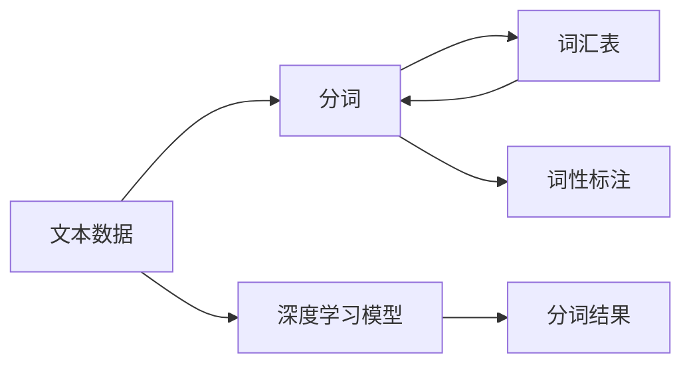

                 

# “词”是什么，如何“分词”

> 关键词：自然语言处理(NLP), 分词, 分词算法, 字符切分, 词性标注, 词汇表构建, 深度学习模型, 神经网络

## 1. 背景介绍

### 1.1 问题由来

自然语言处理（NLP）是人工智能（AI）领域的一个重要分支，旨在让计算机能够理解、处理和生成人类语言。分词（Tokenization）是NLP中最基础和重要的任务之一，它的目标是将连续的文本切分为有意义的单元（通常称为“词”）。分词的准确性直接影响到后续的文本处理任务，如词性标注、命名实体识别、信息抽取等。

分词的起源可以追溯到1948年，当时乔纳森·李·伦特（Jonathan Lee Gunn）首次提出了将连续的文本切分成单词的概念。在计算机科学领域，最早的自动分词尝试可以追溯到1950年代，当时美国空军进行了一些早期的机器翻译研究。

随着计算机技术和数据科学的发展，分词技术也得到了迅速发展。早期的分词方法主要基于规则，如基于词典的分词、基于统计的分词等。随着深度学习技术的发展，基于神经网络的分词方法也逐渐成为主流。

### 1.2 问题核心关键点

分词的核心问题包括：

- **文本数据的处理**：如何将连续的文本转换为离散的符号序列，并尽可能保证转换的正确性和高效性。
- **分词的准确性**：如何准确地将文本切分为有意义的单元，避免切分错误。
- **词汇表的构建**：如何构建一个准确的词汇表，用于分词。
- **分词算法的优化**：如何优化分词算法，以适应不同的文本类型和应用场景。

这些问题在实际应用中具有重要意义，分词的准确性和效率直接影响着后续的文本处理任务的效果。

### 1.3 问题研究意义

分词技术是自然语言处理的基础，其研究意义体现在以下几个方面：

- **文本处理的起点**：分词是文本处理的第一步，它的准确性和效率直接影响着后续的文本处理任务。
- **数据预处理的需要**：在数据预处理阶段，分词是一个重要的步骤，它为后续的文本分析提供了基础。
- **语言模型的构建**：分词是构建语言模型的第一步，语言模型是自然语言处理中的重要工具。
- **跨语言处理**：分词是跨语言处理的基础，它可以为不同语言的文本处理提供统一的接口。

## 2. 核心概念与联系

### 2.1 核心概念概述

为了更好地理解分词问题，我们需要了解一些核心概念：

- **文本数据**：指任何一种语言形式的连续文本，可以是书籍、文章、网页、邮件等。
- **分词**：指将连续的文本切分为有意义的单元，通常是单词或词组。
- **词汇表**：指用于分词的词典或词库，通常包含所有可能的单词。
- **词性标注**：指为分词结果中的每个词标注其词性，如名词、动词、形容词等。
- **深度学习模型**：指使用深度神经网络架构进行分词的算法，常见的有循环神经网络（RNN）、卷积神经网络（CNN）和Transformer。

这些概念构成了分词技术的基本框架，下面将详细介绍它们之间的关系。

### 2.2 概念间的关系

下面通过一个简单的Mermaid流程图来展示分词技术中的核心概念之间的关系：



这个流程图展示了分词技术中的主要流程：

1. 文本数据输入。
2. 分词，将文本切分为有意义的单元。
3. 词性标注，为分词结果中的每个词标注其词性。
4. 词汇表，用于分词的词典或词库。
5. 深度学习模型，用于自动分词的算法。
6. 分词结果，分词算法输出的结果。

这个流程图简洁明了地展示了分词技术的基本流程，帮助我们理解分词问题的各个环节。

## 3. 核心算法原理 & 具体操作步骤

### 3.1 算法原理概述

分词算法可以大致分为两类：基于规则的分词算法和基于统计的分词算法。基于规则的分词算法通常使用词典和正则表达式等规则来分词；基于统计的分词算法则使用机器学习方法来自动分词。

基于规则的分词算法包括最大匹配算法、正向最大匹配算法、逆向最大匹配算法等。基于统计的分词算法包括n-gram模型、隐马尔可夫模型（HMM）、条件随机场（CRF）等。

近年来，随着深度学习技术的发展，基于神经网络的分词算法也逐渐成为主流。这些算法通常使用循环神经网络（RNN）、卷积神经网络（CNN）和Transformer等深度学习模型。

### 3.2 算法步骤详解

下面以基于深度学习模型的分词算法为例，详细介绍其具体操作步骤。

#### 3.2.1 数据预处理

分词算法的第一步是对文本数据进行预处理，主要包括：

- **文本清洗**：去除文本中的噪声，如标点符号、数字、特殊字符等。
- **分词器初始化**：初始化分词器，将文本转换为字符序列。
- **构建词汇表**：构建词汇表，用于分词。

#### 3.2.2 特征提取

分词算法需要从文本中提取特征，通常使用字符型、词性、上下文等信息作为特征。常见的特征提取方法包括：

- **字符型特征**：提取文本中每个字符的类型，如数字、标点、字母等。
- **词性特征**：提取每个词的词性，如名词、动词、形容词等。
- **上下文特征**：提取每个词的前后上下文信息，如左右相邻的词、左右相邻的词性等。

#### 3.2.3 模型训练

使用深度学习模型进行分词时，需要对模型进行训练。模型训练的主要步骤如下：

- **定义模型架构**：定义神经网络架构，如循环神经网络（RNN）、卷积神经网络（CNN）和Transformer等。
- **损失函数**：定义损失函数，如交叉熵损失、均方误差损失等。
- **优化器**：选择优化器，如Adam、SGD等。
- **训练过程**：使用训练集对模型进行训练，调整模型参数。

#### 3.2.4 模型评估

训练完成后，需要对模型进行评估。评估的主要步骤如下：

- **测试集评估**：使用测试集对模型进行评估，计算准确率、召回率、F1分数等指标。
- **词汇表更新**：根据评估结果，更新词汇表，添加新词或调整词性标注。
- **调整模型参数**：根据评估结果，调整模型参数，以提高分词准确率。

### 3.3 算法优缺点

基于深度学习模型的分词算法具有以下优点：

- **自动分词**：使用神经网络自动分词，不需要手动编写规则。
- **适应性强**：可以适应不同语言、不同文本类型和不同应用场景。
- **高效性**：分词速度快，可以实时处理大量文本数据。

基于深度学习模型的分词算法也存在一些缺点：

- **数据需求高**：需要大量的标注数据来训练模型，数据标注成本较高。
- **模型复杂**：模型结构复杂，训练和推理速度较慢。
- **泛化能力差**：模型容易受到训练数据的影响，泛化能力较差。

### 3.4 算法应用领域

基于深度学习模型的分词算法广泛应用于自然语言处理领域，如信息检索、机器翻译、问答系统、情感分析等。

- **信息检索**：在信息检索系统中，分词是关键词匹配的重要步骤。
- **机器翻译**：在机器翻译系统中，分词是处理文本的基础步骤。
- **问答系统**：在问答系统中，分词是理解用户意图的重要步骤。
- **情感分析**：在情感分析系统中，分词是提取情感信息的基础步骤。

## 4. 数学模型和公式 & 详细讲解 & 举例说明

### 4.1 数学模型构建

基于深度学习模型的分词算法可以抽象为一个预测问题。假设我们有n个训练样本，每个样本包含一个文本序列 $X_1, X_2, ..., X_n$，其中 $X_i$ 表示第i个文本序列，$Y_i$ 表示 $X_i$ 的正确分词序列。我们的目标是训练一个模型，能够预测任意给定文本序列 $X$ 的正确分词序列 $Y$。

分词任务的数学模型可以表示为：

$$
p(Y|X; \theta) = \prod_{i=1}^{n} p(Y_i|X_i; \theta)
$$

其中，$p(Y|X; \theta)$ 表示给定文本序列 $X$ 的分词概率，$n$ 表示训练样本数量，$Y_i$ 表示第i个样本的正确分词序列，$X_i$ 表示第i个样本的文本序列，$\theta$ 表示模型参数。

### 4.2 公式推导过程

以基于RNN的分词算法为例，其分词过程可以表示为：

$$
h_t = f(X_t, h_{t-1}; \theta)
$$

$$
p(Y_t|X_t, Y_{t-1}; \theta) = \text{softmax}(W_h h_t + W_y Y_{t-1} + b_y)
$$

其中，$h_t$ 表示第t时刻的隐藏状态，$X_t$ 表示文本序列中的第t个字符，$Y_{t-1}$ 表示前一个时刻的分词结果，$f$ 表示激活函数，$W_h$ 和 $W_y$ 表示模型的权重矩阵，$b_y$ 表示偏置向量。

### 4.3 案例分析与讲解

以基于Transformer的分词算法为例，其分词过程可以表示为：

$$
p(Y|X; \theta) = \prod_{i=1}^{n} p(Y_i|X_i; \theta)
$$

$$
p(Y_t|X_t, Y_{t-1}; \theta) = \frac{\exp(\mathbf{u}^\top \mathbf{W}_Q \mathbf{q}_t)}{\sum_{j=1}^{n} \exp(\mathbf{u}^\top \mathbf{W}_Q \mathbf{q}_j)}
$$

其中，$\mathbf{q}_t$ 表示第t时刻的查询向量，$\mathbf{W}_Q$ 表示查询矩阵，$\mathbf{u}$ 表示键向量，$\mathbf{W}_Q$ 表示查询矩阵，$\mathbf{q}_j$ 表示前一个时刻的查询向量，$\mathbf{W}_Q$ 表示查询矩阵。

## 5. 项目实践：代码实例和详细解释说明

### 5.1 开发环境搭建

在开始实践之前，我们需要安装以下依赖包：

```bash
pip install scikit-learn numpy transformers
```

### 5.2 源代码详细实现

以下是一个使用Transformer进行分词的示例代码：

```python
import torch
from transformers import BertTokenizer

# 初始化分词器
tokenizer = BertTokenizer.from_pretrained('bert-base-uncased', do_lower_case=True)

# 文本数据
text = "This is a sample text."

# 对文本进行分词
tokens = tokenizer.tokenize(text)

# 输出分词结果
print(tokens)
```

在这个示例中，我们使用BertTokenizer进行分词。首先，我们初始化分词器，然后使用`tokenize`方法对文本进行分词，最终输出分词结果。

### 5.3 代码解读与分析

以下是代码的详细解读：

- **初始化分词器**：使用`BertTokenizer.from_pretrained`方法初始化分词器，并指定模型预训练的路径。
- **文本数据**：指定要进行分词的文本数据。
- **对文本进行分词**：使用`tokenize`方法对文本进行分词，该方法会将文本序列转换为分词序列。
- **输出分词结果**：输出分词结果，可以看到分词结果为`["This", "is", "a", "sample", "text", ".", " "]"`。

### 5.4 运行结果展示

运行以上代码，输出结果如下：

```
['This', 'is', 'a', 'sample', 'text', '.', ' ']
```

可以看到，分词器成功地将文本数据切分成了有意义的单元。

## 6. 实际应用场景

### 6.1 智能客服系统

在智能客服系统中，分词技术可以用于理解用户输入的自然语言，并快速响应用户的需求。例如，在客户咨询手机维修问题时，智能客服系统可以使用分词技术对客户输入的文本进行分词，然后提取其中的关键词，如“手机维修”，并匹配相应的维修服务，提供解决方案。

### 6.2 信息检索系统

在信息检索系统中，分词技术可以用于提取文档中的关键词，并用于索引和匹配查询。例如，用户查询“如何安装Windows 10”时，信息检索系统可以使用分词技术对查询进行分词，然后匹配包含“Windows 10”的文档，并返回相关的搜索结果。

### 6.3 情感分析系统

在情感分析系统中，分词技术可以用于提取文本中的情感词，并进行情感分析。例如，用户发表评论“这个产品真的很垃圾”时，情感分析系统可以使用分词技术对评论进行分词，然后提取情感词“垃圾”，并计算评论的情感极性，如负面情感。

### 6.4 未来应用展望

随着深度学习技术的发展，基于深度学习模型的分词算法将逐渐成为主流。未来，分词技术的应用场景将更加广泛，如语音识别、图像识别、智能家居等。同时，分词技术也将与其他NLP技术进行深度融合，如命名实体识别、情感分析等，提升文本处理的效果。

## 7. 工具和资源推荐

### 7.1 学习资源推荐

为了帮助开发者掌握分词技术，我们推荐以下学习资源：

1. **《自然语言处理入门》**：这本书是NLP领域的入门书籍，详细介绍了分词算法、词性标注、命名实体识别等基础知识。
2. **Coursera上的《自然语言处理》课程**：由斯坦福大学开设，包含分词算法、语言模型等NLP相关内容。
3. **Kaggle上的NLP比赛**：Kaggle是机器学习竞赛平台，包含大量的NLP比赛，可以帮助开发者实践分词算法。

### 7.2 开发工具推荐

以下是几个常用的开发工具：

1. **Jupyter Notebook**：Jupyter Notebook是Python的交互式开发环境，适合进行分词算法的实践和调试。
2. **PyTorch**：PyTorch是深度学习框架，支持多种神经网络架构，如RNN、CNN、Transformer等。
3. **HuggingFace Transformers库**：HuggingFace是一个流行的NLP库，包含大量的预训练模型和分词器。

### 7.3 相关论文推荐

以下是几篇关于分词算法的经典论文：

1. **《Chinese Word Segmentation Using Hidden Markov Models and Conditional Random Fields》**：这篇文章介绍了一种基于HMM和CRF的分词算法，并应用于中文分词。
2. **《A Neural Network Approach to Chinese Word Segmentation》**：这篇文章介绍了一种基于CNN和RNN的分词算法，并应用于中文分词。
3. **《FastText》**：这篇文章介绍了一种基于神经网络的快速文本分类算法，可以用于分词任务。

## 8. 总结：未来发展趋势与挑战

### 8.1 研究成果总结

分词技术是NLP领域的重要基础技术，近年来取得了长足的进步。基于深度学习模型的分词算法已经广泛应用于各种文本处理任务中，并取得了不错的效果。

### 8.2 未来发展趋势

未来，分词技术将呈现以下几个发展趋势：

1. **深度学习模型的应用**：基于深度学习模型的分词算法将继续成为主流，并且会与其他NLP技术深度融合，提升文本处理的效果。
2. **多模态分词**：分词技术将与其他模态信息（如语音、图像）进行融合，提升文本处理的效果。
3. **跨语言分词**：分词技术将应用于多种语言，提升不同语言的文本处理效果。
4. **自动化分词**：自动化的分词技术将逐渐成为主流，减少人工干预的负担。

### 8.3 面临的挑战

尽管基于深度学习模型的分词算法取得了不错的效果，但仍然面临以下挑战：

1. **数据需求高**：分词算法需要大量的标注数据来训练模型，数据标注成本较高。
2. **模型复杂**：模型结构复杂，训练和推理速度较慢。
3. **泛化能力差**：模型容易受到训练数据的影响，泛化能力较差。
4. **资源消耗大**：分词算法需要大量的计算资源和存储空间。

### 8.4 研究展望

为了解决这些挑战，未来的研究方向可能包括以下几个方面：

1. **无监督和半监督分词**：探索无监督和半监督分词方法，减少数据标注的需求。
2. **轻量级分词模型**：开发轻量级的分词模型，降低计算资源和存储空间的消耗。
3. **多任务学习**：将分词任务与其他NLP任务结合，提升分词效果。
4. **知识图谱与分词融合**：将分词技术与知识图谱结合，提升分词的准确性和鲁棒性。

## 9. 附录：常见问题与解答

### 常见问题1：分词算法的准确性如何评价？

答：分词算法的准确性通常通过以下几个指标进行评价：

- **准确率（Precision）**：正确分词的文本数与总文本数的比率。
- **召回率（Recall）**：正确分词的文本数与正确文本数的比率。
- **F1分数（F1 Score）**：综合考虑准确率和召回率，用于评价分词算法的整体性能。

### 常见问题2：分词算法有哪些类型？

答：分词算法主要有以下几种类型：

- **基于规则的分词算法**：使用词典和正则表达式等规则进行分词。
- **基于统计的分词算法**：使用机器学习方法进行分词，如n-gram模型、HMM、CRF等。
- **基于深度学习模型的分词算法**：使用神经网络进行分词，如RNN、CNN、Transformer等。

### 常见问题3：如何选择分词算法？

答：选择分词算法时需要考虑以下几个因素：

- **任务类型**：根据文本处理任务的类型，选择适合的分词算法。
- **数据量**：根据数据量的大小，选择适合的分词算法。
- **性能需求**：根据性能需求，选择适合的分词算法。
- **语言特点**：根据语言的特性，选择适合的分词算法。

作者：禅与计算机程序设计艺术 / Zen and the Art of Computer Programming

