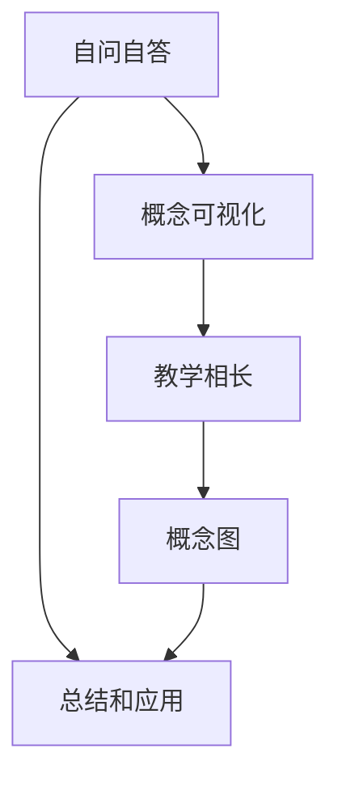

                 

# 费曼提问法：提升思考力和知识掌握

费曼提问法，即费曼学习法，是一种强大的认知工具，通过高效提问来激发深度理解、促进知识掌握和提升思考力。本文将深入探讨费曼提问法的原理、步骤、应用和改进，帮助读者全面掌握这一利器，提升个人学习和知识掌握能力。

## 1. 背景介绍

### 1.1 问题由来

在现代信息爆炸的时代，人们面临大量的信息输入，但如何高效地吸收、理解和应用这些知识，仍然是一个普遍的难题。传统的记忆式学习往往以机械记忆为主，难以真正理解知识的本质。费曼提问法作为一种主动、主动思考的学习方法，能够帮助人们深入理解知识，提升思考力和学习效率。

### 1.2 问题核心关键点

费曼提问法通过模拟教师向学生解释概念的方式，来激活大脑的记忆和理解。其核心步骤包括自问自答、抽象概念的可视化解释、教学相长等。这种方法不仅有助于深化理解，还能促进知识的长期记忆和应用，是一种高效的学习策略。

## 2. 核心概念与联系

### 2.1 核心概念概述

费曼提问法的核心概念主要包括以下几个方面：

- **自问自答**：通过不断提出问题，激发大脑深入思考，激活潜在知识。
- **概念可视化**：将抽象概念通过类比、举例等方法转化为具体形象，便于理解和记忆。
- **教学相长**：将学到的知识以易懂的方式解释给他人，进一步巩固理解。
- **概念图**：通过绘制概念图，系统整理和关联知识，形成知识网络。

这些核心概念通过互动反馈、积极思考等过程，相互促进，共同构成费曼提问法的有效学习框架。

### 2.2 概念间的关系

费曼提问法的各个核心概念之间存在紧密的联系，形成了一个环环相扣的学习循环。自问自答是起点，通过可视化解释和教学相长，不断巩固和扩展知识网络。概念图则是一个系统整理知识的工具，有助于形成完整的知识体系。

以下是一个简化的Mermaid流程图，展示费曼提问法的核心概念关系：

## 3. 核心算法原理 & 具体操作步骤

### 3.1 算法原理概述

费曼提问法的核心原理是通过不断提问和回答，激发深度思考和理解，从而促进知识掌握。其核心步骤包括自问自答、概念可视化、教学相长和总结应用等。

具体而言，步骤如下：

1. **自问自答**：选择一个知识点，尝试以多种方式提出问题。
2. **概念可视化**：将抽象概念通过类比、举例、图表等方法转化为具体形象。
3. **教学相长**：将学到的知识以易懂的方式解释给他人，或教给虚拟的“学生”。
4. **总结应用**：将知识总结整理，形成概念图，并在实际应用中检验理解。

### 3.2 算法步骤详解

以下是费曼提问法的详细步骤：

#### 步骤1：自问自答

选择一项要掌握的知识点，尝试提出尽可能多的问题。这些问题应该涵盖知识点的各个方面，包括定义、应用、例外等。例如，对于“计算机算法”这一知识点，可以提出以下问题：

- 算法是什么？
- 算法的目标是什么？
- 有哪些常见的算法类型？
- 算法的时间复杂度和空间复杂度如何计算？

#### 步骤2：概念可视化

将抽象概念通过类比、举例、图表等方法转化为具体形象。例如，将“算法”比作“菜谱”，解释算法是如何定义步骤，指导程序的执行。可以将算法步骤用流程图表示，帮助理解和记忆。

#### 步骤3：教学相长

将学到的知识以易懂的方式解释给他人，或教给虚拟的“学生”。例如，将上述的“算法”类比，用通俗的语言向他人解释算法的定义和用途，或者假设你在向一位初学者解释。

#### 步骤4：总结应用

将知识总结整理，形成概念图，并在实际应用中检验理解。例如，将算法相关的概念图绘制出来，标识关键概念和步骤，并在实际编程中应用这些算法。

### 3.3 算法优缺点

费曼提问法有以下优点：

- **深度理解**：通过不断提问和解释，能够深化对知识的理解。
- **系统整理**：通过概念图总结知识，形成系统化的认知结构。
- **长期记忆**：将知识应用到实际问题中，有助于长期记忆和应用。

其缺点包括：

- **时间成本高**：每个概念都需要多次提问和解释，耗时较长。
- **依赖理解水平**：对个人的基础知识掌握要求较高。

### 3.4 算法应用领域

费曼提问法不仅适用于学术学习，还可以应用于个人技能提升、职场知识更新、编程技巧掌握等多个领域。例如，在编程学习中，可以通过不断提问和解释，掌握新的编程语言特性；在职场培训中，可以通过类比和解释，提升沟通和表达能力。

## 4. 数学模型和公式 & 详细讲解  
### 4.1 数学模型构建

费曼提问法虽然不以数学模型为主，但可以通过数学公式来辅助解释和计算。例如，在学习算法的时间复杂度时，可以通过以下公式进行推导：

$$ \text{Time Complexity} = O(f(n)) $$

其中，$n$ 为数据规模，$f(n)$ 为算法中基本操作执行次数。

### 4.2 公式推导过程

假设有一个排序算法，其基本操作次数为 $n^2$，则其时间复杂度为 $O(n^2)$。通过计算和类比，可以更深入理解时间复杂度的概念。

### 4.3 案例分析与讲解

以下是一个费曼提问法的实际案例分析：

**案例**：理解“链表”数据结构。

1. **自问自答**：
   - 链表是什么？
   - 链表的优缺点是什么？
   - 如何实现链表的插入、删除操作？

2. **概念可视化**：
   - 将链表比作串联的项链，节点是项链上的珠子，每个珠子可以前后移动。
   - 绘制链表的图示，标识头节点、尾节点、中间节点。

3. **教学相长**：
   - 向他人解释链表的定义和用途，或者教给虚拟的“学生”。
   - 假设你在向一位初学者解释链表，使用通俗的语言解释其基本操作和应用。

4. **总结应用**：
   - 将链表的知识点整理成概念图。
   - 在实际编程中应用链表，如实现一个简单的链表操作练习。

## 5. 项目实践：代码实例和详细解释说明

### 5.1 开发环境搭建

要实践费曼提问法，可以借助一些工具和平台来辅助学习。以下是一些推荐的学习资源：

- **在线课程**：如Coursera、Udacity等平台上的相关课程，提供系统化的学习和互动。
- **在线笔记**：如Evernote、OneNote等，用于记录和整理学习笔记。
- **概念图绘制工具**：如XMind、Lucidchart等，帮助整理知识结构。

### 5.2 源代码详细实现

由于费曼提问法主要是通过思维和解释来提升学习效果，并不涉及编程代码，因此这一部分主要介绍如何利用工具进行辅助学习。

### 5.3 代码解读与分析

费曼提问法的关键在于提问和解释，而不是编写代码。因此，不需要编写复杂的代码，只需要准备好学习工具和平台即可。例如，使用在线笔记本记录自问自答，使用概念图工具绘制知识结构图。

### 5.4 运行结果展示

费曼提问法的效果主要体现在学习效果的提升和知识结构的系统化上。可以通过以下方式展示学习成果：

- **概念图展示**：展示通过费曼提问法整理的知识点概念图。
- **总结报告**：编写学习总结报告，记录自问自答的问题、解释的思路和总结的应用。

## 6. 实际应用场景

### 6.1 学术研究

费曼提问法在学术研究中具有广泛的应用，特别是在理解复杂概念和理论时，能够帮助研究者深入思考，促进学术交流和知识传播。

### 6.2 职场技能提升

在职场中，费曼提问法可以用来提升沟通、表达和解决问题的能力。通过将复杂的知识点转换为易于理解的形式，帮助同事和领导更好地理解你的工作内容。

### 6.3 编程技巧掌握

费曼提问法在编程学习中同样有效。通过不断提问和解释，能够更好地掌握编程语言特性和算法实现，提升编程技能。

## 7. 工具和资源推荐

### 7.1 学习资源推荐

为了帮助读者系统掌握费曼提问法的原理和应用，推荐以下学习资源：

1. **《费曼学习法：如何以全新的方式学习任何东西》**：这本书详细介绍了费曼学习法的理论基础和应用实践，适合系统学习。
2. **Coursera《学习如何学习》课程**：由著名教育专家提供，系统讲解费曼学习法的各个步骤和技巧。
3. **Khan Academy**：提供大量免费的在线课程和视频，涵盖各个学科的知识。

### 7.2 开发工具推荐

费曼提问法的实践主要依赖于思维和解释，因此并没有具体的开发工具推荐。但可以使用一些辅助工具和平台来提升学习效率：

1. **笔记软件**：如Evernote、OneNote，记录和整理学习笔记。
2. **概念图工具**：如XMind、Lucidchart，绘制概念图，系统化整理知识。

### 7.3 相关论文推荐

费曼提问法的研究和应用涉及教育学、认知心理学等多个领域，以下是一些相关的学术论文推荐：

1. **《A Semantic Framework for Feynman Learning》**：一篇教育学论文，探讨费曼学习法的理论基础和应用效果。
2. **《Teaching and Learning with the Feynman Technique》**：一篇教育技术论文，提供具体的应用案例和实践建议。
3. **《Cognitive Teaching and Learning with the Feynman Technique》**：一篇认知心理学论文，探讨费曼学习法对认知能力的影响。

## 8. 总结：未来发展趋势与挑战

### 8.1 研究成果总结

费曼提问法作为一种高效的学习方法，已经在多个领域得到应用和验证。其深度理解和系统整理的知识掌握方式，成为教育学和认知心理学的重要研究方向。

### 8.2 未来发展趋势

随着技术的发展和教育的变革，费曼提问法在未来将有以下趋势：

- **数字化**：利用在线工具和平台，将费曼提问法与数字化学习相结合，提升学习效率。
- **社交化**：通过社交媒体和在线社区，分享和讨论费曼提问法的使用经验，促进知识传播和交流。
- **个性化**：利用大数据和人工智能技术，个性化推荐学习路径和方法，满足不同学习者的需求。

### 8.3 面临的挑战

尽管费曼提问法具有显著的优势，但面临以下挑战：

- **时间成本高**：需要大量的时间和精力进行提问和解释。
- **依赖理解水平**：对个人的基础知识掌握要求较高，可能不适合初学者。
- **难以量化评估**：缺乏具体的评估标准，难以量化费曼提问法的效果。

### 8.4 研究展望

未来的研究应关注以下方向：

- **结合AI技术**：利用机器学习和大数据分析，辅助费曼提问法，提高学习效率。
- **系统化研究**：构建费曼提问法的理论框架和方法体系，提升其科学性和系统性。
- **跨学科应用**：将费曼提问法应用于更多学科领域，如工程、艺术、商业等，探索新的应用场景。

## 9. 附录：常见问题与解答

**Q1：如何克服费曼提问法的缺点？**

A: 可以通过以下方法来克服费曼提问法的缺点：

1. **时间管理**：合理规划时间，将费曼提问法融入日常学习计划。
2. **知识储备**：通过预习和复习，提升基础知识的掌握水平，提高费曼提问法的有效性和深度。
3. **团队合作**：与他人协作，共同提问和解释，通过交流和讨论提升理解。

**Q2：费曼提问法是否适用于所有学科？**

A: 费曼提问法适用于大多数学科，但其效果可能因学科特性和内容复杂度而有所不同。对于需要深度理解和系统化整理的知识，费曼提问法尤为有效。

**Q3：如何找到合适的自问自答问题？**

A: 可以通过以下几个步骤找到合适的自问自答问题：

1. **理解知识点**：深入理解要学习的知识点，了解其核心概念和应用场景。
2. **提出多种问题**：从定义、应用、例外等多个角度提出问题，涵盖知识点的各个方面。
3. **逐步深入**：从简单问题入手，逐步深入，不断扩展问题的广度和深度。

通过本文的系统梳理，可以看到，费曼提问法不仅是一种高效的学习方法，更是一种强大的认知工具，能够提升思考力和知识掌握能力。未来，随着技术的不断进步和教育的深入变革，费曼提问法必将在更多领域得到广泛应用，为人类认知智能的进化带来深远影响。

