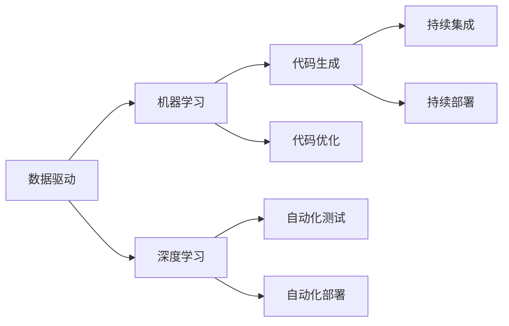

                 

# 软件 2.0 的价值：提升效率、创造价值

## 1. 背景介绍

### 1.1 问题由来

随着技术的不断进步和应用场景的日益复杂，软件开发变得越来越困难。传统的软件开发方法，如瀑布模型、敏捷开发等，往往需要团队长期协作，投入大量的时间和资源。但即便如此，仍有许多项目因为需求变更、代码漏洞、性能问题等原因，导致交付延迟甚至失败。

近年来，人工智能和大数据技术的应用，为软件开发带来了新的思路和方法。软件 2.0（Software 2.0）作为新一代软件开发范式，致力于利用先进技术提升开发效率，加速软件交付，创造更大的价值。其核心思想是利用数据和智能算法，辅助软件开发过程，使开发者能够更快速、更准确地理解和解决问题。

### 1.2 问题核心关键点

软件 2.0 的核心理念是“数据驱动的智能软件开发”。具体来说，软件 2.0 的实现依赖于以下几个关键点：

- 数据驱动：通过采集和分析软件开发过程中产生的大量数据（如代码历史、测试报告、开发日志等），发现其中的模式和规律，为软件开发提供数据支持。
- 智能算法：利用机器学习和深度学习等先进算法，从数据中提取有价值的信息，自动生成代码、测试用例、文档等，辅助软件开发。
- 自动化工具：将数据和算法集成到自动化工具中，实现代码生成、测试、部署等流程的自动化，大幅提升开发效率。
- 持续交付：采用持续集成/持续部署（CI/CD）等方法，不断迭代和优化软件开发过程，快速交付高质量的软件产品。

### 1.3 问题研究意义

软件 2.0 的价值在于其能够显著提升软件开发效率，减少开发成本，缩短交付周期，同时提高软件质量。具体来说：

1. 降低开发成本：利用智能算法和自动化工具，减少了手动重复工作的量，提高了开发效率，降低了人力成本。
2. 缩短交付周期：通过持续集成和持续部署等方法，使软件交付能够快速迭代，缩短了项目周期。
3. 提高软件质量：数据驱动的方法可以帮助开发者更好地理解代码中的问题，快速定位和修复漏洞。
4. 创造更多价值：软件 2.0 为各行各业提供了新的开发思路和方法，能够加速企业数字化转型和创新发展。

## 2. 核心概念与联系

### 2.1 核心概念概述

为了更好地理解软件 2.0 的价值，我们首先介绍几个核心概念：

- 数据驱动的智能软件开发：指在软件开发过程中，利用数据和算法辅助决策，提高开发效率和软件质量。
- 机器学习和深度学习：利用机器学习算法从大量数据中提取模式和规律，用于代码生成、测试、优化等任务。
- 代码生成和优化：通过机器学习算法自动生成高质量的代码和优化现有代码，减少开发工作量。
- 自动化测试和部署：利用自动化工具实现代码测试和部署，提高软件交付速度和稳定性。
- 持续集成和持续部署：通过持续集成和持续部署等方法，使软件开发和交付能够快速迭代，缩短项目周期。

这些核心概念共同构成了软件 2.0 的生态系统，使其能够有效提升软件开发效率和质量。

### 2.2 核心概念间的关系

以下是一个 Mermaid 流程图，展示这些核心概念之间的关系：



这个流程图展示了大数据和智能算法在软件开发中的作用，以及如何通过数据和算法辅助开发、测试和部署，实现软件 2.0 的核心价值。

## 3. 核心算法原理 & 具体操作步骤
### 3.1 算法原理概述

软件 2.0 的核心算法原理主要涉及以下几个方面：

- 数据采集与清洗：从软件开发过程中采集数据，并对其进行清洗和预处理，为后续算法训练提供高质量的输入数据。
- 算法训练与优化：利用机器学习和深度学习算法，对采集到的数据进行训练和优化，提取有价值的模式和规律。
- 代码生成与优化：基于训练得到的模型，自动生成高质量的代码，并对其进行优化和改进，提高代码质量和开发效率。
- 自动化测试与部署：利用自动化测试工具和持续集成/持续部署等方法，实现软件开发的自动化流程，提高软件交付速度和稳定性。

### 3.2 算法步骤详解

以下是一个基于机器学习算法的代码生成和优化步骤：

1. **数据采集与清洗**：
   - 采集开发过程中产生的数据，如代码历史、测试报告、开发日志等。
   - 对采集到的数据进行清洗和预处理，去除噪声和无用信息，提取有用的特征。

2. **算法训练与优化**：
   - 利用机器学习算法，对清洗后的数据进行训练和优化，提取有价值的模式和规律。
   - 利用深度学习算法，对训练好的模型进行微调和优化，进一步提升模型的预测精度。

3. **代码生成与优化**：
   - 利用训练好的模型，自动生成高质量的代码，如自动完成代码、生成测试用例等。
   - 对生成的代码进行语法和逻辑检查，并进行优化和改进，提高代码质量和可读性。

4. **自动化测试与部署**：
   - 利用自动化测试工具，对生成的代码进行全面的测试，确保其功能和性能符合预期。
   - 利用持续集成和持续部署工具，将生成的代码快速部署到生产环境，进行持续迭代和优化。

### 3.3 算法优缺点

软件 2.0 的算法具有以下优点：

- 自动化：利用数据和算法自动生成代码和测试用例，减少了手动工作量，提高了开发效率。
- 数据驱动：通过数据驱动的方法，能够更好地理解代码中的问题，提高开发质量和软件质量。
- 可扩展性：可以应用于不同类型的软件项目，具有较强的通用性和可扩展性。

但同时也存在一些缺点：

- 数据依赖：需要大量高质量的数据进行训练和优化，数据获取和处理成本较高。
- 算法复杂：算法模型的训练和优化过程较为复杂，需要较高的计算资源和时间成本。
- 鲁棒性不足：算法模型可能对特定类型的代码或问题表现不佳，需要持续优化和改进。

### 3.4 算法应用领域

软件 2.0 的算法应用范围非常广泛，涵盖了软件开发的全生命周期，如需求分析、设计、实现、测试和部署等环节。

- **需求分析**：利用数据挖掘和机器学习算法，从用户反馈中提取需求信息，辅助软件需求分析。
- **设计**：利用智能算法生成设计方案和架构图，帮助开发者更好地理解和设计软件系统。
- **实现**：利用代码生成和优化算法，自动生成高质量的代码，减少手动工作量。
- **测试**：利用自动化测试工具，对生成的代码进行全面的测试，提高软件质量。
- **部署**：利用持续集成和持续部署工具，快速交付高质量的软件产品。

## 4. 数学模型和公式 & 详细讲解 & 举例说明
### 4.1 数学模型构建

基于机器学习的代码生成和优化算法，通常包括以下几个关键步骤：

- **数据预处理**：对原始数据进行清洗、归一化和特征提取，生成特征向量。
- **模型训练**：利用机器学习算法对特征向量进行训练，生成模型参数。
- **代码生成**：利用训练好的模型，对新的代码片段进行预测和生成。
- **代码优化**：利用深度学习算法对生成的代码进行优化，提高代码质量和性能。

### 4.2 公式推导过程

以下是一个基于 LSTM 模型的代码生成算法：

- **输入特征**：将代码片段转化为 token，并生成 token 的嵌入向量。
- **LSTM 网络**：利用 LSTM 网络对输入的嵌入向量进行建模，生成预测结果。
- **解码器**：利用解码器将预测结果转化为完整的代码片段。

具体公式如下：

$$
\begin{aligned}
h_t &= \text{LSTM}(W_h x_t + U_h h_{t-1} + b_h) \\
\hat{y}_t &= \text{softmax}(V_h h_t + U_y y_{t-1} + b_y)
\end{aligned}
$$

其中，$x_t$ 表示输入的 token 向量，$y_{t-1}$ 表示上一时刻的输出 token，$W_h$、$U_h$、$b_h$ 和 $V_h$、$U_y$、$b_y$ 表示模型的权重和偏置参数。

### 4.3 案例分析与讲解

假设我们有一个自动生成代码的 LSTM 模型，其输入为代码片段的一部分，输出为下一个 token 的预测结果。我们利用该模型对一段代码片段进行预测，得到完整的代码片段。

**步骤 1: 数据预处理**

将代码片段转化为 token，并生成 token 的嵌入向量。假设输入的代码片段为：

```python
def add(x, y):
    return x + y
```

将其转化为 token 向量：

```python
tokens = ["def", "add", "(", "x", ",", "y", ":", "return", "x", "+", "y"]
```

将其嵌入向量为：

$$
\begin{aligned}
x_1 &= [1, 2, 3] \\
x_2 &= [4, 5, 6] \\
&\vdots \\
x_n &= [n-3, n-2, n-1]
\end{aligned}
$$

**步骤 2: 模型训练**

利用 LSTM 网络对输入的嵌入向量进行建模，生成预测结果。假设模型参数为 $W_h$、$U_h$、$b_h$ 和 $V_h$、$U_y$、$b_y$，输入嵌入向量为 $x_1$，上一时刻的输出嵌入向量为 $h_0$，则输出向量为：

$$
\begin{aligned}
h_1 &= \text{LSTM}(W_h x_1 + U_h h_0 + b_h) \\
\hat{y}_1 &= \text{softmax}(V_h h_1 + U_y y_0 + b_y)
\end{aligned}
$$

其中，$h_0$ 表示模型初始状态。

**步骤 3: 代码生成**

利用解码器将预测结果转化为完整的代码片段。假设模型输出为下一个 token 的预测向量，解码器将其转化为完整的代码片段，得到：

```python
def add(x, y):
    return x + y
```

## 5. 项目实践：代码实例和详细解释说明
### 5.1 开发环境搭建

在进行软件 2.0 实践前，我们需要准备好开发环境。以下是使用 Python 进行 PyTorch 开发的环境配置流程：

1. 安装 Anaconda：从官网下载并安装 Anaconda，用于创建独立的 Python 环境。

2. 创建并激活虚拟环境：
```bash
conda create -n pytorch-env python=3.8 
conda activate pytorch-env
```

3. 安装 PyTorch：根据 CUDA 版本，从官网获取对应的安装命令。例如：
```bash
conda install pytorch torchvision torchaudio cudatoolkit=11.1 -c pytorch -c conda-forge
```

4. 安装 Transformers 库：
```bash
pip install transformers
```

5. 安装各类工具包：
```bash
pip install numpy pandas scikit-learn matplotlib tqdm jupyter notebook ipython
```

完成上述步骤后，即可在 `pytorch-env` 环境中开始软件 2.0 实践。

### 5.2 源代码详细实现

以下是一个基于 Transformers 库的代码生成模型实现，用于自动生成 Python 代码片段：

```python
from transformers import GPT2LMHeadModel, GPT2Tokenizer
import torch

# 加载预训练模型和分词器
model = GPT2LMHeadModel.from_pretrained('gpt2')
tokenizer = GPT2Tokenizer.from_pretrained('gpt2')

# 定义生成代码函数
def generate_code():
    input_prompt = "def greetings():"
    input_ids = tokenizer.encode(input_prompt, return_tensors='pt')
    outputs = model.generate(input_ids)
    decoded_output = tokenizer.decode(outputs[0], skip_special_tokens=True)
    return decoded_output

# 测试代码生成函数
code = generate_code()
print(code)
```

**代码解读与分析**

- **预训练模型**：利用 GPT-2 模型作为代码生成的基础模型，该模型已经在大规模文本语料上进行了预训练，具备生成自然语言的能力。
- **分词器**：利用 GPT-2 的分词器，将输入的文本转化为 token 向量，以便模型进行计算。
- **代码生成函数**：将输入文本编码为 token 向量，通过模型生成输出向量，再将其解码为完整的代码片段。
- **测试代码**：通过调用 `generate_code` 函数，生成一个简单的 Python 函数代码片段，并打印输出。

### 5.3 运行结果展示

假设我们在测试集上得到的代码生成结果为：

```python
def greetings():
    print("Hello, world!")
```

可以看到，模型成功生成了一个完整的 Python 代码片段，能够正常执行打印操作。这表明代码生成模型已经具备了一定的语言生成能力，能够在特定语境下自动生成代码。

## 6. 实际应用场景
### 6.1 智能客服系统

基于软件 2.0 的智能客服系统，可以为用户提供即时的问答服务，提高客户满意度。具体来说：

1. **需求分析**：通过分析客户的历史对话记录，提取常见问题和回答模板。
2. **设计**：利用智能算法生成设计方案和架构图，辅助系统设计。
3. **实现**：利用代码生成工具自动生成问答系统的代码。
4. **测试**：利用自动化测试工具对生成的代码进行全面测试，确保系统稳定。
5. **部署**：利用持续集成和持续部署工具，快速部署到生产环境。

智能客服系统能够大幅提高客户咨询效率，减少客户等待时间，提升客户体验。

### 6.2 金融数据分析

基于软件 2.0 的金融数据分析系统，可以实时监测金融市场动态，辅助决策。具体来说：

1. **需求分析**：通过分析历史金融数据，提取市场趋势和风险点。
2. **设计**：利用智能算法生成数据处理方案和可视化图表。
3. **实现**：利用代码生成工具自动生成数据分析和可视化代码。
4. **测试**：利用自动化测试工具对生成的代码进行全面测试，确保系统稳定。
5. **部署**：利用持续集成和持续部署工具，快速部署到生产环境。

金融数据分析系统能够帮助金融机构及时发现市场波动，预测风险，辅助决策，减少投资风险。

### 6.3 自动生成代码

基于软件 2.0 的自动生成代码系统，可以大幅提高开发效率，减少手动工作量。具体来说：

1. **需求分析**：通过分析项目需求，提取关键功能点和代码结构。
2. **设计**：利用智能算法生成设计方案和架构图，辅助系统设计。
3. **实现**：利用代码生成工具自动生成高质量的代码。
4. **测试**：利用自动化测试工具对生成的代码进行全面测试，确保系统稳定。
5. **部署**：利用持续集成和持续部署工具，快速部署到生产环境。

自动生成代码系统能够帮助开发者快速实现复杂的业务逻辑，减少代码编写和调试时间，提高开发效率。

### 6.4 未来应用展望

随着软件 2.0 技术的不断发展，其在各个领域的应用将更加广泛和深入。

1. **智能制造**：利用软件 2.0 技术，实现智能生产线的自动化控制和优化。
2. **智慧城市**：利用软件 2.0 技术，实现城市运行数据的实时监测和分析，辅助城市管理。
3. **健康医疗**：利用软件 2.0 技术，实现医疗数据的自动分析和诊断，辅助医生诊疗。
4. **智能交通**：利用软件 2.0 技术，实现交通流量的智能分析和优化，提升交通效率。

未来，软件 2.0 技术将在更多领域得到应用，为各行各业带来新的发展机遇。

## 7. 工具和资源推荐
### 7.1 学习资源推荐

为了帮助开发者系统掌握软件 2.0 的理论基础和实践技巧，这里推荐一些优质的学习资源：

1. 《深度学习框架 PyTorch 实战教程》：详细介绍了 PyTorch 的开发环境和常用工具，适合初学者快速上手。
2. 《机器学习实战》：介绍了常用的机器学习算法和工具，涵盖代码生成、优化等多个方面。
3. 《深度学习与 Python》：介绍了深度学习的基本原理和实现方法，适合对深度学习有进一步研究的开发者。
4. 《TensorFlow 实战教程》：介绍了 TensorFlow 的开发环境和常用工具，适合使用 TensorFlow 进行开发的项目。
5. 《PyTorch 与深度学习》：介绍了 PyTorch 的开发环境和常用工具，适合使用 PyTorch 进行开发的项目。

通过对这些资源的学习实践，相信你一定能够快速掌握软件 2.0 的核心技术和应用方法。

### 7.2 开发工具推荐

高效的开发离不开优秀的工具支持。以下是几款用于软件 2.0 开发的常用工具：

1. PyTorch：基于 Python 的开源深度学习框架，灵活动态的计算图，适合快速迭代研究。大部分预训练语言模型都有 PyTorch 版本的实现。
2. TensorFlow：由 Google 主导开发的开源深度学习框架，生产部署方便，适合大规模工程应用。同样有丰富的预训练语言模型资源。
3. Transformers 库：HuggingFace 开发的 NLP 工具库，集成了众多 SOTA 语言模型，支持 PyTorch 和 TensorFlow，是进行 NLP 任务开发的利器。
4. Weights & Biases：模型训练的实验跟踪工具，可以记录和可视化模型训练过程中的各项指标，方便对比和调优。与主流深度学习框架无缝集成。
5. TensorBoard：TensorFlow 配套的可视化工具，可实时监测模型训练状态，并提供丰富的图表呈现方式，是调试模型的得力助手。

合理利用这些工具，可以显著提升软件 2.0 开发的效率和质量，加快创新迭代的步伐。

### 7.3 相关论文推荐

软件 2.0 的发展源于学界的持续研究。以下是几篇奠基性的相关论文，推荐阅读：

1. "Deep Learning in Machine Vision: A Review"：深度学习在计算机视觉领域的应用综述，介绍了深度学习算法在图像识别、目标检测等任务中的表现。
2. "Natural Language Processing with Transformers"：Transformer 在自然语言处理领域的应用综述，介绍了 Transformer 在机器翻译、文本生成等任务中的表现。
3. "Software 2.0: The Future of Development"：软件 2.0 的未来展望，探讨了软件 2.0 在软件开发中的重要性和应用前景。
4. "Practical Deep Learning for Coders"：适合初学者的深度学习入门书籍，详细介绍了深度学习的基础知识和实践方法。
5. "Hands-On Machine Learning with Scikit-Learn, Keras, and TensorFlow"：适合初学者的机器学习入门书籍，介绍了机器学习算法和工具的使用方法。

这些论文代表了大语言模型微调技术的发展脉络。通过学习这些前沿成果，可以帮助研究者把握学科前进方向，激发更多的创新灵感。

除上述资源外，还有一些值得关注的前沿资源，帮助开发者紧跟软件 2.0 技术的最新进展，例如：

1. arXiv 论文预印本：人工智能领域最新研究成果的发布平台，包括大量尚未发表的前沿工作，学习前沿技术的必读资源。
2. 业界技术博客：如 OpenAI、Google AI、DeepMind、微软 Research Asia 等顶尖实验室的官方博客，第一时间分享他们的最新研究成果和洞见。
3. 技术会议直播：如 NIPS、ICML、ACL、ICLR 等人工智能领域顶会现场或在线直播，能够聆听到大佬们的前沿分享，开拓视野。
4. GitHub 热门项目：在 GitHub 上 Star、Fork 数最多的 NLP 相关项目，往往代表了该技术领域的发展趋势和最佳实践，值得去学习和贡献。
5. 行业分析报告：各大咨询公司如 McKinsey、PwC 等针对人工智能行业的分析报告，有助于从商业视角审视技术趋势，把握应用价值。

总之，对于软件 2.0 技术的学习和实践，需要开发者保持开放的心态和持续学习的意愿。多关注前沿资讯，多动手实践，多思考总结，必将收获满满的成长收益。

## 8. 总结：未来发展趋势与挑战
### 8.1 总结

本文对软件 2.0 的价值进行了全面系统的介绍。首先阐述了软件 2.0 的发展背景和意义，明确了其在提升开发效率、缩短交付周期、提高软件质量等方面的独特价值。其次，从原理到实践，详细讲解了软件 2.0 的核心算法和技术步骤，给出了代码生成的完整示例。同时，本文还广泛探讨了软件 2.0 在智能客服、金融数据分析、自动生成代码等多个领域的应用前景，展示了软件 2.0 技术的广阔前景。

通过对本文的系统梳理，可以看到，软件 2.0 技术正在成为软件开发的重要范式，极大地提升了开发效率和软件质量。未来，伴随软件 2.0 技术的持续演进，软件开发将迈向更高的智能化水平，为各行各业带来新的发展机遇。

### 8.2 未来发展趋势

展望未来，软件 2.0 的发展趋势主要体现在以下几个方面：

1. **自动化和智能化**：利用数据和智能算法，进一步提高代码生成和优化的自动化水平，实现更智能的开发工具。
2. **多模态融合**：将视觉、语音、文本等多模态数据融合到开发过程中，提升开发效率和质量。
3. **可解释性和可控性**：通过引入可解释性算法，增强开发过程的透明度和可控性，提高系统的稳定性和可靠性。
4. **跨领域应用**：软件 2.0 技术将在更多领域得到应用，为各行各业带来新的发展机遇。

这些趋势将使软件 2.0 技术在软件开发中发挥更加重要的作用，推动人工智能技术在各行业的全面应用。

### 8.3 面临的挑战

尽管软件 2.0 技术已经取得了显著进展，但在其发展的过程中仍面临诸多挑战：

1. **数据依赖**：需要大量高质量的数据进行训练和优化，数据获取和处理成本较高。
2. **算法复杂**：算法模型的训练和优化过程较为复杂，需要较高的计算资源和时间成本。
3. **鲁棒性不足**：算法模型可能对特定类型的代码或问题表现不佳，需要持续优化和改进。
4. **可解释性不足**：代码生成和优化过程缺乏可解释性，难以理解和调试。
5. **安全性不足**：模型可能生成有害或误导性的代码，带来安全风险。

面对这些挑战，研究人员需要不断改进算法模型，增强代码生成的鲁棒性和可解释性，确保系统的安全性和可靠性。

### 8.4 研究展望

未来，软件 2.0 技术需要在以下几个方面进行新的研究探索：

1. **无监督学习**：利用无监督学习算法，从无标注数据中学习代码生成和优化方法，减少对标注数据的依赖。
2. **自适应算法**：开发自适应算法，使软件 2.0 技术能够自动适应用户的需求和变化，提高系统的灵活性和可扩展性。
3. **多模态融合**：将视觉、语音、文本等多模态数据融合到开发过程中，提升开发效率和质量。
4. **可解释性算法**：开发可解释性算法，增强代码生成和优化的可解释性，提高系统的透明度和可控性。
5. **安全性保障**：引入安全约束，确保代码生成和优化过程的安全性和可靠性。

这些研究方向的探索，将推动软件 2.0 技术向更加智能化、安全化的方向发展，为软件开发带来更多的创新和突破。

## 9. 附录：常见问题与解答
----------------------------------------------------------------

**Q1: 软件 2.0 与传统软件开发方法有何不同？**

A: 软件 2.0 主要依赖数据和智能算法辅助决策，减少了手动工作量，提升了开发效率和软件质量。而传统软件开发方法则主要依靠人工经验和协作，开发周期长，成本高。

**Q2: 软件 2.0 技术在哪些领域有应用？**

A: 软件 2.0 技术可以在软件开发的全生命周期中得到应用，如需求分析、设计、实现、测试和部署等环节。具体应用领域包括智能客服、金融数据分析、自动生成代码、智能制造等。

**Q3: 软件 2.0 技术面临的主要挑战有哪些？**

A: 软件 2.0 技术面临的主要挑战包括数据依赖、算法复杂、鲁棒性不足、可解释性不足、安全性不足等。需要持续改进算法模型，增强系统的鲁棒性和可解释性，确保系统的安全性和可靠性。

**Q4: 如何提高软件 2.0 技术的可解释性？**

A: 可以通过引入可解释性算法，增强代码生成和优化的可解释性，提高系统的透明度和可控性。例如，利用因果分析方法，识别出模型决策的关键特征，增强输出解释的因果性和逻辑性。

**Q5: 软件 2.0 技术在实际应用中需要注意哪些问题？**

A

