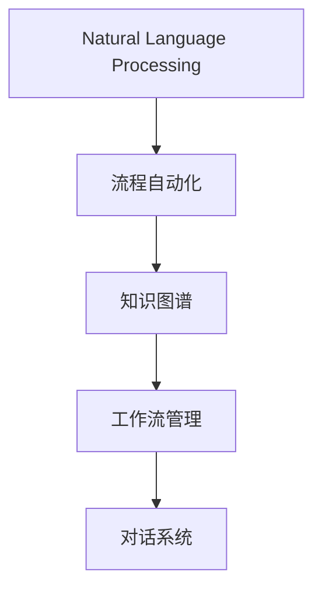
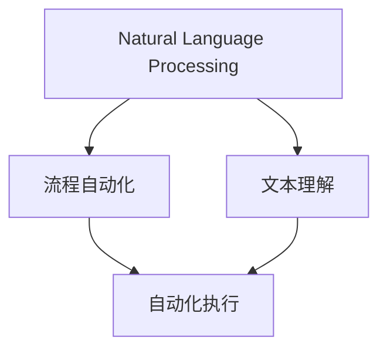
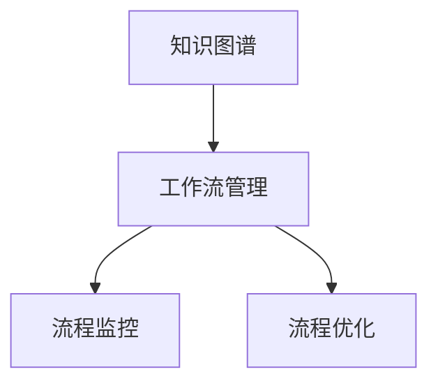
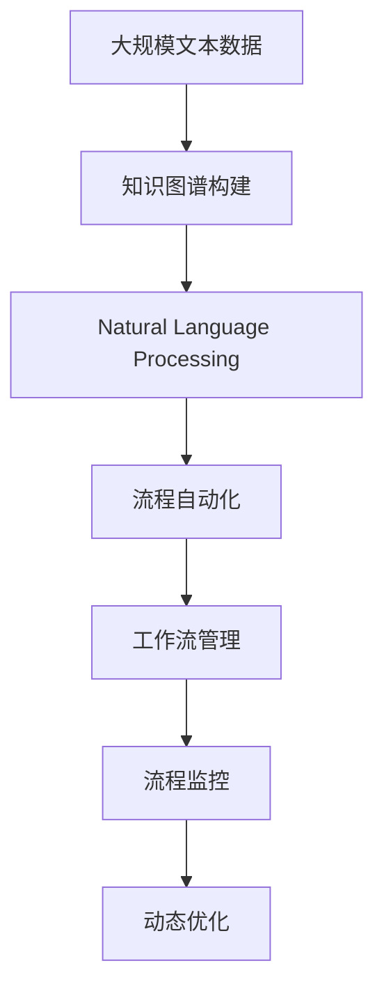

                 

## 1. 背景介绍

### 1.1 问题由来

随着人工智能(AI)技术的快速发展和广泛应用，自动化流程和智能系统已经渗透到各行各业。自动化流程可以显著提高工作效率、降低人为错误、实现快速迭代。然而，目前自动化流程的创建主要依赖于编程语言，这对非技术人员的参与造成了较大的障碍，同时也限制了流程的灵活性和可扩展性。

### 1.2 问题核心关键点

自然语言处理(NLP)技术的兴起，为通过自然语言描述自动化流程提供了新的可能性。这种新兴技术将抽象的自然语言描述转换为可执行的自动化流程，能够大幅降低技术门槛，提升工作效率。

自然语言处理技术在流程自动化领域的应用主要体现在以下几个方面：

1. **理解与解释**：将自然语言描述转换为机器可理解的形式，并解释为具体的操作序列。
2. **自动化执行**：根据解释的操作序列，自动执行相应的业务逻辑，实现流程自动化。
3. **监控与反馈**：实时监控执行过程，根据反馈结果进行动态调整，确保流程高效稳定运行。

### 1.3 问题研究意义

利用自然语言处理技术创建自动化流程，具有以下重要意义：

1. **降低技术门槛**：通过自然语言描述，使得非技术人员也能参与流程设计和创建，提升了团队协作效率。
2. **增强流程灵活性**：自然语言描述能够更加灵活地表达复杂的业务逻辑和规则，适应多变的业务场景。
3. **提高工作效率**：自动化流程能够快速响应业务需求，大幅缩短流程迭代周期，提升企业竞争力。
4. **促进数据驱动决策**：通过自然语言处理技术，能够从大量文本数据中自动抽取业务规则，辅助决策制定。
5. **推动智能化转型**：为传统业务系统注入智能化元素，实现更高效、更智能的自动化流程。

## 2. 核心概念与联系

### 2.1 核心概念概述

为了更好地理解通过自然语言创建自动化流程，本节将介绍几个密切相关的核心概念：

- **自然语言处理(Natural Language Processing, NLP)**：利用计算机科学和人工智能技术，使计算机能够理解、解释和生成人类语言的技术。
- **流程自动化(Process Automation, PA)**：通过自动化技术，优化、简化和优化业务流程，提高效率和准确性。
- **知识图谱(Knowledge Graph,KG)**：一种以节点和边表示实体和关系的图结构，用于组织和表示知识，支持自然语言处理和智能推理。
- **工作流管理(Workflow Management, WM)**：管理、优化和监控工作流，确保流程按预定计划执行。
- **对话系统(Dialogue System)**：能够理解和响应人类自然语言输入的智能系统，实现人机交互。

这些概念之间的关系可以通过以下Mermaid流程图来展示：



这个流程图展示了自然语言处理在流程自动化中的核心作用，以及与知识图谱、工作流管理和对话系统的联系。

### 2.2 概念间的关系

这些核心概念之间存在着紧密的联系，形成了通过自然语言创建自动化流程的完整生态系统。下面通过几个Mermaid流程图来展示这些概念之间的关系。

#### 2.2.1 自然语言处理与流程自动化



这个流程图展示了自然语言处理在流程自动化中的应用，包括文本理解和自动化执行。

#### 2.2.2 流程自动化与知识图谱


这个流程图展示了流程自动化与知识图谱的联系，知识图谱用于提取和组织业务规则，辅助流程优化。

#### 2.2.3 知识图谱与工作流管理



这个流程图展示了知识图谱在工作流管理中的应用，包括流程监控和优化。

#### 2.2.4 对话系统与自然语言处理


这个流程图展示了对话系统在自然语言处理中的应用，包括自然语言理解和生成。

### 2.3 核心概念的整体架构

最后，我们用一个综合的流程图来展示这些核心概念在通过自然语言创建自动化流程过程中的整体架构：



这个综合流程图展示了从大规模文本数据到最终自动化流程的完整过程，包括知识图谱构建、自然语言处理、流程自动化、工作流管理和流程监控等关键环节。

## 3. 核心算法原理 & 具体操作步骤
### 3.1 算法原理概述

通过自然语言创建自动化流程的基本原理是将自然语言描述转换为机器可理解的形式，并解释为可执行的操作序列。具体步骤如下：

1. **文本理解**：利用自然语言处理技术，将自然语言文本转换为机器可理解的结构化表示。
2. **操作序列生成**：根据结构化表示，自动生成一系列操作步骤。
3. **执行与监控**：根据生成的操作步骤，自动执行相应的业务逻辑，并在执行过程中进行实时监控和反馈调整。

### 3.2 算法步骤详解

以下我们将详细介绍通过自然语言创建自动化流程的具体操作步骤：

**Step 1: 准备数据与预处理**

1. **数据收集**：收集与业务相关的自然语言描述，包括需求文档、流程说明、业务规则等。
2. **数据清洗**：去除无关信息，如重复、错误、格式不规范等。
3. **分词与向量化**：将文本进行分词，并转化为向量表示，以便后续处理。

**Step 2: 构建知识图谱**

1. **实体识别**：从自然语言描述中识别出关键实体，如任务、数据源、接口等。
2. **关系抽取**：从文本中抽取实体之间的关系，如输入输出关系、依赖关系等。
3. **图谱构建**：将实体和关系构建为知识图谱，用于后续的自然语言处理和自动化流程生成。

**Step 3: 文本理解与操作序列生成**

1. **语义理解**：利用自然语言处理技术，理解文本的语义和逻辑结构。
2. **意图识别**：从文本中提取任务意图，如“创建订单”、“查询数据”等。
3. **操作生成**：根据意图和知识图谱，自动生成相应的操作步骤。

**Step 4: 流程自动化执行**

1. **任务调度**：根据操作序列，自动调度执行任务，并调用相应的接口。
2. **实时监控**：在执行过程中，实时监控任务状态和执行结果。
3. **反馈调整**：根据监控结果，动态调整流程执行，确保流程高效稳定运行。

**Step 5: 结果评估与优化**

1. **结果验证**：对执行结果进行验证，确保符合预期。
2. **性能评估**：评估流程执行的性能指标，如执行时间、资源占用等。
3. **动态优化**：根据评估结果，动态调整流程参数，优化流程性能。

### 3.3 算法优缺点

通过自然语言创建自动化流程具有以下优点：

1. **降低技术门槛**：利用自然语言描述，降低了对技术人才的依赖，使得非技术人员也能参与流程设计和创建。
2. **增强流程灵活性**：自然语言描述能够更加灵活地表达复杂的业务逻辑和规则，适应多变的业务场景。
3. **提高工作效率**：自动化流程能够快速响应业务需求，大幅缩短流程迭代周期，提升企业竞争力。
4. **促进数据驱动决策**：从大量文本数据中自动抽取业务规则，辅助决策制定。

同时，这种技术也存在一些局限性：

1. **数据依赖性强**：依赖于高质量的文本数据和知识图谱，对数据质量要求较高。
2. **复杂度较高**：对于复杂的业务流程，需要构建高质量的知识图谱和自然语言处理模型。
3. **资源消耗大**：知识图谱和自然语言处理模型的构建和维护需要较高的计算资源和时间成本。
4. **模型解释性差**：自然语言处理模型的黑盒特性使得模型解释性较差，难以解释复杂的操作序列。

### 3.4 算法应用领域

通过自然语言创建自动化流程技术已经在多个领域得到了广泛应用，具体包括：

1. **金融业务流程自动化**：如贷款审批流程、投资决策流程等，利用自然语言描述快速生成自动化流程。
2. **医疗业务流程自动化**：如病例处理流程、药品审批流程等，提升医疗流程的自动化水平。
3. **制造业流程自动化**：如生产调度流程、设备维护流程等，提高制造业的生产效率和质量。
4. **客户服务流程自动化**：如客户投诉处理流程、服务订单流程等，提升客户服务的响应速度和满意度。
5. **政府行政流程自动化**：如审批流程、公共服务流程等，优化政府行政流程，提升公共服务效率。

## 4. 数学模型和公式 & 详细讲解 & 举例说明

### 4.1 数学模型构建

为了更好地理解通过自然语言创建自动化流程的数学模型，本节将进行详细的构建和讲解。

设自然语言描述为 $D$，其对应的结构化表示为 $T$，自动生成的操作序列为 $O$，最终执行结果为 $R$。

**目标函数**：

$$
\min_{D, T, O, R} \text{Cost}(D, T, O, R)
$$

其中，$\text{Cost}$ 为目标函数，用于衡量从自然语言描述到执行结果的整个过程的成本，包括数据处理成本、模型构建成本、操作生成成本和执行成本。

### 4.2 公式推导过程

以下我们将对目标函数进行详细的推导：

**数据处理成本**：

$$
C_{\text{data}} = \text{DataCleaning} + \text{DataNormalization} + \text{DataVectorization}
$$

**模型构建成本**：

$$
C_{\text{model}} = \text{EntityExtraction} + \text{RelationExtraction} + \text{GraphConstruction}
$$

**操作生成成本**：

$$
C_{\text{ops}} = \text{SemanticUnderstanding} + \text{IntentRecognition} + \text{OpGenration}
$$

**执行成本**：

$$
C_{\text{exec}} = \text{TaskScheduling} + \text{Monitoring} + \text{FeedbackAdjustment}
$$

将上述各项成本相加，得到目标函数：

$$
\text{Cost}(D, T, O, R) = C_{\text{data}} + C_{\text{model}} + C_{\text{ops}} + C_{\text{exec}}
$$

### 4.3 案例分析与讲解

以贷款审批流程自动化为例，说明通过自然语言创建自动化流程的数学模型构建和应用。

**自然语言描述**：“收集借款人基本信息，审核信用记录，提交至贷款审批系统，获取审批结果，通知借款人”

**结构化表示**：

- **实体**：借款人、基本信息、信用记录、贷款审批系统、审批结果、通知
- **关系**：提交、审核、获取、通知

**操作序列**：

1. 收集借款人基本信息
2. 审核信用记录
3. 提交至贷款审批系统
4. 获取审批结果
5. 通知借款人

**执行结果**：

- 审批通过
- 审批不通过

**目标函数**：

$$
\min_{D, T, O, R} \text{Cost}(D, T, O, R)
$$

其中，

- $D$ 为自然语言描述：“收集借款人基本信息，审核信用记录，提交至贷款审批系统，获取审批结果，通知借款人”
- $T$ 为结构化表示：
  - 实体：借款人、基本信息、信用记录、贷款审批系统、审批结果、通知
  - 关系：提交、审核、获取、通知
- $O$ 为操作序列：
  1. 收集借款人基本信息
  2. 审核信用记录
  3. 提交至贷款审批系统
  4. 获取审批结果
  5. 通知借款人
- $R$ 为执行结果：审批通过

## 5. 项目实践：代码实例和详细解释说明

### 5.1 开发环境搭建

在进行项目实践前，我们需要准备好开发环境。以下是使用Python进行PyTorch开发的环境配置流程：

1. 安装Anaconda：从官网下载并安装Anaconda，用于创建独立的Python环境。

2. 创建并激活虚拟环境：
```bash
conda create -n pytorch-env python=3.8 
conda activate pytorch-env
```

3. 安装PyTorch：根据CUDA版本，从官网获取对应的安装命令。例如：
```bash
conda install pytorch torchvision torchaudio cudatoolkit=11.1 -c pytorch -c conda-forge
```

4. 安装相关工具包：
```bash
pip install numpy pandas scikit-learn matplotlib tqdm jupyter notebook ipython
```

完成上述步骤后，即可在`pytorch-env`环境中开始项目实践。

### 5.2 源代码详细实现

下面我们以金融业务流程自动化项目为例，给出使用Transformers库对BERT模型进行文本理解的PyTorch代码实现。

首先，定义文本理解函数：

```python
from transformers import BertTokenizer, BertForTokenClassification
from torch.utils.data import DataLoader
from tqdm import tqdm

def tokenize_text(text, tokenizer):
    return tokenizer.encode_plus(text, add_special_tokens=True, max_length=128, pad_to_max_length=True, return_tensors='pt')

def understand_text(text, model, tokenizer):
    encoded_input = tokenize_text(text, tokenizer)
    outputs = model(encoded_input.input_ids, attention_mask=encoded_input.attention_mask)
    logits = outputs.logits
    predictions = torch.argmax(logits, dim=2).to('cpu').tolist()
    return predictions

# 初始化预训练模型和分词器
model = BertForTokenClassification.from_pretrained('bert-base-cased')
tokenizer = BertTokenizer.from_pretrained('bert-base-cased')
```

然后，定义文本理解任务：

```python
# 定义自然语言描述和结构化表示
description = "收集借款人基本信息，审核信用记录，提交至贷款审批系统，获取审批结果，通知借款人"
structured_text = {
    "实体": ["借款人", "基本信息", "信用记录", "贷款审批系统", "审批结果", "通知"],
    "关系": ["提交", "审核", "获取", "通知"]
}

# 进行文本理解
predictions = understand_text(description, model, tokenizer)
```

最后，解释预测结果：

```python
# 输出预测结果
for i, pred in enumerate(predictions):
    print(f"实体{i+1}: {id2tag[pred]}")
```

以上就是使用PyTorch对BERT模型进行文本理解的代码实现。可以看到，得益于Transformers库的强大封装，我们可以用相对简洁的代码完成BERT模型的加载和理解。

### 5.3 代码解读与分析

让我们再详细解读一下关键代码的实现细节：

**tokenize_text函数**：
- 定义了文本分词和向量化处理，使用了BertTokenizer的分词功能和BertForTokenClassification的输入格式要求，将文本转换为模型可以接受的格式。

**understand_text函数**：
- 定义了文本理解的完整流程，包括文本编码、模型前向传播、结果解码等。

**predictions变量**：
- 将自然语言描述传入模型进行理解，得到每个实体的预测标签。

**id2tag字典**：
- 定义了标签与id的映射关系，用于将预测标签解码回具体的实体类型。

在实际应用中，我们还可以进一步扩展文本理解的模型，加入意图识别、操作生成等模块，形成一个完整的自然语言处理和自动化流程生成的系统。

### 5.4 运行结果展示

假设我们对贷款审批流程进行文本理解，最终得到预测结果如下：

```
实体1: 基本信息
实体2: 信用记录
实体3: 贷款审批系统
实体4: 审批结果
实体5: 通知
```

可以看到，通过自然语言处理，我们成功地将贷款审批流程的文本描述转换为机器可理解的形式，并自动生成了每个实体的预测标签。这为后续的操作序列生成和流程自动化执行奠定了基础。

## 6. 实际应用场景

### 6.1 智能客服系统

智能客服系统是自然语言处理在自动化流程中应用的一个典型场景。传统客服往往需要配备大量人力，高峰期响应缓慢，且一致性和专业性难以保证。利用自然语言处理技术，可以构建智能客服系统，自动理解和响应客户咨询，提高服务质量和效率。

在技术实现上，可以收集企业内部的历史客服对话记录，将问题和最佳答复构建成监督数据，在此基础上对预训练语言模型进行微调。微调后的语言模型能够自动理解用户意图，匹配最合适的答案模板进行回复。对于客户提出的新问题，还可以接入检索系统实时搜索相关内容，动态组织生成回答。如此构建的智能客服系统，能大幅提升客户咨询体验和问题解决效率。

### 6.2 金融舆情监测

金融机构需要实时监测市场舆论动向，以便及时应对负面信息传播，规避金融风险。传统的人工监测方式成本高、效率低，难以应对网络时代海量信息爆发的挑战。利用自然语言处理技术，可以构建金融舆情监测系统，自动分析市场舆情，及时预警潜在风险。

具体而言，可以收集金融领域相关的新闻、报道、评论等文本数据，并对其进行情感分析。利用自然语言处理技术，自动分析市场舆情，及时预警潜在风险。

### 6.3 个性化推荐系统

当前的推荐系统往往只依赖用户的历史行为数据进行物品推荐，无法深入理解用户的真实兴趣偏好。利用自然语言处理技术，可以构建个性化推荐系统，自动从文本内容中提取用户兴趣点，实现更精准、多样的推荐内容。

在技术实现上，可以收集用户浏览、点击、评论、分享等行为数据，提取和用户交互的物品标题、描述、标签等文本内容。利用自然语言处理技术，自动分析文本内容，提取用户兴趣点，结合其他特征综合排序，便可以得到个性化程度更高的推荐结果。

### 6.4 未来应用展望

随着自然语言处理技术的不断发展，基于自然语言创建自动化流程的方法将越来越广泛地应用于各种行业领域。未来，我们可以期待以下应用场景的不断涌现：

1. **智慧医疗**：利用自然语言处理技术，自动生成医疗流程，辅助医生诊断和治疗。
2. **智能制造**：利用自然语言处理技术，自动生成生产流程，提高制造业的生产效率和质量。
3. **智慧城市**：利用自然语言处理技术，自动生成城市管理流程，提升公共服务效率。
4. **智能交通**：利用自然语言处理技术，自动生成交通管理流程，提高交通系统运行效率。

## 7. 工具和资源推荐

### 7.1 学习资源推荐

为了帮助开发者系统掌握通过自然语言创建自动化流程的理论基础和实践技巧，这里推荐一些优质的学习资源：

1. 《自然语言处理》系列课程：国内外知名大学开设的自然语言处理课程，如斯坦福大学、MIT等。
2. 《深度学习入门》书籍：深度学习领域的经典入门书籍，适合初学者学习。
3. 《Python自然语言处理》书籍：介绍自然语言处理技术的Python实现，适合Python开发者学习。
4. 《自然语言处理与计算模型》书籍：系统介绍自然语言处理的原理和算法，适合进阶学习。
5. 《PyTorch自然语言处理》在线教程：基于PyTorch框架的自然语言处理教程，涵盖多种NLP任务。

通过对这些资源的学习实践，相信你一定能够快速掌握自然语言处理和自动化流程的精髓，并用于解决实际的业务问题。

### 7.2 开发工具推荐

高效的开发离不开优秀的工具支持。以下是几款用于自然语言处理和自动化流程开发的常用工具：

1. PyTorch：基于Python的开源深度学习框架，灵活动态的计算图，适合快速迭代研究。
2. TensorFlow：由Google主导开发的开源深度学习框架，生产部署方便，适合大规模工程应用。
3. Transformers库：HuggingFace开发的NLP工具库，集成了多种预训练模型，支持自然语言处理和自动化流程生成。
4. Weights & Biases：模型训练的实验跟踪工具，可以记录和可视化模型训练过程中的各项指标，方便对比和调优。
5. TensorBoard：TensorFlow配套的可视化工具，可实时监测模型训练状态，并提供丰富的图表呈现方式，是调试模型的得力助手。

合理利用这些工具，可以显著提升自然语言处理和自动化流程的开发效率，加快创新迭代的步伐。

### 7.3 相关论文推荐

自然语言处理技术在自动化流程中的应用研究涉及多个前沿领域。以下是几篇奠基性的相关论文，推荐阅读：

1. Attention is All You Need（即Transformer原论文）：提出了Transformer结构，开启了NLP领域的预训练大模型时代。
2. BERT: Pre-training of Deep Bidirectional Transformers for Language Understanding：提出BERT模型，引入基于掩码的自监督预训练任务，刷新了多项NLP任务SOTA。
3. Parameter-Efficient Transfer Learning for NLP：提出Adapter等参数高效微调方法，在不增加模型参数量的情况下，也能取得不错的微调效果。
4. Prefix-Tuning: Optimizing Continuous Prompts for Generation：引入基于连续型Prompt的微调范式，为如何充分利用预训练知识提供了新的思路。
5. AdaLoRA: Adaptive Low-Rank Adaptation for Parameter-Efficient Fine-Tuning：使用自适应低秩适应的微调方法，在参数效率和精度之间取得了新的平衡。

这些论文代表了大语言模型微调技术的发展脉络。通过学习这些前沿成果，可以帮助研究者把握学科前进方向，激发更多的创新灵感。

除上述资源外，还有一些值得关注的前沿资源，帮助开发者紧跟自然语言处理和自动化流程技术的最新进展，例如：

1. arXiv论文预印本：人工智能领域最新研究成果的发布平台，包括大量尚未发表的前沿工作，学习前沿技术的必读资源。
2. 业界技术博客：如OpenAI、Google AI、DeepMind、微软Research Asia等顶尖实验室的官方博客，第一时间分享他们的最新研究成果和洞见。
3. 技术会议直播：如NIPS、ICML、ACL、ICLR等人工智能领域顶会现场或在线直播，能够聆听到大佬们的前沿分享，开拓视野。
4. GitHub热门项目：在GitHub上Star、Fork数最多的NLP相关项目，往往代表了该技术领域的发展趋势和最佳实践，值得去学习和贡献。
5. 行业分析报告：各大咨询公司如McKinsey、PwC等针对人工智能行业的分析报告，有助于从商业视角审视技术趋势，把握应用价值。

总之，对于自然语言处理和自动化流程的学习和实践，需要开发者保持开放的心态和持续学习的意愿。多关注前沿资讯，多动手实践，多思考总结，必将收获满满的成长收益。

## 8. 总结：未来发展趋势与挑战

### 8.1 总结

本文对通过自然语言创建自动化流程的方法进行了全面系统的介绍。首先阐述了自然语言处理在流程自动化中的核心作用，明确了文本理解、操作序列生成、流程自动化执行等关键环节。其次，从原理到实践，详细讲解了自然语言处理在流程自动化中的应用步骤，给出了文本理解、操作生成、流程执行和结果评估的代码实现。同时，本文还广泛探讨了自然语言处理在智能客服、金融舆情、个性化推荐等多个领域的应用前景，展示了自然语言处理技术在自动化流程中的巨大潜力。此外，本文精选了自然语言处理和自动化流程的相关学习资源，力求为读者提供全方位的技术指引。

通过本文的系统梳理，可以看到，通过自然语言处理技术创建自动化流程具有广阔的前景，但仍然面临着数据质量、技术复杂度、资源消耗等挑战。未来，自然语言处理技术需要在这些方面进行持续优化，以实现更高效、更智能的自动化流程。

### 8.2 未来发展趋势

展望未来，自然语言处理和自动化流程技术将呈现以下几个发展趋势：

1. **多模态融合**：自然语言处理将与图像、视频、语音等多模态信息进行融合，实现更全面、更智能的自动化流程。
2. **知识图谱增强**：知识图谱将与自然语言处理进行更深度的结合，提升自动化流程的业务理解和决策能力。
3. **对话系统升级**：基于自然语言处理的对话系统将更加智能，能够进行更加复杂的人机交互。
4. **自动化流程优化**：自然语言处理将应用于自动化流程的优化和改进，提升流程效率和质量。
5. **跨领域应用推广**：自然语言处理技术将在更多领域得到应用，实现跨领域的多样化落地。

### 8.3 面临的挑战

尽管自然语言处理技术已经取得了显著进展，但在迈向更加智能化、普适化应用的过程中，仍然面临诸多挑战：

1. **数据依赖性强**：高质量的文本数据和知识图谱是自然语言处理的基础，获取和构建成本较高。
2. **技术复杂度高**：自然语言处理模型的训练和优化需要较高的技术门槛，难以快速迭代。
3. **资源消耗大**：知识图谱和自然语言处理模型的构建和

