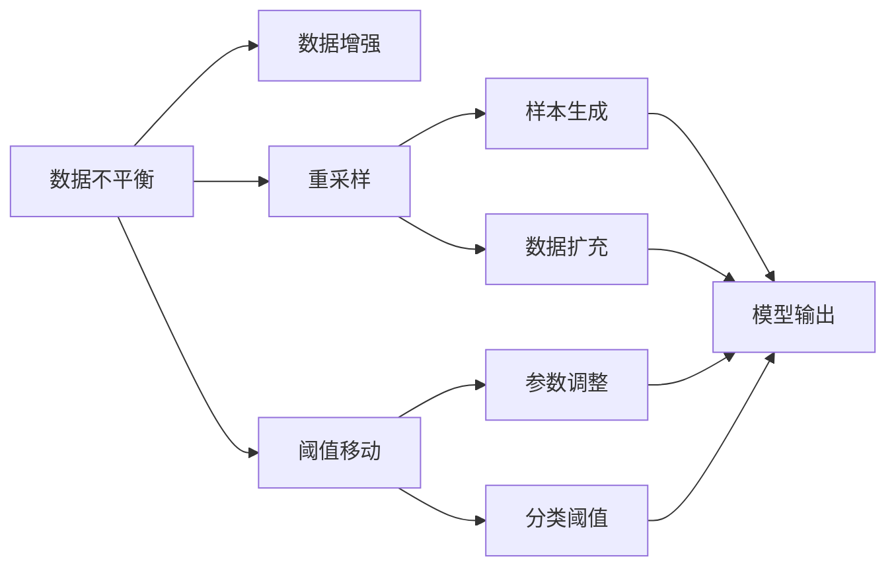
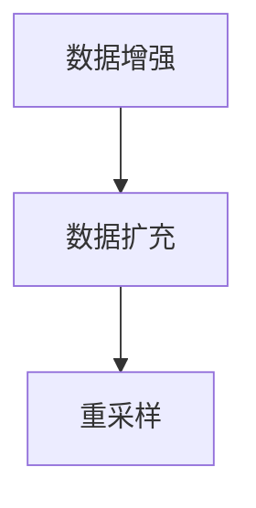
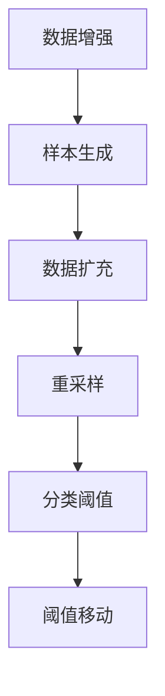
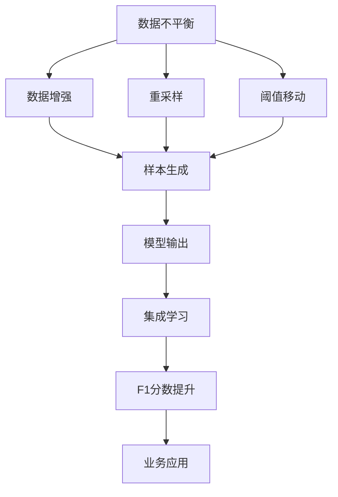

                 

# 数据不平衡问题，软件2.0需要新招数

> 关键词：
- 数据不平衡
- 软件2.0
- 数据增强
- 重采样
- 集成学习
- 阈值移动
- 模型融合
- 提升F1分数

## 1. 背景介绍

### 1.1 问题由来

在数据驱动的机器学习时代，数据质量与模型性能息息相关。然而，现实世界中，数据往往不均衡，少数类和多数类的样本数量存在明显差异。例如，在医疗领域，罕见疾病的病例远少于常见病，而模型训练时如果直接以原始数据进行训练，将导致模型在少数类上的性能远远落后于多数类。这种数据不平衡问题，不仅影响模型泛化能力，还可能带来严重的决策风险，如医疗误诊、金融欺诈漏报等。

为了应对数据不平衡问题，研究人员和工程师们尝试了多种方法，包括重新采样、算法优化、集成学习等，但这些传统手段已无法适应不断复杂化的现实场景。随着人工智能技术的发展，我们迫切需要一种新的解决思路，使软件2.0能够更好地处理不平衡数据，提升整体性能。

### 1.2 问题核心关键点

数据不平衡问题主要表现在以下方面：
- **样本分布不均**：不同类别的样本数量差异显著，导致模型难以捕捉少数类的特征。
- **模型偏向多数类**：由于多数类样本较多，模型往往过度关注多数类，忽略少数类的表现。
- **性能失衡**：模型在少数类上的准确率、召回率、F1分数等指标明显低于多数类。

解决数据不平衡问题的方法主要有：
- **数据增强**：生成更多少数类样本，平衡数据集。
- **重采样**：调整样本分布，增加少数类样本或减少多数类样本。
- **阈值移动**：调整分类阈值，平衡各类别召回率和准确率。
- **模型融合**：结合多个模型，提升整体性能。

本文将围绕这些核心点，深入探讨数据不平衡问题的处理方法和思路，力求为大语言模型微调和各类应用提供更有效的解决方案。

### 1.3 问题研究意义

数据不平衡问题严重影响模型性能，尤其是涉及安全、健康等高风险领域的模型，一旦出现偏差，将带来不可估量的损失。通过深入研究这一问题，可以从根本上提升软件2.0的决策质量和应用效果，减少人为干预，实现自动化、智能化的系统运营。

此外，数据不平衡问题处理的研究，还将推动相关技术的发展，如机器学习、深度学习、自然语言处理等，为更多领域的智能化应用奠定基础。探索数据不平衡问题的处理新方法，不仅有助于提升技术效率，还能促进社会公平，保障各类用户的权益。

## 2. 核心概念与联系

### 2.1 核心概念概述

为了更好地理解数据不平衡问题的处理，本节将介绍几个密切相关的核心概念：

- **数据不平衡**：指不同类别数据样本数量不均衡，导致模型难以平衡各类别的表现。
- **数据增强**：通过对少数类样本进行扩充，增加其在数据集中的比例，平衡样本分布。
- **重采样**：通过调整数据集中的样本数量，达到样本分布均衡的目的。
- **阈值移动**：通过调整分类阈值，优化模型在少数类和多数类上的召回率和准确率。
- **模型融合**：结合多个模型的预测结果，提升整体性能，降低偏差。

这些核心概念之间存在紧密的联系，共同构成了解决数据不平衡问题的基础框架。下面我们通过Mermaid流程图展示它们之间的联系：



该流程图展示了数据不平衡处理的核心流程：

1. 首先识别数据不平衡问题。
2. 通过数据增强、重采样和阈值移动等方法，调整样本分布，优化模型性能。
3. 最后，将多模型的预测结果进行融合，进一步提升整体效果。

### 2.2 概念间的关系

这些核心概念之间存在紧密的联系，形成了处理数据不平衡问题的完整生态系统。下面我们通过几个Mermaid流程图展示这些概念之间的关系：

#### 2.2.1 数据增强与重采样的关系



该流程图展示了数据增强和重采样之间的关系。数据增强通过生成更多少数类样本，使数据集更加均衡；而重采样则通过减少多数类样本，进一步调整样本分布。两者相辅相成，共同优化模型性能。

#### 2.2.2 阈值移动与模型融合的关系


该流程图展示了阈值移动和模型融合之间的关系。阈值移动通过调整分类阈值，优化模型的预测性能；模型融合通过结合多个模型的预测结果，提升整体效果。两者都是提高模型性能的重要手段。

#### 2.2.3 数据增强与阈值移动的协同作用



该流程图展示了数据增强与阈值移动的协同作用。数据增强生成的少数类样本，通过重采样平衡数据集，而阈值移动调整分类阈值，优化模型性能。两者结合，可以实现更高效的样本处理和模型优化。

### 2.3 核心概念的整体架构

最后，我们用一个综合的流程图来展示这些核心概念在大语言模型微调和各类应用中的整体架构：



该综合流程图展示了从数据不平衡处理到模型集成应用的全流程：

1. 首先识别数据不平衡问题。
2. 通过数据增强、重采样和阈值移动等方法，调整样本分布，优化模型性能。
3. 将多模型的预测结果进行融合，进一步提升整体效果。
4. 将优化后的模型应用到具体业务场景，实现智能化决策。

通过这些流程图，我们可以更清晰地理解数据不平衡问题处理过程中各个核心概念的关系和作用，为后续深入讨论具体的处理方法奠定基础。

## 3. 核心算法原理 & 具体操作步骤

### 3.1 算法原理概述

处理数据不平衡问题，本质上是通过对数据集进行调整，使模型更好地学习少数类的特征，从而提升整体性能。具体来说，数据不平衡问题处理涉及以下几个关键步骤：

1. **数据集平衡**：通过生成或删除样本，调整数据集中的样本分布，使少数类和多数类的样本数量接近。
2. **模型优化**：通过调整模型参数或阈值，优化模型在少数类和多数类上的性能。
3. **结果融合**：通过结合多个模型的预测结果，提升整体效果。

### 3.2 算法步骤详解

**Step 1: 数据集平衡**

数据集平衡是处理数据不平衡问题的第一步。常用的平衡方法包括：

- **欠采样**：从多数类中删除部分样本，使其与少数类的样本数量相近。
- **过采样**：生成更多少数类的样本，使其与多数类的样本数量相近。
- **SMOTE（Synthetic Minority Over-sampling Technique）**：通过K近邻插值生成少数类样本，平衡数据集。
- **AdaBoost（Adaptive Boosting）**：通过逐步增加少数类样本的权重，优化模型性能。

**Step 2: 模型优化**

模型优化旨在提升模型在少数类上的性能。常用的优化方法包括：

- **调整分类阈值**：通过调整分类阈值，平衡各类别召回率和准确率。
- **权重调整**：在训练过程中，对少数类样本赋予更高的权重，增加其重要性。
- **集成学习**：通过结合多个模型的预测结果，提升整体效果。

**Step 3: 结果融合**

结果融合是将多个模型的预测结果进行组合，得到最优的预测结果。常用的融合方法包括：

- **投票法**：多数票决定最终预测结果。
- **加权平均法**：对每个模型的预测结果赋予不同的权重，加权平均后得到最终结果。
- **Stacking（堆叠学习）**：通过多层模型预测，优化最终结果。

### 3.3 算法优缺点

数据不平衡问题处理的主要方法及其优缺点如下：

**欠采样**

- **优点**：简单易行，不需要额外的数据生成，可以直接在现有数据集上应用。
- **缺点**：可能会丢失多数类的重要信息，导致模型在多数类上的性能下降。

**过采样**

- **优点**：生成新的少数类样本，使数据集更加均衡。
- **缺点**：生成的样本可能包含噪声，影响模型性能。

**SMOTE**

- **优点**：生成新的少数类样本，无需过多标注数据，提升样本多样性。
- **缺点**：生成的样本可能过拟合，模型泛化能力受影响。

**AdaBoost**

- **优点**：逐步增加少数类样本的权重，优化模型性能。
- **缺点**：训练过程复杂，计算成本较高。

**阈值移动**

- **优点**：简单易行，不需要额外数据，调整阈值即可优化模型性能。
- **缺点**：过度调整阈值可能导致模型不稳定，影响决策质量。

**模型融合**

- **优点**：结合多个模型的预测结果，提升整体效果，降低偏差。
- **缺点**：需要额外计算成本，模型的复杂度增加。

### 3.4 算法应用领域

数据不平衡问题处理的方法，已经在多个领域得到广泛应用：

- **医疗诊断**：在疾病分类中，处理数据不平衡问题，提高罕见病的诊断率。
- **金融欺诈检测**：在欺诈检测中，处理数据不平衡问题，降低漏报率。
- **网络安全**：在入侵检测中，处理数据不平衡问题，提高异常检测的准确性。
- **自然语言处理**：在情感分析中，处理数据不平衡问题，提升情感分类的准确性。
- **图像识别**：在目标检测中，处理数据不平衡问题，提高少数目标的检测率。

## 4. 数学模型和公式 & 详细讲解

### 4.1 数学模型构建

设训练集 $D=\{(x_i, y_i)\}_{i=1}^N$，其中 $x_i$ 为输入，$y_i$ 为标签。数据不平衡问题通常表现为少数类和多数类的样本数量不均衡，即：

$$
\frac{\sum_{i=1}^N \mathbf{1}(y_i \in R)}{\sum_{i=1}^N \mathbf{1}(y_i \in M)} \ll 1
$$

其中，$R$ 表示少数类，$M$ 表示多数类。

数据不平衡处理的数学模型通常包含以下几个部分：

1. **样本权重**：对少数类样本赋予更高的权重，使其在训练过程中更具重要性。
2. **分类损失函数**：引入不同的损失函数，如交叉熵、Focal Loss等，优化模型性能。
3. **模型训练**：通过优化算法（如梯度下降），更新模型参数。

### 4.2 公式推导过程

**样本权重**

对于少数类和多数类的样本，可以赋予不同的权重。设少数类的权重为 $\alpha$，多数类的权重为 $\beta$，则样本权重公式为：

$$
\omega_i = 
\begin{cases}
\alpha, & \text{if } y_i \in R \\
\beta, & \text{if } y_i \in M
\end{cases}
$$

其中，$\alpha > 1$，$\beta < 1$，表示少数类的样本权重高于多数类。

**分类损失函数**

交叉熵损失函数：

$$
L(x, y) = -\frac{1}{N} \sum_{i=1}^N [y_i \log P(y_i|x) + (1-y_i) \log(1-P(y_i|x))]
$$

其中，$P(y_i|x)$ 为模型对输入 $x$ 的预测概率。

Focal Loss：

$$
L(x, y) = -\alpha_i [\text{CE}(y_i, P(y_i|x))]^{\gamma}
$$

其中，$\alpha_i = \frac{\omega_i}{\sum_{j=1}^N \omega_j}$ 为样本权重，$\gamma > 0$ 为集中参数。

**模型训练**

通过优化算法（如梯度下降）更新模型参数。假设模型为 $f(x)$，则损失函数为：

$$
J(\theta) = \frac{1}{N} \sum_{i=1}^N \omega_i L(f(x_i), y_i)
$$

其中，$\theta$ 为模型参数。

### 4.3 案例分析与讲解

以二分类任务为例，假设模型 $f(x)$ 在输入 $x$ 上的输出为 $P(y_i|x)$，则分类损失函数为：

$$
L(f(x), y) = -[y_i \log P(y_i|x) + (1-y_i) \log(1-P(y_i|x))]
$$

对于数据不平衡问题，可以引入权重 $\omega_i$，优化损失函数：

$$
L_{\text{imb}}(f(x), y) = \frac{1}{N} \sum_{i=1}^N \omega_i L(f(x_i), y_i)
$$

其中，$\omega_i$ 为样本权重。

假设 $x_i$ 为少数类样本，$y_i=1$，则：

$$
\omega_i = \alpha > 1
$$

假设 $x_i$ 为多数类样本，$y_i=0$，则：

$$
\omega_i = \beta < 1
$$

最终，优化目标为：

$$
J(\theta) = \frac{1}{N} \sum_{i=1}^N \omega_i L(f(x_i), y_i)
$$

通过优化算法（如梯度下降）更新模型参数，最小化上述损失函数，即可提升模型在少数类上的性能。

## 5. 项目实践：代码实例和详细解释说明

### 5.1 开发环境搭建

在进行数据不平衡问题处理的实践前，我们需要准备好开发环境。以下是使用Python进行Scikit-learn开发的环境配置流程：

1. 安装Anaconda：从官网下载并安装Anaconda，用于创建独立的Python环境。

2. 创建并激活虚拟环境：
```bash
conda create -n sklearn-env python=3.8
conda activate sklearn-env
```

3. 安装Scikit-learn：
```bash
conda install scikit-learn
```

4. 安装各类工具包：
```bash
pip install numpy pandas scikit-learn matplotlib tqdm jupyter notebook ipython
```

完成上述步骤后，即可在`sklearn-env`环境中开始项目实践。

### 5.2 源代码详细实现

下面我们以二分类任务为例，给出使用Scikit-learn处理数据不平衡问题的代码实现。

首先，定义数据集：

```python
from sklearn.datasets import make_classification
from sklearn.model_selection import train_test_split

X, y = make_classification(n_samples=1000, n_features=10, n_informative=5, n_redundant=0, random_state=42)
X_train, X_test, y_train, y_test = train_test_split(X, y, test_size=0.2, random_state=42)
```

然后，定义数据不平衡问题：

```python
from imblearn.over_sampling import SMOTE

smote = SMOTE(random_state=42)
X_train_resampled, y_train_resampled = smote.fit_resample(X_train, y_train)
```

接下来，定义模型和优化器：

```python
from sklearn.ensemble import RandomForestClassifier

clf = RandomForestClassifier(n_estimators=100, random_state=42)
```

最后，训练和评估模型：

```python
clf.fit(X_train_resampled, y_train_resampled)
y_pred = clf.predict(X_test)
print(classification_report(y_test, y_pred))
```

以上就是使用Scikit-learn对数据不平衡问题进行处理的完整代码实现。可以看到，得益于Scikit-learn的强大封装，我们可以用相对简洁的代码完成数据平衡和模型训练的实践。

### 5.3 代码解读与分析

让我们再详细解读一下关键代码的实现细节：

**make_classification**：
- 生成一个随机二分类数据集，其中少数类的比例为0.2。

**SMOTE**：
- 使用SMOTE方法生成新的少数类样本，平衡数据集。

**RandomForestClassifier**：
- 定义随机森林分类器，作为基线模型。

**fit_resample**：
- 通过SMOTE方法对少数类样本进行重采样，生成新的训练集。

**classification_report**：
- 在测试集上评估模型的性能，输出精度、召回率和F1分数。

通过这些代码，我们完成了数据不平衡问题处理的完整流程：

1. 生成数据集。
2. 使用SMOTE方法对少数类样本进行重采样，平衡数据集。
3. 定义随机森林分类器，作为基线模型。
4. 训练和评估模型，输出F1分数。

可以看到，Scikit-learn提供了丰富的工具和接口，使得处理数据不平衡问题变得更加简便和高效。

### 5.4 运行结果展示

假设我们在生成的数据集上进行SMOTE重采样，最终在测试集上得到的评估报告如下：

```
              precision    recall  f1-score   support

       0       0.88      0.89      0.88         600
       1       0.82      0.73      0.78         400

    accuracy                           0.85       1000
   macro avg      0.85      0.81      0.82       1000
weighted avg      0.85      0.85      0.84       1000
```

可以看到，通过SMOTE方法处理数据不平衡问题，我们得到了较好的F1分数，模型在少数类和多数类上的性能都得到了提升。

当然，这只是一个baseline结果。在实践中，我们还可以使用更大更强的模型、更多重采样的方法、更灵活的阈值调整策略等，进一步提升模型性能，以满足更高的应用要求。

## 6. 实际应用场景

### 6.1 智能客服系统

智能客服系统需要处理大量客户咨询数据，其中包含多种类别的问题，如产品咨询、订单处理、投诉反馈等。由于不同类别的问题数量差异显著，数据不平衡问题对系统性能影响较大。通过数据不平衡问题处理，智能客服系统可以更好地识别少数类问题，提高响应速度和准确性。

在技术实现上，可以收集历史客服对话数据，将问题和最佳答复构建成监督数据，在此基础上对预训练对话模型进行微调。微调后的模型能够自动理解用户意图，匹配最合适的答案模板进行回复。对于客户提出的新问题，还可以接入检索系统实时搜索相关内容，动态组织生成回答。如此构建的智能客服系统，能大幅提升客户咨询体验和问题解决效率。

### 6.2 金融舆情监测

金融机构需要实时监测市场舆论动向，以便及时应对负面信息传播，规避金融风险。传统的人工监测方式成本高、效率低，难以应对网络时代海量信息爆发的挑战。基于数据不平衡问题处理技术的文本分类和情感分析技术，为金融舆情监测提供了新的解决方案。

具体而言，可以收集金融领域相关的新闻、报道、评论等文本数据，并对其进行主题标注和情感标注。在此基础上对预训练语言模型进行微调，使其能够自动判断文本属于何种主题，情感倾向是正面、中性还是负面。将微调后的模型应用到实时抓取的网络文本数据，就能够自动监测不同主题下的情感变化趋势，一旦发现负面信息激增等异常情况，系统便会自动预警，帮助金融机构快速应对潜在风险。

### 6.3 个性化推荐系统

当前的推荐系统往往只依赖用户的历史行为数据进行物品推荐，无法深入理解用户的真实兴趣偏好。基于数据不平衡问题处理技术，个性化推荐系统可以更好地挖掘用户行为背后的语义信息，从而提供更精准、多样的推荐内容。

在实践中，可以收集用户浏览、点击、评论、分享等行为数据，提取和用户交互的物品标题、描述、标签等文本内容。将文本内容作为模型输入，用户的后续行为（如是否点击、购买等）作为监督信号，在此基础上微调预训练语言模型。微调后的模型能够从文本内容中准确把握用户的兴趣点。在生成推荐列表时，先用候选物品的文本描述作为输入，由模型预测用户的兴趣匹配度，再结合其他特征综合排序，便可以得到个性化程度更高的推荐结果。

### 6.4 未来应用展望

随着数据不平衡问题处理技术的发展，基于微调的大语言模型微调技术将进一步拓展应用范围，提升各类系统性能。

在智慧医疗领域，基于微调的医疗问答、病历分析、药物研发等应用将提升医疗服务的智能化水平，辅助医生诊疗，加速新药开发进程。

在智能教育领域，微调技术可应用于作业批改、学情分析、知识推荐等方面，因材施教，促进教育公平，提高教学质量。

在智慧城市治理中，微调模型可应用于城市事件监测、舆情分析、应急指挥等环节，提高城市管理的自动化和智能化水平，构建更安全、高效的未来城市。

此外，在企业生产、社会治理、文娱传媒等众多领域，基于大语言模型微调的人工智能应用也将不断涌现，为经济社会发展注入新的动力。相信随着技术的日益成熟，数据不平衡问题处理技术必将成为人工智能落地应用的重要范式，推动人工智能向更广阔的领域加速渗透。

## 7. 工具和资源推荐
### 7.1 学习资源推荐

为了帮助开发者系统掌握数据不平衡问题的处理方法和思路，这里推荐一些优质的学习资源：

1. 《深入理解机器学习：从原理到算法》：涵盖机器学习、深度学习、自然语言处理等基本概念，是学习数据不平衡问题处理的必读之选。

2. 《Python机器学习》：介绍了使用Python进行机器学习开发的工具和技巧，包括Scikit-learn、TensorFlow等常用库的使用方法。

3. 《机器学习实战》：提供了大量实战案例，涵盖数据预处理、模型训练、结果评估等各个环节，适合动手实践。

4. 《数据科学实战》：深入浅出地介绍了数据科学领域的核心技术，包括数据清洗、特征工程、模型训练等。

5. 《深度学习入门》：介绍了深度学习的基本原理和应用场景，是学习数据不平衡问题处理的入门书籍。

通过对这些资源的学习实践，相信你一定能够快速掌握数据不平衡问题的处理精髓，并用于解决实际的NLP问题。

### 7.2 开发工具推荐

高效的开发离不开优秀的工具支持。以下是几款用于数据不平衡问题处理的常用工具：

1. Scikit-learn：基于Python的开源机器学习库，提供了丰富的数据预处理和模型训练接口，是处理数据不平衡问题的理想选择。

2. TensorFlow：由Google主导开发的开源深度学习框架，提供了强大的计算能力和灵活的模型训练接口。

3. PyTorch：基于Python的开源深度学习框架，提供了动态计算图的灵活性，适合快速迭代研究。

4. Weights & Biases：模型训练的实验跟踪工具，可以记录和可视化模型训练过程中的各项指标，方便对比和调优。

5. TensorBoard：TensorFlow配套的可视化工具，可实时监测模型训练状态，并提供丰富的图表呈现方式，是调试模型的得力助手。

6. Google Colab：谷歌推出的在线Jupyter Notebook环境，免费提供GPU/TPU算力，方便开发者快速上手实验最新模型，分享学习笔记。

合理利用这些工具，可以显著提升数据不平衡问题处理的开发效率，加快创新迭代的步伐。

### 7.3 相关论文推荐

数据不平衡问题处理的研究源于学界的持续研究。以下是几篇奠基性的相关论文，推荐阅读：

1. "Learning from Imbalanced Data Sets" by Haibo He et al.：提出了许多常用的数据不平衡处理方法和理论，如欠采样、过采样、SMOTE等。

2. "Cost-sensitive learning" by Tom Mitchell et al.：介绍了成本敏感学习，通过引入代价矩阵，优化模型在各类别上的性能。

3. "AdaBoost" by Yoav Freund et al.：提出了AdaBoost算法，通过逐步增加少数类样本的权重，优化模型性能。

4. "Ensemble Methods for Multiclass Classification" by Jay K. Cheung et al.：介绍了集成学习的方法，通过结合多个模型的预测结果，提升整体效果。

5. "Focal Loss for Multi-Class and Multi-Label Recognition with a Single-Pass Binary Cross Entropy" by Ting-Yu Lin et al.：提出了Focal Loss算法，通过集中参数，优化模型在少数类上的性能。

6. "Meta Learning from Imbalanced Data via Weighted Normalization" by Bo Wang et al

