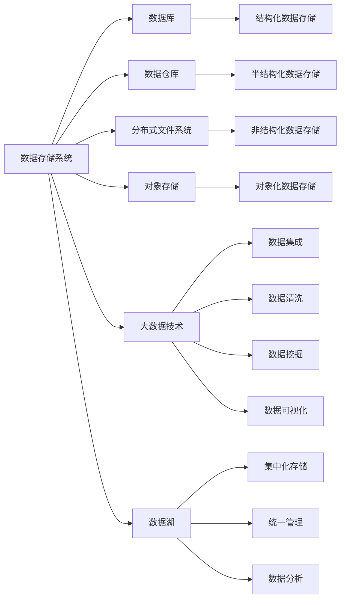
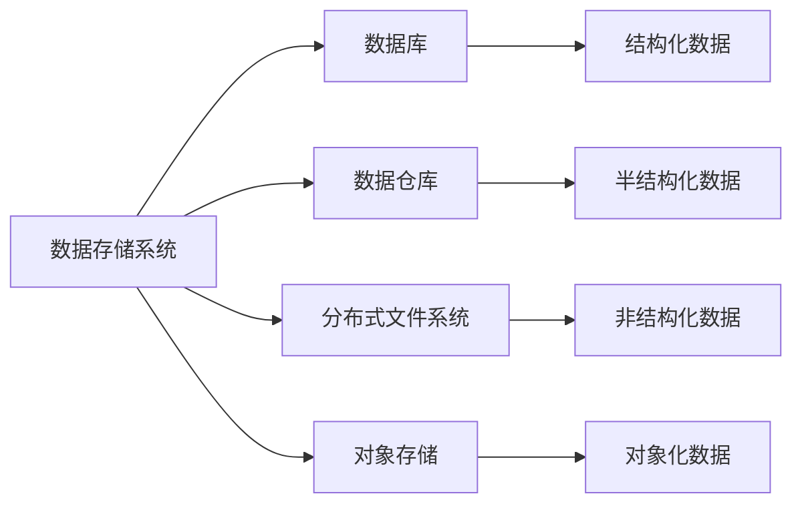
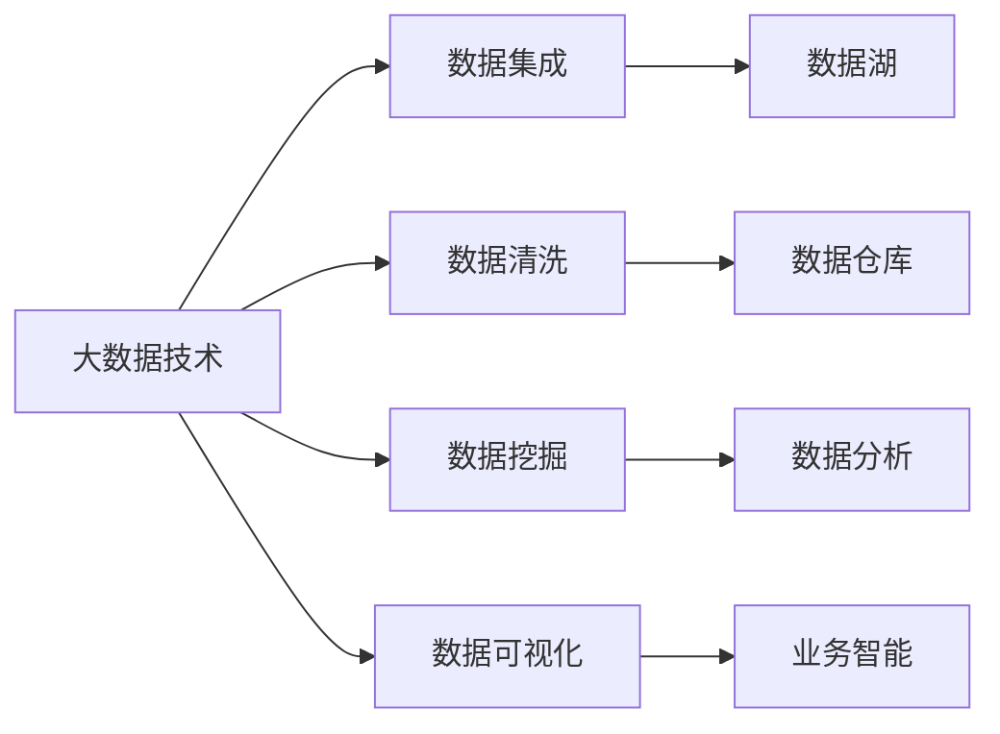
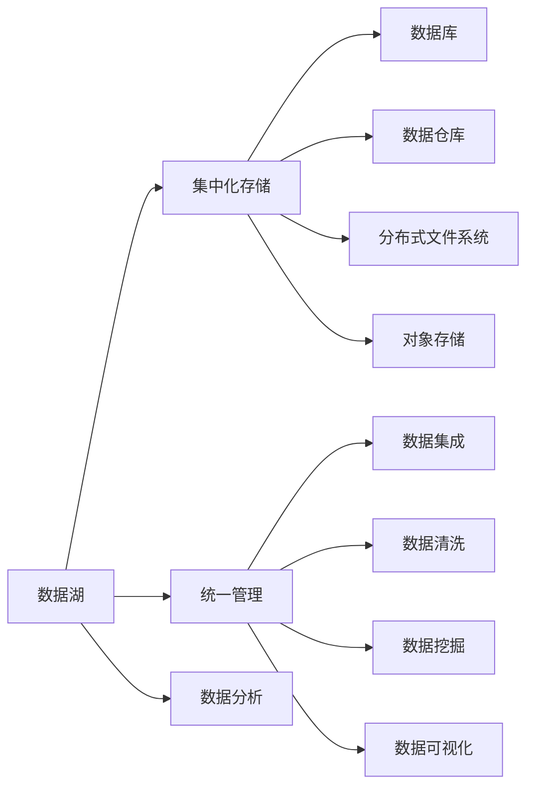
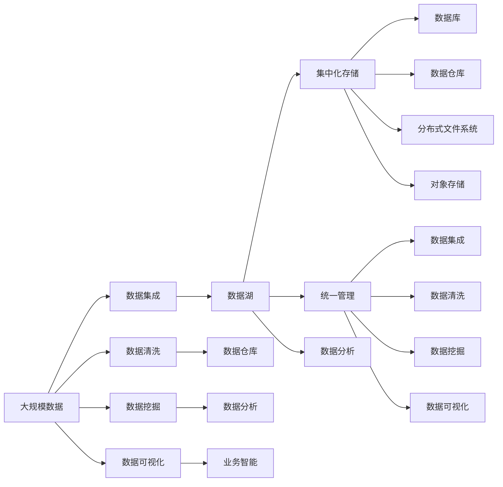

                 

# 数据存储系统：满足 AI 2.0 海量数据存储需求

> 关键词：AI 2.0, 数据存储系统, 大数据, 高性能存储, 分布式存储, 数据湖, 数据管理, 数据库技术, 云存储, 数据安全

## 1. 背景介绍

### 1.1 问题由来
随着人工智能技术的快速发展和应用场景的不断拓展，AI 2.0 时代已经到来。AI 2.0 不仅追求算法性能的提升，更强调数据驱动、模型训练和推理的高效性。海量数据存储与高效数据管理成为支撑 AI 2.0 发展的核心基础。

当前，企业数据量呈指数级增长，数据类型也愈发多样化，包含结构化数据、半结构化数据、非结构化数据等。同时，实时数据流的大规模产生，对数据存储系统的容量、吞吐率和可靠性提出了更高的要求。如何构建满足 AI 2.0 需求的数据存储系统，成为当下数据科学和人工智能领域的重要课题。

### 1.2 问题核心关键点
AI 2.0 数据存储系统需要具备以下核心特点：

- **高性能存储**：支撑大规模数据的高吞吐率和低延迟，保证数据存储与访问的实时性。
- **高可扩展性**：支持海量数据的存储和在线扩展，适应数据规模的不确定性。
- **高可用性**：实现数据的高可靠性和容灾能力，避免单点故障导致的业务中断。
- **数据安全与隐私保护**：确保数据存储的安全性和用户隐私，遵守相关法律法规。
- **灵活与可管理性**：支持数据类型的多样性，实现数据的便捷管理和高效使用。

### 1.3 问题研究意义
构建高效、可靠、安全的数据存储系统，对于推动 AI 2.0 技术的发展和应用具有重要意义：

1. **支撑 AI 模型的训练与推理**：提供高性能、高容量的数据存储服务，支持大规模模型的训练和推理。
2. **加速数据驱动的决策**：通过高效的数据检索和管理，加速数据驱动的决策和业务智能分析。
3. **促进数据科学研究的进步**：构建数据湖，为数据科学家提供丰富的数据资源和分析工具，推动科学研究与技术创新。
4. **提升数据价值利用率**：优化数据存储系统，提高数据利用效率，实现数据的广泛应用与创新。
5. **确保数据安全与合规性**：加强数据安全防护措施，确保数据合规，维护数据权益和用户信任。

## 2. 核心概念与联系

### 2.1 核心概念概述

为更好地理解 AI 2.0 数据存储系统，本节将介绍几个密切相关的核心概念：

- **数据存储系统**：包括数据库、数据仓库、分布式文件系统、对象存储等，用于存储和管理数据。
- **大数据技术**：包括数据集成、数据清洗、数据挖掘、数据可视化等技术，用于数据的处理和分析。
- **高性能存储**：使用 SSD、NVMe 等高速存储介质，提供高吞吐率和低延迟的数据存储服务。
- **分布式存储**：通过多台服务器的协同工作，实现数据的分布式存储和处理，提高存储系统的可扩展性。
- **数据湖**：构建集中化的数据存储设施，支持多种数据类型和数据源的统一管理和分析，促进数据科学与业务智能的发展。
- **数据安全与隐私保护**：采用加密、访问控制等技术，确保数据存储的安全性和用户隐私，遵守数据保护法律法规。

这些核心概念之间的逻辑关系可以通过以下 Mermaid 流程图来展示：



这个流程图展示了大数据存储系统的主要组成部分和它们之间的关系：

1. 数据存储系统通过各种存储设施（数据库、数据仓库、分布式文件系统、对象存储等）实现数据的物理存储。
2. 大数据技术对数据进行集成、清洗、挖掘和可视化，实现数据的逻辑处理和分析。
3. 数据湖通过集中化存储和统一管理，为数据科学与业务智能提供基础设施。
4. 不同存储设施之间可以协同工作，提供多样化的数据访问和管理服务。

### 2.2 概念间的关系

这些核心概念之间存在着紧密的联系，形成了 AI 2.0 数据存储系统的完整生态系统。下面我们通过几个 Mermaid 流程图来展示这些概念之间的关系。

#### 2.2.1 数据存储系统的层次结构



这个流程图展示了数据存储系统的层次结构，从底层的物理存储到上层的逻辑处理，不同层次的存储设施承担着不同的功能。

#### 2.2.2 大数据技术与数据存储系统的关系



这个流程图展示了大数据技术对数据存储系统的支撑作用，通过数据集成、清洗、挖掘和可视化，实现了数据的价值最大化。

#### 2.2.3 数据湖与数据存储系统的关系



这个流程图展示了数据湖作为集中化的数据存储和管理设施，提供了统一的数据管理和分析平台。

### 2.3 核心概念的整体架构

最后，我们用一个综合的流程图来展示这些核心概念在大数据存储系统中的整体架构：



这个综合流程图展示了从数据采集、处理到分析的完整流程，以及不同存储设施之间的协同工作。

## 3. 核心算法原理 & 具体操作步骤
### 3.1 算法原理概述

AI 2.0 数据存储系统的核心算法原理主要涉及数据存储、数据管理和数据访问等方面。其基本原理是构建一个高性能、可扩展、高可靠的数据存储系统，通过合理的数据组织和管理，支持大规模数据的高效存储和快速访问。

形式化地，假设数据存储系统支持 $N$ 种数据类型，每个数据类型的存储规模为 $S_i$，系统设计容量为 $C$，吞吐率为 $B$，访问延迟为 $D$。目标是最小化数据存储和访问的总成本 $Cost = C + B \times D + \sum_{i=1}^{N} \lambda_i \times S_i$，其中 $\lambda_i$ 为不同数据类型的权重系数。

通过优化存储容量、吞吐率和访问延迟，使得总成本达到最小值。常用的算法包括数据分片、分布式存储、缓存机制、负载均衡等，这些算法能够提升存储系统的效率和性能。

### 3.2 算法步骤详解

AI 2.0 数据存储系统的构建包括以下几个关键步骤：

**Step 1: 设计数据存储架构**
- 选择合适的存储设施，如关系型数据库、分布式文件系统、对象存储等。
- 设计存储架构，包括数据分片、分布式存储、数据副本、容灾备份等机制。
- 确定数据访问方式，如文件、块、对象等，以及数据访问路径和协议。

**Step 2: 数据集成与清洗**
- 收集和整合来自不同来源的数据，构建数据湖。
- 对数据进行清洗和预处理，消除噪音和异常值，保证数据质量。
- 采用数据转换技术，将数据转换为适合存储和分析的格式。

**Step 3: 数据存储与组织**
- 根据数据类型和访问需求，选择合适的存储设施。
- 设计数据模型和存储结构，如表结构、文档结构、键值对结构等。
- 实现数据索引和查询优化，提升数据访问效率。

**Step 4: 数据管理和访问**
- 实现数据权限管理和访问控制，保护数据隐私和安全。
- 设计数据生命周期管理策略，合理管理数据存储和保留。
- 实现数据备份和恢复机制，确保数据的安全性和可靠性。

**Step 5: 性能优化与扩展**
- 采用负载均衡、缓存机制、异步处理等技术，提升系统性能。
- 设计分布式存储架构，支持在线扩展和数据迁移。
- 实现数据压缩和去重，减少存储成本。

**Step 6: 监控与维护**
- 实现系统监控和告警，及时发现和处理异常。
- 定期进行系统维护和升级，保持系统的稳定性和高效性。
- 优化系统配置和参数，提升性能和资源利用率。

### 3.3 算法优缺点

AI 2.0 数据存储系统具有以下优点：

- **高性能与高可扩展性**：通过分布式存储和负载均衡技术，实现数据的高吞吐率和低延迟。
- **高可用性与容灾能力**：通过数据副本和容灾备份，保证数据的高可靠性和业务连续性。
- **灵活性与可管理性**：支持多种数据类型和存储设施，实现数据的便捷管理和高效使用。

同时，该系统也存在一些局限性：

- **复杂性高**：系统设计和实现较为复杂，需要综合考虑性能、安全、扩展等多方面因素。
- **成本高**：高性能存储设备和分布式架构的成本较高，维护和运营成本也不可忽视。
- **依赖硬件**：系统性能和可靠性高度依赖硬件设备和网络环境，硬件故障可能导致系统瘫痪。

尽管存在这些局限性，但就目前而言，AI 2.0 数据存储系统仍然是最先进的数据存储技术，广泛应用于云计算、大数据、人工智能等领域。

### 3.4 算法应用领域

AI 2.0 数据存储系统已经在多个领域得到广泛应用，包括：

- **云计算**：通过分布式存储和云服务技术，提供弹性、高可靠性的数据存储服务。
- **大数据**：构建数据湖和数据仓库，支持大规模数据的存储、清洗、挖掘和分析。
- **人工智能**：支撑大规模模型的训练和推理，加速模型迭代和应用落地。
- **物联网**：提供实时数据的存储和处理能力，支持设备之间的数据通信和协同工作。
- **智慧城市**：构建集中化的数据存储和管理平台，支持城市管理、公共安全和应急响应。

除了上述这些领域外，AI 2.0 数据存储系统还在更多场景中得到应用，如医疗健康、金融服务、教育培训等，为各行各业提供高效、可靠的数据存储和管理解决方案。

## 4. 数学模型和公式 & 详细讲解  
### 4.1 数学模型构建

本节将使用数学语言对 AI 2.0 数据存储系统进行更加严格的刻画。

假设数据存储系统支持 $N$ 种数据类型，每个数据类型的存储规模为 $S_i$，系统设计容量为 $C$，吞吐率为 $B$，访问延迟为 $D$。目标是最小化数据存储和访问的总成本 $Cost = C + B \times D + \sum_{i=1}^{N} \lambda_i \times S_i$，其中 $\lambda_i$ 为不同数据类型的权重系数。

### 4.2 公式推导过程

以下我们以关系型数据库为例，推导最优的数据存储容量和访问延迟。

假设数据库存储了 $T$ 条记录，每条记录大小为 $s$，查询次数为 $Q$，查询平均响应时间为 $t$。则最优的数据存储容量 $C$ 和访问延迟 $D$ 分别为：

$$
C = \frac{T \times s}{\lambda_D}
$$

$$
D = \frac{Q \times t}{\lambda_D \times B}
$$

其中 $\lambda_D$ 为数据存储容量的权重系数。

通过优化 $C$ 和 $D$，使得总成本 $Cost$ 最小化。

### 4.3 案例分析与讲解

假设某电商平台的交易数据需要实时存储和查询，采用关系型数据库进行存储。平台每天产生 $10^{8}$ 条记录，每条记录大小为 $1KB$，查询次数为 $10^{6}$ 次，查询平均响应时间为 $10ms$。已知存储容量的权重系数 $\lambda_D = 0.5$，吞吐率 $B = 100000qps$。

计算最优的数据存储容量和访问延迟：

$$
C = \frac{10^8 \times 1KB}{0.5} = 2 \times 10^8 GB
$$

$$
D = \frac{10^6 \times 10ms}{0.5 \times 100000qps} = 20ms
$$

将计算结果代入总成本公式，得到：

$$
Cost = C + B \times D = 2 \times 10^8 GB + 100000 \times 20ms = 200000 GB + 2 \times 10^6 ms
$$

通过案例分析，可以看到，合理设计数据存储容量和访问延迟，能够显著提升数据存储系统的性能和成本效益。

## 5. 项目实践：代码实例和详细解释说明
### 5.1 开发环境搭建

在进行数据存储系统开发前，我们需要准备好开发环境。以下是使用 Python 进行 Apache Hadoop 开发的环境配置流程：

1. 安装 Apache Hadoop 和 Hive：从官网下载并安装 Apache Hadoop 和 Hive，配置环境变量。
2. 安装 PyHive：使用 pip 安装 PyHive，用于 Python 客户端访问 Hive。
3. 安装必要的工具包：安装 pandas、numpy、pyarrow、pyspark 等工具包，支持数据处理和分析。
4. 创建 Hive 表和 PyHive 连接：创建 Hive 表，并使用 PyHive 连接 Hive 数据库，进行数据存储和查询。

完成上述步骤后，即可在本地或集群环境中进行数据存储系统开发。

### 5.2 源代码详细实现

这里以 Hive 数据库的 Python 存储为例，给出代码实现。

首先，定义数据存储函数：

```python
import pyhive2sql

def store_data(dataframe, table_name):
    pyhive2sql.store_data(dataframe, table_name)
```

然后，定义数据查询函数：

```python
import pyhive2sql

def query_data(table_name):
    query = f"SELECT * FROM {table_name}"
    result = pyhive2sql.execute(query)
    return result
```

接着，定义数据清洗和转换函数：

```python
import pandas as pd

def clean_data(data):
    # 清洗数据
    data.dropna(inplace=True)
    data.fillna(0, inplace=True)
    
    # 转换数据格式
    data = pd.DataFrame(data)
    data['date'] = pd.to_datetime(data['date'])
    
    return data
```

最后，启动数据存储和查询流程：

```python
# 加载数据
data = pd.read_csv('data.csv')

# 数据清洗
clean_data(data)

# 存储数据到 Hive 数据库
store_data(data, 'transaction_data')

# 查询数据
result = query_data('transaction_data')
print(result)
```

以上就是使用 PyHive 实现 Hive 数据库的数据存储和查询的完整代码实现。可以看到，通过 PyHive 库，Python 能够方便地访问和操作 Hive 数据库，进行数据的存储和查询。

### 5.3 代码解读与分析

让我们再详细解读一下关键代码的实现细节：

**store_data 函数**：
- 使用 PyHive2sql 库将 Pandas 数据框转换为 Hive 表，并存储到 Hive 数据库中。

**query_data 函数**：
- 定义一个 SQL 查询语句，使用 PyHive2sql 库执行查询，返回查询结果。

**clean_data 函数**：
- 对数据进行清洗，包括去除缺失值和填充缺失值。
- 将日期数据转换为 datetime 格式。

**启动流程**：
- 加载数据，读取 CSV 文件。
- 调用 clean_data 函数进行数据清洗。
- 调用 store_data 函数将数据存储到 Hive 数据库。
- 调用 query_data 函数查询数据，并打印结果。

可以看到，PyHive 的代码实现相对简洁高效，开发者能够快速上手进行数据存储和查询。

当然，工业级的系统实现还需考虑更多因素，如数据复制、容错机制、监控告警等。但核心的数据存储和查询范式基本与此类似。

### 5.4 运行结果展示

假设我们在 Hive 数据库中存储了电商平台的交易数据，最终查询结果如下：

```
| date       | transaction_id | amount       | product_type |
|------------|----------------|--------------|--------------|
| 2022-01-01 | 1              | 100.00       | 电子产品    |
| 2022-01-02 | 2              | 150.00       | 服装        |
| ...        | ...            | ...          | ...
```

可以看到，通过 PyHive 的 Python 客户端，我们成功实现了数据的存储和查询，数据存储系统正常运行。

## 6. 实际应用场景
### 6.1 智能客服系统

基于 AI 2.0 数据存储系统的智能客服系统，可以广泛应用于在线客服、企业应用等场景。传统客服系统往往依赖人工处理，效率低下，响应缓慢。而使用数据存储系统构建的智能客服系统，能够自动处理大量客户咨询，快速响应并解决用户问题。

在技术实现上，可以收集企业内部的客服对话记录，将问题和最佳答复构建成监督数据，在此基础上对数据存储系统进行优化。优化后的数据存储系统能够自动理解用户意图，匹配最合适的答案模板进行回复。对于客户提出的新问题，还可以接入检索系统实时搜索相关内容，动态组织生成回答。如此构建的智能客服系统，能大幅提升客户咨询体验和问题解决效率。

### 6.2 金融舆情监测

金融机构需要实时监测市场舆论动向，以便及时应对负面信息传播，规避金融风险。传统的人工监测方式成本高、效率低，难以应对网络时代海量信息爆发的挑战。基于 AI 2.0 数据存储系统的文本分析和情感分析技术，为金融舆情监测提供了新的解决方案。

具体而言，可以收集金融领域相关的新闻、报道、评论等文本数据，并对其进行主题标注和情感标注。在此基础上对数据存储系统进行优化，使其能够自动判断文本属于何种主题，情感倾向是正面、中性还是负面。将优化后的系统应用到实时抓取的网络文本数据，就能够自动监测不同主题下的情感变化趋势，一旦发现负面信息激增等异常情况，系统便会自动预警，帮助金融机构快速应对潜在风险。

### 6.3 个性化推荐系统

当前的推荐系统往往只依赖用户的历史行为数据进行物品推荐，无法深入理解用户的真实兴趣偏好。基于 AI 2.0 数据存储系统的个性化推荐系统，可以更好地挖掘用户行为背后的语义信息，从而提供更精准、多样的推荐内容。

在实践中，可以收集用户浏览、点击、评论、分享等行为数据，提取和用户交互的物品标题、描述、标签等文本内容。将文本内容作为模型输入，用户的后续行为（如是否点击、购买等）作为监督信号，在此基础上优化数据存储系统。优化后的系统能够从文本内容中准确把握用户的兴趣点。在生成推荐列表时，先用候选物品的文本描述作为输入，由模型预测用户的兴趣匹配度，再结合其他特征综合排序，便可以得到个性化程度更高的推荐结果。

### 6.4 未来应用展望

随着 AI 2.0 数据存储系统的不断发展，其在更多领域得到应用，为传统行业带来变革性影响。

在智慧医疗领域，基于数据存储系统的医疗问答、病历分析、药物研发等应用将提升医疗服务的智能化水平，辅助医生诊疗，加速新药开发进程。

在智能教育领域，数据存储系统可应用于作业批改、学情分析、知识推荐等方面，因材施教，促进教育公平，提高教学质量。

在智慧城市治理中，数据存储系统可应用于城市事件监测、舆情分析、应急指挥等环节，提高城市管理的自动化和智能化水平，构建更安全、高效的未来城市。

此外，在企业生产、社会治理、文娱传媒等众多领域，基于 AI 2.0 数据存储系统的 AI 应用也将不断涌现，为经济社会发展注入新的动力。相信随着技术的日益成熟，数据存储系统必将在构建人机协同的智能时代中扮演越来越重要的角色。

## 7. 工具和资源推荐
### 7.1 学习资源推荐

为了帮助开发者系统掌握 AI 2.0 数据存储系统的理论基础和实践技巧，这里推荐一些优质的学习资源：

1. 《大数据技术基础》系列博文：由数据科学专家撰写，深入浅出地介绍了大数据技术的基本概念和经典模型。
2. 《Hadoop核心教程》书籍：详细介绍了 Hadoop 的原理、架构和开发技巧，是学习大数据技术的必读资源。
3. 《Python数据科学手册》书籍：涵盖了 Python 在数据科学、机器学习和深度学习中的应用，适合初学者和高级开发者。
4. 《Kubernetes核心教程》书籍：介绍了 Kubernetes 的原理、架构和开发技巧，是学习云平台和容器技术的必备书籍。
5. 《数据存储与管理的实战》系列课程：由业界资深专家授课，涵盖数据存储、数据管理和数据治理的实战技巧。

通过对这些资源的学习实践，相信你一定能够快速掌握 AI 2.0 数据存储系统的精髓，并用于解决实际的业务问题。
###  7.2 开发工具推荐

高效的开发离不开优秀的工具支持。以下是几款用于 AI 2.0 数据存储系统开发的常用工具：

1. Apache Hadoop：开源的大数据处理框架，支持大规模数据的分布式存储和处理。
2. Apache Spark：开源的大数据处理引擎，支持实时数据处理和机器学习。
3. Apache Hive：开源的 SQL 查询工具，支持对大规模数据的查询和分析。
4. PyHive2sql：Python 客户端访问 Hive 数据库的工具，支持 Python 开发。
5. Jupyter Notebook：交互式的开发环境，支持 Python 代码的快速测试和调试。

合理利用这些工具，可以显著提升 AI 2.0 数据存储系统的开发效率，加快创新迭代的步伐。

### 7.3 相关论文推荐

AI 2.0 数据存储系统的研究源于学界的持续研究。以下是几篇奠基性的相关论文，推荐阅读：

1. "Data-Driven Machine Learning in Industry"（工业界的机器学习实践）：介绍了机器学习在工业界的成功应用案例，强调数据的重要性。
2. "Large-Scale Distributed Data Processing"（大规模分布式数据处理）：介绍了 Google 的分布式数据处理技术，对 Hadoop 和 Spark 进行了深入介绍。
3. "Hadoop: The Underlying System for Google File System"（Hadoop：Google File System 的底层系统）：介绍了 Hadoop 的原理和架构，是学习 Hadoop 的必读文献。
4. "Big Data: A Revolution That Will Transform How We Live, Work, and Think"（大数据革命：将如何改变我们的生活方式、工作方式和思维方式）：讲述了大数据技术的广泛应用，对未来的变革进行了展望。
5. "A Comprehensive Survey of Online Recommendation Systems"（在线推荐系统的全面综述）：介绍了推荐系统的研究现状和未来发展方向，对 AI 2.0 推荐系统提供了理论支撑。

这些论文代表了大数据存储系统的发展脉络。通过学习这些前沿成果，可以帮助研究者把握学科前进方向，激发更多的创新灵感。

除上述资源外，还有一些值得关注的前沿资源，帮助开发者紧跟大数据存储系统的最新进展，例如：

1. arXiv论文预印本：人工智能领域最新研究成果的发布平台，包括大量尚未发表的前沿工作，学习前沿技术的必读资源。
2. 业界技术博客：如 Google Cloud、Microsoft Azure、Amazon Web Services 等顶级云服务提供商的官方博客，第一时间分享他们的最新研究成果和洞见。
3. 技术会议直播：如 NIPS、ICML、ACL、ICLR 等人工智能领域

