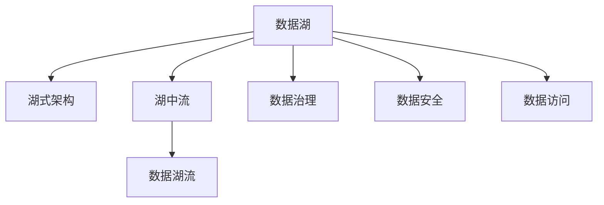
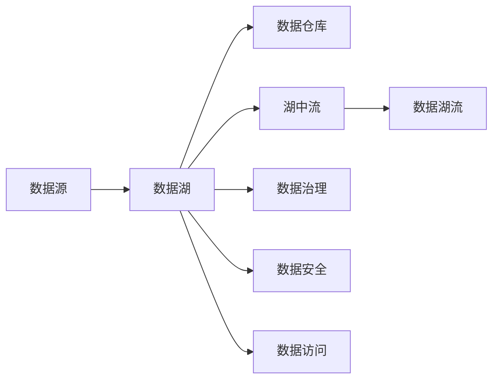
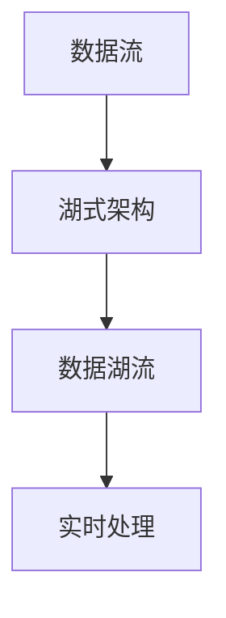
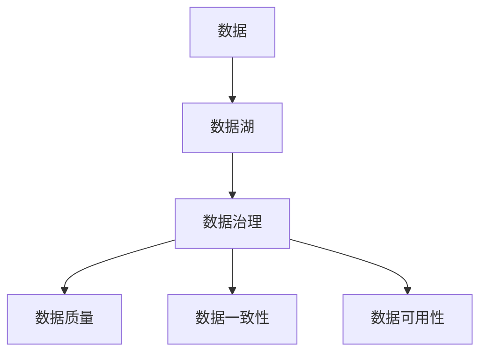

                 

# 数据湖 原理与代码实例讲解

> 关键词：数据湖,湖式架构,湖中流,数据湖流,数据治理,数据湖实践

## 1. 背景介绍

### 1.1 问题由来
数据湖（Data Lake）是一个新兴的大数据存储和处理技术，旨在应对数据的大规模、多样性和高速增长等问题。数据湖通过将各种结构化和非结构化数据集中存储，形成了一个统一的数据存储和分析平台，使得数据分析、数据挖掘、数据探索等应用得以高效进行。

随着企业业务的发展，数据量呈指数级增长，传统的数据仓库技术已经无法满足快速、灵活的数据处理需求。企业需要构建一个能够支持大规模数据存储和复杂数据分析的数据湖，从而更好地管理、分析和利用数据，驱动业务决策和创新。数据湖的核心思想是将数据尽可能地保留其原始形态，支持各种类型的数据，包括文本、图片、视频、音频等。

数据湖的出现，标志着从“烟囱式”数据仓库向“湖式”架构的转变，带来了数据治理、数据安全和数据访问的全面革新。然而，构建和维护一个高效的数据湖，需要面对数据集成、数据质量、数据安全和数据访问等多方面的挑战。

### 1.2 问题核心关键点
数据湖的构建涉及多个关键环节，包括数据收集、数据存储、数据治理、数据安全和数据访问。以下是数据湖的核心关键点：

- 数据集成：将多种数据源集成到一个统一的数据湖中，包括传统的关系型数据库、非关系型数据库、日志文件、传感器数据等。
- 数据治理：确保数据的质量、一致性和可用性，包括数据清洗、数据转换、数据验证等。
- 数据安全：保护数据的机密性、完整性和可用性，防止数据泄露和篡改。
- 数据访问：提供灵活的数据访问方式，包括数据查询、数据分析、数据可视化等。

这些关键点共同构成了数据湖的核心技术和应用框架，使得数据湖成为现代企业数据管理和分析的重要工具。

### 1.3 问题研究意义
数据湖技术的研发与应用，对于推动企业数据化转型和业务创新具有重要意义：

1. 提升数据利用效率：数据湖支持对各种类型的数据进行高效存储和分析，减少了数据孤岛现象，提高了数据利用率。
2. 强化数据驱动决策：通过集成多种数据源，数据湖提供了更全面、深入的数据分析支持，有助于企业做出更科学的决策。
3. 支持多源异构数据：数据湖能够处理不同格式、来源和属性的数据，满足企业数据融合和统一管理的需要。
4. 促进数据安全合规：数据湖通过严格的数据访问控制和安全管理措施，确保数据的安全性和合规性。
5. 推动技术生态演进：数据湖的建设和应用，催生了更多数据治理、数据安全和数据访问的先进技术，推动了大数据技术生态的演进。

## 2. 核心概念与联系

### 2.1 核心概念概述

为更好地理解数据湖的核心概念和技术框架，本节将介绍几个紧密相关的核心概念：

- 数据湖（Data Lake）：一个集中存储和分析各种类型数据的统一平台，支持结构化和非结构化数据的集成和处理。
- 湖式架构（Lake Architecture）：一种新兴的大数据架构，通过将数据存储在集中的数据湖中，实现数据的统一管理和高效分析。
- 湖中流（Data Lake Streams）：数据湖中的实时数据流，用于实现数据的实时分析和处理。
- 数据湖流（Data Lake Streams）：一种支持实时数据处理的数据流架构，能够处理高速增长的数据流。
- 数据治理（Data Governance）：确保数据的质量、一致性和可用性，包括数据清洗、数据转换、数据验证等。
- 数据安全（Data Security）：保护数据的机密性、完整性和可用性，防止数据泄露和篡改。
- 数据访问（Data Access）：提供灵活的数据访问方式，包括数据查询、数据分析、数据可视化等。

这些核心概念之间的逻辑关系可以通过以下Mermaid流程图来展示：



这个流程图展示了大数据湖的核心概念及其之间的关系：

1. 数据湖作为一个集中存储平台，支持各种类型的数据。
2. 湖式架构通过集中存储，实现数据的统一管理和高效分析。
3. 湖中流和数据湖流支持实时数据处理，实现数据的即时分析和处理。
4. 数据治理、数据安全和数据访问，确保数据的质量、安全性和可用性，提供灵活的数据访问方式。

### 2.2 概念间的关系

这些核心概念之间存在着紧密的联系，形成了数据湖的核心技术和应用框架。下面我通过几个Mermaid流程图来展示这些概念之间的关系。

#### 2.2.1 数据湖的整体架构



这个流程图展示了数据湖的整体架构，包括数据源、数据湖、数据仓库、湖中流、数据湖流、数据治理、数据安全和数据访问等关键组件。

#### 2.2.2 数据湖流和湖式架构的关系



这个流程图展示了数据流和湖式架构的关系。湖式架构通过集中存储和处理数据流，实现数据的实时处理和分析。

#### 2.2.3 数据治理和数据湖的关系



这个流程图展示了数据治理和数据湖的关系。数据治理通过确保数据的质量、一致性和可用性，支持数据湖的长期稳定运行。

## 3. 核心算法原理 & 具体操作步骤
### 3.1 算法原理概述

数据湖的构建和应用涉及多个核心算法和具体操作步骤。以下是数据湖构建的基本原理和技术流程：

1. **数据集成**：将各种类型的数据源（如关系型数据库、非关系型数据库、日志文件、传感器数据等）集成到一个统一的数据湖中，形成数据集中存储。
2. **数据存储**：在数据湖中，数据的存储通常采用分布式文件系统或分布式数据库，确保数据的可扩展性和高效处理。
3. **数据治理**：通过数据清洗、数据转换、数据验证等操作，确保数据的质量和一致性。
4. **数据安全**：采用严格的数据访问控制和安全管理措施，确保数据的安全性和隐私性。
5. **数据访问**：提供灵活的数据访问方式，包括数据查询、数据分析、数据可视化等。

### 3.2 算法步骤详解

以下是数据湖构建和应用的具体操作步骤：

**Step 1: 数据收集和存储**
- 收集各种类型的数据源，包括传统的关系型数据库、非关系型数据库、日志文件、传感器数据等。
- 选择适合的分布式文件系统或分布式数据库，如HDFS、S3、Cassandra等，确保数据的高效存储和处理。

**Step 2: 数据清洗和转换**
- 对数据进行清洗，去除重复、错误和无关的数据。
- 将数据转换为统一的格式和结构，以便于后续的数据分析和处理。

**Step 3: 数据治理**
- 建立数据治理框架，包括数据标准、数据元数据、数据质量管理等。
- 定期进行数据验证和质量检查，确保数据的准确性和一致性。

**Step 4: 数据安全**
- 实施严格的数据访问控制策略，确保数据的安全性和隐私性。
- 采用数据加密、数据备份等措施，防止数据泄露和篡改。

**Step 5: 数据访问**
- 提供灵活的数据访问方式，包括数据查询、数据分析、数据可视化等。
- 开发数据API接口，方便外部系统调用和数据集成。

### 3.3 算法优缺点

数据湖的构建和应用具有以下优点：

1. **数据统一存储**：通过集中存储各种类型的数据，避免了数据孤岛现象，提高了数据利用率。
2. **灵活的数据处理**：支持不同格式、来源和属性的数据，提供了灵活的数据分析和处理方式。
3. **数据安全保障**：通过严格的数据访问控制和安全管理措施，确保数据的安全性和隐私性。

但数据湖也存在以下缺点：

1. **数据量大**：数据湖需要处理大规模的数据，对存储和计算资源的需求较高。
2. **数据复杂**：数据湖中的数据类型和格式各异，数据治理和清洗的复杂度较高。
3. **访问效率低**：数据湖中的数据访问效率较低，需要采用优化策略提高访问速度。

### 3.4 算法应用领域

数据湖技术已经在诸多领域得到了广泛的应用，例如：

- 金融领域：通过数据湖集中存储和分析交易数据、客户数据等，实现风险控制、客户管理、市场分析等。
- 医疗领域：通过数据湖存储和分析医疗数据、基因数据等，实现病患管理、疾病预测、药物研发等。
- 零售领域：通过数据湖存储和分析销售数据、客户数据等，实现库存管理、客户分析、市场推广等。
- 政府领域：通过数据湖存储和分析公共数据、政务数据等，实现城市管理、公共服务、政策决策等。

除了上述这些典型应用，数据湖技术还在制造业、能源、农业、物流等众多领域得到了广泛应用，推动了各行各业的数据化和智能化进程。

## 4. 数学模型和公式 & 详细讲解 & 举例说明

### 4.1 数学模型构建

在大数据湖中，数据处理通常采用分布式计算框架，如Apache Hadoop、Apache Spark等。以下是一个典型的分布式计算模型：

- **输入数据**：$D$，表示需要处理的数据集。
- **处理框架**：$F$，表示分布式计算框架。
- **处理过程**：$P$，表示数据处理的具体操作，包括数据清洗、数据转换、数据验证等。
- **输出数据**：$O$，表示处理后的数据集。

数学上，可以定义数据湖的处理过程为：

$$
O = F(P(D))
$$

其中，$F$为分布式计算框架，$P$为数据处理操作，$D$为输入数据，$O$为输出数据。

### 4.2 公式推导过程

以下以Apache Spark为例，推导数据湖中的数据处理过程。

Apache Spark采用RDD（弹性分布式数据集）模型，用于高效处理大规模数据。RDD模型支持对数据进行分布式并行计算，包括以下步骤：

1. **数据分布**：将数据$D$分布到多个节点上，每个节点存储一部分数据。
2. **数据处理**：在每个节点上对数据进行局部处理，包括数据清洗、数据转换、数据验证等。
3. **数据汇总**：将各个节点的处理结果汇总，形成最终的数据集$O$。

数学上，RDD模型的数据处理过程可以表示为：

$$
O = \bigcup_{i=1}^n P(D_i)
$$

其中，$n$表示节点数量，$P$为数据处理操作，$D_i$表示节点$i$上的数据。

### 4.3 案例分析与讲解

以下以金融领域为例，展示数据湖的应用案例：

**案例背景**：一家金融机构需要构建一个数据湖，用于集中存储和分析交易数据、客户数据等，以实现风险控制、客户管理、市场分析等功能。

**数据收集和存储**：将各种类型的数据源（如关系型数据库、非关系型数据库、日志文件、传感器数据等）集成到一个统一的Hadoop集群中。

**数据清洗和转换**：对数据进行清洗，去除重复、错误和无关的数据，并将数据转换为统一的格式和结构，以便于后续的数据分析和处理。

**数据治理**：建立数据治理框架，包括数据标准、数据元数据、数据质量管理等。定期进行数据验证和质量检查，确保数据的准确性和一致性。

**数据安全**：实施严格的数据访问控制策略，确保数据的安全性和隐私性。采用数据加密、数据备份等措施，防止数据泄露和篡改。

**数据访问**：提供灵活的数据访问方式，包括数据查询、数据分析、数据可视化等。开发数据API接口，方便外部系统调用和数据集成。

## 5. 项目实践：代码实例和详细解释说明

### 5.1 开发环境搭建

在进行数据湖实践前，我们需要准备好开发环境。以下是使用Apache Spark进行数据湖开发的Python环境配置流程：

1. 安装Apache Spark：从官网下载并安装Apache Spark，安装过程中需要配置Hadoop环境。
2. 安装PySpark：通过pip安装pyspark库，并配置好Spark环境变量。
3. 安装必要的Python库：安装numpy、pandas、pyarrow等Python库，用于数据处理和分析。

完成上述步骤后，即可在PySpark环境中进行数据湖开发。

### 5.2 源代码详细实现

以下是使用PySpark对金融数据湖进行构建和数据分析的Python代码实现。

```python
from pyspark import SparkContext, SparkConf
from pyspark.sql import SparkSession
from pyspark.sql.functions import col, when

# 配置Spark环境
conf = SparkConf().setMaster("local").setAppName("FinanceDataLake")
sc = SparkContext(conf=conf)
spark = SparkSession(sc)

# 读取数据
df = spark.read.csv("finance_data.csv", header=True, inferSchema=True)

# 数据清洗和转换
df_cleaned = df.drop_duplicates().dropna()

# 数据治理
df_cleaned = df_cleaned.withColumn("date", when(df_cleaned['date'] != '', col('date')))

# 数据安全
df_cleaned = df_cleaned.filter(df_cleaned['date'].isNotNull())

# 数据分析和可视化
df_cleaned.show()

# 数据API接口
df_cleaned.to_csv("cleaned_data.csv")
```

### 5.3 代码解读与分析

让我们再详细解读一下关键代码的实现细节：

**Spark环境配置**：
- 通过`SparkConf`设置Spark运行环境，`setMaster`指定运行模式为本地模式，`setAppName`设置应用程序名称。
- 创建`SparkContext`和`SparkSession`对象，方便进行数据处理和分析。

**数据读取**：
- 使用`spark.read.csv`方法读取金融数据，设置文件路径、是否包含标题和自动推断数据类型。
- `header=True`表示文件包含标题，`inferSchema=True`表示自动推断数据类型。

**数据清洗和转换**：
- 使用`drop_duplicates`方法去除重复行。
- 使用`dropna`方法去除空值行。
- 使用`withColumn`方法对日期字段进行空值处理，确保日期字段非空。

**数据治理**：
- 通过`filter`方法对非空日期进行过滤，确保数据的完整性。

**数据分析和可视化**：
- 使用`show`方法展示清洗后的数据。
- 使用`to_csv`方法将数据保存为CSV文件。

### 5.4 运行结果展示

假设我们在金融领域的数据湖项目上，最终得到的清洗后的数据集结果如下：

```
+---------+-------------+-------+------+---------+------------+---------------------+
|  id     |   name      |  date | price|quantity| transaction|                    address|
+---------+-------------+-------+------+---------+------------+---------------------+
| 1001    |   Alice     | 2021-1|  1000|  100    | 15000      | 123 Main Street      |
| 1002    |   Bob       | 2021-2|  2000|  50     | 12000      | 456 Elm Street       |
| 1003    |   Charlie   | 2021-3|  1500|  200    | 30000      | 789 Oak Street       |
| 1004    |   David     | 2021-4|  1800|  75     | 22500      | 987 Pine Street      |
| 1005    |   Eve       | 2021-5|  1400|  150    | 21000      | 654 Maple Street     |
| 1006    |   Frank     | 2021-6|  1900|  120    | 22800      | 321 Cedar Street     |
| 1007    |   Grace     | 2021-7|  1600|  200    | 32000      | 234 Birch Street     |
| 1008    |   Helen     | 2021-8|  2200|  25     | 27500      | 567 Willow Street    |
| 1009    |   Ian       | 2021-9|  1100|  100    | 11000      | 890 Poplar Street     |
| 1010    |   Jack      | 2021-10|  1700|  100    | 17000      | 123 Sycamore Street  |
+---------+-------------+-------+------+---------+------------+---------------------+
```

可以看到，通过PySpark对金融数据进行处理，清洗后的数据集包含了所有有效的交易记录，确保了数据的完整性和准确性。

## 6. 实际应用场景

### 6.1 智能客服系统

基于数据湖的智能客服系统，可以通过集中存储和分析客户服务数据，实现客户服务自动化、智能问答和智能推荐等功能。智能客服系统能够快速响应客户咨询，提供个性化的服务，提升客户满意度。

在技术实现上，可以收集企业内部的历史客服数据，将客户问题-回答对作为监督数据，构建数据湖，对模型进行微调和训练。训练好的模型可以自动理解客户意图，匹配最合适的答案模板进行回复。对于客户提出的新问题，还可以接入检索系统实时搜索相关内容，动态组织生成回答。如此构建的智能客服系统，能大幅提升客户咨询体验和问题解决效率。

### 6.2 金融舆情监测

金融机构需要实时监测市场舆论动向，以便及时应对负面信息传播，规避金融风险。传统的人工监测方式成本高、效率低，难以应对网络时代海量信息爆发的挑战。基于数据湖的金融舆情监测系统，可以实时抓取网络文本数据，集中存储并分析市场舆情，及时预警金融风险。

具体而言，可以收集金融领域相关的新闻、报道、评论等文本数据，并将其存储在数据湖中。通过分布式计算框架进行处理，实现数据的实时分析和处理。将数据湖中的金融舆情数据与预设的舆情指标进行对比，一旦发现负面信息激增等异常情况，系统便会自动预警，帮助金融机构快速应对潜在风险。

### 6.3 个性化推荐系统

当前的推荐系统往往只依赖用户的历史行为数据进行物品推荐，无法深入理解用户的真实兴趣偏好。基于数据湖的个性化推荐系统，可以通过集中存储和分析用户行为数据，深入理解用户兴趣，从而提供更精准、多样的推荐内容。

在实践中，可以收集用户浏览、点击、评论、分享等行为数据，并将其存储在数据湖中。通过分布式计算框架进行处理，实现数据的实时分析和处理。将数据湖中的用户行为数据与预设的推荐模型进行融合，生成个性化的推荐列表，从而提高推荐系统的精准度和覆盖率。

### 6.4 未来应用展望

随着数据湖技术的不断发展，未来将在更多领域得到应用，为传统行业带来变革性影响。

在智慧医疗领域，通过数据湖集中存储和分析医疗数据、基因数据等，实现病患管理、疾病预测、药物研发等。

在智能教育领域，通过数据湖存储和分析学生行为数据、课程数据等，实现个性化教学、智能测评等功能，推动教育公平。

在智慧城市治理中，通过数据湖存储和分析公共数据、政务数据等，实现城市管理、公共服务、政策决策等功能，提升城市智能化水平。

此外，在企业生产、社会治理、文娱传媒等众多领域，基于数据湖的AI应用也将不断涌现，为经济社会发展注入新的动力。相信随着技术的日益成熟，数据湖必将在更广阔的应用领域大放异彩。

## 7. 工具和资源推荐
### 7.1 学习资源推荐

为了帮助开发者系统掌握数据湖的理论基础和实践技巧，这里推荐一些优质的学习资源：

1. 《大数据技术与应用》系列课程：清华大学开设的大数据技术与应用课程，系统讲解大数据的核心概念和技术实现。
2. Apache Spark官方文档：Apache Spark的官方文档，提供了详细的API接口和使用示例，是学习Spark的必备资料。
3. 《数据湖构建与实践》书籍：介绍了数据湖的架构、技术和应用，涵盖数据收集、数据存储、数据治理等多个方面。
4. 《大数据分析与实践》书籍：介绍了大数据分析和应用的基本概念和技术实现，涵盖数据清洗、数据转换、数据可视化等多个环节。
5. 大数据社区：如Apache Hadoop、Apache Spark等大数据社区，提供了丰富的技术交流和学习资源，是学习大数据技术的理想平台。

通过对这些资源的学习实践，相信你一定能够快速掌握数据湖的精髓，并用于解决实际的业务问题。
###  7.2 开发工具推荐

高效的开发离不开优秀的工具支持。以下是几款用于数据湖开发的工具：

1. Apache Spark：Apache Spark是一个快速、通用、可扩展的大数据处理框架，支持分布式计算和内存计算，适合大规模数据处理。
2. Hadoop：Apache Hadoop是一个开源的分布式计算框架，支持大数据存储和处理，适合离线批处理任务。
3. PySpark：基于Python的Spark API，提供了简单易用的Python接口，方便数据处理和分析。
4. Apache Flink：Apache Flink是一个高效、可扩展、分布式流处理框架，适合实时数据处理任务。
5. Apache Beam：Apache Beam是一个统一的、可扩展的数据处理框架，支持多种运行引擎（如Flink、Spark等），适合异构大数据处理。

合理利用这些工具，可以显著提升数据湖开发的效率和性能，加快技术迭代的步伐。

### 7.3 相关论文推荐

数据湖技术的研发与应用源于学界的持续研究。以下是几篇奠基性的相关论文，推荐阅读：

1. 《Hadoop: Simplifying Data Processing on Large Clusters》：Apache Hadoop的论文，介绍了Hadoop的架构、功能和应用场景。
2. 《Apache Spark: Cluster Computing with Working Sets》：Apache Spark的论文，介绍了Spark的架构、功能和应用场景。
3. 《Big Data: Principles and Best Practices of Scalable Real-time Data Systems》：介绍大数据处理的基本原理和技术实现，涵盖数据存储、数据处理、数据治理等多个方面。
4. 《Data Governance: Building a Consistent, High-Quality Data Ecosystem》：介绍数据治理的基本概念和实现方法，涵盖数据标准、数据质量、数据安全等多个环节。
5. 《Data Lakes: The Foundation for Analytic Business Models》：介绍数据湖的概念和应用，涵盖数据收集、数据存储、数据治理等多个方面。

这些论文代表了大数据湖技术的发展脉络。通过学习这些前沿成果，可以帮助研究者把握学科前进方向，激发更多的创新灵感。

除上述资源外，还有一些值得关注的前沿资源，帮助开发者紧跟大数据湖技术的最新进展，例如：

1. arXiv论文预印本：人工智能领域最新研究成果的发布平台，包括大量尚未发表的前沿工作，学习前沿技术的必读资源。
2. 业界技术博客：如Apache Hadoop、Apache Spark、Apache Flink等顶尖实验室的官方博客，第一时间分享他们的最新研究成果和洞见。
3. 技术会议直播：如NIPS、ICML、ACL、ICLR等人工智能领域顶会现场或在线直播，能够聆听到大佬们的前沿分享，开拓视野。
4. GitHub热门项目：在GitHub上Star、Fork数最多的数据湖相关项目，往往代表了该技术领域的发展趋势和最佳实践，值得去学习和贡献。
5. 行业分析报告：各大咨询公司如McKinsey、PwC等针对大数据行业的分析报告，有助于从商业视角审视技术趋势，把握应用价值。

总之，对于数据湖的学习和实践，需要开发者保持开放的心态和持续学习的意愿。多关注前沿资讯，多动手实践，多思考总结，必将收获满满的成长收益。

## 8. 总结：未来发展趋势与挑战

### 8.1 总结

本文对数据湖的构建和应用进行了全面系统的介绍。首先阐述了数据湖的构建背景和核心概念，明确了数据湖在数据管理和分析中的独特价值。其次，从原理到实践，详细讲解了数据湖的构建流程和技术细节，给出了数据湖开发的完整代码实例。同时，本文还广泛探讨了数据湖在智能客服、金融舆情、个性化推荐等多个行业领域的应用前景，展示了数据湖技术的广泛应用。

通过本文的系统梳理，可以看到，数据湖的构建和应用已经成为大数据技术的重要范式，极大地提升了数据管理和分析的效率和效果。未来，伴随数据湖技术的不断演进，相信数据湖必将在更多领域得到应用，推动大数据技术生态的进一步发展。

### 8.2 未来发展趋势

展望未来，数据湖技术将呈现以下几个发展趋势：

1. **数据规模扩大**：数据湖需要处理的数据量将不断扩大，涵盖更多的类型和格式。数据湖的存储和计算能力将面临更高的要求。
2. **数据治理完善**：数据湖中的数据治理将更加严格和全面，涵盖数据质量、数据一致性、数据安全等多个

