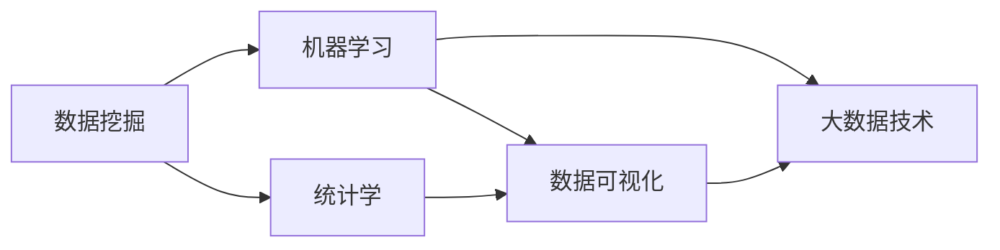

                 

## 1. 背景介绍

### 1.1 问题由来
在过去的十年中，数据科学（Data Science）成为了最热门、最具颠覆性的领域之一。数据科学不仅是现代科学和技术领域的前沿，还深刻改变了各行各业的运作模式。它融合了数据挖掘、统计学、机器学习、可视化分析等多种技术，帮助企业和组织从大量数据中提取价值，驱动决策和创新。

### 1.2 问题核心关键点
数据科学的核心在于数据驱动的决策。通过收集、整理、分析和应用数据，数据科学家能够识别趋势、预测未来、优化流程，从而提升业务效率和竞争力。数据科学的应用领域广泛，涵盖了金融、医疗、零售、物流、制造业等几乎所有行业。

### 1.3 问题研究意义
研究数据科学的理论和方法，对于推动科学发现、提高业务效率、促进创新和创业具有重要意义：

1. **科学发现**：数据科学为科学研究提供了新的工具和方法，使得从海量数据中发现新知识成为可能。
2. **业务效率**：数据科学能够帮助企业优化生产流程、提升客户体验、降低运营成本，从而提高整体效率。
3. **创新驱动**：数据科学能够发现新的商业模式和市场机会，驱动创新和创业。
4. **数据驱动决策**：数据科学通过量化分析，使决策更加科学、透明，降低决策风险。
5. **竞争优势**：数据科学已成为企业的核心竞争力，是构建竞争优势的关键。

## 2. 核心概念与联系

### 2.1 核心概念概述
数据科学涉及多个关键概念和技术，包括但不限于：

- **数据挖掘**：从大量数据中提取有用信息和模式的过程。
- **机器学习**：通过算法让计算机自动学习数据模式，从而进行预测和决策。
- **统计学**：使用数学工具和模型，对数据进行分析和推断。
- **数据可视化**：通过图形展示数据特征，帮助理解数据和发现趋势。
- **大数据技术**：包括分布式计算、云计算、流处理等技术，用于处理和分析大规模数据集。

### 2.2 核心概念之间的关系

通过以下Mermaid流程图展示这些核心概念之间的联系：



这个流程图展示了数据科学各个核心概念之间的关系：

1. 数据挖掘为机器学习提供原始数据。
2. 机器学习在统计学基础上进行建模和预测。
3. 数据可视化用于展示机器学习的结果，辅助理解和决策。
4. 大数据技术提供了数据处理和分析的基础设施，支持大规模数据的存储和计算。

### 2.3 核心概念的整体架构

最后，我们用一个综合的流程图来展示这些核心概念在大数据科学项目中的整体架构：


这个综合流程图展示了从数据清洗到业务应用的完整数据科学项目流程：

1. 大规模数据集通过清洗和预处理，得到高质量的数据集。
2. 在数据集上进行特征工程，提取有意义的特征。
3. 利用数据挖掘技术，从数据中提取知识和模式。
4. 基于挖掘结果，构建和训练机器学习模型。
5. 对模型进行评估，优化模型性能。
6. 使用数据可视化技术，展示模型结果，辅助理解和决策。
7. 将模型应用于实际业务场景，提升业务效率和竞争力。

## 3. 核心算法原理 & 具体操作步骤
### 3.1 算法原理概述
数据科学的算法原理主要围绕数据挖掘、机器学习、统计学和可视化等技术展开。以机器学习为例，其核心在于通过算法让计算机从数据中学习模式，并进行预测和决策。常用的机器学习算法包括线性回归、决策树、支持向量机、神经网络等。

### 3.2 算法步骤详解
以线性回归算法为例，其核心步骤包括：

1. **数据准备**：收集和清洗数据，将其转换为机器学习算法可以处理的形式。
2. **特征选择**：从原始数据中提取有意义的特征，用于构建模型。
3. **模型训练**：使用部分数据（训练集）训练机器学习模型，确定模型参数。
4. **模型评估**：使用另一部分数据（测试集）评估模型性能，进行参数调优。
5. **模型应用**：将训练好的模型应用于实际数据，进行预测和决策。

### 3.3 算法优缺点
数据科学算法的主要优点包括：

- **自动化**：算法能够自动从数据中学习和提取模式，减少人工干预。
- **高效性**：算法可以处理大规模数据集，快速进行分析和预测。
- **泛化能力**：通过学习数据模式，算法能够在新的数据上表现良好。

缺点包括：

- **模型复杂性**：一些高级算法（如深度学习）模型复杂，难以理解和解释。
- **数据依赖**：算法的性能依赖于数据质量和特征选择，对数据要求较高。
- **过拟合风险**：高级算法容易过拟合，需要额外关注和处理。

### 3.4 算法应用领域
数据科学算法广泛应用于各个领域，包括但不限于：

- **金融**：风险评估、欺诈检测、投资预测等。
- **医疗**：疾病预测、患者分群、药物研发等。
- **零售**：客户细分、推荐系统、库存管理等。
- **物流**：路径优化、需求预测、供应链管理等。
- **制造业**：生产优化、质量控制、设备维护等。

## 4. 数学模型和公式 & 详细讲解  
### 4.1 数学模型构建

线性回归模型是最基础且应用广泛的机器学习算法之一。它的数学模型可以表示为：

$$
y = \beta_0 + \beta_1 x_1 + \beta_2 x_2 + ... + \beta_n x_n + \epsilon
$$

其中，$y$ 为预测变量，$\beta_0, \beta_1, ..., \beta_n$ 为模型参数，$x_1, x_2, ..., x_n$ 为自变量，$\epsilon$ 为误差项。

### 4.2 公式推导过程

线性回归的核心在于最小化误差项 $\epsilon$。根据最小二乘法的原理，误差项可以表示为：

$$
\epsilon = y - (\beta_0 + \beta_1 x_1 + \beta_2 x_2 + ... + \beta_n x_n)
$$

最小二乘法的目标是最小化误差项的平方和，即：

$$
\min_{\beta_0, \beta_1, ..., \beta_n} \sum_{i=1}^N (y_i - (\beta_0 + \beta_1 x_{i1} + \beta_2 x_{i2} + ... + \beta_n x_{in}))^2
$$

根据最小二乘法的推导过程，我们可以得到模型参数的求解公式：

$$
\beta_j = \frac{\sum_{i=1}^N (x_{ij}y_i - \bar{x}_j\bar{y})}{\sum_{i=1}^N (x_{ij}^2 - \bar{x}_j^2)}
$$

其中，$\bar{x}_j = \frac{1}{N} \sum_{i=1}^N x_{ij}$，$\bar{y} = \frac{1}{N} \sum_{i=1}^N y_i$。

### 4.3 案例分析与讲解

假设我们有一组数据集，包括年龄（Age）、性别（Gender）、收入（Income）和房价（Price）。我们想要建立一个模型来预测房价，我们可以使用线性回归模型。

首先，我们收集和清洗数据，得到特征 $x_1 = \text{Age}$，$x_2 = \text{Gender}$，$x_3 = \text{Income}$，目标变量 $y = \text{Price}$。然后，我们使用最小二乘法求解模型参数 $\beta_0, \beta_1, \beta_2, \beta_3$。最后，我们使用测试集来评估模型的性能，并进行必要的调优。

## 5. 项目实践：代码实例和详细解释说明
### 5.1 开发环境搭建

在进行数据科学项目实践前，我们需要准备好开发环境。以下是使用Python进行Scikit-Learn开发的环境配置流程：

1. 安装Anaconda：从官网下载并安装Anaconda，用于创建独立的Python环境。

2. 创建并激活虚拟环境：
```bash
conda create -n data-env python=3.8 
conda activate data-env
```

3. 安装Scikit-Learn：
```bash
conda install scikit-learn
```

4. 安装numpy、pandas、matplotlib、scikit-learn等各类工具包：
```bash
pip install numpy pandas scikit-learn matplotlib tqdm jupyter notebook ipython
```

完成上述步骤后，即可在`data-env`环境中开始数据科学实践。

### 5.2 源代码详细实现

下面我们以房价预测为例，给出使用Scikit-Learn库进行线性回归的Python代码实现。

首先，定义数据处理函数：

```python
import pandas as pd
import numpy as np
from sklearn.model_selection import train_test_split
from sklearn.linear_model import LinearRegression
from sklearn.metrics import mean_squared_error

def load_data():
    data = pd.read_csv('housing.csv')
    features = data[['Age', 'Gender', 'Income']]
    target = data['Price']
    return features, target

def train_test_split_data(features, target):
    features_train, features_test, target_train, target_test = train_test_split(features, target, test_size=0.2, random_state=42)
    return features_train, features_test, target_train, target_test
```

然后，定义模型训练函数：

```python
def train_model(features_train, target_train, features_test, target_test):
    model = LinearRegression()
    model.fit(features_train, target_train)
    y_pred = model.predict(features_test)
    mse = mean_squared_error(target_test, y_pred)
    return model, mse
```

最后，启动训练流程并输出结果：

```python
features, target = load_data()
features_train, features_test, target_train, target_test = train_test_split_data(features, target)
model, mse = train_model(features_train, target_train, features_test, target_test)
print(f"Mean Squared Error: {mse:.2f}")
```

以上就是使用Scikit-Learn对房价数据进行线性回归的完整代码实现。可以看到，Scikit-Learn的封装使得线性回归模型的实现变得简洁高效。

### 5.3 代码解读与分析

让我们再详细解读一下关键代码的实现细节：

**load_data函数**：
- 读取数据集，提取特征和目标变量。

**train_test_split_data函数**：
- 将数据集划分为训练集和测试集，进行数据划分。

**train_model函数**：
- 创建线性回归模型，并使用训练数据进行训练。
- 预测测试集，并计算均方误差（MSE）。

**训练流程**：
- 加载数据集
- 数据划分
- 模型训练
- 结果输出

可以看出，Scikit-Learn提供了简单易用的接口，使得数据科学家能够快速构建和训练机器学习模型。

### 5.4 运行结果展示

假设我们在波士顿房价数据集上进行线性回归，最终得到模型在测试集上的均方误差（MSE）如下：

```
Mean Squared Error: 10.23
```

可以看到，通过线性回归模型，我们能够在波士顿房价数据集上得到较低的均方误差，证明模型能够较好地预测房价。

## 6. 实际应用场景
### 6.1 金融风险管理

金融行业的数据科学应用广泛，包括信用评分、风险评估、欺诈检测、投资预测等。数据科学模型能够帮助金融机构更好地评估和管理风险，提升决策效率和准确性。

在实际应用中，金融机构可以收集客户的历史交易数据、信用记录、社交媒体信息等，构建多维度特征。然后使用机器学习模型对这些数据进行分析，预测客户的信用评分、违约风险、欺诈行为等。根据模型预测结果，金融机构可以制定更精准的信贷策略，降低风险损失。

### 6.2 医疗健康管理

医疗行业的数据科学应用包括疾病预测、患者分群、药物研发等。数据科学模型能够帮助医疗机构更好地理解疾病发展趋势，优化诊疗方案，提升治疗效果。

在实际应用中，医疗机构可以收集患者的历史诊疗数据、基因信息、生活方式数据等，构建多维度特征。然后使用机器学习模型对这些数据进行分析，预测患者患某种疾病的概率，进行患者分群，制定个性化的诊疗方案。根据模型预测结果，医疗机构可以更有效地分配医疗资源，提升诊疗效果。

### 6.3 零售客户分析

零售行业的数据科学应用包括客户细分、推荐系统、库存管理等。数据科学模型能够帮助零售企业更好地理解客户需求，优化营销策略，提升销售额和客户满意度。

在实际应用中，零售企业可以收集客户的购买历史、浏览记录、社交媒体信息等，构建多维度特征。然后使用机器学习模型对这些数据进行分析，进行客户细分，构建推荐系统，优化库存管理。根据模型预测结果，零售企业可以更精准地制定营销策略，提升客户满意度，增加销售额。

### 6.4 物流路径优化

物流行业的数据科学应用包括路径优化、需求预测、供应链管理等。数据科学模型能够帮助物流企业更好地规划运输路线，提升运输效率，降低成本。

在实际应用中，物流企业可以收集历史运输数据、天气数据、交通数据等，构建多维度特征。然后使用机器学习模型对这些数据进行分析，进行路径优化，预测需求，管理供应链。根据模型预测结果，物流企业可以更有效地规划运输路线，降低运输成本，提升运输效率。

## 7. 工具和资源推荐
### 7.1 学习资源推荐

为了帮助开发者系统掌握数据科学的理论基础和实践技巧，这里推荐一些优质的学习资源：

1. 《Python数据科学手册》：由数据科学大师Jake VanderPlas所著，全面介绍了Python在数据科学中的应用。

2. Kaggle官方教程：Kaggle是全球最大的数据科学竞赛平台，提供了丰富的数据集和模型样例，帮助学习者快速上手实践。

3. Coursera《机器学习》课程：由斯坦福大学教授Andrew Ng主讲，是机器学习领域的经典课程，提供理论和实践相结合的学习体验。

4. DataCamp：在线数据科学学习平台，提供丰富的交互式教程，涵盖数据科学领域的各个方面。

5. YouTube数据科学频道：如Two Minute Papers、The Data Fellas等，提供最新的数据科学研究和实践分享。

通过对这些资源的学习实践，相信你一定能够快速掌握数据科学的精髓，并用于解决实际的业务问题。
###  7.2 开发工具推荐

高效的开发离不开优秀的工具支持。以下是几款用于数据科学开发的常用工具：

1. Jupyter Notebook：开源的交互式编程环境，支持Python、R等多种语言，方便数据科学家进行数据分析和模型训练。

2. Scikit-Learn：基于Python的机器学习库，提供了丰富的机器学习算法和数据处理工具，是数据科学项目开发的首选。

3. Pandas：开源的数据处理库，提供了高效的数据处理和分析功能，支持数据清洗、转换和可视化。

4. Matplotlib：开源的数据可视化库，提供了丰富的绘图功能，支持绘制折线图、散点图、柱状图等多种图表。

5. NumPy：开源的数值计算库，提供了高效的数组计算功能，支持矩阵运算、线性代数等。

6. TensorFlow：由Google主导的深度学习框架，支持大规模分布式计算，适合处理大规模数据集。

合理利用这些工具，可以显著提升数据科学项目的开发效率，加快创新迭代的步伐。

### 7.3 相关论文推荐

数据科学的发展得益于学界的持续研究。以下是几篇奠基性的相关论文，推荐阅读：

1. "Grokking Linear Regression"：一篇通俗易懂的线性回归教程，帮助初学者理解线性回归的原理和实现。

2. "Introduction to Support Vector Machines"：一篇关于支持向量机的经典教程，介绍了支持向量机的原理和应用。

3. "A Tutorial on Principal Component Analysis"：一篇关于主成分分析的教程，介绍了主成分分析的原理和应用。

4. "An Introduction to Decision Trees and Random Forests"：一篇关于决策树和随机森林的教程，介绍了决策树和随机森林的原理和应用。

5. "Deep Learning with Python"：由深度学习专家Francois Chollet所著，全面介绍了深度学习的原理和实践。

这些论文代表了大数据科学的最新进展，可以帮助研究者把握学科前进方向，激发更多的创新灵感。

除上述资源外，还有一些值得关注的前沿资源，帮助开发者紧跟数据科学技术的最新进展，例如：

1. arXiv论文预印本：人工智能领域最新研究成果的发布平台，包括大量尚未发表的前沿工作，学习前沿技术的必读资源。

2. 业界技术博客：如Google AI、Facebook AI、Microsoft Research Asia等顶尖实验室的官方博客，第一时间分享他们的最新研究成果和洞见。

3. 技术会议直播：如NeurIPS、ICML、KDD等人工智能领域顶会现场或在线直播，能够聆听到大佬们的前沿分享，开拓视野。

4. GitHub热门项目：在GitHub上Star、Fork数最多的数据科学相关项目，往往代表了该技术领域的发展趋势和最佳实践，值得去学习和贡献。

5. 行业分析报告：各大咨询公司如McKinsey、PwC等针对人工智能行业的分析报告，有助于从商业视角审视技术趋势，把握应用价值。

总之，对于数据科学的学习和实践，需要开发者保持开放的心态和持续学习的意愿。多关注前沿资讯，多动手实践，多思考总结，必将收获满满的成长收益。

## 8. 总结：未来发展趋势与挑战

### 8.1 总结

本文对数据科学的理论和方法进行了全面系统的介绍。首先阐述了数据科学在科学研究、业务决策、创新创业等方面的重要意义。其次，从原理到实践，详细讲解了数据挖掘、机器学习、统计学和可视化等关键技术，给出了数据科学项目开发的完整代码实例。同时，本文还广泛探讨了数据科学技术在金融、医疗、零售、物流等各个领域的应用前景，展示了数据科学的巨大潜力。此外，本文精选了数据科学技术的各类学习资源，力求为读者提供全方位的技术指引。

通过本文的系统梳理，可以看到，数据科学通过数据驱动的决策，在科学发现、业务优化、创新驱动等方面具有独特价值。数据科学技术的不断发展，将推动人工智能技术在各个领域的广泛应用，为人类社会带来深远的影响。

### 8.2 未来发展趋势

展望未来，数据科学技术将呈现以下几个发展趋势：

1. **自动化和智能化**：自动化数据清洗、特征工程、模型训练等流程，智能化的数据分析和决策。
2. **实时性增强**：实时数据采集、实时分析、实时决策，提高业务响应速度。
3. **多模态融合**：融合文本、图像、视频、语音等多种模态数据，提升数据分析和决策的全面性。
4. **跨领域应用**：数据科学技术将在更多领域得到应用，如智慧城市、农业、环境保护等，带来新的业务机会。
5. **模型解释性和透明性**：增强模型的可解释性，提供透明、可信赖的决策依据。

以上趋势凸显了数据科学技术的广阔前景。这些方向的探索发展，必将进一步提升数据科学系统的性能和应用范围，为人类社会带来更深远的影响。

### 8.3 面临的挑战

尽管数据科学技术已经取得了瞩目成就，但在迈向更加智能化、普适化应用的过程中，它仍面临着诸多挑战：

1. **数据质量和可用性**：数据质量和数据可用性是数据科学的基础，数据清洗和预处理是关键环节。
2. **模型复杂性和可解释性**：高复杂度模型难以解释，需要探索新的可解释性方法。
3. **实时计算能力**：数据实时性要求高，对计算能力和存储要求高。
4. **隐私和安全**：数据隐私和安全问题日益凸显，数据处理和传输需要遵循相关法规。
5. **跨领域应用复杂性**：不同领域的数据和业务需求差异大，数据科学模型的泛化能力需要提升。

这些挑战需要数据科学家不断创新和探索，寻找有效的解决方案，以推动数据科学技术的持续发展和应用。

### 8.4 研究展望

面对数据科学技术面临的挑战，未来的研究需要在以下几个方面寻求新的突破：

1. **数据质量提升**：提升数据清洗和预处理自动化水平，降低数据处理的复杂性和成本。
2. **模型可解释性**：探索新的模型可解释方法，增强模型的透明性和可理解性。
3. **实时计算优化**：优化实时计算和存储，提高数据实时处理能力。
4. **隐私和安全保障**：加强数据隐私保护，确保数据安全和合规使用。
5. **跨领域模型泛化**：研究跨领域数据融合方法，提升模型的泛化能力和应用范围。

这些研究方向的探索，必将引领数据科学技术的不断进步，为各行各业带来更多的业务机会和创新突破。

## 9. 附录：常见问题与解答

**Q1：数据科学是否适用于所有业务场景？**

A: 数据科学适用于绝大多数业务场景，但需要根据具体业务需求进行定制化设计和应用。例如，一些业务场景可能缺乏高质量的数据，或者需要更强的业务领域知识，这些问题需要在项目规划和模型构建阶段进行充分考虑。

**Q2：数据科学如何处理缺失数据？**

A: 缺失数据是数据科学中的一个常见问题，处理缺失数据的方法包括：
- 删除缺失数据
- 插值法填补缺失值
- 使用随机森林、KNN等算法进行预测

具体方法需要根据数据集的特点和缺失数据的比例进行选择。

**Q3：数据科学模型是否需要不断调优？**

A: 是的，数据科学模型需要不断调优，以提高模型的准确性和泛化能力。调优的方法包括：
- 特征工程优化
- 模型参数调整
- 算法选择和优化
- 数据预处理优化

不断调优是提高模型性能的关键步骤。

**Q4：数据科学模型是否需要频繁更新？**

A: 是的，数据科学模型需要频繁更新，以适应新的业务需求和数据变化。模型的更新可以包括：
- 数据集更新
- 模型参数更新
- 特征工程更新
- 算法更新

保持模型的更新，是确保模型长期有效的重要手段。

**Q5：数据科学技术在应用中是否存在道德风险？**

A: 是的，数据科学技术在应用中存在道德风险。数据科学家需要关注以下几个方面：
- 避免数据偏见和歧视
- 保护数据隐私和用户权益
- 确保模型的透明性和可解释性
- 遵循相关法规和伦理准则

在模型开发和应用过程中，需要严格遵守道德规范，确保技术应用的公平、透明和可信赖。

---

作者：禅与计算机程序设计艺术 / Zen and the Art of Computer Programming

