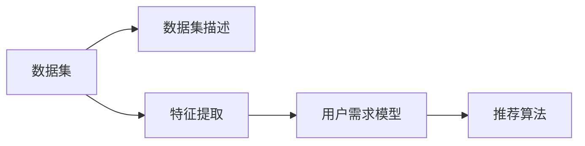
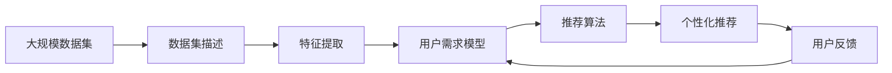

                 

# 数据集推荐:个性化数据集发现和管理

## 1. 背景介绍

### 1.1 问题由来

随着数据驱动的机器学习和人工智能技术的飞速发展，数据集在模型训练和应用过程中扮演了至关重要的角色。高质量的数据集不仅能够显著提升模型的性能，还能促进深度学习的创新和应用。然而，现有数据集的规模和种类不断增长，加上领域特定数据的稀缺性，使得数据集推荐变得尤为重要。数据集推荐不仅可以帮助研究人员和开发者快速获取适合他们需求的数据集，还能加速数据集的共享和重复利用，从而推动人工智能技术的进一步发展。

### 1.2 问题核心关键点

数据集推荐是一个涉及计算机视觉、自然语言处理、知识图谱等多个领域的复杂问题。主要研究如何高效地从大量数据集中发现与用户需求最为匹配的数据集。其核心关键点包括：

- 数据集描述与特征提取：如何有效地描述数据集并提取出有用的特征，是数据集推荐的基础。
- 用户需求模型：如何建立用户需求模型，准确地预测用户对数据集的偏好。
- 数据集推荐算法：如何设计推荐算法，能够高效地从大规模数据集中筛选出最合适的数据集。
- 推荐系统的评估与优化：如何评估推荐系统的性能，并进行持续优化。

### 1.3 问题研究意义

数据集推荐技术不仅对提高数据集利用率有重要意义，还能够促进跨领域的知识共享和合作，推动人工智能技术的普及和发展。具体来说，数据集推荐能够：

- **加速研究进展**：研究人员可以快速获取最适合自己研究需求的数据集，从而提高科研效率。
- **优化模型性能**：高质量的数据集能够显著提升模型的训练效果和性能。
- **促进知识共享**：通过数据集的共享和重复利用，可以促进跨领域的知识交流和合作。
- **推动产业发展**：数据集推荐技术的应用能够推动相关行业的数字化转型，提升产业效率和竞争力。

## 2. 核心概念与联系

### 2.1 核心概念概述

为更好地理解数据集推荐，我们首先介绍几个核心概念：

- **数据集**：由多个数据项（如图片、文本、音频等）组成，每个数据项通常包括一个或多个特征向量。
- **数据集描述**：用于描述数据集内容的文本信息，包括数据集的来源、类型、规模、质量等信息。
- **特征提取**：从原始数据集中提取有用的特征，用于描述数据集特性和进行推荐。
- **用户需求模型**：利用机器学习模型预测用户对数据集的偏好和需求，以指导数据集推荐。
- **推荐算法**：设计算法从数据集中推荐最适合用户需求的数据集。

### 2.2 概念间的关系

这些核心概念之间的联系可以通过以下Mermaid流程图来展示：



这个流程图展示了数据集推荐的基本流程：首先，从数据集中提取描述性信息，然后提取特征，建立用户需求模型，最后设计推荐算法，综合多方面信息进行数据集推荐。

### 2.3 核心概念的整体架构

我们再用一个综合的流程图来展示这些核心概念在大数据集推荐中的整体架构：



这个综合流程图展示了从大规模数据集描述开始，经过特征提取、用户需求模型建立和推荐算法设计，最终得到个性化推荐的过程。用户反馈也会不断优化用户需求模型，形成一个循环。

## 3. 核心算法原理 & 具体操作步骤
### 3.1 算法原理概述

数据集推荐本质上是一个信息检索和推荐系统的问题。其主要目标是针对用户特定的需求，从大规模数据集中筛选出最适合的数据集。常用的数据集推荐方法包括基于内容的推荐、协同过滤推荐和混合推荐。

基于内容的推荐方法主要是通过特征提取，计算数据集与用户需求的相似度。协同过滤推荐则是通过用户历史行为数据，利用相似度计算推荐数据集。混合推荐方法则是将基于内容和协同过滤的推荐方法进行结合，以提升推荐效果。

### 3.2 算法步骤详解

数据集推荐一般包括以下几个关键步骤：

**Step 1: 数据集描述与特征提取**

- 收集数据集的描述信息，如数据集名称、描述、来源、作者、发布时间等。
- 使用自然语言处理技术对描述信息进行文本挖掘，提取有用的特征。

**Step 2: 用户需求模型建立**

- 收集用户的历史行为数据，如浏览、下载、评价等。
- 使用机器学习算法建立用户需求模型，预测用户对不同数据集的偏好。

**Step 3: 推荐算法设计**

- 设计推荐算法，结合数据集特征和用户需求模型，计算推荐结果。
- 根据用户反馈对推荐算法进行优化，提升推荐效果。

**Step 4: 个性化推荐**

- 根据用户需求模型和推荐算法，生成个性化的数据集推荐列表。
- 根据用户反馈，不断优化推荐算法和用户需求模型。

### 3.3 算法优缺点

数据集推荐技术有以下优点：

- **高效性**：通过自动化推荐，可以快速获取适合用户需求的数据集，节省时间和成本。
- **精准性**：能够根据用户历史行为和偏好，提供高度个性化的数据集推荐。
- **可扩展性**：适用于大规模数据集的推荐，能够处理海量的数据集和用户需求。

然而，数据集推荐技术也存在一些局限性：

- **数据稀疏性**：用户的历史行为数据可能不够丰富，导致推荐精度下降。
- **多样性问题**：推荐算法可能陷入局部最优，只推荐与用户历史行为相似的数据集。
- **冷启动问题**：新用户或新数据集缺乏足够的历史数据，难以进行推荐。
- **数据质量问题**：数据集描述和特征提取的准确性直接影响推荐结果。

### 3.4 算法应用领域

数据集推荐技术广泛应用于以下领域：

- **科学研究**：提供适合特定研究领域的数据集，加速科学研究进展。
- **工程开发**：推荐适合特定项目需求的数据集，提升软件和系统的开发效率。
- **教育培训**：推荐适合特定课程或培训的数据集，优化学习效果。
- **商业智能**：推荐适合特定商业需求的数据集，提升商业决策的科学性。
- **娱乐与媒体**：推荐适合特定内容或活动的数据集，增强用户体验。

## 4. 数学模型和公式 & 详细讲解 & 举例说明

### 4.1 数学模型构建

在数据集推荐中，我们通常采用向量空间模型(VSM)来表示数据集和用户需求。

记数据集 $D$ 为 $d$ 维向量，用户需求 $U$ 为 $u$ 维向量。设数据集 $D$ 的特征向量为 $\mathbf{d} = [d_1, d_2, \dots, d_d]^T$，用户需求 $U$ 的特征向量为 $\mathbf{u} = [u_1, u_2, \dots, u_u]^T$。向量空间模型下，数据集 $D$ 和用户需求 $U$ 的相似度可以通过余弦相似度计算得到：

$$
sim(D, U) = \cos(\theta) = \frac{\mathbf{d} \cdot \mathbf{u}}{\|\mathbf{d}\|\|\mathbf{u}\|}
$$

其中 $\theta$ 为两个向量之间的夹角。

### 4.2 公式推导过程

在实际应用中，为了提升推荐效果，我们通常使用向量空间模型与协同过滤算法结合。具体推导如下：

1. 首先，将用户历史行为数据转换为用户需求向量 $U$。假设用户已经下载了数据集 $D_1, D_2, \dots, D_k$，那么用户需求向量 $U$ 可以表示为：

$$
U = \frac{1}{k}\sum_{i=1}^k \mathbf{d}_i \cdot w_i
$$

其中 $\mathbf{d}_i$ 为数据集 $D_i$ 的特征向量，$w_i$ 为数据集 $D_i$ 对用户需求的权重。

2. 然后，计算数据集 $D$ 与用户需求 $U$ 的相似度 $sim(D, U)$。将用户需求向量 $U$ 与数据集特征向量 $\mathbf{d}$ 进行内积运算，得到：

$$
\mathbf{d} \cdot \mathbf{U} = \mathbf{d} \cdot \left(\sum_{i=1}^k \mathbf{d}_i \cdot w_i\right)
$$

3. 最终，根据相似度计算数据集 $D$ 的推荐分数 $r(D)$：

$$
r(D) = \mathbf{d} \cdot \mathbf{U} / \|\mathbf{d}\| = \sum_{i=1}^k \frac{\mathbf{d} \cdot \mathbf{d}_i \cdot w_i}{\|\mathbf{d}\|}
$$

其中 $w_i$ 可以通过用户对数据集 $D_i$ 的评分来确定，也可以采用协同过滤方法进行估计。

### 4.3 案例分析与讲解

假设我们有一个研究机构，需要对特定的科学领域进行数据集推荐。首先，我们需要收集该领域内所有已发布的数据集的描述信息，并提取特征。然后，构建用户需求模型，预测研究人员对不同数据集的偏好。最后，设计推荐算法，根据用户需求和数据集特征，生成推荐列表。

## 5. 项目实践：代码实例和详细解释说明

### 5.1 开发环境搭建

在进行数据集推荐实践前，我们需要准备好开发环境。以下是使用Python进行PyTorch开发的环境配置流程：

1. 安装Anaconda：从官网下载并安装Anaconda，用于创建独立的Python环境。

2. 创建并激活虚拟环境：
```bash
conda create -n data-recommendation python=3.8 
conda activate data-recommendation
```

3. 安装PyTorch：根据CUDA版本，从官网获取对应的安装命令。例如：
```bash
conda install pytorch torchvision torchaudio cudatoolkit=11.1 -c pytorch -c conda-forge
```

4. 安装TensorFlow：
```bash
pip install tensorflow
```

5. 安装各类工具包：
```bash
pip install numpy pandas scikit-learn matplotlib tqdm jupyter notebook ipython
```

完成上述步骤后，即可在`data-recommendation`环境中开始数据集推荐实践。

### 5.2 源代码详细实现

下面是使用TensorFlow进行数据集推荐的一个简单示例，演示如何收集数据集描述信息、提取特征、构建用户需求模型和设计推荐算法。

首先，定义数据集描述和特征提取函数：

```python
import tensorflow as tf
from tensorflow.keras.preprocessing.text import Tokenizer
from tensorflow.keras.preprocessing.sequence import pad_sequences

def load_dataset(file_path):
    with open(file_path, 'r') as f:
        lines = f.readlines()
    return lines

def extract_features(description):
    tokenizer = Tokenizer(num_words=1000)
    tokenizer.fit_on_texts(description)
    sequences = tokenizer.texts_to_sequences(description)
    padded_sequences = pad_sequences(sequences, padding='post')
    return padded_sequences

dataset = load_dataset('data/dataset.csv')
descriptions = [line.split(',')

```

