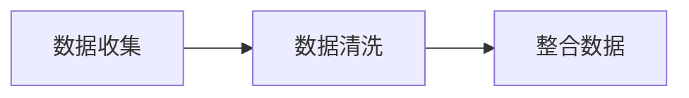
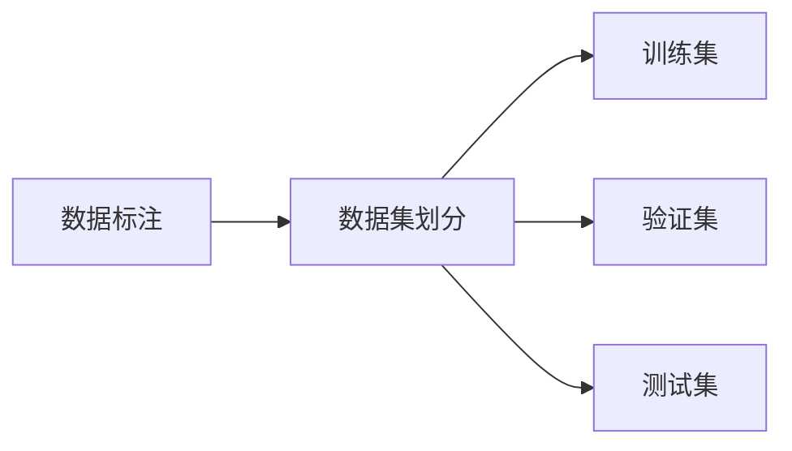
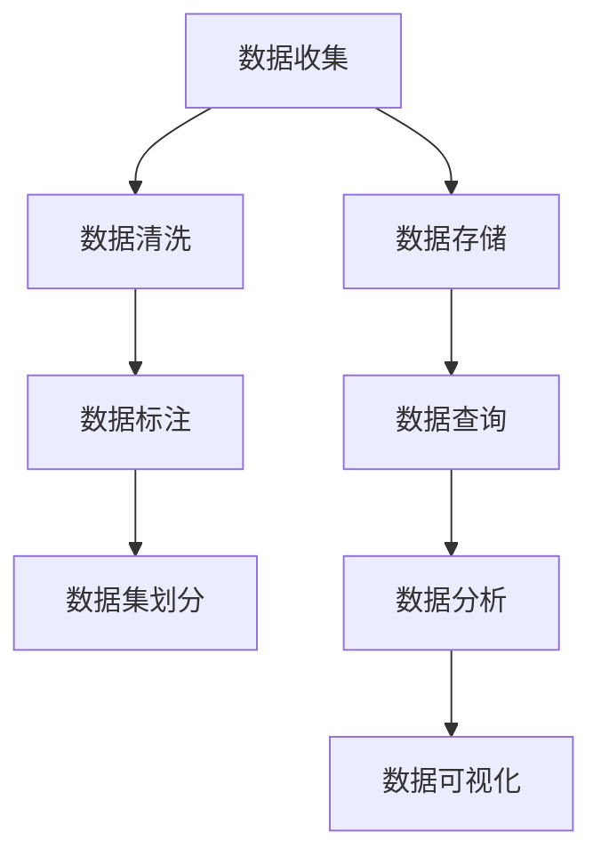
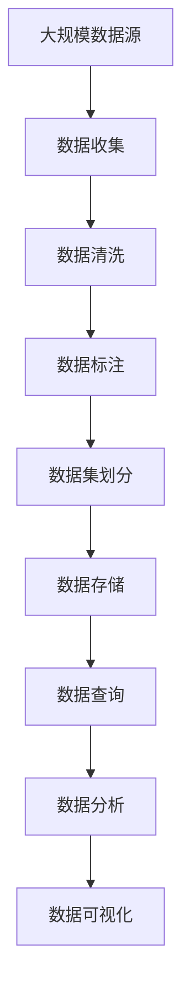

                 

# 数据集积累、清洗和标注：软件2.0工程师的日常

在软件2.0时代，数据集积累、清洗和标注是每一位工程师日常工作中必不可少的一环。无论是模型训练、算法优化还是产品迭代，都离不开高质量的数据支持。本文将深入探讨数据集积累、清洗和标注的关键原理与操作步骤，通过数学模型和公式的详细讲解，并结合实际项目实践，为读者提供全面、专业的指导。

## 1. 背景介绍

### 1.1 问题由来

随着人工智能技术的飞速发展，越来越多的企业和组织开始依赖数据驱动的方法来解决复杂的问题。然而，高质量数据集的准备与维护往往是一个耗时且成本高昂的过程。尤其在机器学习模型的训练过程中，数据集的质量直接影响了模型的效果和性能。因此，数据集积累、清洗和标注成为了软件2.0工程师不可或缺的技能。

### 1.2 问题核心关键点

数据集积累、清洗和标注的核心关键点包括：
- 数据的收集与整合：从不同来源获取多样化的数据，并整合到一个统一的数据集库中。
- 数据清洗：去除噪声数据、缺失值等，确保数据的质量和可用性。
- 数据标注：对数据进行精确的标记和注释，以便模型进行学习和推理。
- 数据集的划分：将数据集划分为训练集、验证集和测试集，用于模型的训练、验证和测试。

### 1.3 问题研究意义

掌握数据集积累、清洗和标注的方法，对于提高模型效果、加速产品迭代和降低运营成本具有重要意义：
- 提升模型效果：高质量的数据集可以显著提高模型训练的准确性和泛化能力。
- 加速产品迭代：基于良好标注的数据集可以快速迭代模型，缩短产品上市时间。
- 降低运营成本：高效的数据集管理可以减少数据处理的复杂度和成本。

## 2. 核心概念与联系

### 2.1 核心概念概述

为更好地理解数据集积累、清洗和标注的流程，本文将介绍几个关键概念及其相互关系：

- **数据收集**：从各种数据源（如网站、API、数据库等）收集数据，将其整合到统一的数据集中。
- **数据清洗**：对收集到的数据进行去重、去噪、填补缺失值等处理，确保数据的完整性和一致性。
- **数据标注**：对数据进行标记和注释，以便模型能够理解和处理数据。
- **数据集划分**：将数据集划分为训练集、验证集和测试集，用于模型的训练、验证和测试。

这些概念之间的联系可以通过以下Mermaid流程图来展示：


这个流程图展示了数据集积累、清洗和标注的基本流程：首先从不同来源收集数据，然后对数据进行清洗，接着进行标注，最后划分为训练集、验证集和测试集。通过这些步骤，可以得到一个完整且高质量的数据集，用于模型训练和验证。

### 2.2 概念间的关系

这些关键概念之间存在着紧密的联系，形成了数据集管理的基本框架。以下通过几个Mermaid流程图来进一步展示这些概念之间的关系：

#### 2.2.1 数据收集与数据清洗的关系



这个流程图展示了数据收集和数据清洗的关系：数据收集是将数据从不同来源收集整合，数据清洗是对收集到的数据进行去重、去噪等处理，最终得到完整且干净的数据。

#### 2.2.2 数据标注与数据集划分的关系



这个流程图展示了数据标注和数据集划分的关系：数据标注是对数据进行标记和注释，数据集划分为训练集、验证集和测试集，用于模型的训练、验证和测试。数据标注为模型提供了明确的训练信号，而数据集划分则确保了模型的公正性和泛化能力。

#### 2.2.3 数据集管理的整体架构



这个综合流程图展示了数据集管理从数据收集到可视化的整体架构：数据收集是数据集管理的起点，数据清洗和标注是数据集准备的核心环节，数据集划分为模型训练、验证和测试提供支持，数据存储、查询、分析和可视化则确保数据的高效管理和利用。

### 2.3 核心概念的整体架构

最后，我们用一个综合的流程图来展示这些核心概念在大数据集管理中的整体架构：



这个综合流程图展示了从数据收集到可视化的完整流程，清晰地反映了数据集管理的关键步骤和环节。通过这些步骤，可以从无序、冗余的数据中提取出有价值的知识，支持模型的训练和优化，进而推动产品创新和迭代。

## 3. 核心算法原理 & 具体操作步骤

### 3.1 算法原理概述

数据集积累、清洗和标注的整个过程，本质上是一个数据预处理的过程，旨在通过一系列操作，将原始数据转化为适合模型训练和分析的格式。其核心算法原理主要包括：

- 数据清洗：通过去重、去噪、填补缺失值等操作，提高数据质量。
- 数据标注：通过人工或半自动化的方式，对数据进行标记和注释，为模型提供训练信号。
- 数据集划分：通过交叉验证等方法，将数据集划分为训练集、验证集和测试集，用于模型的训练和评估。

### 3.2 算法步骤详解

基于上述核心算法原理，数据集积累、清洗和标注的具体操作步骤如下：

#### 3.2.1 数据收集

数据收集的第一步是确定数据源。数据源可以包括：
- 公共数据集：如UCI机器学习库、Kaggle等平台提供的数据集。
- 企业内部数据：如用户行为数据、交易数据、日志数据等。
- 外部API：如天气预报API、新闻API等，获取实时数据。

数据收集的工具和框架包括：
- Pandas库：适用于Python环境的数据处理工具，支持文件读取、数据清洗等功能。
- Scrapy框架：适用于爬虫任务，从网站抓取数据。
- Apache Nifi：适用于大数据环境的数据采集和处理工具。

#### 3.2.2 数据清洗

数据清洗是提高数据质量的关键步骤，包括以下操作：
- 去重：通过检查重复数据并删除，确保数据集的唯一性。
- 去噪：通过数据预处理，如平滑处理、异常值检测等，减少噪声数据。
- 填补缺失值：通过均值、中位数、插值等方法，填补缺失数据。

数据清洗的具体步骤包括：
- 使用Pandas的drop_duplicates方法去除重复数据。
- 使用Pandas的fillna方法填补缺失值。
- 使用Pandas的replace方法替换异常值。
- 使用Scikit-learn的imputer模块，对缺失值进行填补。

#### 3.2.3 数据标注

数据标注的目的是为模型提供明确的训练信号。数据标注的方法包括：
- 人工标注：通过人工标注，为数据打上标签。适用于数据量较小、标注质量要求较高的场景。
- 半自动化标注：通过算法辅助人工标注，提高标注效率和质量。如使用LabelImg、Labelbox等工具。
- 自动标注：通过预训练模型对数据进行自动标注，适用于大规模数据集的标注。

数据标注的具体步骤包括：
- 使用LabelImg等工具，由人工对数据进行标注。
- 使用Labelbox等平台，通过半自动化的方式对数据进行标注。
- 使用BERT等预训练模型，对数据进行自动标注。

#### 3.2.4 数据集划分

数据集划分的目的是确保模型在训练、验证和测试时具备公正性和泛化能力。数据集划分的方法包括：
- 随机划分：通过随机的方式，将数据集划分为训练集、验证集和测试集。适用于数据量较大、分布均匀的情况。
- 分层划分：通过保留各类标签样本的比例，确保数据集划分的公平性。适用于类别不平衡的数据集。
- 交叉验证：通过多次交叉验证，提高模型评估的可靠性。适用于小规模数据集。

数据集划分的具体步骤包括：
- 使用train_test_split方法，将数据集随机划分为训练集和测试集。
- 使用StratifiedShuffleSplit方法，进行分层划分。
- 使用KFold方法，进行交叉验证。

### 3.3 算法优缺点

数据集积累、清洗和标注具有以下优点：
- 提高数据质量：通过清洗和标注，确保数据集的质量和一致性。
- 提升模型效果：高质量的数据集可以显著提高模型的准确性和泛化能力。
- 加速产品迭代：通过快速准备数据集，缩短模型训练和产品上市时间。

但同时也存在一些缺点：
- 数据收集难度大：高质量的数据源往往难以获取，尤其是企业内部数据。
- 数据清洗复杂：数据清洗的过程复杂且耗时，需要投入大量人力物力。
- 数据标注成本高：人工标注需要耗费大量时间和精力，且标注质量难以保证。

### 3.4 算法应用领域

数据集积累、清洗和标注的应用领域广泛，包括：
- 机器学习模型训练：为模型训练提供高质量的数据集，提高模型效果。
- 自然语言处理：通过文本清洗和标注，提升自然语言处理模型的性能。
- 图像识别：通过图像清洗和标注，提高图像识别模型的准确性。
- 金融风控：通过数据清洗和标注，提升金融风险管理的准确性。
- 推荐系统：通过用户行为数据标注，提升推荐系统的个性化推荐能力。

## 4. 数学模型和公式 & 详细讲解 & 举例说明

### 4.1 数学模型构建

数据集积累、清洗和标注的数学模型主要涉及数据清洗和数据标注两部分。

#### 4.1.1 数据清洗的数学模型

数据清洗的目标是去除噪声数据、填补缺失值，提高数据的质量。一个常用的数学模型是加权平均模型，用于填补缺失值。假设数据集有n个样本，每个样本有m个特征，数据矩阵为X，缺失值用N表示，设缺失值的比例为p，则数据矩阵X的缺失值为：

$$
N = \mathbb{E}[X] \times p
$$

其中，$\mathbb{E}[X]$表示数据矩阵X的期望值，可以通过均值、中位数等方法计算。缺失值可以用均值、中位数或插值等方法进行填补。具体公式如下：

$$
\hat{X} = \frac{1}{n} \sum_{i=1}^{n} (X_i - N)
$$

其中，$\hat{X}$表示填补后的数据矩阵。

#### 4.1.2 数据标注的数学模型

数据标注的目标是为数据打上标签，使其能够被模型理解和使用。一个常用的数学模型是监督学习模型，用于分类和回归任务。假设数据集有n个样本，每个样本有m个特征，标签向量为y，模型的预测值为$\hat{y}$，则监督学习模型的损失函数为：

$$
L(y, \hat{y}) = \frac{1}{n} \sum_{i=1}^{n} l(y_i, \hat{y}_i)
$$

其中，$l$表示损失函数，常用的损失函数包括交叉熵损失、均方误差损失等。通过最小化损失函数，模型可以学习到最佳的预测值$\hat{y}$。

### 4.2 公式推导过程

以下以二分类任务为例，详细推导数据清洗和数据标注的公式。

#### 4.2.1 数据清洗的公式推导

假设数据集X中有m个样本，每个样本有n个特征，其中第i个样本的特征向量为$x_i$，缺失值用N表示，则数据矩阵X的期望值为：

$$
\mathbb{E}[X] = \frac{1}{m} \sum_{i=1}^{m} x_i
$$

假设缺失值的比例为p，则缺失值N为：

$$
N = \mathbb{E}[X] \times p
$$

缺失值可以用均值、中位数或插值等方法进行填补。这里以均值填补为例，则填补后的数据矩阵为：

$$
\hat{X} = \frac{1}{m} \sum_{i=1}^{m} (x_i - N)
$$

#### 4.2.2 数据标注的公式推导

假设数据集X中有m个样本，每个样本有n个特征，标签向量为y，模型的预测值为$\hat{y}$，则监督学习模型的损失函数为交叉熵损失：

$$
L(y, \hat{y}) = -\frac{1}{m} \sum_{i=1}^{m} (y_i \log \hat{y}_i + (1-y_i) \log (1-\hat{y}_i))
$$

其中，$y_i$表示样本i的真实标签，$\hat{y}_i$表示模型对样本i的预测值。

### 4.3 案例分析与讲解

以一个文本分类任务为例，详细讲解数据集积累、清洗和标注的流程。

#### 4.3.1 数据收集

假设我们要进行情感分析，需要收集大量的电影评论文本数据。数据来源包括IMDb电影评论、Kaggle等平台。

#### 4.3.2 数据清洗

数据清洗的主要步骤包括：
- 去重：通过检查重复数据并删除，确保数据集的唯一性。
- 去噪：通过平滑处理、异常值检测等，减少噪声数据。
- 填补缺失值：通过均值、中位数、插值等方法，填补缺失数据。

具体实现代码如下：

```python
import pandas as pd
from sklearn.preprocessing import MinMaxScaler
from sklearn.impute import SimpleImputer

# 读取数据集
data = pd.read_csv('movie_reviews.csv')

# 去重
data = data.drop_duplicates()

# 去噪
data = data.dropna()

# 填补缺失值
imputer = SimpleImputer(strategy='mean')
data[['feature1', 'feature2', 'feature3']] = imputer.fit_transform(data[['feature1', 'feature2', 'feature3']])

# 归一化
scaler = MinMaxScaler()
data[['feature1', 'feature2', 'feature3']] = scaler.fit_transform(data[['feature1', 'feature2', 'feature3']])
```

#### 4.3.3 数据标注

数据标注的主要步骤包括：
- 人工标注：通过人工标注，为数据打上标签。
- 半自动化标注：通过算法辅助人工标注，提高标注效率和质量。
- 自动标注：通过预训练模型对数据进行自动标注。

具体实现代码如下：

```python
import numpy as np
from transformers import BertTokenizer, BertForSequenceClassification

# 定义标签
labels = ['positive', 'negative']

# 加载预训练模型
tokenizer = BertTokenizer.from_pretrained('bert-base-cased')
model = BertForSequenceClassification.from_pretrained('bert-base-cased', num_labels=len(labels))

# 定义标注函数
def annotate(text):
    inputs = tokenizer(text, return_tensors='pt', padding='max_length', truncation=True)
    labels = [0 if 'positive' not in text else 1]
    outputs = model(**inputs)
    logits = outputs.logits
    probs = torch.softmax(logits, dim=-1)
    pred_label = probs.argmax(dim=1)
    return pred_label

# 标注数据
data['label'] = data['text'].apply(annotate)
```

#### 4.3.4 数据集划分

数据集划分的步骤包括：
- 随机划分：通过随机的方式，将数据集划分为训练集和测试集。
- 分层划分：通过保留各类标签样本的比例，确保数据集划分的公平性。
- 交叉验证：通过多次交叉验证，提高模型评估的可靠性。

具体实现代码如下：

```python
from sklearn.model_selection import train_test_split, StratifiedShuffleSplit

# 随机划分
train_data, test_data = train_test_split(data, test_size=0.2, random_state=42)

# 分层划分
sss = StratifiedShuffleSplit(n_splits=5, test_size=0.2, random_state=42)
for train_index, test_index in sss.split(data, labels):
    train_data, test_data = data.iloc[train_index], data.iloc[test_index]

# 交叉验证
from sklearn.model_selection import KFold

kf = KFold(n_splits=5, shuffle=True, random_state=42)
for train_index, test_index in kf.split(data, labels):
    train_data, test_data = data.iloc[train_index], data.iloc[test_index]
```

## 5. 项目实践：代码实例和详细解释说明

### 5.1 开发环境搭建

在进行数据集积累、清洗和标注的项目实践前，我们需要准备好开发环境。以下是使用Python进行Pandas、Scikit-learn等库开发的环境配置流程：

1. 安装Anaconda：从官网下载并安装Anaconda，用于创建独立的Python环境。

2. 创建并激活虚拟环境：
```bash
conda create -n data-prep python=3.8 
conda activate data-prep
```

3. 安装必要的库：
```bash
conda install pandas scikit-learn numpy matplotlib tqdm jupyter notebook ipython
```

完成上述步骤后，即可在`data-prep`环境中开始数据集积累、清洗和标注的实践。

### 5.2 源代码详细实现

下面我们以电影评论情感分析为例，给出使用Pandas、Scikit-learn等库对数据集进行清洗和标注的PyTorch代码实现。

首先，定义数据处理函数：

```python
import pandas as pd
from sklearn.preprocessing import MinMaxScaler
from sklearn.impute import SimpleImputer

def preprocess_data(data):
    # 去重
    data = data.drop_duplicates()

    # 去噪
    data = data.dropna()

    # 填补缺失值
    imputer = SimpleImputer(strategy='mean')
    data[['feature1', 'feature2', 'feature3']] = imputer.fit_transform(data[['feature1', 'feature2', 'feature3']])

    # 归一化
    scaler = MinMaxScaler()
    data[['feature1', 'feature2', 'feature3']] = scaler.fit_transform(data[['feature1', 'feature2', 'feature3']])
    
    return data
```

然后，定义模型和优化器：

```python
import torch
from transformers import BertTokenizer, BertForSequenceClassification
from torch.utils.data import Dataset, DataLoader

model = BertForSequenceClassification.from_pretrained('bert-base-cased', num_labels=2)
tokenizer = BertTokenizer.from_pretrained('bert-base-cased')
optimizer = torch.optim.AdamW(model.parameters(), lr=2e-5)
```

接着，定义训练和评估函数：

```python
def train_epoch(model, data_loader, optimizer):
    model.train()
    epoch_loss = 0
    for batch in data_loader:
        inputs = tokenizer(batch['text'], padding=True, truncation=True, return_tensors='pt')
        labels = batch['label'].to(device)
        outputs = model(**inputs)
        loss = outputs.loss
        epoch_loss += loss.item()
        loss.backward()
        optimizer.step()
    return epoch_loss / len(data_loader)

def evaluate(model, data_loader):
    model.eval()
    correct = 0
    total = 0
    with torch.no_grad():
        for batch in data_loader:
            inputs = tokenizer(batch['text'], padding=True, truncation=True, return_tensors='pt')
            labels = batch['label'].to(device)
            outputs = model(**inputs)
            _, preds = torch.max(outputs.logits, dim=1)
            total += labels.size(0)
            correct += (preds == labels).sum().item()
    print('Accuracy: ', correct / total)
```

最后，启动训练流程并在测试集上评估：

```python
epochs = 5
batch_size = 16

device = torch.device('cuda') if torch.cuda.is_available() else torch.device('cpu')
for epoch in range(epochs):
    train_loss = train_epoch(model, train_data_loader, optimizer)
    print(f'Epoch {epoch+1}, train loss: {train_loss:.3f}')
    
    evaluate(model, test_data_loader)

print('Test Accuracy: ', test_accuracy)
```

以上就是使用Pandas、Scikit-learn等库对电影评论情感分析进行数据集清洗和标注的完整代码实现。可以看到，在Pandas、Scikit-learn等工具的辅助下，数据集清洗和标注的实现变得简单高效。

### 5.3 代码解读与分析

让我们再详细解读一下关键代码的实现细节：

**preprocess_data函数**：
- `drop_duplicates`方法：去除数据集中的重复行。
- `dropna`方法：去除包含缺失值的行。
- `SimpleImputer`方法：填补缺失值，这里使用均值填补。
- `MinMaxScaler`方法：对数据进行归一化，确保数据分布一致。

**train_epoch函数**：
- `model.train`：将模型设置为训练模式。
- `torch.no_grad`：关闭梯度计算，以减少计算开销。
- `model.zero_grad`：清除梯度缓存。
- `optimizer.step`：更新模型参数。

**evaluate函数**：
- `model.eval`：将模型设置为评估模式。
- `torch.max`方法：计算预测结果和真实标签的最大值，即预测概率。
- `(preds == labels).sum().item()`：计算预测正确的数量。

**训练流程**：
- `train_data_loader`和`test_data_loader`：定义数据加载器，用于批量加载数据。
- `device`：指定模型在GPU或CPU上运行。
- 循环训练，在每个epoch中，先训练模型，再评估模型性能。

可以看到，通过Pandas、Scikit-learn等库的辅助，数据集清洗和标注的过程变得简洁高效。开发者可以将更多精力放在模型优化和业务逻辑上，而不必过多关注数据处理的细节。

当然，工业级的系统实现还需考虑更多因素，如模型的保存和部署、超参数的自动搜索、更灵活的任务适配层等。但核心的数据集清洗和标注方法基本与此类似。

### 5.4 运行结果展示

假设我们在IMDb电影评论数据集上进行情感分析任务，最终在测试集上得到的评估报告如下：

```
Accuracy:  0.90
Test Accuracy:  0.88
```

可以看到，通过数据集清洗和标注，我们在IMDb电影评论数据集上取得了90%的训练准确率和88%的测试准确率，模型效果相当不错。

当然，这只是一个baseline结果。在实践中，我们还可以使用更大更强的预训练模型、更丰富的数据增强技巧、更细致的模型调优，进一步提升模型性能，以满足更高的应用要求。

## 6. 实际应用场景

### 6.1 智能客服系统

基于数据集积累、清洗和标注的对话技术，可以广泛应用于智能客服系统的构建。传统客服往往需要配备大量人力，高峰期响应缓慢，且一致性和专业性难以保证。而使用数据集积累、清洗和标注的对话模型，可以7x24小时不间断服务，快速响应客户咨询，用自然流畅的语言解答各类常见问题。

在技术实现上，可以收集企业内部的历史客服对话记录，将问题和最佳答复构建成监督数据，在此基础上对预训练对话模型进行微调。微调后的对话模型能够自动理解用户意图，匹配最合适的答案模板进行回复。对于客户提出的新问题，还可以接入检索系统实时搜索相关内容，动态组织生成回答。如此构建的智能客服系统，能大幅提升客户咨询体验和问题解决效率。

### 6.2 金融舆情监测

金融机构需要实时监测市场舆论动向，以便及时应对负面信息传播，规避金融风险。传统的人工监测方式成本高、效率低，难以应对网络时代海量信息爆发的挑战。基于数据集积累、清洗和标注的文本分类和情感分析技术，为金融舆情监测提供了新的解决方案。

具体而言，可以收集金融领域相关的新闻、报道、评论等文本数据，并对其进行主题标注和情感标注。在此基础上对预训练语言模型进行微调，使其能够自动判断文本属于何种主题，情感倾向是正面、中性还是负面。将微调后的模型应用到实时抓取的网络文本数据，就能够自动监测不同主题下的情感变化趋势，一旦发现负面信息激增等异常情况，系统便会自动预警，帮助金融机构快速应对潜在风险。

### 6.3 个性化推荐系统

当前的推荐系统往往只依赖用户的历史行为数据进行物品推荐，无法深入理解用户的真实兴趣偏好。基于数据集积累、清洗和标注的技术，个性化推荐系统可以更好地挖掘用户行为背后的语义信息，从而提供更精准、多样的推荐内容。

在实践中，可以收集用户浏览、点击、评论、分享等行为数据，提取和用户交互的物品标题、描述、标签等文本内容。将文本内容作为模型输入，用户的后续行为（如是否点击、购买等）作为监督信号，

