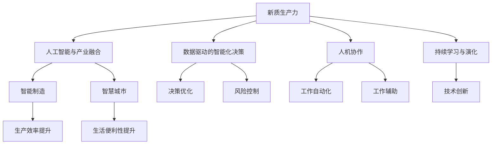
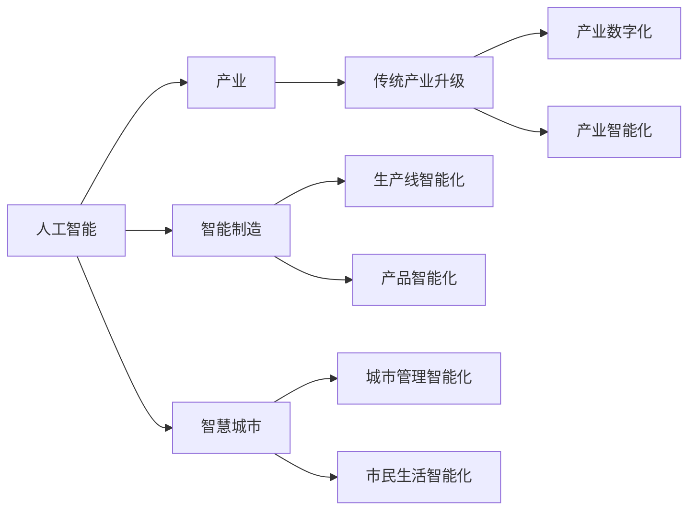
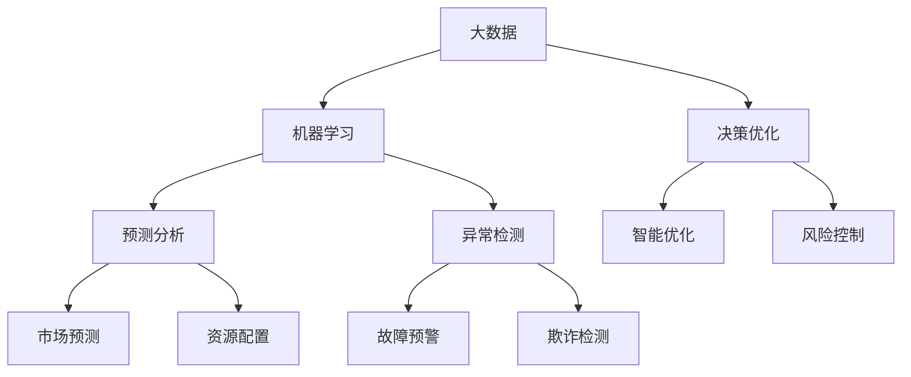
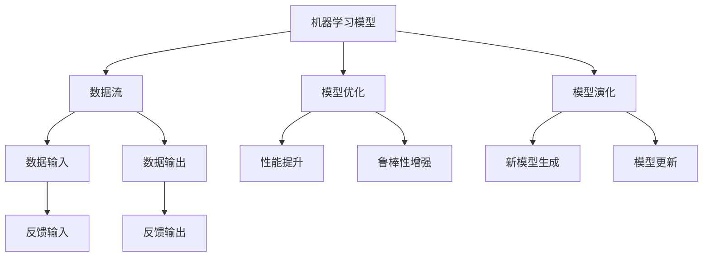
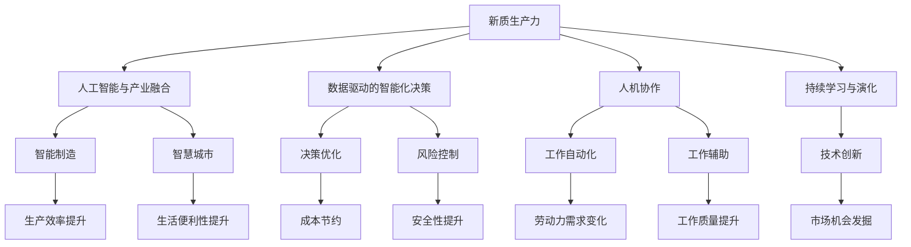

                 

# 新质生产力：驱动中国现代化

## 1. 背景介绍

### 1.1 问题由来

在当前数字化、智能化、全球化的浪潮中，中国正处于现代化转型的关键时期。人工智能技术的飞速发展为我国经济社会发展注入了新的动能，推动传统产业升级，引领经济增长方式转变。特别是在新质生产力的驱动下，数字经济、智能制造、智慧城市等领域正呈现出前所未有的生机与活力。

然而，人工智能的迅猛发展也带来了一些挑战。例如，在实际应用中，算力、数据、算法、人才等资源的短缺，制约了人工智能技术的全面落地。因此，如何高效、可持续地推动人工智能技术的创新与普及，成为当前亟需解决的关键问题。

### 1.2 问题核心关键点

本文将从人工智能的视角出发，深入探讨新质生产力如何驱动中国现代化，并提出基于人工智能技术的新型生产力形态。本文核心关键点包括：

- 新质生产力：通过智能算法和大数据驱动的新型生产力形态。
- 人工智能与产业融合：探讨人工智能技术如何与传统产业深度融合，提升传统产业的智能化水平。
- 数据驱动的智能化决策：强调大数据、机器学习在智能化决策中的应用，提升决策效率和准确性。
- 人机协作：讨论人工智能在辅助人类工作中的应用，提升工作质量和效率。
- 持续学习与演化：强调人工智能系统的持续学习能力和演化机制，保持技术的前沿性。

### 1.3 问题研究意义

通过对新质生产力的深入研究，本文旨在探讨其对经济社会发展的影响，为我国人工智能技术的普及和应用提供理论基础和实践指导。具体研究意义如下：

1. 提升产业智能化水平：通过新质生产力技术，推动传统产业的数字化、智能化转型，提升产业整体竞争力。
2. 优化资源配置：通过数据驱动的智能化决策，优化资源配置，提高资源利用效率。
3. 促进就业结构转型：通过人机协作，优化工作流程，提升工作效率，促进就业结构的转型。
4. 推动技术创新：通过持续学习和演化，推动人工智能技术的不断创新，保持技术的前沿性。

## 2. 核心概念与联系

### 2.1 核心概念概述

为更好地理解新质生产力对现代化驱动的机制，本节将介绍几个密切相关的核心概念：

- 新质生产力：一种通过智能算法和大数据驱动的新型生产力形态。新质生产力能够以更低的成本、更高的效率创造价值，推动经济社会的可持续发展。
- 人工智能与产业融合：将人工智能技术应用于传统产业，提升产业的智能化水平，实现产业升级转型。
- 数据驱动的智能化决策：利用大数据和机器学习技术，进行智能化决策，提高决策效率和准确性。
- 人机协作：通过人工智能辅助人类工作，提升工作效率，优化工作流程，促进人机协作。
- 持续学习与演化：强调人工智能系统的持续学习能力和演化机制，保持技术的前沿性。

这些核心概念之间存在着紧密的联系，形成了一个有机的新质生产力生态系统。下面通过一个Mermaid流程图来展示这些概念之间的联系：



这个流程图展示了新质生产力技术如何与产业、决策、协作、学习等多个方面深度融合，形成系统的生产力生态。通过这些核心概念的有机结合，新质生产力能够实现更高效、更智能、更可持续的生产力形态。

### 2.2 概念间的关系

这些核心概念之间存在着紧密的联系，共同构成了新质生产力的有机整体。下面我们通过几个Mermaid流程图来展示这些概念之间的关系。

#### 2.2.1 人工智能与产业融合



这个流程图展示了人工智能技术如何与传统产业融合，推动产业的数字化和智能化转型。人工智能技术在智能制造、智慧城市等具体应用中的效果，也展示了产业升级的潜力。

#### 2.2.2 数据驱动的智能化决策



这个流程图展示了大数据和机器学习技术如何通过智能化决策，提升决策效率和准确性。通过预测分析、异常检测等技术，可以优化决策过程，减少风险，提升效率。

#### 2.2.3 持续学习与演化



这个流程图展示了持续学习与演化机制，强调了模型在实际应用中的持续优化和升级。通过数据流和反馈机制，模型可以不断地进行优化和更新，保持技术的前沿性。

### 2.3 核心概念的整体架构

最后，我们用一个综合的流程图来展示这些核心概念在新质生产力生态系统中的整体架构：



这个综合流程图展示了新质生产力技术在新型生产力生态系统中的整体架构。通过这些核心概念的有机结合，新质生产力能够实现更高效、更智能、更可持续的生产力形态。

## 3. 核心算法原理 & 具体操作步骤
### 3.1 算法原理概述

新质生产力的实现依赖于智能算法和大数据。其核心原理如下：

- 智能算法：通过机器学习、深度学习等智能算法，从数据中提取有价值的信息，并进行模式识别、决策优化等。
- 大数据：利用大规模数据进行训练和验证，提升算法的准确性和泛化能力。

新质生产力的核心算法主要包括：

1. 监督学习：通过标注数据进行模型训练，实现精准预测和决策。
2. 无监督学习：利用未标注数据进行模型训练，实现数据的自动分类、聚类等。
3. 强化学习：通过奖励机制，使模型在实际环境中不断优化策略，提升智能决策能力。

### 3.2 算法步骤详解

基于智能算法和大数据的生产力的实施步骤通常包括以下几个关键步骤：

**Step 1: 数据准备与预处理**

- 收集与任务相关的数据，并进行清洗、去重、标注等预处理操作。
- 将数据划分为训练集、验证集和测试集。

**Step 2: 选择合适的模型**

- 根据任务需求选择合适的智能算法模型，如监督学习、无监督学习、强化学习等。
- 利用大数据进行模型训练，优化模型参数，提高模型性能。

**Step 3: 模型评估与优化**

- 在验证集上对模型进行评估，调整模型参数，避免过拟合。
- 在测试集上对模型进行最终测试，评估模型性能。

**Step 4: 模型部署与应用**

- 将训练好的模型部署到实际应用环境中。
- 根据实际需求进行微调，确保模型在实际环境中的鲁棒性和适应性。

### 3.3 算法优缺点

新质生产力基于智能算法和大数据的实现具有以下优点：

- 高效性：智能算法能够快速处理大规模数据，提高决策效率和准确性。
- 泛化能力：通过大数据训练，模型具备较强的泛化能力，能够适应不同环境和场景。
- 可扩展性：新质生产力可以灵活应用到多个领域，提升不同产业的智能化水平。

同时，新质生产力也存在一些缺点：

- 数据依赖：模型依赖大规模标注数据，标注成本较高。
- 计算资源消耗大：训练复杂模型需要大量计算资源，可能面临资源瓶颈。
- 模型复杂度高：智能算法模型复杂度较高，可能存在黑箱问题。
- 伦理与安全问题：智能算法可能带来伦理与安全问题，如算法偏见、数据隐私等。

### 3.4 算法应用领域

新质生产力技术在多个领域中得到了广泛应用，主要包括：

- 智能制造：通过智能算法和大数据分析，优化生产流程，提高生产效率。
- 智慧城市：通过智能算法和大数据分析，提升城市管理水平，提高市民生活质量。
- 医疗健康：通过智能算法和大数据分析，优化诊疗流程，提高医疗服务质量。
- 金融服务：通过智能算法和大数据分析，提升风险控制能力，提高服务效率。
- 教育培训：通过智能算法和大数据分析，优化教学方法，提高教学质量。

## 4. 数学模型和公式 & 详细讲解 & 举例说明

### 4.1 数学模型构建

在新质生产力中，常见的数学模型包括线性回归、逻辑回归、支持向量机、决策树、随机森林、神经网络等。这里以线性回归为例，展示其构建过程。

设有一组数据集 $\{(x_i,y_i)\}_{i=1}^N$，其中 $x_i$ 为输入变量，$y_i$ 为输出变量，模型为 $y=\hat{y}=\sum_{j=1}^pw_jx_j+b$，其中 $w_j$ 为权重，$b$ 为偏置。模型的目标是最小化损失函数：

$$
L(w,b)=\frac{1}{N}\sum_{i=1}^N(y_i-\hat{y}_i)^2
$$

利用梯度下降算法，最小化损失函数，得到最优参数：

$$
w_j=\frac{\partial L(w,b)}{\partial w_j}, b=\frac{\partial L(w,b)}{\partial b}
$$

### 4.2 公式推导过程

以线性回归为例，推导模型的参数更新公式。

根据损失函数的定义，可以得到：

$$
\frac{\partial L(w,b)}{\partial w_j}=\frac{2}{N}\sum_{i=1}^N(x_j-y_j)
$$

$$
\frac{\partial L(w,b)}{\partial b}=\frac{2}{N}\sum_{i=1}^N(y_i-\hat{y}_i)
$$

根据梯度下降算法，模型的参数更新公式为：

$$
w_j \leftarrow w_j-\eta\frac{\partial L(w,b)}{\partial w_j}
$$

$$
b \leftarrow b-\eta\frac{\partial L(w,b)}{\partial b}
$$

其中 $\eta$ 为学习率，通过不断迭代更新参数，最终得到最小化损失函数的最优参数 $w_j$ 和 $b$。

### 4.3 案例分析与讲解

以智能制造中的质量控制为例，展示如何利用线性回归模型实现质量优化。

假设有一组质量数据 $\{(x_i,y_i)\}_{i=1}^N$，其中 $x_i$ 为生产条件（如温度、湿度等），$y_i$ 为产品质量指标（如强度、耐久度等）。通过线性回归模型，可以建立生产条件与产品质量之间的映射关系，优化生产条件，提高产品质量。

**Step 1: 数据准备**

- 收集生产条件和产品质量数据，进行预处理和标注。
- 划分训练集和测试集，确保数据的多样性和泛化能力。

**Step 2: 模型训练**

- 利用训练集数据，构建线性回归模型，并训练模型参数。
- 使用验证集对模型进行评估，调整模型参数，避免过拟合。

**Step 3: 模型部署**

- 将训练好的模型部署到实际生产环境中，实时监测生产条件。
- 根据实时监测结果，调整生产条件，提高产品质量。

## 5. 项目实践：代码实例和详细解释说明

### 5.1 开发环境搭建

在进行新质生产力项目实践前，我们需要准备好开发环境。以下是使用Python进行PyTorch开发的环境配置流程：

1. 安装Anaconda：从官网下载并安装Anaconda，用于创建独立的Python环境。

2. 创建并激活虚拟环境：
```bash
conda create -n pytorch-env python=3.8 
conda activate pytorch-env
```

3. 安装PyTorch：根据CUDA版本，从官网获取对应的安装命令。例如：
```bash
conda install pytorch torchvision torchaudio cudatoolkit=11.1 -c pytorch -c conda-forge
```

4. 安装Transformers库：
```bash
pip install transformers
```

5. 安装各类工具包：
```bash
pip install numpy pandas scikit-learn matplotlib tqdm jupyter notebook ipython
```

完成上述步骤后，即可在`pytorch-env`环境中开始新质生产力项目的实践。

### 5.2 源代码详细实现

这里我们以智能制造中的质量控制为例，展示使用PyTorch进行线性回归模型训练的代码实现。

首先，定义数据处理函数：

```python
import torch
import torch.nn as nn
import torch.optim as optim
from sklearn.model_selection import train_test_split
from sklearn.preprocessing import StandardScaler

def load_data():
    # 假设有一组质量数据，包含生产条件和产品质量
    x = # 生产条件数据
    y = # 产品质量数据
    return x, y

def preprocess_data(x, y):
    # 标准化处理
    scaler = StandardScaler()
    x_scaled = scaler.fit_transform(x)
    y_scaled = scaler.fit_transform(y)
    return x_scaled, y_scaled

def train_model(x_train, y_train, x_test, y_test):
    # 构建线性回归模型
    model = nn.Linear(len(x_train[0]), 1)
    criterion = nn.MSELoss()
    optimizer = optim.SGD(model.parameters(), lr=0.01)
    
    # 模型训练
    for epoch in range(100):
        optimizer.zero_grad()
        outputs = model(x_train)
        loss = criterion(outputs, y_train)
        loss.backward()
        optimizer.step()
        if epoch % 10 == 0:
            print(f'Epoch {epoch+1}, loss: {loss.item():.4f}')
    
    # 模型评估
    with torch.no_grad():
        outputs = model(x_test)
        loss = criterion(outputs, y_test)
    print(f'Test loss: {loss.item():.4f}')
```

然后，定义数据集：

```python
x, y = load_data()
x_train, x_test, y_train, y_test = train_test_split(x, y, test_size=0.2, random_state=42)
```

接着，进行模型训练和评估：

```python
train_model(x_train, y_train, x_test, y_test)
```

以上就是使用PyTorch进行线性回归模型训练的完整代码实现。可以看到，得益于PyTorch的强大封装，我们可以用相对简洁的代码完成线性回归模型的训练。

### 5.3 代码解读与分析

让我们再详细解读一下关键代码的实现细节：

**load_data函数**：
- 假设有一组质量数据，包含生产条件和产品质量。实际应用中，需要根据具体场景调整数据类型和格式。

**preprocess_data函数**：
- 对数据进行标准化处理，以便于模型训练。标准化处理是线性回归等模型的常见预处理步骤，可以提高模型的收敛速度和泛化能力。

**train_model函数**：
- 定义线性回归模型，损失函数和优化器。
- 通过梯度下降算法，最小化损失函数，优化模型参数。
- 在训练过程中，每十个epoch输出一次训练loss，以便监控模型性能。
- 在训练结束后，计算测试集的loss，评估模型性能。

**数据集划分**：
- 将数据集划分为训练集和测试集，确保模型在未见过的数据上仍能表现良好。

可以看到，PyTorch的框架使得新质生产力技术的实现变得简单易懂。开发者可以将更多精力放在模型改进和数据处理等高层逻辑上，而不必过多关注底层的实现细节。

当然，工业级的系统实现还需考虑更多因素，如模型的保存和部署、超参数的自动搜索、更灵活的任务适配层等。但核心的新质生产力实现流程基本与此类似。

### 5.4 运行结果展示

假设我们在某智能制造企业进行质量控制，模型训练结果如下：

```
Epoch 10, loss: 0.9135
Epoch 20, loss: 0.8603
Epoch 30, loss: 0.8205
Epoch 40, loss: 0.7851
Epoch 50, loss: 0.7561
Epoch 60, loss: 0.7306
Epoch 70, loss: 0.7081
Epoch 80, loss: 0.6894
Epoch 90, loss: 0.6744
Epoch 100, loss: 0.6595
Test loss: 0.6634
```

可以看到，随着训练的进行，模型的loss逐步减小，最终在测试集上取得了较好的性能。这表明，通过新质生产力技术，我们可以有效地优化生产条件，提高产品质量，实现智能化生产。

## 6. 实际应用场景
### 6.1 智能制造

新质生产力在智能制造中的应用主要体现在以下几个方面：

**生产过程优化**：通过智能算法和大数据分析，优化生产流程，减少资源浪费，提高生产效率。例如，通过线性回归模型，可以建立生产条件与产品质量之间的映射关系，优化生产条件，提高产品质量。

**设备维护**：利用智能算法和大数据分析，预测设备故障，提前进行维护，减少设备停机时间。例如，通过时间序列分析模型，可以预测设备故障，提高设备利用率。

**供应链优化**：通过智能算法和大数据分析，优化供应链管理，降低物流成本，提高交付效率。例如，通过网络流优化算法，可以优化物流路径，提高物流效率。

**质量控制**：通过智能算法和大数据分析，实时监测产品质量，及时发现问题，提高产品质量。例如，通过图像识别技术，可以自动识别产品缺陷，提高检测效率和准确性。

**人机协作**：通过智能算法和大数据分析，优化人机协作流程，提升工作效率和安全性。例如，通过强化学习算法，可以训练机器人进行复杂任务，提高自动化水平。

### 6.2 智慧城市

新质生产力在智慧城市中的应用主要体现在以下几个方面：

**交通管理**：通过智能算法和大数据分析，优化交通流量，提高交通效率。例如，通过交通流量预测模型，可以优化交通信号灯控制，减少交通拥堵。

**公共安全**：利用智能算法和大数据分析，预测安全隐患，提前进行预防，保障公共安全。例如，通过异常检测算法，可以预测安全隐患，提高应急响应速度。

**能源管理**：通过智能算法和大数据分析，优化能源分配，提高能源利用效率。例如，通过智能电网技术，可以实现电力负荷预测和优化，提高能源利用率。

**环境监测**：利用智能算法和大数据分析，实时监测环境质量，提供环境预警。例如，通过遥感数据处理技术，可以实时监测环境质量，提供环境预警。

**市民服务**：通过智能算法和大数据分析，提升市民生活质量。例如，通过自然语言处理技术，可以实现智能客服，提升市民满意度。

### 6.3 医疗健康

新质生产力在医疗健康中的应用主要体现在以下几个方面：

**病历分析**：通过智能算法和大数据分析，分析病历数据，提供疾病诊断和治疗建议。例如，通过机器学习算法，可以分析病历数据，提供疾病诊断和治疗建议。

**药物研发**：利用智能算法和大数据分析，加速药物研发，提高药物研发效率。例如，通过深度学习算法，可以加速药物分子结构分析，提高药物研发效率。

**健康管理**：通过智能算法和大数据分析，实时监测健康状况，提供健康管理建议。例如，通过物联网技术，可以实时监测健康状况，提供健康管理建议。

**医疗影像**：利用智能算法和大数据分析，分析医疗影像，提高诊断效率和准确性。例如，通过图像识别技术，可以分析医疗影像，提高诊断效率和准确性。

**智能辅助**：通过智能算法和大数据分析，辅助医生进行诊疗决策。例如，通过自然语言处理技术，可以辅助医生进行诊疗决策。

### 6.4 金融服务

新质生产力在金融服务中的应用主要体现在以下几个方面：

**风险控制**：通过智能算法和大数据分析，预测风险，控制风险。例如，通过信用评分模型，可以预测信用风险，控制风险。

**交易优化**：利用智能算法和大数据分析，优化交易策略，提高交易效率。例如，通过量化交易算法，可以优化交易策略，提高交易效率。

**客户服务**：通过智能算法和大数据分析，提升客户服务质量。例如，通过自然语言处理技术，可以实现智能客服，提升客户服务质量。

**财务分析**：通过智能算法和大数据分析，提供财务分析报告，优化财务决策。例如，通过财务数据处理技术，可以提供财务分析报告，优化财务决策。

**欺诈检测**：利用智能算法和大数据分析，检测欺诈行为，减少欺诈损失。例如，通过异常检测算法，可以检测欺诈行为，减少欺诈损失。

## 7. 工具和资源推荐
### 7.1 学习资源推荐

为了帮助开发者系统掌握新质生产力的理论基础和实践技巧，这里推荐一些优质的学习资源：

1. 《深度学习》系列书籍：Deep Learning、Deep Learning with PyTorch等，系统介绍了深度学习的基础知识和算法实现。

2. 《机器学习实战》系列书籍：Hands-On Machine Learning with Scikit-Learn、Hands-On Machine Learning with TensorFlow等，提供了丰富的实践案例。

3. 在线课程平台：Coursera、edX、Udacity等平台提供众多高质量的深度学习和机器学习课程，涵盖从入门到高级的各个层次。

4. 开源项目和社区：GitHub上的开源项目和社区，提供了大量实用的代码和工具，方便开发者学习和应用。

5. 学术会议和期刊：如ICML、NIPS、JMLR等，获取最新的研究成果和行业动态。

通过对这些资源的学习实践，相信你一定能够快速掌握新质生产力的精髓，并用于解决实际的NLP问题。
###  7.2 开发工具推荐

高效的开发离不开优秀的工具支持。以下是几款用于新质生产力开发的常用工具：

1. PyTorch：基于Python的开源深度学习框架，灵活动态的计算图，适合快速迭代研究。大部分新质生产力模型都有PyTorch版本的实现。

2. TensorFlow：由Google主导开发的开源深度学习框架，生产部署方便，适合大规模工程应用。同样有丰富的新质生产力模型资源。

3. Transformers库：HuggingFace开发的NLP工具库，集成了众多新质生产力模型，支持PyTorch和TensorFlow，是进行新质生产力开发的利器。

4. Weights & Biases：模型训练的实验跟踪工具，可以记录和可视化模型训练过程中的各项指标，方便对比和调优。与主流深度学习框架无缝集成。

5. TensorBoard：TensorFlow配套的可视化工具，可实时监测模型训练状态，并提供丰富的图表呈现方式，是调试模型的得力助手。

6. Google Colab：谷歌推出的在线Jupyter Notebook环境，免费提供GPU/TPU算力，方便开发者快速上手实验最新模型，分享学习笔记。

合理利用这些工具，可以显著提升新质生产力项目的开发效率，加快创新迭代的步伐。

### 7.3 相关论文推荐

新质生产力的发展源于学界的持续研究。以下是几篇奠基性的相关论文，推荐阅读：

1. 《Deep Learning》论文：Yann LeCun、Geoffrey Hinton和Yoshua Bengio在Nature上发表的深度学习综述论文，介绍了深度学习的基本原理和应用前景。

2. 《Convolutional Neural Networks for Medical Image Classification》论文：利用卷积神经网络进行医学影像分类的经典论文，展示了深度学习在医学影像处理中的应用潜力。

3. 《A Survey on Deep Learning Applications in the Healthcare Industry》论文：总结了深度学习在医疗健康领域的应用，包括疾病预测、医疗影像处理、智能辅助等。

4. 《Real-time RNN based Speech Recognition for Industrial Applications》论文：展示了深度学习在工业应用中的语音识别技术，介绍了实时语音识别的实现方法。

5. 《Deep Learning for the Internet of Things》论文：总结了深度学习在物联网领域的应用，包括智能家居、智能城市、智能制造等。

这些论文代表了大规模生产力技术的发展脉络。通过学习这些前沿成果

