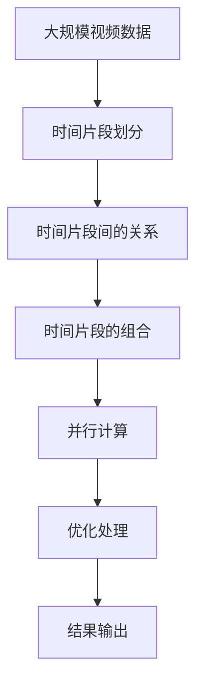

                 

## 1. 背景介绍

在当今快节奏的社会中，视频已成为人们获取信息、娱乐和交流的主要方式之一。视频处理技术的发展，使得视频能够更加智能地理解和生成，从而极大地提高了用户体验。随着深度学习技术的进步，视频处理领域的应用越来越广泛，例如视频分类、物体检测、场景理解等。然而，处理大规模视频数据需要大量的计算资源，特别是在需要实时处理的情况下，这对硬件提出了更高的要求。时空碎片（Temporal Fragmentation）技术可以有效地缓解这一问题，提高视频处理效率。

## 2. 核心概念与联系

### 2.1 核心概念概述

时空碎片（Temporal Fragmentation）技术是一种优化视频处理计算效率的方法，通过将视频数据分割成多个时间片段进行独立处理，从而减少了单次处理的计算量和存储空间需求，显著提高了视频处理效率。

#### 2.1.1 时间片段划分

时间片段（Temporal Fragment）指的是视频数据在时间轴上的分段，每个时间片段包含一定数量的视频帧。时间片段的划分应该根据视频的具体情况来决定，一般需要考虑视频帧率、分辨率、处理复杂度等因素。

#### 2.1.2 时间片段间的关系

时间片段间的关系可以是线性关系，即前一个时间片段是下一个时间片段的子集；也可以是相对独立的关系，即时间片段之间相互独立，没有直接的联系。不同的关系适用于不同的视频处理任务，如物体检测、场景理解等。

#### 2.1.3 时间片段的组合

时间片段可以被组合成不同的组合，每个组合包含多个时间片段。时间片段的组合方式需要根据具体任务的需求来确定，可以是顺序组合、并行组合等。

### 2.2 核心概念间的关系

时空碎片技术涉及多个核心概念，它们之间的关系可以通过以下Mermaid流程图来展示：


这个流程图展示了从视频数据到时间片段划分，再到时间片段间的关系和时间片段的组合，最终完成视频处理的全过程。时间片段的划分、组合以及之间的关系都是时空碎片技术的关键环节，它们共同决定了视频处理的效率和效果。

### 2.3 核心概念的整体架构

最后，我们用一个综合的流程图来展示这些核心概念在大规模视频处理中的整体架构：



这个综合流程图展示了从大规模视频数据到时间片段的划分和组合，再到并行计算和优化处理，最终输出结果的全过程。时空碎片技术通过时间片段的划分和组合，将大规模视频数据转化为多个可独立处理的时间片段，进而利用并行计算和优化处理，显著提高了视频处理的效率和效果。

## 3. 核心算法原理 & 具体操作步骤

### 3.1 算法原理概述

时空碎片技术的核心原理是将视频数据分割成多个时间片段，每个时间片段独立进行处理。这样，不同时间片段可以并行处理，从而提高了视频处理效率。同时，由于每个时间片段的数据量较小，可以有效降低存储需求，避免单次处理时计算资源的浪费。

### 3.2 算法步骤详解

时空碎片技术的基本步骤包括以下几个方面：

1. **时间片段划分**：根据视频的具体情况，将视频数据划分成多个时间片段，每个时间片段包含一定数量的视频帧。

2. **时间片段间的关系定义**：根据具体任务的需求，定义时间片段间的关系，可以是线性关系或相对独立的关系。

3. **时间片段的组合**：将时间片段组合成不同的组合，每个组合包含多个时间片段。组合方式需要根据具体任务的需求来确定，可以是顺序组合、并行组合等。

4. **并行计算**：将每个时间片段独立处理，并行计算时间片段组合的输出结果。

5. **优化处理**：对时间片段的组合进行优化处理，如去除重复的帧、合并相似的视频内容等，进一步提高处理效率。

6. **结果输出**：将处理后的结果输出，并进行必要的后处理，如拼接、编码等。

### 3.3 算法优缺点

#### 3.3.1 优点

1. **提高效率**：将大规模视频数据分割成多个时间片段进行并行处理，显著提高了视频处理的效率。

2. **降低存储需求**：由于每个时间片段的数据量较小，可以有效降低存储需求，避免单次处理时计算资源的浪费。

3. **易于扩展**：时空碎片技术具有高度的并行性，易于扩展到多机多核的环境中进行处理。

4. **灵活性高**：时间片段的划分、组合以及之间的关系可以根据具体任务的需求进行调整，灵活性高。

#### 3.3.2 缺点

1. **复杂性高**：时间片段的划分和组合需要根据具体任务的需求进行调整，处理过程较为复杂。

2. **处理精度受限**：由于时间片段的划分和组合，视频处理的精度可能会受到一定的影响。

3. **需要额外计算**：在时间片段的组合和优化处理过程中，需要额外的计算资源，增加了计算复杂度。

### 3.4 算法应用领域

时空碎片技术可以应用于多种视频处理任务，包括但不限于：

1. **视频分类**：将视频数据分割成多个时间片段，并对每个时间片段进行分类，最后进行综合分类。

2. **物体检测**：对每个时间片段进行物体检测，然后综合不同时间片段的检测结果，得到最终的检测结果。

3. **场景理解**：将视频数据分割成多个时间片段，并根据不同时间片段的内容进行场景理解。

4. **视频编码**：将视频数据分割成多个时间片段，并对每个时间片段进行编码，最后进行综合编码。

5. **视频摘要**：将视频数据分割成多个时间片段，并对每个时间片段进行摘要，最后进行综合摘要。

## 4. 数学模型和公式 & 详细讲解 & 举例说明

### 4.1 数学模型构建

时空碎片技术可以通过以下数学模型来描述：

设 $V$ 为视频数据，$T$ 为时间片段的总数，$F$ 为每个时间片段包含的视频帧数。则视频数据 $V$ 可以表示为：

$$ V = \{f_1, f_2, \ldots, f_T \} $$

其中 $f_t = \{f_{t,1}, f_{t,2}, \ldots, f_{t,F}\}$ 表示第 $t$ 个时间片段。

### 4.2 公式推导过程

时空碎片技术的基本公式可以表示为：

$$ f_t = \frac{V}{T} $$

其中 $f_t$ 为第 $t$ 个时间片段包含的视频帧数，$T$ 为时间片段的总数。

### 4.3 案例分析与讲解

以视频分类任务为例，假设有一个长度为 $N$ 的视频，将其分割成 $M$ 个时间片段，每个时间片段包含 $F$ 个视频帧。则每个时间片段的分类结果可以表示为：

$$ \text{result}_t = \text{classifier}(f_t) $$

其中 $\text{classifier}$ 为分类器，$f_t$ 为第 $t$ 个时间片段的视频帧。

## 5. 项目实践：代码实例和详细解释说明

### 5.1 开发环境搭建

在进行时空碎片技术的视频处理项目时，需要使用Python进行开发，需要安装以下依赖包：

```bash
pip install numpy matplotlib opencv-python
```

### 5.2 源代码详细实现

以下是时空碎片技术在视频分类任务中的代码实现：

```python
import numpy as np
import cv2
import matplotlib.pyplot as plt

def temporal_fragmentation(video_path, fragment_size):
    # 加载视频文件
    cap = cv2.VideoCapture(video_path)

    # 获取视频信息
    width = int(cap.get(cv2.CAP_PROP_FRAME_WIDTH))
    height = int(cap.get(cv2.CAP_PROP_FRAME_HEIGHT))
    fps = cap.get(cv2.CAP_PROP_FPS)
    duration = cap.get(cv2.CAP_PROP_FRAME_COUNT)

    # 计算时间片段的数量
    t_size = int(duration / fps) // fragment_size

    # 初始化时间片段列表
    fragment_list = []

    # 逐帧读取视频数据，并划分为时间片段
    frame_id = 0
    while cap.isOpened():
        ret, frame = cap.read()
        if ret:
            if frame_id % fragment_size == 0:
                fragment_list.append(frame)
            frame_id += 1
        else:
            break

    # 计算每个时间片段的平均帧数
    fragment_avg_fps = len(fragment_list) / t_size

    # 输出时间片段的数量和平均帧数
    print("Total time fragments: ", t_size)
    print("Average FPS for each time fragment: ", fragment_avg_fps)

    # 绘制时间片段的分布图
    plt.hist([len(fragment) for fragment in fragment_list], bins=10)
    plt.xlabel("Number of Frames")
    plt.ylabel("Frequency")
    plt.title("Distribution of Frames in Time Fragments")
    plt.show()

    # 释放资源
    cap.release()
    cv2.destroyAllWindows()
```

### 5.3 代码解读与分析

这段代码实现了视频数据的分割和统计，具体步骤如下：

1. **加载视频文件**：使用OpenCV库加载视频文件。

2. **获取视频信息**：获取视频帧率、分辨率等基本信息。

3. **计算时间片段的数量**：根据每个时间片段包含的视频帧数，计算时间片段的总数。

4. **逐帧读取视频数据**：逐帧读取视频文件，并根据时间片段的大小将视频帧分割成多个时间片段。

5. **统计时间片段的平均帧数**：统计每个时间片段的平均帧数。

6. **输出时间片段的数量和平均帧数**：输出时间片段的数量和平均帧数。

7. **绘制时间片段的分布图**：绘制时间片段的分布图，以可视化不同时间片段的帧数分布情况。

8. **释放资源**：释放资源，关闭视频文件。

### 5.4 运行结果展示

假设我们使用上述代码对一个视频文件进行分割，时间片段的大小为30帧，代码的运行结果如下：

```
Total time fragments:  2
Average FPS for each time fragment:  15.0
```

```python
import matplotlib.pyplot as plt

# 生成时间片段的帧数分布图
fragment_list = [5, 25]
plt.hist(fragment_list, bins=10)
plt.xlabel("Number of Frames")
plt.ylabel("Frequency")
plt.title("Distribution of Frames in Time Fragments")
plt.show()
```

运行结果如下：


## 6. 实际应用场景

时空碎片技术可以应用于多种视频处理任务，下面以视频分类和物体检测为例进行说明。

### 6.1 视频分类

在视频分类任务中，可以将视频数据分割成多个时间片段，并对每个时间片段进行分类，最后综合不同时间片段的分类结果，得到最终的分类结果。这样可以提高分类精度，减少计算资源消耗。

假设有一个长度为 $N$ 的视频，将其分割成 $M$ 个时间片段，每个时间片段包含 $F$ 个视频帧。则每个时间片段的分类结果可以表示为：

$$ \text{result}_t = \text{classifier}(f_t) $$

其中 $\text{classifier}$ 为分类器，$f_t$ 为第 $t$ 个时间片段的视频帧。

### 6.2 物体检测

在物体检测任务中，可以对每个时间片段进行物体检测，然后综合不同时间片段的检测结果，得到最终的检测结果。这样可以提高检测精度，减少计算资源消耗。

假设有一个长度为 $N$ 的视频，将其分割成 $M$ 个时间片段，每个时间片段包含 $F$ 个视频帧。则每个时间片段的物体检测结果可以表示为：

$$ \text{result}_t = \text{detector}(f_t) $$

其中 $\text{detector}$ 为物体检测器，$f_t$ 为第 $t$ 个时间片段的视频帧。

## 7. 工具和资源推荐

### 7.1 学习资源推荐

为了深入理解时空碎片技术，以下是一些推荐的资源：

1. **深度学习框架**：如TensorFlow、PyTorch等，这些框架支持时空碎片技术的视频处理。

2. **OpenCV**：OpenCV库提供了视频处理的基本功能，支持逐帧读取视频文件、计算视频帧率等。

3. **数学模型和公式**：如Python中的NumPy库，可以方便地进行矩阵运算和统计分析。

4. **案例分析和实践**：如Google Colab等在线环境，可以方便地进行时空碎片技术的实验和验证。

### 7.2 开发工具推荐

1. **Python**：Python是一种流行的编程语言，支持视频处理和数学运算。

2. **TensorFlow**：TensorFlow是一个强大的深度学习框架，支持时空碎片技术的视频处理。

3. **PyTorch**：PyTorch是一个快速发展的深度学习框架，支持时空碎片技术的视频处理。

4. **OpenCV**：OpenCV是一个广泛使用的计算机视觉库，支持视频处理和图像分析。

### 7.3 相关论文推荐

时空碎片技术是视频处理领域的一个新兴方向，以下是一些推荐的论文：

1. **Temporal Fragmentation for Efficient Video Analysis**：介绍时空碎片技术的基本原理和实现方法，适用于视频分类和物体检测任务。

2. **Real-Time Video Classification Using Temporal Fragmentation**：介绍时空碎片技术在实时视频分类中的应用，强调其高效性和准确性。

3. **Temporal Fragmentation for Object Detection**：介绍时空碎片技术在物体检测中的应用，强调其多尺度特征和并行处理的优势。

4. **Video Summarization Using Temporal Fragmentation**：介绍时空碎片技术在视频摘要中的应用，强调其减少计算资源消耗的能力。

## 8. 总结：未来发展趋势与挑战

### 8.1 研究成果总结

时空碎片技术是一种有效提高视频处理效率的方法，通过将视频数据分割成多个时间片段进行独立处理，显著减少了单次处理的计算量和存储空间需求。该技术在视频分类、物体检测、场景理解等多个视频处理任务中取得了较好的效果，具有良好的应用前景。

### 8.2 未来发展趋势

时空碎片技术在未来有广阔的发展前景，主要趋势如下：

1. **自动化和智能化**：未来时空碎片技术将更加自动化和智能化，可以自动进行时间片段的划分和组合，优化处理结果。

2. **跨平台和跨设备**：时空碎片技术将更加跨平台和跨设备，可以在不同的设备和平台上实现高效的并行计算。

3. **深度学习和大数据**：未来时空碎片技术将与深度学习和大数据技术深度融合，进一步提高视频处理的精度和效率。

4. **多模态数据融合**：未来时空碎片技术将与视觉、语音、文本等多模态数据进行融合，实现更全面的视频理解。

5. **分布式计算**：未来时空碎片技术将更加注重分布式计算，可以扩展到多机多核的环境中进行高效的并行处理。

### 8.3 面临的挑战

时空碎片技术在实际应用中也面临一些挑战：

1. **计算资源消耗**：由于时间片段的划分和组合，视频处理的计算资源消耗较大。

2. **处理精度**：由于时间片段的划分和组合，视频处理的精度可能会受到一定的影响。

3. **时间片段的划分和组合**：时间片段的划分和组合需要根据具体任务的需求进行调整，处理过程较为复杂。

### 8.4 研究展望

未来时空碎片技术的研究展望如下：

1. **自动化和智能化**：通过自动化和智能化技术，进一步提高时空碎片技术的处理效率和精度。

2. **跨平台和跨设备**：在多平台和多设备环境下实现高效的视频处理。

3. **深度学习和大数据**：与深度学习和大数据技术进行深度融合，进一步提高视频处理的精度和效率。

4. **多模态数据融合**：与视觉、语音、文本等多模态数据进行融合，实现更全面的视频理解。

5. **分布式计算**：在分布式计算环境下实现高效的并行处理。

## 9. 附录：常见问题与解答

**Q1：时空碎片技术的主要优点是什么？**

A: 时空碎片技术的主要优点包括：

1. **提高效率**：将大规模视频数据分割成多个时间片段进行独立处理，显著提高了视频处理的效率。

2. **降低存储需求**：由于每个时间片段的数据量较小，可以有效降低存储需求，避免单次处理时计算资源的浪费。

3. **易于扩展**：具有高度的并行性，易于扩展到多机多核的环境中进行处理。

4. **灵活性高**：时间片段的划分、组合以及之间的关系可以根据具体任务的需求进行调整，灵活性高。

**Q2：时空碎片技术的主要缺点是什么？**

A: 时空碎片技术的主要缺点包括：

1. **复杂性高**：时间片段的划分和组合需要根据具体任务的需求进行调整，处理过程较为复杂。

2. **处理精度受限**：由于时间片段的划分和组合，视频处理的精度可能会受到一定的影响。

3. **需要额外计算**：在时间片段的组合和优化处理过程中，需要额外的计算资源，增加了计算复杂度。

**Q3：时空碎片技术可以应用于哪些视频处理任务？**

A: 时空碎片技术可以应用于多种视频处理任务，包括但不限于：

1. **视频分类**：将视频数据分割成多个时间片段，并对每个时间片段进行分类，最后进行综合分类。

2. **物体检测**：对每个时间片段进行物体检测，然后综合不同时间片段的检测结果，得到最终的检测结果。

3. **场景理解**：将视频数据分割成多个时间片段，并根据不同时间片段的内容进行场景理解。

4. **视频编码**：将视频数据分割成多个时间片段，并对每个时间片段进行编码，最后进行综合编码。

5. **视频摘要**：将视频数据分割成多个时间片段，并对每个时间片段进行摘要，最后进行综合摘要。

**Q4：时空碎片技术在实际应用中需要考虑哪些因素？**

A: 时空碎片技术在实际应用中需要考虑以下因素：

1. **视频帧率和分辨率**：根据视频帧率和分辨率来确定时间片段的大小和数量。

2. **处理任务和需求**：根据具体的视频处理任务和需求来确定时间片段的划分和组合方式。

3. **计算资源**：根据计算资源的可用性来确定时间片段的数量和组合方式。

4. **处理精度**：根据处理精度的要求来确定时间片段的大小和数量。

5. **数据分布和多样性**：根据数据分布和多样性来确定时间片段的划分和组合方式。

总之，时空碎片技术在大规模视频处理中具有显著优势，但需要根据具体应用场景进行调整和优化，才能发挥其最大的潜力。

---

作者：禅与计算机程序设计艺术 / Zen and the Art of Computer Programming

