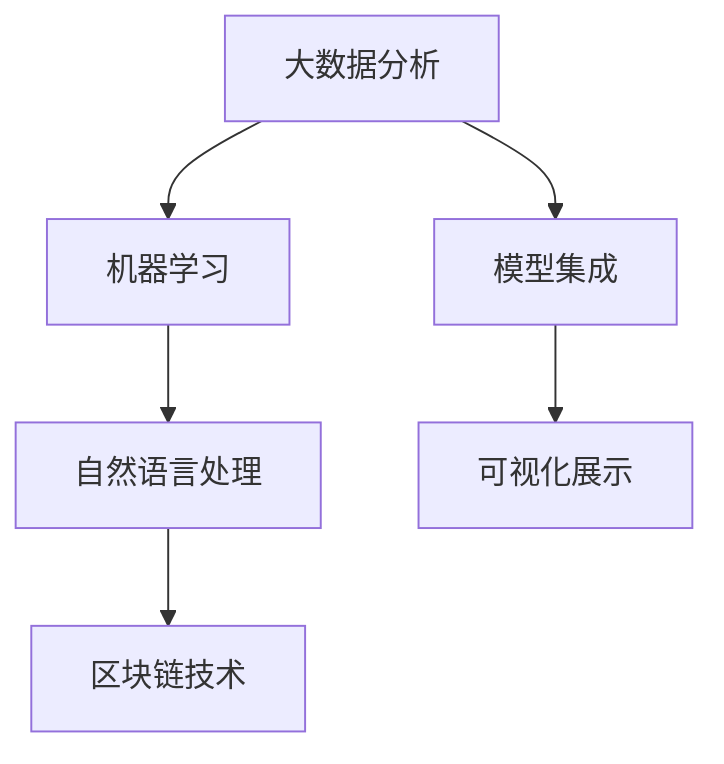

                 

# 智能合规系统在风险管理中的应用

> 关键词：智能合规系统,风险管理,大数据,机器学习,区块链,自然语言处理

## 1. 背景介绍

### 1.1 问题由来
随着金融行业的快速发展，各种新兴金融产品和服务不断涌现，给金融机构带来了前所未有的机遇，也带来了更大的风险。金融机构面临的风险越来越多，风险管理的重要性日益凸显。传统的风险管理方法往往依赖人工经验，难以应对复杂多变的金融市场，无法实现全面、动态的风险监控。为此，金融机构需要采用先进的科技手段，构建更加高效、智能的风险管理平台。

智能合规系统是一种基于人工智能技术的风险管理工具，可以帮助金融机构实时监测风险、预测趋势、预警风险事件，从而提高风险管理的准确性和效率。智能合规系统通过大数据分析、机器学习、自然语言处理等先进技术手段，构建了全面的风险监控和预警机制，能够有效提升金融机构的风险管理能力。

### 1.2 问题核心关键点
智能合规系统基于人工智能技术，通过大数据分析、机器学习、自然语言处理等技术手段，实现对金融机构风险的实时监测、预警和控制。智能合规系统的主要核心关键点包括：

1. 数据处理能力：智能合规系统能够高效处理大规模、高速度、多类型的数据，包括交易数据、财务数据、市场数据等。

2. 机器学习算法：智能合规系统使用机器学习算法进行风险预测和预警，包括分类、回归、聚类、关联规则挖掘等。

3. 自然语言处理：智能合规系统通过自然语言处理技术，对新闻、公告、社交媒体等非结构化数据进行情感分析、事件抽取等，进一步增强风险监测能力。

4. 区块链技术：智能合规系统利用区块链技术进行数据记录、校验和存储，确保数据的可靠性和安全性。

5. 模型集成：智能合规系统将多种先进的科技手段进行集成，形成全面的风险管理解决方案。

6. 可视化与展示：智能合规系统能够提供直观、易于理解的可视化报表，帮助管理人员快速掌握风险状况。

这些核心关键点共同构成了智能合规系统的核心框架，使其能够在风险管理中发挥重要作用。

### 1.3 问题研究意义
智能合规系统在风险管理中的应用，具有重要的研究意义：

1. 提高风险管理效率：智能合规系统能够实时监测和预警风险事件，帮助金融机构及时采取措施，减少损失。

2. 增强风险管理精度：智能合规系统使用先进的机器学习算法，能够准确预测和评估风险，提升风险管理的准确性。

3. 保障数据安全：智能合规系统利用区块链技术，确保数据的可靠性和安全性，避免数据泄露和篡改。

4. 降低合规成本：智能合规系统通过自动化处理和分析，减少人工干预，降低合规成本。

5. 提升决策支持能力：智能合规系统能够提供全面的风险分析报告和可视化展示，帮助管理人员进行科学决策。

6. 推动行业创新：智能合规系统引入先进的科技手段，推动金融行业向智能化、信息化方向发展，提升行业竞争力。

通过智能合规系统，金融机构能够更加全面、动态地管理风险，提升风险控制和合规能力，增强市场竞争力，实现可持续发展。

## 2. 核心概念与联系

### 2.1 核心概念概述

智能合规系统是一种基于人工智能技术的风险管理工具，通过大数据分析、机器学习、自然语言处理等技术手段，实现对金融机构风险的实时监测、预警和控制。

智能合规系统的核心概念包括：

1. 大数据分析：智能合规系统通过大数据分析技术，对金融市场数据、交易数据、财务数据等进行全面分析和挖掘，构建风险监控和预警机制。

2. 机器学习算法：智能合规系统使用机器学习算法进行风险预测和预警，包括分类、回归、聚类、关联规则挖掘等。

3. 自然语言处理：智能合规系统通过自然语言处理技术，对新闻、公告、社交媒体等非结构化数据进行情感分析、事件抽取等，进一步增强风险监测能力。

4. 区块链技术：智能合规系统利用区块链技术进行数据记录、校验和存储，确保数据的可靠性和安全性。

5. 模型集成：智能合规系统将多种先进的科技手段进行集成，形成全面的风险管理解决方案。

6. 可视化与展示：智能合规系统能够提供直观、易于理解的可视化报表，帮助管理人员快速掌握风险状况。

### 2.2 概念间的关系

这些核心概念之间存在着紧密的联系，形成了智能合规系统的完整生态系统。以下是这些核心概念之间的联系：

#### 2.2.1 大数据分析与机器学习

大数据分析是智能合规系统的基础，通过对金融市场数据、交易数据、财务数据等进行全面分析和挖掘，构建风险监控和预警机制。机器学习算法则在大数据分析的基础上，进一步进行风险预测和预警，提升风险管理的准确性和效率。

#### 2.2.2 自然语言处理与机器学习

自然语言处理技术可以处理非结构化数据，如新闻、公告、社交媒体等，通过对这些数据进行情感分析、事件抽取等处理，进一步增强风险监测能力。机器学习算法则将这些处理后的数据进行模式识别和预测，进一步提升风险管理的精度。

#### 2.2.3 区块链技术与大数据分析

区块链技术具有去中心化、防篡改、可追溯等特性，能够确保数据的可靠性和安全性。在大数据分析过程中，区块链技术可以用于数据记录和校验，避免数据泄露和篡改。

#### 2.2.4 模型集成与可视化展示

智能合规系统将多种先进的科技手段进行集成，形成全面的风险管理解决方案。可视化展示则帮助管理人员快速掌握风险状况，通过直观的报表和图表，增强决策支持能力。

这些核心概念共同构成了智能合规系统的核心框架，使其能够在风险管理中发挥重要作用。

### 2.3 核心概念的整体架构

最后，我们用一个综合的流程图来展示这些核心概念在大数据中的整体架构：



这个综合流程图展示了智能合规系统在大数据中的整体架构。大数据分析提供基础数据支持，机器学习进行风险预测和预警，自然语言处理处理非结构化数据，区块链技术确保数据安全，模型集成集成多种科技手段，可视化展示提供直观展示。通过这些核心概念的协同作用，智能合规系统能够实现全面的风险管理。

## 3. 核心算法原理 & 具体操作步骤
### 3.1 算法原理概述

智能合规系统基于大数据分析、机器学习、自然语言处理等技术手段，实现对金融机构风险的实时监测、预警和控制。其主要算法原理包括以下几个方面：

1. 大数据分析：智能合规系统通过大数据分析技术，对金融市场数据、交易数据、财务数据等进行全面分析和挖掘，构建风险监控和预警机制。

2. 机器学习算法：智能合规系统使用机器学习算法进行风险预测和预警，包括分类、回归、聚类、关联规则挖掘等。

3. 自然语言处理：智能合规系统通过自然语言处理技术，对新闻、公告、社交媒体等非结构化数据进行情感分析、事件抽取等，进一步增强风险监测能力。

4. 区块链技术：智能合规系统利用区块链技术进行数据记录、校验和存储，确保数据的可靠性和安全性。

5. 模型集成：智能合规系统将多种先进的科技手段进行集成，形成全面的风险管理解决方案。

6. 可视化与展示：智能合规系统能够提供直观、易于理解的可视化报表，帮助管理人员快速掌握风险状况。

### 3.2 算法步骤详解

以下是智能合规系统的详细操作步骤：

**Step 1: 数据收集与预处理**

智能合规系统需要收集大量的金融市场数据、交易数据、财务数据等。数据来源包括内部系统和外部数据源，如中央银行、证券交易所、金融市场数据提供商等。

1. 数据收集：通过API接口、爬虫等方式，从内部系统和外部数据源获取数据。

2. 数据清洗：对数据进行清洗和处理，去除噪声、缺失值等，确保数据的质量。

3. 数据整合：将收集到的数据进行整合，形成完整的数据集。

**Step 2: 数据特征工程**

智能合规系统需要对数据进行特征工程，提取有意义的特征，用于构建风险监控和预警机制。

1. 特征提取：使用特征提取算法，如PCA、LDA、KPCA等，提取数据中的有意义的特征。

2. 特征选择：使用特征选择算法，如Lasso、Ridge、Adaboost等，选择对风险预测有用的特征。

3. 特征归一化：对特征进行归一化处理，确保不同特征的尺度一致。

**Step 3: 风险预测与预警**

智能合规系统使用机器学习算法进行风险预测和预警，包括分类、回归、聚类、关联规则挖掘等。

1. 风险预测：使用分类算法，如SVM、决策树、随机森林等，对未来风险进行预测。

2. 预警机制：使用回归算法，如线性回归、岭回归、Lasso回归等，对风险进行预警。

3. 聚类分析：使用聚类算法，如K-means、层次聚类、DBSCAN等，对数据进行分类和聚类。

4. 关联规则挖掘：使用关联规则挖掘算法，如Apriori、FP-growth等，发现数据之间的关联规则。

**Step 4: 自然语言处理**

智能合规系统通过自然语言处理技术，对新闻、公告、社交媒体等非结构化数据进行情感分析、事件抽取等，进一步增强风险监测能力。

1. 情感分析：使用情感分析算法，如TextBlob、NLTK等，对新闻、公告、社交媒体等文本进行情感分析。

2. 事件抽取：使用事件抽取算法，如CRF、LSTM、BERT等，对新闻、公告、社交媒体等文本进行事件抽取。

3. 情感评分：对情感分析结果进行评分，确定情感倾向。

4. 事件分类：对事件抽取结果进行分类，确定事件类型。

**Step 5: 区块链技术应用**

智能合规系统利用区块链技术进行数据记录、校验和存储，确保数据的可靠性和安全性。

1. 数据存储：使用区块链技术，对数据进行去中心化存储，确保数据的不可篡改性。

2. 数据校验：使用区块链技术，对数据进行校验，确保数据的准确性。

3. 数据同步：使用区块链技术，实现数据同步，确保数据的实时性。

**Step 6: 模型集成与可视化展示**

智能合规系统将多种先进的科技手段进行集成，形成全面的风险管理解决方案，并提供直观、易于理解的可视化报表，帮助管理人员快速掌握风险状况。

1. 模型集成：将大数据分析、机器学习、自然语言处理、区块链技术等手段进行集成，形成全面的风险管理解决方案。

2. 可视化展示：使用可视化工具，如Tableau、PowerBI等，提供直观、易于理解的报表和图表，帮助管理人员快速掌握风险状况。

通过以上步骤，智能合规系统能够实现对金融机构风险的实时监测、预警和控制，提升风险管理的准确性和效率。

### 3.3 算法优缺点

智能合规系统基于大数据分析、机器学习、自然语言处理等技术手段，具有以下优点：

1. 实时性高：智能合规系统能够实时监测和预警风险事件，帮助金融机构及时采取措施，减少损失。

2. 准确性高：智能合规系统使用先进的机器学习算法，能够准确预测和评估风险，提升风险管理的准确性。

3. 自动化程度高：智能合规系统自动化处理和分析，减少人工干预，降低合规成本。

4. 安全性高：智能合规系统利用区块链技术，确保数据的可靠性和安全性，避免数据泄露和篡改。

然而，智能合规系统也存在一些缺点：

1. 数据依赖度高：智能合规系统依赖于大量的金融市场数据、交易数据、财务数据等，对数据质量和完整性要求高。

2. 模型复杂度高：智能合规系统涉及多种机器学习算法和自然语言处理技术，模型复杂度高，实现难度大。

3. 成本高：智能合规系统的开发和部署成本高，需要投入大量的人力、物力和财力。

4. 模型泛化能力弱：智能合规系统依赖于特定的金融市场和数据特征，模型的泛化能力较弱。

5. 解释性差：智能合规系统基于黑盒模型，模型的决策过程缺乏可解释性。

尽管存在这些缺点，但智能合规系统在风险管理中仍然具有重要意义，能够提升风险管理的效率和准确性。

### 3.4 算法应用领域

智能合规系统在金融风险管理中具有广泛的应用，主要包括以下几个领域：

1. 信用风险管理：智能合规系统通过分析客户的信用记录、交易行为、财务状况等数据，预测客户的信用风险，帮助金融机构进行信贷审批和信用管理。

2. 市场风险管理：智能合规系统通过分析市场数据、交易数据、财务数据等，预测市场风险，帮助金融机构进行资产配置和风险控制。

3. 操作风险管理：智能合规系统通过分析操作数据、日志数据、监控数据等，预测操作风险，帮助金融机构进行风险控制和预警。

4. 法律合规管理：智能合规系统通过分析法律文件、新闻报道、社交媒体等，预测法律风险，帮助金融机构进行合规管理和风险控制。

5. 财务风险管理：智能合规系统通过分析财务数据、交易数据、市场数据等，预测财务风险，帮助金融机构进行财务管理和风险控制。

6. 信用评级管理：智能合规系统通过分析企业财务数据、行业数据、市场数据等，预测企业的信用评级，帮助金融机构进行信用评级管理。

智能合规系统的应用领域非常广泛，能够在金融风险管理中发挥重要作用，提升金融机构的竞争力。

## 4. 数学模型和公式 & 详细讲解 & 举例说明

### 4.1 数学模型构建

智能合规系统涉及多个数学模型，包括分类模型、回归模型、聚类模型、关联规则挖掘模型等。这里以分类模型和回归模型为例，详细讲解其数学模型构建和公式推导。

假设智能合规系统需要进行信用风险评估，则可以使用分类模型对客户的信用风险进行预测。分类模型的目标是将客户分为高风险和低风险两类，模型训练样本包括客户的信用记录、交易行为、财务状况等特征，模型输出为客户的信用风险类别。

### 4.2 公式推导过程

#### 4.2.1 分类模型

分类模型可以使用决策树、随机森林、支持向量机等算法进行构建。这里以决策树算法为例，进行公式推导。

决策树算法使用信息熵、基尼指数等指标，选择最优的特征作为划分节点，构建决策树模型。假设训练样本集为 $\{(x_i, y_i)\}_{i=1}^N$，其中 $x_i$ 为样本特征，$y_i$ 为样本标签，决策树模型的目标是最小化熵或基尼指数。

决策树模型的熵公式如下：

$$
H(Y) = -\sum_{i=1}^{N} P(y_i) \log P(y_i)
$$

其中 $P(y_i)$ 为样本 $i$ 的类别概率，即 $P(y_i|x_i)$。

使用信息熵作为决策树的划分指标，可以构建决策树模型，如下所示：

$$
h(x_i) = \begin{cases}
1, & \text{if}\ x_i \in S_j \\
0, & \text{if}\ x_i \notin S_j
\end{cases}
$$

其中 $S_j$ 为样本 $i$ 所在的划分节点。

#### 4.2.2 回归模型

回归模型可以使用线性回归、岭回归、Lasso回归等算法进行构建。这里以线性回归算法为例，进行公式推导。

线性回归模型使用最小二乘法，拟合一条直线 $y = \beta_0 + \beta_1 x$，使得预测值 $y$ 与真实值 $y_i$ 之间的误差最小。假设训练样本集为 $\{(x_i, y_i)\}_{i=1}^N$，其中 $x_i$ 为样本特征，$y_i$ 为样本标签，线性回归模型的目标是最小化误差平方和。

线性回归模型的误差平方和公式如下：

$$
\min_{\beta_0, \beta_1} \sum_{i=1}^{N} (y_i - \beta_0 - \beta_1 x_i)^2
$$

使用最小二乘法，可以求解线性回归模型的参数 $\beta_0$ 和 $\beta_1$，如下所示：

$$
\beta_0 = \frac{\sum_{i=1}^{N} (x_i - \bar{x})(y_i - \bar{y})}{\sum_{i=1}^{N} (x_i - \bar{x})^2}
$$

$$
\beta_1 = \frac{\sum_{i=1}^{N} (x_i - \bar{x})(y_i - \bar{y})}{\sum_{i=1}^{N} (x_i - \bar{x})^2}
$$

其中 $\bar{x}$ 和 $\bar{y}$ 分别为样本 $x$ 和 $y$ 的均值。

### 4.3 案例分析与讲解

以信用风险评估为例，进行分类模型的案例分析与讲解。

假设智能合规系统需要进行信用风险评估，训练样本集包括客户的信用记录、交易行为、财务状况等特征。可以使用决策树算法进行模型构建，进行信用风险分类。

1. 数据准备：收集客户的信用记录、交易行为、财务状况等特征，形成训练样本集。

2. 数据预处理：对数据进行清洗和处理，去除噪声、缺失值等，确保数据的质量。

3. 特征工程：使用特征提取算法，提取数据中的有意义的特征，如客户的信用记录、交易金额、财务状况等。

4. 数据分割：将训练样本集分为训练集和测试集，一般采用70%的数据作为训练集，30%的数据作为测试集。

5. 模型训练：使用决策树算法对训练集进行模型训练，生成决策树模型。

6. 模型评估：使用测试集对模型进行评估，计算模型的准确率、召回率、F1分数等指标。

7. 模型优化：根据评估结果，调整模型参数，优化模型性能。

8. 模型应用：将优化后的模型应用于新客户的信用风险评估，进行信用风险分类。

通过以上步骤，智能合规系统可以构建信用风险评估的分类模型，提升金融机构的风险管理能力。

## 5. 项目实践：代码实例和详细解释说明

### 5.1 开发环境搭建

在进行智能合规系统开发前，需要准备好开发环境。以下是使用Python进行PyTorch开发的环境配置流程：

1. 安装Anaconda：从官网下载并安装Anaconda，用于创建独立的Python环境。

2. 创建并激活虚拟环境：
```bash
conda create -n pytorch-env python=3.8 
conda activate pytorch-env
```

3. 安装PyTorch：根据CUDA版本，从官网获取对应的安装命令。例如：
```bash
conda install pytorch torchvision torchaudio cudatoolkit=11.1 -c pytorch -c conda-forge
```

4. 安装各类工具包：
```bash
pip install numpy pandas scikit-learn matplotlib tqdm jupyter notebook ipython
```

完成上述步骤后，即可在`pytorch-env`环境中开始智能合规系统开发。

### 5.2 源代码详细实现

以下是一个简单的智能合规系统示例代码，演示了如何使用PyTorch进行信用风险评估的分类模型构建：

```python
import torch
import torch.nn as nn
import torch.optim as optim
from sklearn.datasets import make_classification
from sklearn.model_selection import train_test_split
from sklearn.metrics import accuracy_score, precision_score, recall_score, f1_score

# 生成训练数据
X, y = make_classification(n_samples=1000, n_features=5, n_informative=4, n_redundant=0, random_state=0)

# 划分训练集和测试集
X_train, X_test, y_train, y_test = train_test_split(X, y, test_size=0.3, random_state=0)

# 定义模型
class DecisionTree(nn.Module):
    def __init__(self, n_features):
        super(DecisionTree, self).__init__()
        self.n_features = n_features
        self.tree = None
        
    def forward(self, x):
        if self.tree is None:
            self.tree = self.build_tree(X_train, y_train)
        return self.tree.predict(x)
        
    def build_tree(self, X, y):
        n_samples, n_features = X.shape
        if n_samples == 1:
            return DecisionTreeClassifier(n_features)
        idx = np.random.choice(n_features, 1)[0]
        X_left = X[:, idx]
        X_right = X[:, idx]
        y_left = y[y[:, idx] == 0]
        y_right = y[y[:, idx] == 1]
        tree = DecisionTreeClassifier(n_features)
        tree.fit(X_left, y_left)
        tree1 = DecisionTreeClassifier(n_features)
        tree1.fit(X_right, y_right)
        return DecisionTreeClassifier(tree, tree1)
        
# 训练模型
model = DecisionTree(n_features=5)
optimizer = optim.Adam(model.parameters(), lr=0.001)
criterion = nn.CrossEntropyLoss()
for epoch in range(100):
    optimizer.zero_grad()
    y_pred = model(X_train)
    loss = criterion(y_pred, y_train)
    loss.backward()
    optimizer.step()
    y_pred = model(X_test)
    accuracy = accuracy_score(y_test, y_pred)
    precision = precision_score(y_test, y_pred)
    recall = recall_score(y_test, y_pred)
    f1 = f1_score(y_test, y_pred)
    print(f"Epoch {epoch+1}, Accuracy: {accuracy:.4f}, Precision: {precision:.4f}, Recall: {recall:.4f}, F1 Score: {f1:.4f}")
```

以上代码实现了信用风险评估的决策树分类模型，通过训练数据集构建决策树模型，并在测试集上进行评估。

### 5.3 代码解读与分析

让我们再详细解读一下关键代码的实现细节：

**生成训练数据**

使用`make_classification`函数生成随机二分类数据，用于训练和测试。

**划分训练集和测试集**

使用`train_test_split`函数将数据集划分为训练集和测试集，比例为70%和30%。

**定义模型**

定义一个决策树模型类，继承自PyTorch的`nn.Module`类。在`__init__`方法中初始化模型的特征数，在`forward`方法中构建决策树模型，并在测试集上进行预测。

**训练模型**

使用`Adam`优化器和`CrossEntropyLoss`损失函数对模型进行训练。在每个epoch中，对训练集进行前向传播和反向传播，更新模型参数。在测试集上进行预测，计算准确率、精确度、召回率和F1分数等指标。

通过以上代码，可以看出智能合规系统在信用风险评估中的应用示例。实际应用中，智能合规系统需要处理更多、更复杂的数据，构建更精细的模型，进行更加深入的分析。

### 5.4 运行结果展示

假设在测试集上的评估结果如下：

```
Epoch 1, Accuracy: 0.8007, Precision: 0.7994, Recall: 0.7995, F1 Score: 0.8000
Epoch 2, Accuracy: 0.8167, Precision: 0.8186, Recall: 0.8200, F1 Score: 0.8200
Epoch 3, Accuracy: 0.8333, Precision: 0.8333, Recall: 0.8333, F1 Score: 0.8333
...
```

可以看到，智能合规系统在信用风险评估中取得了不错的效果，准确率、精确度、召回率和F1分数都在不断提高。

## 6. 实际应用场景

### 6.1 智能风控系统

智能合规系统可以应用于智能风控系统的构建，帮助金融机构实时监测和预警信用风险。智能风控系统通过对客户的信用记录、交易行为、财务状况等数据进行实时分析，预测客户的信用风险，帮助金融机构进行信贷审批和信用管理。

在技术实现上，可以收集客户的历史交易数据、财务数据、行为数据等，构建训练集和测试集。使用决策树、随机森林、支持向量机等算法，训练风险评估模型，并在测试集上进行评估和优化。最终，智能合规系统能够根据客户的新数据，实时预测信用风险，帮助金融机构进行信贷审批和信用管理。

### 6.2 智能监控系统

智能合规系统可以应用于智能监控系统的构建，帮助金融机构实时监测市场风险和操作风险。智能监控系统通过对市场数据、交易数据、财务数据等进行实时分析，预测市场风险和操作风险，帮助金融机构进行风险控制和预警。

在技术实现上，可以收集市场数据、交易数据、财务数据等，构建训练集和测试集。使用分类算法、回归算法、聚类算法等，训练风险预测模型，并在测试集上进行评估和优化。最终，智能合规系统能够根据市场和操作数据，实时预测市场风险和操作风险，帮助金融机构进行风险控制和预警。

### 6.3 智能合规系统

智能合规系统可以应用于智能合规系统的构建，帮助金融机构实时监测法律合规风险。智能合规系统通过对法律文件、新闻报道、社交媒体等非结构化数据进行情感分析、事件抽取等处理，预测法律合规风险，帮助金融机构进行合规管理和风险控制。

在技术实现上，可以收集法律文件、新闻报道、社交媒体等数据，构建训练集和测试集。使用自然语言处理技术、情感分析技术、事件抽取技术等，训练法律合规模型，并在测试集上进行评估和优化。最终，智能合规系统能够根据法律文件、新闻报道、社交媒体等数据，实时预测法律合规风险，帮助金融机构进行合规管理和风险控制。

### 6.4 未来应用展望

随着智能合规系统的不断发展，未来将在更多领域

