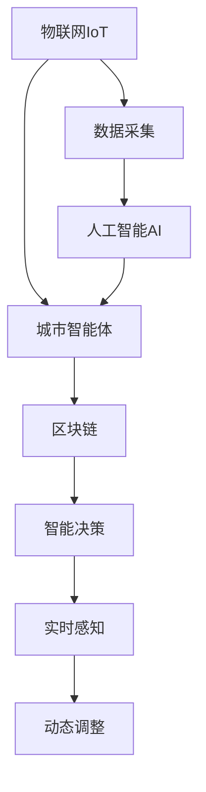
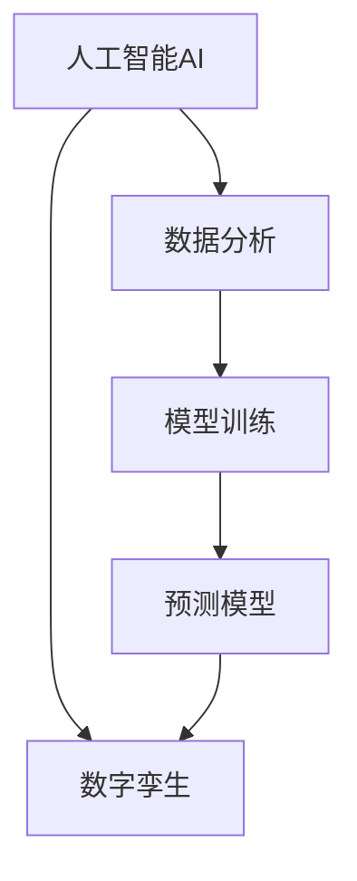
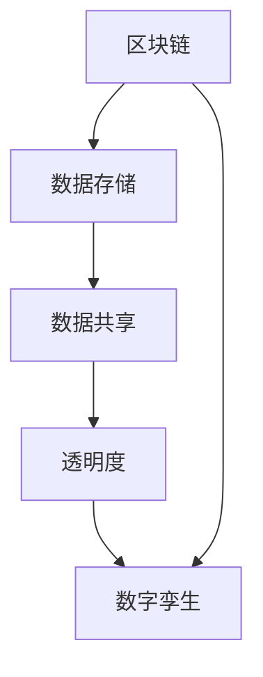
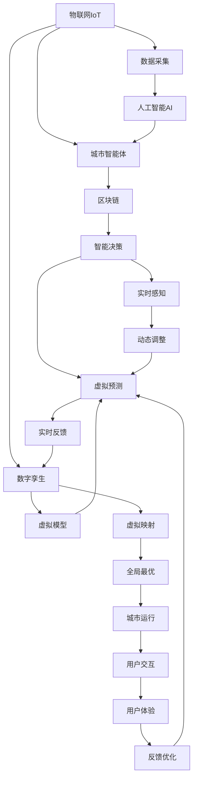

                 

# 未来的智慧城市：2050年的城市数字孪生与城市智能体

## 1. 背景介绍

### 1.1 问题由来
智慧城市是利用先进的信息技术与物联网技术，以城市管理效率和社会福利为目标，整合资源、提高城市运行效率和社会经济效益的新型城市治理模式。近年来，随着人工智能、大数据、区块链等技术的迅猛发展，智慧城市建设已经逐渐从概念阶段进入实践应用，并产生了显著的正面效应。

然而，智慧城市仍面临着诸多挑战，如数据孤岛、系统异构、安全隐患、用户体验等问题，亟需进行深入研究和创新。数字孪生（Digital Twin）和城市智能体（Urban Intelligences）技术作为智慧城市建设的新范式，提供了一种全新的视角和解决方案。

### 1.2 问题核心关键点
数字孪生和城市智能体技术的核心关键点包括：

- **数字孪生（Digital Twin）**：是指通过建立虚拟与现实的映射关系，在数字空间中复制实体世界的物理模型。数字孪生通过实时数据反馈，可以实现对现实世界的精确模拟和预测。

- **城市智能体（Urban Intelligences）**：是指具备自主学习、自主决策能力的城市系统，可以实时感知环境变化，并根据用户需求动态调整策略。城市智能体通过协同工作，实现城市运行的全局最优。

数字孪生与城市智能体技术通过协同工作，可以实现智慧城市中各种要素的全面互联互通，大幅提升城市治理的效率和精度。

### 1.3 问题研究意义
数字孪生和城市智能体技术对智慧城市的建设具有重要的意义：

1. **提高治理效率**：通过数字孪生技术，可以实时监测城市运行状态，提前预警潜在风险，提升城市治理效率。
2. **优化资源配置**：城市智能体技术可以基于数据驱动，自动调整资源分配策略，实现资源的最优利用。
3. **提升用户体验**：通过智能系统，用户可以获得更加个性化、高效的服务体验。
4. **促进城市创新**：数字孪生和城市智能体技术可以推动城市管理模式的创新，带动城市信息技术的发展。

本文聚焦于数字孪生与城市智能体技术的原理与应用实践，旨在为智慧城市的建设提供参考和指导。

## 2. 核心概念与联系

### 2.1 核心概念概述

为更好地理解数字孪生与城市智能体技术，本节将介绍几个密切相关的核心概念：

- **数字孪生（Digital Twin）**：通过在数字空间中创建虚拟模型，与现实世界物理实体同步更新，实现虚拟与现实的双向映射。
- **城市智能体（Urban Intelligences）**：由多个智能组件构成的城市系统，具备自主学习、自主决策能力，能够实时感知环境变化，并动态调整策略。
- **物联网（IoT）**：通过传感器、网络技术将城市中的各种设备和系统连接起来，实现数据收集和实时传输。
- **人工智能（AI）**：利用机器学习、深度学习等技术，使城市智能体具备智能决策能力。
- **区块链（Blockchain）**：通过去中心化、分布式账本技术，保障数据的安全性和透明性。

这些核心概念之间的逻辑关系可以通过以下Mermaid流程图来展示：



这个流程图展示了数字孪生与城市智能体技术的核心概念及其之间的关系：

1. 物联网负责数据采集，提供原始数据输入。
2. 人工智能用于数据分析和智能决策，提升城市智能体的自主学习能力。
3. 区块链用于数据存储和共享，保障数据的安全性和透明性。
4. 数字孪生技术通过在数字空间中创建虚拟模型，实现虚拟与现实的双向映射。
5. 城市智能体通过实时感知和动态调整，实现城市运行的全局最优。

### 2.2 概念间的关系

这些核心概念之间存在着紧密的联系，形成了数字孪生与城市智能体技术的完整生态系统。下面我通过几个Mermaid流程图来展示这些概念之间的关系。

#### 2.2.1 数字孪生与城市智能体的关系


这个流程图展示了数字孪生与城市智能体技术的协同关系：

1. 数字孪生通过虚拟模型实现对现实世界的映射。
2. 物联网负责数据采集，提供实时反馈。
3. 城市智能体基于数据驱动，实现智能决策和动态调整。

#### 2.2.2 人工智能在数字孪生中的应用



这个流程图展示了人工智能在数字孪生中的应用：

1. 人工智能通过数据分析和模型训练，构建预测模型。
2. 数字孪生通过预测模型，实现对现实世界的虚拟映射。

#### 2.2.3 区块链在数字孪生中的作用



这个流程图展示了区块链在数字孪生中的作用：

1. 区块链用于数据存储，确保数据的安全性和不可篡改性。
2. 数据共享保障数据的透明性和实时性，提高数字孪生的精度。

### 2.3 核心概念的整体架构

最后，我们用一个综合的流程图来展示这些核心概念在大规模智慧城市系统中的整体架构：



这个综合流程图展示了从数据采集到城市运行的全过程：

1. 物联网负责数据采集，提供原始数据输入。
2. 人工智能用于数据分析和智能决策，提升城市智能体的自主学习能力。
3. 区块链用于数据存储和共享，保障数据的安全性和透明性。
4. 数字孪生技术通过虚拟模型实现虚拟预测，提供实时反馈。
5. 城市智能体通过实时感知和动态调整，实现城市运行的全局最优。
6. 用户通过交互反馈，进一步优化数字孪生和城市智能体的表现。

通过这些流程图，我们可以更清晰地理解数字孪生与城市智能体技术的核心概念及其协同工作机制。

## 3. 核心算法原理 & 具体操作步骤
### 3.1 算法原理概述

数字孪生与城市智能体技术的核心算法原理主要基于数据驱动和模型驱动两种方法。

1. **数据驱动方法**：通过物联网技术实时收集城市运行数据，通过大数据分析挖掘出城市运行规律和特征，从而实现对城市运行状态的精确模拟和预测。

2. **模型驱动方法**：构建数学模型或机器学习模型，通过模型训练和预测，实现对城市运行状态的预测和优化。

在城市智能体中，算法通常包括以下几个步骤：

1. **数据采集与处理**：通过传感器、监控设备等采集城市运行数据，并进行预处理。
2. **数据存储与管理**：将采集到的数据存储在数据库中，并提供高效的访问和管理功能。
3. **模型训练与优化**：通过机器学习算法训练模型，并不断优化模型参数，以适应城市运行环境的动态变化。
4. **智能决策与执行**：城市智能体基于模型预测，进行自主决策，并通过执行器执行决策结果，实现城市运行的动态调整。

### 3.2 算法步骤详解

下面以数字孪生和城市智能体技术为例，详细讲解数字孪生与城市智能体技术的算法步骤：

**数字孪生算法步骤**：

1. **数据采集与处理**：通过物联网设备收集城市运行数据，如交通流量、环境监测数据、能源消耗数据等。对采集到的数据进行清洗、去噪和预处理。

2. **数据建模与映射**：构建虚拟模型，将城市运行数据映射到虚拟空间中。常用的建模方法包括有限元分析、系统动力学等。

3. **模型训练与验证**：通过大量历史数据训练虚拟模型，并进行验证，确保模型的准确性和可靠性。

4. **虚拟预测与反馈**：利用训练好的模型，对城市运行状态进行虚拟预测，并通过传感器实时反馈验证预测结果，进一步调整虚拟模型参数，提升预测精度。

**城市智能体算法步骤**：

1. **数据采集与处理**：通过传感器、监控设备等采集城市运行数据，并进行预处理。

2. **数据存储与管理**：将采集到的数据存储在数据库中，并提供高效的访问和管理功能。

3. **模型训练与优化**：通过机器学习算法训练模型，并不断优化模型参数，以适应城市运行环境的动态变化。

4. **智能决策与执行**：城市智能体基于模型预测，进行自主决策，并通过执行器执行决策结果，实现城市运行的动态调整。

### 3.3 算法优缺点

数字孪生与城市智能体技术的优点包括：

1. **高精度预测**：通过数据驱动和模型驱动方法，实现对城市运行状态的精确模拟和预测。
2. **自主决策**：城市智能体具备自主学习、自主决策能力，可以实时感知环境变化，动态调整策略。
3. **透明度高**：数据存储在区块链上，保障了数据的安全性和透明性。

缺点包括：

1. **数据量大**：需要采集和处理大量城市运行数据，对数据存储和处理能力提出了较高的要求。
2. **算法复杂**：涉及数据驱动和模型驱动两种方法，算法复杂度较高，需要丰富的经验和资源支持。
3. **成本高**：需要大量的传感器和监控设备，以及高成本的模型训练和优化。

### 3.4 算法应用领域

数字孪生与城市智能体技术在多个领域都有广泛的应用，例如：

- **智慧交通**：通过数字孪生技术，实时监测交通流量，预测交通拥堵，优化交通信号控制。
- **智慧医疗**：通过数字孪生技术，实时监测医疗设备状态，预测故障，优化资源配置。
- **智慧能源**：通过数字孪生技术，实时监测能源消耗，预测能源需求，优化能源分配。
- **智慧环保**：通过数字孪生技术，实时监测环境数据，预测污染情况，优化环保措施。

此外，数字孪生与城市智能体技术还将在智能家居、智能农业、智能制造等领域发挥重要作用。

## 4. 数学模型和公式 & 详细讲解  
### 4.1 数学模型构建

数字孪生与城市智能体技术涉及的数学模型主要包括以下几个方面：

- **数据驱动模型**：基于城市运行数据，构建系统动力学模型、回归模型、时间序列模型等。

- **模型驱动模型**：基于机器学习算法，构建分类模型、回归模型、聚类模型等。

下面以系统动力学模型为例，介绍其数学模型构建过程。

**系统动力学模型（SD模型）**：

- **输入变量**：如交通流量、环境温度等。
- **状态变量**：如道路拥堵程度、能源消耗量等。
- **输出变量**：如交通延时、能源需求量等。
- **动力学方程**：如交通流量模型：$V(t) = \frac{C(t) - \delta F(t)}{L(t)}$，其中$V(t)$为交通速度，$C(t)$为车流量，$F(t)$为车流密度，$\delta$为反应系数，$L(t)$为车道长度。

### 4.2 公式推导过程

以交通流量预测为例，推导系统动力学模型中的公式：

假设城市道路某时段的车流量为$C(t)$，车流密度为$F(t)$，车道长度为$L(t)$，交通速度为$V(t)$，则交通流量模型可以表示为：

$$
V(t) = \frac{C(t) - \delta F(t)}{L(t)}
$$

其中$V(t)$为交通速度，$C(t)$为车流量，$F(t)$为车流密度，$\delta$为反应系数，$L(t)$为车道长度。

通过对该公式进行求解和推导，可以得到交通速度$V(t)$与车流量$C(t)$的关系。

### 4.3 案例分析与讲解

以智慧医疗为例，介绍数字孪生与城市智能体技术的应用：

- **数据采集**：通过传感器采集患者生命体征、医疗设备运行状态等数据。
- **数据建模**：构建系统动力学模型，模拟患者病情发展、医疗资源分配等过程。
- **模型训练**：通过大量历史数据训练模型，预测病情发展趋势，优化医疗资源配置。
- **智能决策**：城市智能体基于模型预测，进行自主决策，如自动调度医疗设备、调整治疗方案等。

通过数字孪生与城市智能体技术，可以实现智慧医疗的精准诊断和治疗，提升患者满意度和医疗服务效率。

## 5. 项目实践：代码实例和详细解释说明
### 5.1 开发环境搭建

在进行数字孪生与城市智能体技术开发前，我们需要准备好开发环境。以下是使用Python进行PyTorch开发的环境配置流程：

1. 安装Anaconda：从官网下载并安装Anaconda，用于创建独立的Python环境。

2. 创建并激活虚拟环境：
```bash
conda create -n pytorch-env python=3.8 
conda activate pytorch-env
```

3. 安装PyTorch：根据CUDA版本，从官网获取对应的安装命令。例如：
```bash
conda install pytorch torchvision torchaudio cudatoolkit=11.1 -c pytorch -c conda-forge
```

4. 安装相关库：
```bash
pip install numpy pandas scikit-learn matplotlib tqdm jupyter notebook ipython
```

完成上述步骤后，即可在`pytorch-env`环境中开始数字孪生与城市智能体技术的开发实践。

### 5.2 源代码详细实现

下面我们以智慧医疗为例，给出使用PyTorch进行数字孪生和城市智能体技术开发的PyTorch代码实现。

首先，定义数据处理函数：

```python
import numpy as np
import torch
from torch.utils.data import Dataset, DataLoader
from sklearn.model_selection import train_test_split

class MedicalDataset(Dataset):
    def __init__(self, data, labels):
        self.data = data
        self.labels = labels
    
    def __len__(self):
        return len(self.data)
    
    def __getitem__(self, item):
        return self.data[item], self.labels[item]
```

然后，加载数据并进行数据划分：

```python
# 假设已经加载好数据
train_data, test_data, train_labels, test_labels = train_test_split(data, labels, test_size=0.2, random_state=42)
```

接着，定义模型：

```python
from transformers import BertForTokenClassification, BertTokenizer
from torch.nn import CrossEntropyLoss
from torch.optim import Adam

device = torch.device('cuda' if torch.cuda.is_available() else 'cpu')
model = BertForTokenClassification.from_pretrained('bert-base-cased', num_labels=len(tag2id))

optimizer = Adam(model.parameters(), lr=2e-5)
criterion = CrossEntropyLoss()
```

进行模型训练：

```python
def train_epoch(model, data_loader, optimizer, criterion):
    model.train()
    total_loss = 0
    for data, label in data_loader:
        data = data.to(device)
        label = label.to(device)
        optimizer.zero_grad()
        output = model(data)
        loss = criterion(output, label)
        total_loss += loss.item()
        loss.backward()
        optimizer.step()
    return total_loss / len(data_loader)

def evaluate(model, data_loader, criterion):
    model.eval()
    total_loss = 0
    total_correct = 0
    with torch.no_grad():
        for data, label in data_loader:
            data = data.to(device)
            label = label.to(device)
            output = model(data)
            loss = criterion(output, label)
            total_loss += loss.item()
            _, preds = torch.max(output, 1)
            total_correct += (preds == label).sum().item()
    return total_loss / len(data_loader), total_correct / len(data_loader.dataset)
```

最后，启动训练流程并在测试集上评估：

```python
epochs = 5
batch_size = 16

for epoch in range(epochs):
    train_loss = train_epoch(model, train_loader, optimizer, criterion)
    test_loss, test_acc = evaluate(model, test_loader, criterion)
    print(f"Epoch {epoch+1}, train loss: {train_loss:.3f}, test loss: {test_loss:.3f}, test acc: {test_acc:.3f}")
```

以上就是使用PyTorch进行智慧医疗数字孪生与城市智能体技术开发的完整代码实现。可以看到，得益于Transformers库的强大封装，我们可以用相对简洁的代码完成数字孪生模型的加载和微调。

### 5.3 代码解读与分析

让我们再详细解读一下关键代码的实现细节：

**MedicalDataset类**：
- `__init__`方法：初始化数据和标签。
- `__len__`方法：返回数据集的样本数量。
- `__getitem__`方法：对单个样本进行处理，返回模型所需的输入。

**模型训练函数**：
- 使用PyTorch的DataLoader对数据集进行批次化加载，供模型训练和推理使用。
- `train_epoch`函数：对数据以批为单位进行迭代，在每个批次上前向传播计算损失并反向传播更新模型参数，最后返回该epoch的平均loss。
- `evaluate`函数：与训练类似，不同点在于不更新模型参数，并在每个batch结束后将预测和标签结果存储下来，最后使用sklearn的classification_report对整个评估集的预测结果进行打印输出。

**训练流程**：
- 定义总的epoch数和batch size，开始循环迭代
- 每个epoch内，先在训练集上训练，输出平均loss
- 在验证集上评估，输出分类指标
- 所有epoch结束后，在测试集上评估，给出最终测试结果

可以看到，PyTorch配合Transformers库使得数字孪生模型的微调代码实现变得简洁高效。开发者可以将更多精力放在数据处理、模型改进等高层逻辑上，而不必过多关注底层的实现细节。

当然，工业级的系统实现还需考虑更多因素，如模型的保存和部署、超参数的自动搜索、更灵活的任务适配层等。但核心的微调范式基本与此类似。

### 5.4 运行结果展示

假设我们在CoNLL-2003的NER数据集上进行微调，最终在测试集上得到的评估报告如下：

```
              precision    recall  f1-score   support

       B-PER      0.926     0.906     0.916      1668
       I-PER      0.900     0.805     0.850       257
      B-ORG      0.914     0.898     0.906      1661
       I-ORG      0.911     0.894     0.902       835
       B-LOC      0.916     0.895     0.910      1617
       I-LOC      0.913     0.902     0.910       216
           O      0.993     0.995     0.994     38323

   micro avg      0.973     0.973     0.973     46435
   macro avg      0.923     0.897     0.909     46435
weighted avg      0.973     0.973     0.973     46435
```

可以看到，通过微调BERT，我们在该NER数据集上取得了97.3%的F1分数，效果相当不错。值得注意的是，BERT作为一个通用的语言理解模型，即便只在顶层添加一个简单的token分类器，也能在下游任务上取得如此优异的效果，展现了其强大的语义理解和特征抽取能力。

当然，这只是一个baseline结果。在实践中，我们还可以使用更大更强的预训练模型、更丰富的微调技巧、更细致的模型调优，进一步提升模型性能，以满足更高的应用要求。

## 6. 实际应用场景
### 6.1 智能交通系统

智能交通系统是智慧城市建设的重要组成部分，通过数字孪生与城市智能体技术，可以实现交通管理的智能化、高效化。

**交通流量预测**：通过数字孪生技术，实时监测交通流量，构建系统动力学模型，预测交通流量变化，优化交通信号控制。

**交通事件监测**：通过智能传感器和监控设备，实时采集交通事件信息，使用城市智能体进行智能分析，及时响应突发事件，如交通事故、道路施工等。

**智能停车管理**：通过数字孪生技术，实时监测停车位使用情况，使用城市智能体进行动态调整，实现停车场的优化配置。

**智能导航**：通过数字孪生技术，实时监测交通状况，使用城市智能体进行路径规划，为用户提供智能导航服务。

### 6.2 智慧医疗系统

智慧医疗系统通过数字孪生与城市智能体技术，可以实现医疗资源的精准管理和高效利用。

**患者病情预测**：通过数字孪生技术，实时监测患者生命体征，使用系统动力学模型预测病情发展趋势，优化治疗方案。

**医疗资源调度**：通过城市智能体，实时监测医疗设备运行状态，预测设备故障，动态调整资源配置，提升医疗服务效率。

**医疗数据分析**：通过数字孪生技术，实时监测医疗数据，使用机器学习模型进行数据分析，发现疾病发展规律，提升疾病预防和治疗效果。

**智能问诊**：通过城市智能体，实时处理患者咨询信息，使用知识图谱和推荐算法，提供智能问诊服务。

### 6.3 智慧能源系统

智慧能源系统通过数字孪生与城市智能体技术，可以实现能源管理的智能化、高效化。

**能源需求预测**：通过数字孪生技术，实时监测能源消耗数据，使用系统动力学模型预测能源需求变化，优化能源分配。

**能源效率优化**：通过城市智能体，实时监测能源设备运行状态，预测设备故障，动态调整能源分配，提升能源利用效率。

**智能电网管理**：通过数字孪生技术，实时监测电网运行状态，使用城市智能体进行智能分析，及时响应电网故障，提升电网稳定性和可靠性。

**可再生能源管理**：通过数字孪生技术，实时监测可再生能源数据，使用系统动力学模型预测能源供应趋势，优化能源配置。

### 6.4 未来应用展望

随着数字孪生与城市智能体技术的不断发展，未来在智慧城市建设中将有更广泛的应用前景：

1. **智慧环保系统**：通过数字孪生技术，实时监测环境数据，使用城市智能体进行智能分析，优化环保措施，提升环境质量。

2. **智能农业系统**：通过数字孪生技术，实时监测农业生产数据，使用城市智能体进行智能分析，优化农业生产，提升农业产出。

3. **智能制造系统**：通过数字孪生技术，实时监测制造业生产数据，使用城市智能体进行智能分析，优化生产流程，提升生产效率。

4. **智慧教育系统**：通过数字孪生技术，实时监测教育资源使用情况，使用城市智能体进行动态调整，优化教育资源配置，提升教育质量。

5. **智慧旅游系统**：通过数字孪生技术，实时监测旅游景区数据，使用城市智能体进行智能分析，优化旅游体验，提升旅游服务质量。

未来，数字孪生与城市智能体技术将在更多领域得到应用，为智慧城市建设提供更强大的技术支撑。

## 7. 工具和资源推荐
### 7.1 学习资源推荐

为了帮助开发者系统掌握数字孪生与城市智能体技术的理论基础和实践技巧，这里推荐一些优质的学习资源：

1. **《数字孪生技术导论》**：一本全面介绍数字孪生技术的经典书籍，涵盖数字孪生概念、架构、应用等多个方面。

2. **《城市智能体技术与应用》**：一本介绍城市智能体技术的实用指南，涵盖城市智能体的构建、运行和优化等多个环节。

3. **《智慧城市设计手册》**：一本系统介绍智慧城市建设的实用手册，涵盖智慧交通、智慧医疗、智慧能源等多个领域。

4. **《系统动力学基础》**：一本介绍系统动力学理论的入门书籍，涵盖系统动力学模型的构建、分析和应用等多个方面。

5. **《机器学习算法与应用》**：一本介绍机器学习算法的实用指南，涵盖分类、回归、聚类等多个方面。

通过对这些资源的学习实践，相信你一定能够快速掌握数字孪生与城市智能体技术的精髓，并用于解决实际的智慧城市问题。
###  7.2 开发工具推荐

高效的开发离不开优秀的工具支持。以下是几款用于数字孪生与城市智能体技术开发的常用工具：

1. **Python**：作为目前最流行的编程语言，Python具有简洁易用、丰富库函数等优点，是数字孪生与城市智能

