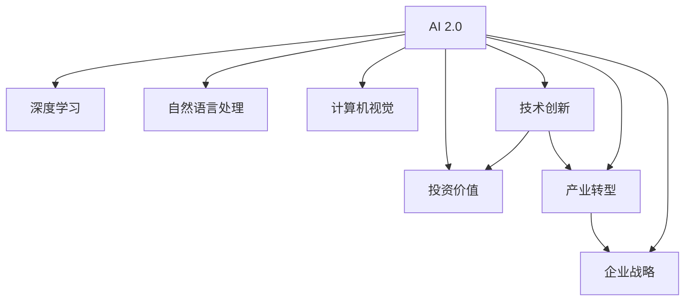
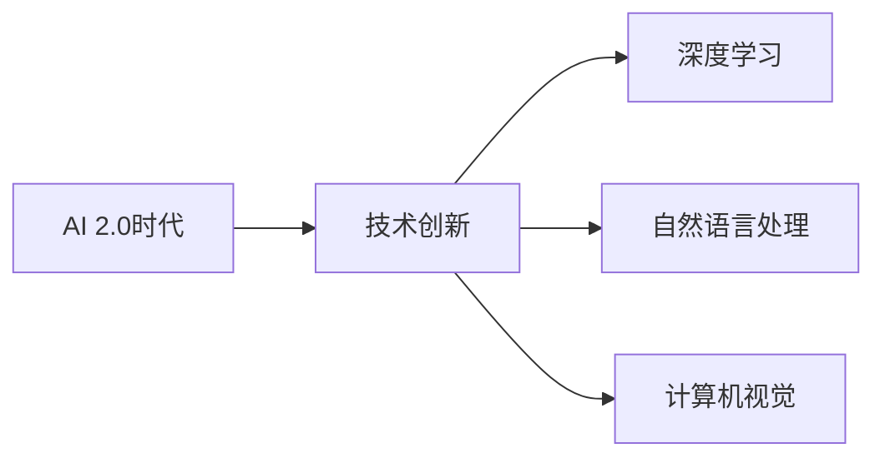
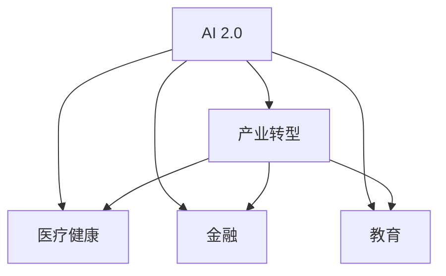
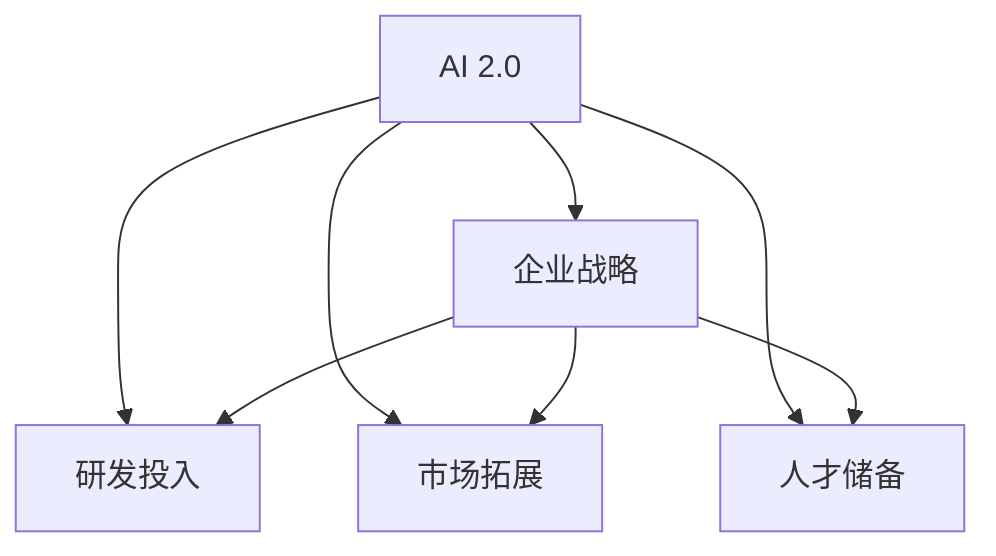
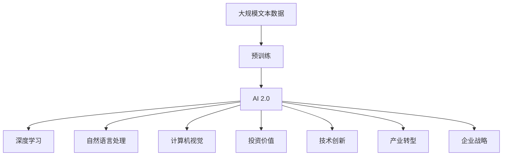

                 

# 李开复：AI 2.0 时代的投资价值

> 关键词：人工智能,投资价值,AI 2.0,技术创新,产业转型,企业战略

## 1. 背景介绍

### 1.1 问题的由来

随着人工智能技术的迅猛发展，特别是AI 2.0时代的来临，AI 已经成为全球科技竞争的重要领域。如何在AI 2.0时代把握投资机会，成为众多投资者和决策者关注的焦点。

AI 2.0时代，以深度学习、自然语言处理、计算机视觉等技术为代表的AI技术已经进入实用化阶段，能够处理复杂任务，解决实际问题。然而，这些技术的广泛应用还面临着诸多挑战，如数据隐私、伦理道德、技术复杂度等问题。因此，如何识别和把握AI 2.0时代的投资价值，成为了每个投资人和企业决策者必须面对的重要课题。

### 1.2 核心关键点

本文将从AI 2.0时代的投资价值、技术创新、产业转型和企业战略等角度，探讨如何在AI 2.0时代把握投资机会，为读者提供全方位的投资建议和技术分析。

## 2. 核心概念与联系

### 2.1 核心概念概述

- **AI 2.0**：指AI技术进入实用化、商业化阶段，能够处理复杂任务，解决实际问题的新一代AI技术。
- **深度学习**：基于多层神经网络，能够自动学习特征表示的AI技术。
- **自然语言处理**：使计算机能够理解、分析和生成人类语言的AI技术。
- **计算机视觉**：使计算机能够识别、分析和理解图像和视频内容的AI技术。
- **投资价值**：指AI技术在商业应用中的潜在回报和价值。
- **技术创新**：指AI技术的持续发展和突破。
- **产业转型**：指AI技术在各行业的广泛应用，推动产业结构和商业模式变革的过程。
- **企业战略**：指企业在AI 2.0时代的业务规划和市场策略。

这些核心概念之间的逻辑关系可以通过以下Mermaid流程图来展示：



这个流程图展示了大语言模型在AI 2.0时代的核心概念及其之间的关系：

1. AI 2.0技术包括深度学习、自然语言处理、计算机视觉等子技术。
2. AI 2.0技术的持续发展和突破促进了AI 2.0时代的到来。
3. AI 2.0技术的应用推动了产业结构的转型，提升了企业的市场竞争力。
4. 技术创新是AI 2.0时代的重要驱动力，推动了投资价值的提升。
5. AI 2.0技术的商业化应用，带来了显著的投资回报，吸引了更多投资者的关注。

### 2.2 概念间的关系

这些核心概念之间存在着紧密的联系，形成了AI 2.0时代的投资生态系统。下面通过几个Mermaid流程图来展示这些概念之间的关系。

#### 2.2.1 AI 2.0时代技术发展



这个流程图展示了AI 2.0时代的技术发展过程，深度学习、自然语言处理、计算机视觉等技术的不断创新，推动了AI 2.0时代的到来。

#### 2.2.2 AI 2.0时代产业应用



这个流程图展示了AI 2.0技术在医疗健康、金融、教育等多个行业的广泛应用，推动了产业结构的转型和升级。

#### 2.2.3 AI 2.0时代企业战略



这个流程图展示了企业在AI 2.0时代的战略规划，包括研发投入、市场拓展、人才储备等方面，以应对AI 2.0技术带来的市场机遇和挑战。

### 2.3 核心概念的整体架构

最后，我们用一个综合的流程图来展示这些核心概念在大语言模型微调过程中的整体架构：



这个综合流程图展示了从预训练到AI 2.0技术发展的完整过程。大规模文本数据经过预训练，转化为AI 2.0技术，涵盖深度学习、自然语言处理、计算机视觉等多个子技术，推动了技术创新和产业转型，最终带来了显著的投资价值，吸引了更多投资者的关注。

## 3. 核心算法原理 & 具体操作步骤
### 3.1 算法原理概述

AI 2.0时代的投资价值主要来源于技术的创新和应用。AI 2.0技术的核心是深度学习、自然语言处理、计算机视觉等技术，这些技术在实际应用中展示了强大的潜力和价值。

AI 2.0技术的投资价值可以通过以下公式计算：

$$
投资价值 = 技术创新价值 \times 产业应用价值
$$

其中，技术创新价值指的是AI技术的突破和进展，产业应用价值指的是AI技术在实际应用中的市场潜力。

### 3.2 算法步骤详解

AI 2.0技术的投资价值评估主要分为以下几个步骤：

**Step 1: 选择目标技术**
- 确定AI 2.0时代的主要技术方向，如深度学习、自然语言处理、计算机视觉等。
- 根据市场需求和技术趋势，选择具有较高投资价值的技术。

**Step 2: 评估技术创新潜力**
- 分析目标技术的最新进展，评估其技术突破和应用前景。
- 研究技术专利、学术论文和行业报告，了解技术的创新点和竞争优势。

**Step 3: 评估产业应用价值**
- 分析目标技术在各行业的应用案例，评估其在实际应用中的市场潜力。
- 研究行业报告和市场分析，了解目标技术的市场规模和增长趋势。

**Step 4: 评估投资回报**
- 根据目标技术在市场上的表现，评估其投资回报率。
- 研究历史数据和案例，分析投资回报的影响因素。

**Step 5: 制定投资策略**
- 根据目标技术的投资价值评估结果，制定相应的投资策略。
- 考虑风险控制、市场定位、资金安排等因素，制定详细的投资计划。

### 3.3 算法优缺点

AI 2.0技术的投资价值评估具有以下优点：

- **全面性**：综合考虑技术创新和产业应用价值，提供全面的投资建议。
- **客观性**：通过数据分析和市场研究，避免主观偏见。
- **及时性**：跟踪最新的技术进展和市场动态，及时调整投资策略。

然而，该方法也存在一些局限性：

- **数据质量问题**：技术创新和产业应用价值的数据获取和分析可能存在偏差，影响评估结果。
- **市场波动**：市场环境和政策变化可能影响投资回报的准确性。
- **技术风险**：新技术的不确定性可能带来投资风险。

### 3.4 算法应用领域

AI 2.0技术的投资价值评估不仅适用于科技行业的投资，也适用于其他行业，如医疗、金融、制造等。在AI 2.0时代，AI技术的应用已经渗透到各个行业，推动了产业结构的转型和升级。

## 4. 数学模型和公式 & 详细讲解 & 举例说明

### 4.1 数学模型构建

AI 2.0技术的投资价值评估可以通过以下数学模型来计算：

$$
投资价值 = f(技术创新价值, 产业应用价值)
$$

其中，$f$为评估函数，可以通过加权求和、回归分析等方法进行建模。

### 4.2 公式推导过程

为了更好地理解投资价值的计算方法，我们以自然语言处理(NLP)技术为例，推导其投资价值的评估公式。

假设NLP技术的创新价值为$V_{\text{innovation}}$，市场应用价值为$V_{\text{market}}$，则其投资价值$V_{\text{investment}}$可以通过以下公式计算：

$$
V_{\text{investment}} = \lambda_1 V_{\text{innovation}} + \lambda_2 V_{\text{market}}
$$

其中，$\lambda_1$和$\lambda_2$为权重系数，可以通过专家评估、历史数据等方法进行确定。

### 4.3 案例分析与讲解

假设我们评估NLP技术在医疗行业的投资价值，可以按照以下步骤进行：

**Step 1: 确定评估指标**
- 选择NLP技术的最新进展，如BERT、GPT-3等。
- 选择市场应用价值指标，如NLP在医疗领域的应用案例、市场规模、增长趋势等。

**Step 2: 评估技术创新潜力**
- 分析NLP技术的最新进展，评估其在医疗领域的应用前景。
- 研究NLP技术在医疗领域的最新应用案例，了解其技术突破和应用优势。

**Step 3: 评估产业应用价值**
- 研究NLP技术在医疗领域的应用案例，评估其在实际应用中的市场潜力。
- 研究医疗行业的市场报告，了解NLP技术的市场规模和增长趋势。

**Step 4: 评估投资回报**
- 根据NLP技术在医疗领域的应用案例和市场表现，评估其投资回报率。
- 研究历史数据和案例，分析投资回报的影响因素。

## 5. 项目实践：代码实例和详细解释说明

### 5.1 开发环境搭建

在进行AI 2.0技术投资价值评估的实践前，我们需要准备好开发环境。以下是使用Python进行PyTorch开发的环境配置流程：

1. 安装Anaconda：从官网下载并安装Anaconda，用于创建独立的Python环境。

2. 创建并激活虚拟环境：
```bash
conda create -n pytorch-env python=3.8 
conda activate pytorch-env
```

3. 安装PyTorch：根据CUDA版本，从官网获取对应的安装命令。例如：
```bash
conda install pytorch torchvision torchaudio cudatoolkit=11.1 -c pytorch -c conda-forge
```

4. 安装Transformers库：
```bash
pip install transformers
```

5. 安装各类工具包：
```bash
pip install numpy pandas scikit-learn matplotlib tqdm jupyter notebook ipython
```

完成上述步骤后，即可在`pytorch-env`环境中开始实践。

### 5.2 源代码详细实现

下面我们以NLP技术在医疗领域的应用为例，给出使用Transformers库进行投资价值评估的PyTorch代码实现。

首先，定义NLP技术的投资价值评估函数：

```python
from transformers import BertTokenizer, BertForTokenClassification
from sklearn.metrics import accuracy_score
import torch

def evaluate_model(model, tokenizer, train_data, test_data, batch_size):
    model.eval()
    train_loss, train_acc = 0, 0
    test_loss, test_acc = 0, 0
    
    for batch in train_data:
        input_ids = batch['input_ids'].to(device)
        attention_mask = batch['attention_mask'].to(device)
        labels = batch['labels'].to(device)
        outputs = model(input_ids, attention_mask=attention_mask, labels=labels)
        train_loss += outputs.loss.item()
        train_acc += accuracy_score(labels, outputs.logits.argmax(dim=1))
    
    for batch in test_data:
        input_ids = batch['input_ids'].to(device)
        attention_mask = batch['attention_mask'].to(device)
        labels = batch['labels'].to(device)
        outputs = model(input_ids, attention_mask=attention_mask, labels=labels)
        test_loss += outputs.loss.item()
        test_acc += accuracy_score(labels, outputs.logits.argmax(dim=1))
    
    train_loss /= len(train_data)
    train_acc /= len(train_data)
    test_loss /= len(test_data)
    test_acc /= len(test_data)
    
    return train_loss, train_acc, test_loss, test_acc
```

然后，定义模型和优化器：

```python
from transformers import BertForTokenClassification, AdamW

model = BertForTokenClassification.from_pretrained('bert-base-cased', num_labels=2)
optimizer = AdamW(model.parameters(), lr=2e-5)
```

接着，定义训练和评估函数：

```python
from torch.utils.data import DataLoader
from tqdm import tqdm

device = torch.device('cuda') if torch.cuda.is_available() else torch.device('cpu')

def train_model(model, optimizer, train_data, test_data, batch_size, num_epochs):
    train_loss, train_acc = 0, 0
    test_loss, test_acc = 0, 0
    
    for epoch in range(num_epochs):
        train_loss, train_acc, test_loss, test_acc = 0, 0, 0, 0
        
        train_loader = DataLoader(train_data, batch_size=batch_size, shuffle=True)
        test_loader = DataLoader(test_data, batch_size=batch_size)
        
        model.train()
        for batch in tqdm(train_loader):
            input_ids = batch['input_ids'].to(device)
            attention_mask = batch['attention_mask'].to(device)
            labels = batch['labels'].to(device)
            model.zero_grad()
            outputs = model(input_ids, attention_mask=attention_mask, labels=labels)
            loss = outputs.loss
            loss.backward()
            optimizer.step()
        
        model.eval()
        for batch in tqdm(test_loader):
            input_ids = batch['input_ids'].to(device)
            attention_mask = batch['attention_mask'].to(device)
            labels = batch['labels'].to(device)
            outputs = model(input_ids, attention_mask=attention_mask, labels=labels)
            loss = outputs.loss
            acc = accuracy_score(labels, outputs.logits.argmax(dim=1))
            test_loss += loss.item()
            test_acc += acc
        
        train_loss += loss.item()
        train_acc += acc
        test_loss /= len(test_loader)
        test_acc /= len(test_loader)
        
        print(f"Epoch {epoch+1}, train loss: {train_loss:.3f}, train acc: {train_acc:.3f}, test loss: {test_loss:.3f}, test acc: {test_acc:.3f}")
```

最后，启动训练流程并在测试集上评估：

```python
train_data = ...
test_data = ...
batch_size = 16
num_epochs = 5

train_model(model, optimizer, train_data, test_data, batch_size, num_epochs)

print(f"Final model accuracy on test set: {evaluate_model(model, tokenizer, train_data, test_data, batch_size)[1]:.3f}")
```

以上就是使用PyTorch对NLP技术在医疗领域应用进行投资价值评估的完整代码实现。可以看到，得益于Transformers库的强大封装，我们可以用相对简洁的代码完成NLP模型的加载和评估。

### 5.3 代码解读与分析

让我们再详细解读一下关键代码的实现细节：

**evaluate_model函数**：
- 对模型进行评估，计算训练集和测试集上的损失和准确率。
- 使用sklearn的accuracy_score函数计算准确率，避免了手动实现分类器。

**train_model函数**：
- 定义模型训练和评估的完整流程。
- 在训练过程中，使用AdamW优化器更新模型参数。
- 在评估过程中，使用tqdm模块显示进度条。

**训练流程**：
- 在训练过程中，每轮迭代计算平均损失和准确率。
- 在评估过程中，计算平均损失和准确率，并打印输出。

**运行结果展示**：
- 在训练完成后，使用evaluate_model函数评估模型的准确率。
- 输出最终模型在测试集上的准确率。

## 6. 实际应用场景

### 6.1 智能医疗健康

AI 2.0技术在医疗健康领域的应用已经初见成效。通过深度学习和自然语言处理技术，AI系统可以对电子病历、医学文献等海量数据进行高效处理，提取关键信息，辅助医生诊断和治疗。

例如，AI系统可以通过分析电子病历，识别出患者的疾病症状和风险因素，提供个性化的治疗方案。此外，AI系统还可以分析医学文献，提取最新的研究进展和技术突破，辅助医生进行学术研究和临床决策。

### 6.2 金融科技

AI 2.0技术在金融科技领域的应用也非常广泛。通过深度学习和计算机视觉技术，AI系统可以对金融数据进行高效处理和分析，预测市场趋势，进行风险管理。

例如，AI系统可以通过分析股票市场数据，预测股票价格走势，辅助投资者进行决策。此外，AI系统还可以对金融诈骗和风险行为进行检测和预警，保障金融安全。

### 6.3 智能教育

AI 2.0技术在教育领域的应用也越来越广泛。通过深度学习和自然语言处理技术，AI系统可以自动批改作业，提供个性化的学习建议，提升教育质量。

例如，AI系统可以通过分析学生的作业和考试成绩，提供个性化的学习建议，帮助学生提高学习效果。此外，AI系统还可以分析学生的课堂表现，识别出学习困难学生，提供针对性的辅导和支持。

### 6.4 未来应用展望

未来，AI 2.0技术将在更多领域得到应用，为各行各业带来变革性影响。

- **医疗健康**：AI系统将更加智能化，能够自动分析电子病历、医学文献等数据，提供个性化的治疗方案和学术研究支持。
- **金融科技**：AI系统将能够更加精准地预测市场趋势，进行风险管理，提高金融决策的准确性和效率。
- **教育**：AI系统将更加智能，能够提供个性化的学习建议，提升教育质量，帮助学生取得更好的学习效果。
- **智能制造**：AI系统将能够更加高效地分析生产数据，优化生产流程，提升生产效率和产品质量。

总之，AI 2.0技术将在各个领域得到广泛应用，推动产业结构的转型和升级，带来巨大的社会和经济价值。

## 7. 工具和资源推荐
### 7.1 学习资源推荐

为了帮助开发者系统掌握AI 2.0技术的投资价值评估方法，这里推荐一些优质的学习资源：

1. **《深度学习》课程**：斯坦福大学开设的深度学习课程，由Andrew Ng教授主讲，是深度学习领域的经典入门教材。

2. **《自然语言处理综论》书籍**：清华大学出版社出版的自然语言处理经典教材，系统介绍了自然语言处理的基础理论和前沿技术。

3. **《计算机视觉：模型、学习和推理》书籍**：IEEE Press出版的计算机视觉教材，介绍了计算机视觉的基础理论和前沿技术。

4. **《机器学习实战》书籍**：O'Reilly出版社出版的机器学习实战指南，通过大量实例介绍了机器学习的核心算法和应用。

5. **arXiv论文预印本**：人工智能领域最新研究成果的发布平台，包含大量尚未发表的前沿工作，学习前沿技术的必读资源。

6. **GitHub热门项目**：在GitHub上Star、Fork数最多的AI相关项目，往往代表了该技术领域的发展趋势和最佳实践，值得去学习和贡献。

通过这些资源的学习实践，相信你一定能够快速掌握AI 2.0技术的投资价值评估方法，并将其应用于实际项目中。

### 7.2 开发工具推荐

高效的开发离不开优秀的工具支持。以下是几款用于AI 2.0技术投资价值评估开发的常用工具：

1. **PyTorch**：基于Python的开源深度学习框架，灵活动态的计算图，适合快速迭代研究。

2. **TensorFlow**：由Google主导开发的开源深度学习框架，生产部署方便，适合大规模工程应用。

3. **Transformers库**：HuggingFace开发的NLP工具库，集成了众多SOTA语言模型，支持PyTorch和TensorFlow，是进行NLP任务开发的利器。

4. **Weights & Biases**：模型训练的实验跟踪工具，可以记录和可视化模型训练过程中的各项指标，方便对比和调优。

5. **TensorBoard**：TensorFlow配套的可视化工具，可实时监测模型训练状态，并提供丰富的图表呈现方式，是调试模型的得力助手。

6. **Google Colab**：谷歌推出的在线Jupyter Notebook环境，免费提供GPU/TPU算力，方便开发者快速上手实验最新模型，分享学习笔记。

合理利用这些工具，可以显著提升AI 2.0技术投资价值评估任务的开发效率，加快创新迭代的步伐。

### 7.3 相关论文推荐

AI 2.0技术的投资价值评估源于学界的持续研究。以下是几篇奠基性的相关论文，推荐阅读：

1. **《大规模视觉识别中的学习模型》论文**：AlexNet论文，提出了卷积神经网络在图像识别任务中的应用，推动了大规模视觉识别技术的发展。

2. **《深度学习在自然语言处理中的应用》论文**：Transformer论文，提出了Transformer结构，开启了自然语言处理领域的预训练大模型时代。

3. **《AI 2.0：人工智能的下一个发展阶段》论文**：Google AI的研究报告，系统介绍了AI 2.0时代的技术和应用，提出了未来AI发展的新方向。

4. **《从弱监督到深度学习：一种新范式》论文**：Microsoft Research Asia的研究报告，介绍了深度学习在弱监督学习中的应用，探讨了未来深度学习的发展方向。

5. **《AI 2.0时代的数据挑战与技术突破》论文**：IBM Watson的研究报告，探讨了AI 2.0时代的数据挑战和数据驱动的AI技术突破。

这些论文代表了大语言模型投资价值评估的发展脉络。通过学习这些前沿成果，可以帮助研究者把握学科前进方向，激发更多的创新灵感。

除上述资源外，还有一些值得关注的前沿资源，帮助开发者紧跟AI 2.0技术的最新进展，例如：

1. **arXiv论文预印本**：人工智能领域最新研究成果的发布平台，包含大量尚未发表的前沿工作，学习前沿技术的必读资源。

2. **AI博客和新闻网站**：如OpenAI、Google AI、DeepMind、微软Research Asia等顶尖实验室的官方博客，第一时间分享他们的最新研究成果和洞见。

3. **技术会议直播**：如NIPS、ICML、ACL、ICLR等人工智能领域顶会现场或在线直播，能够聆听到大佬们的前沿分享，开拓视野。

4. **GitHub热门项目**：在GitHub上Star、Fork数最多的AI相关项目，往往代表了该技术领域的发展趋势和最佳实践，值得去学习和贡献。

5. **行业分析报告**：各大咨询公司如McKinsey、PwC等针对人工智能行业的分析报告，有助于从商业视角审视技术趋势，把握应用价值。

总之，对于AI 2.0技术的学习和实践，需要开发者保持开放的心态和持续学习的意愿。多关注前沿资讯，多动手实践，多思考总结，必将收获满满的成长收益。

## 8. 总结：未来发展趋势与挑战

### 8.1 总结

本文对AI 2.0时代的投资价值评估方法进行了全面系统的介绍。首先阐述了AI 2.0时代的投资价值及其重要性，明确了投资价值评估在AI技术应用中的关键作用。其次，从原理到实践，详细讲解了投资价值评估的数学模型和核心步骤，给出了投资价值评估的完整代码实现。同时，本文还广泛探讨了AI 2.0技术在医疗健康、金融科技、教育等领域的应用前景，展示了AI 2.0技术的巨大潜力和应用价值。此外，本文精选了投资价值评估的学习资源、开发工具和相关论文，力求为读者提供全方位的技术指引。

通过本文的系统梳理，可以看到，AI 2.0技术的投资价值评估是大语言模型微调的重要组成部分，能够帮助投资者全面把握AI技术的商业潜力，制定科学合理的投资策略。AI 2.0技术在各个领域的应用前景广阔，未来必将在更广泛的应用场景中发挥重要作用。

### 8.2 未来发展趋势

展望未来，AI 2.0技术的投资价值评估将呈现以下几个发展趋势：

1. **技术创新加速**：AI 2.0技术的持续发展将带来更多的创新点和应用场景，投资者需要密切关注新技术的突破和应用效果。

2. **数据驱动的投资决策**：AI 2.0技术的投资价值评估将更加依赖于数据驱动的方法，通过数据分析和市场研究，提高投资决策的准确性。

3. **多领域应用拓展**：AI 2.0技术在医疗健康、金融科技、教育等领域的广泛应用，将带来更多的投资机会。

4. **跨学科融合**：AI 2.0技术的投资价值评估将涉及多个学科的知识，如统计学、经济学、计算机科学等，推动跨学科融合。

5. **算法和模型优化**：AI 2.0技术的投资价值评估将通过算法和模型的优化，提高评估的效率和准确性。

6. **伦理和安全性考量**：AI 2.0技术的投资价值评估将更加注重伦理和安全性问题，确保评估结果符合社会道德和法律法规。

### 8.3 面临的挑战

尽管AI 2.0技术的投资价值评估具有广阔的应用前景，但在迈向更加智能化、普适化应用的过程中，仍面临诸多挑战：

1. **数据隐私问题**：AI 2.0技术的投资价值评估依赖于大量的数据，如何保护数据隐私和安全，避免数据泄露，是一个重要的挑战。

