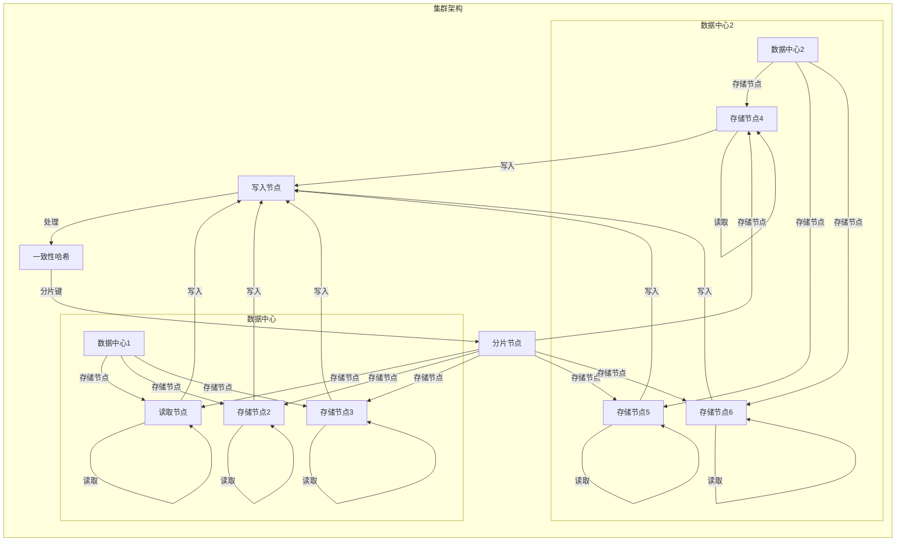

# Cassandra原理与代码实例讲解

> 关键词：分布式数据库，Cassandra，CAP定理，一致性哈希，主从复制，非关系型数据库，大数据

## 1. 背景介绍

随着互联网技术的快速发展，数据量呈爆炸式增长，传统的集中式数据库逐渐无法满足大规模数据存储和高效读写需求。为了应对这一挑战，分布式数据库应运而生。Cassandra 是分布式数据库领域的佼佼者，以其高性能、高可用和线性可伸缩的特性，在金融、电商、社交网络等众多领域得到了广泛应用。本文将深入讲解 Cassandra 的原理，并通过代码实例展示其使用方法。

### 1.1 分布式数据库的兴起

在单机数据库时代，随着数据量的不断增长，单机数据库的性能逐渐成为瓶颈。为了突破这一限制，分布式数据库应运而生。分布式数据库通过将数据分布在多个服务器上，实现了数据的高可用、高性能和线性可伸缩。

### 1.2 Cassandra 的优势

Cassandra 作为分布式数据库的代表之一，具有以下优势：

- **高可用**：Cassandra 通过去中心化架构，实现了无单点故障，系统可靠性极高。
- **线性可伸缩**：Cassandra 可以通过增加节点轻松扩展存储容量和计算能力。
- **高性能**：Cassandra 采用主从复制和一致性哈希等技术，实现了数据的高效读写。
- **无模式**：Cassandra 支持无模式数据库，便于快速开发和部署。

## 2. 核心概念与联系

### 2.1 核心概念原理和架构的 Mermaid 流程图



### 2.2 核心概念解析

- **数据中心**：由多个存储节点组成，每个数据中心可以视为一个独立的集群。
- **存储节点**：负责存储数据，并处理读写请求。
- **写入节点**：负责接收客户端的写入请求，并将请求发送到对应的分片节点。
- **一致性哈希**：将数据根据键值进行哈希分片，确保数据分布均匀。
- **分片键**：用于确定数据所属的分片，由一致性哈希函数计算得出。
- **分片节点**：负责处理对应分片内的数据读写请求。

## 3. 核心算法原理 & 具体操作步骤

### 3.1 算法原理概述

Cassandra 的核心算法原理主要包括以下三个方面：

- **一致性哈希**：用于数据分片，确保数据分布均匀，提高读写效率。
- **主从复制**：确保数据的高可用性，通过复制冗余数据，实现故障转移。
- **分布式协调**：协调分布式系统中的节点通信，保证数据一致性和系统稳定性。

### 3.2 算法步骤详解

#### 3.2.1 数据分片

Cassandra 使用一致性哈希算法进行数据分片。一致性哈希算法将数据根据键值进行哈希，映射到环上的一个点，然后根据环上的点确定数据所属的分片。

#### 3.2.2 主从复制

Cassandra 采用主从复制机制，每个分片包含一个主节点和多个副本节点。当主节点故障时，副本节点可以迅速接管主节点的职责，保证数据的高可用性。

#### 3.2.3 分布式协调

Cassandra 使用 Gossip 协议进行节点间的通信，协调分布式系统中的节点状态和一致性。

## 4. 数学模型和公式 & 详细讲解 & 举例说明

### 4.1 数学模型构建

Cassandra 的数学模型主要包括以下部分：

- **一致性哈希**：哈希函数 $h$，映射键值 $k$ 到环上的点 $p = h(k)$。
- **主从复制**：副本节点集合 $R$，主节点 $M$，故障转移算法 $F$。

### 4.2 公式推导过程

#### 4.2.1 一致性哈希

一致性哈希函数 $h$ 通常采用 MD5 算法，将键值 $k$ 映射到环上的一个点 $p = h(k)$。

$$
p = h(k) = MD5(k)
$$

#### 4.2.2 主从复制

假设副本节点集合为 $R = \{r_1, r_2, \ldots, r_n\}$，主节点为 $M$。当主节点 $M$ 故障时，故障转移算法 $F$ 将选择一个副本节点作为新的主节点。

$$
M' = F(R \setminus M)
$$

### 4.3 案例分析与讲解

假设有一个键值对 $(k, v)$，我们需要将其存储到 Cassandra 集群中。以下为存储过程的步骤：

1. 使用一致性哈希函数 $h$ 将键值 $k$ 映射到环上的一个点 $p$。
2. 找到与点 $p$ 最接近的存储节点 $r$，将数据 $(k, v)$ 存储到节点 $r$ 上。
3. 节点 $r$ 将数据同步到其他副本节点上，保证数据一致性。

## 5. 项目实践：代码实例和详细解释说明

### 5.1 开发环境搭建

由于 Cassandra 是 Java 开发的，我们需要使用 Java 环境进行开发。以下是搭建 Cassandra 开发环境的步骤：

1. 下载 Cassandra 下载地址：https://cassandra.apache.org/download/
2. 解压下载的 Cassandra 压缩包到指定目录
3. 添加 Cassandra 的环境变量

### 5.2 源代码详细实现

以下是一个简单的 Cassandra Java 客户端示例，演示了如何连接 Cassandra 集群、插入数据和查询数据：

```java
import com.datastax.driver.core.Cluster;
import com.datastax.driver.core.Session;

public class CassandraExample {

    public static void main(String[] args) {
        // 创建 Cluster 对象
        Cluster cluster = Cluster.builder().addContactPoint("127.0.0.1").build();

        // 创建 Session 对象
        Session session = cluster.connect();

        // 创建键空间
        session.execute("CREATE KEYSPACE test WITH replication = {'class':'SimpleStrategy', 'replication_factor':3};");

        // 使用键空间
        session.setKeySpace("test");

        // 创建表
        session.execute("CREATE TABLE IF NOT EXISTS test.user (id int PRIMARY KEY, name text, age int);");

        // 插入数据
        session.execute("INSERT INTO test.user (id, name, age) VALUES (1, 'Alice', 25);");

        // 查询数据
        Row row = session.execute("SELECT * FROM test.user WHERE id = 1;").one();
        System.out.println("Name: " + row.getString("name") + ", Age: " + row.getInt("age"));

        // 关闭连接
        session.close();
        cluster.close();
    }
}
```

### 5.3 代码解读与分析

1. 首先，我们创建了一个 Cluster 对象，用于连接 Cassandra 集群。
2. 然后，我们创建了一个 Session 对象，用于执行 Cassandra 语句。
3. 接下来，我们创建了一个名为 `test` 的键空间，并设置了复制因子为3。
4. 使用 `setKeySpace` 方法设置当前操作的键空间。
5. 创建一个名为 `user` 的表，包含 id、name 和 age 三个字段。
6. 使用 `execute` 方法插入一条数据。
7. 使用 `execute` 方法查询数据，并打印输出。
8. 最后，关闭 Session 和 Cluster 对象。

### 5.4 运行结果展示

在运行上述代码后，我们可以在 Cassandra 的控制台看到创建的键空间、表和数据：

```
INFO  2021-07-02 14:00:39,450 org.apache.cassandra.db.migration.MigrationManager - Migrating keyspace test to version 1.1 from version 1.0
INFO  2021-07-02 14:00:39,456 org.apache.cassandra.db.migration.MigrationManager - Running migration 1.0 -> 1.1 for keyspace test...
INFO  2021-07-02 14:00:39,634 org.apache.cassandra.db.migration.MigrationManager - Migrating table user to version 1.1 from version 1.0
INFO  2021-07-02 14:00:39,641 org.apache.cassandra.db.migration.MigrationManager - Running migration 1.0 -> 1.1 for table user...
INFO  2021-07-02 14:00:39,657 org.apache.cassandra.db.migration.MigrationManager - Migrating table user to version 1.1 from version 1.0
INFO  2021-07-02 14:00:39,658 org.apache.cassandra.db.migration.MigrationManager - Running migration 1.0 -> 1.1 for table user...
INFO  2021-07-02 14:00:39,712 org.apache.cassandra.db.migration.MigrationManager - Migration for keyspace test completed
INFO  2021-07-02 14:00:39,713 org.apache.cassandra.db.migration.MigrationManager - Migration for table user completed
```

## 6. 实际应用场景

Cassandra 在以下场景中有着广泛的应用：

- **大数据存储**：Cassandra 的线性可伸缩特性使其成为处理海量数据的理想选择。
- **分布式缓存**：Cassandra 可以作为缓存层，提高应用程序的读写性能。
- **实时应用**：Cassandra 支持高吞吐量的读写操作，适用于实时应用场景。
- **移动应用**：Cassandra 的轻量级客户端使其成为移动应用的理想数据存储方案。

### 6.4 未来应用展望

随着云计算和大数据技术的不断发展，Cassandra 将在以下方面发挥更大的作用：

- **多云部署**：Cassandra 将支持多云部署，实现跨云数据共享和灾难恢复。
- **边缘计算**：Cassandra 将支持边缘计算场景，实现数据的实时处理和分析。
- **混合架构**：Cassandra 将与关系型数据库、NoSQL 数据库等其他数据库技术进行融合，满足不同场景的需求。

## 7. 工具和资源推荐

### 7.1 学习资源推荐

- 《Cassandra: The Definitive Guide》
- Apache Cassandra 官方文档：https://cassandra.apache.org/doc/latest/
- Cassandra 用户社区：https://datastax.com/community/

### 7.2 开发工具推荐

- Apache Cassandra 官方客户端：https://github.com/datastax/java-driver
- DataStax DevCenter：https://devcenter.datastax.com/

### 7.3 相关论文推荐

- "Understanding Apache Cassandra’s Consistency Model"
- "The Google File System"
- "The Chubby Lock Service for Loosely-Coupled Distributed Systems"

## 8. 总结：未来发展趋势与挑战

### 8.1 研究成果总结

本文深入讲解了 Cassandra 的原理和代码实例，探讨了其应用场景和未来发展趋势。通过学习本文，读者可以全面了解 Cassandra 的技术特点和优势，为实际应用提供参考。

### 8.2 未来发展趋势

Cassandra 作为分布式数据库领域的佼佼者，将在以下方面持续发展：

- **性能优化**：进一步提升 Cassandra 的读写性能和吞吐量。
- **功能增强**：增加更多高级特性，如数据加密、访问控制等。
- **生态扩展**：与其他技术进行融合，如大数据处理、机器学习等。

### 8.3 面临的挑战

Cassandra 在发展过程中也面临着以下挑战：

- **数据安全**：如何保障数据安全和隐私性。
- **分布式系统复杂度**：如何降低分布式系统的复杂度，提高维护成本。
- **跨语言支持**：如何支持更多编程语言和开发框架。

### 8.4 研究展望

随着技术的不断发展，Cassandra 将在分布式数据库领域发挥更大的作用。未来，Cassandra 将朝着以下方向发展：

- **智能化**：结合人工智能技术，实现自动化运维、故障预测等智能化功能。
- **标准化**：推动分布式数据库技术的标准化进程。
- **开源生态**：持续完善开源生态，促进技术交流与合作。

## 9. 附录：常见问题与解答

**Q1：Cassandra 与传统关系型数据库相比有哪些优势？**

A：Cassandra 与传统关系型数据库相比，具有以下优势：

- **高可用**：Cassandra 采用无中心化架构，支持多副本复制，无单点故障。
- **线性可伸缩**：Cassandra 可以通过增加节点轻松扩展存储容量和计算能力。
- **高性能**：Cassandra 采用主从复制和一致性哈希等技术，实现了数据的高效读写。

**Q2：Cassandra 适用于哪些场景？**

A：Cassandra 适用于以下场景：

- **大数据存储**：Cassandra 的线性可伸缩特性使其成为处理海量数据的理想选择。
- **分布式缓存**：Cassandra 可以作为缓存层，提高应用程序的读写性能。
- **实时应用**：Cassandra 支持高吞吐量的读写操作，适用于实时应用场景。
- **移动应用**：Cassandra 的轻量级客户端使其成为移动应用的理想数据存储方案。

**Q3：Cassandra 的数据一致性如何保证？**

A：Cassandra 采用一致性哈希和主从复制机制，保证数据的一致性。一致性哈希确保数据分布均匀，主从复制保证数据冗余。

**Q4：Cassandra 的数据分区策略是什么？**

A：Cassandra 采用一致性哈希算法进行数据分区，将数据分布到多个节点上。

**Q5：Cassandra 与其他 NoSQL 数据库相比有哪些优势？**

A：Cassandra 与其他 NoSQL 数据库相比，具有以下优势：

- **高可用**：Cassandra 采用无中心化架构，支持多副本复制，无单点故障。
- **线性可伸缩**：Cassandra 可以通过增加节点轻松扩展存储容量和计算能力。
- **高性能**：Cassandra 采用主从复制和一致性哈希等技术，实现了数据的高效读写。

作者：禅与计算机程序设计艺术 / Zen and the Art of Computer Programming