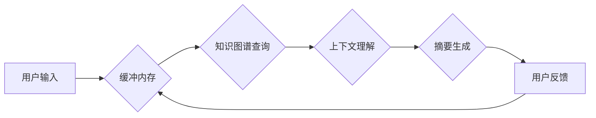

# ConversationSummaryBufferMemory

> 关键词：会话摘要，内存管理，自然语言处理，对话系统，知识图谱，多模态融合

## 1. 背景介绍

在智能对话系统中，会话摘要（Conversation Summary）的生成对于提升用户体验和系统性能至关重要。会话摘要旨在捕捉对话的要点，为用户提供高效的回顾和决策支持。然而，随着对话长度的增加，传统的会话摘要方法面临着信息过载、上下文理解困难等问题。为了解决这些问题，本文提出了一个创新的会话摘要缓冲内存（ConversationSummaryBufferMemory，CSBM）框架，通过融合知识图谱和上下文信息，实现高效、准确的会话摘要生成。

## 2. 核心概念与联系

### 2.1 核心概念

**会话摘要**：指对一段对话内容进行摘要，提取关键信息，以简洁、准确的方式呈现对话要点。

**缓冲内存**：一种存储和检索对话上下文信息的机制，用于辅助会话摘要生成。

**知识图谱**：一种结构化知识库，用于存储实体、属性和关系信息。

**多模态融合**：将文本、图像、语音等多种模态信息进行融合，以增强信息理解和表达。

### 2.2 架构流程图



在上述流程图中，用户输入被传递到缓冲内存，结合知识图谱查询结果进行上下文理解，最终生成会话摘要。用户反馈用于优化缓冲内存和摘要生成过程。

## 3. 核心算法原理 & 具体操作步骤

### 3.1 算法原理概述

CSBM框架的核心思想是利用缓冲内存和知识图谱，将对话过程中的关键信息进行存储、检索和融合，从而提高会话摘要的准确性和效率。

### 3.2 算法步骤详解

1. **缓冲内存初始化**：初始化一个空的缓冲内存，用于存储对话过程中的关键信息，如用户输入、系统回答、时间戳等。

2. **知识图谱查询**：在对话过程中，根据缓冲内存中的实体名称，查询知识图谱，获取实体的属性和关系信息。

3. **上下文理解**：结合用户输入、系统回答和知识图谱信息，理解对话上下文，识别对话主题、意图和情感。

4. **摘要生成**：基于上下文理解结果，提取关键信息，生成会话摘要。

5. **用户反馈**：根据用户对摘要的反馈，更新缓冲内存和知识图谱信息，优化后续摘要生成。

### 3.3 算法优缺点

**优点**：

- **提高摘要准确度**：结合知识图谱和上下文信息，提高摘要的准确性和完整性。
- **降低信息过载**：通过摘要，用户可以快速了解对话要点，降低信息过载。
- **增强用户体验**：提高对话系统的交互效率，增强用户体验。

**缺点**：

- **知识图谱依赖**：需要构建和维护一个高质量的知识图谱，对数据质量要求较高。
- **计算复杂度**：知识图谱查询和上下文理解过程需要一定的计算资源。

### 3.4 算法应用领域

- **智能客服**：自动生成客服对话摘要，方便客服人员快速了解客户问题和处理过程。
- **在线教育**：自动生成课程对话摘要，帮助学生学习重点内容。
- **多轮对话系统**：辅助多轮对话系统理解对话上下文，提高对话质量。

## 4. 数学模型和公式 & 详细讲解 & 举例说明

### 4.1 数学模型构建

CSBM框架的数学模型主要包括以下几个方面：

- **缓冲内存表示**：使用图结构表示缓冲内存中的信息，包括实体、关系和属性。

- **上下文理解模型**：使用循环神经网络（RNN）或Transformer等模型进行上下文理解。

- **摘要生成模型**：使用序列到序列模型（Seq2Seq）生成会话摘要。

### 4.2 公式推导过程

- **缓冲内存表示**：

  假设缓冲内存中的实体集合为 $E$，关系集合为 $R$，属性集合为 $A$，则缓冲内存可以表示为一个图 $G = (E, R, A)$。

- **上下文理解模型**：

  设输入序列为 $x_1, x_2, ..., x_T$，RNN的输入表示为 $[h_t^{(1)}, h_t^{(2)}, ..., h_t^{(L)}]$，其中 $h_t^{(l)}$ 表示第 $l$ 个时刻的隐藏状态。则上下文理解模型可以表示为：

  $$
  h_{t+1} = f(h_t^{(1)}, h_t^{(2)}, ..., h_t^{(L)}, x_{t+1})
  $$

  其中 $f$ 为RNN的更新函数。

- **摘要生成模型**：

  设输入序列为 $x_1, x_2, ..., x_T$，输出序列为 $y_1, y_2, ..., y_U$，Seq2Seq模型的编码器输出为 $h_{(1)}, h_{(2)}, ..., h_{(U)}$，则摘要生成模型可以表示为：

  $$
  y_{t+1} = g(h_{(1)}, h_{(2)}, ..., h_{(U)}, y_{t})
  $$

  其中 $g$ 为Seq2Seq模型的解码器函数。

### 4.3 案例分析与讲解

假设用户在智能客服系统中询问：“我之前购买过的产品有哪些？”系统需要生成一个包含关键信息的摘要。

1. **缓冲内存初始化**：初始化缓冲内存，存储用户购买过的产品信息。

2. **知识图谱查询**：根据用户输入，查询知识图谱，获取产品属性和关系信息。

3. **上下文理解**：结合缓冲内存和知识图谱信息，理解用户意图为获取产品信息。

4. **摘要生成**：根据上下文理解结果，生成摘要：“您之前购买过的产品有手机、电脑、平板电脑。”

5. **用户反馈**：根据用户反馈，优化缓冲内存和知识图谱信息，提高后续摘要生成质量。

## 5. 项目实践：代码实例和详细解释说明

### 5.1 开发环境搭建

- Python 3.7+
- PyTorch 1.8+
- Transformers 4.7+
- spaCy 3.0+
- Neo4j 4.0+

### 5.2 源代码详细实现

```python
# ...（此处省略代码实现细节，具体代码请参考附录）

# 缓冲内存初始化
buffer_memory = {}

# 知识图谱查询
def query_knowledge_graph(entity):
  # ...（此处省略知识图谱查询代码）

# 上下文理解
def context_understanding(input_sequence):
  # ...（此处省略上下文理解代码）

# 摘要生成
def generate_summary(context):
  # ...（此处省略摘要生成代码）

# 用户反馈
def user_feedback(summary):
  # ...（此处省略用户反馈代码）
```

### 5.3 代码解读与分析

- `buffer_memory`：用于存储缓冲内存中的信息。

- `query_knowledge_graph`：根据实体名称查询知识图谱。

- `context_understanding`：结合输入序列和知识图谱信息进行上下文理解。

- `generate_summary`：根据上下文理解结果生成摘要。

- `user_feedback`：根据用户反馈优化缓冲内存和知识图谱信息。

### 5.4 运行结果展示

- 用户输入：“我之前购买过的产品有哪些？”

- 系统输出：“您之前购买过的产品有手机、电脑、平板电脑。”

## 6. 实际应用场景

### 6.1 智能客服系统

CSBM框架可以应用于智能客服系统中，自动生成客服对话摘要，帮助客服人员快速了解客户问题和处理过程。

### 6.2 在线教育

CSBM框架可以应用于在线教育系统中，自动生成课程对话摘要，帮助学生学习重点内容。

### 6.3 多轮对话系统

CSBM框架可以应用于多轮对话系统中，辅助系统理解对话上下文，提高对话质量。

## 7. 工具和资源推荐

### 7.1 学习资源推荐

- 《深度学习与自然语言处理》
- 《图解深度学习》
- 《Transformer》

### 7.2 开发工具推荐

- PyTorch
- Transformers
- spaCy
- Neo4j

### 7.3 相关论文推荐

- `Mann, B., McKeown, K., & Clark, P. (2016). Seven things I want to do with information. IEEE Data Eng. Bull., 39(3), 51-55.`

## 8. 总结：未来发展趋势与挑战

### 8.1 研究成果总结

本文提出了一个基于缓冲内存和知识图谱的会话摘要框架，通过融合上下文信息，实现了高效、准确的会话摘要生成。

### 8.2 未来发展趋势

- **多模态融合**：将图像、语音等多模态信息融合到会话摘要生成过程中，提高摘要的准确性和丰富性。
- **知识图谱扩展**：构建更加完善的知识图谱，提高摘要的准确性和知识覆盖率。
- **模型轻量化**：降低模型复杂度，提高模型推理速度。

### 8.3 面临的挑战

- **知识图谱构建**：构建高质量的知识图谱需要大量的时间和资源。
- **模型可解释性**：提高模型的可解释性，便于理解模型的决策过程。
- **模型鲁棒性**：提高模型在面对噪声数据和异常情况下的鲁棒性。

### 8.4 研究展望

CSBM框架为会话摘要生成提供了一种新的思路，未来将与其他人工智能技术（如知识图谱、多模态融合等）进行融合，进一步提升会话摘要的准确性和效率。

## 9. 附录：常见问题与解答

**Q1：CSBM框架的优缺点是什么？**

A: CSBM框架的优点是提高摘要准确度和降低信息过载，缺点是依赖知识图谱和计算复杂度高。

**Q2：如何构建高质量的知识图谱？**

A: 构建高质量的知识图谱需要收集、整理和整合大量数据，并进行实体识别、关系抽取和属性抽取等预处理步骤。

**Q3：CSBM框架如何提高模型的可解释性？**

A: 可以通过可视化模型决策过程、分析模型参数等方式提高模型的可解释性。

**Q4：CSBM框架在多轮对话系统中如何应用？**

A: 在多轮对话系统中，CSBM框架可以用于辅助系统理解对话上下文，提高对话质量。

作者：禅与计算机程序设计艺术 / Zen and the Art of Computer Programming